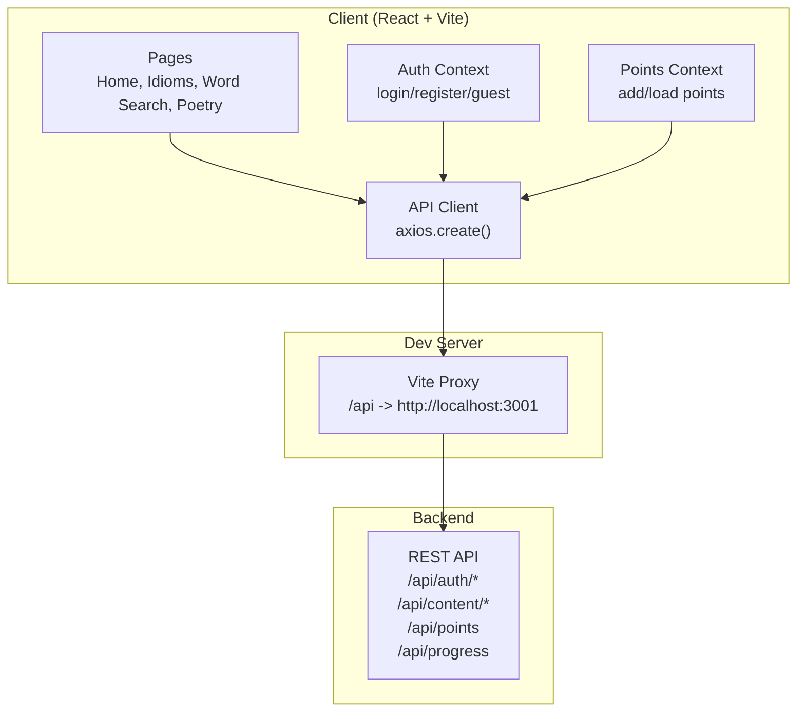
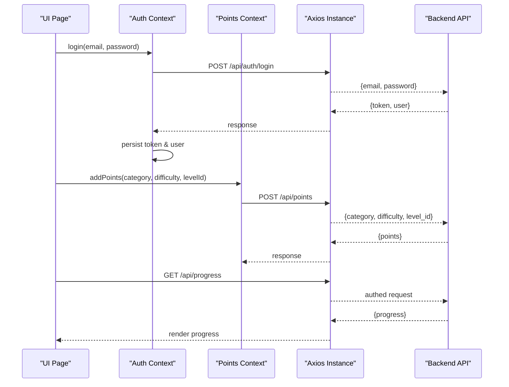
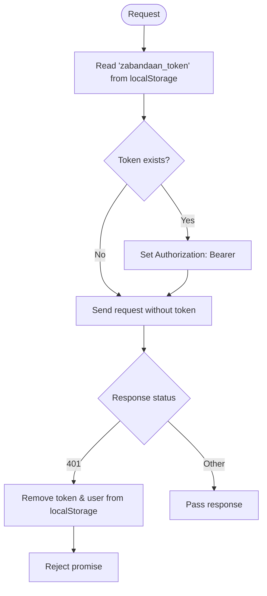
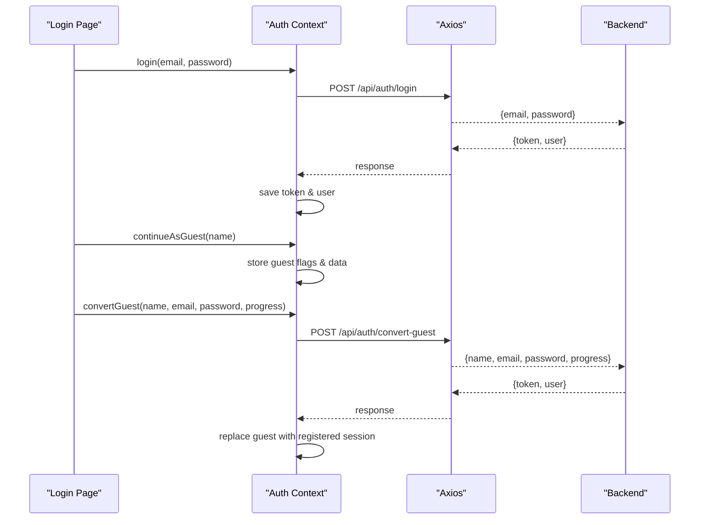
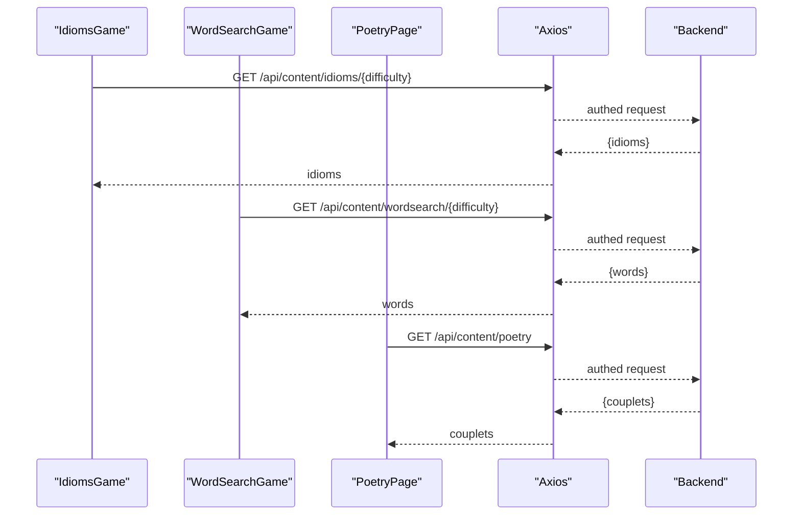
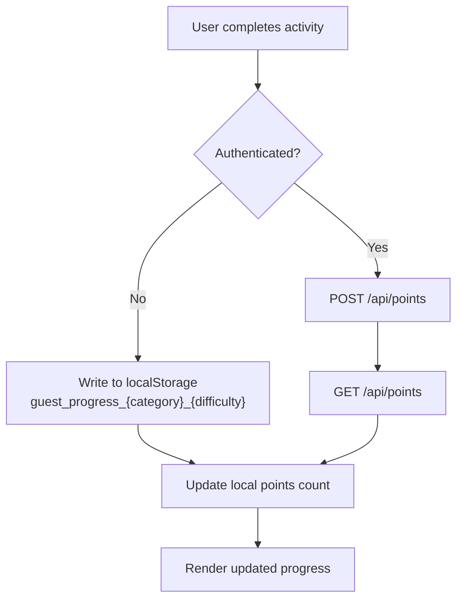
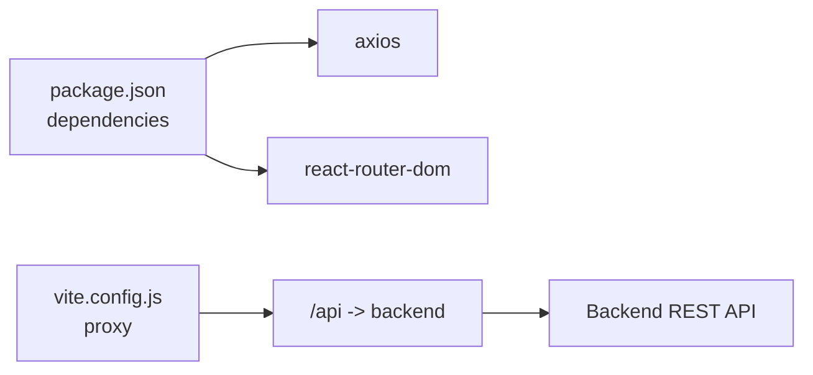

# API Integration

<cite>
**Referenced Files in This Document**
- [index.js](file://zabandaan/client/src/api/index.js)
- [AuthContext.jsx](file://zabandaan/client/src/context/AuthContext.jsx)
- [PointsContext.jsx](file://zabandaan/client/src/context/PointsContext.jsx)
- [Home.jsx](file://zabandaan/client/src/pages/Home.jsx)
- [IdiomsGame.jsx](file://zabandaan/client/src/pages/idioms/IdiomsGame.jsx)
- [WordSearchGame.jsx](file://zabandaan/client/src/pages/wordsearch/WordSearchGame.jsx)
- [PoetryPage.jsx](file://zabandaan/client/src/pages/poetry/PoetryPage.jsx)
- [vite.config.js](file://zabandaan/client/vite.config.js)
- [package.json](file://zabandaan/client/package.json)
- [schema.sql](file://zabandaan/database/schema.sql)
</cite>

## Table of Contents
1. Introduction
2. Project Structure
3. Core Components
4. Architecture Overview
5. Detailed Component Analysis
6. Dependency Analysis
7. Performance Considerations
8. Troubleshooting Guide
9. Conclusion
10. Appendices

## Introduction
This document describes the client-side API integration for Zabandaan, focusing on HTTP client configuration with Axios, automatic token attachment via interceptors, error handling strategies, and organization of API endpoints. It covers authentication flows, content fetching, progress tracking, and provides guidance for adding new endpoints while maintaining consistent error handling and security practices.

## Project Structure
The client is a React application using Vite. The API layer is centralized in a single Axios instance that configures base URL, default headers, and request/response interceptors. Authentication state and points/progress are managed via React contexts. Game pages consume content and submit progress to the server. Development proxies route /api requests to the backend server.

**Diagram sources**
- [index.js:3-29](file://zabandaan/client/src/api/index.js#L3-L29)
- [vite.config.js:4-14](file://zabandaan/client/vite.config.js#L4-L14)

**Section sources**
- [index.js:1-29](file://zabandaan/client/src/api/index.js#L1-L29)
- [vite.config.js:1-15](file://zabandaan/client/vite.config.js#L1-L15)
- [package.json:11-15](file://zabandaan/client/package.json#L11-L15)

## Core Components
- API client: Centralized Axios instance with baseURL "/api", JSON content type, request interceptor to attach Authorization header from localStorage, and response interceptor to clear tokens on 401.
- Auth context: Manages login, register, guest mode, and conversion to registered user; persists token and user data in localStorage; calls /api/auth endpoints.
- Points context: Tracks points and progress; posts to /api/points when authenticated; reads /api/points for total; handles offline/local storage for guests; integrates with progress loading.
- Pages: Fetch content via /api/content/* and load progress via /api/progress; use points context to record achievements.

Key responsibilities:
- Token lifecycle: read/write from localStorage, auto-injection into requests, cleanup on 401 or logout.
- Error handling: global 401 handling plus per-call try/catch patterns in contexts and pages.
- Offline capability: Guest mode stores progress locally until converted to a registered session.

**Section sources**
- [index.js:3-29](file://zabandaan/client/src/api/index.js#L3-L29)
- [AuthContext.jsx:6-97](file://zabandaan/client/src/context/AuthContext.jsx#L6-L97)
- [PointsContext.jsx:7-114](file://zabandaan/client/src/context/PointsContext.jsx#L7-L114)
- [Home.jsx:21-53](file://zabandaan/client/src/pages/Home.jsx#L21-L53)

## Architecture Overview
The client uses a single Axios instance to communicate with the backend. All authenticated requests automatically include a Bearer token. On 401 responses, the client clears stored credentials to force re-authentication. Content is fetched from category-specific endpoints, and progress is recorded through a unified points endpoint.

**Diagram sources**
- [AuthContext.jsx:31-74](file://zabandaan/client/src/context/AuthContext.jsx#L31-L74)
- [PointsContext.jsx:12-75](file://zabandaan/client/src/context/PointsContext.jsx#L12-L75)
- [Home.jsx:28-53](file://zabandaan/client/src/pages/Home.jsx#L28-L53)
- [index.js:8-27](file://zabandaan/client/src/api/index.js#L8-L27)

## Detailed Component Analysis

### HTTP Client Configuration and Interceptors
- Base configuration: baseURL set to "/api" with JSON content type.
- Request interceptor: Reads token from localStorage and attaches Authorization header if present.
- Response interceptor: Clears token and user data on 401 responses and rejects the promise to propagate errors.

**Diagram sources**
- [index.js:8-27](file://zabandaan/client/src/api/index.js#L8-L27)

**Section sources**
- [index.js:3-29](file://zabandaan/client/src/api/index.js#L3-L29)

### Authentication Endpoints and Flow
- Endpoints used:
  - POST /api/auth/login
  - POST /api/auth/register
  - POST /api/auth/convert-guest
- Behavior:
  - Login/Register: Expects {token, user} in response; stores both in localStorage; clears guest flags.
  - Convert guest: Merges local guest progress into a registered account; returns {token, user}.
  - Logout: Clears all local auth and guest state.

**Diagram sources**
- [AuthContext.jsx:31-74](file://zabandaan/client/src/context/AuthContext.jsx#L31-L74)

**Section sources**
- [AuthContext.jsx:6-97](file://zabandaan/client/src/context/AuthContext.jsx#L6-L97)

### Content Endpoints
- GET /api/content/idioms/{difficulty}: Returns idioms list for quiz.
- GET /api/content/wordsearch/{difficulty}: Returns word lists for puzzle generation.
- GET /api/content/poetry: Returns couplets for reading.

Usage examples:
- IdiomsGame fetches idioms by difficulty and renders options.
- WordSearchGame fetches words, generates grid locally, and tracks found words.
- PoetryPage loads couplets and marks them as read.

**Diagram sources**
- [IdiomsGame.jsx:31-49](file://zabandaan/client/src/pages/idioms/IdiomsGame.jsx#L31-L49)
- [WordSearchGame.jsx:26-50](file://zabandaan/client/src/pages/wordsearch/WordSearchGame.jsx#L26-L50)
- [PoetryPage.jsx:15-32](file://zabandaan/client/src/pages/poetry/PoetryPage.jsx#L15-L32)

**Section sources**
- [IdiomsGame.jsx:1-128](file://zabandaan/client/src/pages/idioms/IdiomsGame.jsx#L1-L128)
- [WordSearchGame.jsx:1-113](file://zabandaan/client/src/pages/wordsearch/WordSearchGame.jsx#L1-L113)
- [PoetryPage.jsx:1-63](file://zabandaan/client/src/pages/poetry/PoetryPage.jsx#L1-L63)

### Progress and Points Tracking
- POST /api/points: Submits achievement events with category, difficulty, and level identifier.
- GET /api/points: Retrieves current total points.
- GET /api/progress: Retrieves per-category progress arrays for display.

Behavior:
- For guests, progress is tracked locally in localStorage keys prefixed with "guest_progress_".
- For authenticated users, progress is persisted server-side and loaded on Home page.

**Diagram sources**
- [PointsContext.jsx:12-75](file://zabandaan/client/src/context/PointsContext.jsx#L12-L75)
- [Home.jsx:28-53](file://zabandaan/client/src/pages/Home.jsx#L28-L53)

**Section sources**
- [PointsContext.jsx:7-114](file://zabandaan/client/src/context/PointsContext.jsx#L7-L114)
- [Home.jsx:21-53](file://zabandaan/client/src/pages/Home.jsx#L21-L53)

### Error Handling Strategies
- Global 401 handling: Clears token and user data to force re-login.
- Per-call error handling: Each page/context catches network and server errors, sets user-visible messages, and maintains loading states.
- Guest vs authenticated paths: Errors during sync do not break guest experience; local progress remains intact.

Patterns observed:
- Try/catch around async API calls with console.error logging.
- User-facing error strings derived from server responses where available.
- Defensive checks for empty or malformed data before rendering.

**Section sources**
- [index.js:17-27](file://zabandaan/client/src/api/index.js#L17-L27)
- [IdiomsGame.jsx:31-49](file://zabandaan/client/src/pages/idioms/IdiomsGame.jsx#L31-L49)
- [WordSearchGame.jsx:26-50](file://zabandaan/client/src/pages/wordsearch/WordSearchGame.jsx#L26-L50)
- [PoetryPage.jsx:15-32](file://zabandaan/client/src/pages/poetry/PoetryPage.jsx#L15-L32)
- [PointsContext.jsx:31-75](file://zabandaan/client/src/context/PointsContext.jsx#L31-L75)

### Security Considerations
- Token storage: Tokens and user data are stored in localStorage. Ensure HTTPS in production and consider secure storage alternatives for sensitive apps.
- CORS: In development, Vite proxies /api to the backend, avoiding CORS issues. In production, configure the frontend domain to serve over HTTPS and ensure the backend allows the correct origins.
- Input validation: Forms enforce required fields and minimum length; additional server-side validation is recommended.
- CSRF: If using cookies for sessions elsewhere, implement CSRF protection. With bearer tokens, ensure endpoints validate signatures and scopes.

**Section sources**
- [vite.config.js:6-14](file://zabandaan/client/vite.config.js#L6-L14)
- [AuthContext.jsx:31-74](file://zabandaan/client/src/context/AuthContext.jsx#L31-L74)

## Dependency Analysis
- Axios is the sole HTTP client dependency used across contexts and pages.
- React Router drives navigation after successful authentication.
- Vite proxy simplifies development by forwarding /api requests to the backend.

**Diagram sources**
- [package.json:11-15](file://zabandaan/client/package.json#L11-L15)
- [vite.config.js:6-14](file://zabandaan/client/vite.config.js#L6-L14)

**Section sources**
- [package.json:1-21](file://zabandaan/client/package.json#L1-L21)
- [vite.config.js:1-15](file://zabandaan/client/vite.config.js#L1-L15)

## Performance Considerations
- Minimize redundant requests: Cache content where appropriate (e.g., idioms, poetry) using in-memory state or browser cache.
- Debounce progress submissions: Batch multiple small updates if needed to reduce network overhead.
- Optimize large payloads: Paginate or filter content endpoints for large datasets.
- Avoid blocking UI: Use loading states and graceful fallbacks during network delays.

[No sources needed since this section provides general guidance]

## Troubleshooting Guide
Common issues and resolutions:
- 401 Unauthorized:
  - Cause: Expired or missing token.
  - Resolution: Interceptor clears stale tokens; prompt user to log in again.
- Network errors:
  - Cause: Backend unreachable or CORS misconfiguration.
  - Resolution: Verify dev proxy settings; ensure production CORS allows the frontend origin.
- Data shape mismatches:
  - Cause: Backend response structure changed.
  - Resolution: Add defensive checks and default values in consumers; update contexts/pages accordingly.
- Guest progress not syncing:
  - Cause: Conversion failed or network error during convert-guest.
  - Resolution: Retry conversion flow; verify server accepts progress payload.

**Section sources**
- [index.js:17-27](file://zabandaan/client/src/api/index.js#L17-L27)
- [AuthContext.jsx:64-74](file://zabandaan/client/src/context/AuthContext.jsx#L64-L74)
- [Home.jsx:41-53](file://zabandaan/client/src/pages/Home.jsx#L41-L53)

## Conclusion
The client integrates with the backend via a centralized Axios instance that automates authentication and error handling. Contexts encapsulate business logic for auth and points/progress, while pages focus on content consumption and user interactions. Following the patterns outlined here will help maintain consistency, reliability, and security as new endpoints are added.

[No sources needed since this section summarizes without analyzing specific files]

## Appendices

### API Endpoint Reference
- Authentication
  - POST /api/auth/login
    - Request: { email, password }
    - Response: { token, user }
  - POST /api/auth/register
    - Request: { name, email, password }
    - Response: { token, user }
  - POST /api/auth/convert-guest
    - Request: { name, email, password, progress }
    - Response: { token, user }
- Content
  - GET /api/content/idioms/{difficulty}
    - Response: { idioms }
  - GET /api/content/wordsearch/{difficulty}
    - Response: { words }
  - GET /api/content/poetry
    - Response: { couplets }
- Points and Progress
  - POST /api/points
    - Request: { category, difficulty, level_id }
    - Response: { points }
  - GET /api/points
    - Response: { points }
  - GET /api/progress
    - Response: { progress }

Notes:
- All non-public endpoints require Authorization: Bearer <token>.
- Difficulty values align with game modes (e.g., easy, hard).
- Progress entries map to categories defined in the app (alphabets, idioms, wordsearch, poetry).

**Section sources**
- [AuthContext.jsx:31-74](file://zabandaan/client/src/context/AuthContext.jsx#L31-L74)
- [PointsContext.jsx:12-75](file://zabandaan/client/src/context/PointsContext.jsx#L12-L75)
- [Home.jsx:28-53](file://zabandaan/client/src/pages/Home.jsx#L28-L53)
- [IdiomsGame.jsx:31-49](file://zabandaan/client/src/pages/idioms/IdiomsGame.jsx#L31-L49)
- [WordSearchGame.jsx:26-50](file://zabandaan/client/src/pages/wordsearch/WordSearchGame.jsx#L26-L50)
- [PoetryPage.jsx:15-32](file://zabandaan/client/src/pages/poetry/PoetryPage.jsx#L15-L32)

### Adding a New Endpoint: Implementation Guidelines
- Define the endpoint call in the relevant context or utility module to keep concerns separated.
- Use the shared Axios instance for consistent headers and interceptors.
- Handle success and error cases uniformly:
  - Success: Update local state and UI.
  - Error: Log details and show user-friendly messages.
- For write operations, consider optimistic updates with rollback on failure.
- Validate inputs before sending requests; mirror validation on the server side.
- Test with both guest and authenticated flows to ensure offline/local behavior works.

**Section sources**
- [index.js:3-29](file://zabandaan/client/src/api/index.js#L3-L29)
- [AuthContext.jsx:31-74](file://zabandaan/client/src/context/AuthContext.jsx#L31-L74)
- [PointsContext.jsx:12-75](file://zabandaan/client/src/context/PointsContext.jsx#L12-L75)

### Database Schema Reference
- Users: id, name, email, password, created_at
- Progress: id, user_id, category, difficulty, current_level, completed_levels, last_played
- Content tables: idioms_content, wordsearch_wordlists, poetry_content

These schemas inform the expected shapes of progress and content returned by the API.

**Section sources**
- [schema.sql:1-54](file://zabandaan/database/schema.sql#L1-L54)