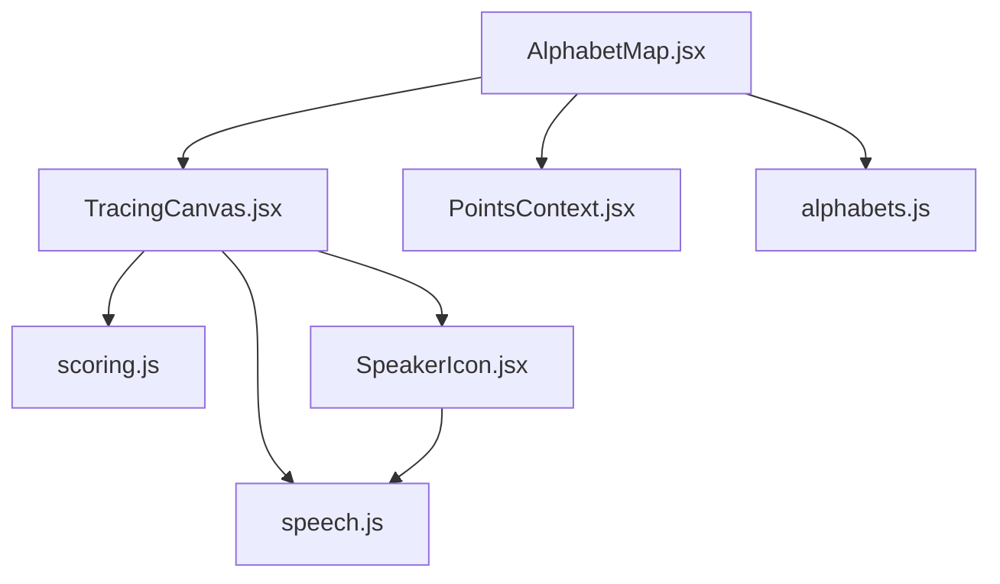
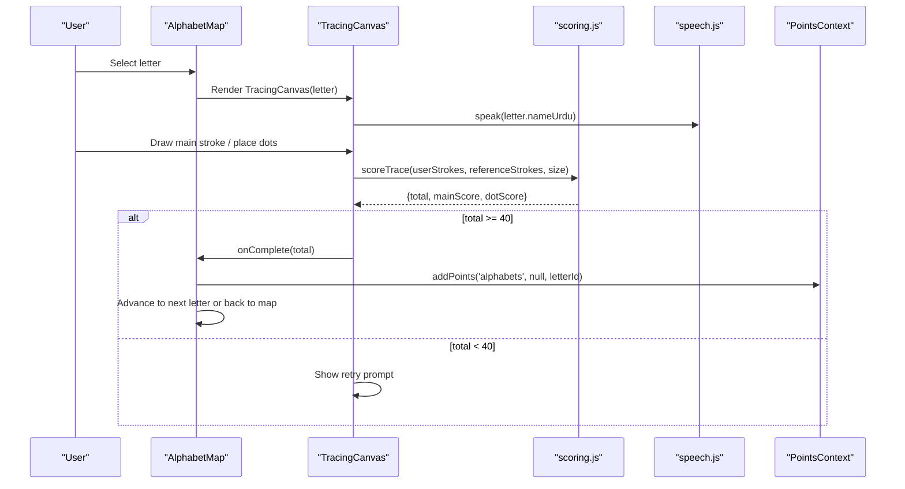
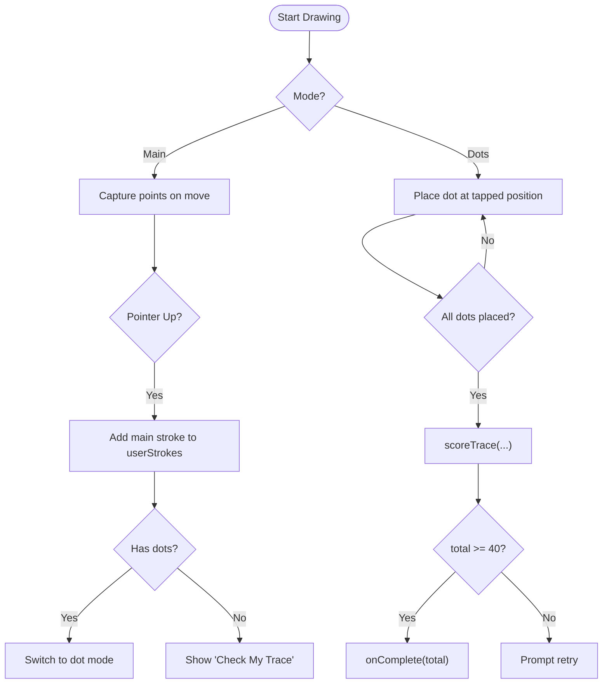
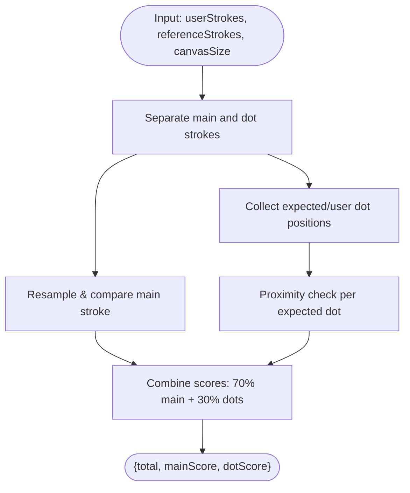
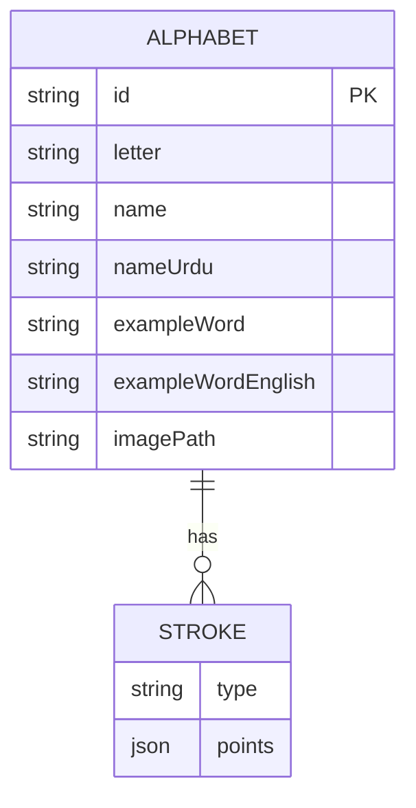
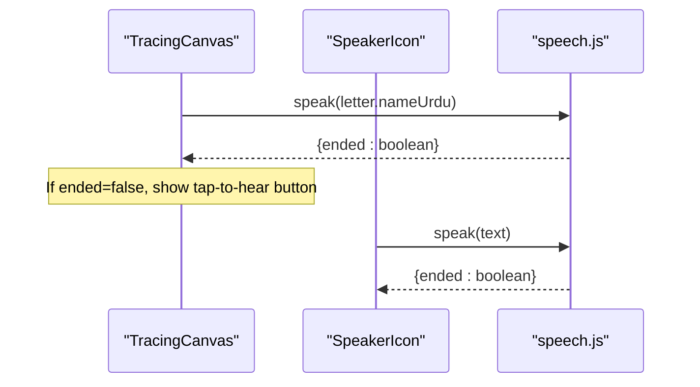
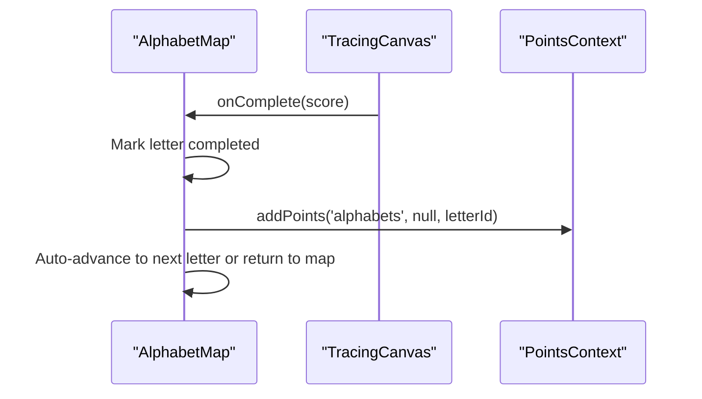
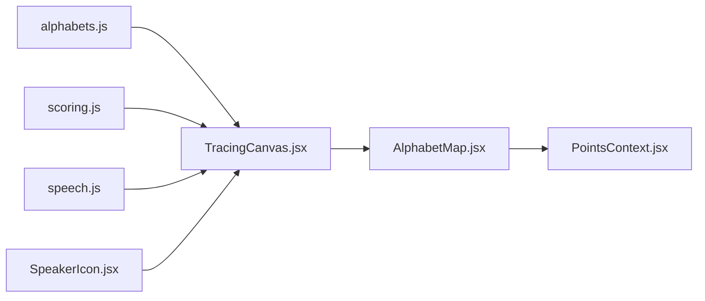

# Alphabet Learning Module

<cite>
**Referenced Files in This Document**
- [TracingCanvas.jsx](file://zabandaan/client/src/pages/alphabets/TracingCanvas.jsx)
- [AlphabetMap.jsx](file://zabandaan/client/src/pages/alphabets/AlphabetMap.jsx)
- [alphabets.js](file://zabandaan/client/src/data/alphabets.js)
- [scoring.js](file://zabandaan/client/src/utils/scoring.js)
- [speech.js](file://zabandaan/client/src/utils/speech.js)
- [PointsContext.jsx](file://zabandaan/client/src/context/PointsContext.jsx)
- [SpeakerIcon.jsx](file://zabandaan/client/src/components/SpeakerIcon.jsx)
- [PointsBadge.jsx](file://zabandaan/client/src/components/PointsBadge.jsx)
</cite>

## Table of Contents
1. [Introduction](#introduction)
2. [Project Structure](#project-structure)
3. [Core Components](#core-components)
4. [Architecture Overview](#architecture-overview)
5. [Detailed Component Analysis](#detailed-component-analysis)
6. [Dependency Analysis](#dependency-analysis)
7. [Performance Considerations](#performance-considerations)
8. [Troubleshooting Guide](#troubleshooting-guide)
9. [Conclusion](#conclusion)

## Introduction
This document explains the alphabet learning module focused on interactive letter tracing, stroke validation algorithms, and progressive difficulty levels. It covers how the TracingCanvas component handles multi-stroke drawing, touch and mouse gestures, scoring accuracy, and audio pronunciation integration. It also documents the alphabets data structure, scoring parameters, and how completion ties into points and progress tracking.

## Project Structure
The alphabet learning feature is implemented as a small set of React components and utilities:
- Data layer: alphabets data defines reference strokes and dot targets for each letter.
- UI layer: TracingCanvas renders the interactive canvas; AlphabetMap manages navigation and progression.
- Scoring: scoring.js validates user strokes against references and computes accuracy.
- Audio: speech.js provides Web Speech API integration for pronunciation.
- Progress: PointsContext tracks completed levels and points across sessions.

**Diagram sources**
- [AlphabetMap.jsx:1-90](file://zabandaan/client/src/pages/alphabets/AlphabetMap.jsx#L1-L90)
- [TracingCanvas.jsx:1-50](file://zabandaan/client/src/pages/alphabets/TracingCanvas.jsx#L1-L50)
- [scoring.js:100-140](file://zabandaan/client/src/utils/scoring.js#L100-L140)
- [speech.js:90-125](file://zabandaan/client/src/utils/speech.js#L90-L125)
- [PointsContext.jsx:12-46](file://zabandaan/client/src/context/PointsContext.jsx#L12-L46)
- [SpeakerIcon.jsx:1-67](file://zabandaan/client/src/components/SpeakerIcon.jsx#L1-L67)
- [alphabets.js:35-283](file://zabandaan/client/src/data/alphabets.js#L35-L283)

**Section sources**
- [AlphabetMap.jsx:1-90](file://zabandaan/client/src/pages/alphabets/AlphabetMap.jsx#L1-L90)
- [TracingCanvas.jsx:1-50](file://zabandaan/client/src/pages/alphabets/TracingCanvas.jsx#L1-L50)
- [alphabets.js:35-283](file://zabandaan/client/src/data/alphabets.js#L35-L283)

## Core Components
- TracingCanvas: Interactive canvas that supports main stroke drawing and dot placement modes, with real-time rendering and gesture handling.
- AlphabetMap: Manages letter selection, completion state, and progression to next letters.
- scoring.js: Validates strokes using resampling and ordered point-to-point distance; scores dots by proximity.
- speech.js: Wraps Web Speech API with voice loading, language prioritization, and async control.
- PointsContext: Persists and aggregates points and completed levels for guest and logged-in users.

**Section sources**
- [TracingCanvas.jsx:6-267](file://zabandaan/client/src/pages/alphabets/TracingCanvas.jsx#L6-L267)
- [AlphabetMap.jsx:12-90](file://zabandaan/client/src/pages/alphabets/AlphabetMap.jsx#L12-L90)
- [scoring.js:1-151](file://zabandaan/client/src/utils/scoring.js#L1-L151)
- [speech.js:1-140](file://zabandaan/client/src/utils/speech.js#L1-L140)
- [PointsContext.jsx:1-114](file://zabandaan/client/src/context/PointsContext.jsx#L1-L114)

## Architecture Overview
The flow begins when a user selects a letter from the AlphabetMap. The map passes the letter data to TracingCanvas, which renders guides and captures user input via mouse/touch events. Completed strokes are validated by scoring.js, and if the score meets the threshold, the map records completion, awards points, and advances to the next letter. Audio pronunciation is integrated via SpeakerIcon and speech.js.

**Diagram sources**
- [AlphabetMap.jsx:48-67](file://zabandaan/client/src/pages/alphabets/AlphabetMap.jsx#L48-L67)
- [TracingCanvas.jsx:244-261](file://zabandaan/client/src/pages/alphabets/TracingCanvas.jsx#L244-L261)
- [scoring.js:106-140](file://zabandaan/client/src/utils/scoring.js#L106-L140)
- [speech.js:90-125](file://zabandaan/client/src/utils/speech.js#L90-L125)
- [PointsContext.jsx:12-46](file://zabandaan/client/src/context/PointsContext.jsx#L12-L46)

## Detailed Component Analysis

### TracingCanvas: Multi-stroke Support and Gesture Handling
- Modes:
  - Main mode: Captures continuous strokes via mouse/touch events, building a currentStroke array of points until pointer up.
  - Dot mode: After the main stroke is drawn (if required), users tap to place dots near expected positions.
- Rendering:
  - High-DPI canvas setup ensures crisp visuals.
  - Draws faint guide letter, dashed reference path, start/end markers, and expected dot targets.
  - Smoothly draws user strokes using quadratic curves for visual quality.
- State management:
  - Tracks userStrokes (main and dot), currentStroke while drawing, mode transitions, and computed score.
- Completion logic:
  - On “Check My Trace,” calls scoring.js to compute accuracy. If total >= 40, triggers onComplete callback to advance progress.

**Diagram sources**
- [TracingCanvas.jsx:182-238](file://zabandaan/client/src/pages/alphabets/TracingCanvas.jsx#L182-L238)
- [TracingCanvas.jsx:244-261](file://zabandaan/client/src/pages/alphabets/TracingCanvas.jsx#L244-L261)

**Section sources**
- [TracingCanvas.jsx:23-180](file://zabandaan/client/src/pages/alphabets/TracingCanvas.jsx#L23-L180)
- [TracingCanvas.jsx:182-261](file://zabandaan/client/src/pages/alphabets/TracingCanvas.jsx#L182-L261)

### Stroke Validation Algorithms
- Resampling: Normalizes user and reference paths to a fixed number of samples for consistent comparison.
- Ordered distance: Compares point i to point i across resampled paths to measure deviation.
- Tolerance: Uses a percentage of the canvas diagonal to determine acceptable deviation.
- Dot scoring: Checks whether each expected dot has a user-placed dot within a generous radius.
- Weighted total: Combines main stroke score (70%) and dot score (30%) into a single accuracy metric.

**Diagram sources**
- [scoring.js:7-43](file://zabandaan/client/src/utils/scoring.js#L7-L43)
- [scoring.js:49-72](file://zabandaan/client/src/utils/scoring.js#L49-L72)
- [scoring.js:78-97](file://zabandaan/client/src/utils/scoring.js#L78-L97)
- [scoring.js:106-140](file://zabandaan/client/src/utils/scoring.js#L106-L140)

**Section sources**
- [scoring.js:1-151](file://zabandaan/client/src/utils/scoring.js#L1-L151)

### Alphabets Data Structure
- Each letter includes:
  - Identification and display fields (id, letter, name, nameUrdu).
  - Optional example word and image path.
  - Strokes array:
    - One or more main strokes defining the reference path(s).
    - Zero or more dot strokes specifying target positions for dot placement.
- Paths are normalized coordinates (0–1) and generated via smooth curve interpolation for natural shapes.

**Diagram sources**
- [alphabets.js:6-33](file://zabandaan/client/src/data/alphabets.js#L6-L33)
- [alphabets.js:35-283](file://zabandaan/client/src/data/alphabets.js#L35-L283)

**Section sources**
- [alphabets.js:35-283](file://zabandaan/client/src/data/alphabets.js#L35-L283)

### Audio Pronunciation Integration
- Automatic play: On load, attempts to speak the letter’s Urdu name; if blocked by browser policy, shows a tap-to-hear prompt.
- Voice selection: Prioritizes Urdu voices, falls back to Hindi or Arabic if needed.
- Controls: SpeakerIcon toggles speaking state and cancels ongoing speech.

**Diagram sources**
- [TracingCanvas.jsx:34-42](file://zabandaan/client/src/pages/alphabets/TracingCanvas.jsx#L34-L42)
- [TracingCanvas.jsx:286-296](file://zabandaan/client/src/pages/alphabets/TracingCanvas.jsx#L286-L296)
- [SpeakerIcon.jsx:8-34](file://zabandaan/client/src/components/SpeakerIcon.jsx#L8-L34)
- [speech.js:90-125](file://zabandaan/client/src/utils/speech.js#L90-L125)

**Section sources**
- [speech.js:1-140](file://zabandaan/client/src/utils/speech.js#L1-L140)
- [SpeakerIcon.jsx:1-67](file://zabandaan/client/src/components/SpeakerIcon.jsx#L1-L67)
- [TracingCanvas.jsx:34-42](file://zabandaan/client/src/pages/alphabets/TracingCanvas.jsx#L34-L42)

### Progressive Difficulty Levels and Progress Tracking
- Unlocking: Letters unlock sequentially; completing one unlocks the next.
- Completion: When TracingCanvas reports success (score >= 40), AlphabetMap marks the level complete and advances.
- Points: PointsContext adds points for completed levels, storing locally for guests or syncing via API for authenticated users.

**Diagram sources**
- [AlphabetMap.jsx:48-67](file://zabandaan/client/src/pages/alphabets/AlphabetMap.jsx#L48-L67)
- [PointsContext.jsx:12-46](file://zabandaan/client/src/context/PointsContext.jsx#L12-L46)

**Section sources**
- [AlphabetMap.jsx:43-67](file://zabandaan/client/src/pages/alphabets/AlphabetMap.jsx#L43-L67)
- [PointsContext.jsx:12-46](file://zabandaan/client/src/context/PointsContext.jsx#L12-L46)

## Dependency Analysis
- TracingCanvas depends on:
  - alphabets.js for reference strokes and dot targets.
  - scoring.js for accuracy evaluation.
  - speech.js for audio prompts.
  - SpeakerIcon for manual pronunciation playback.
- AlphabetMap depends on:
  - TracingCanvas for interaction.
  - PointsContext for progress and points.
  - alphabets.js for letter list and IDs.

**Diagram sources**
- [TracingCanvas.jsx:1-5](file://zabandaan/client/src/pages/alphabets/TracingCanvas.jsx#L1-L5)
- [AlphabetMap.jsx:1-11](file://zabandaan/client/src/pages/alphabets/AlphabetMap.jsx#L1-L11)
- [PointsContext.jsx:1-11](file://zabandaan/client/src/context/PointsContext.jsx#L1-L11)

**Section sources**
- [TracingCanvas.jsx:1-5](file://zabandaan/client/src/pages/alphabets/TracingCanvas.jsx#L1-L5)
- [AlphabetMap.jsx:1-11](file://zabandaan/client/src/pages/alphabets/AlphabetMap.jsx#L1-L11)

## Performance Considerations
- Canvas high-DPI scaling: Ensures sharp rendering on retina displays without blurring.
- Efficient redraws: Rebuilds canvas content on state changes; consider debouncing frequent updates if performance degrades on low-end devices.
- Path smoothing: Uses quadratic curves to reduce jaggedness and improve visual feedback.
- Event handling: Prevents default behavior on touch events to avoid scrolling during drawing; uses touchAction CSS to disable native gestures on the canvas.
- Memory: Avoids excessive object creation inside event handlers; reuses refs where possible.

[No sources needed since this section provides general guidance]

## Troubleshooting Guide
- Touch events not registering:
  - Ensure touchAction is disabled on the canvas and preventDefault is called in handlers.
  - Verify getPos correctly maps client coordinates to canvas space.
- Poor stroke recognition:
  - Adjust tolerance thresholds in scoring.js if too strict or too lenient.
  - Increase minimum point count for valid strokes to filter accidental taps.
- Audio not playing automatically:
  - Some browsers block autoplay; provide a tap-to-hear prompt and ensure user gesture context.
  - Confirm voices are loaded before attempting to speak.
- Progress not persisting:
  - For guests, verify localStorage keys and parsing.
  - For authenticated users, check API responses and error handling in PointsContext.

**Section sources**
- [TracingCanvas.jsx:182-238](file://zabandaan/client/src/pages/alphabets/TracingCanvas.jsx#L182-L238)
- [scoring.js:49-72](file://zabandaan/client/src/utils/scoring.js#L49-L72)
- [speech.js:90-125](file://zabandaan/client/src/utils/speech.js#L90-L125)
- [PointsContext.jsx:12-46](file://zabandaan/client/src/context/PointsContext.jsx#L12-L46)

## Conclusion
The alphabet learning module combines an interactive tracing canvas, robust stroke validation, and progressive unlocking to create an engaging learning experience. TracingCanvas handles multi-stroke inputs and dot placement, scoring.js evaluates accuracy with resampling and proximity checks, and AlphabetMap orchestrates progression and points. Audio support via speech.js enhances accessibility. With careful attention to performance and event handling, this system scales well for additional letters and can be extended with richer difficulty tiers and analytics.