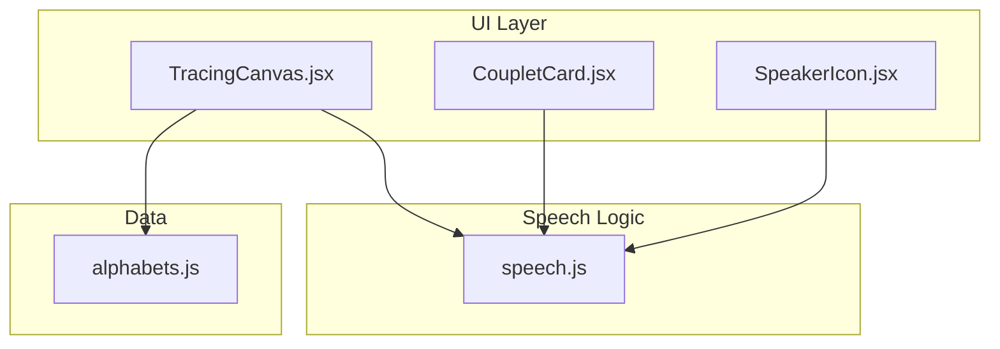
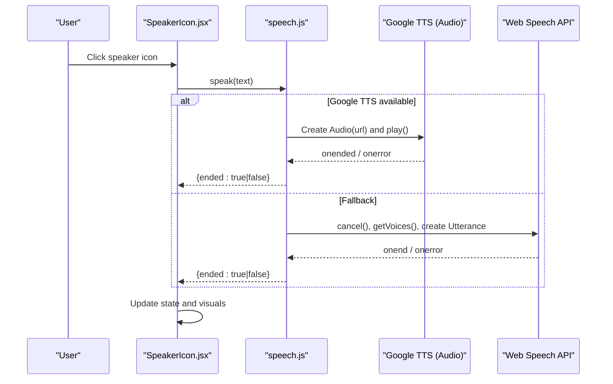
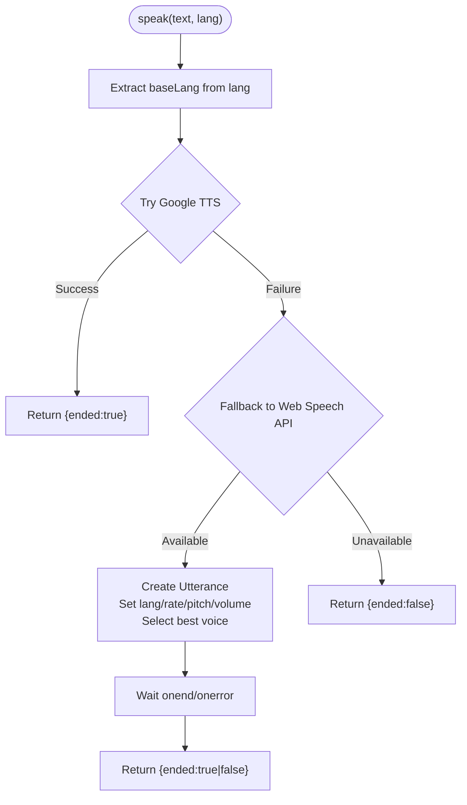
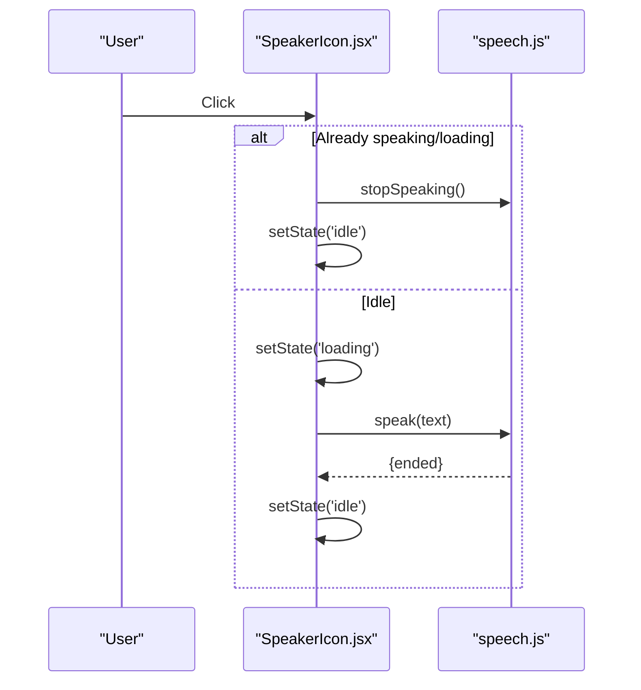
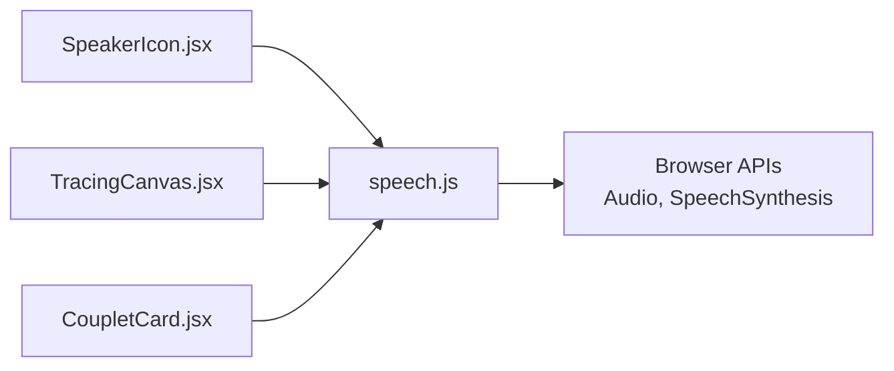

# Audio Pronunciation Integration

<cite>
**Referenced Files in This Document**
- [speech.js](file://zabandaan/client/src/utils/speech.js)
- [SpeakerIcon.jsx](file://zabandaan/client/src/components/SpeakerIcon.jsx)
- [TracingCanvas.jsx](file://zabandaan/client/src/pages/alphabets/TracingCanvas.jsx)
- [CoupletCard.jsx](file://zabandaan/client/src/pages/poetry/CoupletCard.jsx)
- [alphabets.js](file://zabandaan/client/src/data/alphabets.js)
</cite>

## Table of Contents
1. Introduction
2. Project Structure
3. Core Components
4. Architecture Overview
5. Detailed Component Analysis
6. Dependency Analysis
7. Performance Considerations
8. Troubleshooting Guide
9. Conclusion
10. Appendices

## Introduction
This document explains the audio pronunciation integration system that provides text-to-speech (TTS) and audio feedback for Urdu content. It covers:
- Web Speech API usage as a fallback mechanism
- Google Translate TTS as the primary audio source for consistent Urdu pronunciation without requiring OS-installed voices
- The SpeakerIcon component’s audio triggering, state management, and accessibility attributes
- Speech synthesis configuration, language selection, and error handling
- Cross-browser compatibility considerations and best practices for adding new audio assets or customizing pronunciation behavior

## Project Structure
The audio system is implemented as a small, focused module with clear separation between UI and logic:
- A utility module handles all speech synthesis and audio playback logic
- A reusable UI component triggers speech and provides visual feedback
- Pages integrate the component to pronounce letters, words, and couplets

**Diagram sources**
- [SpeakerIcon.jsx:1-66](file://zabandaan/client/src/components/SpeakerIcon.jsx#L1-L66)
- [speech.js:1-176](file://zabandaan/client/src/utils/speech.js#L1-L176)
- [TracingCanvas.jsx:1-42](file://zabandaan/client/src/pages/alphabets/TracingCanvas.jsx#L1-L42)
- [CoupletCard.jsx:1-23](file://zabandaan/client/src/pages/poetry/CoupletCard.jsx#L1-L23)
- [alphabets.js:35-55](file://zabandaan/client/src/data/alphabets.js#L35-L55)

**Section sources**
- [speech.js:1-176](file://zabandaan/client/src/utils/speech.js#L1-L176)
- [SpeakerIcon.jsx:1-66](file://zabandaan/client/src/components/SpeakerIcon.jsx#L1-L66)
- [TracingCanvas.jsx:1-42](file://zabandaan/client/src/pages/alphabets/TracingCanvas.jsx#L1-L42)
- [CoupletCard.jsx:1-23](file://zabandaan/client/src/pages/poetry/CoupletCard.jsx#L1-L23)
- [alphabets.js:35-55](file://zabandaan/client/src/data/alphabets.js#L35-L55)

## Core Components
- Speech utility (speech.js): Centralizes TTS orchestration, voice discovery, and stop controls. Uses Google Translate TTS first, then falls back to Web Speech API when needed.
- SpeakerIcon (SpeakerIcon.jsx): Reusable button that triggers speech, manages loading/speaking states, and exposes accessible labels.
- Integration points: TracingCanvas.jsx auto-pronounces letter names on load; CoupletCard.jsx pronounces full couplets and individual words.

Key responsibilities:
- Language targeting: Defaults to Urdu (with region tag where applicable), with graceful fallbacks to similar languages if needed.
- Robustness: Handles missing APIs, network errors, and user interruptions.
- Accessibility: Provides aria-labels and keyboard-friendly buttons.

**Section sources**
- [speech.js:1-176](file://zabandaan/client/src/utils/speech.js#L1-L176)
- [SpeakerIcon.jsx:1-66](file://zabandaan/client/src/components/SpeakerIcon.jsx#L1-L66)
- [TracingCanvas.jsx:34-42](file://zabandaan/client/src/pages/alphabets/TracingCanvas.jsx#L34-L42)
- [CoupletCard.jsx:17-23](file://zabandaan/client/src/pages/poetry/CoupletCard.jsx#L17-L23)

## Architecture Overview
The system uses a dual-path approach:
- Primary path: Google Translate TTS via an HTML Audio element for reliable Urdu pronunciation without OS voice dependencies.
- Fallback path: Web Speech API using SpeechSynthesisUtterance with voice selection heuristics for Urdu and related languages.

**Diagram sources**
- [speech.js:77-154](file://zabandaan/client/src/utils/speech.js#L77-L154)
- [SpeakerIcon.jsx:8-34](file://zabandaan/client/src/components/SpeakerIcon.jsx#L8-L34)

## Detailed Component Analysis

### Speech Utility (speech.js)
Responsibilities:
- Voice initialization and caching for Web Speech API
- Best-fit voice selection with preference for Urdu, then Hindi, Arabic, or any available voice
- Primary TTS via Google Translate TTS using an Audio element
- Fallback TTS via Web Speech API with configurable rate, pitch, and volume
- Stop control that halts both Google TTS and Web Speech API
- Helpers to detect Urdu voice availability and list available voices

Implementation highlights:
- Voices are cached and updated on the voiceschanged event with polling fallback
- Asynchronous voice readiness is handled via a promise with timeout
- Error paths resolve with ended: false to signal failure without throwing
- Language extraction ensures base language code is used for Google TTS

**Diagram sources**
- [speech.js:144-154](file://zabandaan/client/src/utils/speech.js#L144-L154)
- [speech.js:77-136](file://zabandaan/client/src/utils/speech.js#L77-L136)

**Section sources**
- [speech.js:11-75](file://zabandaan/client/src/utils/speech.js#L11-L75)
- [speech.js:77-154](file://zabandaan/client/src/utils/speech.js#L77-L154)
- [speech.js:156-175](file://zabandaan/client/src/utils/speech.js#L156-L175)

### SpeakerIcon Component (SpeakerIcon.jsx)
Responsibilities:
- Trigger speech via the utility module
- Manage local state: idle, loading, speaking
- Provide immediate stop behavior when clicked during playback
- Render accessible button with title and aria-label
- Visual feedback through icon and color changes

Interaction flow:
- On click, if currently speaking/loading, stop immediately and reset state
- Otherwise, set loading state, call speak, and reset to idle after completion or error
- Use a ref counter to ensure only the latest interaction updates state

**Diagram sources**
- [SpeakerIcon.jsx:8-34](file://zabandaan/client/src/components/SpeakerIcon.jsx#L8-L34)
- [speech.js:156-167](file://zabandaan/client/src/utils/speech.js#L156-L167)

**Section sources**
- [SpeakerIcon.jsx:1-66](file://zabandaan/client/src/components/SpeakerIcon.jsx#L1-L66)

### Integration Points

#### TracingCanvas.jsx
- Auto-pronounces the current letter’s Urdu name shortly after mount
- Tracks whether auto-speak succeeded to inform UI state

Usage pattern:
- Calls speak(letter.nameUrdu) on load with a short delay
- Updates autoPlayed based on returned result

**Section sources**
- [TracingCanvas.jsx:34-42](file://zabandaan/client/src/pages/alphabets/TracingCanvas.jsx#L34-L42)

#### CoupletCard.jsx
- Provides a “Listen to Full Couplet” action
- Embeds SpeakerIcon next to each word for granular pronunciation

Usage pattern:
- Calls speak(couplet.couplet_urdu) for full reading
- Renders SpeakerIcon per word with appropriate size and spacing

**Section sources**
- [CoupletCard.jsx:17-23](file://zabandaan/client/src/pages/poetry/CoupletCard.jsx#L17-L23)
- [CoupletCard.jsx:62-73](file://zabandaan/client/src/pages/poetry/CoupletCard.jsx#L62-L73)
- [CoupletCard.jsx:114-117](file://zabandaan/client/src/pages/poetry/CoupletCard.jsx#L114-L117)

### Data Model Context
Alphabet entries include Urdu names and example words, which are natural inputs for pronunciation.

Example reference:
- Each alphabet entry contains fields like nameUrdu and exampleWord, suitable for TTS input.

**Section sources**
- [alphabets.js:35-55](file://zabandaan/client/src/data/alphabets.js#L35-L55)

## Dependency Analysis
- SpeakerIcon depends on speech.js for speak and stopSpeaking
- TracingCanvas and CoupletCard depend on speech.js directly for programmatic speech
- All components rely on browser capabilities:
  - Google TTS requires network access and supports broad language coverage
  - Web Speech API requires window.speechSynthesis and may vary by platform

**Diagram sources**
- [SpeakerIcon.jsx:1-3](file://zabandaan/client/src/components/SpeakerIcon.jsx#L1-L3)
- [TracingCanvas.jsx:1-3](file://zabandaan/client/src/pages/alphabets/TracingCanvas.jsx#L1-L3)
- [CoupletCard.jsx:1-3](file://zabandaan/client/src/pages/poetry/CoupletCard.jsx#L1-L3)
- [speech.js:1-176](file://zabandaan/client/src/utils/speech.js#L1-L176)

**Section sources**
- [speech.js:1-176](file://zabandaan/client/src/utils/speech.js#L1-L176)
- [SpeakerIcon.jsx:1-66](file://zabandaan/client/src/components/SpeakerIcon.jsx#L1-L66)
- [TracingCanvas.jsx:1-42](file://zabandaan/client/src/pages/alphabets/TracingCanvas.jsx#L1-L42)
- [CoupletCard.jsx:1-23](file://zabandaan/client/src/pages/poetry/CoupletCard.jsx#L1-L23)

## Performance Considerations
- Network latency: Google TTS relies on external endpoints; consider user experience under slow networks.
- Voice loading: Web Speech API voices may load asynchronously; the module includes timeouts and polling to avoid blocking.
- Audio overlap: The stopSpeaking function prevents overlapping audio by pausing/canceling previous outputs.
- Rate and pitch: Default values are tuned for clarity; adjust if needed for specific use cases.

[No sources needed since this section provides general guidance]

## Troubleshooting Guide
Common issues and resolutions:
- No sound on click:
  - Ensure user gesture initiated playback (browser policy). The component requires a click to start audio.
  - Check network connectivity for Google TTS; verify no ad blockers or CORS restrictions block the audio URL.
- Inconsistent pronunciation:
  - If Google TTS fails, the system falls back to Web Speech API. Verify OS voice availability for Urdu or related languages.
- Stuttering or overlapping audio:
  - Use stopSpeaking before starting new speech to prevent overlaps.
- Accessibility concerns:
  - Confirm aria-labels are present and meaningful for screen readers.
  - Ensure the button is focusable and operable via keyboard.

Error handling patterns:
- Both TTS paths return a result object indicating success or failure rather than throwing exceptions, enabling graceful UI updates.
- Errors from Audio.play() and SpeechSynthesis are caught and resolved with ended: false.

**Section sources**
- [speech.js:77-154](file://zabandaan/client/src/utils/speech.js#L77-L154)
- [speech.js:156-167](file://zabandaan/client/src/utils/speech.js#L156-L167)
- [SpeakerIcon.jsx:8-34](file://zabandaan/client/src/components/SpeakerIcon.jsx#L8-L34)

## Conclusion
The audio pronunciation system provides robust, cross-platform TTS for Urdu content by combining a reliable primary path (Google Translate TTS) with a native fallback (Web Speech API). The SpeakerIcon component offers an accessible, stateful interface for users to trigger pronunciation, while integration points in pages demonstrate practical usage for letters and poetry. The design emphasizes resilience, accessibility, and simplicity, making it straightforward to extend with new assets or customize pronunciation behavior.

[No sources needed since this section summarizes without analyzing specific files]

## Appendices

### Adding New Audio Assets
- For static audio files (e.g., MP3/WAV), store them under public assets and update references in data modules.
- For TTS-driven assets, add new entries to data structures (e.g., alphabets.js) with Urdu text fields to be spoken.

**Section sources**
- [alphabets.js:35-55](file://zabandaan/client/src/data/alphabets.js#L35-L55)

### Customizing Pronunciation Behavior
- Adjust Web Speech API parameters (rate, pitch, volume) in the fallback path to fine-tune output quality.
- Modify voice selection preferences to prioritize specific locales or languages.

**Section sources**
- [speech.js:108-136](file://zabandaan/client/src/utils/speech.js#L108-L136)

### Accessibility Checklist
- Buttons have descriptive aria-labels and titles
- Focus management remains predictable
- Visual feedback complements audio cues for non-visual users

**Section sources**
- [SpeakerIcon.jsx:43-64](file://zabandaan/client/src/components/SpeakerIcon.jsx#L43-L64)

### Cross-Platform Compatibility Notes
- Mobile browsers may require explicit user gestures to play audio
- Some platforms restrict background audio or limit concurrent streams
- Test across desktop and mobile browsers to validate behavior

[No sources needed since this section provides general guidance]