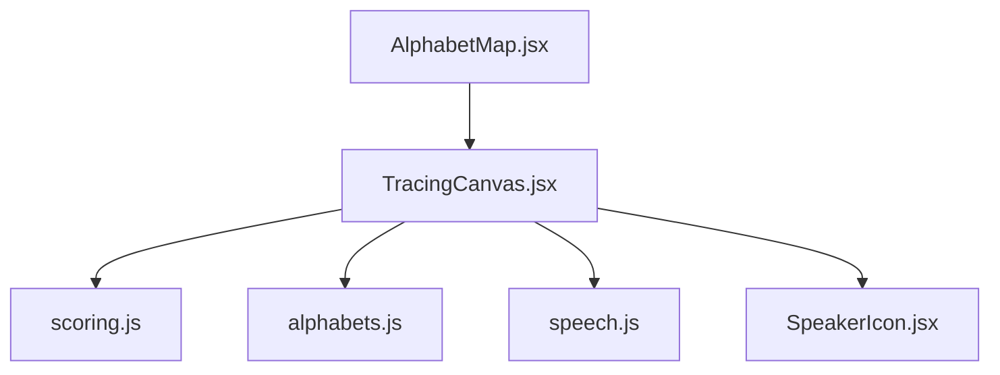
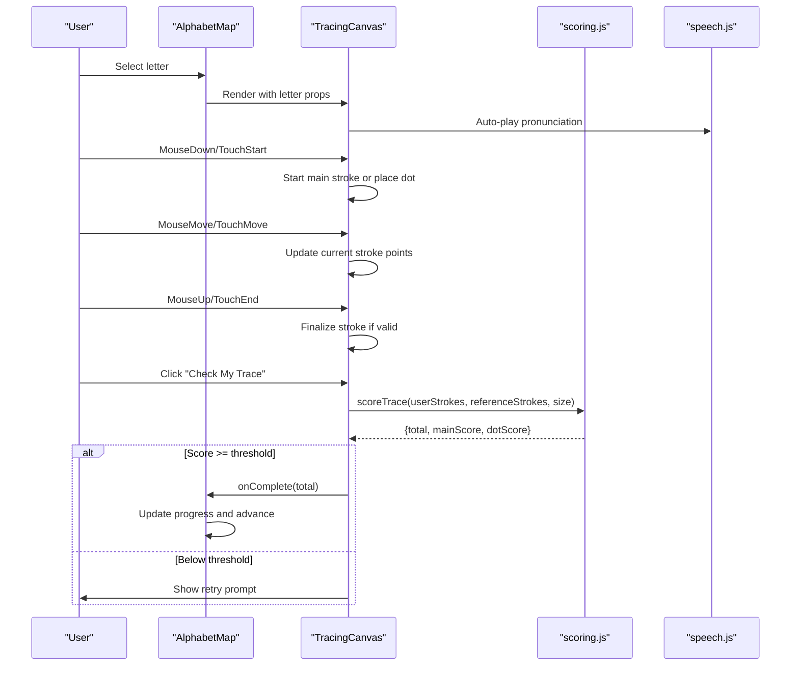
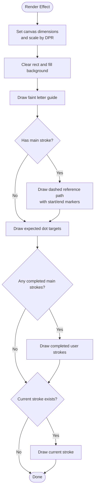
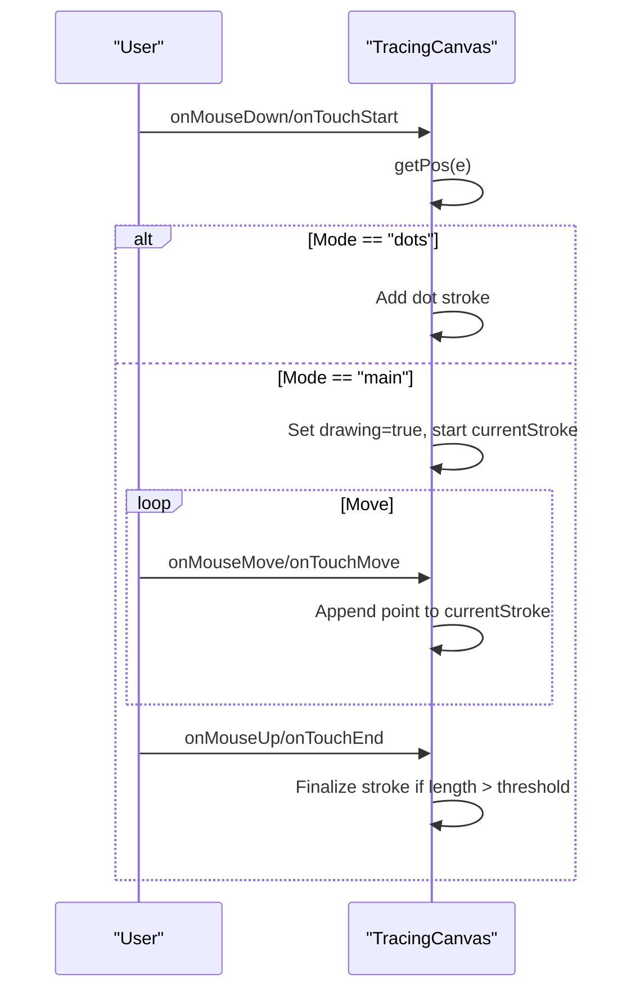
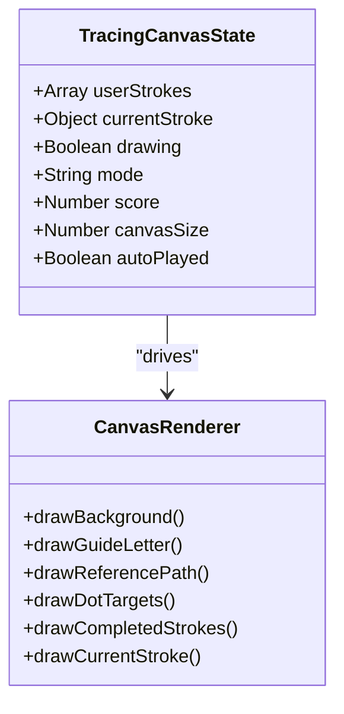
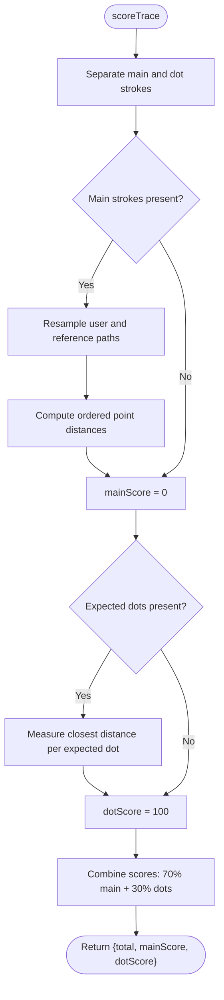
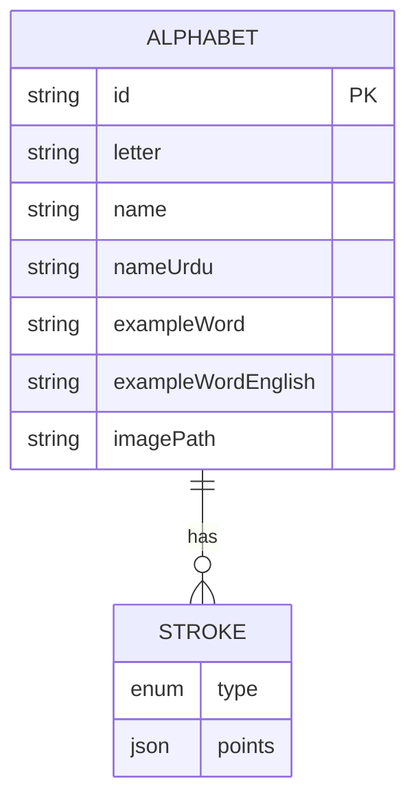
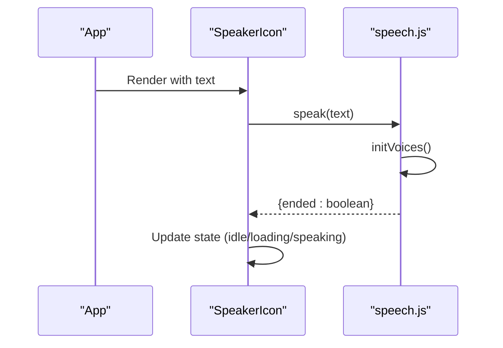
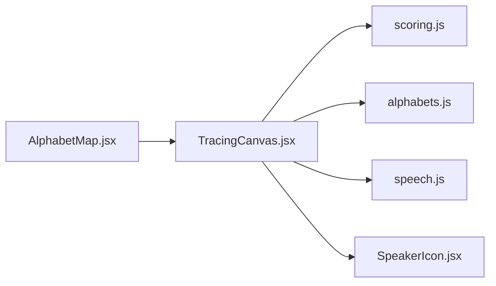

# Interactive Canvas Drawing System

<cite>
**Referenced Files in This Document**
- [TracingCanvas.jsx](file://zabandaan/client/src/pages/alphabets/TracingCanvas.jsx)
- [AlphabetMap.jsx](file://zabandaan/client/src/pages/alphabets/AlphabetMap.jsx)
- [scoring.js](file://zabandaan/client/src/utils/scoring.js)
- [alphabets.js](file://zabandaan/client/src/data/alphabets.js)
- [speech.js](file://zabandaan/client/src/utils/speech.js)
- [SpeakerIcon.jsx](file://zabandaan/client/src/components/SpeakerIcon.jsx)
</cite>

## Table of Contents
1. [Introduction](#introduction)
2. [Project Structure](#project-structure)
3. [Core Components](#core-components)
4. [Architecture Overview](#architecture-overview)
5. [Detailed Component Analysis](#detailed-component-analysis)
6. [Dependency Analysis](#dependency-analysis)
7. [Performance Considerations](#performance-considerations)
8. [Troubleshooting Guide](#troubleshooting-guide)
9. [Conclusion](#conclusion)

## Introduction
This document explains the interactive canvas drawing system centered on the TracingCanvas component. It covers canvas setup, event handling for mouse and touch inputs, stroke rendering, real-time drawing feedback, gesture recognition across multi-stroke input, dot placement validation, and scoring. It also provides guidance on cross-browser compatibility, mobile touch handling, canvas scaling, and performance optimization techniques to ensure a smooth drawing experience.

## Project Structure
The drawing system is implemented as a React application with a dedicated alphabets module:
- TracingCanvas handles the interactive canvas, events, state, and rendering.
- AlphabetMap orchestrates letter progression and integrates TracingCanvas into the learning flow.
- Scoring utilities evaluate trace accuracy and dot placement.
- Alphabet data defines reference strokes and dot targets per letter.
- Speech utilities provide audio pronunciation support.
- SpeakerIcon encapsulates speech playback UI and lifecycle.

**Diagram sources**
- [AlphabetMap.jsx:1-90](file://zabandaan/client/src/pages/alphabets/AlphabetMap.jsx#L1-L90)
- [TracingCanvas.jsx:1-15](file://zabandaan/client/src/pages/alphabets/TracingCanvas.jsx#L1-L15)
- [scoring.js:106-140](file://zabandaan/client/src/utils/scoring.js#L106-L140)
- [alphabets.js:35-283](file://zabandaan/client/src/data/alphabets.js#L35-L283)
- [speech.js:90-125](file://zabandaan/client/src/utils/speech.js#L90-L125)
- [SpeakerIcon.jsx:1-67](file://zabandaan/client/src/components/SpeakerIcon.jsx#L1-L67)

**Section sources**
- [AlphabetMap.jsx:1-90](file://zabandaan/client/src/pages/alphabets/AlphabetMap.jsx#L1-L90)
- [TracingCanvas.jsx:1-15](file://zabandaan/client/src/pages/alphabets/TracingCanvas.jsx#L1-L15)

## Core Components
- TracingCanvas: Manages canvas lifecycle, responsive sizing, high-DPI scaling, drawing modes (main stroke, dots, done), event handling, and rendering pipeline.
- AlphabetMap: Displays alphabet grid, manages completion progress, and renders TracingCanvas for each selected letter.
- Scoring: Resamples paths, compares user strokes to references, validates dot placements, and computes weighted accuracy.
- Alphabets Data: Defines normalized stroke paths and dot positions for each letter.
- Speech: Provides asynchronous voice loading and text-to-speech with fallbacks.
- SpeakerIcon: Wraps speech playback with UI states and accessibility attributes.

**Section sources**
- [TracingCanvas.jsx:24-180](file://zabandaan/client/src/pages/alphabets/TracingCanvas.jsx#L24-L180)
- [AlphabetMap.jsx:12-90](file://zabandaan/client/src/pages/alphabets/AlphabetMap.jsx#L12-L90)
- [scoring.js:7-140](file://zabandaan/client/src/utils/scoring.js#L7-L140)
- [alphabets.js:6-33](file://zabandaan/client/src/data/alphabets.js#L6-L33)
- [speech.js:7-40](file://zabandaan/client/src/utils/speech.js#L7-L40)
- [SpeakerIcon.jsx:1-67](file://zabandaan/client/src/components/SpeakerIcon.jsx#L1-L67)

## Architecture Overview
The system follows a unidirectional data flow:
- AlphabetMap selects a letter and passes it to TracingCanvas along with an onComplete callback.
- TracingCanvas captures user input via mouse/touch events, updates local state, and re-renders the canvas with guides, completed strokes, current stroke, and dot targets.
- When the user completes tracing and places required dots, TracingCanvas calls scoring to compute accuracy and transitions to a “done” state.
- If the score meets the threshold, AlphabetMap records progress and advances to the next letter.

**Diagram sources**
- [AlphabetMap.jsx:48-67](file://zabandaan/client/src/pages/alphabets/AlphabetMap.jsx#L48-L67)
- [TracingCanvas.jsx:199-248](file://zabandaan/client/src/pages/alphabets/TracingCanvas.jsx#L199-L248)
- [scoring.js:106-140](file://zabandaan/client/src/utils/scoring.js#L106-L140)
- [speech.js:90-125](file://zabandaan/client/src/utils/speech.js#L90-L125)

## Detailed Component Analysis

### TracingCanvas: Canvas Setup and Rendering
- High-DPI canvas: Uses devicePixelRatio to set internal resolution and scales context to maintain crisp lines on retina displays.
- Responsive sizing: Dynamically adjusts canvas width based on viewport width to fit different screens.
- Rendering pipeline: Clears canvas, draws background, faint guide letter, reference main path (dashed), expected dot targets, completed user strokes, current stroke being drawn, and dot placements.
- Smooth curves: Uses quadratic curve interpolation between points to render smooth strokes.

**Diagram sources**
- [TracingCanvas.jsx:45-180](file://zabandaan/client/src/pages/alphabets/TracingCanvas.jsx#L45-L180)

**Section sources**
- [TracingCanvas.jsx:24-180](file://zabandaan/client/src/pages/alphabets/TracingCanvas.jsx#L24-L180)

### Event Handling: Mouse and Touch Inputs
- Unified position extraction: Normalizes coordinates from both mouse and touch events using getBoundingClientRect and client offsets.
- Mode-aware handlers:
  - Main stroke mode: Captures continuous movement to build a stroke path; finalizes on pointer up if minimum point count met.
  - Dot mode: Places individual dots at click/tap locations near target circles.
- Prevent default behavior: Ensures touch interactions do not trigger scrolling or zooming during drawing.

**Diagram sources**
- [TracingCanvas.jsx:182-238](file://zabandaan/client/src/pages/alphabets/TracingCanvas.jsx#L182-L238)

**Section sources**
- [TracingCanvas.jsx:182-238](file://zabandaan/client/src/pages/alphabets/TracingCanvas.jsx#L182-L238)

### Stroke Rendering and Real-Time Feedback
- Reference path: Dashed line with green start marker and red end marker to guide users.
- Completed strokes: Smoothly rendered with round caps and joins for natural look.
- Current stroke: Live preview while drawing, updated on every move event.
- Dot targets: Highlighted when in dot mode; user-placed dots shown with distinct colors and borders.

**Diagram sources**
- [TracingCanvas.jsx:6-15](file://zabandaan/client/src/pages/alphabets/TracingCanvas.jsx#L6-L15)
- [TracingCanvas.jsx:45-180](file://zabandaan/client/src/pages/alphabets/TracingCanvas.jsx#L45-L180)

**Section sources**
- [TracingCanvas.jsx:45-180](file://zabandaan/client/src/pages/alphabets/TracingCanvas.jsx#L45-L180)

### Gesture Recognition and Path Validation
- Multi-stroke support: The system separates main strokes and dot strokes, allowing users to complete multiple actions per letter.
- Path resampling: Converts variable-length user paths to fixed-sample sequences for consistent comparison against reference paths.
- Ordered distance scoring: Compares corresponding points between resampled user and reference paths to compute average deviation and derive accuracy.
- Dot placement validation: Checks proximity of user-placed dots to expected targets within a tolerance radius proportional to canvas size.
- Weighted scoring: Combines main stroke accuracy and dot placement percentage to produce a total score used to determine success.

**Diagram sources**
- [scoring.js:7-140](file://zabandaan/client/src/utils/scoring.js#L7-L140)

**Section sources**
- [scoring.js:7-140](file://zabandaan/client/src/utils/scoring.js#L7-L140)

### Alphabet Data and Reference Paths
- Normalized coordinates: Strokes are defined in 0–1 space to be scalable across different canvas sizes.
- Smooth path generation: Helper function creates interpolated points using quadratic/cubic curves for realistic letter shapes.
- Dot definitions: Each letter may include one or more dot strokes representing diacritics or marks that must be placed after the main stroke.

**Diagram sources**
- [alphabets.js:6-33](file://zabandaan/client/src/data/alphabets.js#L6-L33)
- [alphabets.js:35-283](file://zabandaan/client/src/data/alphabets.js#L35-L283)

**Section sources**
- [alphabets.js:6-33](file://zabandaan/client/src/data/alphabets.js#L6-L33)
- [alphabets.js:35-283](file://zabandaan/client/src/data/alphabets.js#L35-L283)

### Speech Integration and Audio Feedback
- Asynchronous voice loading: Initializes voices and waits for availability with fallback polling.
- Voice selection: Prioritizes Urdu voices, falls back to Hindi or Arabic if needed, then any available voice.
- Playback control: Cancels ongoing speech before starting new utterances; tracks completion and errors.
- UI integration: SpeakerIcon toggles states and provides accessible labels for pronunciation prompts.

**Diagram sources**
- [speech.js:7-40](file://zabandaan/client/src/utils/speech.js#L7-L40)
- [speech.js:90-125](file://zabandaan/client/src/utils/speech.js#L90-L125)
- [SpeakerIcon.jsx:1-67](file://zabandaan/client/src/components/SpeakerIcon.jsx#L1-L67)

**Section sources**
- [speech.js:7-40](file://zabandaan/client/src/utils/speech.js#L7-L40)
- [speech.js:90-125](file://zabandaan/client/src/utils/speech.js#L90-L125)
- [SpeakerIcon.jsx:1-67](file://zabandaan/client/src/components/SpeakerIcon.jsx#L1-L67)

## Dependency Analysis
- TracingCanvas depends on:
  - scoring.js for evaluation logic
  - alphabets.js for reference strokes and dot targets
  - speech.js for pronunciation
  - SpeakerIcon for audio UI
- AlphabetMap depends on:
  - TracingCanvas for interaction
  - PointsContext and AuthContext for progress persistence
  - API for server-side progress retrieval

**Diagram sources**
- [AlphabetMap.jsx:1-90](file://zabandaan/client/src/pages/alphabets/AlphabetMap.jsx#L1-L90)
- [TracingCanvas.jsx:1-15](file://zabandaan/client/src/pages/alphabets/TracingCanvas.jsx#L1-L15)
- [scoring.js:106-140](file://zabandaan/client/src/utils/scoring.js#L106-L140)
- [alphabets.js:35-283](file://zabandaan/client/src/data/alphabets.js#L35-L283)
- [speech.js:90-125](file://zabandaan/client/src/utils/speech.js#L90-L125)
- [SpeakerIcon.jsx:1-67](file://zabandaan/client/src/components/SpeakerIcon.jsx#L1-L67)

**Section sources**
- [AlphabetMap.jsx:1-90](file://zabandaan/client/src/pages/alphabets/AlphabetMap.jsx#L1-L90)
- [TracingCanvas.jsx:1-15](file://zabandaan/client/src/pages/alphabets/TracingCanvas.jsx#L1-L15)

## Performance Considerations
- High-DPI scaling: Use devicePixelRatio to set canvas internal resolution and scale context to avoid blurry strokes on high-density displays.
- Efficient rendering: Rebuild full frame only when necessary; leverage React’s dependency array to minimize re-renders.
- Smooth curves: Use quadraticCurveTo to reduce visual jitter and improve perceived responsiveness.
- Event throttling: Avoid excessive state updates by batching point additions; consider debouncing move events if needed for very large datasets.
- Memory management: Clear canvas efficiently and avoid retaining unnecessary large arrays; reset state on clear operations.
- Mobile touch handling: Use touchAction CSS property to prevent browser gestures interfering with drawing; normalize coordinates consistently across devices.
- Cross-browser compatibility: Ensure Web Speech API availability checks and fallbacks; handle browsers without speech synthesis gracefully.

[No sources needed since this section provides general guidance]

## Troubleshooting Guide
Common issues and resolutions:
- Blurry or pixelated strokes:
  - Verify devicePixelRatio usage and context scaling.
  - Ensure canvas internal dimensions match scaled logical size.
- Touch events not triggering drawing:
  - Confirm touch listeners are attached and preventDefault is called.
  - Check touchAction CSS property to disable browser gestures.
- Inaccurate scoring:
  - Validate reference path normalization and canvas size scaling.
  - Adjust tolerance thresholds in scoring functions if too strict or lenient.
- Speech not playing:
  - Check Web Speech API support and voice availability.
  - Provide user-initiated play button fallback when autoplay is blocked.
- Performance drops on low-end devices:
  - Reduce number of sampled points for resampling.
  - Limit frequent re-renders by optimizing state updates.

**Section sources**
- [TracingCanvas.jsx:45-180](file://zabandaan/client/src/pages/alphabets/TracingCanvas.jsx#L45-L180)
- [scoring.js:49-97](file://zabandaan/client/src/utils/scoring.js#L49-L97)
- [speech.js:90-125](file://zabandaan/client/src/utils/speech.js#L90-L125)

## Conclusion
The TracingCanvas-based drawing system delivers an interactive, responsive, and accessible learning experience for tracing Urdu letters. It combines robust canvas setup, unified event handling, smooth rendering, and precise scoring to validate user input. With careful attention to high-DPI scaling, mobile touch handling, and cross-browser compatibility, the system ensures a smooth and inclusive experience across devices. The modular architecture allows easy extension for additional letters, gestures, and scoring strategies.