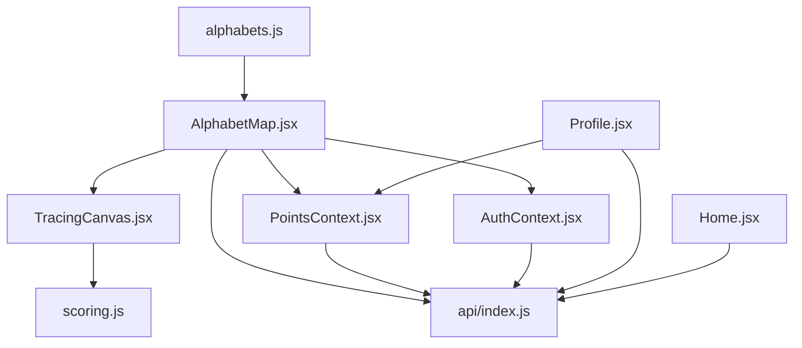
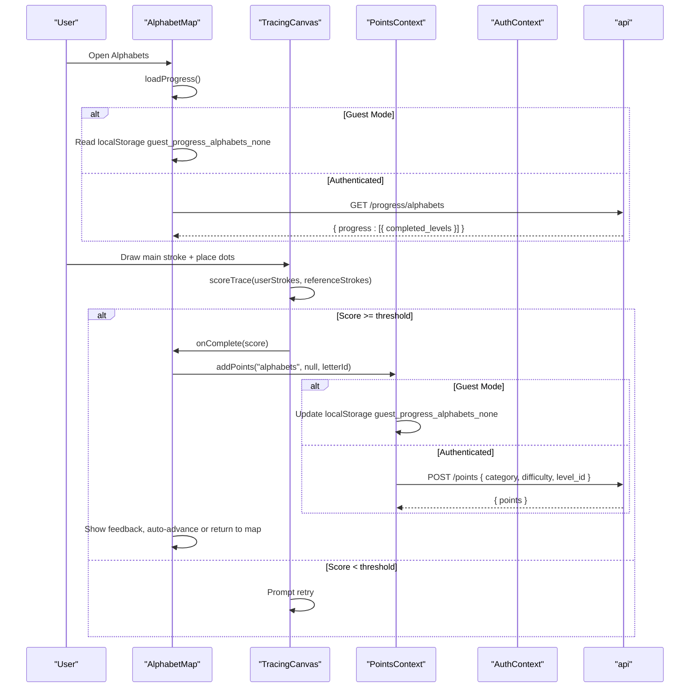
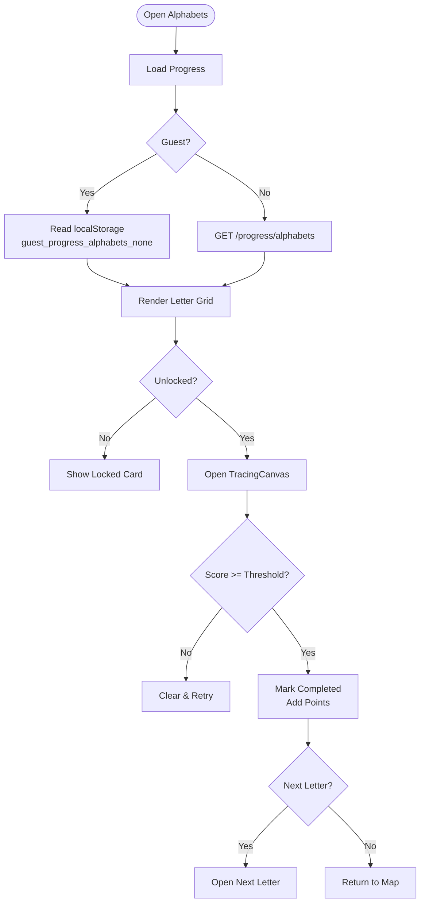
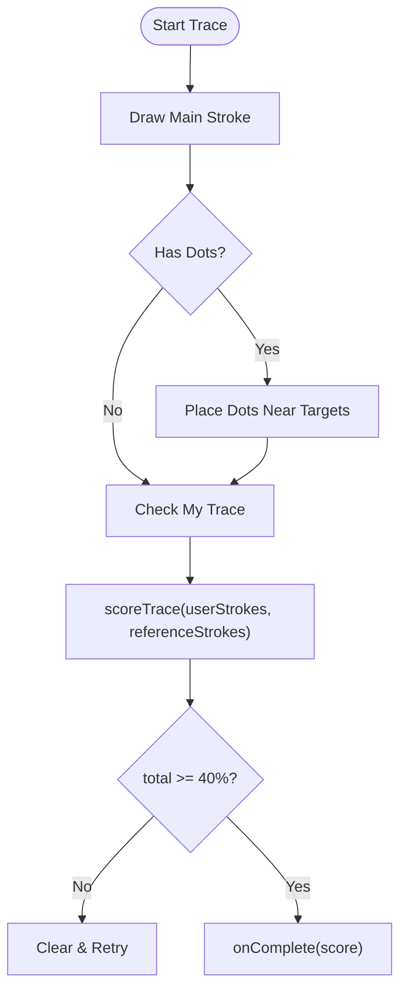
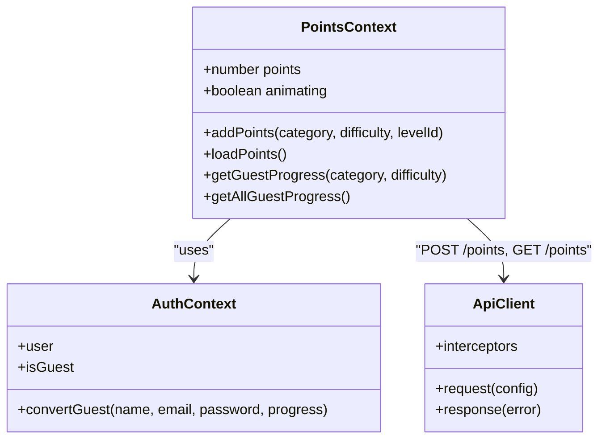
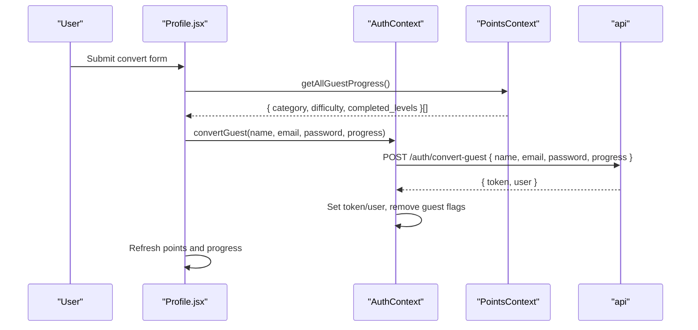
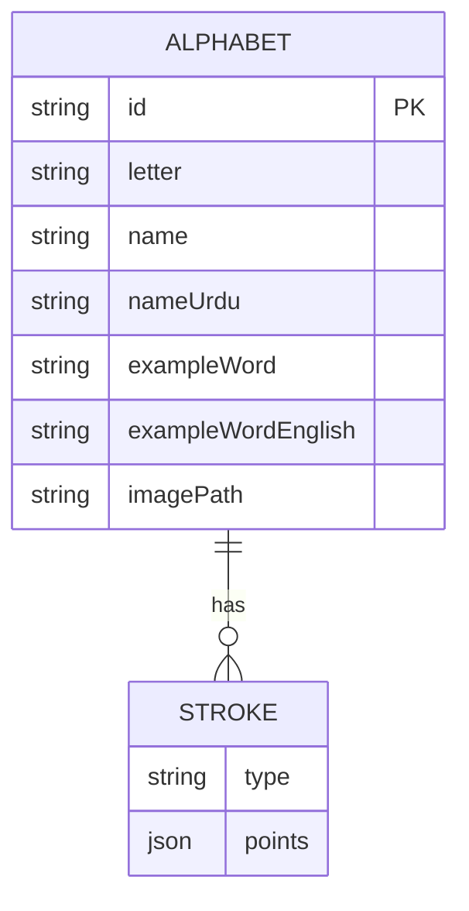
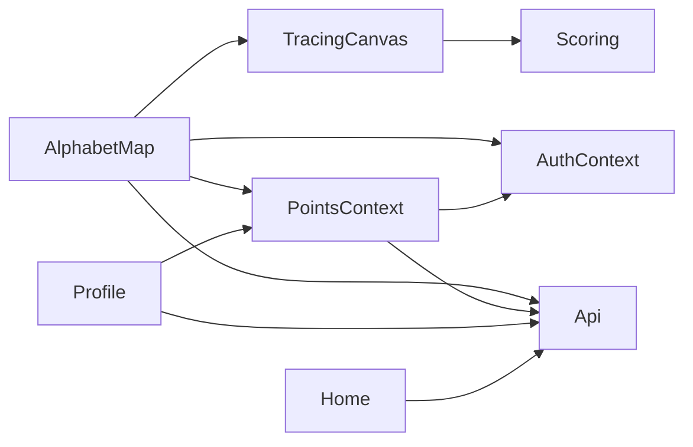

# Progress Tracking and Level Management

<cite>
**Referenced Files in This Document**
- [AlphabetMap.jsx](file://zabandaan/client/src/pages/alphabets/AlphabetMap.jsx)
- [TracingCanvas.jsx](file://zabandaan/client/src/pages/alphabets/TracingCanvas.jsx)
- [alphabets.js](file://zabandaan/client/src/data/alphabets.js)
- [PointsContext.jsx](file://zabandaan/client/src/context/PointsContext.jsx)
- [AuthContext.jsx](file://zabandaan/client/src/context/AuthContext.jsx)
- [api/index.js](file://zabandaan/client/src/api/index.js)
- [Profile.jsx](file://zabandaan/client/src/pages/Profile.jsx)
- [Home.jsx](file://zabandaan/client/src/pages/Home.jsx)
- [scoring.js](file://zabandaan/client/src/utils/scoring.js)
</cite>

## Table of Contents
1. Introduction
2. Project Structure
3. Core Components
4. Architecture Overview
5. Detailed Component Analysis
6. Dependency Analysis
7. Performance Considerations
8. Troubleshooting Guide
9. Conclusion
10. Appendices

## Introduction
This document explains the progress tracking and level management system for user advancement, completion status, and points integration. It covers:
- How levels unlock based on prior completions
- How progress persists across sessions (local storage for guests, cloud storage for authenticated users)
- Synchronization between local and cloud storage during guest-to-account conversion
- The AlphabetMap component’s state management for completed levels, guest vs authenticated flows, and navigation
- Concrete examples of API calls, local storage operations, and points integration
- Relationship between alphabet completion and overall learning progress
- Data migration strategies, progress reset considerations, and analytics tracking opportunities

## Project Structure
The progress system spans UI components, contexts, data definitions, and utilities:
- AlphabetMap orchestrates level unlocking and completion flow
- TracingCanvas handles drawing, scoring, and completion callbacks
- PointsContext manages points and guest/cloud persistence
- AuthContext tracks authentication mode and supports guest conversion
- api provides HTTP client with token handling
- Profile and Home aggregate progress views and category summaries
- alphabets defines letter structures and stroke references
- scoring evaluates trace accuracy to gate completion

**Diagram sources**
- [AlphabetMap.jsx:1-249](file://zabandaan/client/src/pages/alphabets/AlphabetMap.jsx#L1-L249)
- [TracingCanvas.jsx:1-521](file://zabandaan/client/src/pages/alphabets/TracingCanvas.jsx#L1-L521)
- [PointsContext.jsx:1-114](file://zabandaan/client/src/context/PointsContext.jsx#L1-L114)
- [AuthContext.jsx:1-97](file://zabandaan/client/src/context/AuthContext.jsx#L1-L97)
- [api/index.js:1-30](file://zabandaan/client/src/api/index.js#L1-L30)
- [Profile.jsx:1-353](file://zabandaan/client/src/pages/Profile.jsx#L1-L353)
- [Home.jsx:1-79](file://zabandaan/client/src/pages/Home.jsx#L1-L79)
- [alphabets.js:1-284](file://zabandaan/client/src/data/alphabets.js#L1-L284)
- [scoring.js:1-151](file://zabandaan/client/src/utils/scoring.js#L1-L151)

**Section sources**
- [AlphabetMap.jsx:1-249](file://zabandaan/client/src/pages/alphabets/AlphabetMap.jsx#L1-L249)
- [PointsContext.jsx:1-114](file://zabandaan/client/src/context/PointsContext.jsx#L1-L114)
- [AuthContext.jsx:1-97](file://zabandaan/client/src/context/AuthContext.jsx#L1-L97)
- [api/index.js:1-30](file://zabandaan/client/src/api/index.js#L1-L30)
- [Profile.jsx:1-353](file://zabandaan/client/src/pages/Profile.jsx#L1-L353)
- [Home.jsx:1-79](file://zabandaan/client/src/pages/Home.jsx#L1-L79)
- [alphabets.js:1-284](file://zabandaan/client/src/data/alphabets.js#L1-L284)
- [scoring.js:1-151](file://zabandaan/client/src/utils/scoring.js#L1-L151)

## Core Components
- AlphabetMap: Manages current letter selection, completed levels, unlocking logic, and completion feedback. Persists or loads progress depending on guest/authenticated mode.
- TracingCanvas: Handles drawing strokes and dot placement, computes accuracy score, and triggers completion when threshold is met.
- PointsContext: Centralized points state; adds points locally for guests or via API for authenticated users; aggregates guest progress from localStorage.
- AuthContext: Tracks user session, guest mode, and supports converting guest progress to a real account.
- api: Axios instance that injects auth tokens and clears session on 401 responses.
- Profile and Home: Aggregate progress by category and display totals; support guest-to-account conversion.

**Section sources**
- [AlphabetMap.jsx:12-151](file://zabandaan/client/src/pages/alphabets/AlphabetMap.jsx#L12-L151)
- [TracingCanvas.jsx:6-386](file://zabandaan/client/src/pages/alphabets/TracingCanvas.jsx#L6-L386)
- [PointsContext.jsx:7-107](file://zabandaan/client/src/context/PointsContext.jsx#L7-L107)
- [AuthContext.jsx:6-90](file://zabandaan/client/src/context/AuthContext.jsx#L6-L90)
- [api/index.js:1-30](file://zabandaan/client/src/api/index.js#L1-L30)
- [Profile.jsx:8-175](file://zabandaan/client/src/pages/Profile.jsx#L8-L175)
- [Home.jsx:9-79](file://zabandaan/client/src/pages/Home.jsx#L9-L79)

## Architecture Overview
The system uses a dual-persistence strategy:
- Guest mode: All progress stored in localStorage under keys like guest_progress_alphabets_none.
- Authenticated mode: Progress synced to server via /progress endpoints; points via /points.

On app load, components fetch or read local progress. On completion, they update local state and persist accordingly. During guest-to-account conversion, all guest progress is sent to the server to migrate into the user’s profile.

**Diagram sources**
- [AlphabetMap.jsx:20-67](file://zabandaan/client/src/pages/alphabets/AlphabetMap.jsx#L20-L67)
- [TracingCanvas.jsx:244-261](file://zabandaan/client/src/pages/alphabets/TracingCanvas.jsx#L244-L261)
- [PointsContext.jsx:12-46](file://zabandaan/client/src/context/PointsContext.jsx#L12-L46)
- [api/index.js:8-27](file://zabandaan/client/src/api/index.js#L8-L27)

## Detailed Component Analysis

### AlphabetMap State Management and Navigation Flow
- State: currentLetter, completedLevels, flash feedback.
- Unlocking: First letter always unlocked; subsequent letters unlock if previous letter id is in completedLevels.
- Persistence:
  - Guest: Reads/writes localStorage key guest_progress_alphabets_none.
  - Authenticated: Fetches from /progress/alphabets and updates completedLevels.
- Completion:
  - On completion, marks level complete locally, calls addPoints, shows feedback, and advances to next letter or returns to map.

**Diagram sources**
- [AlphabetMap.jsx:24-67](file://zabandaan/client/src/pages/alphabets/AlphabetMap.jsx#L24-L67)
- [AlphabetMap.jsx:104-147](file://zabandaan/client/src/pages/alphabets/AlphabetMap.jsx#L104-L147)

**Section sources**
- [AlphabetMap.jsx:12-151](file://zabandaan/client/src/pages/alphabets/AlphabetMap.jsx#L12-L151)

### TracingCanvas Scoring and Completion
- Drawing modes: main stroke first, then optional dots.
- Scoring: Uses scoring.js to compute main stroke accuracy and dot placement accuracy; combined score determines pass/fail.
- Completion: If total score meets threshold, calls onComplete with score; otherwise prompts retry.

**Diagram sources**
- [TracingCanvas.jsx:244-261](file://zabandaan/client/src/pages/alphabets/TracingCanvas.jsx#L244-L261)
- [scoring.js:106-140](file://zabandaan/client/src/utils/scoring.js#L106-L140)

**Section sources**
- [TracingCanvas.jsx:6-386](file://zabandaan/client/src/pages/alphabets/TracingCanvas.jsx#L6-L386)
- [scoring.js:1-151](file://zabandaan/client/src/utils/scoring.js#L1-151)

### Points Context: Local vs Cloud Integration
- Guest mode: Stores completed levels per category/difficulty in localStorage keys like guest_progress_alphabets_none; increments local points.
- Authenticated mode: Posts to /points and updates local points state from server response.
- Aggregation: getAllGuestProgress reads all guest_progress_* keys to build structured progress for migration.

**Diagram sources**
- [PointsContext.jsx:7-107](file://zabandaan/client/src/context/PointsContext.jsx#L7-L107)
- [AuthContext.jsx:6-90](file://zabandaan/client/src/context/AuthContext.jsx#L6-L90)
- [api/index.js:1-30](file://zabandaan/client/src/api/index.js#L1-L30)

**Section sources**
- [PointsContext.jsx:12-100](file://zabandaan/client/src/context/PointsContext.jsx#L12-L100)
- [AuthContext.jsx:55-74](file://zabandaan/client/src/context/AuthContext.jsx#L55-L74)
- [api/index.js:8-27](file://zabandaan/client/src/api/index.js#L8-L27)

### Authentication and Guest Conversion
- Guest mode: Sets guest flags and stores guest data in localStorage; progress tracked locally.
- Convert guest: Sends name, email, password, and aggregated guest progress to /auth/convert-guest; clears guest flags and sets authenticated session.

**Diagram sources**
- [Profile.jsx:44-61](file://zabandaan/client/src/pages/Profile.jsx#L44-L61)
- [AuthContext.jsx:64-74](file://zabandaan/client/src/context/AuthContext.jsx#L64-L74)
- [PointsContext.jsx:83-100](file://zabandaan/client/src/context/PointsContext.jsx#L83-L100)

**Section sources**
- [Profile.jsx:44-61](file://zabandaan/client/src/pages/Profile.jsx#L44-L61)
- [AuthContext.jsx:64-74](file://zabandaan/client/src/context/AuthContext.jsx#L64-L74)

### Data Model: Alphabets and Strokes
- alphabets.js defines each letter with metadata and multi-stroke paths (main strokes and dot positions).
- Reference coordinates are normalized (0–1), scaled to canvas size during rendering and scoring.

**Diagram sources**
- [alphabets.js:35-283](file://zabandaan/client/src/data/alphabets.js#L35-L283)

**Section sources**
- [alphabets.js:1-284](file://zabandaan/client/src/data/alphabets.js#L1-L284)

## Dependency Analysis
- AlphabetMap depends on:
  - TracingCanvas for interaction and scoring
  - PointsContext for adding points and managing guest/cloud persistence
  - AuthContext for determining guest vs authenticated mode
  - api for fetching progress
- TracingCanvas depends on:
  - scoring.js for accuracy evaluation
  - speech utility for audio prompts
- PointsContext depends on:
  - AuthContext for user/guest state
  - api for points sync
- Profile and Home depend on:
  - PointsContext for totals and aggregation
  - api for progress retrieval

**Diagram sources**
- [AlphabetMap.jsx:1-249](file://zabandaan/client/src/pages/alphabets/AlphabetMap.jsx#L1-L249)
- [TracingCanvas.jsx:1-521](file://zabandaan/client/src/pages/alphabets/TracingCanvas.jsx#L1-L521)
- [PointsContext.jsx:1-114](file://zabandaan/client/src/context/PointsContext.jsx#L1-L114)
- [AuthContext.jsx:1-97](file://zabandaan/client/src/context/AuthContext.jsx#L1-L97)
- [api/index.js:1-30](file://zabandaan/client/src/api/index.js#L1-L30)
- [Profile.jsx:1-353](file://zabandaan/client/src/pages/Profile.jsx#L1-L353)
- [Home.jsx:1-79](file://zabandaan/client/src/pages/Home.jsx#L1-L79)
- [scoring.js:1-151](file://zabandaan/client/src/utils/scoring.js#L1-L151)

**Section sources**
- [AlphabetMap.jsx:1-249](file://zabandaan/client/src/pages/alphabets/AlphabetMap.jsx#L1-L249)
- [PointsContext.jsx:1-114](file://zabandaan/client/src/context/PointsContext.jsx#L1-L114)
- [AuthContext.jsx:1-97](file://zabandaan/client/src/context/AuthContext.jsx#L1-L97)
- [api/index.js:1-30](file://zabandaan/client/src/api/index.js#L1-L30)
- [Profile.jsx:1-353](file://zabandaan/client/src/pages/Profile.jsx#L1-L353)
- [Home.jsx:1-79](file://zabandaan/client/src/pages/Home.jsx#L1-L79)
- [scoring.js:1-151](file://zabandaan/client/src/utils/scoring.js#L1-L151)

## Performance Considerations
- Scoring resamples paths to fixed sample counts for consistent comparisons; this avoids performance issues with variable-length inputs.
- Canvas rendering batches updates using React state changes; ensure minimal re-renders by keeping stroke arrays efficient.
- LocalStorage reads/writes are synchronous; batch operations where possible (e.g., getAllGuestProgress) to reduce overhead.
- Network requests are guarded by auth interceptors; handle 401 gracefully to avoid repeated failed attempts.

[No sources needed since this section provides general guidance]

## Troubleshooting Guide
- Progress not loading:
  - Verify localStorage keys for guest mode (e.g., guest_progress_alphabets_none).
  - For authenticated users, check /progress/alphabets response structure and error logs.
- Levels not unlocking:
  - Ensure completedLevels includes previous letter ids; verify isUnlocked logic.
- Points not updating:
  - Confirm addPoints is called with correct category and levelId.
  - For guests, check localStorage entries; for authenticated users, inspect /points endpoint responses.
- Guest conversion fails:
  - Validate form fields and password length.
  - Ensure getAllGuestProgress returns valid progress array before sending to /auth/convert-guest.
- 401 errors:
  - api interceptor clears token and user on 401; re-authenticate or refresh session.

**Section sources**
- [AlphabetMap.jsx:24-41](file://zabandaan/client/src/pages/alphabets/AlphabetMap.jsx#L24-L41)
- [PointsContext.jsx:12-46](file://zabandaan/client/src/context/PointsContext.jsx#L12-L46)
- [AuthContext.jsx:64-74](file://zabandaan/client/src/context/AuthContext.jsx#L64-L74)
- [api/index.js:17-27](file://zabandaan/client/src/api/index.js#L17-L27)
- [Profile.jsx:44-61](file://zabandaan/client/src/pages/Profile.jsx#L44-L61)

## Conclusion
The progress tracking system combines intuitive UI interactions with robust persistence and synchronization:
- AlphabetMap drives level unlocking and completion flow
- TracingCanvas ensures accurate tracing with scoring thresholds
- PointsContext unifies local and cloud points management
- AuthContext enables seamless guest-to-account conversion with full progress migration
- Profile and Home provide comprehensive progress visibility across categories

This design supports scalable learning pathways, reliable state management, and clear user feedback.

[No sources needed since this section summarizes without analyzing specific files]

## Appendices

### API Calls and Local Storage Operations
- Load alphabets progress:
  - Authenticated: GET /progress/alphabets
  - Guest: Read localStorage guest_progress_alphabets_none
- Add points:
  - Authenticated: POST /points { category, difficulty, level_id }
  - Guest: Write to localStorage guest_progress_{category}_{difficulty}
- Convert guest to account:
  - POST /auth/convert-guest { name, email, password, progress }

**Section sources**
- [AlphabetMap.jsx:24-41](file://zabandaan/client/src/pages/alphabets/AlphabetMap.jsx#L24-L41)
- [PointsContext.jsx:12-46](file://zabandaan/client/src/context/PointsContext.jsx#L12-L46)
- [AuthContext.jsx:64-74](file://zabandaan/client/src/context/AuthContext.jsx#L64-L74)

### Relationship Between Alphabet Completion and Overall Learning Progress
- Alphabet completion contributes to total levels completed and category-specific percentages shown in Profile and Home.
- Category totals include alphabets, idioms, word search, and poetry; alphabets currently has a defined total count used for percentage calculation.

**Section sources**
- [Profile.jsx:78-133](file://zabandaan/client/src/pages/Profile.jsx#L78-L133)
- [Home.jsx:62-79](file://zabandaan/client/src/pages/Home.jsx#L62-L79)

### Data Migration Strategies
- Guest-to-account migration sends aggregated guest progress to server; after conversion, local guest flags are cleared and authenticated session is established.
- Future enhancements could include conflict resolution if both local and cloud progress exist simultaneously.

**Section sources**
- [Profile.jsx:44-61](file://zabandaan/client/src/pages/Profile.jsx#L44-L61)
- [AuthContext.jsx:64-74](file://zabandaan/client/src/context/AuthContext.jsx#L64-L74)
- [PointsContext.jsx:83-100](file://zabandaan/client/src/context/PointsContext.jsx#L83-L100)

### Progress Reset Functionality
- No explicit reset mechanism is implemented in the analyzed code.
- To implement reset:
  - Clear relevant localStorage keys for guest mode
  - Provide server-side endpoint to reset progress for authenticated users
  - Update UI to reflect reset state and re-fetch progress

[No sources needed since this section proposes implementation details not present in the codebase]

### Analytics Tracking for Learning Patterns
- Current code does not include analytics events.
- Recommended additions:
  - Track level start/end, time spent per letter, success/failure rates
  - Capture device/browser info for compatibility analysis
  - Send anonymized metrics to analytics backend for insights

[No sources needed since this section provides general recommendations]