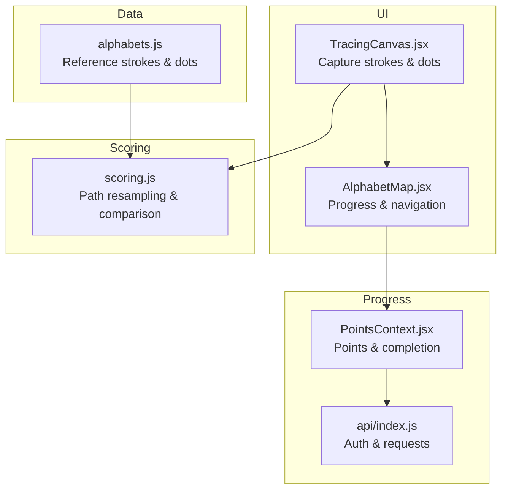
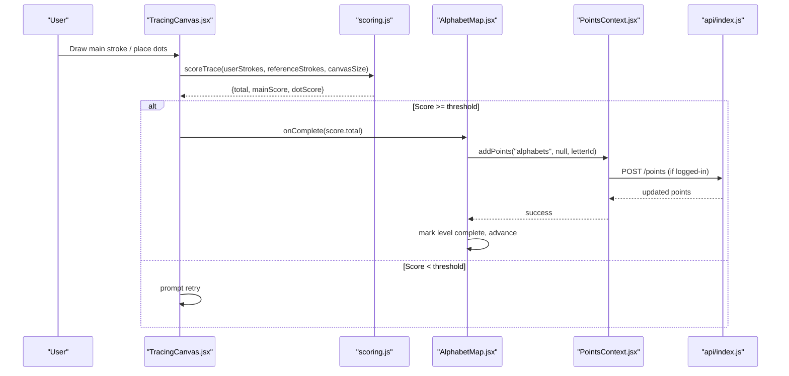
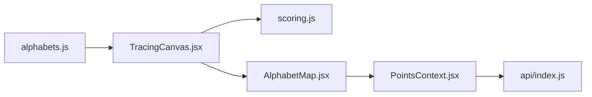

# Stroke Validation and Scoring Algorithms

<cite>
**Referenced Files in This Document**
- [alphabets.js](file://zabandaan/client/src/data/alphabets.js)
- [scoring.js](file://zabandaan/client/src/utils/scoring.js)
- [TracingCanvas.jsx](file://zabandaan/client/src/pages/alphabets/TracingCanvas.jsx)
- [AlphabetMap.jsx](file://zabandaan/client/src/pages/alphabets/AlphabetMap.jsx)
- [PointsContext.jsx](file://zabandaan/client/src/context/PointsContext.jsx)
- [api/index.js](file://zabandaan/client/src/api/index.js)
</cite>

## Table of Contents
1. Introduction
2. Project Structure
3. Core Components
4. Architecture Overview
5. Detailed Component Analysis
6. Dependency Analysis
7. Performance Considerations
8. Troubleshooting Guide
9. Conclusion

## Introduction
This document explains the stroke validation and scoring algorithms used to measure accuracy when users trace Urdu alphabets. It covers how user strokes are compared to reference patterns, how scores are computed for main strokes and dots, and how results drive learning progress. The focus is on path similarity calculations, tolerance thresholds, scoring parameters, and progression triggers as implemented in the codebase.

## Project Structure
The stroke recognition and scoring system spans a few key files:
- Reference data defines normalized paths and dot positions per letter.
- A tracing canvas captures user input (main strokes and dot placements).
- A scoring utility computes accuracy by comparing user strokes to references.
- Progress and points are tracked via context and API calls.

**Diagram sources**
- [alphabets.js:35-283](file://zabandaan/client/src/data/alphabets.js#L35-L283)
- [TracingCanvas.jsx:6-22](file://zabandaan/client/src/pages/alphabets/TracingCanvas.jsx#L6-L22)
- [scoring.js:106-140](file://zabandaan/client/src/utils/scoring.js#L106-L140)
- [AlphabetMap.jsx:48-67](file://zabandaan/client/src/pages/alphabets/AlphabetMap.jsx#L48-L67)
- [PointsContext.jsx:12-46](file://zabandaan/client/src/context/PointsContext.jsx#L12-L46)
- [api/index.js:1-30](file://zabandaan/client/src/api/index.js#L1-L30)

**Section sources**
- [alphabets.js:35-283](file://zabandaan/client/src/data/alphabets.js#L35-L283)
- [TracingCanvas.jsx:6-22](file://zabandaan/client/src/pages/alphabets/TracingCanvas.jsx#L6-L22)
- [scoring.js:106-140](file://zabandaan/client/src/utils/scoring.js#L106-L140)
- [AlphabetMap.jsx:48-67](file://zabandaan/client/src/pages/alphabets/AlphabetMap.jsx#L48-L67)
- [PointsContext.jsx:12-46](file://zabandaan/client/src/context/PointsContext.jsx#L12-L46)
- [api/index.js:1-30](file://zabandaan/client/src/api/index.js#L1-L30)

## Core Components
- Alphabets data structure: Defines each letter’s reference main stroke and expected dot positions using normalized coordinates (0–1). Paths are generated with smooth curves for consistent rendering and comparison.
- Tracing Canvas: Captures user input as main strokes and dot placements, renders guides, and triggers scoring.
- Scoring Utility: Resamples paths to equal length, compares point-by-point distances against a tolerance, and combines main stroke and dot scores into a total accuracy percentage.
- Progress and Points: On successful completion (score threshold), marks levels complete and updates points via local storage or API.

Key responsibilities:
- Path generation and normalization ensure stable references across devices.
- Real-time capture and mode switching guide users through drawing and dot placement.
- Scoring uses deterministic sampling and distance metrics to produce repeatable accuracy scores.
- Progression gates unlock subsequent letters based on completed levels.

**Section sources**
- [alphabets.js:6-33](file://zabandaan/client/src/data/alphabets.js#L6-L33)
- [alphabets.js:35-283](file://zabandaan/client/src/data/alphabets.js#L35-L283)
- [TracingCanvas.jsx:182-248](file://zabandaan/client/src/pages/alphabets/TracingCanvas.jsx#L182-L248)
- [scoring.js:7-43](file://zabandaan/client/src/utils/scoring.js#L7-L43)
- [scoring.js:49-72](file://zabandaan/client/src/utils/scoring.js#L49-L72)
- [scoring.js:78-97](file://zabandaan/client/src/utils/scoring.js#L78-L97)
- [scoring.js:106-140](file://zabandaan/client/src/utils/scoring.js#L106-L140)
- [AlphabetMap.jsx:43-67](file://zabandaan/client/src/pages/alphabets/AlphabetMap.jsx#L43-L67)
- [PointsContext.jsx:12-46](file://zabandaan/client/src/context/PointsContext.jsx#L12-L46)

## Architecture Overview
The flow begins with reference data, proceeds through user interaction, and ends with scoring and progress updates.

**Diagram sources**
- [TracingCanvas.jsx:244-261](file://zabandaan/client/src/pages/alphabets/TracingCanvas.jsx#L244-L261)
- [scoring.js:106-140](file://zabandaan/client/src/utils/scoring.js#L106-L140)
- [AlphabetMap.jsx:48-67](file://zabandaan/client/src/pages/alphabets/AlphabetMap.jsx#L48-L67)
- [PointsContext.jsx:12-46](file://zabandaan/client/src/context/PointsContext.jsx#L12-L46)
- [api/index.js:8-15](file://zabandaan/client/src/api/index.js#L8-L15)

## Detailed Component Analysis

### Alphabets Data Structure
- Each letter entry includes:
  - Identifier, display name, example word, and image path.
  - Strokes array containing one or more entries:
    - Main stroke: a sequence of normalized points forming the letter’s primary curve.
    - Dot strokes: zero or more entries defining where dots should be placed; each dot is a single point in normalized coordinates.
- Paths are generated using a smoothing function that interpolates between start/end points with control offsets, producing consistent curves regardless of device size. Normalized coordinates (0–1) allow scaling to any canvas size during scoring and rendering.

Implementation highlights:
- Smooth path generation ensures predictable geometry for comparison.
- Dot positions are stored as discrete points to simplify matching during scoring.

**Section sources**
- [alphabets.js:6-33](file://zabandaan/client/src/data/alphabets.js#L6-L33)
- [alphabets.js:35-283](file://zabandaan/client/src/data/alphabets.js#L35-L283)

### Tracing Canvas Interaction
- Modes:
  - Main mode: user draws the primary stroke along the dotted guide.
  - Dots mode: after drawing the main stroke (when required), user taps to place dots near target circles.
  - Done mode: displays score and allows continuation if passing threshold.
- Input handling:
  - Mouse and touch events capture coordinates relative to the canvas.
  - Current stroke accumulates points until mouse/touch release.
- Rendering:
  - Draws faint reference path with start/end markers.
  - Displays expected dot targets.
  - Renders user strokes smoothly using quadratic curves.
- Scoring trigger:
  - When conditions are met (main drawn and/or dots placed), user can check score.

Progression logic:
- If final score meets or exceeds the threshold, the component signals completion to the parent map, which unlocks the next letter and records progress.

**Section sources**
- [TracingCanvas.jsx:18-22](file://zabandaan/client/src/pages/alphabets/TracingCanvas.jsx#L18-L22)
- [TracingCanvas.jsx:182-248](file://zabandaan/client/src/pages/alphabets/TracingCanvas.jsx#L182-L248)
- [TracingCanvas.jsx:268-383](file://zabandaan/client/src/pages/alphabets/TracingCanvas.jsx#L268-L383)
- [AlphabetMap.jsx:43-67](file://zabandaan/client/src/pages/alphabets/AlphabetMap.jsx#L43-L67)

### Scoring Algorithm
Core steps:
- Path resampling:
  - Both user and reference paths are resampled to a fixed number of evenly spaced points along their lengths. This normalizes differences in sampling density caused by varying drawing speeds or device capabilities.
- Ordered point-to-point distance:
  - For each corresponding pair of resampled points, compute Euclidean distance. Sum these distances and divide by the number of samples to get average deviation.
- Tolerance-based scoring:
  - Define a maximum diagonal distance based on canvas size. Use a fraction of this diagonal as the tolerance threshold for acceptable deviation.
  - Convert average deviation into a 0–100 score: perfect alignment yields 100; larger deviations reduce the score linearly within bounds.
- Dot scoring:
  - For each expected dot position, find the closest user-placed dot. If within a generous radius (relative to canvas size), count it as matched.
  - Percentage of matched dots becomes the dot score.
- Combined score:
  - Total score is a weighted sum: primarily from the main stroke, supplemented by dot placement accuracy.

Mathematical notes:
- Resampling ensures fair comparison independent of input cadence.
- Distance metric is Euclidean; no angle or curvature analysis is performed.
- Thresholds are absolute percentages derived from geometric tolerances scaled by canvas size.

Complexity:
- Resampling: O(N) over input points.
- Comparison: O(S) where S is the fixed sample count.
- Dot matching: O(E × U) where E is expected dots and U is user dots.

Customization options present in code:
- Sample count for resampling.
- Tolerance fractions for main stroke and dot placement.
- Weights for combining main and dot scores.

**Section sources**
- [scoring.js:7-43](file://zabandaan/client/src/utils/scoring.js#L7-L43)
- [scoring.js:49-72](file://zabandaan/client/src/utils/scoring.js#L49-L72)
- [scoring.js:78-97](file://zabandaan/client/src/utils/scoring.js#L78-L97)
- [scoring.js:106-140](file://zabandaan/client/src/utils/scoring.js#L106-L140)

### Progression and Difficulty
- Completion threshold:
  - The UI considers a trace complete when the total score meets or exceeds a minimum threshold. This enables unlocking subsequent letters.
- Level unlocking:
  - The map tracks completed levels and prevents access to locked letters until the previous one is completed.
- Points and persistence:
  - On completion, points are added either locally (guest mode) or via API (authenticated users). Completed levels are persisted accordingly.

Note on difficulty:
- While a difficulty selection UI exists for other modules, the alphabets module currently uses a fixed threshold and does not adjust scoring parameters dynamically based on difficulty.

**Section sources**
- [TracingCanvas.jsx:331-383](file://zabandaan/client/src/pages/alphabets/TracingCanvas.jsx#L331-L383)
- [AlphabetMap.jsx:43-67](file://zabandaan/client/src/pages/alphabets/AlphabetMap.jsx#L43-L67)
- [PointsContext.jsx:12-46](file://zabandaan/client/src/context/PointsContext.jsx#L12-L46)

## Dependency Analysis

**Diagram sources**
- [alphabets.js:35-283](file://zabandaan/client/src/data/alphabets.js#L35-L283)
- [TracingCanvas.jsx:6-22](file://zabandaan/client/src/pages/alphabets/TracingCanvas.jsx#L6-L22)
- [scoring.js:106-140](file://zabandaan/client/src/utils/scoring.js#L106-L140)
- [AlphabetMap.jsx:48-67](file://zabandaan/client/src/pages/alphabets/AlphabetMap.jsx#L48-L67)
- [PointsContext.jsx:12-46](file://zabandaan/client/src/context/PointsContext.jsx#L12-L46)
- [api/index.js:1-30](file://zabandaan/client/src/api/index.js#L1-L30)

**Section sources**
- [alphabets.js:35-283](file://zabandaan/client/src/data/alphabets.js#L35-L283)
- [TracingCanvas.jsx:6-22](file://zabandaan/client/src/pages/alphabets/TracingCanvas.jsx#L6-L22)
- [scoring.js:106-140](file://zabandaan/client/src/utils/scoring.js#L106-L140)
- [AlphabetMap.jsx:48-67](file://zabandaan/client/src/pages/alphabets/AlphabetMap.jsx#L48-L67)
- [PointsContext.jsx:12-46](file://zabandaan/client/src/context/PointsContext.jsx#L12-L46)
- [api/index.js:1-30](file://zabandaan/client/src/api/index.js#L1-L30)

## Performance Considerations
- Fixed resample count keeps comparisons constant-time relative to input variability.
- Dot matching uses nested loops; keep expected and user dot counts small to avoid heavy computation.
- Canvas rendering uses efficient path drawing; avoid excessive redraws by batching state changes.
- High-DPI support scales canvas resolution appropriately without altering algorithmic complexity.

[No sources needed since this section provides general guidance]

## Troubleshooting Guide
Common issues and debugging techniques:
- Inconsistent scores across devices:
  - Verify canvas size passed to scoring matches actual pixel dimensions used during rendering.
  - Ensure reference paths are normalized and correctly scaled before comparison.
- Poor dot placement scores:
  - Check dot tolerance radius relative to canvas size; adjust if too strict or too lenient.
  - Confirm expected dot positions are correct in the alphabets data.
- Misaligned main stroke scores:
  - Inspect resampling behavior; very short or jagged inputs may affect averaging.
  - Validate that user strokes have sufficient points to be considered valid.
- Progress not updating:
  - Confirm completion threshold is met and that the completion handler is invoked.
  - For guest mode, verify localStorage keys and values are written correctly.
  - For authenticated users, check API responses and token handling.

Relevant implementation anchors:
- Scoring thresholds and weights:
  - Main stroke tolerance and sample count.
  - Dot tolerance radius.
  - Weighted combination formula.
- UI thresholds:
  - Minimum score to proceed.
  - Mode transitions and button visibility.
- Persistence:
  - LocalStorage keys for guest progress.
  - API endpoints for points and progress.

**Section sources**
- [scoring.js:49-72](file://zabandaan/client/src/utils/scoring.js#L49-L72)
- [scoring.js:78-97](file://zabandaan/client/src/utils/scoring.js#L78-L97)
- [scoring.js:106-140](file://zabandaan/client/src/utils/scoring.js#L106-L140)
- [TracingCanvas.jsx:331-383](file://zabandaan/client/src/pages/alphabets/TracingCanvas.jsx#L331-L383)
- [PointsContext.jsx:12-46](file://zabandaan/client/src/context/PointsContext.jsx#L12-L46)
- [api/index.js:8-15](file://zabandaan/client/src/api/index.js#L8-L15)

## Conclusion
The stroke validation system relies on robust path resampling and ordered distance comparison to evaluate user traces against normalized reference patterns. Scores combine main stroke accuracy with dot placement precision, driving progressive unlocking of letters upon meeting a defined threshold. While difficulty selection exists elsewhere in the app, the alphabets module currently uses fixed thresholds and tolerances. Customization points include sample count, tolerance fractions, and score weights, enabling tuning for different learner needs. Performance is optimized for real-time use through fixed-size comparisons and efficient rendering. Debugging focuses on ensuring correct scaling, thresholds, and persistence mechanisms.

[No sources needed since this section summarizes without analyzing specific files]