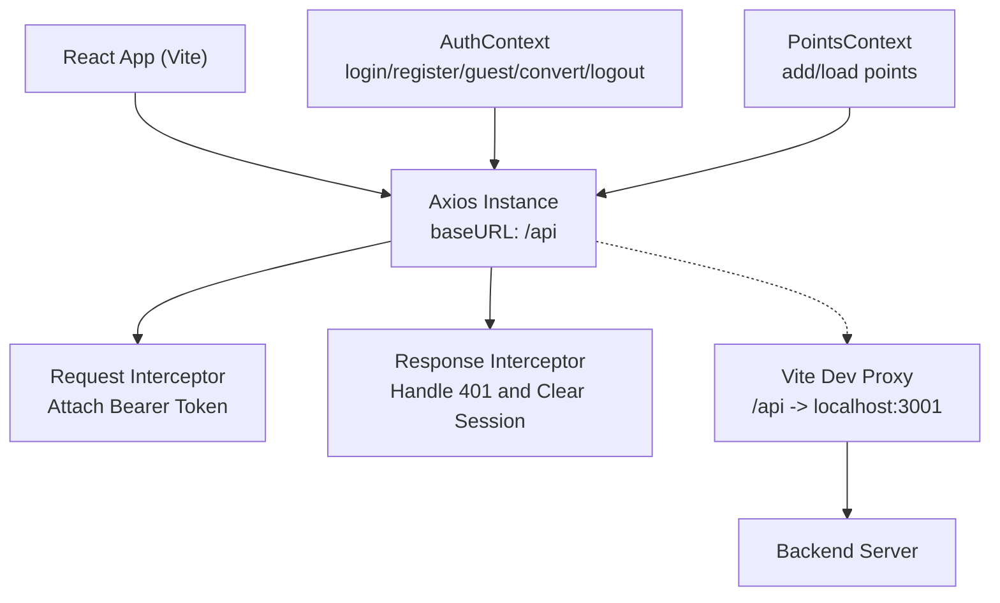
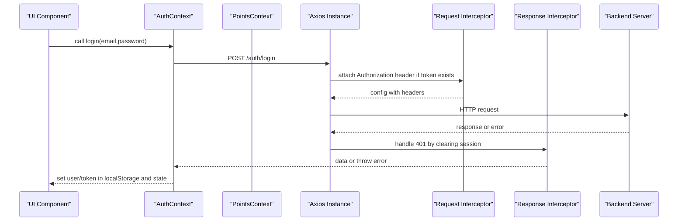
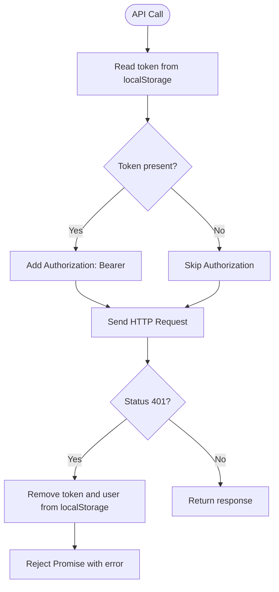
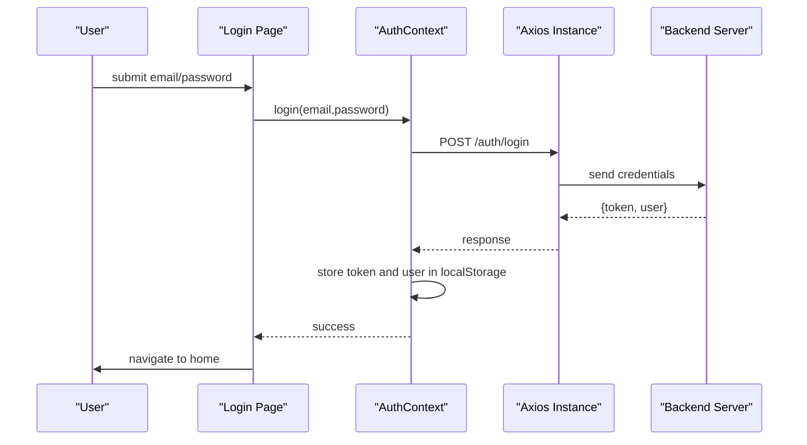
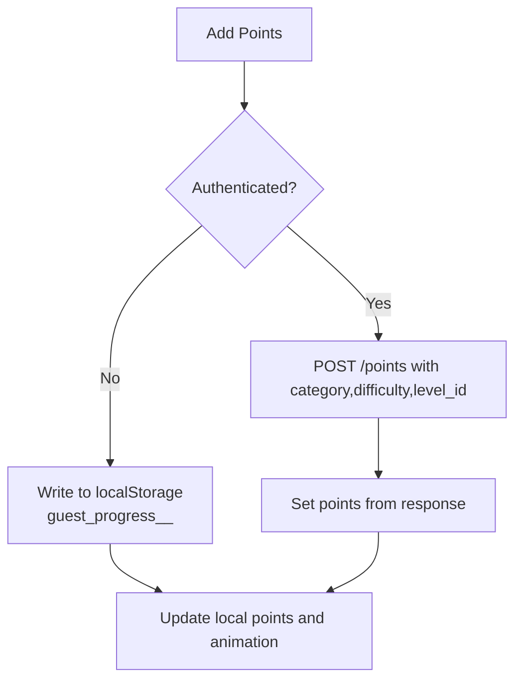
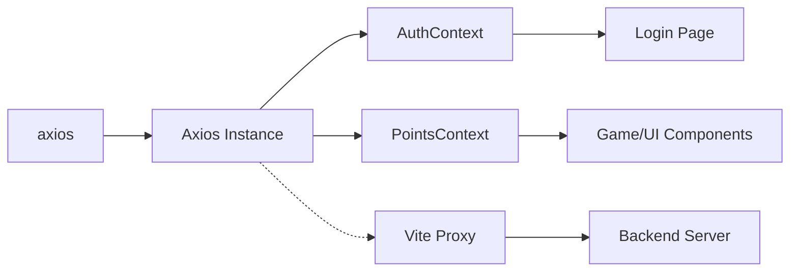

# API Integration

<cite>
**Referenced Files in This Document**
- [index.js](file://zabandaan/client/src/api/index.js)
- [AuthContext.jsx](file://zabandaan/client/src/context/AuthContext.jsx)
- [PointsContext.jsx](file://zabandaan/client/src/context/PointsContext.jsx)
- [Login.jsx](file://zabandaan/client/src/pages/Login.jsx)
- [App.jsx](file://zabandaan/client/src/App.jsx)
- [vite.config.js](file://zabandaan/client/vite.config.js)
</cite>

## Table of Contents
1. [Introduction](#introduction)
2. [Project Structure](#project-structure)
3. [Core Components](#core-components)
4. [Architecture Overview](#architecture-overview)
5. [Detailed Component Analysis](#detailed-component-analysis)
6. [Dependency Analysis](#dependency-analysis)
7. [Performance Considerations](#performance-considerations)
8. [Troubleshooting Guide](#troubleshooting-guide)
9. [Conclusion](#conclusion)

## Introduction
This document explains the API integration layer in Zabandaan, focusing on the centralized Axios configuration with interceptors for automatic token handling, request/response transformation, and error handling. It also documents the API service patterns used across the application for authentication, content retrieval, and progress tracking. The guide covers error handling strategies, retry mechanisms, offline support considerations, examples of API calls from different contexts, caching strategies for frequently accessed data, performance optimizations, authentication flow integration, token refresh mechanisms, and debugging techniques for API-related issues.

## Project Structure
The API integration is centered around a single Axios instance that is reused throughout the app. Authentication state and guest mode are managed via React Contexts, which coordinate local storage and API calls. The development server proxies API requests to a backend server.

**Diagram sources**
- [index.js:3-29](file://zabandaan/client/src/api/index.js#L3-L29)
- [AuthContext.jsx:31-83](file://zabandaan/client/src/context/AuthContext.jsx#L31-L83)
- [PointsContext.jsx:12-75](file://zabandaan/client/src/context/PointsContext.jsx#L12-L75)
- [vite.config.js:6-14](file://zabandaan/client/vite.config.js#L6-L14)

**Section sources**
- [index.js:1-29](file://zabandaan/client/src/api/index.js#L1-L29)
- [vite.config.js:1-16](file://zabandaan/client/vite.config.js#L1-L16)

## Core Components
- Centralized Axios instance with base URL and headers, plus request and response interceptors.
- Authentication context managing login, registration, guest mode, conversion, and logout.
- Points context handling progress tracking and synchronization with the backend or local storage for guests.
- Login page orchestrating user flows and displaying errors.
- Application routes wrapping protected pages with auth guards.

Key responsibilities:
- Automatic token injection into every outbound request.
- Centralized handling of unauthorized responses by clearing session data.
- Unified API usage patterns for auth and progress endpoints.
- Guest-mode fallback using local storage when not authenticated.

**Section sources**
- [index.js:1-29](file://zabandaan/client/src/api/index.js#L1-L29)
- [AuthContext.jsx:1-97](file://zabandaan/client/src/context/AuthContext.jsx#L1-L97)
- [PointsContext.jsx:1-114](file://zabandaan/client/src/context/PointsContext.jsx#L1-L114)
- [Login.jsx:1-302](file://zabandaan/client/src/pages/Login.jsx#L1-L302)
- [App.jsx:1-66](file://zabandaan/client/src/App.jsx#L1-L66)

## Architecture Overview
The API architecture uses a single Axios client configured at the module level. All network calls go through this client, ensuring consistent behavior for authentication, error handling, and transformations.

**Diagram sources**
- [AuthContext.jsx:31-41](file://zabandaan/client/src/context/AuthContext.jsx#L31-L41)
- [index.js:8-27](file://zabandaan/client/src/api/index.js#L8-L27)

## Detailed Component Analysis

### Centralized Axios Configuration
- Base URL set to /api to route all requests through the same path prefix.
- Default Content-Type header set to application/json.
- Request interceptor reads the current token from local storage and attaches it as a Bearer token in the Authorization header.
- Response interceptor clears stored session data on 401 Unauthorized responses and rethrows the error for callers to handle.

**Diagram sources**
- [index.js:8-27](file://zabandaan/client/src/api/index.js#L8-L27)

**Section sources**
- [index.js:1-29](file://zabandaan/client/src/api/index.js#L1-L29)

### Authentication Flow and Endpoints
- Login endpoint: posts credentials and stores returned token and user data in local storage; clears guest mode flags.
- Register endpoint: similar to login but creates a new account.
- Convert guest endpoint: converts guest session to a registered account while preserving progress.
- Logout: clears all session-related local storage entries and resets context state.

**Diagram sources**
- [Login.jsx:17-28](file://zabandaan/client/src/pages/Login.jsx#L17-L28)
- [AuthContext.jsx:31-41](file://zabandaan/client/src/context/AuthContext.jsx#L31-L41)
- [index.js:8-15](file://zabandaan/client/src/api/index.js#L8-L15)

**Section sources**
- [AuthContext.jsx:31-83](file://zabandaan/client/src/context/AuthContext.jsx#L31-L83)
- [Login.jsx:17-47](file://zabandaan/client/src/pages/Login.jsx#L17-L47)

### Progress Tracking and Content Retrieval Patterns
- Points context adds points for completed levels and loads total points.
- For authenticated users, it calls backend endpoints to persist and retrieve progress.
- For guest users, it tracks progress locally using keys prefixed with guest_progress_ and aggregates totals.

**Diagram sources**
- [PointsContext.jsx:12-46](file://zabandaan/client/src/context/PointsContext.jsx#L12-L46)

**Section sources**
- [PointsContext.jsx:12-75](file://zabandaan/client/src/context/PointsContext.jsx#L12-L75)

### Error Handling Strategies
- Unauthorized responses automatically clear session data via the response interceptor.
- UI components catch errors from API calls and display user-friendly messages.
- Errors are logged where appropriate to aid debugging.

Examples:
- Login page catches errors and shows an error message.
- Points context logs errors when adding or loading points.

**Section sources**
- [index.js:17-27](file://zabandaan/client/src/api/index.js#L17-L27)
- [Login.jsx:21-42](file://zabandaan/client/src/pages/Login.jsx#L21-L42)
- [PointsContext.jsx:43-74](file://zabandaan/client/src/context/PointsContext.jsx#L43-L74)

### Retry Mechanisms
- No explicit retry logic is implemented in the current Axios configuration or contexts.
- Network failures and transient errors are propagated to callers without automatic retries.
- Recommendation: add a retry wrapper for idempotent GET requests and exponential backoff for robustness.

[No sources needed since this section provides general guidance]

### Offline Support Considerations
- Guest mode persists progress locally, enabling offline use until connectivity returns.
- When online, guest progress can be converted to a registered account to sync with the backend.
- No service worker or advanced offline caching is currently implemented.

**Section sources**
- [AuthContext.jsx:55-74](file://zabandaan/client/src/context/AuthContext.jsx#L55-L74)
- [PointsContext.jsx:12-46](file://zabandaan/client/src/context/PointsContext.jsx#L12-L46)

### Examples of API Calls from Different Contexts
- Authentication:
  - Login: posts to /auth/login and stores token/user.
  - Register: posts to /auth/register and stores token/user.
  - Convert guest: posts to /auth/convert-guest and upgrades session.
- Progress:
  - Add points: posts to /points with category, difficulty, and level_id.
  - Load points: gets total points from /points.

These calls are made through the centralized Axios instance, ensuring consistent headers and error handling.

**Section sources**
- [AuthContext.jsx:31-83](file://zabandaan/client/src/context/AuthContext.jsx#L31-L83)
- [PointsContext.jsx:12-75](file://zabandaan/client/src/context/PointsContext.jsx#L12-L75)

### Caching Strategies for Frequently Accessed Data
- Current implementation does not include a dedicated caching layer for API responses.
- LocalStorage is used for session and guest progress persistence.
- Recommendation: introduce a lightweight cache (in-memory or IndexedDB) for read-heavy endpoints like points or static content to reduce network load.

[No sources needed since this section provides general guidance]

### Performance Optimizations for Network Requests
- Use a single Axios instance to avoid redundant configuration overhead.
- Minimize payload size by sending only necessary fields.
- Debounce frequent updates (e.g., point increments) to reduce network chatter.
- Consider batching multiple operations into a single request where possible.

[No sources needed since this section provides general guidance]

### Authentication Flow Integration
- Protected routes check authentication state before rendering sensitive pages.
- On 401 responses, the interceptor clears session data, prompting re-authentication.
- Guest mode allows limited access without backend calls until conversion.

**Section sources**
- [App.jsx:14-19](file://zabandaan/client/src/App.jsx#L14-L19)
- [index.js:17-27](file://zabandaan/client/src/api/index.js#L17-L27)

### Token Refresh Mechanisms
- No token refresh mechanism is currently implemented.
- On 401, the session is cleared and users must re-authenticate.
- Recommendation: implement a refresh token flow with silent renewal attempts before forcing re-login.

[No sources needed since this section provides general guidance]

### Debugging Techniques for API-Related Issues
- Inspect browser network tab to verify request URLs, headers, and payloads.
- Confirm that the Vite dev proxy forwards /api requests to the backend server.
- Check local storage for tokens and user data to ensure correct session state.
- Review console logs for error messages thrown by API calls.

**Section sources**
- [vite.config.js:6-14](file://zabandaan/client/vite.config.js#L6-L14)
- [index.js:8-27](file://zabandaan/client/src/api/index.js#L8-L27)

## Dependency Analysis
The API layer depends on:
- Axios for HTTP requests and interceptors.
- React Contexts for state management and coordination between UI and API calls.
- Vite dev server proxy to route API requests during development.

**Diagram sources**
- [index.js:1-29](file://zabandaan/client/src/api/index.js#L1-L29)
- [AuthContext.jsx:1-97](file://zabandaan/client/src/context/AuthContext.jsx#L1-L97)
- [PointsContext.jsx:1-114](file://zabandaan/client/src/context/PointsContext.jsx#L1-L114)
- [vite.config.js:6-14](file://zabandaan/client/vite.config.js#L6-L14)

**Section sources**
- [index.js:1-29](file://zabandaan/client/src/api/index.js#L1-L29)
- [AuthContext.jsx:1-97](file://zabandaan/client/src/context/AuthContext.jsx#L1-L97)
- [PointsContext.jsx:1-114](file://zabandaan/client/src/context/PointsContext.jsx#L1-L114)
- [vite.config.js:1-16](file://zabandaan/client/vite.config.js#L1-L16)

## Performance Considerations
- Keep API payloads minimal and focused.
- Avoid unnecessary re-renders by updating state efficiently in contexts.
- Use local storage judiciously to prevent excessive writes.
- Consider implementing caching for frequently accessed data to reduce network calls.
- Debounce rapid interactions that trigger API calls (e.g., scoring events).

[No sources needed since this section provides general guidance]

## Troubleshooting Guide
Common issues and resolutions:
- 401 Unauthorized:
  - The response interceptor clears session data; re-authenticate.
  - Verify that the token exists in local storage before making requests.
- Network errors:
  - Ensure the Vite proxy is correctly configured to forward /api requests to the backend.
  - Check backend availability and CORS settings if applicable.
- Guest mode inconsistencies:
  - Validate local storage keys and JSON structure for guest progress.
  - Use convert guest to sync progress to a registered account.

**Section sources**
- [index.js:17-27](file://zabandaan/client/src/api/index.js#L17-L27)
- [vite.config.js:6-14](file://zabandaan/client/vite.config.js#L6-L14)
- [PointsContext.jsx:52-75](file://zabandaan/client/src/context/PointsContext.jsx#L52-L75)

## Conclusion
Zabandaan’s API integration relies on a centralized Axios instance with interceptors for automatic token handling and unified error management. Authentication and progress tracking are encapsulated in React Contexts, providing a clean separation of concerns and consistent API usage patterns. While guest mode offers offline support via local storage, additional features such as retry mechanisms, token refresh, and caching can further improve resilience and performance. The development proxy simplifies local testing by routing API calls to the backend server.