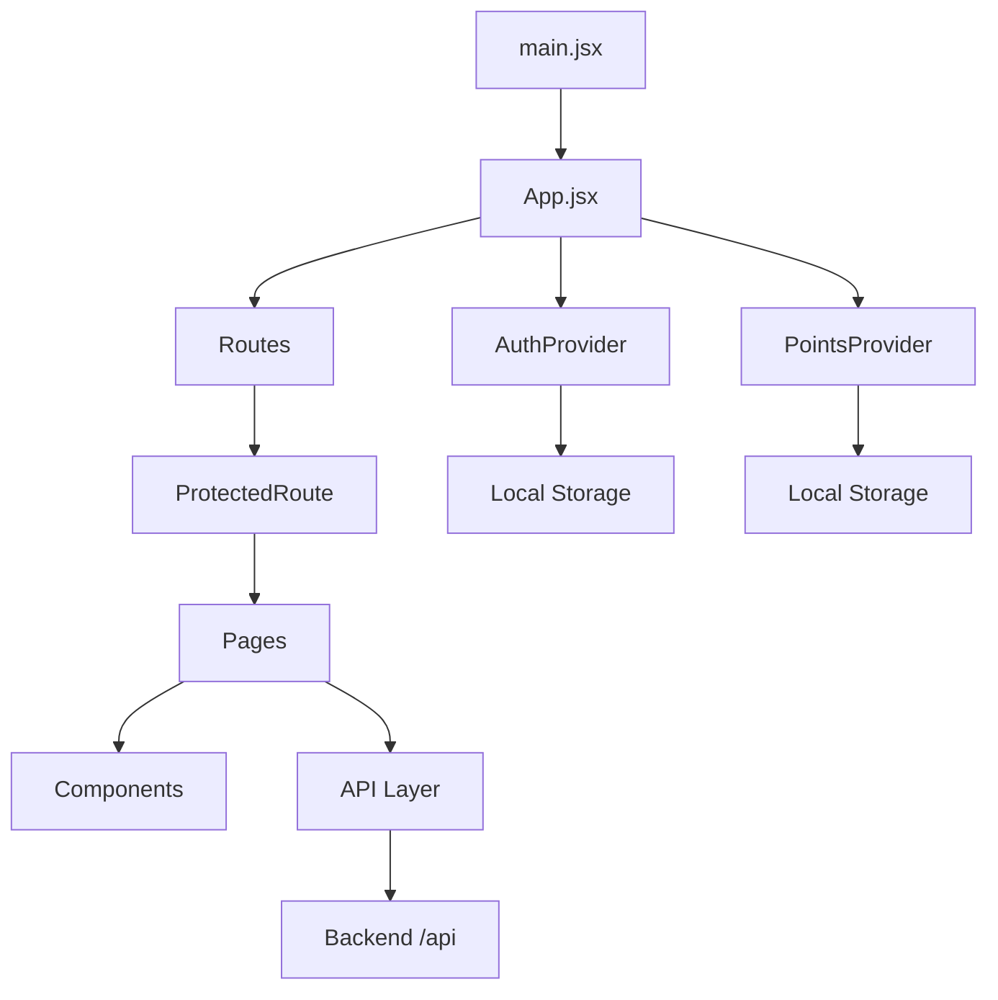
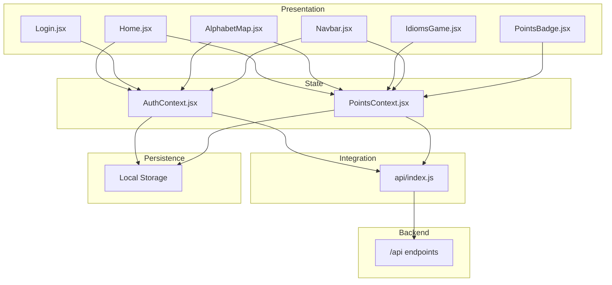
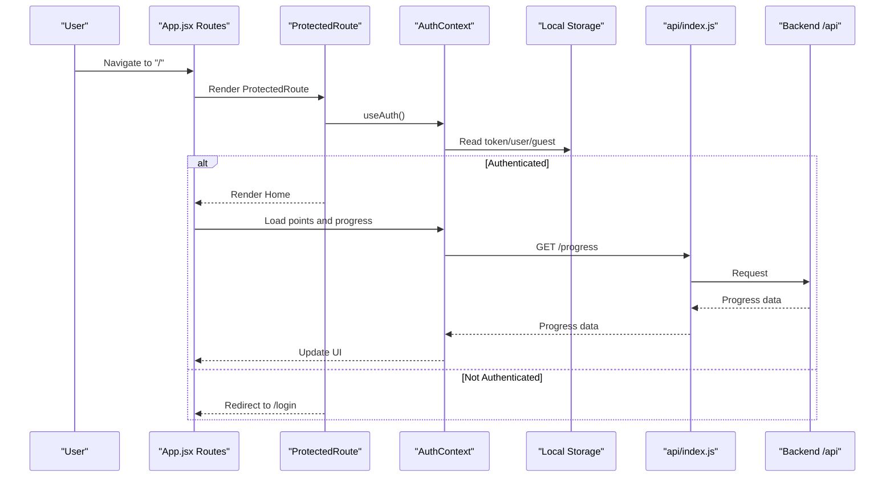
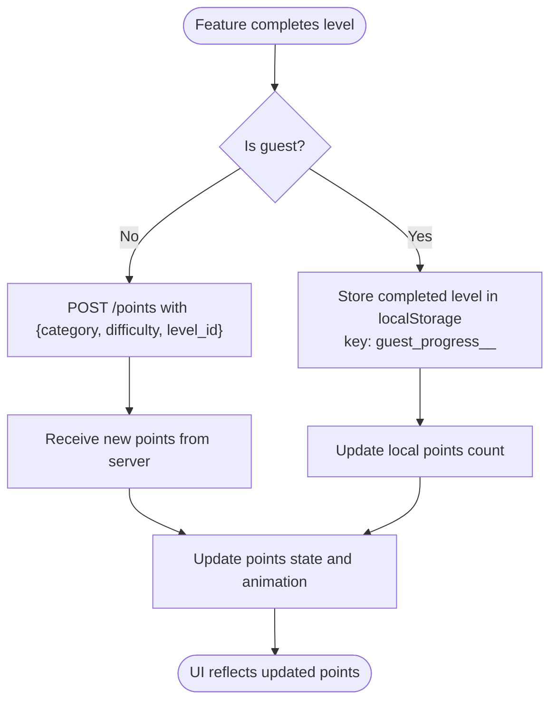
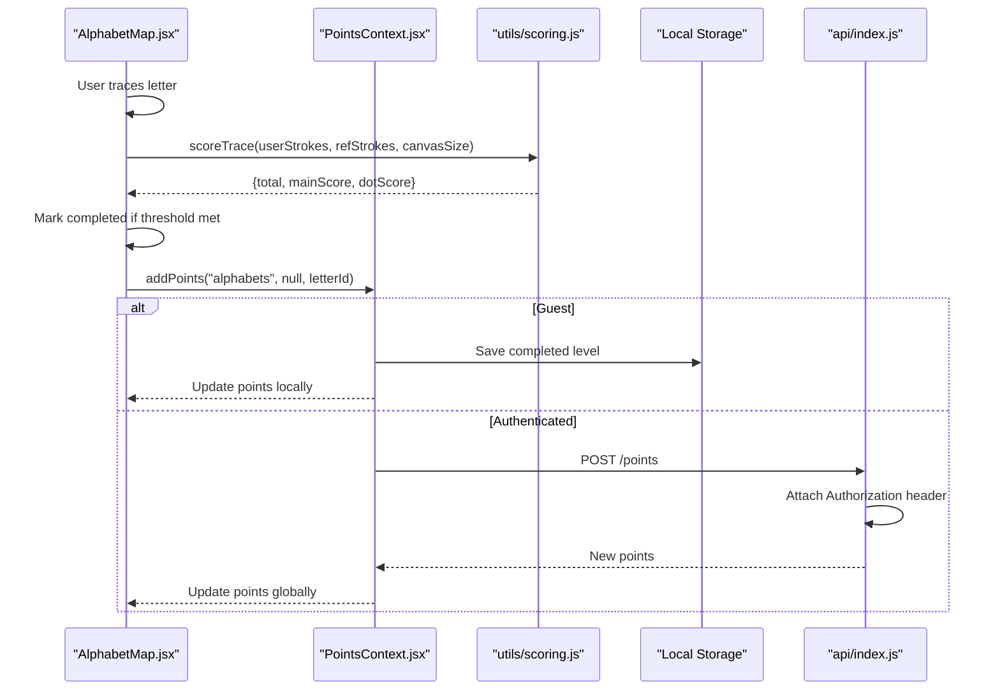
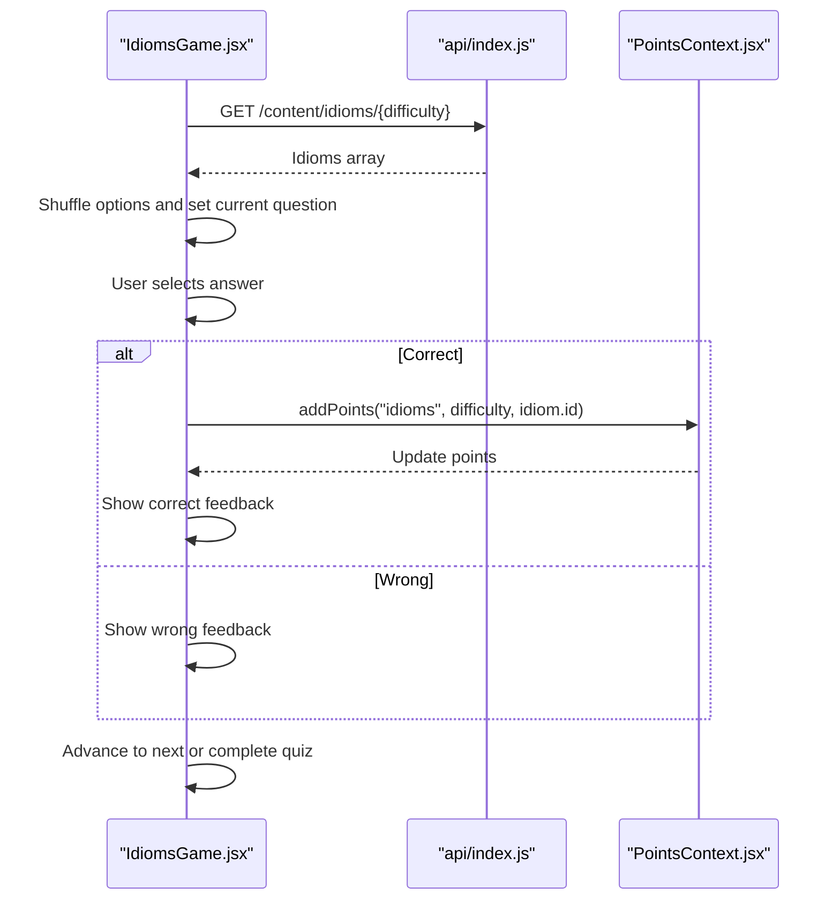
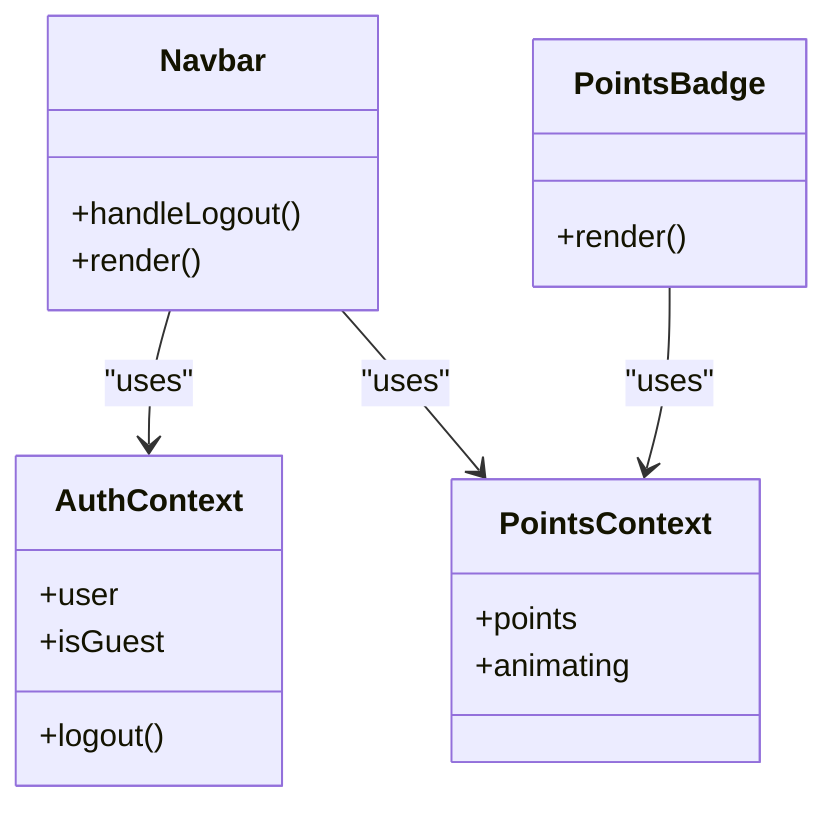
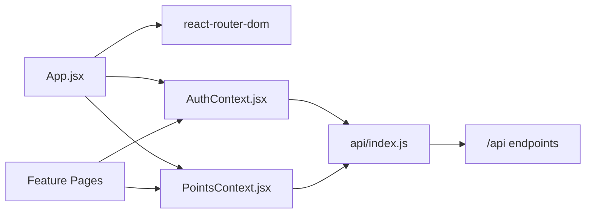

# Architecture Overview

<cite>
**Referenced Files in This Document**
- [App.jsx](file://zabandaan/client/src/App.jsx)
- [main.jsx](file://zabandaan/client/src/main.jsx)
- [AuthContext.jsx](file://zabandaan/client/src/context/AuthContext.jsx)
- [PointsContext.jsx](file://zabandaan/client/src/context/PointsContext.jsx)
- [index.js](file://zabandaan/client/src/api/index.js)
- [Home.jsx](file://zabandaan/client/src/pages/Home.jsx)
- [Login.jsx](file://zabandaan/client/src/pages/Login.jsx)
- [Navbar.jsx](file://zabandaan/client/src/components/Navbar.jsx)
- [PointsBadge.jsx](file://zabandaan/client/src/components/PointsBadge.jsx)
- [AlphabetMap.jsx](file://zabandaan/client/src/pages/alphabets/AlphabetMap.jsx)
- [IdiomsGame.jsx](file://zabandaan/client/src/pages/idioms/IdiomsGame.jsx)
- [scoring.js](file://zabandaan/client/src/utils/scoring.js)
- [package.json](file://zabandaan/client/package.json)
- [vite.config.js](file://zabandaan/client/vite.config.js)
</cite>

## Table of Contents
1. [Introduction](#introduction)
2. [Project Structure](#project-structure)
3. [Core Components](#core-components)
4. [Architecture Overview](#architecture-overview)
5. [Detailed Component Analysis](#detailed-component-analysis)
6. [Dependency Analysis](#dependency-analysis)
7. [Performance Considerations](#performance-considerations)
8. [Troubleshooting Guide](#troubleshooting-guide)
9. [Conclusion](#conclusion)

## Introduction
Zabandaan is a React-based single-page application that teaches Urdu through interactive modules such as alphabets, idioms, word search, and poetry. The app uses a component-based architecture with context-driven state management for authentication and gamification (points). It follows modern SPA patterns:
- Provider pattern via React Context for global state (authentication and points)
- Protected routes to enforce authentication
- Modular feature organization by pages and components
- Centralized API layer using Axios with interceptors for token handling and error handling
- Local storage synchronization for guest mode and session persistence

The technology stack includes React 19, Vite, React Router, and Axios.

## Project Structure
The client application is organized into logical layers:
- Entry point and routing: main.jsx and App.jsx
- Global state: context/AuthContext.jsx and context/PointsContext.jsx
- API integration: api/index.js
- Feature pages: pages/* (Home, Login, alphabets, idioms, wordsearch, poetry, Profile)
- Shared UI components: components/* (Navbar, PointsBadge, FeedbackFlash, SpeakerIcon, ComingSoon)
- Utilities: utils/* (scoring, speech, wordsearch)
- Data: data/* (alphabets)
- Styles: styles/* (global.css, variables.css)
- Build configuration: vite.config.js and package.json

**Diagram sources**
- [main.jsx:1-10](file://zabandaan/client/src/main.jsx#L1-L10)
- [App.jsx:1-66](file://zabandaan/client/src/App.jsx#L1-L66)
- [AuthContext.jsx:1-97](file://zabandaan/client/src/context/AuthContext.jsx#L1-L97)
- [PointsContext.jsx:1-114](file://zabandaan/client/src/context/PointsContext.jsx#L1-L114)
- [index.js:1-30](file://zabandaan/client/src/api/index.js#L1-L30)

**Section sources**
- [main.jsx:1-10](file://zabandaan/client/src/main.jsx#L1-L10)
- [App.jsx:1-66](file://zabandaan/client/src/App.jsx#L1-L66)
- [package.json:1-22](file://zabandaan/client/package.json#L1-L22)
- [vite.config.js:1-16](file://zabandaan/client/vite.config.js#L1-L16)

## Core Components
- Authentication provider (AuthProvider): Manages user session, guest mode, login/register, and logout; persists tokens and user data to local storage; exposes hooks for consuming components.
- Points provider (PointsProvider): Tracks gamification points, supports guest mode progress stored locally, syncs with backend when authenticated, and provides utilities to load and query progress.
- API layer (axios instance): Centralizes HTTP calls under /api, injects Authorization headers from local storage, and handles 401 responses by clearing auth state.
- Routing and protection: App.jsx defines routes and wraps protected routes behind AuthProvider and PointsProvider, redirecting unauthenticated users to login.

Key responsibilities:
- State synchronization between local storage and backend
- Cross-cutting concerns like authentication and error handling
- Consistent API behavior across features

**Section sources**
- [AuthContext.jsx:1-97](file://zabandaan/client/src/context/AuthContext.jsx#L1-L97)
- [PointsContext.jsx:1-114](file://zabandaan/client/src/context/PointsContext.jsx#L1-L114)
- [index.js:1-30](file://zabandaan/client/src/api/index.js#L1-L30)
- [App.jsx:14-66](file://zabandaan/client/src/App.jsx#L14-L66)

## Architecture Overview
The application follows a layered architecture:
- Presentation layer: Pages and shared components render UI based on context state
- State layer: Context providers manage global state (auth and points)
- Integration layer: API module encapsulates HTTP requests and error handling
- Persistence layer: Local storage holds sessions, tokens, and guest progress

**Diagram sources**
- [Home.jsx:1-219](file://zabandaan/client/src/pages/Home.jsx#L1-L219)
- [Login.jsx:1-302](file://zabandaan/client/src/pages/Login.jsx#L1-L302)
- [AlphabetMap.jsx:1-249](file://zabandaan/client/src/pages/alphabets/AlphabetMap.jsx#L1-L249)
- [IdiomsGame.jsx:1-446](file://zabandaan/client/src/pages/idioms/IdiomsGame.jsx#L1-L446)
- [Navbar.jsx:1-142](file://zabandaan/client/src/components/Navbar.jsx#L1-L142)
- [PointsBadge.jsx:1-24](file://zabandaan/client/src/components/PointsBadge.jsx#L1-L24)
- [AuthContext.jsx:1-97](file://zabandaan/client/src/context/AuthContext.jsx#L1-L97)
- [PointsContext.jsx:1-114](file://zabandaan/client/src/context/PointsContext.jsx#L1-L114)
- [index.js:1-30](file://zabandaan/client/src/api/index.js#L1-L30)

## Detailed Component Analysis

### Authentication Flow and Protected Routes
- App.jsx defines a ProtectedRoute component that checks the current user from AuthContext and redirects to /login if not authenticated.
- Routes wrap feature pages with ProtectedRoute to ensure only authenticated users access them.
- AuthContext initializes session from local storage on mount and exposes login, register, continueAsGuest, convertGuest, and logout functions.

**Diagram sources**
- [App.jsx:14-53](file://zabandaan/client/src/App.jsx#L14-L53)
- [AuthContext.jsx:11-29](file://zabandaan/client/src/context/AuthContext.jsx#L11-L29)
- [Home.jsx:21-53](file://zabandaan/client/src/pages/Home.jsx#L21-L53)
- [index.js:8-27](file://zabandaan/client/src/api/index.js#L8-L27)

**Section sources**
- [App.jsx:14-53](file://zabandaan/client/src/App.jsx#L14-L53)
- [AuthContext.jsx:11-29](file://zabandaan/client/src/context/AuthContext.jsx#L11-L29)
- [Home.jsx:21-53](file://zabandaan/client/src/pages/Home.jsx#L21-L53)

### Points and Gamification Flow
- PointsContext tracks points and animates changes; it differentiates guest vs authenticated flows.
- For guests, completed levels are stored per category/difficulty in local storage keys prefixed with guest_progress_.
- For authenticated users, addPoints posts to /points and updates local state; loadPoints fetches total points from /points.
- Home loads progress from either local storage (guest) or backend (/progress), computing completion percentages per category.

**Diagram sources**
- [PointsContext.jsx:12-46](file://zabandaan/client/src/context/PointsContext.jsx#L12-L46)
- [PointsContext.jsx:52-75](file://zabandaan/client/src/context/PointsContext.jsx#L52-L75)
- [Home.jsx:28-53](file://zabandaan/client/src/pages/Home.jsx#L28-L53)

**Section sources**
- [PointsContext.jsx:12-46](file://zabandaan/client/src/context/PointsContext.jsx#L12-L46)
- [PointsContext.jsx:52-75](file://zabandaan/client/src/context/PointsContext.jsx#L52-L75)
- [Home.jsx:28-53](file://zabandaan/client/src/pages/Home.jsx#L28-L53)

### Alphabet Tracing and Scoring
- AlphabetMap displays a grid of letters, unlocking subsequent letters upon completion.
- On completion, it marks the letter as completed, adds points via PointsContext, and shows feedback before auto-advancing.
- Scoring logic resides in utils/scoring.js, comparing user strokes to reference strokes with resampling and tolerance thresholds.

**Diagram sources**
- [AlphabetMap.jsx:48-67](file://zabandaan/client/src/pages/alphabets/AlphabetMap.jsx#L48-L67)
- [PointsContext.jsx:12-46](file://zabandaan/client/src/context/PointsContext.jsx#L12-L46)
- [scoring.js:106-140](file://zabandaan/client/src/utils/scoring.js#L106-L140)
- [index.js:8-15](file://zabandaan/client/src/api/index.js#L8-L15)

**Section sources**
- [AlphabetMap.jsx:48-67](file://zabandaan/client/src/pages/alphabets/AlphabetMap.jsx#L48-L67)
- [scoring.js:106-140](file://zabandaan/client/src/utils/scoring.js#L106-L140)
- [PointsContext.jsx:12-46](file://zabandaan/client/src/context/PointsContext.jsx#L12-L46)

### Idioms Quiz Flow
- IdiomsGame fetches content from /content/idioms/{difficulty}, shuffles options, and manages quiz state.
- Correct answers trigger points addition via PointsContext; wrong answers show feedback without points.
- Upon completion, the UI offers replay or navigation back to home.

**Diagram sources**
- [IdiomsGame.jsx:31-49](file://zabandaan/client/src/pages/idioms/IdiomsGame.jsx#L31-L49)
- [IdiomsGame.jsx:70-97](file://zabandaan/client/src/pages/idioms/IdiomsGame.jsx#L70-L97)
- [PointsContext.jsx:12-46](file://zabandaan/client/src/context/PointsContext.jsx#L12-L46)

**Section sources**
- [IdiomsGame.jsx:31-49](file://zabandaan/client/src/pages/idioms/IdiomsGame.jsx#L31-L49)
- [IdiomsGame.jsx:70-97](file://zabandaan/client/src/pages/idioms/IdiomsGame.jsx#L70-L97)

### Navbar and Points Badge Interaction
- Navbar renders navigation links and conditionally shows Logout or Save Progress based on guest status.
- PointsBadge displays current points and triggers visual feedback during animations.

**Diagram sources**
- [Navbar.jsx:1-142](file://zabandaan/client/src/components/Navbar.jsx#L1-L142)
- [PointsBadge.jsx:1-24](file://zabandaan/client/src/components/PointsBadge.jsx#L1-L24)
- [AuthContext.jsx:1-97](file://zabandaan/client/src/context/AuthContext.jsx#L1-L97)
- [PointsContext.jsx:1-114](file://zabandaan/client/src/context/PointsContext.jsx#L1-L114)

**Section sources**
- [Navbar.jsx:1-142](file://zabandaan/client/src/components/Navbar.jsx#L1-L142)
- [PointsBadge.jsx:1-24](file://zabandaan/client/src/components/PointsBadge.jsx#L1-L24)

## Dependency Analysis
- App.jsx depends on React Router for routing and on both contexts for global state.
- AuthContext depends on the API layer for authentication endpoints and local storage for session persistence.
- PointsContext depends on AuthContext to determine guest vs authenticated behavior and on the API layer for points operations.
- Feature pages depend on contexts and APIs to fetch and update data.
- Vite config proxies /api to the backend server, centralizing development proxy configuration.

**Diagram sources**
- [App.jsx:1-66](file://zabandaan/client/src/App.jsx#L1-L66)
- [AuthContext.jsx:1-97](file://zabandaan/client/src/context/AuthContext.jsx#L1-L97)
- [PointsContext.jsx:1-114](file://zabandaan/client/src/context/PointsContext.jsx#L1-L114)
- [index.js:1-30](file://zabandaan/client/src/api/index.js#L1-L30)

**Section sources**
- [App.jsx:1-66](file://zabandaan/client/src/App.jsx#L1-L66)
- [AuthContext.jsx:1-97](file://zabandaan/client/src/context/AuthContext.jsx#L1-L97)
- [PointsContext.jsx:1-114](file://zabandaan/client/src/context/PointsContext.jsx#L1-L114)
- [index.js:1-30](file://zabandaan/client/src/api/index.js#L1-L30)

## Performance Considerations
- Use memoization where appropriate in feature components to avoid unnecessary re-renders.
- Debounce or throttle frequent state updates (e.g., tracing input) to reduce rendering overhead.
- Batch API calls when loading multiple categories to minimize network requests.
- Leverage React’s strict mode during development to catch potential issues early.
- Keep local storage operations minimal and structured to avoid parsing overhead.

[No sources needed since this section provides general guidance]

## Troubleshooting Guide
Common issues and resolutions:
- 401 Unauthorized: The API interceptor clears token and user from local storage; ensure login flow resets state and redirects appropriately.
- Guest progress not syncing: Verify local storage keys follow the expected format and that conversion to registered account transfers progress correctly.
- Points not updating: Confirm addPoints is called with correct category, difficulty, and level_id; check network requests to /points.
- Route protection loops: Ensure ProtectedRoute waits for auth loading state before rendering to prevent premature redirects.

**Section sources**
- [index.js:17-27](file://zabandaan/client/src/api/index.js#L17-L27)
- [AuthContext.jsx:11-29](file://zabandaan/client/src/context/AuthContext.jsx#L11-L29)
- [PointsContext.jsx:12-46](file://zabandaan/client/src/context/PointsContext.jsx#L12-L46)
- [App.jsx:14-53](file://zabandaan/client/src/App.jsx#L14-L53)

## Conclusion
Zabandaan employs a clean, modular React SPA architecture centered around context-based state management and a centralized API layer. The Provider pattern enables consistent authentication and gamification across features, while Protected Routes enforce security. Local storage ensures seamless guest experiences and session persistence, with backend synchronization for authenticated users. The design supports scalability and maintainability, making it straightforward to add new learning modules and enhance existing ones.

[No sources needed since this section summarizes without analyzing specific files]