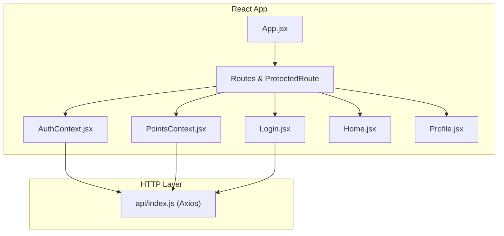
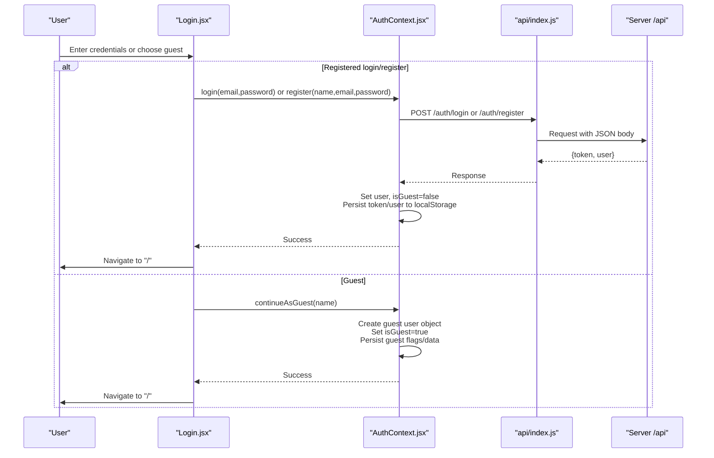
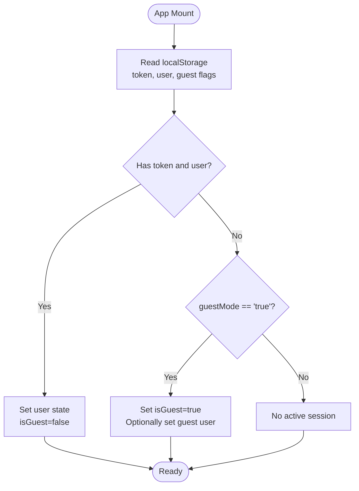
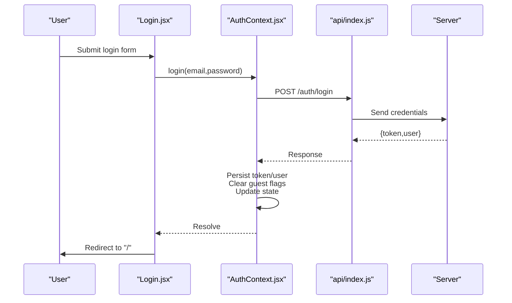
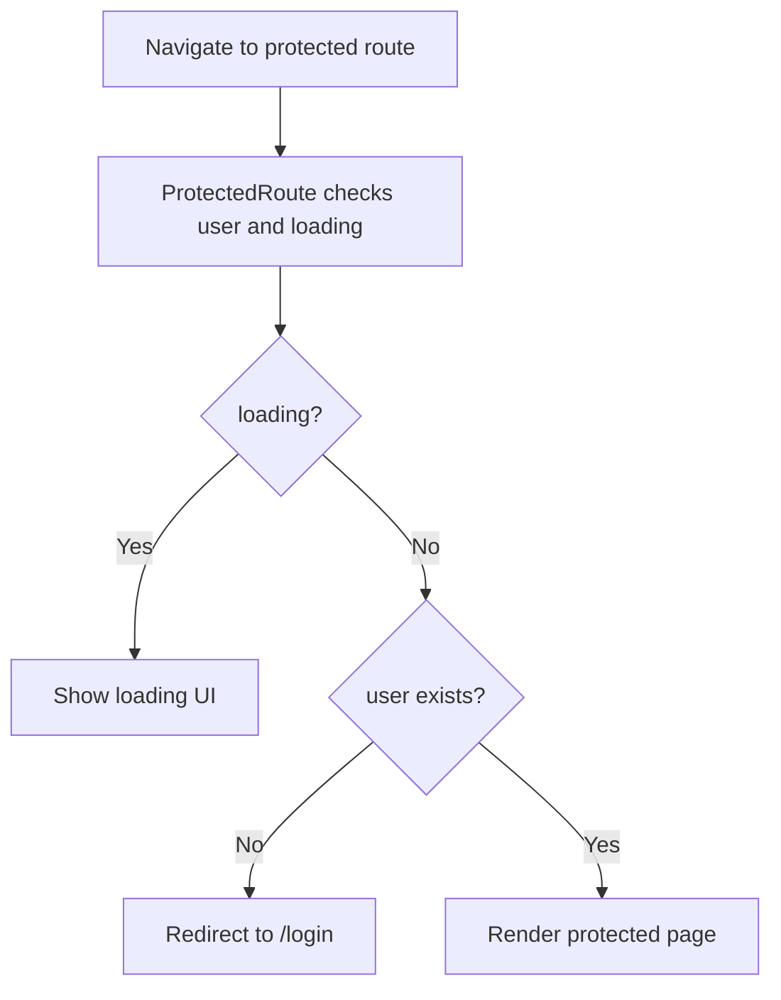
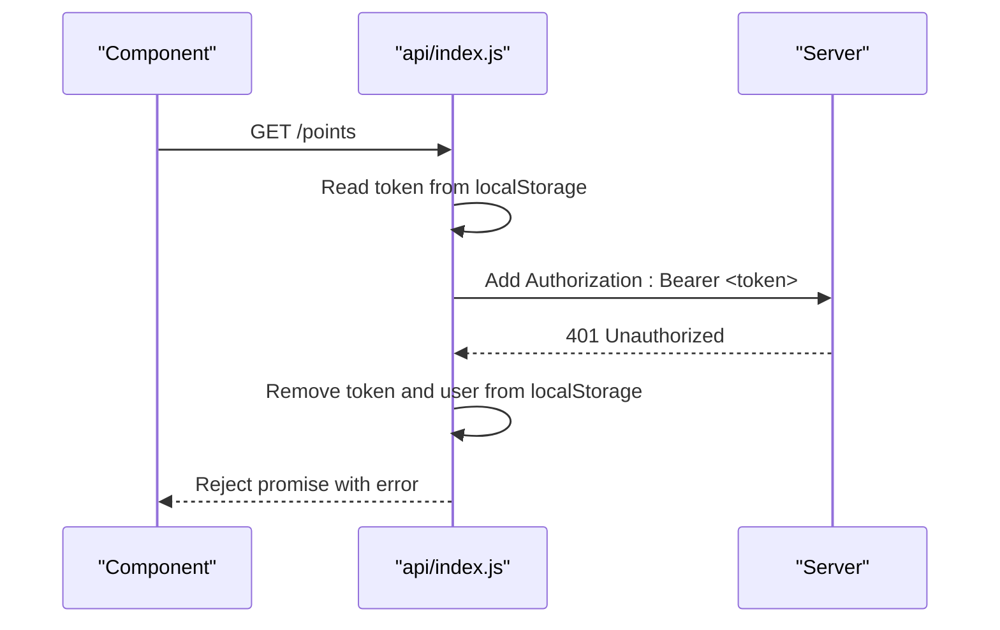
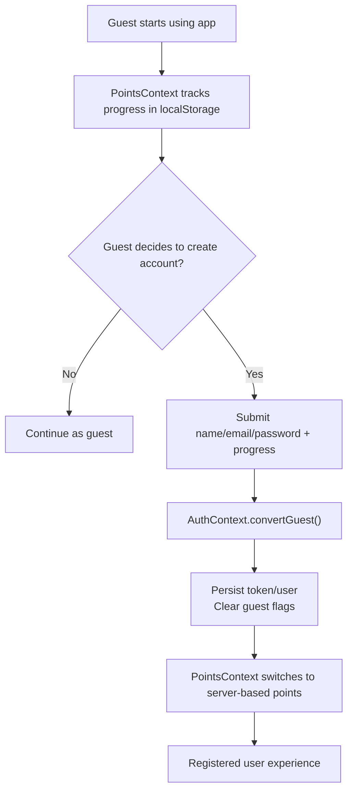
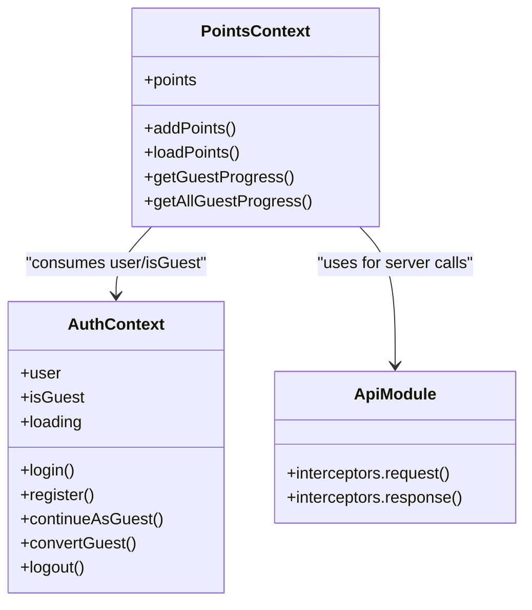
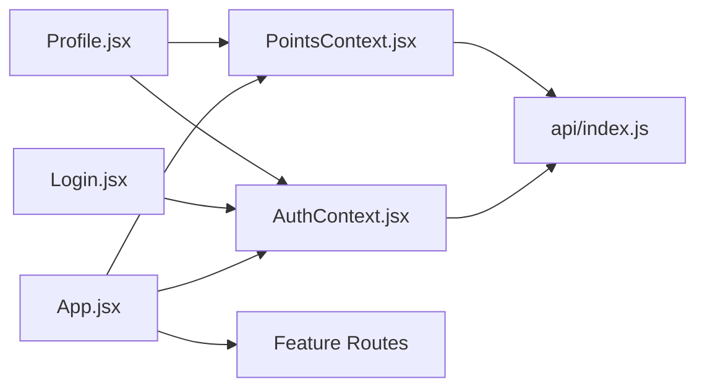

# Authentication Architecture

<cite>
**Referenced Files in This Document**
- [AuthContext.jsx](file://zabandaan/client/src/context/AuthContext.jsx)
- [PointsContext.jsx](file://zabandaan/client/src/context/PointsContext.jsx)
- [Login.jsx](file://zabandaan/client/src/pages/Login.jsx)
- [App.jsx](file://zabandaan/client/src/App.jsx)
- [api/index.js](file://zabandaan/client/src/api/index.js)
- [Home.jsx](file://zabandaan/client/src/pages/Home.jsx)
- [Profile.jsx](file://zabandaan/client/src/pages/Profile.jsx)
</cite>

## Table of Contents
1. [Introduction](#introduction)
2. [Project Structure](#project-structure)
3. [Core Components](#core-components)
4. [Architecture Overview](#architecture-overview)
5. [Detailed Component Analysis](#detailed-component-analysis)
6. [Dependency Analysis](#dependency-analysis)
7. [Performance Considerations](#performance-considerations)
8. [Troubleshooting Guide](#troubleshooting-guide)
9. [Conclusion](#conclusion)

## Introduction
This document explains the authentication architecture in Zabandaan with a focus on how user sessions, guest mode, and authentication state are managed across the application. It covers:
- AuthContext implementation for session management and state propagation
- Login flow from the Login component through API integration to state updates
- Protected route pattern used to secure feature pages
- Session persistence via localStorage and token handling with Axios interceptors
- Conversion between guest and registered user modes
- Security considerations, error handling, and interaction with PointsContext

## Project Structure
The authentication system is implemented primarily in the client-side React application:
- Contexts provide global state for authentication and points
- Pages implement UI flows (login, home, profile)
- A centralized API module handles HTTP requests, token injection, and 401 handling
- App-level routing enforces protected routes

**Diagram sources**
- [App.jsx:14-53](file://zabandaan/client/src/App.jsx#L14-L53)
- [AuthContext.jsx:6-90](file://zabandaan/client/src/context/AuthContext.jsx#L6-L90)
- [PointsContext.jsx:7-107](file://zabandaan/client/src/context/PointsContext.jsx#L7-L107)
- [Login.jsx:17-47](file://zabandaan/client/src/pages/Login.jsx#L17-L47)
- [api/index.js:3-29](file://zabandaan/client/src/api/index.js#L3-L29)

**Section sources**
- [App.jsx:14-53](file://zabandaan/client/src/App.jsx#L14-L53)
- [AuthContext.jsx:6-90](file://zabandaan/client/src/context/AuthContext.jsx#L6-L90)
- [PointsContext.jsx:7-107](file://zabandaan/client/src/context/PointsContext.jsx#L7-L107)
- [Login.jsx:17-47](file://zabandaan/client/src/pages/Login.jsx#L17-L47)
- [api/index.js:3-29](file://zabandaan/client/src/api/index.js#L3-L29)

## Core Components
- AuthContext: Manages user identity, guest mode flag, loading state, and provides login/register/guest/convert/logout actions. Persists session data in localStorage and restores it on app start.
- PointsContext: Tracks points and progress, branching logic for guest vs registered users. Uses AuthContext to determine storage strategy (localStorage vs server).
- Login: UI for landing, login, and registration; triggers AuthContext methods and navigates after success.
- App.jsx: Defines ProtectedRoute and routes that enforce authentication before rendering feature pages.
- api/index.js: Centralized Axios instance that injects Authorization headers and clears tokens on 401 responses.

Key responsibilities:
- State propagation: AuthContext exposes user, isGuest, loading, and action functions via React context.
- Persistence: Token and user data stored in localStorage; restored on mount.
- Interceptors: Automatic header injection and 401 cleanup.
- Guest mode: Local-only progress tracking until conversion to registered user.

**Section sources**
- [AuthContext.jsx:6-90](file://zabandaan/client/src/context/AuthContext.jsx#L6-L90)
- [PointsContext.jsx:7-107](file://zabandaan/client/src/context/PointsContext.jsx#L7-L107)
- [Login.jsx:17-47](file://zabandaan/client/src/pages/Login.jsx#L17-L47)
- [App.jsx:14-53](file://zabandaan/client/src/App.jsx#L14-L53)
- [api/index.js:3-29](file://zabandaan/client/src/api/index.js#L3-L29)

## Architecture Overview
The authentication architecture combines React Context for state, Axios interceptors for request/response handling, and route guards for access control.

**Diagram sources**
- [Login.jsx:17-47](file://zabandaan/client/src/pages/Login.jsx#L17-L47)
- [AuthContext.jsx:31-74](file://zabandaan/client/src/context/AuthContext.jsx#L31-L74)
- [api/index.js:3-29](file://zabandaan/client/src/api/index.js#L3-L29)

## Detailed Component Analysis

### AuthContext: Session Management and State Propagation
- Initializes state: user, isGuest, loading
- On mount, restores session from localStorage:
  - If token and user exist, set user and clear guest flags
  - Else if guestMode is true, set isGuest and optionally restore guest user data
- Actions:
  - login/register: call API, persist token/user, remove guest flags, update state
  - continueAsGuest: create local guest user, set isGuest, persist guest flags
  - convertGuest: call API to migrate guest progress to account, persist token/user, clear guest flags
  - logout: clear all persisted auth data and reset state
- Exposes useAuth hook for consumers

**Diagram sources**
- [AuthContext.jsx:11-29](file://zabandaan/client/src/context/AuthContext.jsx#L11-L29)

**Section sources**
- [AuthContext.jsx:6-90](file://zabandaan/client/src/context/AuthContext.jsx#L6-L90)

### Login Flow: From UI to State Update
- Landing page offers Create Account, Log In, Continue as Guest
- Login/Register:
  - Validates inputs locally
  - Calls AuthContext.login/register
  - On success, navigates to home
  - On failure, displays error message
- Guest:
  - Creates guest user and sets isGuest
  - Navigates to home

**Diagram sources**
- [Login.jsx:17-47](file://zabandaan/client/src/pages/Login.jsx#L17-L47)
- [AuthContext.jsx:31-41](file://zabandaan/client/src/context/AuthContext.jsx#L31-L41)
- [api/index.js:3-29](file://zabandaan/client/src/api/index.js#L3-L29)

**Section sources**
- [Login.jsx:17-47](file://zabandaan/client/src/pages/Login.jsx#L17-L47)
- [AuthContext.jsx:31-41](file://zabandaan/client/src/context/AuthContext.jsx#L31-L41)

### Protected Route Pattern
- A higher-order component wraps protected routes to check authentication state
- While loading, shows a loading indicator
- If no user, redirects to /login
- Feature routes are wrapped with this guard

**Diagram sources**
- [App.jsx:14-19](file://zabandaan/client/src/App.jsx#L14-L19)
- [App.jsx:40-53](file://zabandaan/client/src/App.jsx#L40-L53)

**Section sources**
- [App.jsx:14-19](file://zabandaan/client/src/App.jsx#L14-L19)
- [App.jsx:40-53](file://zabandaan/client/src/App.jsx#L40-L53)

### Session Persistence and Token Management
- Persistence keys:
  - Token: zabandaan_token
  - User: zabandaan_user
  - Guest mode: zabandaan_guest, zabandaan_guest_data
- On app start, AuthContext reads these keys to restore session
- On successful login/register/convert, token and user are saved; guest flags are removed
- On logout, all auth-related keys are cleared

- Axios interceptors:
  - Request interceptor attaches Authorization header using the stored token
  - Response interceptor removes token and user on 401 responses

**Diagram sources**
- [api/index.js:8-27](file://zabandaan/client/src/api/index.js#L8-L27)

**Section sources**
- [AuthContext.jsx:11-29](file://zabandaan/client/src/context/AuthContext.jsx#L11-L29)
- [AuthContext.jsx:31-83](file://zabandaan/client/src/context/AuthContext.jsx#L31-L83)
- [api/index.js:8-27](file://zabandaan/client/src/api/index.js#L8-L27)

### Guest Mode and Conversion to Registered User
- Guest mode:
  - Sets isGuest=true and stores guest user data
  - PointsContext uses localStorage to track progress locally
- Conversion:
  - Profile allows guests to create an account and submit their progress
  - AuthContext.convertGuest calls server endpoint to migrate progress
  - After conversion, token/user are persisted and guest flags are cleared
  - PointsContext switches to server-backed points and progress

**Diagram sources**
- [AuthContext.jsx:55-74](file://zabandaan/client/src/context/AuthContext.jsx#L55-L74)
- [PointsContext.jsx:12-46](file://zabandaan/client/src/context/PointsContext.jsx#L12-L46)
- [Profile.jsx:44-61](file://zabandaan/client/src/pages/Profile.jsx#L44-L61)

**Section sources**
- [AuthContext.jsx:55-74](file://zabandaan/client/src/context/AuthContext.jsx#L55-L74)
- [PointsContext.jsx:12-46](file://zabandaan/client/src/context/PointsContext.jsx#L12-L46)
- [Profile.jsx:44-61](file://zabandaan/client/src/pages/Profile.jsx#L44-L61)

### Relationship Between Authentication State and PointsContext
- PointsContext consumes AuthContext to determine behavior:
  - If isGuest or no user, store progress locally under keys like guest_progress_<category>_<difficulty>
  - Otherwise, call server endpoints to add/load points and progress
- Home and Profile load points and progress based on current auth state

**Diagram sources**
- [AuthContext.jsx:6-90](file://zabandaan/client/src/context/AuthContext.jsx#L6-L90)
- [PointsContext.jsx:7-107](file://zabandaan/client/src/context/PointsContext.jsx#L7-L107)
- [api/index.js:3-29](file://zabandaan/client/src/api/index.js#L3-L29)

**Section sources**
- [PointsContext.jsx:12-46](file://zabandaan/client/src/context/PointsContext.jsx#L12-L46)
- [PointsContext.jsx:52-75](file://zabandaan/client/src/context/PointsContext.jsx#L52-L75)
- [Home.jsx:21-53](file://zabandaan/client/src/pages/Home.jsx#L21-L53)
- [Profile.jsx:30-42](file://zabandaan/client/src/pages/Profile.jsx#L30-L42)

## Dependency Analysis
- App.jsx depends on:
  - AuthProvider and ProtectedRoute from AuthContext
  - PointsProvider for points state
  - Route components for features
- AuthContext depends on:
  - api module for network calls
  - localStorage for persistence
- PointsContext depends on:
  - AuthContext for user state
  - api module for server calls when not in guest mode
- Login and Profile depend on:
  - AuthContext for actions and state
  - PointsContext for progress display and migration

**Diagram sources**
- [App.jsx:14-53](file://zabandaan/client/src/App.jsx#L14-L53)
- [AuthContext.jsx:6-90](file://zabandaan/client/src/context/AuthContext.jsx#L6-L90)
- [PointsContext.jsx:7-107](file://zabandaan/client/src/context/PointsContext.jsx#L7-L107)
- [Login.jsx:17-47](file://zabandaan/client/src/pages/Login.jsx#L17-L47)
- [Profile.jsx:8-18](file://zabandaan/client/src/pages/Profile.jsx#L8-L18)

**Section sources**
- [App.jsx:14-53](file://zabandaan/client/src/App.jsx#L14-L53)
- [AuthContext.jsx:6-90](file://zabandaan/client/src/context/AuthContext.jsx#L6-L90)
- [PointsContext.jsx:7-107](file://zabandaan/client/src/context/PointsContext.jsx#L7-L107)
- [Login.jsx:17-47](file://zabandaan/client/src/pages/Login.jsx#L17-L47)
- [Profile.jsx:8-18](file://zabandaan/client/src/pages/Profile.jsx#L8-L18)

## Performance Considerations
- Minimal re-renders: AuthContext updates only necessary state fields; hooks ensure efficient consumption
- Local-first guest mode avoids unnecessary network calls during guest usage
- Axios interceptors centralize token handling, reducing duplication and potential errors
- PointsContext batches UI animations for point increments to avoid excessive repaints

[No sources needed since this section provides general guidance]

## Troubleshooting Guide
Common issues and resolutions:
- Stuck on loading screen:
  - Ensure AuthContext has finished restoring session from localStorage
  - Verify that token and user keys exist and are valid JSON
- Repeated redirects to login:
  - Check that 401 responses are handled by clearing stale tokens
  - Confirm that ProtectedRoute receives updated user state
- Guest progress not saving:
  - Verify localStorage keys for guest progress are present and correctly formatted
  - Ensure convertGuest is called with required fields and progress data
- Network errors:
  - Inspect axios error responses and console logs in PointsContext and Login
  - Validate server endpoints and CORS settings

**Section sources**
- [api/index.js:17-27](file://zabandaan/client/src/api/index.js#L17-L27)
- [Login.jsx:17-47](file://zabandaan/client/src/pages/Login.jsx#L17-L47)
- [PointsContext.jsx:12-46](file://zabandaan/client/src/context/PointsContext.jsx#L12-L46)
- [Profile.jsx:44-61](file://zabandaan/client/src/pages/Profile.jsx#L44-L61)

## Conclusion
Zabandaan’s authentication architecture leverages React Context for global state, Axios interceptors for consistent token handling, and route guards to protect feature pages. The system supports both registered users and guests, with seamless conversion from guest to registered accounts while preserving progress. Session persistence via localStorage ensures continuity across reloads, and error handling at the API layer maintains a robust user experience. Integration with PointsContext enables differentiated behavior for guest versus authenticated users, ensuring accurate progress tracking and points management.

[No sources needed since this section summarizes without analyzing specific files]