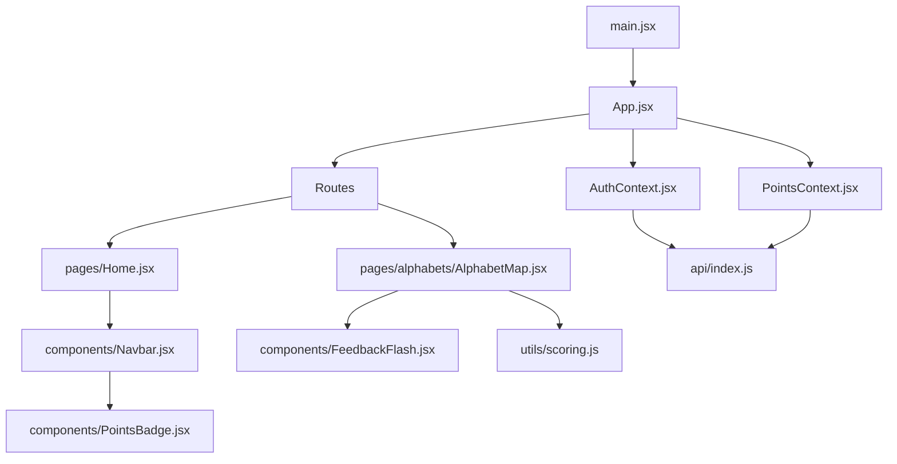
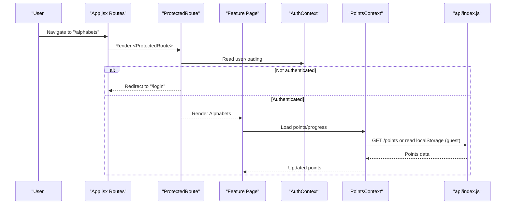
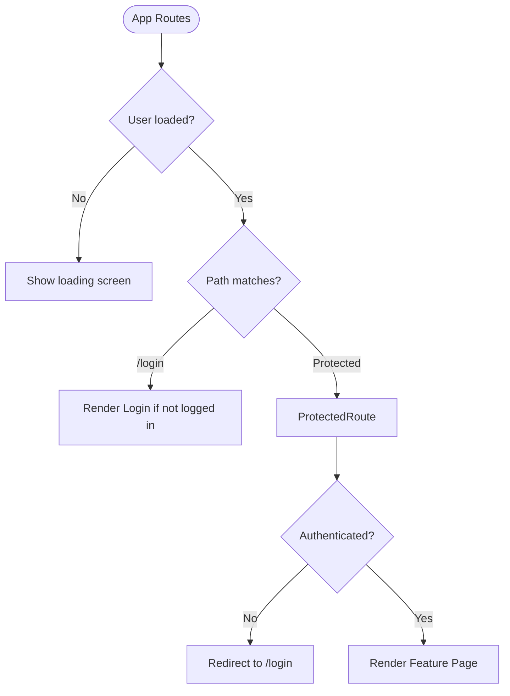
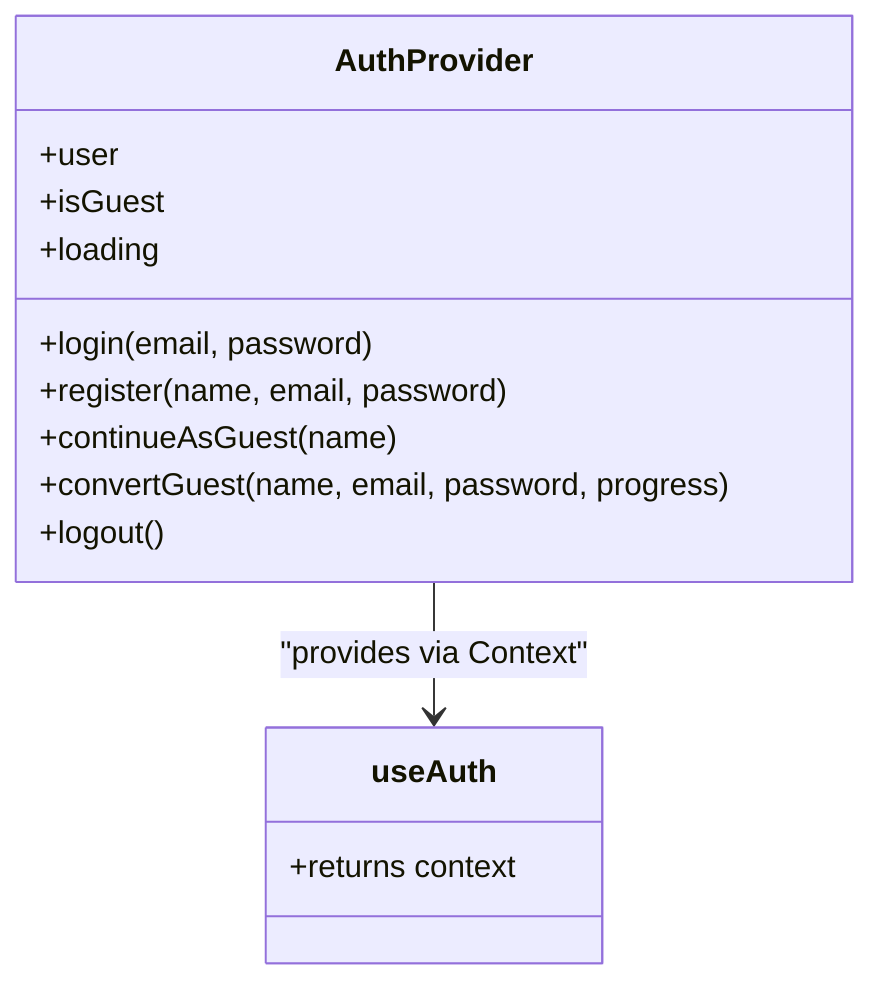
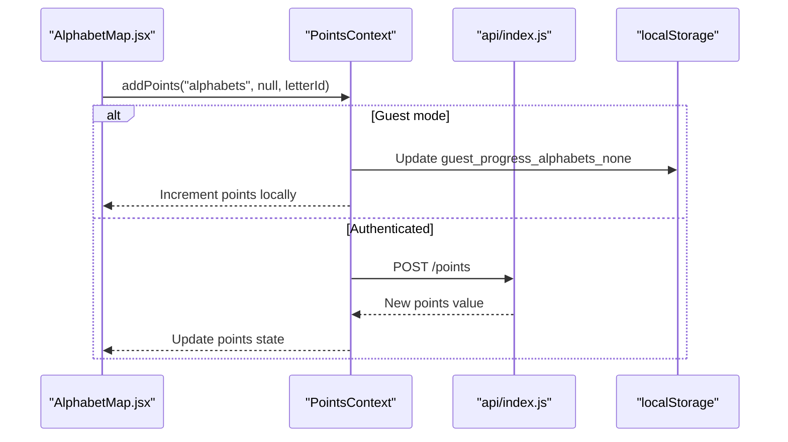
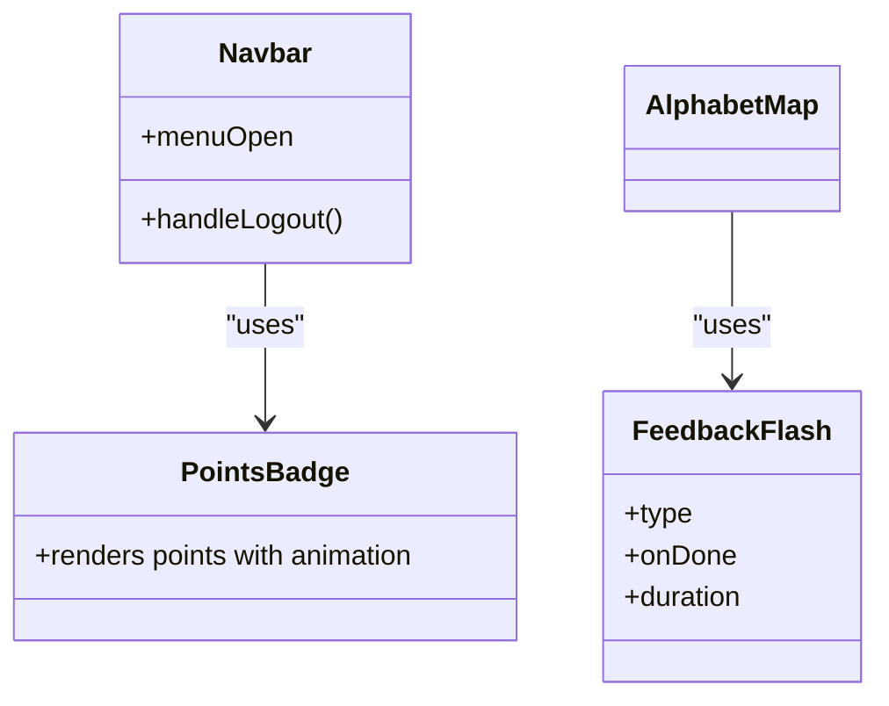
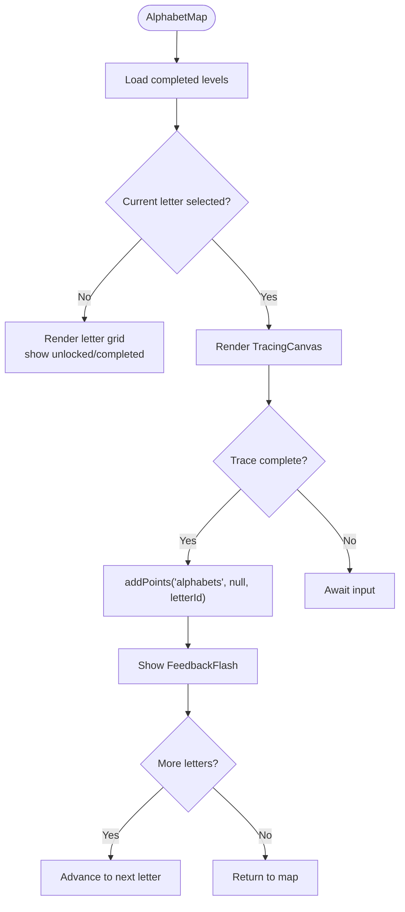
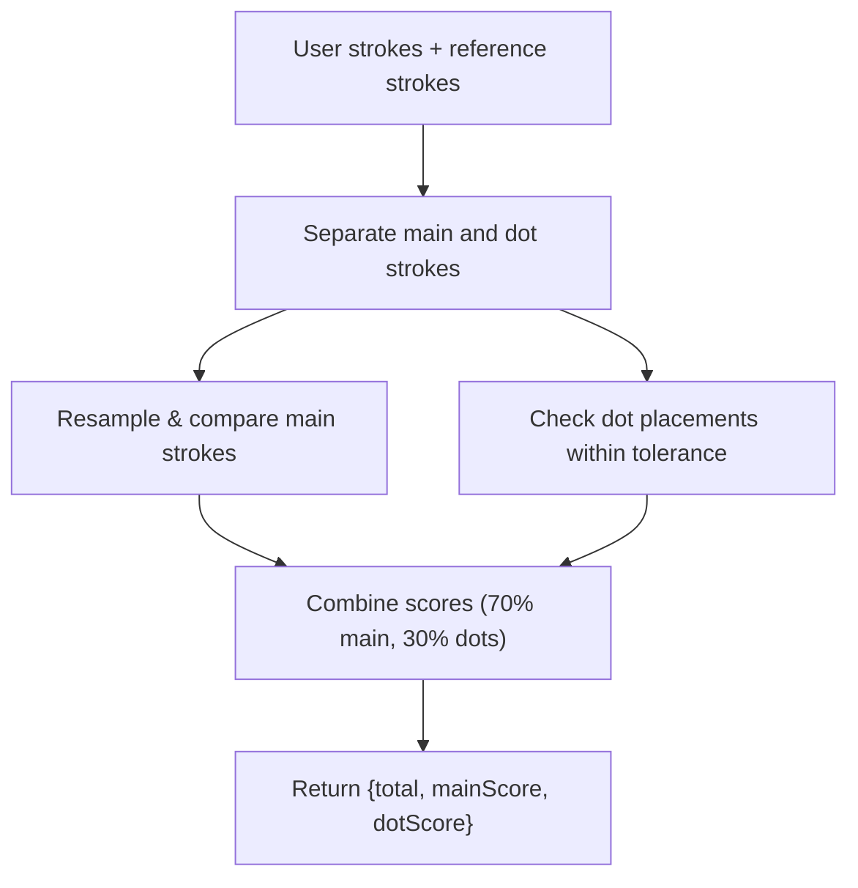
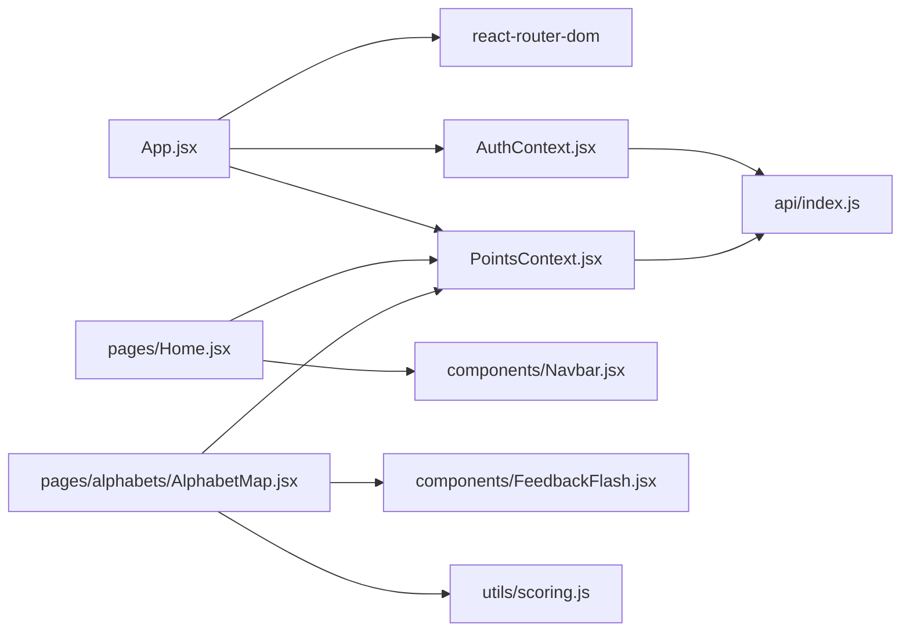

# Component Structure

<cite>
**Referenced Files in This Document**
- [main.jsx](file://zabandaan/client/src/main.jsx)
- [App.jsx](file://zabandaan/client/src/App.jsx)
- [AuthContext.jsx](file://zabandaan/client/src/context/AuthContext.jsx)
- [PointsContext.jsx](file://zabandaan/client/src/context/PointsContext.jsx)
- [Navbar.jsx](file://zabandaan/client/src/components/Navbar.jsx)
- [PointsBadge.jsx](file://zabandaan/client/src/components/PointsBadge.jsx)
- [FeedbackFlash.jsx](file://zabandaan/client/src/components/FeedbackFlash.jsx)
- [Home.jsx](file://zabandaan/client/src/pages/Home.jsx)
- [AlphabetMap.jsx](file://zabandaan/client/src/pages/alphabets/AlphabetMap.jsx)
- [scoring.js](file://zabandaan/client/src/utils/scoring.js)
- [index.js](file://zabandaan/client/src/api/index.js)
- [global.css](file://zabandaan/client/src/styles/global.css)
- [variables.css](file://zabandaan/client/src/styles/variables.css)
</cite>

## Table of Contents
1. Introduction
2. Project Structure
3. Core Components
4. Architecture Overview
5. Detailed Component Analysis
6. Dependency Analysis
7. Performance Considerations
8. Troubleshooting Guide
9. Conclusion

## Introduction
This document explains the component structure and organization patterns in Zabandaan, focusing on modular architecture with clear separation between pages, reusable components, and shared utilities. It starts from App.jsx as the root component, documents routing configuration, and how feature modules are organized. It also covers composition patterns used to avoid prop drilling via React Context, guidelines for creating new components, naming conventions, file organization principles, responsive design considerations, accessibility implementations, and performance optimization techniques at the component level.

## Project Structure
Zabandaan is a Vite + React application with a feature-based directory layout:
- Entry point renders the app within StrictMode.
- Root App sets up routing and global providers (authentication and points).
- Pages represent top-level routes and feature areas.
- Components include shared UI elements (navbar, badges, feedback overlays).
- Context holds cross-cutting state (auth session and points/progress).
- Utils contain domain logic (e.g., scoring algorithms).
- API module centralizes HTTP client configuration and interceptors.
- Styles define global CSS and design tokens.

**Diagram sources**
- [main.jsx:1-10](file://zabandaan/client/src/main.jsx#L1-L10)
- [App.jsx:1-66](file://zabandaan/client/src/App.jsx#L1-L66)
- [AuthContext.jsx:1-97](file://zabandaan/client/src/context/AuthContext.jsx#L1-L97)
- [PointsContext.jsx:1-114](file://zabandaan/client/src/context/PointsContext.jsx#L1-L114)
- [Navbar.jsx:1-142](file://zabandaan/client/src/components/Navbar.jsx#L1-L142)
- [PointsBadge.jsx:1-24](file://zabandaan/client/src/components/PointsBadge.jsx#L1-L24)
- [FeedbackFlash.jsx:1-49](file://zabandaan/client/src/components/FeedbackFlash.jsx#L1-L49)
- [Home.jsx:1-219](file://zabandaan/client/src/pages/Home.jsx#L1-L219)
- [AlphabetMap.jsx:1-249](file://zabandaan/client/src/pages/alphabets/AlphabetMap.jsx#L1-L249)
- [scoring.js:1-151](file://zabandaan/client/src/utils/scoring.js#L1-L151)
- [index.js:1-30](file://zabandaan/client/src/api/index.js#L1-L30)

**Section sources**
- [main.jsx:1-10](file://zabandaan/client/src/main.jsx#L1-L10)
- [App.jsx:1-66](file://zabandaan/client/src/App.jsx#L1-L66)

## Core Components
- App.jsx: Root component that configures routing and wraps the app with authentication and points providers. It defines a protected route wrapper and maps feature routes.
- AuthContext.jsx: Provides user session state, guest mode support, login/register/guest flows, and logout. Persists token and user data in localStorage and exposes hooks.
- PointsContext.jsx: Manages points and progress across features. Supports guest mode with local storage and authenticated mode via API. Exposes methods to add points, load totals, and query guest progress.
- Navbar.jsx: Shared navigation bar with logo, links, and dynamic actions based on auth state. Integrates PointsBadge and handles logout navigation.
- PointsBadge.jsx: Displays current points with an animation hook into PointsContext.
- FeedbackFlash.jsx: Temporary overlay for correct/incorrect feedback with auto-dismiss and callback.
- Home.jsx: Dashboard page showing categories, progress, and navigation to features. Uses contexts for user and points.
- AlphabetMap.jsx: Feature page for tracing Urdu letters. Orchestrates progress, unlocks, and integrates scoring and feedback.

These components follow a consistent pattern:
- Use React Context to avoid prop drilling for cross-cutting concerns (auth, points).
- Keep UI presentational logic in components and business logic in utils or contexts.
- Centralize network calls through a single API module.

**Section sources**
- [App.jsx:14-66](file://zabandaan/client/src/App.jsx#L14-L66)
- [AuthContext.jsx:6-97](file://zabandaan/client/src/context/AuthContext.jsx#L6-L97)
- [PointsContext.jsx:7-114](file://zabandaan/client/src/context/PointsContext.jsx#L7-L114)
- [Navbar.jsx:7-50](file://zabandaan/client/src/components/Navbar.jsx#L7-L50)
- [PointsBadge.jsx:3-23](file://zabandaan/client/src/components/PointsBadge.jsx#L3-L23)
- [FeedbackFlash.jsx:3-49](file://zabandaan/client/src/components/FeedbackFlash.jsx#L3-L49)
- [Home.jsx:9-134](file://zabandaan/client/src/pages/Home.jsx#L9-L134)
- [AlphabetMap.jsx:12-151](file://zabandaan/client/src/pages/alphabets/AlphabetMap.jsx#L12-L151)

## Architecture Overview
The application uses a layered architecture:
- Presentation layer: Pages and components render UI and handle user interactions.
- State layer: Contexts manage global state (auth session, points/progress).
- Domain layer: Utilities encapsulate algorithms (e.g., trace scoring).
- Integration layer: API module handles HTTP requests, token injection, and error handling.

Routing and protection:
- Routes are defined in App.jsx with a ProtectedRoute wrapper that checks authentication status before rendering feature pages.
- Unauthenticated users are redirected to /login; authenticated users access protected routes.

Provider hierarchy:
- BrowserRouter wraps the entire app.
- AuthProvider provides user/session state.
- PointsProvider depends on AuthContext to differentiate guest vs. authenticated behavior.

**Diagram sources**
- [App.jsx:21-53](file://zabandaan/client/src/App.jsx#L21-L53)
- [AuthContext.jsx:6-97](file://zabandaan/client/src/context/AuthContext.jsx#L6-L97)
- [PointsContext.jsx:7-114](file://zabandaan/client/src/context/PointsContext.jsx#L7-L114)
- [index.js:1-30](file://zabandaan/client/src/api/index.js#L1-L30)

**Section sources**
- [App.jsx:21-66](file://zabandaan/client/src/App.jsx#L21-L66)

## Detailed Component Analysis

### Routing and Protection
- App.jsx defines routes for login, home, difficulty selection, alphabets, idioms, word search, poetry, and profile.
- A ProtectedRoute component reads auth state and redirects unauthenticated users to login.
- Loading states are handled during auth initialization to prevent flicker.

**Diagram sources**
- [App.jsx:14-53](file://zabandaan/client/src/App.jsx#L14-L53)

**Section sources**
- [App.jsx:14-53](file://zabandaan/client/src/App.jsx#L14-L53)

### Authentication Context
- AuthContext manages user, isGuest, and loading states.
- On mount, it restores session from localStorage or initializes guest mode.
- Provides login, register, continueAsGuest, convertGuest, and logout functions.
- Exposes useAuth hook for components to consume auth state and actions.

**Diagram sources**
- [AuthContext.jsx:6-97](file://zabandaan/client/src/context/AuthContext.jsx#L6-L97)

**Section sources**
- [AuthContext.jsx:6-97](file://zabandaan/client/src/context/AuthContext.jsx#L6-L97)

### Points and Progress Context
- PointsContext tracks total points and animations, differentiating guest vs. authenticated modes.
- For guests, progress is stored under keys like guest_progress_<category>_<difficulty>.
- For authenticated users, points are fetched/updated via API endpoints.
- Methods include addPoints, setTotalPoints, loadPoints, getGuestProgress, getAllGuestProgress.
- Exposes usePoints hook.

**Diagram sources**
- [PointsContext.jsx:12-46](file://zabandaan/client/src/context/PointsContext.jsx#L12-L46)
- [index.js:1-30](file://zabandaan/client/src/api/index.js#L1-L30)
- [AlphabetMap.jsx:48-57](file://zabandaan/client/src/pages/alphabets/AlphabetMap.jsx#L48-L57)

**Section sources**
- [PointsContext.jsx:7-114](file://zabandaan/client/src/context/PointsContext.jsx#L7-L114)

### Shared UI Components
- Navbar.jsx:
  - Uses useAuth to show/hide logout or save progress options.
  - Integrates PointsBadge to display points.
  - Implements mobile-friendly menu toggle and responsive styles.
- PointsBadge.jsx:
  - Reads points and animating state from PointsContext.
  - Applies a CSS animation class when points update.
- FeedbackFlash.jsx:
  - Renders a full-screen overlay with success/error feedback.
  - Auto-dismisses after a duration and triggers onDone callback.

**Diagram sources**
- [Navbar.jsx:7-50](file://zabandaan/client/src/components/Navbar.jsx#L7-L50)
- [PointsBadge.jsx:3-23](file://zabandaan/client/src/components/PointsBadge.jsx#L3-L23)
- [FeedbackFlash.jsx:3-49](file://zabandaan/client/src/components/FeedbackFlash.jsx#L3-L49)
- [AlphabetMap.jsx:87-89](file://zabandaan/client/src/pages/alphabets/AlphabetMap.jsx#L87-L89)

**Section sources**
- [Navbar.jsx:7-142](file://zabandaan/client/src/components/Navbar.jsx#L7-L142)
- [PointsBadge.jsx:1-24](file://zabandaan/client/src/components/PointsBadge.jsx#L1-L24)
- [FeedbackFlash.jsx:1-49](file://zabandaan/client/src/components/FeedbackFlash.jsx#L1-L49)

### Feature Module: Alphabets
- AlphabetMap.jsx orchestrates:
  - Displaying a grid of letters with unlock/completion states.
  - Navigating to a tracing canvas for each letter.
  - Managing completion and unlocking progression.
  - Integrating FeedbackFlash for immediate user feedback.
  - Using PointsContext to award points upon completion.

**Diagram sources**
- [AlphabetMap.jsx:20-67](file://zabandaan/client/src/pages/alphabets/AlphabetMap.jsx#L20-L67)
- [PointsContext.jsx:12-46](file://zabandaan/client/src/context/PointsContext.jsx#L12-L46)

**Section sources**
- [AlphabetMap.jsx:12-151](file://zabandaan/client/src/pages/alphabets/AlphabetMap.jsx#L12-L151)

### Scoring Utility
- scoring.js implements multi-stroke and dot-aware trace scoring:
  - Resampling paths to uniform samples for comparison.
  - Ordered point-to-point distance for main strokes.
  - Dot placement tolerance checks.
  - Weighted combination of main stroke and dot scores.
- Used by tracing features to evaluate user input accuracy.

**Diagram sources**
- [scoring.js:7-151](file://zabandaan/client/src/utils/scoring.js#L7-L151)

**Section sources**
- [scoring.js:1-151](file://zabandaan/client/src/utils/scoring.js#L1-L151)

### API Integration
- index.js configures axios with a base URL and adds an Authorization header using a token stored in localStorage.
- Response interceptor clears auth data on 401 errors to force re-authentication.
- All contexts and pages use this centralized API instance for consistency.

**Section sources**
- [index.js:1-30](file://zabandaan/client/src/api/index.js#L1-L30)

## Dependency Analysis
Key dependencies and relationships:
- App.jsx depends on react-router-dom for routing and on contexts for global state.
- Contexts depend on the API module for server communication and localStorage for persistence.
- Pages depend on shared components and contexts.
- Features depend on utilities for domain-specific logic (e.g., scoring).

**Diagram sources**
- [App.jsx:1-66](file://zabandaan/client/src/App.jsx#L1-L66)
- [AuthContext.jsx:1-97](file://zabandaan/client/src/context/AuthContext.jsx#L1-L97)
- [PointsContext.jsx:1-114](file://zabandaan/client/src/context/PointsContext.jsx#L1-L114)
- [Home.jsx:1-219](file://zabandaan/client/src/pages/Home.jsx#L1-L219)
- [AlphabetMap.jsx:1-249](file://zabandaan/client/src/pages/alphabets/AlphabetMap.jsx#L1-L249)
- [index.js:1-30](file://zabandaan/client/src/api/index.js#L1-L30)
- [scoring.js:1-151](file://zabandaan/client/src/utils/scoring.js#L1-L151)

**Section sources**
- [App.jsx:1-66](file://zabandaan/client/src/App.jsx#L1-L66)
- [AuthContext.jsx:1-97](file://zabandaan/client/src/context/AuthContext.jsx#L1-L97)
- [PointsContext.jsx:1-114](file://zabandaan/client/src/context/PointsContext.jsx#L1-L114)
- [Home.jsx:1-219](file://zabandaan/client/src/pages/Home.jsx#L1-L219)
- [AlphabetMap.jsx:1-249](file://zabandaan/client/src/pages/alphabets/AlphabetMap.jsx#L1-L249)
- [index.js:1-30](file://zabandaan/client/src/api/index.js#L1-L30)
- [scoring.js:1-151](file://zabandaan/client/src/utils/scoring.js#L1-L151)

## Performance Considerations
- Context usage avoids prop drilling and reduces unnecessary re-renders by scoping updates to consumers.
- LocalStorage caching for guest mode minimizes network calls and improves responsiveness.
- API interceptors centralize token management and error handling, reducing duplicated logic.
- Animations are lightweight and scoped to specific UI elements (e.g., points-pop), avoiding heavy repaints.
- Responsive styles are applied globally to ensure efficient layout changes across devices.

[No sources needed since this section provides general guidance]

## Troubleshooting Guide
Common issues and resolutions:
- Unauthorized access:
  - If the API returns 401, the response interceptor clears stored credentials. Re-login is required.
- Guest mode progress not persisting:
  - Ensure localStorage keys follow the expected pattern (guest_progress_<category>_<difficulty>).
- Navigation redirects:
  - ProtectedRoute redirects to /login if user is null; verify auth state initialization in AuthContext.
- Points not updating:
  - Confirm addPoints is called with correct category/difficulty/levelId and that API endpoints are reachable.

**Section sources**
- [index.js:17-27](file://zabandaan/client/src/api/index.js#L17-L27)
- [AuthContext.jsx:11-29](file://zabandaan/client/src/context/AuthContext.jsx#L11-L29)
- [PointsContext.jsx:12-46](file://zabandaan/client/src/context/PointsContext.jsx#L12-L46)

## Conclusion
Zabandaan’s component structure emphasizes modularity, clear separation of concerns, and scalable patterns:
- Pages encapsulate feature logic and compose reusable components.
- Contexts provide global state without prop drilling.
- Utilities isolate domain algorithms for testability and reuse.
- The API module standardizes networking and error handling.
Following these patterns ensures maintainability, performance, and accessibility while supporting responsive design and smooth user experiences.

[No sources needed since this section summarizes without analyzing specific files]