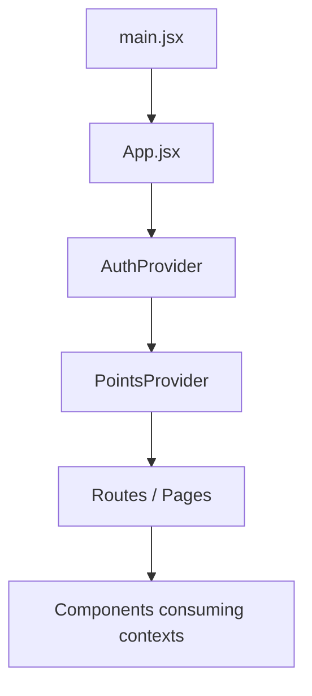
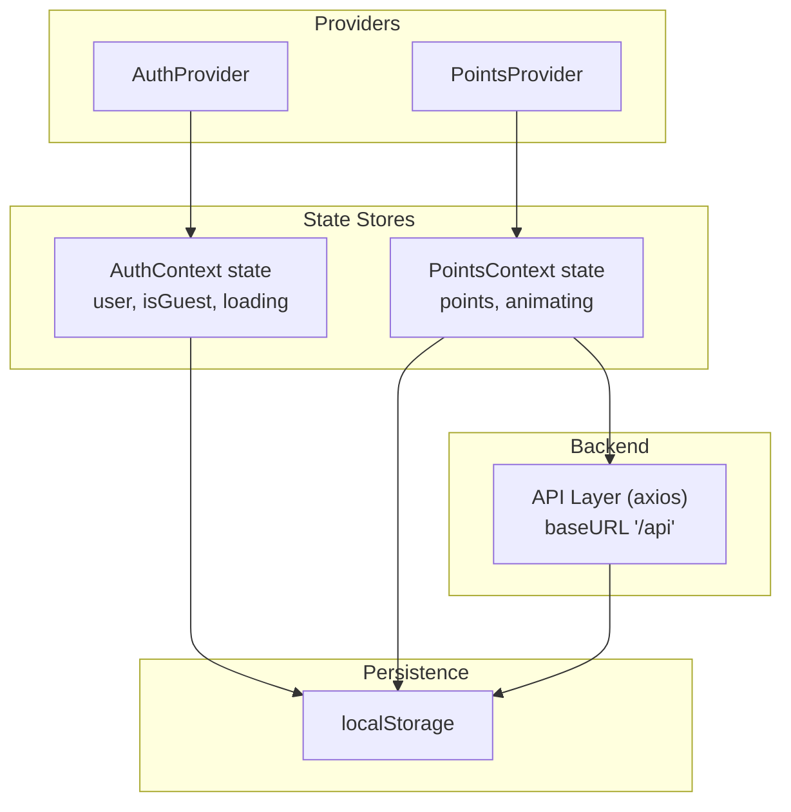
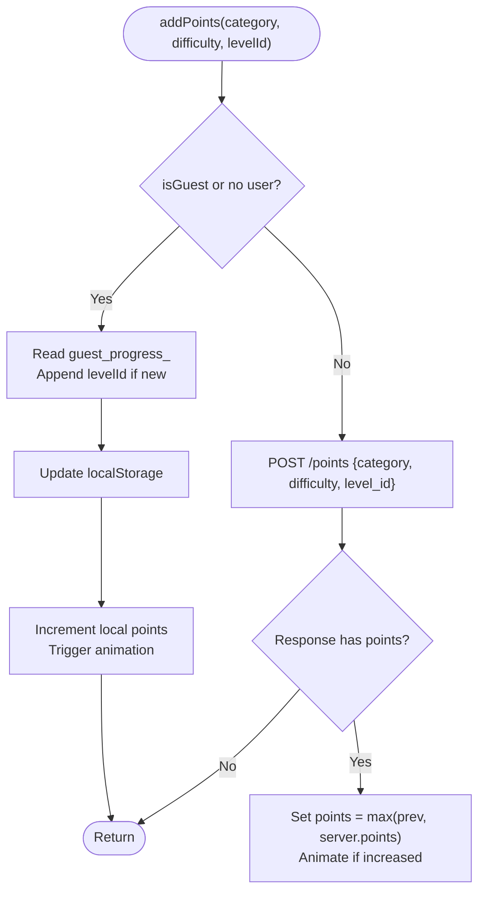
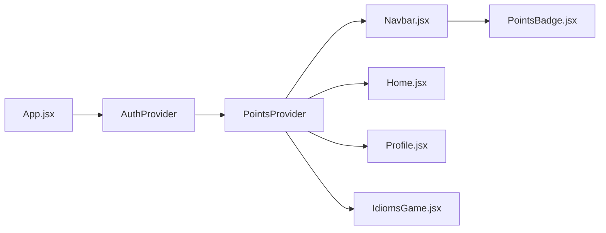
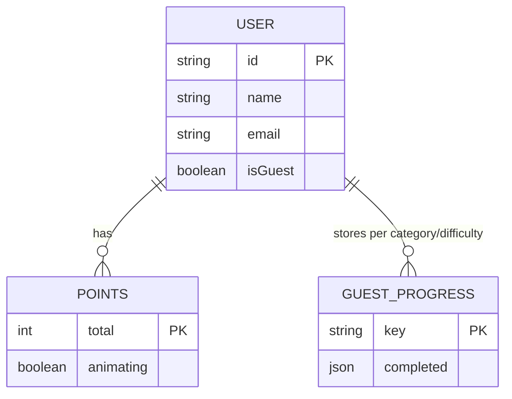
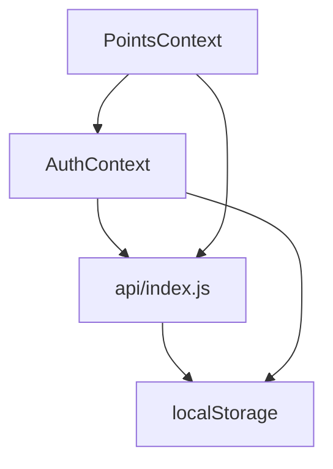

# State Management Architecture

<cite>
**Referenced Files in This Document**
- [AuthContext.jsx](file://zabandaan/client/src/context/AuthContext.jsx)
- [PointsContext.jsx](file://zabandaan/client/src/context/PointsContext.jsx)
- [App.jsx](file://zabandaan/client/src/App.jsx)
- [main.jsx](file://zabandaan/client/src/main.jsx)
- [index.js](file://zabandaan/client/src/api/index.js)
- [Login.jsx](file://zabandaan/client/src/pages/Login.jsx)
- [Home.jsx](file://zabandaan/client/src/pages/Home.jsx)
- [Profile.jsx](file://zabandaan/client/src/pages/Profile.jsx)
- [Navbar.jsx](file://zabandaan/client/src/components/Navbar.jsx)
- [PointsBadge.jsx](file://zabandaan/client/src/components/PointsBadge.jsx)
- [IdiomsGame.jsx](file://zabandaan/client/src/pages/idioms/IdiomsGame.jsx)
</cite>

## Table of Contents
1. [Introduction](#introduction)
2. [Project Structure](#project-structure)
3. [Core Components](#core-components)
4. [Architecture Overview](#architecture-overview)
5. [Detailed Component Analysis](#detailed-component-analysis)
6. [Dependency Analysis](#dependency-analysis)
7. [Performance Considerations](#performance-considerations)
8. [Troubleshooting Guide](#troubleshooting-guide)
9. [Conclusion](#conclusion)

## Introduction
This document explains the state management architecture built with React Context API for authentication and gamification data. It covers the dual-context approach using AuthContext for user/session state and PointsContext for points and progress, the Provider pattern implementation, context composition at the app root, synchronization between local storage and backend services (including optimistic updates and conflict resolution), consumption patterns in components, performance considerations around re-renders, and best practices for managing complex state hierarchies.

## Project Structure
The application is a React SPA that mounts via main.jsx and renders App.jsx. App.jsx composes providers to make global state available throughout the component tree:
- AuthProvider wraps the entire app to manage authentication state and session persistence.
- PointsProvider wraps routes to manage points and progress, depending on the current authenticated user.



**Diagram sources**
- [main.jsx:5-9](file://zabandaan/client/src/main.jsx#L5-L9)
- [App.jsx:55-65](file://zabandaan/client/src/App.jsx#L55-L65)

**Section sources**
- [main.jsx:1-10](file://zabandaan/client/src/main.jsx#L1-L10)
- [App.jsx:1-66](file://zabandaan/client/src/App.jsx#L1-L66)

## Core Components
- AuthContext: Provides user identity, guest mode flag, loading state, and actions for login, register, continue as guest, convert guest to registered, and logout. Persists token and user info to localStorage and restores session on mount.
- PointsContext: Provides total points, animation flag, and methods to add points, load points, and read/write guest progress in localStorage. It depends on AuthContext to determine whether to sync with the backend or persist locally.

Key responsibilities:
- AuthContext manages authentication lifecycle and session restoration.
- PointsContext centralizes scoring logic, handles both guest and authenticated flows, and exposes utilities for progress queries.

**Section sources**
- [AuthContext.jsx:1-97](file://zabandaan/client/src/context/AuthContext.jsx#L1-L97)
- [PointsContext.jsx:1-114](file://zabandaan/client/src/context/PointsContext.jsx#L1-L114)

## Architecture Overview
The system uses two independent but cooperating contexts:
- AuthContext owns user/session state and persists it across sessions.
- PointsContext owns gamification state and synchronizes with the backend when authenticated; otherwise, it persists locally.



**Diagram sources**
- [AuthContext.jsx:11-83](file://zabandaan/client/src/context/AuthContext.jsx#L11-L83)
- [PointsContext.jsx:12-75](file://zabandaan/client/src/context/PointsContext.jsx#L12-L75)
- [index.js:3-27](file://zabandaan/client/src/api/index.js#L3-L27)

## Detailed Component Analysis

### Authentication Flow and Session Restoration
- On app start, AuthProvider checks localStorage for token, user, and guest flags, restoring session state accordingly.
- Login/register store token and user in localStorage and clear guest markers.
- Continue as guest creates a temporary user object and marks guest mode.
- Convert guest sends accumulated guest progress to the backend and transitions to authenticated mode.
- Logout clears all persisted auth data and resets state.

```mermaid
sequenceDiagram
participant UI as "Login Page"
participant AC as "AuthProvider"
participant API as "Axios API"
participant LS as "localStorage"
UI->>AC : login(email, password)
AC->>API : POST /auth/login
API-->>AC : {token, user}
AC->>LS : set token, user; remove guest keys
AC-->>UI : userData
Note over AC,LS : Session restored on next mount via useEffect
```

**Diagram sources**
- [AuthContext.jsx:31-41](file://zabandaan/client/src/context/AuthContext.jsx#L31-L41)
- [AuthContext.jsx:11-29](file://zabandaan/client/src/context/AuthContext.jsx#L11-L29)
- [index.js:8-15](file://zabandaan/client/src/api/index.js#L8-L15)

**Section sources**
- [AuthContext.jsx:11-83](file://zabandaan/client/src/context/AuthContext.jsx#L11-L83)
- [Login.jsx:17-47](file://zabandaan/client/src/pages/Login.jsx#L17-L47)

### Points Synchronization: Guest vs Authenticated
- In guest mode, addPoints writes completed levels to localStorage under category-specific keys and increments local points immediately (optimistic).
- For authenticated users, addPoints calls the backend to record progress and returns authoritative points; the UI updates only if the server value increases.
- loadPoints reads from backend for authenticated users or aggregates guest progress from localStorage for guests.



**Diagram sources**
- [PointsContext.jsx:12-46](file://zabandaan/client/src/context/PointsContext.jsx#L12-L46)
- [PointsContext.jsx:52-75](file://zabandaan/client/src/context/PointsContext.jsx#L52-L75)

**Section sources**
- [PointsContext.jsx:12-75](file://zabandaan/client/src/context/PointsContext.jsx#L12-L75)

### Context Composition and Consumption
- Providers are composed in App.jsx: AuthProvider wraps PointsProvider, ensuring authentication state is available to PointsContext.
- Components consume contexts via custom hooks:
  - useAuth() provides user, isGuest, loading, and auth actions.
  - usePoints() provides points, animating, and point operations.
- Example consumers:
  - Navbar displays PointsBadge and offers logout/save options based on isGuest.
  - Home loads points and progress on user change.
  - Profile shows stats and supports converting guest to registered while preserving progress.
  - Game pages call addPoints upon correct answers.



**Diagram sources**
- [App.jsx:55-65](file://zabandaan/client/src/App.jsx#L55-L65)
- [Navbar.jsx:7-15](file://zabandaan/client/src/components/Navbar.jsx#L7-L15)
- [Home.jsx:9-26](file://zabandaan/client/src/pages/Home.jsx#L9-L26)
- [Profile.jsx:8-28](file://zabandaan/client/src/pages/Profile.jsx#L8-L28)
- [IdiomsGame.jsx:18-22](file://zabandaan/client/src/pages/idioms/IdiomsGame.jsx#L18-L22)

**Section sources**
- [App.jsx:14-65](file://zabandaan/client/src/App.jsx#L14-L65)
- [Navbar.jsx:1-49](file://zabandaan/client/src/components/Navbar.jsx#L1-L49)
- [Home.jsx:1-55](file://zabandaan/client/src/pages/Home.jsx#L1-L55)
- [Profile.jsx:1-61](file://zabandaan/client/src/pages/Profile.jsx#L1-L61)
- [IdiomsGame.jsx:1-83](file://zabandaan/client/src/pages/idioms/IdiomsGame.jsx#L1-L83)

### Data Models and Relationships


[No sources needed since this diagram shows conceptual model derived from code behavior]

## Dependency Analysis
- AuthContext depends on the API layer to authenticate and convert guests. It also reads/writes localStorage for session persistence.
- PointsContext depends on AuthContext to branch logic between guest and authenticated modes. It uses the API layer for syncing points and reads/writes localStorage for guest progress.
- The API layer injects Authorization headers from localStorage and clears auth tokens on 401 responses.



**Diagram sources**
- [AuthContext.jsx:1-97](file://zabandaan/client/src/context/AuthContext.jsx#L1-L97)
- [PointsContext.jsx:1-114](file://zabandaan/client/src/context/PointsContext.jsx#L1-L114)
- [index.js:1-30](file://zabandaan/client/src/api/index.js#L1-L30)

**Section sources**
- [AuthContext.jsx:1-97](file://zabandaan/client/src/context/AuthContext.jsx#L1-L97)
- [PointsContext.jsx:1-114](file://zabandaan/client/src/context/PointsContext.jsx#L1-L114)
- [index.js:1-30](file://zabandaan/client/src/api/index.js#L1-L30)

## Performance Considerations
- Context re-renders: Every consumer subscribes to its context’s full value. To minimize unnecessary re-renders:
  - Keep provider values stable by memoizing functions with useCallback where appropriate (already used in PointsContext).
  - Split concerns into multiple contexts (as implemented) so changes in one do not force re-renders in unrelated parts.
  - Avoid passing large objects directly; prefer IDs and fetch details in components when possible.
- Optimistic updates:
  - Guest mode updates localStorage and UI immediately for responsiveness.
  - Authenticated mode defers to server response before updating points to avoid conflicts.
- Animation triggers:
  - Short-lived animating state is toggled briefly to provide visual feedback without causing excessive re-renders.
- Network efficiency:
  - API interceptors attach tokens automatically and handle 401 by clearing auth state, preventing repeated failed requests.

[No sources needed since this section provides general guidance grounded in observed patterns]

## Troubleshooting Guide
Common issues and resolutions:
- Unauthorized errors:
  - If the backend returns 401, the API interceptor removes token and user from localStorage. Ensure the app redirects to login and clears sensitive UI state.
- Session mismatch after refresh:
  - AuthProvider restores session from localStorage on mount. If token exists but user parsing fails, it ignores parse errors and continues safely.
- Guest progress not saved:
  - Verify that addPoints runs in guest mode and that localStorage keys follow the expected naming convention. Use getAllGuestProgress to inspect stored data.
- Points not increasing for authenticated users:
  - Confirm that the backend endpoint returns updated points and that PointsContext sets points to max(prev, server.points) to prevent regressions.

**Section sources**
- [index.js:17-27](file://zabandaan/client/src/api/index.js#L17-L27)
- [AuthContext.jsx:11-29](file://zabandaan/client/src/context/AuthContext.jsx#L11-L29)
- [PointsContext.jsx:12-46](file://zabandaan/client/src/context/PointsContext.jsx#L12-L46)
- [PointsContext.jsx:52-75](file://zabandaan/client/src/context/PointsContext.jsx#L52-L75)

## Conclusion
The application implements a clean, scalable state management architecture using React Context:
- AuthContext encapsulates authentication and session persistence, enabling seamless guest and registered experiences.
- PointsContext centralizes gamification logic, supporting both offline-like guest mode and authoritative backend synchronization for authenticated users.
- Provider composition ensures proper dependency ordering and scoped access to global state.
- The design balances responsiveness (optimistic updates) with correctness (server-authoritative updates), while minimizing re-renders through careful state splitting and memoization.

This approach provides a solid foundation for extending the app with additional features and contexts while maintaining clarity and performance.