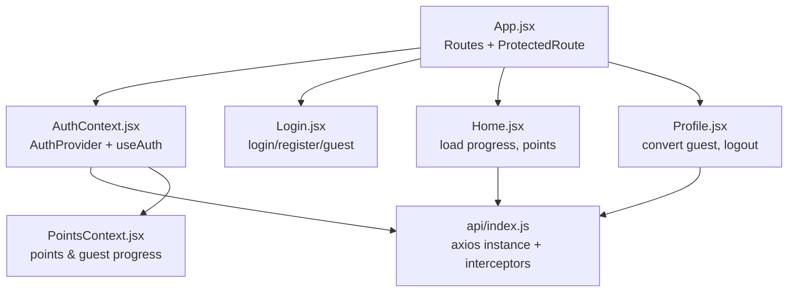
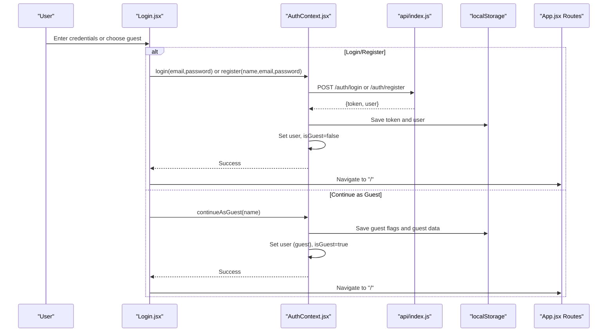
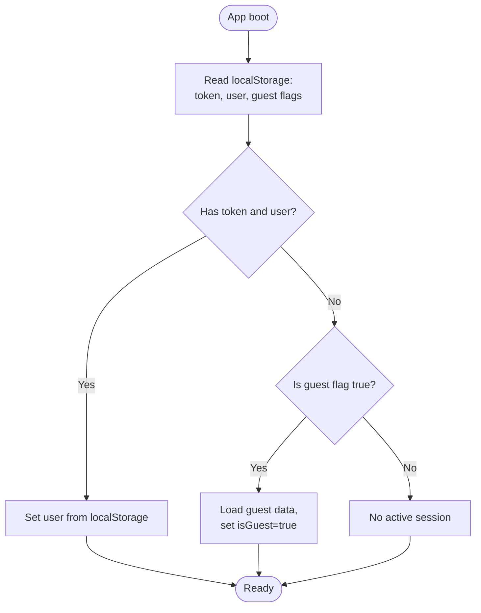
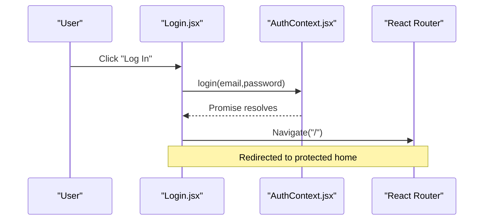
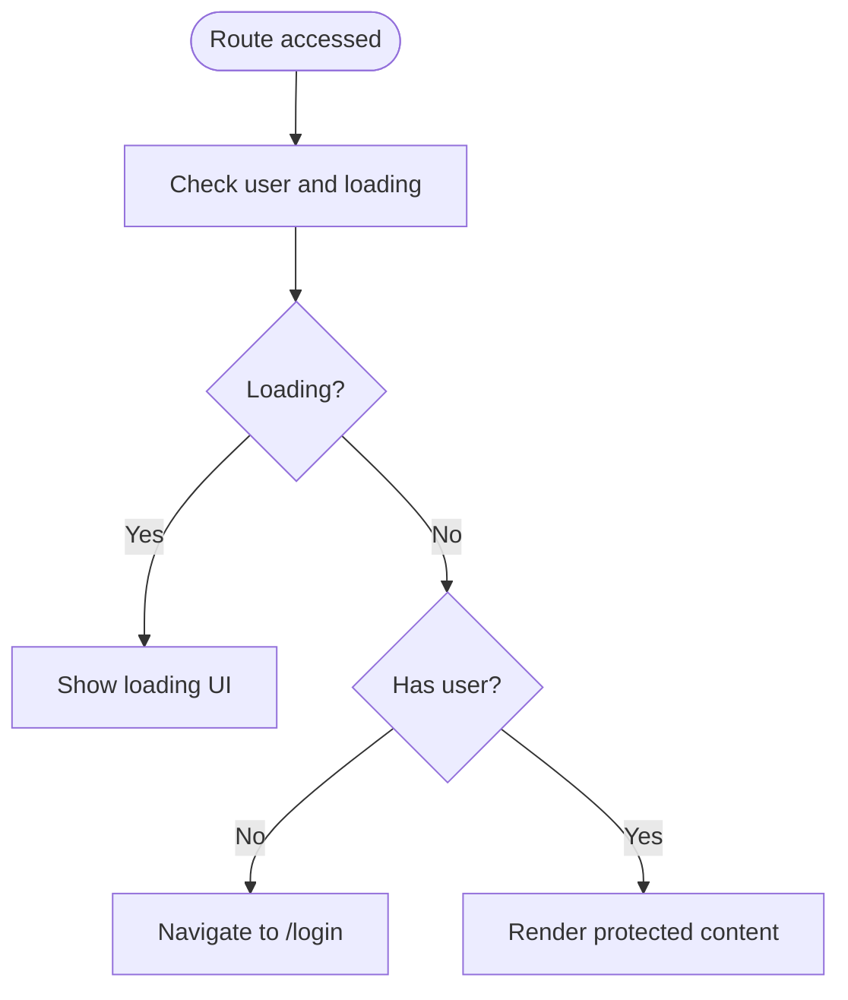
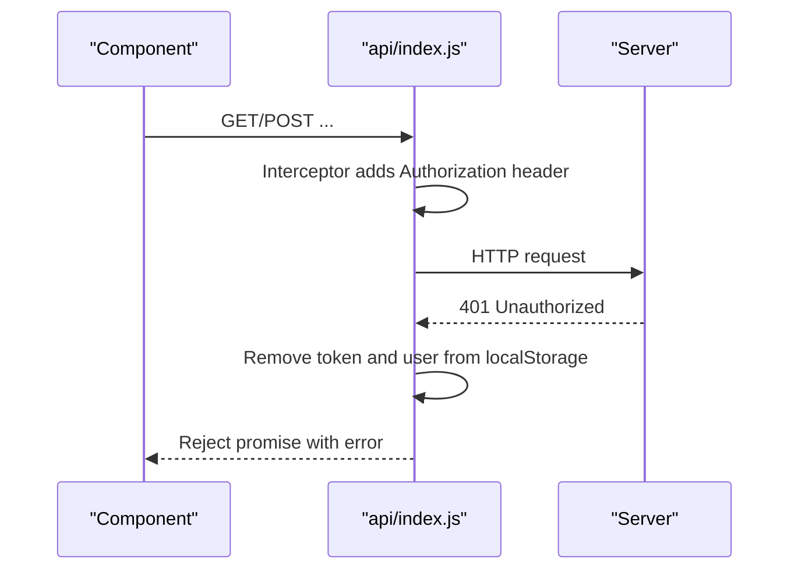
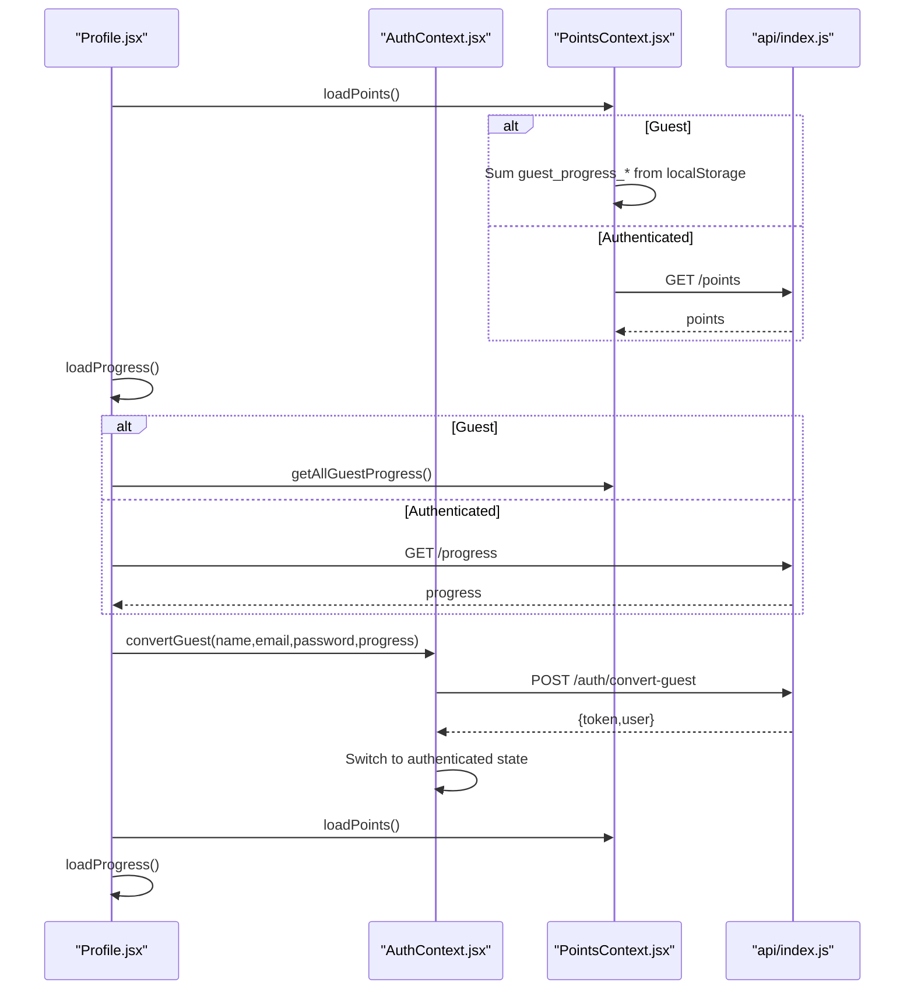
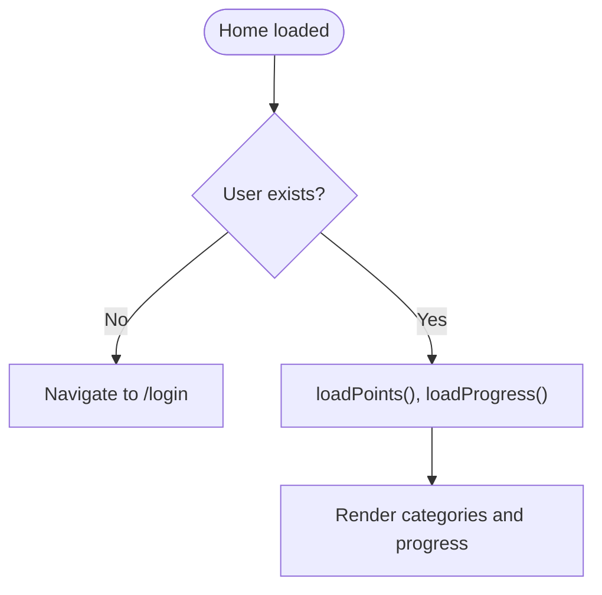
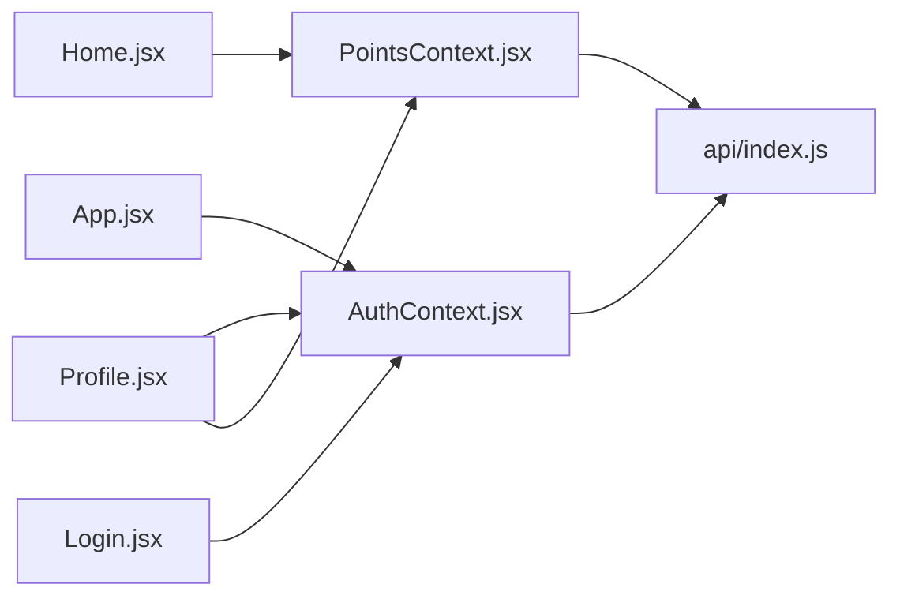

# Authentication System

<cite>
**Referenced Files in This Document**
- [AuthContext.jsx](file://zabandaan/client/src/context/AuthContext.jsx)
- [Login.jsx](file://zabandaan/client/src/pages/Login.jsx)
- [App.jsx](file://zabandaan/client/src/App.jsx)
- [index.js](file://zabandaan/client/src/api/index.js)
- [Profile.jsx](file://zabandaan/client/src/pages/Profile.jsx)
- [PointsContext.jsx](file://zabandaan/client/src/context/PointsContext.jsx)
- [Home.jsx](file://zabandaan/client/src/pages/Home.jsx)
</cite>

## Table of Contents
1. [Introduction](#introduction)
2. [Project Structure](#project-structure)
3. [Core Components](#core-components)
4. [Architecture Overview](#architecture-overview)
5. [Detailed Component Analysis](#detailed-component-analysis)
6. [Dependency Analysis](#dependency-analysis)
7. [Performance Considerations](#performance-considerations)
8. [Troubleshooting Guide](#troubleshooting-guide)
9. [Conclusion](#conclusion)

## Introduction
This document explains the authentication system sub-feature with a focus on user session management, guest mode support, and protected routes. It covers how the application initializes sessions, handles login/logout, manages tokens, transitions between guest and authenticated users, and protects routes. It also documents how components like Profile and Home integrate with the authentication context and API layer to provide a seamless experience for both guests and registered users.

## Project Structure
The authentication system is implemented across several key files:
- Context provider for authentication state and actions
- Login page for user registration, login, and guest entry
- Application routing with route protection
- API client with token injection and 401 handling
- Profile page for guest conversion and progress display
- Points context that adapts behavior based on guest vs. authenticated state
- Home page that loads progress and guides new users

**Diagram sources**
- [App.jsx:14-53](file://zabandaan/client/src/App.jsx#L14-L53)
- [AuthContext.jsx:6-90](file://zabandaan/client/src/context/AuthContext.jsx#L6-L90)
- [Login.jsx:17-47](file://zabandaan/client/src/pages/Login.jsx#L17-L47)
- [index.js:1-29](file://zabandaan/client/src/api/index.js#L1-L29)
- [Profile.jsx:20-61](file://zabandaan/client/src/pages/Profile.jsx#L20-L61)
- [PointsContext.jsx:7-106](file://zabandaan/client/src/context/PointsContext.jsx#L7-L106)
- [Home.jsx:15-53](file://zabandaan/client/src/pages/Home.jsx#L15-L53)

**Section sources**
- [App.jsx:14-53](file://zabandaan/client/src/App.jsx#L14-L53)
- [AuthContext.jsx:6-90](file://zabandaan/client/src/context/AuthContext.jsx#L6-L90)
- [index.js:1-29](file://zabandaan/client/src/api/index.js#L1-L29)

## Core Components
- AuthProvider and useAuth: Centralizes user state (user, isGuest, loading), persists session via localStorage, exposes login, register, continueAsGuest, convertGuest, and logout.
- ProtectedRoute: Guards routes by checking authentication state; redirects unauthenticated users to /login.
- API client: Automatically attaches Authorization header using stored token and clears session on 401 responses.
- Login page: Orchestrates login, registration, and guest mode flows; navigates to home after success.
- Profile page: Displays user info, shows guest badge, allows converting guest to registered account while preserving progress.
- PointsContext: Tracks points and guest progress locally when in guest mode; fetches from server for authenticated users.
- Home page: Loads progress and points, guides users to start learning, respects guest vs. authenticated data sources.

**Section sources**
- [AuthContext.jsx:6-90](file://zabandaan/client/src/context/AuthContext.jsx#L6-L90)
- [App.jsx:14-53](file://zabandaan/client/src/App.jsx#L14-L53)
- [index.js:1-29](file://zabandaan/client/src/api/index.js#L1-L29)
- [Login.jsx:17-47](file://zabandaan/client/src/pages/Login.jsx#L17-L47)
- [Profile.jsx:20-61](file://zabandaan/client/src/pages/Profile.jsx#L20-L61)
- [PointsContext.jsx:7-106](file://zabandaan/client/src/context/PointsContext.jsx#L7-L106)
- [Home.jsx:15-53](file://zabandaan/client/src/pages/Home.jsx#L15-L53)

## Architecture Overview
The authentication architecture follows a React Context-driven pattern with local storage-based session persistence and an Axios-based API client that injects tokens into requests. Route protection ensures only authenticated users can access core features. Guest mode provides a frictionless entry point with local progress tracking until the user chooses to create an account.

**Diagram sources**
- [Login.jsx:17-47](file://zabandaan/client/src/pages/Login.jsx#L17-L47)
- [AuthContext.jsx:31-74](file://zabandaan/client/src/context/AuthContext.jsx#L31-L74)
- [index.js:8-15](file://zabandaan/client/src/api/index.js#L8-L15)
- [App.jsx:41-50](file://zabandaan/client/src/App.jsx#L41-L50)

## Detailed Component Analysis

### AuthContext Provider: Session Management and State Updates
- Initialization: On mount, checks localStorage for token, saved user, and guest mode flags. Restores user or guest state accordingly and sets loading to false.
- Login/Register: Calls API endpoints, stores token and user in localStorage, clears guest-related keys, updates context state to authenticated.
- Guest Mode: Creates a temporary guest user object, marks isGuest true, and persists guest flags and data in localStorage.
- Convert Guest: Posts guest progress to server endpoint, receives token and user, switches to authenticated state, clears guest keys.
- Logout: Clears all auth-related localStorage entries and resets context state to null user and not guest.

**Diagram sources**
- [AuthContext.jsx:11-29](file://zabandaan/client/src/context/AuthContext.jsx#L11-L29)

**Section sources**
- [AuthContext.jsx:11-83](file://zabandaan/client/src/context/AuthContext.jsx#L11-L83)

### Login Page: Authentication Flow and Navigation
- Modes: Landing screen offers Create Account, Log In, and Continue as Guest.
- Login: Submits email/password to AuthContext.login; on success navigates to home; displays errors if request fails.
- Register: Validates name, submits to AuthContext.register; on success navigates to home; displays errors.
- Guest: Creates guest session via AuthContext.continueAsGuest and navigates to home.

**Diagram sources**
- [Login.jsx:17-47](file://zabandaan/client/src/pages/Login.jsx#L17-L47)
- [App.jsx:41-50](file://zabandaan/client/src/App.jsx#L41-L50)

**Section sources**
- [Login.jsx:17-47](file://zabandaan/client/src/pages/Login.jsx#L17-L47)

### Protected Routes: Access Control
- ProtectedRoute component reads user and loading state from AuthContext.
- While loading, shows a loading indicator.
- If no user, redirects to /login.
- Otherwise renders the protected child component.

**Diagram sources**
- [App.jsx:14-19](file://zabandaan/client/src/App.jsx#L14-L19)

**Section sources**
- [App.jsx:14-19](file://zabandaan/client/src/App.jsx#L14-L19)

### API Layer: Token Injection and 401 Handling
- Request Interceptor: Reads token from localStorage and adds Authorization header to every outgoing request.
- Response Interceptor: On 401 status, removes token and user from localStorage to invalidate session.

**Diagram sources**
- [index.js:8-27](file://zabandaan/client/src/api/index.js#L8-L27)

**Section sources**
- [index.js:8-27](file://zabandaan/client/src/api/index.js#L8-L27)

### Profile Page: Guest Conversion and Progress Display
- Displays user profile, guest badge, total points, and category progress.
- For guests, loads progress from local storage; for authenticated users, fetches from server.
- Provides a form to convert guest to registered account, passing current guest progress to the server.
- After conversion, refreshes points and progress.

**Diagram sources**
- [Profile.jsx:20-61](file://zabandaan/client/src/pages/Profile.jsx#L20-L61)
- [PointsContext.jsx:52-100](file://zabandaan/client/src/context/PointsContext.jsx#L52-L100)
- [AuthContext.jsx:64-74](file://zabandaan/client/src/context/AuthContext.jsx#L64-L74)

**Section sources**
- [Profile.jsx:20-61](file://zabandaan/client/src/pages/Profile.jsx#L20-L61)
- [PointsContext.jsx:52-100](file://zabandaan/client/src/context/PointsContext.jsx#L52-L100)
- [AuthContext.jsx:64-74](file://zabandaan/client/src/context/AuthContext.jsx#L64-L74)

### Home Page: Progress and Points Integration
- Ensures user is authenticated before rendering; otherwise redirects to login.
- Loads points and progress based on guest vs. authenticated state.
- Shows guidance for first-time users and category progress bars.

**Diagram sources**
- [Home.jsx:15-53](file://zabandaan/client/src/pages/Home.jsx#L15-L53)

**Section sources**
- [Home.jsx:15-53](file://zabandaan/client/src/pages/Home.jsx#L15-L53)

## Dependency Analysis
- App.jsx depends on AuthContext for route protection and navigation decisions.
- Login.jsx depends on AuthContext for authentication actions and uses React Router for navigation.
- Profile.jsx depends on AuthContext and PointsContext to manage conversion and progress display.
- PointsContext depends on AuthContext to determine guest vs. authenticated behavior and uses the API client for server-side data.
- The API client depends on localStorage for token retrieval and cleanup on 401.

**Diagram sources**
- [App.jsx:14-53](file://zabandaan/client/src/App.jsx#L14-L53)
- [Login.jsx:17-47](file://zabandaan/client/src/pages/Login.jsx#L17-L47)
- [Profile.jsx:20-61](file://zabandaan/client/src/pages/Profile.jsx#L20-L61)
- [PointsContext.jsx:7-106](file://zabandaan/client/src/context/PointsContext.jsx#L7-L106)
- [index.js:1-29](file://zabandaan/client/src/api/index.js#L1-L29)

**Section sources**
- [App.jsx:14-53](file://zabandaan/client/src/App.jsx#L14-L53)
- [Login.jsx:17-47](file://zabandaan/client/src/pages/Login.jsx#L17-L47)
- [Profile.jsx:20-61](file://zabandaan/client/src/pages/Profile.jsx#L20-L61)
- [PointsContext.jsx:7-106](file://zabandaan/client/src/context/PointsContext.jsx#L7-L106)
- [index.js:1-29](file://zabandaan/client/src/api/index.js#L1-L29)

## Performance Considerations
- LocalStorage reads/writes are synchronous and fast but should be minimized during critical paths. The current implementation performs necessary reads on app boot and writes on auth events.
- API calls are centralized through axios interceptors, reducing duplication and ensuring consistent token handling.
- PointsContext sums local guest progress on load; this is efficient for small datasets but could be optimized by caching keys if the number of categories grows significantly.
- Avoid unnecessary re-renders by keeping state updates minimal and leveraging React’s batching.

[No sources needed since this section provides general guidance]

## Troubleshooting Guide
Common issues and resolutions:
- Token expiration: When the server returns 401, the API interceptor automatically removes token and user from localStorage. Components relying on auth will redirect to login. Ensure your UI handles loading states gracefully during these transitions.
- Session persistence: Verify that localStorage keys are consistently used: token, user, guest flags, and guest data. Mismatched keys can cause unexpected logouts or guest mode behavior.
- Guest mode limitations: Guest progress is stored locally and won’t sync across devices. Use the Profile page’s conversion flow to persist progress to the server.
- API errors: Errors from login/register/convert endpoints surface in the Login and Profile pages; ensure error messages are displayed to users and network connectivity is stable.
- Route protection: If users see repeated redirects, check that AuthContext has finished loading and that user state is correctly set. ProtectedRoute relies on user existence to allow access.

**Section sources**
- [index.js:17-27](file://zabandaan/client/src/api/index.js#L17-L27)
- [AuthContext.jsx:11-29](file://zabandaan/client/src/context/AuthContext.jsx#L11-L29)
- [Login.jsx:17-47](file://zabandaan/client/src/pages/Login.jsx#L17-L47)
- [Profile.jsx:20-61](file://zabandaan/client/src/pages/Profile.jsx#L20-L61)
- [App.jsx:14-19](file://zabandaan/client/src/App.jsx#L14-L19)

## Conclusion
The authentication system combines React Context, local storage, and an Axios-based API client to provide robust session management, guest mode support, and route protection. AuthContext centralizes user state and lifecycle methods, while ProtectedRoute enforces access control. The API layer ensures tokens are attached to requests and sessions are invalidated on 401. Guests can explore the app without creating an account and later convert their session to a full account, preserving progress. This design balances simplicity for beginners with enough technical depth for experienced developers to extend or adapt the system.