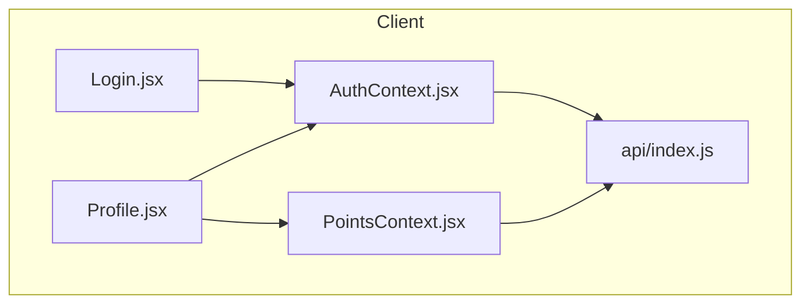
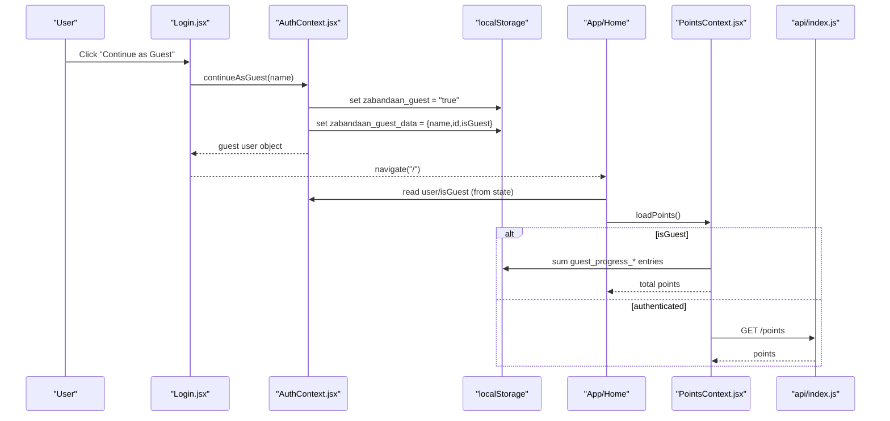
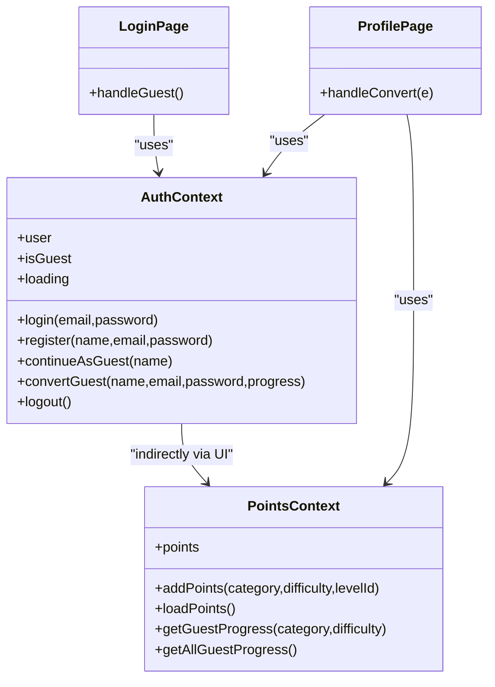
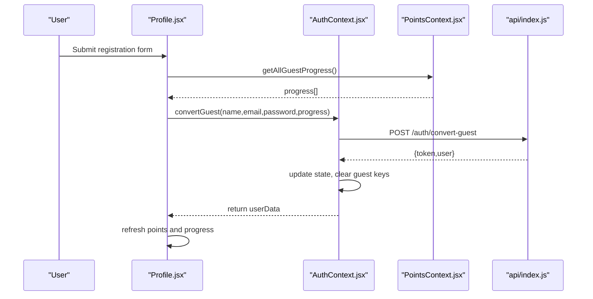
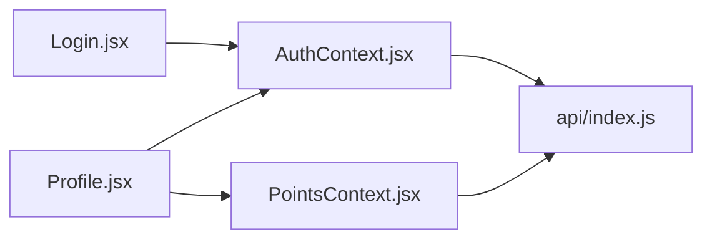

# Guest Mode Support

<cite>
**Referenced Files in This Document**
- [AuthContext.jsx](file://zabandaan/client/src/context/AuthContext.jsx)
- [Login.jsx](file://zabandaan/client/src/pages/Login.jsx)
- [Profile.jsx](file://zabandaan/client/src/pages/Profile.jsx)
- [PointsContext.jsx](file://zabandaan/client/src/context/PointsContext.jsx)
- [index.js](file://zabandaan/client/src/api/index.js)
</cite>

## Table of Contents
1. [Introduction](#introduction)
2. [Project Structure](#project-structure)
3. [Core Components](#core-components)
4. [Architecture Overview](#architecture-overview)
5. [Detailed Component Analysis](#detailed-component-analysis)
6. [Dependency Analysis](#dependency-analysis)
7. [Performance Considerations](#performance-considerations)
8. [Troubleshooting Guide](#troubleshooting-guide)
9. [Conclusion](#conclusion)

## Introduction
This document explains the guest mode implementation for temporary user sessions and local data persistence. It covers how guest sessions are created, detected during application initialization, stored locally, and converted into registered accounts with progress migration. It also clarifies differences between guest and authenticated sessions and outlines limitations such as lack of cloud sync and cross-device persistence.

## Project Structure
Guest mode spans several client-side modules:
- Authentication context manages session state, guest detection, and conversion to a registered account.
- Login page provides the “Continue as Guest” entry point.
- Profile page exposes the conversion flow and displays guest progress.
- Points context tracks guest progress locally and aggregates totals.
- API module attaches auth tokens and handles 401 responses.

**Diagram sources**
- [AuthContext.jsx:6-90](file://zabandaan/client/src/context/AuthContext.jsx#L6-L90)
- [Login.jsx:5-47](file://zabandaan/client/src/pages/Login.jsx#L5-L47)
- [Profile.jsx:8-61](file://zabandaan/client/src/pages/Profile.jsx#L8-L61)
- [PointsContext.jsx:7-106](file://zabandaan/client/src/context/PointsContext.jsx#L7-L106)
- [index.js:3-29](file://zabandaan/client/src/api/index.js#L3-L29)

**Section sources**
- [AuthContext.jsx:6-90](file://zabandaan/client/src/context/AuthContext.jsx#L6-L90)
- [Login.jsx:5-47](file://zabandaan/client/src/pages/Login.jsx#L5-L47)
- [Profile.jsx:8-61](file://zabandaan/client/src/pages/Profile.jsx#L8-L61)
- [PointsContext.jsx:7-106](file://zabandaan/client/src/context/PointsContext.jsx#L7-L106)
- [index.js:3-29](file://zabandaan/client/src/api/index.js#L3-L29)

## Core Components
- AuthProvider: Initializes session state, detects guest vs authenticated sessions on mount, and exposes methods to continue as guest, convert guest to registered, login, register, and logout.
- Login page: Offers “Continue as Guest” which calls the authentication context’s guest method and navigates to the app home.
- Profile page: Shows guest badge, loads guest progress from local storage, and provides a form to convert guest to a registered account while migrating progress.
- PointsContext: Tracks guest points and completed levels locally under specific keys and aggregates totals; switches to server-based tracking for authenticated users.
- API interceptor: Attaches bearer token when present and clears auth state on 401 errors.

Key behaviors:
- Guest user object includes name, unique id, and isGuest flag.
- Local storage keys used:
  - Session flags and profile: zabandaan_guest, zabandaan_guest_data
  - Authenticated session: zabandaan_token, zabandaan_user
  - Guest progress: guest_progress_{category}_{difficulty}
- Conversion endpoint: /auth/convert-guest accepts name, email, password, and progress payload.

**Section sources**
- [AuthContext.jsx:11-74](file://zabandaan/client/src/context/AuthContext.jsx#L11-L74)
- [Login.jsx:44-47](file://zabandaan/client/src/pages/Login.jsx#L44-L47)
- [Profile.jsx:30-61](file://zabandaan/client/src/pages/Profile.jsx#L30-L61)
- [PointsContext.jsx:12-100](file://zabandaan/client/src/context/PointsContext.jsx#L12-L100)
- [index.js:8-25](file://zabandaan/client/src/api/index.js#L8-L25)

## Architecture Overview
The guest mode lifecycle integrates UI flows with local storage and optional server synchronization upon conversion.

**Diagram sources**
- [Login.jsx:44-47](file://zabandaan/client/src/pages/Login.jsx#L44-L47)
- [AuthContext.jsx:55-62](file://zabandaan/client/src/context/AuthContext.jsx#L55-L62)
- [PointsContext.jsx:52-75](file://zabandaan/client/src/context/PointsContext.jsx#L52-L75)
- [index.js:8-15](file://zabandaan/client/src/api/index.js#L8-L15)

## Detailed Component Analysis

### Guest Session Creation and Detection
- continueAsGuest creates a temporary user object with a generated unique id and sets isGuest to true. It persists the guest flag and user data to localStorage under zabandaan_guest and zabandaan_guest_data, then updates React state to reflect guest mode.
- On application initialization, the authentication context checks for an existing authenticated session first (token and user). If not found but zabandaan_guest is set to true, it restores the guest session by reading zabandaan_guest_data and marking the user as a guest.

Guest user object structure:
- name: string (defaults to “Guest” if none provided)
- id: string (unique identifier, e.g., prefixed with “guest_”)
- isGuest: boolean (true for guest sessions)

Local storage keys:
- zabandaan_guest: "true" when in guest mode
- zabandaan_guest_data: JSON stringified guest user object

Differences from authenticated sessions:
- Authenticated sessions use zabandaan_token and zabandaan_user, and interact with the server for progress and points.
- Guest sessions rely entirely on local storage and do not send requests requiring authentication.

**Section sources**
- [AuthContext.jsx:11-29](file://zabandaan/client/src/context/AuthContext.jsx#L11-L29)
- [AuthContext.jsx:55-62](file://zabandaan/client/src/context/AuthContext.jsx#L55-L62)

### Guest Progress Tracking and Aggregation
- While in guest mode, each completed level increments local progress under keys named guest_progress_{category}_{difficulty}. The PointsContext stores completed level IDs per category/difficulty and sums them to compute total points.
- When loading points in guest mode, the context iterates through localStorage to aggregate all guest progress entries.

Limitations:
- No cloud sync: progress exists only in the browser’s local storage.
- Not portable across devices or browsers.
- Clearing site data removes guest progress.

**Section sources**
- [PointsContext.jsx:12-29](file://zabandaan/client/src/context/PointsContext.jsx#L12-L29)
- [PointsContext.jsx:52-75](file://zabandaan/client/src/context/PointsContext.jsx#L52-L75)
- [PointsContext.jsx:77-100](file://zabandaan/client/src/context/PointsContext.jsx#L77-L100)

### Conversion from Guest to Registered Account
- The Profile page allows guests to create a registered account. It collects name, email, and password, gathers all guest progress via getAllGuestProgress, and calls convertGuest with that progress payload.
- The conversion sends a POST request to /auth/convert-guest. On success, the authentication context stores the new token and user data, removes guest-related keys, and transitions the user out of guest mode.

Migration details:
- Progress migration: guest progress array is sent to the server and persisted to the user’s account.
- Account linking: after conversion, the user becomes fully authenticated and can access cloud features.

**Section sources**
- [Profile.jsx:44-61](file://zabandaan/client/src/pages/Profile.jsx#L44-L61)
- [AuthContext.jsx:64-74](file://zabandaan/client/src/context/AuthContext.jsx#L64-L74)

### Integration with Authentication Context
- The authentication context centralizes session state and exposes methods used by Login and Profile pages.
- It ensures consistent cleanup of guest data when logging in, registering, or logging out.
- The API interceptor automatically attaches the bearer token for authenticated requests and clears auth state on 401 responses.

**Section sources**
- [AuthContext.jsx:31-53](file://zabandaan/client/src/context/AuthContext.jsx#L31-L53)
- [AuthContext.jsx:76-83](file://zabandaan/client/src/context/AuthContext.jsx#L76-L83)
- [index.js:8-25](file://zabandaan/client/src/api/index.js#L8-L25)

### Visualizing Key Flows

#### Class-like Relationships

**Diagram sources**
- [AuthContext.jsx:6-90](file://zabandaan/client/src/context/AuthContext.jsx#L6-L90)
- [PointsContext.jsx:7-106](file://zabandaan/client/src/context/PointsContext.jsx#L7-L106)
- [Login.jsx:5-47](file://zabandaan/client/src/pages/Login.jsx#L5-L47)
- [Profile.jsx:8-61](file://zabandaan/client/src/pages/Profile.jsx#L8-L61)

#### Conversion Sequence

**Diagram sources**
- [Profile.jsx:44-61](file://zabandaan/client/src/pages/Profile.jsx#L44-L61)
- [AuthContext.jsx:64-74](file://zabandaan/client/src/context/AuthContext.jsx#L64-L74)
- [PointsContext.jsx:83-100](file://zabandaan/client/src/context/PointsContext.jsx#L83-L100)
- [index.js:8-15](file://zabandaan/client/src/api/index.js#L8-L15)

## Dependency Analysis
- Login depends on AuthContext to initiate guest sessions.
- Profile depends on both AuthContext and PointsContext to handle conversion and display progress.
- PointsContext depends on AuthContext to determine guest vs authenticated behavior.
- All server interactions go through the centralized API module, which injects auth headers and handles 401 errors.

**Diagram sources**
- [Login.jsx:5-47](file://zabandaan/client/src/pages/Login.jsx#L5-L47)
- [Profile.jsx:8-61](file://zabandaan/client/src/pages/Profile.jsx#L8-L61)
- [AuthContext.jsx:6-90](file://zabandaan/client/src/context/AuthContext.jsx#L6-L90)
- [PointsContext.jsx:7-106](file://zabandaan/client/src/context/PointsContext.jsx#L7-L106)
- [index.js:3-29](file://zabandaan/client/src/api/index.js#L3-L29)

**Section sources**
- [Login.jsx:5-47](file://zabandaan/client/src/pages/Login.jsx#L5-L47)
- [Profile.jsx:8-61](file://zabandaan/client/src/pages/Profile.jsx#L8-L61)
- [AuthContext.jsx:6-90](file://zabandaan/client/src/context/AuthContext.jsx#L6-L90)
- [PointsContext.jsx:7-106](file://zabandaan/client/src/context/PointsContext.jsx#L7-L106)
- [index.js:3-29](file://zabandaan/client/src/api/index.js#L3-L29)

## Performance Considerations
- Guest progress aggregation scans localStorage keys starting with guest_progress_. For large datasets, this loop may become slower; consider indexing or caching results if growth is significant.
- Avoid excessive re-renders by memoizing derived values where appropriate.
- Keep guest user objects minimal to reduce localStorage payload size.

[No sources needed since this section provides general guidance]

## Troubleshooting Guide
Common issues and resolutions:
- Guest session not restored on reload:
  - Ensure zabandaan_guest is set to "true" and zabandaan_guest_data contains a valid JSON object.
  - Check that the initialization effect runs and reads these keys correctly.
- Guest progress missing after conversion:
  - Verify getAllGuestProgress returns expected arrays before calling convertGuest.
  - Confirm the server endpoint /auth/convert-guest processes the progress payload successfully.
- Auth token handling:
  - On 401 responses, the API interceptor clears token and user keys; re-authenticate or re-enter guest mode.
- Data loss risks:
  - Guest data is local-only; clearing browser data will remove guest sessions and progress.

**Section sources**
- [AuthContext.jsx:11-29](file://zabandaan/client/src/context/AuthContext.jsx#L11-L29)
- [Profile.jsx:44-61](file://zabandaan/client/src/pages/Profile.jsx#L44-L61)
- [index.js:17-25](file://zabandaan/client/src/api/index.js#L17-L25)

## Conclusion
Guest mode enables immediate, frictionless access to the application with local-only persistence. It uses dedicated local storage keys to track session state and progress, and provides a seamless conversion path to a full registered account with progress migration. While convenient, guest mode lacks cloud sync and cross-device continuity, so encouraging conversion to a registered account is recommended for persistent, synchronized experiences.

[No sources needed since this section summarizes without analyzing specific files]