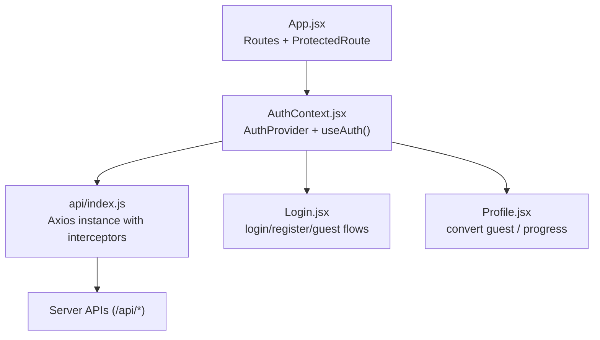
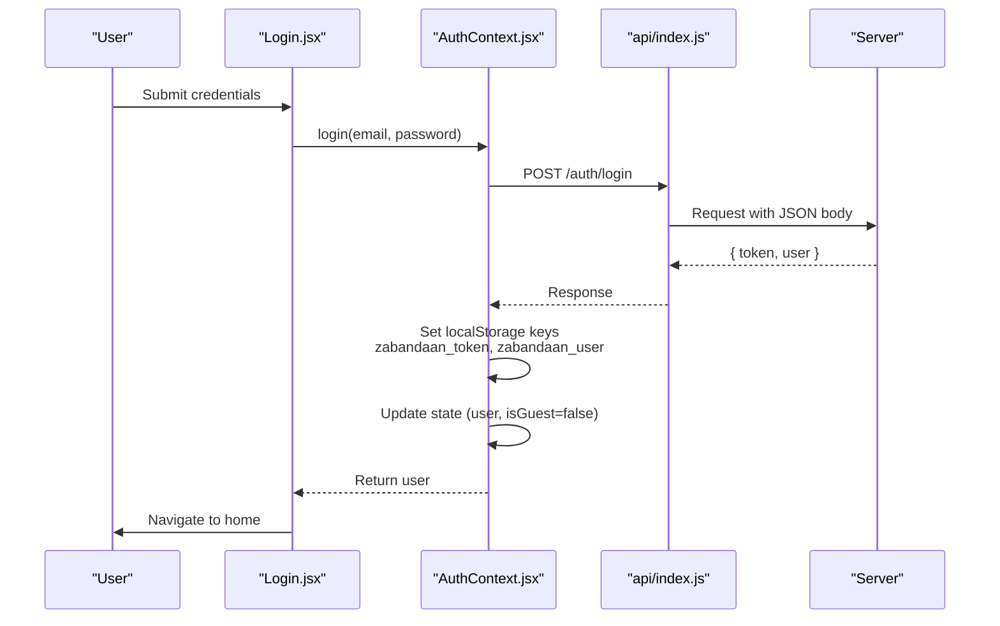
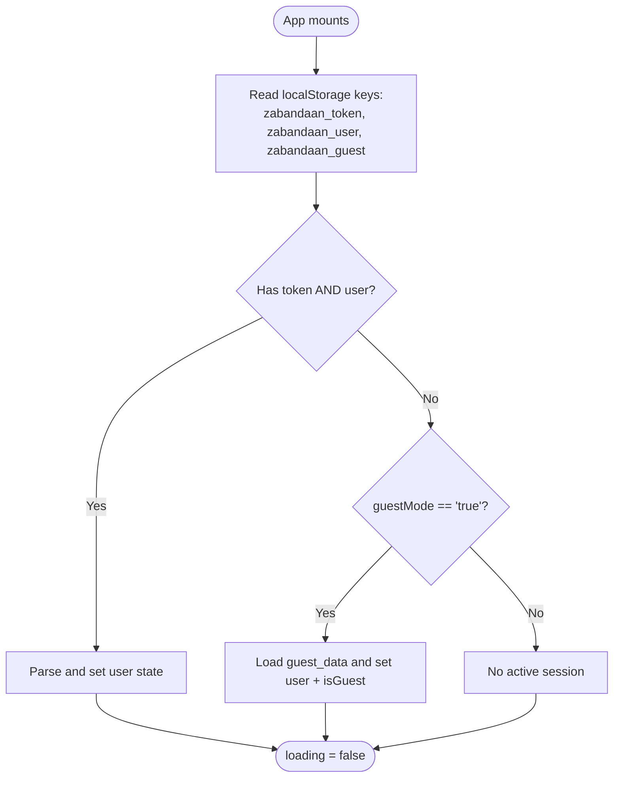
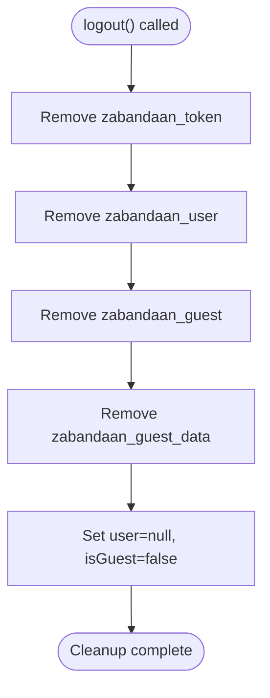
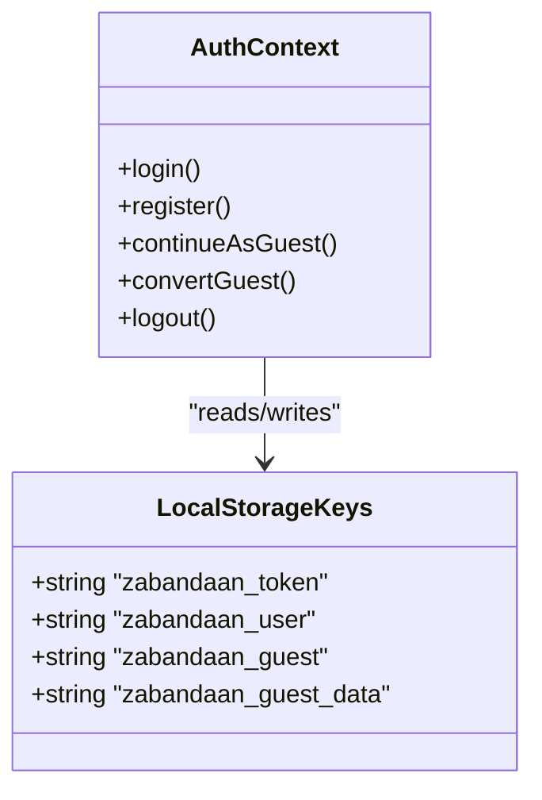
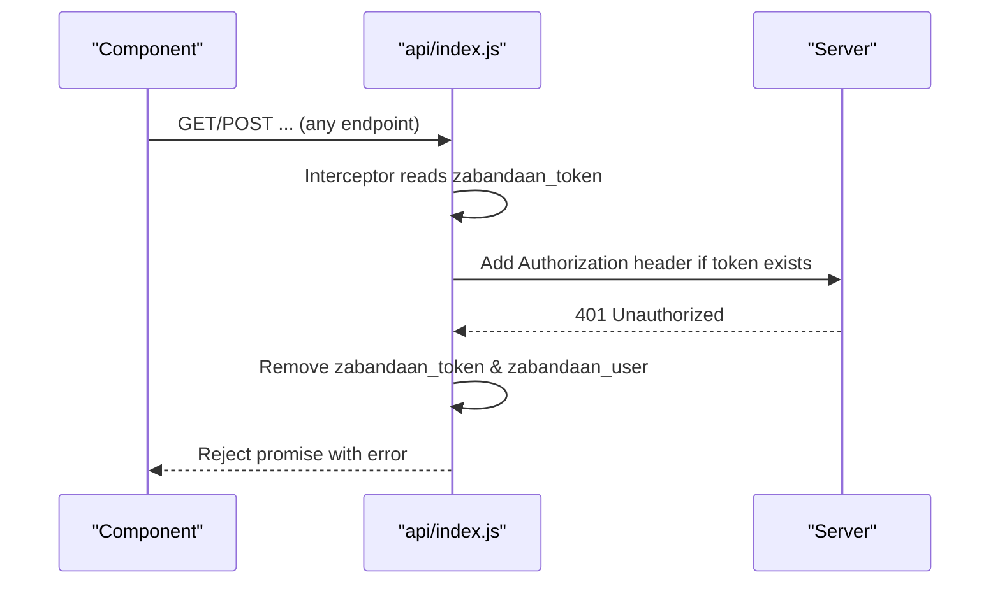
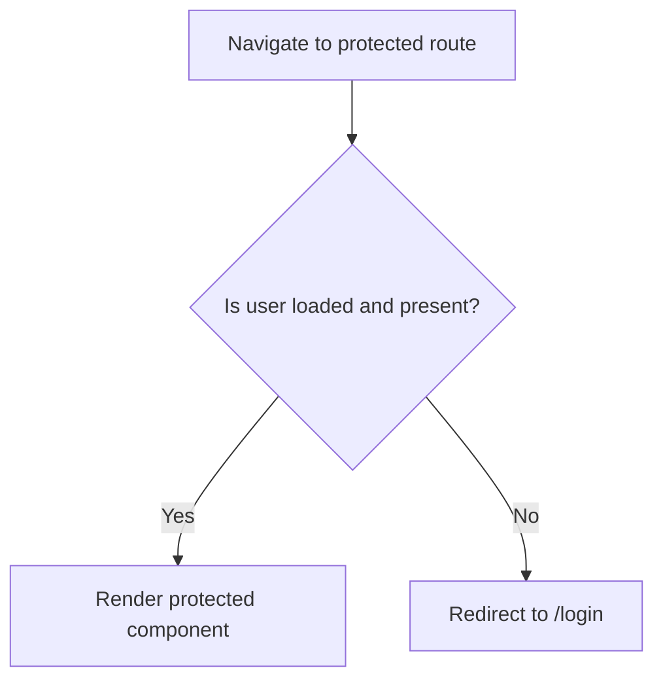
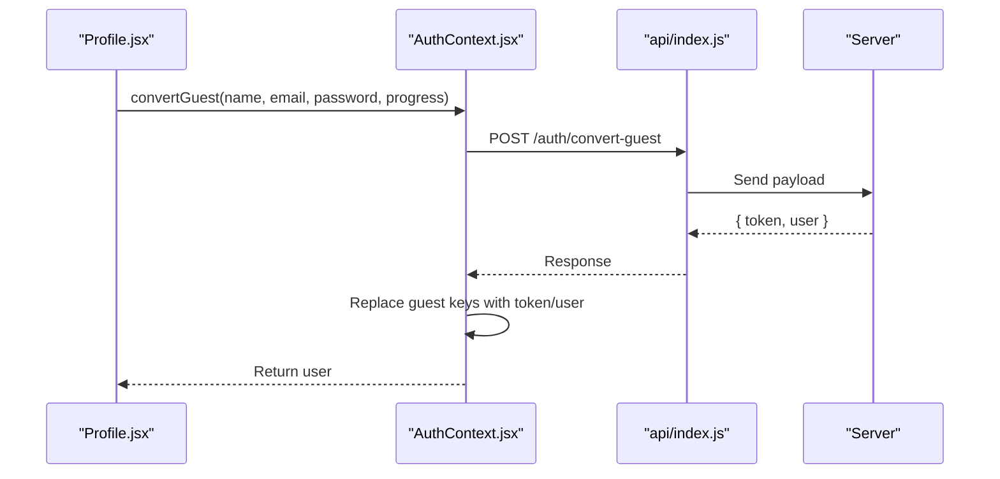
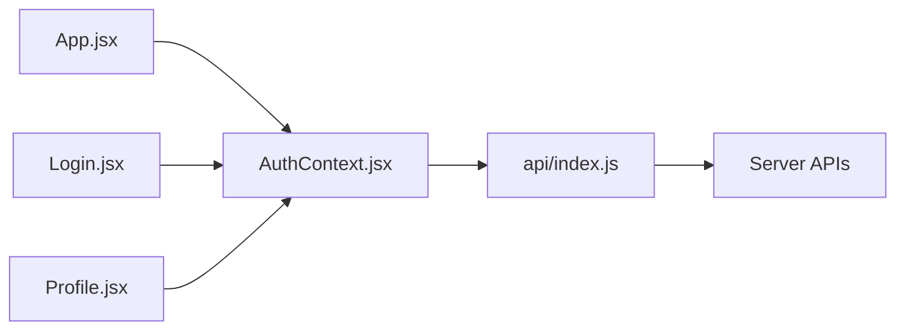

# Session Management

<cite>
**Referenced Files in This Document**
- [AuthContext.jsx](file://zabandaan/client/src/context/AuthContext.jsx)
- [api/index.js](file://zabandaan/client/src/api/index.js)
- [Login.jsx](file://zabandaan/client/src/pages/Login.jsx)
- [App.jsx](file://zabandaan/client/src/App.jsx)
- [Profile.jsx](file://zabandaan/client/src/pages/Profile.jsx)
</cite>

## Table of Contents
1. Introduction
2. Project Structure
3. Core Components
4. Architecture Overview
5. Detailed Component Analysis
6. Dependency Analysis
7. Performance Considerations
8. Troubleshooting Guide
9. Conclusion

## Introduction
This document explains how the application manages user sessions, focusing on token handling, user state persistence, and logout functionality. It covers:
- How authentication state is initialized on app load using localStorage
- The logout method that clears all session data and resets state
- Token storage strategy using specific localStorage keys
- How the API layer attaches tokens to authenticated requests and handles expired tokens
- Session restoration on page reload, cleanup procedures, security considerations, and troubleshooting guidance

## Project Structure
The session management spans a small set of focused files:
- Authentication context provides global auth state and actions (login, register, guest mode, convert guest, logout)
- API client interceptors attach tokens and handle 401 responses
- Routing protects routes based on authentication state
- Login and Profile pages trigger auth flows and display session-related UI

**Diagram sources**
- [App.jsx:14-53](file://zabandaan/client/src/App.jsx#L14-L53)
- [AuthContext.jsx:6-96](file://zabandaan/client/src/context/AuthContext.jsx#L6-L96)
- [api/index.js:3-29](file://zabandaan/client/src/api/index.js#L3-L29)
- [Login.jsx:17-47](file://zabandaan/client/src/pages/Login.jsx#L17-L47)
- [Profile.jsx:20-61](file://zabandaan/client/src/pages/Profile.jsx#L20-L61)

**Section sources**
- [App.jsx:14-53](file://zabandaan/client/src/App.jsx#L14-L53)
- [AuthContext.jsx:6-96](file://zabandaan/client/src/context/AuthContext.jsx#L6-L96)
- [api/index.js:3-29](file://zabandaan/client/src/api/index.js#L3-L29)
- [Login.jsx:17-47](file://zabandaan/client/src/pages/Login.jsx#L17-L47)
- [Profile.jsx:20-61](file://zabandaan/client/src/pages/Profile.jsx#L20-L61)

## Core Components
- AuthProvider and useAuth: Manage user state, guest mode, and provide login/register/convert/logout methods. Initialize session from localStorage on mount.
- API client: Automatically adds Authorization header for every request when a token exists; removes stored credentials on 401 Unauthorized.
- ProtectedRoute: Guards routes by redirecting unauthenticated users to login.
- Login and Profile: Trigger auth flows and expose conversion from guest to registered user.

Key responsibilities:
- Persist and restore session across page reloads
- Attach tokens to API calls
- Handle token expiration and invalidation
- Provide logout to clear all session artifacts

**Section sources**
- [AuthContext.jsx:11-83](file://zabandaan/client/src/context/AuthContext.jsx#L11-L83)
- [api/index.js:8-27](file://zabandaan/client/src/api/index.js#L8-L27)
- [App.jsx:14-53](file://zabandaan/client/src/App.jsx#L14-L53)
- [Login.jsx:17-47](file://zabandaan/client/src/pages/Login.jsx#L17-L47)
- [Profile.jsx:20-61](file://zabandaan/client/src/pages/Profile.jsx#L20-L61)

## Architecture Overview
The session flow integrates React Context, Axios interceptors, and routing protection:

**Diagram sources**
- [Login.jsx:17-28](file://zabandaan/client/src/pages/Login.jsx#L17-L28)
- [AuthContext.jsx:31-41](file://zabandaan/client/src/context/AuthContext.jsx#L31-L41)
- [api/index.js:3-15](file://zabandaan/client/src/api/index.js#L3-L15)

## Detailed Component Analysis

### Authentication State Initialization (useEffect)
On app start, the authentication context checks localStorage for an existing session:
- Reads zabandaan_token and zabandaan_user
- If both exist, parses saved user into state
- Otherwise, checks guest mode via zabandaan_guest and loads guest data if present
- Sets loading to false after initialization

This ensures seamless session restoration on page reload without additional network calls.

**Diagram sources**
- [AuthContext.jsx:11-29](file://zabandaan/client/src/context/AuthContext.jsx#L11-L29)

**Section sources**
- [AuthContext.jsx:11-29](file://zabandaan/client/src/context/AuthContext.jsx#L11-L29)

### Logout Method
The logout function performs a full cleanup:
- Removes all session-related keys from localStorage: zabandaan_token, zabandaan_user, zabandaan_guest, zabandaan_guest_data
- Resets user state to null and isGuest to false

This guarantees no residual session data remains after logout.

**Diagram sources**
- [AuthContext.jsx:76-83](file://zabandaan/client/src/context/AuthContext.jsx#L76-L83)

**Section sources**
- [AuthContext.jsx:76-83](file://zabandaan/client/src/context/AuthContext.jsx#L76-L83)

### Token Storage Strategy
- Keys used:
  - zabandaan_token: Stores the bearer token
  - zabandaan_user: Stores serialized user object
  - zabandaan_guest: Flag indicating guest mode
  - zabandaan_guest_data: Serialized guest user data
- When logging in or registering, the token and user are persisted to localStorage
- Guest mode sets flags and temporary user data
- On logout, all keys are removed

**Diagram sources**
- [AuthContext.jsx:31-83](file://zabandaan/client/src/context/AuthContext.jsx#L31-L83)

**Section sources**
- [AuthContext.jsx:31-83](file://zabandaan/client/src/context/AuthContext.jsx#L31-L83)

### API Layer Token Usage and Expired Token Handling
- Every outgoing request automatically includes Authorization: Bearer <token> if a token exists in localStorage
- On receiving a 401 Unauthorized response, the client removes stored token and user data, effectively signing out the user

**Diagram sources**
- [api/index.js:8-27](file://zabandaan/client/src/api/index.js#L8-L27)

**Section sources**
- [api/index.js:8-27](file://zabandaan/client/src/api/index.js#L8-L27)

### Protected Routes and Navigation
- ProtectedRoute checks current user state and redirects to /login if not authenticated
- App-level routes wrap protected pages with this guard

**Diagram sources**
- [App.jsx:14-53](file://zabandaan/client/src/App.jsx#L14-L53)

**Section sources**
- [App.jsx:14-53](file://zabandaan/client/src/App.jsx#L14-L53)

### Guest Mode and Conversion Flow
- continueAsGuest creates a temporary guest user and persists guest flags/data
- convertGuest sends progress to server, receives token/user, updates localStorage, and switches to authenticated mode

**Diagram sources**
- [Profile.jsx:44-61](file://zabandaan/client/src/pages/Profile.jsx#L44-L61)
- [AuthContext.jsx:64-74](file://zabandaan/client/src/context/AuthContext.jsx#L64-L74)

**Section sources**
- [Profile.jsx:44-61](file://zabandaan/client/src/pages/Profile.jsx#L44-L61)
- [AuthContext.jsx:64-74](file://zabandaan/client/src/context/AuthContext.jsx#L64-L74)

## Dependency Analysis
- AuthContext depends on api for network calls and uses localStorage for persistence
- api depends on axios and reads/writes localStorage for token injection and cleanup
- App routes depend on AuthContext to protect views
- Login and Profile depend on AuthContext to trigger auth flows

**Diagram sources**
- [App.jsx:14-53](file://zabandaan/client/src/App.jsx#L14-L53)
- [AuthContext.jsx:6-96](file://zabandaan/client/src/context/AuthContext.jsx#L6-L96)
- [api/index.js:3-29](file://zabandaan/client/src/api/index.js#L3-L29)
- [Login.jsx:17-47](file://zabandaan/client/src/pages/Login.jsx#L17-L47)
- [Profile.jsx:20-61](file://zabandaan/client/src/pages/Profile.jsx#L20-L61)

**Section sources**
- [App.jsx:14-53](file://zabandaan/client/src/App.jsx#L14-L53)
- [AuthContext.jsx:6-96](file://zabandaan/client/src/context/AuthContext.jsx#L6-L96)
- [api/index.js:3-29](file://zabandaan/client/src/api/index.js#L3-L29)
- [Login.jsx:17-47](file://zabandaan/client/src/pages/Login.jsx#L17-L47)
- [Profile.jsx:20-61](file://zabandaan/client/src/pages/Profile.jsx#L20-L61)

## Performance Considerations
- Minimal overhead: localStorage reads occur once on app mount
- Token attachment is centralized in a single interceptor, avoiding per-request logic
- 401 handling cleans up stale credentials immediately, preventing unnecessary retries with invalid tokens

[No sources needed since this section provides general guidance]

## Troubleshooting Guide
Common session issues and resolutions:

- Corrupted localStorage data
  - Symptom: App fails to parse user or shows inconsistent state
  - Resolution: Clear browser storage for zabandaan_token, zabandaan_user, zabandaan_guest, zabandaan_guest_data and re-login
  - Reference: [AuthContext.jsx:11-29](file://zabandaan/client/src/context/AuthContext.jsx#L11-L29), [AuthContext.jsx:76-83](file://zabandaan/client/src/context/AuthContext.jsx#L76-L83)

- Token synchronization problems
  - Symptom: Requests fail with 401 even though user appears logged in
  - Resolution: Ensure token exists in localStorage; verify API interceptor adds Authorization header; check server-side token validity
  - Reference: [api/index.js:8-27](file://zabandaan/client/src/api/index.js#L8-L27)

- Stale guest mode after login
  - Symptom: User still marked as guest post-login
  - Resolution: Confirm guest keys are removed during login/register/convert; call logout and re-login if necessary
  - Reference: [AuthContext.jsx:31-53](file://zabandaan/client/src/context/AuthContext.jsx#L31-L53), [AuthContext.jsx:64-74](file://zabandaan/client/src/context/AuthContext.jsx#L64-L74)

- Page reload loses session
  - Symptom: User redirected to login on refresh
  - Resolution: Verify useEffect initializes user from localStorage; ensure keys were set correctly during login
  - Reference: [AuthContext.jsx:11-29](file://zabandaan/client/src/context/AuthContext.jsx#L11-L29)

**Section sources**
- [AuthContext.jsx:11-29](file://zabandaan/client/src/context/AuthContext.jsx#L11-L29)
- [AuthContext.jsx:31-74](file://zabandaan/client/src/context/AuthContext.jsx#L31-L74)
- [AuthContext.jsx:76-83](file://zabandaan/client/src/context/AuthContext.jsx#L76-L83)
- [api/index.js:8-27](file://zabandaan/client/src/api/index.js#L8-L27)

## Security Considerations
- Token storage risks
  - Storing tokens in localStorage is vulnerable to XSS; any script execution can read them
  - Mitigations:
    - Sanitize all user inputs and avoid injecting untrusted HTML/JS
    - Use Content Security Policy (CSP) to restrict inline scripts and external sources
    - Prefer httpOnly cookies for sensitive tokens where possible; if using localStorage, consider short-lived tokens and frequent refresh strategies
- Best practices
  - Never log tokens to console or store them in URLs
  - Validate server responses and handle 401 by clearing local state
  - Keep user data minimal in localStorage; only store what is necessary for UI
  - Implement proper logout to remove all session keys

[No sources needed since this section provides general guidance]

## Conclusion
The application implements a straightforward yet effective session management system:
- Initializes session from localStorage on app start
- Attaches tokens to all API requests via an interceptor
- Handles token expiration by clearing credentials on 401
- Provides robust logout to clean all session artifacts
- Protects routes based on authentication state

For enhanced security, consider moving tokens to httpOnly cookies and adopting stricter input sanitization and CSP policies.

[No sources needed since this section summarizes without analyzing specific files]