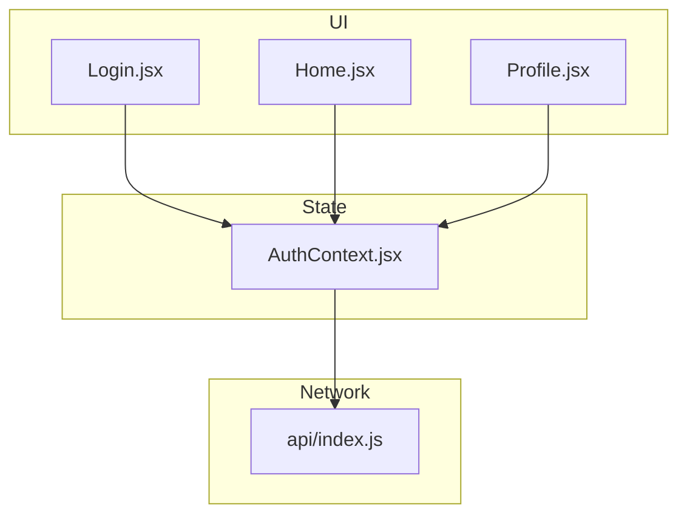
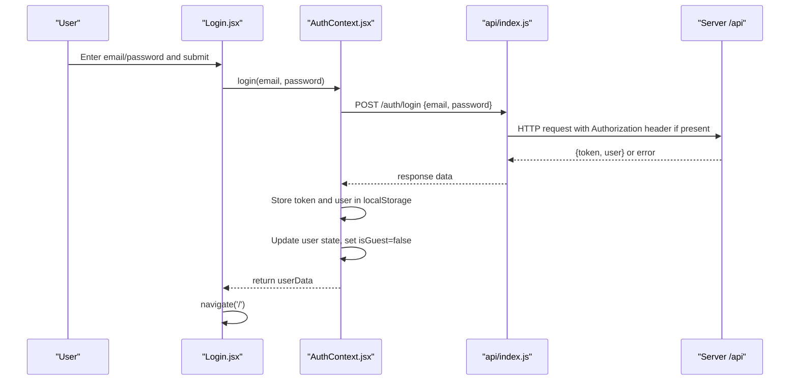
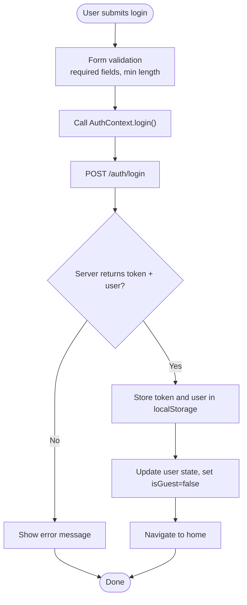
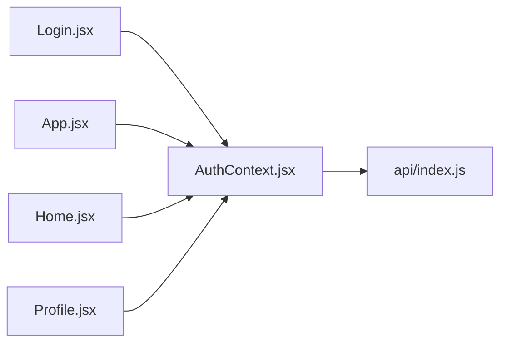

# User Authentication

<cite>
**Referenced Files in This Document**
- [Login.jsx](file://zabandaan/client/src/pages/Login.jsx)
- [AuthContext.jsx](file://zabandaan/client/src/context/AuthContext.jsx)
- [index.js](file://zabandaan/client/src/api/index.js)
- [App.jsx](file://zabandaan/client/src/App.jsx)
- [Home.jsx](file://zabandaan/client/src/pages/Home.jsx)
- [Profile.jsx](file://zabandaan/client/src/pages/Profile.jsx)
</cite>

## Table of Contents
1. [Introduction](#introduction)
2. [Project Structure](#project-structure)
3. [Core Components](#core-components)
4. [Architecture Overview](#architecture-overview)
5. [Detailed Component Analysis](#detailed-component-analysis)
6. [Dependency Analysis](#dependency-analysis)
7. [Performance Considerations](#performance-considerations)
8. [Troubleshooting Guide](#troubleshooting-guide)
9. [Conclusion](#conclusion)

## Introduction
This document explains the user authentication functionality for login and registration, focusing on how email/password authentication is handled, token storage in localStorage, and user state management across the application. It also covers the registration flow with form validation and API integration, concrete examples from the Login component (form handling, error states, navigation), the end-to-end authentication flow, security considerations, and troubleshooting guidance for common issues such as invalid credentials, network errors, and token expiration.

## Project Structure
The authentication system spans a few key files:
- Login page handles UI for login, registration, and guest mode.
- AuthContext provides global authentication state and methods (login, register, continueAsGuest, convertGuest, logout).
- API client configures axios with base URL, request/response interceptors for token injection and 401 handling.
- App routes protect pages using a ProtectedRoute that checks authentication status.
- Home and Profile use the auth context to display user info and manage guest conversion.

**Diagram sources**
- [Login.jsx:1-302](file://zabandaan/client/src/pages/Login.jsx#L1-L302)
- [AuthContext.jsx:1-97](file://zabandaan/client/src/context/AuthContext.jsx#L1-L97)
- [index.js:1-30](file://zabandaan/client/src/api/index.js#L1-L30)
- [Home.jsx:1-219](file://zabandaan/client/src/pages/Home.jsx#L1-L219)
- [Profile.jsx:1-353](file://zabandaan/client/src/pages/Profile.jsx#L1-L353)

**Section sources**
- [Login.jsx:1-302](file://zabandaan/client/src/pages/Login.jsx#L1-L302)
- [AuthContext.jsx:1-97](file://zabandaan/client/src/context/AuthContext.jsx#L1-L97)
- [index.js:1-30](file://zabandaan/client/src/api/index.js#L1-L30)
- [App.jsx:1-66](file://zabandaan/client/src/App.jsx#L1-L66)
- [Home.jsx:1-219](file://zabandaan/client/src/pages/Home.jsx#L1-L219)
- [Profile.jsx:1-353](file://zabandaan/client/src/pages/Profile.jsx#L1-L353)

## Core Components
- Login page: Manages form inputs for login and registration, shows loading and error states, and navigates after success. Supports guest mode entry.
- AuthContext: Centralizes authentication state (user, isGuest, loading), persists session via localStorage, exposes login/register/guest/convert/logout functions, and restores sessions on app load.
- API client: Axios instance with baseURL and interceptors to attach Bearer tokens and clear session on 401 responses.
- Routing: ProtectedRoute ensures only authenticated users can access protected pages; unauthenticated users are redirected to /login.

Key responsibilities:
- Form handling and validation in Login.jsx.
- Session persistence and state updates in AuthContext.jsx.
- Token injection and error handling in api/index.js.
- Route protection in App.jsx.

**Section sources**
- [Login.jsx:17-47](file://zabandaan/client/src/pages/Login.jsx#L17-L47)
- [AuthContext.jsx:11-83](file://zabandaan/client/src/context/AuthContext.jsx#L11-L83)
- [index.js:3-27](file://zabandaan/client/src/api/index.js#L3-L27)
- [App.jsx:14-52](file://zabandaan/client/src/App.jsx#L14-L52)

## Architecture Overview
The authentication flow integrates UI, state, and network layers:

**Diagram sources**
- [Login.jsx:17-28](file://zabandaan/client/src/pages/Login.jsx#L17-L28)
- [AuthContext.jsx:31-41](file://zabandaan/client/src/context/AuthContext.jsx#L31-L41)
- [index.js:8-15](file://zabandaan/client/src/api/index.js#L8-L15)

## Detailed Component Analysis

### Login Page: Form Handling, Errors, Navigation
- Modes: landing, login, register. Landing offers Create Account, Log In, and Continue as Guest.
- Login flow:
  - Prevents default form submission, clears previous errors, sets loading.
  - Calls login(email, password) from AuthContext.
  - On success, navigates to home.
  - On error, displays server-provided message or fallback text.
- Registration flow:
  - Validates name presence before calling register(name, email, password).
  - Stores loading state and handles errors similarly to login.
- Guest mode:
  - Allows continuing without an account by setting guest state in AuthContext and navigating home.

Concrete examples:
- Form fields: email and password required; password has minimum length constraint.
- Error display: inline error paragraph shown when error state is set.
- Loading state: button disabled and text changes during async operations.

**Section sources**
- [Login.jsx:6-15](file://zabandaan/client/src/pages/Login.jsx#L6-L15)
- [Login.jsx:17-47](file://zabandaan/client/src/pages/Login.jsx#L17-L47)
- [Login.jsx:97-146](file://zabandaan/client/src/pages/Login.jsx#L97-L146)

### AuthContext: State Management and Persistence
- Initialization:
  - On mount, reads token, saved user, and guest flags from localStorage.
  - Restores user state and guest mode accordingly.
- Login:
  - Posts to /auth/login, stores token and user in localStorage, clears guest markers, updates state.
- Register:
  - Posts to /auth/register, stores token and user in localStorage, clears guest markers, updates state.
- Guest mode:
  - Creates a temporary guest user object, stores guest flags and data in localStorage, updates state.
- Convert guest:
  - Posts to /auth/convert-guest with progress payload, stores token/user, clears guest markers, updates state.
- Logout:
  - Clears all auth-related localStorage entries and resets state.

Security note:
- Tokens and user data are stored in localStorage; this enables session persistence but should be used with caution in production environments.

**Section sources**
- [AuthContext.jsx:11-29](file://zabandaan/client/src/context/AuthContext.jsx#L11-L29)
- [AuthContext.jsx:31-83](file://zabandaan/client/src/context/AuthContext.jsx#L31-L83)

### API Client: Token Injection and 401 Handling
- Base configuration:
  - baseURL set to /api with JSON content type.
- Request interceptor:
  - Reads token from localStorage and attaches Authorization: Bearer <token> to outgoing requests.
- Response interceptor:
  - On 401 Unauthorized, removes token and user from localStorage to force re-authentication.

Implications:
- All authenticated requests automatically include the token.
- Expired or invalid tokens result in automatic cleanup of local session data.

**Section sources**
- [index.js:3-27](file://zabandaan/client/src/api/index.js#L3-L27)

### Routing: Protected Routes
- ProtectedRoute:
  - Uses AuthContext to check user and loading state.
  - Shows loading indicator while initializing.
  - Redirects to /login if no user is present.
- Routes:
  - /login redirects to home if already authenticated.
  - Other routes are wrapped with ProtectedRoute to enforce authentication.

**Section sources**
- [App.jsx:14-52](file://zabandaan/client/src/App.jsx#L14-L52)

### End-to-End Authentication Flow

**Diagram sources**
- [Login.jsx:17-47](file://zabandaan/client/src/pages/Login.jsx#L17-L47)
- [AuthContext.jsx:31-41](file://zabandaan/client/src/context/AuthContext.jsx#L31-L41)
- [index.js:8-15](file://zabandaan/client/src/api/index.js#L8-L15)

## Dependency Analysis
- Login depends on AuthContext for login/register/guest actions and on React Router for navigation.
- AuthContext depends on the API client for network calls and uses localStorage for persistence.
- API client depends on axios and interacts with the server at /api endpoints.
- App routes depend on AuthContext to guard protected pages.

**Diagram sources**
- [Login.jsx:1-302](file://zabandaan/client/src/pages/Login.jsx#L1-L302)
- [AuthContext.jsx:1-97](file://zabandaan/client/src/context/AuthContext.jsx#L1-L97)
- [index.js:1-30](file://zabandaan/client/src/api/index.js#L1-L30)
- [App.jsx:1-66](file://zabandaan/client/src/App.jsx#L1-L66)
- [Home.jsx:1-219](file://zabandaan/client/src/pages/Home.jsx#L1-L219)
- [Profile.jsx:1-353](file://zabandaan/client/src/pages/Profile.jsx#L1-L353)

**Section sources**
- [Login.jsx:1-302](file://zabandaan/client/src/pages/Login.jsx#L1-L302)
- [AuthContext.jsx:1-97](file://zabandaan/client/src/context/AuthContext.jsx#L1-L97)
- [index.js:1-30](file://zabandaan/client/src/api/index.js#L1-L30)
- [App.jsx:1-66](file://zabandaan/client/src/App.jsx#L1-L66)
- [Home.jsx:1-219](file://zabandaan/client/src/pages/Home.jsx#L1-L219)
- [Profile.jsx:1-353](file://zabandaan/client/src/pages/Profile.jsx#L1-L353)

## Performance Considerations
- LocalStorage operations are synchronous and fast; however, excessive parsing/stringification can add overhead. The current approach parses saved user objects once on app load and writes minimal data on auth events.
- Network requests are centralized through axios interceptors, reducing duplication and ensuring consistent behavior.
- Avoid unnecessary re-renders by keeping state updates focused on user and isGuest flags.

[No sources needed since this section provides general guidance]

## Troubleshooting Guide
Common issues and resolutions:

- Invalid credentials:
  - Symptoms: Error message displayed after login attempt.
  - Cause: Server rejects credentials; error propagated from API call.
  - Resolution: Verify email/password; ensure correct casing and spelling. Check server logs for detailed error messages.

- Network errors:
  - Symptoms: Generic failure message; possible console errors.
  - Cause: Connectivity issues, server downtime, or misconfigured baseURL.
  - Resolution: Confirm network connectivity; verify backend is reachable at /api; check CORS settings if applicable.

- Token expiration:
  - Symptoms: Subsequent requests fail with 401; user unexpectedly logged out.
  - Cause: Token expired or invalidated; response interceptor clears local session.
  - Resolution: Re-authenticate by logging in again; consider implementing token refresh logic if supported by the server.

- Guest mode inconsistencies:
  - Symptoms: Unexpected switch between guest and registered user.
  - Cause: Conversion process may have cleared guest flags; ensure convertGuest is called correctly.
  - Resolution: Clear browser storage and retry conversion; verify localStorage keys are updated consistently.

- Navigation not occurring after successful login:
  - Symptoms: Stays on login page despite successful response.
  - Cause: Missing or incorrect navigate call; try/catch swallowing errors.
  - Resolution: Ensure navigate('/') is executed after successful login; confirm routing setup in App.jsx.

**Section sources**
- [Login.jsx:17-47](file://zabandaan/client/src/pages/Login.jsx#L17-L47)
- [AuthContext.jsx:31-83](file://zabandaan/client/src/context/AuthContext.jsx#L31-L83)
- [index.js:17-27](file://zabandaan/client/src/api/index.js#L17-L27)
- [App.jsx:14-52](file://zabandaan/client/src/App.jsx#L14-L52)

## Conclusion
The authentication system combines a straightforward UI with robust state management and secure token handling. Login and registration flows validate input, communicate with the server, persist sessions in localStorage, and update global state to reflect the current user. Protected routes ensure only authenticated users access core features. For production hardening, consider additional security measures such as HTTPS-only cookies, token refresh strategies, and stricter input sanitization.

[No sources needed since this section summarizes without analyzing specific files]