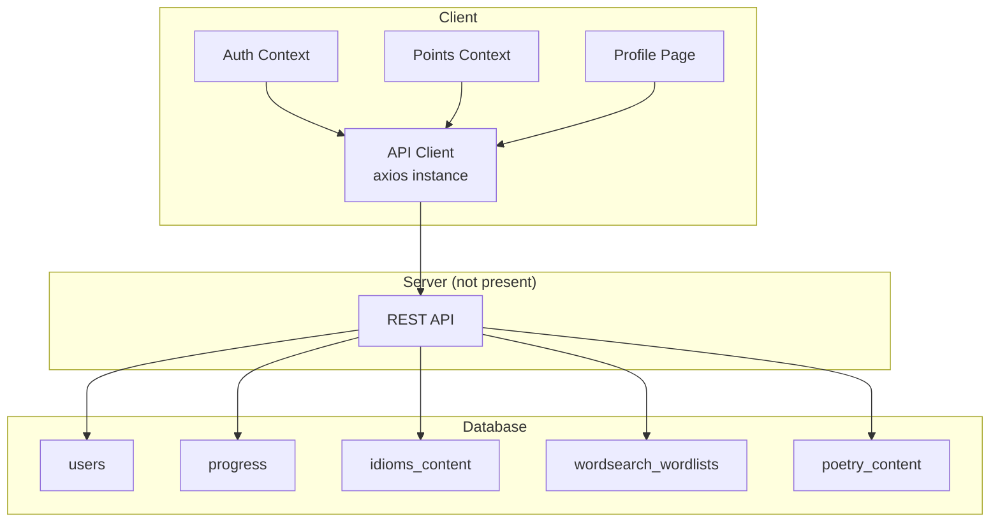
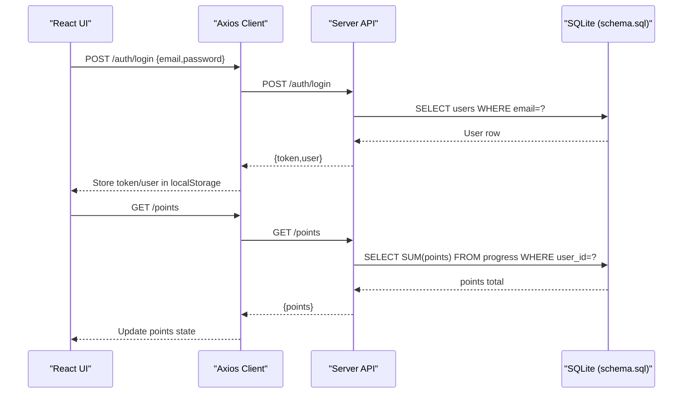
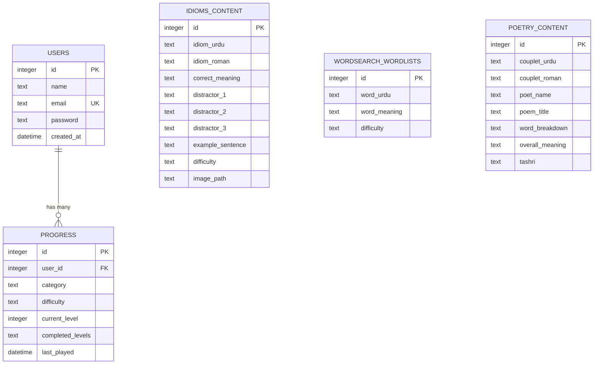
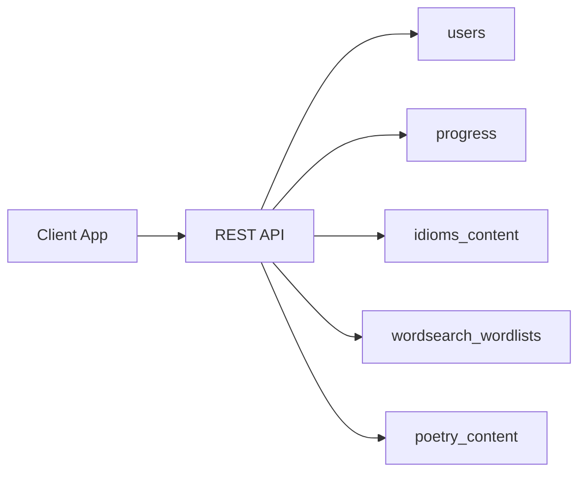

# Database Schema

<cite>
**Referenced Files in This Document**
- [schema.sql](file://zabandaan/database/schema.sql)
- [index.js](file://zabandaan/client/src/api/index.js)
- [AuthContext.jsx](file://zabandaan/client/src/context/AuthContext.jsx)
- [PointsContext.jsx](file://zabandaan/client/src/context/PointsContext.jsx)
- [Profile.jsx](file://zabandaan/client/src/pages/Profile.jsx)
</cite>

## Table of Contents
1. [Introduction](#introduction)
2. [Project Structure](#project-structure)
3. [Core Components](#core-components)
4. [Architecture Overview](#architecture-overview)
5. [Detailed Component Analysis](#detailed-component-analysis)
6. [Dependency Analysis](#dependency-analysis)
7. [Performance Considerations](#performance-considerations)
8. [Troubleshooting Guide](#troubleshooting-guide)
9. [Conclusion](#conclusion)
10. [Appendices](#appendices)

## Introduction
This document provides comprehensive data model documentation for the Zabandaan database schema. It focuses on table structures, relationships, and integrity constraints defined in the SQL schema. It explains entity relationships among users, progress records, content items (idioms, word search wordlists, poetry), and how these relate to user achievements via points and progress. The document also covers data validation rules enforced at the database level, indexes and constraints, data access patterns observed in the client code, performance considerations, lifecycle and retention guidance, security and privacy notes, and migration strategies for schema changes.

## Project Structure
The repository includes a frontend application and a dedicated database schema file. The backend server is referenced by scripts but not included in this workspace; however, the client code demonstrates expected API endpoints that interact with the database through a server layer.

[No sources needed since this diagram shows conceptual workflow, not actual code structure]

**Section sources**
- [schema.sql:1-54](file://zabandaan/database/schema.sql#L1-L54)
- [index.js:1-30](file://zabandaan/client/src/api/index.js#L1-L30)
- [AuthContext.jsx:1-96](file://zabandaan/client/src/context/AuthContext.jsx#L1-L96)
- [PointsContext.jsx:1-78](file://zabandaan/client/src/context/PointsContext.jsx#L1-L78)
- [Profile.jsx:1-45](file://zabandaan/client/src/pages/Profile.jsx#L1-L45)

## Core Components
The database schema defines five core tables:

- users: Stores user identity and authentication credentials.
- progress: Tracks per-user, per-category, per-difficulty learning progress.
- idioms_content: Content for idioms-based activities.
- wordsearch_wordlists: Word list content for word search activities.
- poetry_content: Poetry content for reading and comprehension activities.

Key relationships:
- progress.user_id references users.id (foreign key).
- Unique constraint on progress(user_id, category, difficulty) ensures one progress record per user/category/difficulty combination.

Indexes:
- idx_progress_user on progress(user_id) for efficient lookups by user.
- idx_idioms_difficulty on idioms_content(difficulty) for filtering idioms by difficulty.
- idx_wordsearch_difficulty on wordsearch_wordlists(difficulty) for filtering word lists by difficulty.

Constraints and validation at the database level:
- NOT NULL constraints enforce required fields across all tables.
- UNIQUE(email) prevents duplicate user accounts.
- UNIQUE(user_id, category, difficulty) enforces single progress record per user/category/difficulty.
- DEFAULT values provide sensible defaults (e.g., current_level = 0, completed_levels = '[]', created_at = CURRENT_TIMESTAMP).

Data types and semantics:
- INTEGER PRIMARY KEY AUTOINCREMENT for surrogate keys.
- TEXT for strings including JSON-like arrays stored as text (e.g., completed_levels).
- DATETIME for timestamps where applicable.

**Section sources**
- [schema.sql:1-54](file://zabandaan/database/schema.sql#L1-L54)

## Architecture Overview
The system follows a typical client-server architecture where the React client communicates with a REST API (server not included here). The server mediates between the client and the SQLite database defined by the schema.

**Diagram sources**
- [AuthContext.jsx:31-53](file://zabandaan/client/src/context/AuthContext.jsx#L31-L53)
- [PointsContext.jsx:52-75](file://zabandaan/client/src/context/PointsContext.jsx#L52-L75)
- [schema.sql:1-54](file://zabandaan/database/schema.sql#L1-L54)

## Detailed Component Analysis

### Entity Relationship Model
The following ER diagram maps the tables and their relationships as defined in the schema:

**Diagram sources**
- [schema.sql:1-54](file://zabandaan/database/schema.sql#L1-L54)

### Data Integrity Constraints
- Primary Keys: Each table uses an auto-incrementing integer primary key for stable identification.
- Foreign Keys: progress.user_id references users.id to maintain referential integrity.
- Unique Constraints:
  - users.email must be unique to prevent duplicate accounts.
  - progress(user_id, category, difficulty) is unique to ensure one progress record per user/category/difficulty.
- Not Null Constraints: All critical fields are NOT NULL to avoid incomplete records.
- Defaults:
  - progress.current_level defaults to 0.
  - progress.completed_levels defaults to an empty JSON array string '[]'.
  - users.created_at defaults to CURRENT_TIMESTAMP.

**Section sources**
- [schema.sql:1-54](file://zabandaan/database/schema.sql#L1-L54)

### Indexes and Query Performance
- idx_progress_user on progress(user_id): Optimizes queries that filter or join progress by user.
- idx_idioms_difficulty on idioms_content(difficulty): Speeds up retrieval of idioms filtered by difficulty.
- idx_wordsearch_difficulty on wordsearch_wordlists(difficulty): Speeds up retrieval of word lists filtered by difficulty.

These indexes support common query patterns such as:
- Fetching a user’s progress records efficiently.
- Selecting content items by difficulty levels for adaptive gameplay.

**Section sources**
- [schema.sql:51-54](file://zabandaan/database/schema.sql#L51-L54)

### Data Validation Rules Enforced at the Database Level
- Email uniqueness prevents duplicate registrations.
- Required fields ensure essential data presence (e.g., names, meanings, difficulties).
- Progress records cannot be duplicated for the same user/category/difficulty due to the composite unique constraint.
- Timestamps are automatically set for user creation.

Note: Application-level validation should complement database constraints for better UX and error handling.

**Section sources**
- [schema.sql:1-54](file://zabandaan/database/schema.sql#L1-L54)

### Data Access Patterns Observed in the Client
- Authentication:
  - Login and registration call /auth/login and /auth/register respectively.
  - Tokens and user info are stored in localStorage for session persistence.
- Points and Progress:
  - GET /points retrieves total points for authenticated users.
  - POST /points adds points for completed levels.
  - Guest mode stores progress locally using keys like guest_progress_{category}_{difficulty}.
- Profile:
  - GET /progress loads progress records for authenticated users.

These patterns imply the server will perform operations such as:
- Validating credentials against users.
- Aggregating points from progress records.
- Updating progress entries with new levels and timestamps.

**Section sources**
- [AuthContext.jsx:31-74](file://zabandaan/client/src/context/AuthContext.jsx#L31-L74)
- [PointsContext.jsx:12-75](file://zabandaan/client/src/context/PointsContext.jsx#L12-L75)
- [Profile.jsx:30-41](file://zabandaan/client/src/pages/Profile.jsx#L30-L41)
- [index.js:1-30](file://zabandaan/client/src/api/index.js#L1-L30)

### Achievements and Points Model
While there is no explicit achievements table in the schema, achievements can be modeled as derived metrics based on progress and points:
- Points accumulation: Derived from progress records (completed_levels count or explicit point updates).
- Achievement thresholds: Can be computed server-side using aggregated points and completed levels.
- Display logic: Handled in the client by updating UI when points increase.

This approach keeps the schema simple while allowing flexible achievement computation.

**Section sources**
- [schema.sql:9-18](file://zabandaan/database/schema.sql#L9-L18)
- [PointsContext.jsx:12-46](file://zabandaan/client/src/context/PointsContext.jsx#L12-L46)

## Dependency Analysis
The client depends on a REST API that interacts with the database schema. The main dependencies include:
- Auth flow relies on users table and token management in localStorage.
- Points and progress rely on progress table and its indexes.
- Content browsing relies on idioms_content, wordsearch_wordlists, and poetry_content tables.

[No sources needed since this diagram shows conceptual workflow, not actual code structure]

**Section sources**
- [AuthContext.jsx:31-74](file://zabandaan/client/src/context/AuthContext.jsx#L31-L74)
- [PointsContext.jsx:12-75](file://zabandaan/client/src/context/PointsContext.jsx#L12-L75)
- [schema.sql:1-54](file://zabandaan/database/schema.sql#L1-L54)

## Performance Considerations
- Use existing indexes:
  - Filter progress by user_id leveraging idx_progress_user.
  - Filter content by difficulty leveraging idx_idioms_difficulty and idx_wordsearch_difficulty.
- Avoid full table scans:
  - Prefer indexed columns in WHERE clauses.
  - Limit result sets with pagination if needed.
- Optimize writes:
  - Batch updates for progress when possible.
  - Minimize redundant inserts by leveraging unique constraints.
- JSON storage:
  - completed_levels stored as text; consider keeping arrays small and compact.
  - For complex queries on completed_levels, consider denormalization or additional tracking fields if performance becomes critical.

[No sources needed since this section provides general guidance]

## Troubleshooting Guide
Common issues and resolutions:
- Duplicate email registration:
  - Cause: Attempting to register with an existing email.
  - Resolution: Check for uniqueness before insert; inform user to use a different email or log in.
- Duplicate progress records:
  - Cause: Inserting progress for the same user/category/difficulty multiple times.
  - Resolution: Use upsert logic (insert or update) to maintain a single record per combination.
- Missing foreign key reference:
  - Cause: Creating progress without a valid user_id.
  - Resolution: Ensure user exists before inserting progress; handle foreign key errors gracefully.
- Session invalidation:
  - Cause: 401 responses indicating expired or missing tokens.
  - Resolution: Clear local storage and redirect to login; re-authenticate.

**Section sources**
- [schema.sql:1-54](file://zabandaan/database/schema.sql#L1-L54)
- [index.js:17-27](file://zabandaan/client/src/api/index.js#L17-L27)

## Conclusion
The Zabandaan database schema provides a solid foundation for a gamified Urdu literacy app. It models users, progress, and content entities with clear relationships and constraints. The client integrates with a REST API to manage authentication, points, and progress, while the schema enforces data integrity and supports performance through targeted indexes. Future enhancements may include explicit achievements modeling, richer analytics, and advanced caching strategies at the server layer.

[No sources needed since this section summarizes without analyzing specific files]

## Appendices

### Data Lifecycle Management and Retention Policies
- User accounts:
  - Creation timestamp recorded; consider soft deletes or account deactivation policies.
- Progress records:
  - Updated on gameplay; consider archiving old sessions or limiting history size.
- Content tables:
  - Relatively static; versioning may be needed for content updates.
- Backup procedures:
  - Regularly back up the SQLite database file.
  - Version control schema changes alongside application code.

[No sources needed since this section provides general guidance]

### Security and Privacy
- Passwords:
  - Store hashed passwords server-side; never store plaintext.
- Authentication:
  - Use secure tokens and HTTPS; validate tokens on each request.
- Input validation:
  - Validate and sanitize inputs both client and server sides.
- Access control:
  - Enforce user authorization on server endpoints to protect data.

[No sources needed since this section provides general guidance]

### Migration Strategies and Version Management
- Schema migrations:
  - Use migration scripts to add/alter tables and indexes safely.
  - Test migrations on staging environments before production.
- Backward compatibility:
  - Maintain compatibility during transitions; use feature flags if necessary.
- Rollback plans:
  - Prepare rollback scripts for failed migrations.

[No sources needed since this section provides general guidance]