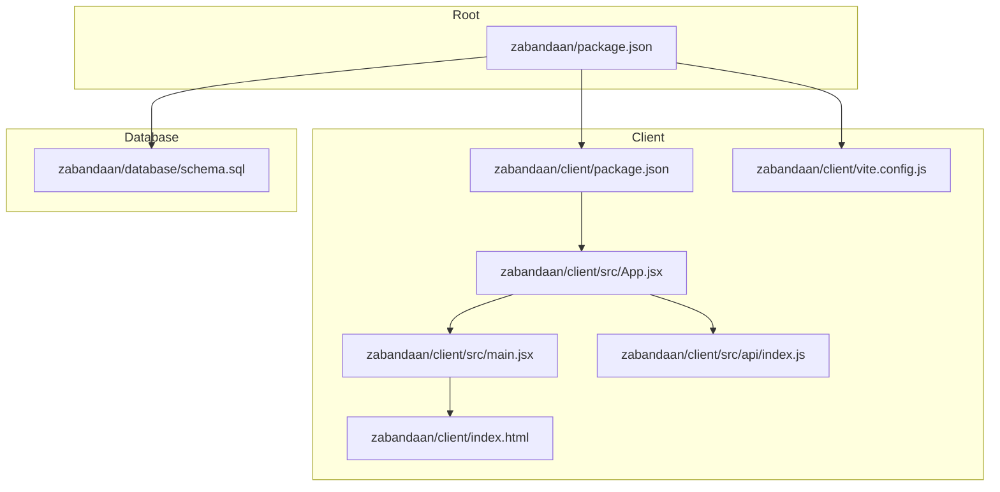
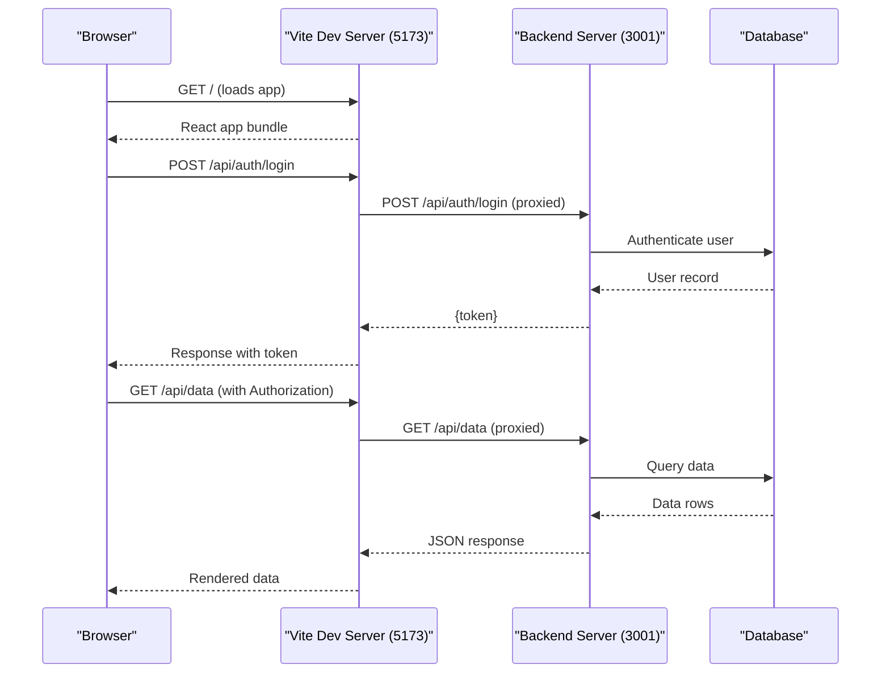

# Getting Started

<cite>
**Referenced Files in This Document**
- [package.json](file://zabandaan/package.json)
- [client/package.json](file://zabandaan/client/package.json)
- [vite.config.js](file://zabandaan/client/vite.config.js)
- [schema.sql](file://zabandaan/database/schema.sql)
- [App.jsx](file://zabandaan/client/src/App.jsx)
- [main.jsx](file://zabandaan/client/src/main.jsx)
- [index.html](file://zabandaan/client/index.html)
- [api/index.js](file://zabandaan/client/src/api/index.js)
</cite>

## Table of Contents
1. [Introduction](#introduction)
2. [Prerequisites](#prerequisites)
3. [Project Structure](#project-structure)
4. [Installation and Setup](#installation-and-setup)
5. [Configuration Options](#configuration-options)
6. [First Run Instructions](#first-run-instructions)
7. [Verification Steps](#verification-steps)
8. [Troubleshooting Guide](#troubleshooting-guide)
9. [Architecture Overview](#architecture-overview)
10. [Conclusion](#conclusion)

## Introduction
Zabandaan is a gamified web application for learning Urdu through interactive activities such as alphabet tracing, idioms games, word search, and poetry exploration. It uses React with Vite for the client and a backend server that exposes an API under /api. The database schema defines users, progress tracking, and content tables for idioms, word search, and poetry.

This guide helps you set up the development environment quickly, run the app locally, and understand key configuration points to customize your workflow.

## Prerequisites
- Node.js (LTS recommended) and npm installed on your machine
- Basic familiarity with React and modern JavaScript (ES modules)
- A terminal or command-line interface
- A SQLite-capable environment if you plan to run the backend directly (the schema uses SQLite syntax)

[No sources needed since this section provides general guidance]

## Project Structure
At a high level:
- zabandaan/ contains top-level scripts to run both client and server together
- zabandaan/client/ is the React + Vite frontend
- zabandaan/database/schema.sql defines the database schema used by the backend
- Client assets and pages are organized under client/src

**Diagram sources**
- [package.json:1-17](file://zabandaan/package.json#L1-L17)
- [client/package.json:1-22](file://zabandaan/client/package.json#L1-L22)
- [vite.config.js:1-16](file://zabandaan/client/vite.config.js#L1-L16)
- [App.jsx:1-66](file://zabandaan/client/src/App.jsx#L1-L66)
- [main.jsx:1-10](file://zabandaan/client/src/main.jsx#L1-L10)
- [index.html:1-16](file://zabandaan/client/index.html#L1-L16)
- [schema.sql:1-54](file://zabandaan/database/schema.sql#L1-L54)

**Section sources**
- [package.json:1-17](file://zabandaan/package.json#L1-L17)
- [client/package.json:1-22](file://zabandaan/client/package.json#L1-L22)
- [vite.config.js:1-16](file://zabandaan/client/vite.config.js#L1-L16)
- [schema.sql:1-54](file://zabandaan/database/schema.sql#L1-L54)
- [App.jsx:1-66](file://zabandaan/client/src/App.jsx#L1-L66)
- [main.jsx:1-10](file://zabandaan/client/src/main.jsx#L1-L10)
- [index.html:1-16](file://zabandaan/client/index.html#L1-L16)

## Installation and Setup
Follow these steps to get the project running locally:

1. Clone the repository
   - Use your preferred Git client or command line to clone the repo into your workspace.

2. Install dependencies
   - From the root directory, install top-level dependencies:
     - npm install
   - Then install client dependencies:
     - cd zabandaan/client && npm install

3. Set up the database schema
   - Ensure your backend service can access the schema file at zabandaan/database/schema.sql and apply it to create the required tables and indexes before starting the server.

4. Start the development servers
   - From the root directory, run:
     - npm run dev
   - This concurrently starts:
     - The backend server (expected at http://localhost:3001)
     - The Vite development server (default port 5173)

Notes:
- The client’s Vite config proxies /api requests to http://localhost:3001. Make sure the backend is running on that port so API calls from the browser work correctly.

**Section sources**
- [package.json:6-11](file://zabandaan/package.json#L6-L11)
- [client/package.json:6-9](file://zabandaan/client/package.json#L6-L9)
- [vite.config.js:6-14](file://zabandaan/client/vite.config.js#L6-L14)
- [schema.sql:1-54](file://zabandaan/database/schema.sql#L1-L54)

## Configuration Options
- Vite development server
  - Port: default 5173
  - Proxy: /api is proxied to http://localhost:3001 with changeOrigin enabled
  - You can adjust the port or proxy target in the Vite config if your setup differs.

- Environment variables
  - The client attaches an Authorization header using a token stored in localStorage when making API calls. Ensure your backend issues and validates tokens accordingly.

- Backend expectations
  - The client expects a backend reachable at http://localhost:3001 serving endpoints under /api. Confirm your server binds to that host and port.

**Section sources**
- [vite.config.js:6-14](file://zabandaan/client/vite.config.js#L6-L14)
- [api/index.js:3-15](file://zabandaan/client/src/api/index.js#L3-L15)

## First Run Instructions
After installation and schema setup:

1. Start the backend server (ensure it listens on http://localhost:3001)
2. Start the client dev server (Vite on port 5173)
3. Open http://localhost:5173 in your browser
4. Log in or sign up (if supported by your backend) to access protected routes
5. Explore features like alphabets, idioms, word search, and poetry

What happens behind the scenes:
- The Vite dev server serves the React app and proxies /api to the backend
- The app initializes via main.jsx and renders routes defined in App.jsx
- Protected routes require authentication; unauthenticated users are redirected to login

**Section sources**
- [package.json:6-11](file://zabandaan/package.json#L6-L11)
- [client/package.json:6-9](file://zabandaan/client/package.json#L6-L9)
- [vite.config.js:6-14](file://zabandaan/client/vite.config.js#L6-L14)
- [App.jsx:14-53](file://zabandaan/client/src/App.jsx#L14-L53)
- [main.jsx:1-10](file://zabandaan/client/src/main.jsx#L1-L10)

## Verification Steps
To confirm everything is working:

- Check ports
  - Vite should be accessible at http://localhost:5173
  - Backend should respond at http://localhost:3001

- Test API proxy
  - Open the browser Developer Tools Network tab
  - Trigger an action that calls /api (for example, login or fetching data)
  - Verify the request is sent to http://localhost:5173 and proxied to http://localhost:3001

- Validate authentication flow
  - After successful login, ensure the Authorization header is included on subsequent requests
  - If the backend returns 401, the client clears stored auth state automatically

- Confirm database schema
  - Ensure tables exist after applying schema.sql (users, progress, idioms_content, wordsearch_wordlists, poetry_content)

**Section sources**
- [vite.config.js:6-14](file://zabandaan/client/vite.config.js#L6-L14)
- [api/index.js:8-27](file://zabandaan/client/src/api/index.js#L8-L27)
- [schema.sql:1-54](file://zabandaan/database/schema.sql#L1-L54)

## Troubleshooting Guide
Common issues and how to resolve them:

- Cannot connect to backend
  - Symptom: API calls fail or show CORS errors
  - Fix: Ensure the backend is running on http://localhost:3001 and the Vite proxy targets that address

- Port conflicts
  - Symptom: Vite fails to start on 5173
  - Fix: Change the port in the Vite config or stop another process using that port

- Authentication not persisting
  - Symptom: Requests lose Authorization headers after refresh
  - Fix: Ensure your backend sets and manages tokens consistently and the client stores them in localStorage as expected

- 401 Unauthorized responses
  - Symptom: Requests return 401 and user is logged out
  - Fix: The client clears auth state on 401; re-authenticate and verify token issuance logic on the backend

- Database schema not applied
  - Symptom: Backend queries fail due to missing tables
  - Fix: Apply schema.sql to your database before starting the backend

- Routes redirect unexpectedly
  - Symptom: Navigating to protected routes redirects to login
  - Fix: Ensure you are authenticated; check AuthContext and token presence

**Section sources**
- [vite.config.js:6-14](file://zabandaan/client/vite.config.js#L6-L14)
- [api/index.js:8-27](file://zabandaan/client/src/api/index.js#L8-L27)
- [App.jsx:14-53](file://zabandaan/client/src/App.jsx#L14-L53)
- [schema.sql:1-54](file://zabandaan/database/schema.sql#L1-L54)

## Architecture Overview
The development workflow runs two servers:
- Backend server at http://localhost:3001 exposing /api endpoints
- Vite dev server at http://localhost:5173 serving the React UI and proxying /api to the backend

**Diagram sources**
- [vite.config.js:6-14](file://zabandaan/client/vite.config.js#L6-L14)
- [api/index.js:3-15](file://zabandaan/client/src/api/index.js#L3-L15)
- [App.jsx:14-53](file://zabandaan/client/src/App.jsx#L14-L53)
- [schema.sql:1-54](file://zabandaan/database/schema.sql#L1-L54)

## Conclusion
You now have the essentials to set up, configure, and run Zabandaan locally. Use the verification steps to confirm your environment is healthy, and refer to the troubleshooting guide if you encounter common issues. As you explore the codebase, remember that the client proxies API calls to the backend and relies on authentication tokens for protected routes.

[No sources needed since this section summarizes without analyzing specific files]