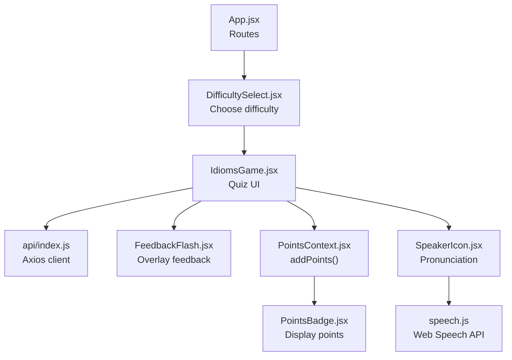
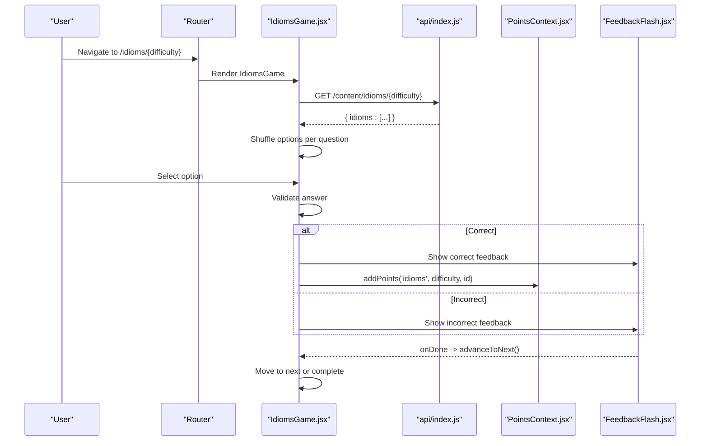
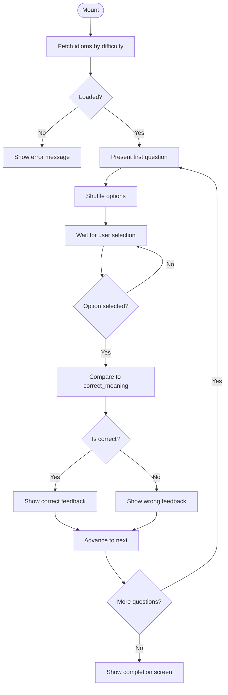
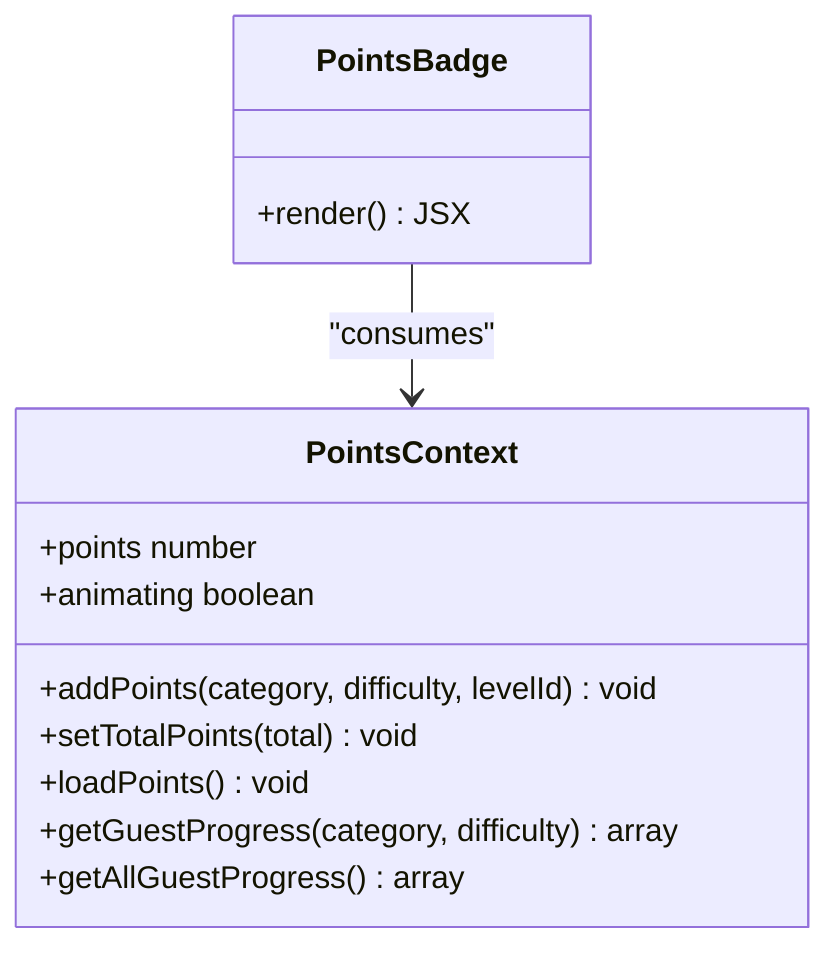
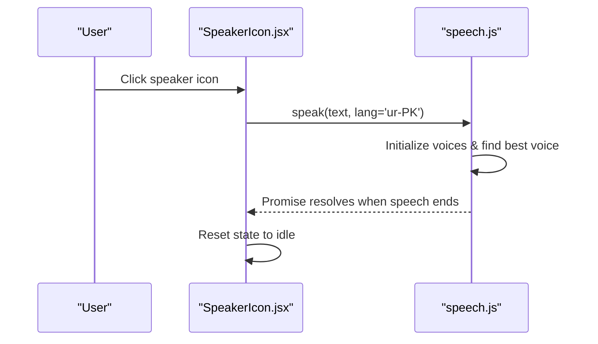
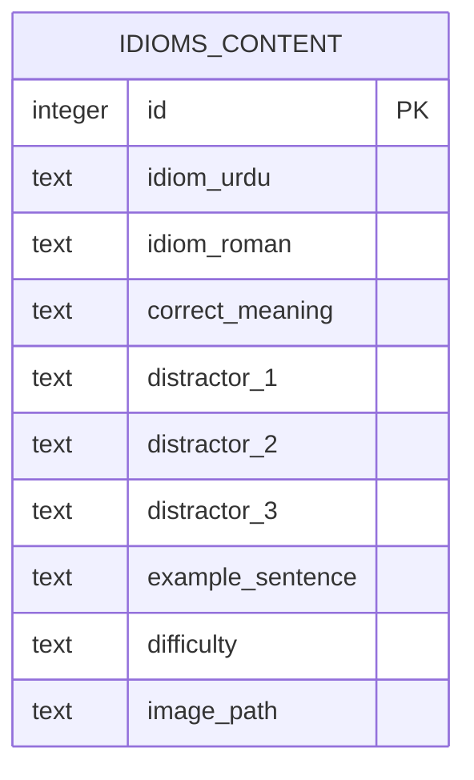
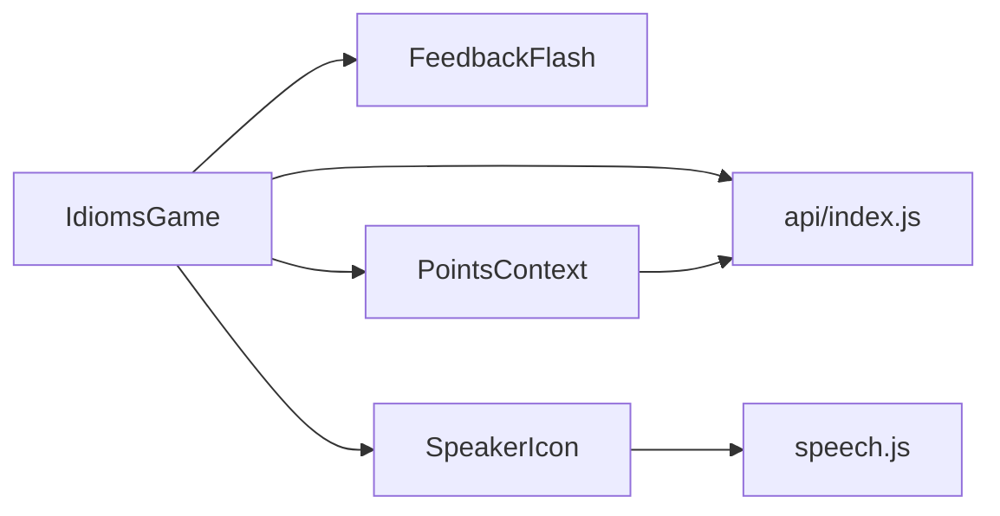

# Idioms Game Module

<cite>
**Referenced Files in This Document**
- [IdiomsGame.jsx](file://zabandaan/client/src/pages/idioms/IdiomsGame.jsx)
- [FeedbackFlash.jsx](file://zabandaan/client/src/components/FeedbackFlash.jsx)
- [PointsContext.jsx](file://zabandaan/client/src/context/PointsContext.jsx)
- [PointsBadge.jsx](file://zabandaan/client/src/components/PointsBadge.jsx)
- [SpeakerIcon.jsx](file://zabandaan/client/src/components/SpeakerIcon.jsx)
- [speech.js](file://zabandaan/client/src/utils/speech.js)
- [schema.sql](file://zabandaan/database/schema.sql)
- [api/index.js](file://zabandaan/client/src/api/index.js)
- [DifficultySelect.jsx](file://zabandaan/client/src/pages/DifficultySelect.jsx)
- [App.jsx](file://zabandaan/client/src/App.jsx)
</cite>

## Table of Contents
1. [Introduction](#introduction)
2. [Project Structure](#project-structure)
3. [Core Components](#core-components)
4. [Architecture Overview](#architecture-overview)
5. [Detailed Component Analysis](#detailed-component-analysis)
6. [Dependency Analysis](#dependency-analysis)
7. [Performance Considerations](#performance-considerations)
8. [Troubleshooting Guide](#troubleshooting-guide)
9. [Conclusion](#conclusion)

## Introduction
This document explains the idioms game module’s quiz system architecture, content management, and cultural context integration. It covers how multiple-choice questions are presented, how difficulty-based progression works, and how scoring and progress tracking integrate with the points system. It also documents the idiom data model, visual associations (images), audio pronunciation support, and common issues such as content loading, answer randomization, and feedback timing. The goal is to make this accessible to beginners while providing enough technical depth for experienced developers building similar educational games.

## Project Structure
The idioms game module is a React-based feature within the client application. It uses routing to select difficulty levels, fetches idiom content from an API, presents multiple-choice questions, provides immediate feedback, and updates user progress via a shared points context.

**Diagram sources**
- [App.jsx:1-42](file://zabandaan/client/src/App.jsx#L1-L42)
- [DifficultySelect.jsx:1-124](file://zabandaan/client/src/pages/DifficultySelect.jsx#L1-L124)
- [IdiomsGame.jsx:1-446](file://zabandaan/client/src/pages/idioms/IdiomsGame.jsx#L1-L446)
- [api/index.js:1-30](file://zabandaan/client/src/api/index.js#L1-L30)
- [FeedbackFlash.jsx:1-49](file://zabandaan/client/src/components/FeedbackFlash.jsx#L1-L49)
- [PointsContext.jsx:1-114](file://zabandaan/client/src/context/PointsContext.jsx#L1-L114)
- [PointsBadge.jsx:1-24](file://zabandaan/client/src/components/PointsBadge.jsx#L1-L24)
- [SpeakerIcon.jsx:1-67](file://zabandaan/client/src/components/SpeakerIcon.jsx#L1-L67)
- [speech.js:1-140](file://zabandaan/client/src/utils/speech.js#L1-L140)

**Section sources**
- [App.jsx:1-42](file://zabandaan/client/src/App.jsx#L1-L42)
- [DifficultySelect.jsx:1-124](file://zabandaan/client/src/pages/DifficultySelect.jsx#L1-L124)
- [IdiomsGame.jsx:1-446](file://zabandaan/client/src/pages/idioms/IdiomsGame.jsx#L1-L446)

## Core Components
- Quiz UI and flow: IdiomsGame handles fetching content by difficulty, rendering question cards, shuffling options, validating answers, showing feedback, and advancing through the quiz.
- Feedback overlay: FeedbackFlash displays correct/wrong feedback with a timed transition and triggers next-step actions.
- Points and progress: PointsContext manages adding points (server or local storage for guests), animating point changes, and retrieving totals.
- Audio pronunciation: SpeakerIcon integrates speech synthesis to pronounce Urdu text, with voice selection and cancellation support.
- Routing and navigation: DifficultySelect routes users to easy/hard modes; App.jsx defines protected routes and page composition.

**Section sources**
- [IdiomsGame.jsx:18-103](file://zabandaan/client/src/pages/idioms/IdiomsGame.jsx#L18-L103)
- [FeedbackFlash.jsx:1-49](file://zabandaan/client/src/components/FeedbackFlash.jsx#L1-L49)
- [PointsContext.jsx:7-114](file://zabandaan/client/src/context/PointsContext.jsx#L7-L114)
- [SpeakerIcon.jsx:1-67](file://zabandaan/client/src/components/SpeakerIcon.jsx#L1-L67)
- [DifficultySelect.jsx:1-124](file://zabandaan/client/src/pages/DifficultySelect.jsx#L1-L124)
- [App.jsx:1-42](file://zabandaan/client/src/App.jsx#L1-L42)

## Architecture Overview
The idioms quiz follows a clear request-response-feedback loop:
- On mount, the quiz loads idiom content filtered by difficulty via the API.
- For each question, options are shuffled to prevent predictable ordering.
- User selection triggers validation and feedback display.
- Correct answers update points via the points context (server-synced for logged-in users, local storage for guests).
- After feedback, the quiz advances to the next question or completion screen.

**Diagram sources**
- [IdiomsGame.jsx:31-103](file://zabandaan/client/src/pages/idioms/IdiomsGame.jsx#L31-L103)
- [api/index.js:1-30](file://zabandaan/client/src/api/index.js#L1-L30)
- [PointsContext.jsx:12-46](file://zabandaan/client/src/context/PointsContext.jsx#L12-L46)
- [FeedbackFlash.jsx:1-49](file://zabandaan/client/src/components/FeedbackFlash.jsx#L1-L49)

## Detailed Component Analysis

### IdiomsGame: Quiz Interface and Flow
- Content loading: Fetches idioms by difficulty using the API client. Handles loading and error states.
- Question presentation: Displays Urdu text, Roman transliteration, example sentence, optional image, and a prompt asking for meaning.
- Answer randomization: Shuffles the correct meaning and three distractors into randomized order for each question.
- Validation and feedback: Compares selected option to the correct meaning, sets feedback state, and triggers the feedback overlay.
- Progression: Advances to the next question after feedback completes; shows a completion screen when all questions are answered.
- Scoring integration: Calls addPoints for correct answers with category, difficulty, and level id.

**Diagram sources**
- [IdiomsGame.jsx:31-103](file://zabandaan/client/src/pages/idioms/IdiomsGame.jsx#L31-L103)
- [IdiomsGame.jsx:131-150](file://zabandaan/client/src/pages/idioms/IdiomsGame.jsx#L131-L150)

**Section sources**
- [IdiomsGame.jsx:31-103](file://zabandaan/client/src/pages/idioms/IdiomsGame.jsx#L31-L103)
- [IdiomsGame.jsx:152-260](file://zabandaan/client/src/pages/idioms/IdiomsGame.jsx#L152-L260)

### FeedbackFlash: Timed Feedback Overlay
- Displays a full-screen overlay with correct or incorrect indicators.
- Uses a configurable duration to auto-dismiss and call back to the parent component to proceed.
- Prevents interaction during feedback via pointer-events styling.

**Section sources**
- [FeedbackFlash.jsx:1-49](file://zabandaan/client/src/components/FeedbackFlash.jsx#L1-L49)

### PointsContext: Scoring and Progress Tracking
- Adds points for correct answers:
  - For authenticated users, posts to the server endpoint and updates local state based on response.
  - For guest users, tracks completed levels locally under keys like guest_progress_category_difficulty.
- Animates point increases for better UX.
- Provides utilities to load total points and retrieve guest progress arrays.

**Diagram sources**
- [PointsContext.jsx:7-114](file://zabandaan/client/src/context/PointsContext.jsx#L7-L114)
- [PointsBadge.jsx:1-24](file://zabandaan/client/src/components/PointsBadge.jsx#L1-L24)

**Section sources**
- [PointsContext.jsx:12-46](file://zabandaan/client/src/context/PointsContext.jsx#L12-L46)
- [PointsContext.jsx:52-100](file://zabandaan/client/src/context/PointsContext.jsx#L52-L100)
- [PointsBadge.jsx:1-24](file://zabandaan/client/src/components/PointsBadge.jsx#L1-L24)

### SpeakerIcon and Speech: Cultural Context Integration
- Pronunciation support for Urdu text enhances cultural immersion.
- Uses Web Speech API with voice discovery and fallback strategies.
- Cancels ongoing speech to avoid overlap and resets state appropriately.

**Diagram sources**
- [SpeakerIcon.jsx:1-67](file://zabandaan/client/src/components/SpeakerIcon.jsx#L1-L67)
- [speech.js:1-140](file://zabandaan/client/src/utils/speech.js#L1-L140)

**Section sources**
- [SpeakerIcon.jsx:1-67](file://zabandaan/client/src/components/SpeakerIcon.jsx#L1-L67)
- [speech.js:1-140](file://zabandaan/client/src/utils/speech.js#L1-L140)

### Data Model: Idiom Content Schema
The backend schema defines the structure of idiom content used by the quiz:
- Fields include Urdu text, Roman transliteration, correct meaning, three distractors, example sentence, difficulty, and optional image path.
- Indexed by difficulty for efficient retrieval.

**Diagram sources**
- [schema.sql:20-31](file://zabandaan/database/schema.sql#L20-L31)

**Section sources**
- [schema.sql:20-31](file://zabandaan/database/schema.sql#L20-L31)

### Visual Association Features
- Each idiom can include an image_path that is displayed above the Urdu text to reinforce meaning through visuals.
- Images are rendered conditionally if present, improving engagement and aiding comprehension.

**Section sources**
- [IdiomsGame.jsx:182-192](file://zabandaan/client/src/pages/idioms/IdiomsGame.jsx#L182-L192)
- [schema.sql:20-31](file://zabandaan/database/schema.sql#L20-L31)

### Difficulty-Based Progression
- Users choose between easy and hard modes via DifficultySelect, which navigates to /idioms/{easy|hard}.
- The quiz fetches content filtered by the selected difficulty parameter.
- Progression is linear within a session: one question at a time until completion.

**Section sources**
- [DifficultySelect.jsx:1-124](file://zabandaan/client/src/pages/DifficultySelect.jsx#L1-L124)
- [IdiomsGame.jsx:31-50](file://zabandaan/client/src/pages/idioms/IdiomsGame.jsx#L31-L50)

### API Integration and Authentication
- The Axios client attaches Authorization headers for authenticated requests and clears tokens on 401 responses.
- The quiz calls GET /content/idioms/{difficulty} to load questions.

**Section sources**
- [api/index.js:1-30](file://zabandaan/client/src/api/index.js#L1-L30)
- [IdiomsGame.jsx:31-50](file://zabandaan/client/src/pages/idioms/IdiomsGame.jsx#L31-L50)

## Dependency Analysis
- IdiomsGame depends on:
  - api/index.js for network requests
  - FeedbackFlash for feedback overlay
  - PointsContext for scoring and progress
  - SpeakerIcon for pronunciation
- PointsContext depends on AuthContext (via useAuth) and api/index.js for server sync.
- SpeakerIcon depends on speech.js for Web Speech API interactions.

**Diagram sources**
- [IdiomsGame.jsx:1-103](file://zabandaan/client/src/pages/idioms/IdiomsGame.jsx#L1-L103)
- [api/index.js:1-30](file://zabandaan/client/src/api/index.js#L1-L30)
- [PointsContext.jsx:1-114](file://zabandaan/client/src/context/PointsContext.jsx#L1-L114)
- [SpeakerIcon.jsx:1-67](file://zabandaan/client/src/components/SpeakerIcon.jsx#L1-L67)
- [speech.js:1-140](file://zabandaan/client/src/utils/speech.js#L1-L140)

**Section sources**
- [IdiomsGame.jsx:1-103](file://zabandaan/client/src/pages/idioms/IdiomsGame.jsx#L1-L103)
- [PointsContext.jsx:1-114](file://zabandaan/client/src/context/PointsContext.jsx#L1-L114)
- [SpeakerIcon.jsx:1-67](file://zabandaan/client/src/components/SpeakerIcon.jsx#L1-L67)
- [speech.js:1-140](file://zabandaan/client/src/utils/speech.js#L1-L140)
- [api/index.js:1-30](file://zabandaan/client/src/api/index.js#L1-L30)

## Performance Considerations
- Option shuffling occurs per question change; ensure idioms arrays are stable to avoid unnecessary re-renders.
- Feedback duration should balance clarity and pacing; too short may confuse users, too long slows progression.
- Network requests are single-fetch per difficulty; consider caching strategies if content is large or frequently accessed.
- Speech synthesis initialization is asynchronous; ensure voice availability before playback to reduce latency.

[No sources needed since this section provides general guidance]

## Troubleshooting Guide
Common issues and resolutions:
- Content loading failures:
  - Symptoms: Error message shown; quiz does not render questions.
  - Causes: Network errors, invalid difficulty route, or missing content.
  - Resolution: Check API connectivity, verify difficulty parameter, and confirm content exists for the selected difficulty.
- Answer randomization problems:
  - Symptoms: Same option order across sessions or repeated patterns.
  - Causes: Inconsistent shuffle implementation or state not resetting per question.
  - Resolution: Ensure options are rebuilt whenever currentIndex changes and that the shuffle function is applied consistently.
- Feedback timing issues:
  - Symptoms: Rapid transitions or delayed advancement.
  - Causes: Feedback duration misconfiguration or callback not invoked.
  - Resolution: Verify FeedbackFlash duration and ensure onDone is called after dismissal.
- Points not updating:
  - Symptoms: Points remain unchanged after correct answers.
  - Causes: Guest mode vs. authenticated mode differences, server errors, or duplicate level IDs.
  - Resolution: Confirm addPoints is called with correct parameters; check localStorage for guest mode and server responses for authenticated users.
- Pronunciation not playing:
  - Symptoms: No audio when clicking speaker icon.
  - Causes: Browser lacks speech synthesis or required voices; permissions blocked.
  - Resolution: Ensure voices are loaded; handle fallback gracefully; check browser permissions.

**Section sources**
- [IdiomsGame.jsx:31-50](file://zabandaan/client/src/pages/idioms/IdiomsGame.jsx#L31-L50)
- [IdiomsGame.jsx:52-66](file://zabandaan/client/src/pages/idioms/IdiomsGame.jsx#L52-L66)
- [FeedbackFlash.jsx:1-49](file://zabandaan/client/src/components/FeedbackFlash.jsx#L1-L49)
- [PointsContext.jsx:12-46](file://zabandaan/client/src/context/PointsContext.jsx#L12-L46)
- [SpeakerIcon.jsx:1-67](file://zabandaan/client/src/components/SpeakerIcon.jsx#L1-L67)
- [speech.js:1-140](file://zabandaan/client/src/utils/speech.js#L1-L140)

## Conclusion
The idioms game module provides a robust, culturally rich quiz experience with clear architecture and modular components. It supports difficulty-based content, visual and audio enhancements, and integrated scoring with both server and local persistence. By understanding the data model, API interactions, and component relationships, developers can extend functionality, improve performance, and troubleshoot effectively. The design balances accessibility for beginners with sufficient technical depth for advanced customization.

[No sources needed since this section summarizes without analyzing specific files]