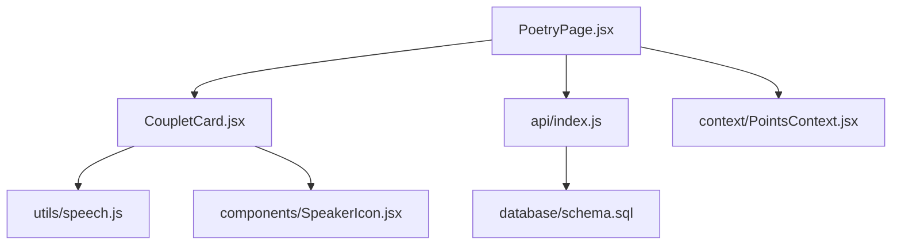
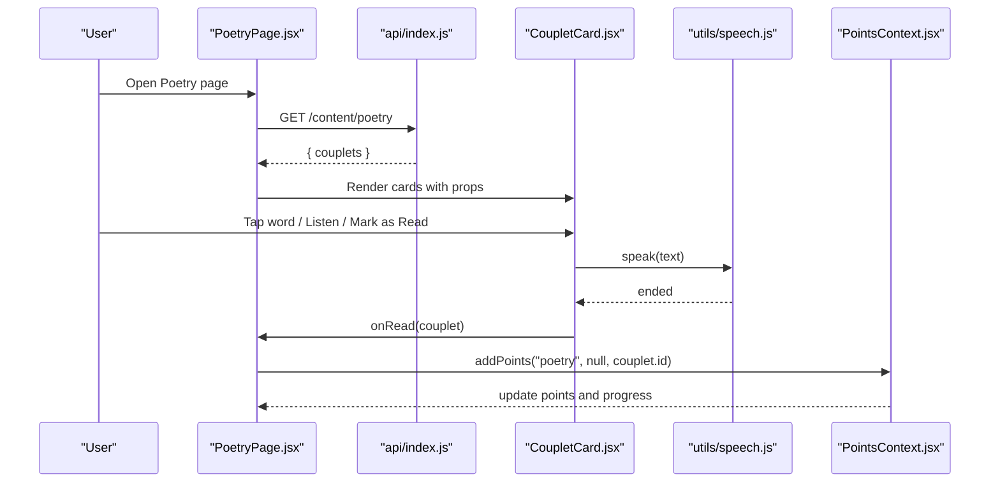
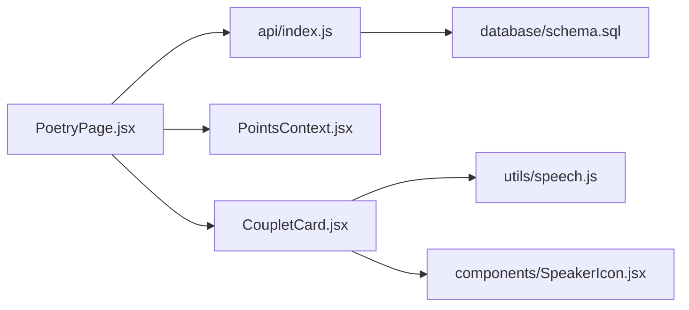

# Poetry Module

<cite>
**Referenced Files in This Document**
- [PoetryPage.jsx](file://zabandaan/client/src/pages/poetry/PoetryPage.jsx)
- [CoupletCard.jsx](file://zabandaan/client/src/pages/poetry/CoupletCard.jsx)
- [speech.js](file://zabandaan/client/src/utils/speech.js)
- [SpeakerIcon.jsx](file://zabandaan/client/src/components/SpeakerIcon.jsx)
- [index.js (API client)](file://zabandaan/client/src/api/index.js)
- [schema.sql](file://zabandaan/database/schema.sql)
- [PointsContext.jsx](file://zabandaan/client/src/context/PointsContext.jsx)
</cite>

## Table of Contents
1. Introduction
2. Project Structure
3. Core Components
4. Architecture Overview
5. Detailed Component Analysis
6. Dependency Analysis
7. Performance Considerations
8. Troubleshooting Guide
9. Conclusion
10. Appendices

## Introduction
This document explains the poetry module that presents classical Urdu poetry with word-by-word breakdowns, cultural context, and audio recitation. It covers how the PoetryPage component loads content, renders couplets, tracks reading progress, and integrates with audio features. It also documents the data format for poetry content, navigation patterns, accessibility considerations for Urdu text rendering, and common issues such as RTL display, font handling, and responsive design.

## Project Structure
The poetry feature is implemented on the client side using React components and utilities:
- PoetryPage: Loads poetry content from the backend API and manages reading progress state.
- CoupletCard: Renders a single couplet with Urdu text, transliteration, meaning, cultural explanation, interactive word breakdown, and audio controls.
- Speech utilities: Provide Web Speech API integration for Urdu pronunciation.
- SpeakerIcon: Reusable audio playback control used by the card.
- API client: Centralized HTTP client with auth token injection and error handling.
- Database schema: Defines the structure of poetry content stored server-side.
- Points context: Tracks user points and guest progress for completed items.

**Diagram sources**
- [PoetryPage.jsx:1-188](file://zabandaan/client/src/pages/poetry/PoetryPage.jsx#L1-L188)
- [CoupletCard.jsx:1-349](file://zabandaan/client/src/pages/poetry/CoupletCard.jsx#L1-L349)
- [speech.js:1-140](file://zabandaan/client/src/utils/speech.js#L1-L140)
- [SpeakerIcon.jsx:1-67](file://zabandaan/client/src/components/SpeakerIcon.jsx#L1-L67)
- [index.js (API client):1-30](file://zabandaan/client/src/api/index.js#L1-L30)
- [schema.sql:40-49](file://zabandaan/database/schema.sql#L40-L49)
- [PointsContext.jsx:1-114](file://zabandaan/client/src/context/PointsContext.jsx#L1-L114)

**Section sources**
- [PoetryPage.jsx:1-188](file://zabandaan/client/src/pages/poetry/PoetryPage.jsx#L1-L188)
- [CoupletCard.jsx:1-349](file://zabandaan/client/src/pages/poetry/CoupletCard.jsx#L1-L349)
- [speech.js:1-140](file://zabandaan/client/src/utils/speech.js#L1-L140)
- [SpeakerIcon.jsx:1-67](file://zabandaan/client/src/components/SpeakerIcon.jsx#L1-L67)
- [index.js (API client):1-30](file://zabandaan/client/src/api/index.js#L1-L30)
- [schema.sql:40-49](file://zabandaan/database/schema.sql#L40-L49)
- [PointsContext.jsx:1-114](file://zabandaan/client/src/context/PointsContext.jsx#L1-L114)

## Core Components
- PoetryPage
  - Fetches poetry content via GET /content/poetry.
  - Manages local state for loading, errors, and read IDs.
  - Displays a header with title, subtitle, and a progress bar showing number of couplets read vs total.
  - Renders a list of CoupletCard components, passing each couplet and callbacks for marking as read.
- CoupletCard
  - Displays poet name and optional poem title.
  - Shows full Urdu couplet with proper RTL styling and large font.
  - Provides Roman transliteration.
  - Offers an “Listen to Full Couplet” button using speech utilities.
  - Presents English meaning and optional Urdu tashri (cultural explanation).
  - Implements interactive word-by-word breakdown: tapping a word highlights it and shows its meaning; each word has a speaker icon for pronunciation.
  - Includes a “Mark as Read” action that triggers point tracking.
- Speech Utilities and SpeakerIcon
  - speak() uses Web Speech API with voice selection prioritizing Urdu voices and fallbacks.
  - SpeakerIcon provides accessible play/stop controls with visual feedback.
- API Client
  - Axios instance with base URL /api and automatic Authorization header injection from localStorage.
  - Handles 401 responses by clearing auth tokens.
- Points Context
  - addPoints(category, difficulty, levelId) records completion per item and updates points locally or via server depending on user state.
  - Supports guest mode with localStorage-based progress.

**Section sources**
- [PoetryPage.jsx:15-38](file://zabandaan/client/src/pages/poetry/PoetryPage.jsx#L15-L38)
- [PoetryPage.jsx:65-112](file://zabandaan/client/src/pages/poetry/PoetryPage.jsx#L65-L112)
- [CoupletCard.jsx:5-147](file://zabandaan/client/src/pages/poetry/CoupletCard.jsx#L5-L147)
- [speech.js:90-125](file://zabandaan/client/src/utils/speech.js#L90-L125)
- [SpeakerIcon.jsx:4-66](file://zabandaan/client/src/components/SpeakerIcon.jsx#L4-L66)
- [index.js (API client):3-27](file://zabandaan/client/src/api/index.js#L3-L27)
- [PointsContext.jsx:12-46](file://zabandaan/client/src/context/PointsContext.jsx#L12-L46)

## Architecture Overview
The module follows a unidirectional data flow:
- PoetryPage mounts and fetches poetry content from the backend.
- Content is rendered as a list of CoupletCard components.
- User interactions (word taps, listen actions, mark-as-read) trigger localized state updates and/or API calls.
- Reading progress is tracked locally in PoetryPage and persisted via PointsContext.

**Diagram sources**
- [PoetryPage.jsx:15-38](file://zabandaan/client/src/pages/poetry/PoetryPage.jsx#L15-L38)
- [PoetryPage.jsx:65-112](file://zabandaan/client/src/pages/poetry/PoetryPage.jsx#L65-L112)
- [CoupletCard.jsx:17-27](file://zabandaan/client/src/pages/poetry/CoupletCard.jsx#L17-L27)
- [speech.js:90-125](file://zabandaan/client/src/utils/speech.js#L90-L125)
- [PointsContext.jsx:12-46](file://zabandaan/client/src/context/PointsContext.jsx#L12-L46)

## Detailed Component Analysis

### PoetryPage
Responsibilities:
- Data fetching: Calls GET /content/poetry and sets couplets array.
- State management: Tracks loading, error, and readIds (Set of completed couplet ids).
- Progress visualization: Computes percentage based on readIds.size vs couplets.length.
- Rendering: Displays header, stats bar, and a vertical list of CoupletCard components.

Key behaviors:
- handleRead prevents duplicate reads and increments points via PointsContext.
- Error and empty states are handled gracefully with user-friendly messages.

Accessibility notes:
- Uses semantic headings and descriptive text for context.
- Progress bar communicates completion visually; consider adding aria attributes for screen readers in future enhancements.

**Section sources**
- [PoetryPage.jsx:15-38](file://zabandaan/client/src/pages/poetry/PoetryPage.jsx#L15-L38)
- [PoetryPage.jsx:65-112](file://zabandaan/client/src/pages/poetry/PoetryPage.jsx#L65-L112)
- [PoetryPage.jsx:115-188](file://zabandaan/client/src/pages/poetry/PoetryPage.jsx#L115-L188)

### CoupletCard
Responsibilities:
- Display: Poet name, optional poem title, full Urdu couplet, Roman transliteration, English meaning, and tashri.
- Interaction: Word-by-word breakdown with tap-to-highlight and pronunciation per word.
- Audio: “Listen to Full Couplet” button using speech utilities.
- Progress: “Mark as Read” triggers parent callback to record completion.

Data usage:
- couplet.couplet_urdu: Multi-line Urdu text displayed with RTL alignment and appropriate fonts.
- couplet.couplet_roman: Transliteration shown line-separated.
- couplet.word_breakdown: Array of objects containing word_urdu, word_meaning, and optionally word_roman.
- couplet.overall_meaning: English paraphrase.
- couplet.tashri: Optional Urdu cultural explanation.

Styling and RTL:
- Uses direction: rtl and textAlign: right for Urdu sections.
- Font stack includes Noto Nastaliq Urdu and Jameel Noori Nastaleeq for proper Urdu script rendering.

Audio integration:
- Integrates with speak() for full couplet and per-word pronunciation.
- Uses SpeakerIcon for consistent UI and accessibility labels.

Progress tracking:
- onRead(couplet) called when user marks as read; PoetryPage updates readIds and adds points.

**Section sources**
- [CoupletCard.jsx:5-147](file://zabandaan/client/src/pages/poetry/CoupletCard.jsx#L5-L147)
- [CoupletCard.jsx:150-349](file://zabandaan/client/src/pages/poetry/CoupletCard.jsx#L150-L349)

### Speech Integration
Capabilities:
- Initializes voices asynchronously and caches them.
- Finds best available voice prioritizing Urdu, then Hindi, then Arabic, then any available voice.
- speak() returns a promise resolving when speech ends or fails.

Usage in poetry:
- Full couplet listening via CoupletCard’s listen button.
- Per-word pronunciation via SpeakerIcon embedded next to each word in the breakdown.

Accessibility:
- SpeakerIcon includes aria-label for screen readers.
- Rate and pitch tuned for clarity.

**Section sources**
- [speech.js:1-140](file://zabandaan/client/src/utils/speech.js#L1-L140)
- [SpeakerIcon.jsx:4-66](file://zabandaan/client/src/components/SpeakerIcon.jsx#L4-L66)

### API and Data Flow
- PoetryPage calls GET /content/poetry and expects response shape { couplets }.
- Each couplet object aligns with database schema fields: id, couplet_urdu, couplet_roman, poet_name, poem_title, word_breakdown, overall_meaning, tashri.
- API client injects Authorization headers from localStorage and handles 401 by clearing tokens.

**Section sources**
- [PoetryPage.jsx:15-32](file://zabandaan/client/src/pages/poetry/PoetryPage.jsx#L15-L32)
- [index.js (API client):3-27](file://zabandaan/client/src/api/index.js#L3-L27)
- [schema.sql:40-49](file://zabandaan/database/schema.sql#L40-L49)

### Points and Progress Tracking
- PoetryPage maintains readIds set to track which couplets have been marked as read during the session.
- When a couplet is marked as read, addPoints('poetry', null, couplet.id) is invoked.
- PointsContext supports both logged-in users (server persistence) and guests (localStorage), ensuring progress continuity.

**Section sources**
- [PoetryPage.jsx:34-38](file://zabandaan/client/src/pages/poetry/PoetryPage.jsx#L34-L38)
- [PointsContext.jsx:12-46](file://zabandaan/client/src/context/PointsContext.jsx#L12-L46)

## Dependency Analysis

**Diagram sources**
- [PoetryPage.jsx:1-188](file://zabandaan/client/src/pages/poetry/PoetryPage.jsx#L1-L188)
- [CoupletCard.jsx:1-349](file://zabandaan/client/src/pages/poetry/CoupletCard.jsx#L1-L349)
- [speech.js:1-140](file://zabandaan/client/src/utils/speech.js#L1-L140)
- [SpeakerIcon.jsx:1-67](file://zabandaan/client/src/components/SpeakerIcon.jsx#L1-L67)
- [index.js (API client):1-30](file://zabandaan/client/src/api/index.js#L1-L30)
- [schema.sql:40-49](file://zabandaan/database/schema.sql#L40-L49)
- [PointsContext.jsx:1-114](file://zabandaan/client/src/context/PointsContext.jsx#L1-L114)

**Section sources**
- [PoetryPage.jsx:1-188](file://zabandaan/client/src/pages/poetry/PoetryPage.jsx#L1-L188)
- [CoupletCard.jsx:1-349](file://zabandaan/client/src/pages/poetry/CoupletCard.jsx#L1-L349)
- [speech.js:1-140](file://zabandaan/client/src/utils/speech.js#L1-L140)
- [SpeakerIcon.jsx:1-67](file://zabandaan/client/src/components/SpeakerIcon.jsx#L1-L67)
- [index.js (API client):1-30](file://zabandaan/client/src/api/index.js#L1-L30)
- [schema.sql:40-49](file://zabandaan/database/schema.sql#L40-L49)
- [PointsContext.jsx:1-114](file://zabandaan/client/src/context/PointsContext.jsx#L1-L114)

## Performance Considerations
- Avoid re-rendering entire lists: PoetryPage maps over couplets and passes stable props; ensure keys are unique (couplet.id).
- Debounce or throttle repeated speech requests if needed; current implementation cancels ongoing speech before starting new utterances.
- Minimize DOM operations: Word breakdown uses inline spans; consider virtualization if the number of words grows significantly.
- Font loading: Ensure Noto Nastaliq Urdu is available; lazy-load fonts if necessary to reduce initial load time.

[No sources needed since this section provides general guidance]

## Troubleshooting Guide
Common issues and resolutions:
- RTL text not rendering correctly
  - Ensure direction: rtl and textAlign: right are applied to Urdu sections.
  - Verify font stack includes Noto Nastaliq Urdu and Jameel Noori Nastaleeq.
  - Check CSS classes like urdu-text for global styles if present.
- Urdu font missing or garbled
  - Confirm font files are loaded and accessible.
  - Use system fallback fonts if custom fonts fail to load.
- Audio not playing
  - Verify browser supports Web Speech API and has Urdu voices installed.
  - Check permissions and ensure user gesture context is preserved (click handlers).
  - Inspect console for speech synthesis errors.
- Progress not updating
  - Confirm PoetryPage’s readIds state updates and addPoints is called.
  - For guest mode, verify localStorage entries under guest_progress_poetry.
  - For logged-in users, check network requests to /points endpoint.
- Responsive layout issues
  - Ensure container width constraints and flex layouts adapt to smaller screens.
  - Test on mobile devices for touch targets and readability.

**Section sources**
- [CoupletCard.jsx:178-190](file://zabandaan/client/src/pages/poetry/CoupletCard.jsx#L178-L190)
- [CoupletCard.jsx:235-256](file://zabandaan/client/src/pages/poetry/CoupletCard.jsx#L235-L256)
- [speech.js:90-125](file://zabandaan/client/src/utils/speech.js#L90-L125)
- [PointsContext.jsx:12-46](file://zabandaan/client/src/context/PointsContext.jsx#L12-L46)

## Conclusion
The poetry module delivers an engaging, accessible experience for learning classical Urdu poetry through interactive word-by-word breakdowns, cultural annotations, and audio recitations. PoetryPage orchestrates content loading and progress tracking, while CoupletCard focuses on presentation and interaction. The speech utilities provide robust pronunciation support, and the points context ensures persistent progress across sessions. With careful attention to RTL rendering, font handling, and responsive design, the module offers a solid foundation for literary content displays.

[No sources needed since this section summarizes without analyzing specific files]

## Appendices

### Poetry Data Format
Based on the database schema and component usage, each couplet object contains:
- id: Unique identifier for the couplet.
- couplet_urdu: Urdu text, potentially multi-line.
- couplet_roman: Roman transliteration, potentially multi-line.
- poet_name: Name of the poet.
- poem_title: Optional title of the poem.
- word_breakdown: Array of word objects with:
  - word_urdu: Urdu word.
  - word_meaning: English meaning.
  - word_roman: Optional transliteration.
- overall_meaning: English paraphrase of the couplet.
- tashri: Optional Urdu cultural explanation.

**Section sources**
- [schema.sql:40-49](file://zabandaan/database/schema.sql#L40-L49)
- [CoupletCard.jsx:29-87](file://zabandaan/client/src/pages/poetry/CoupletCard.jsx#L29-L87)

### Navigation Between Poems
- Current implementation renders all couplets in a vertical list within PoetryPage.
- Users can scroll to navigate between poems.
- Future enhancements could include pagination, search/filter by poet or theme, and deep linking to specific couplets.

[No sources needed since this section doesn't analyze specific files]

### Accessibility Considerations for Urdu Text Rendering
- Use semantic HTML elements (headings, paragraphs) for structure.
- Apply ARIA labels to audio controls (already present in SpeakerIcon).
- Ensure sufficient color contrast for highlighted words and meanings.
- Provide keyboard navigation for word selection and audio controls.
- Consider screen reader announcements for progress updates.

**Section sources**
- [SpeakerIcon.jsx:44-66](file://zabandaan/client/src/components/SpeakerIcon.jsx#L44-L66)
- [CoupletCard.jsx:90-133](file://zabandaan/client/src/pages/poetry/CoupletCard.jsx#L90-L133)