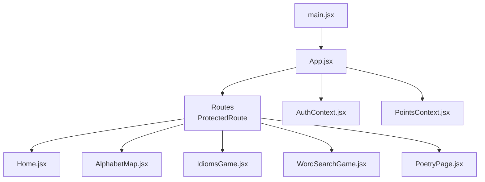
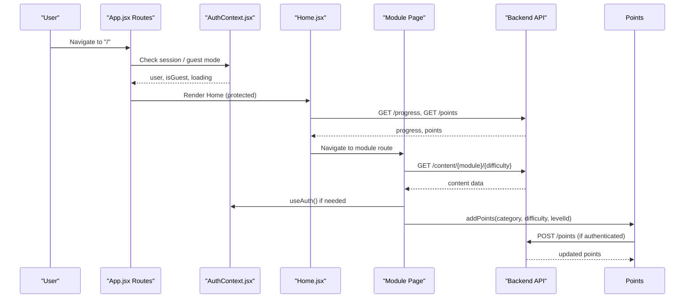
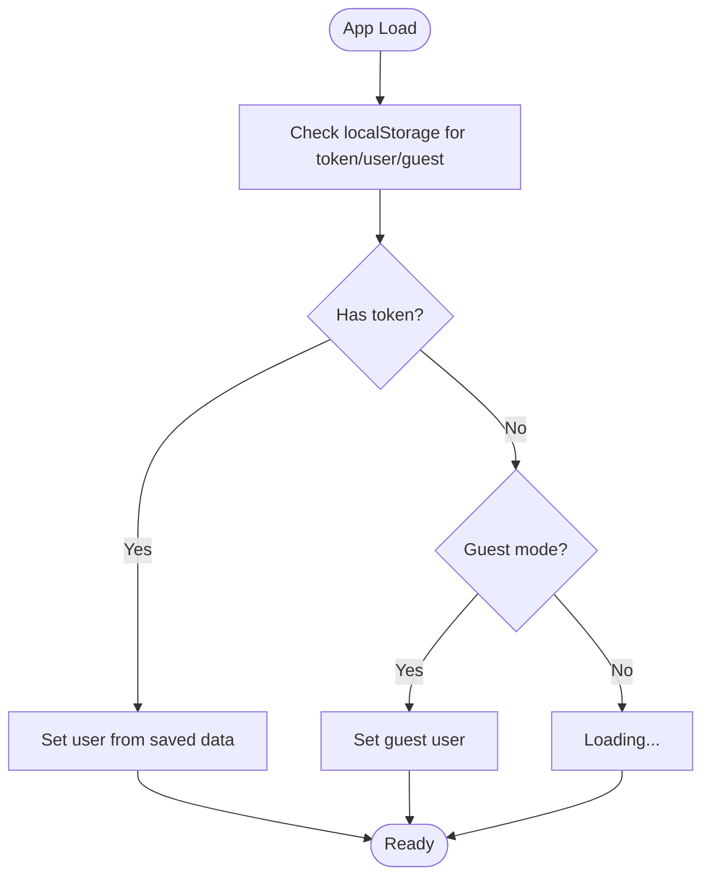
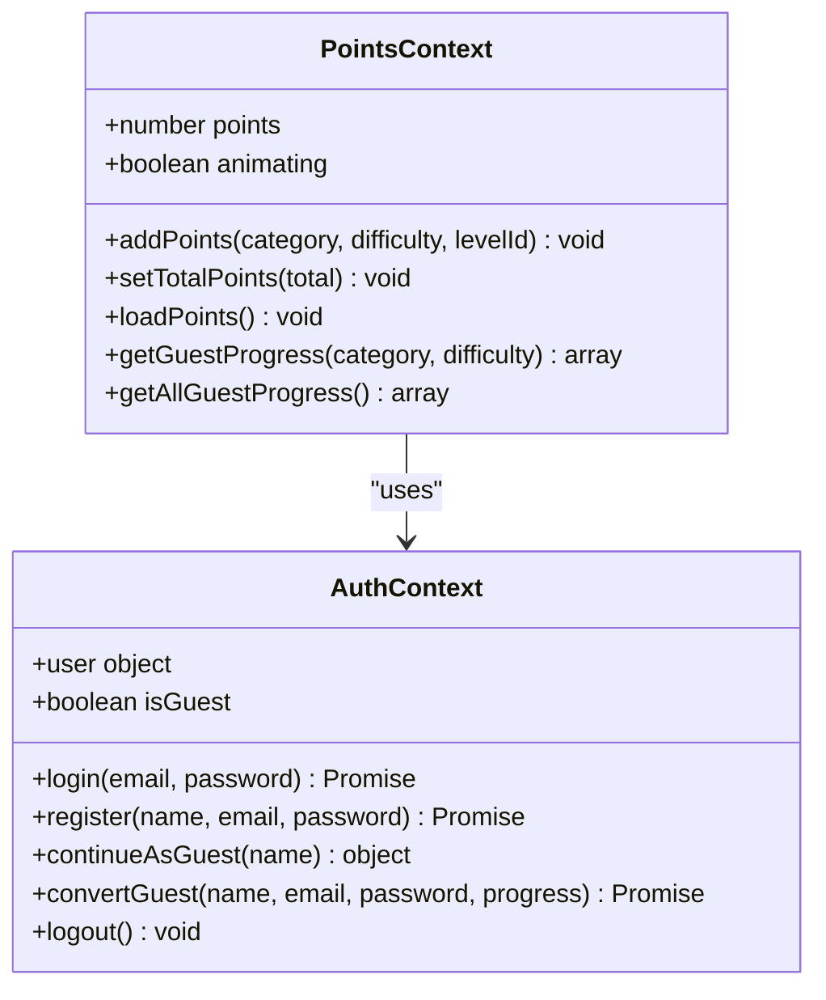
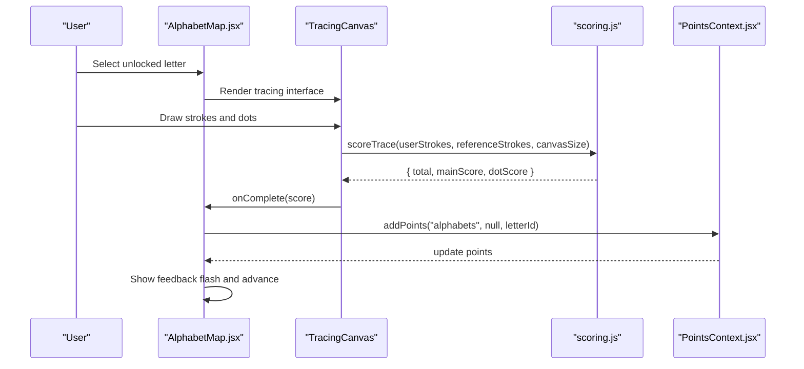
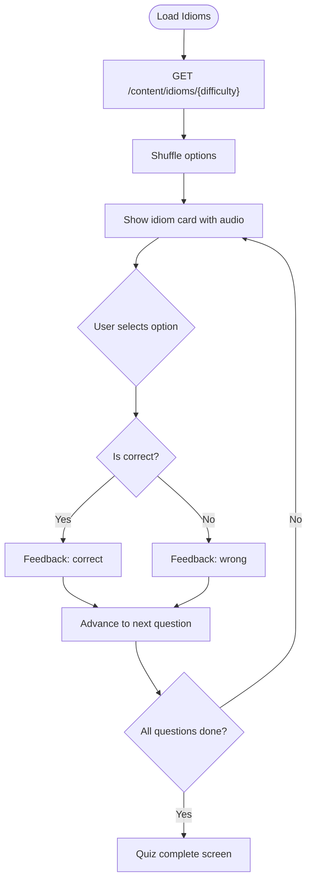
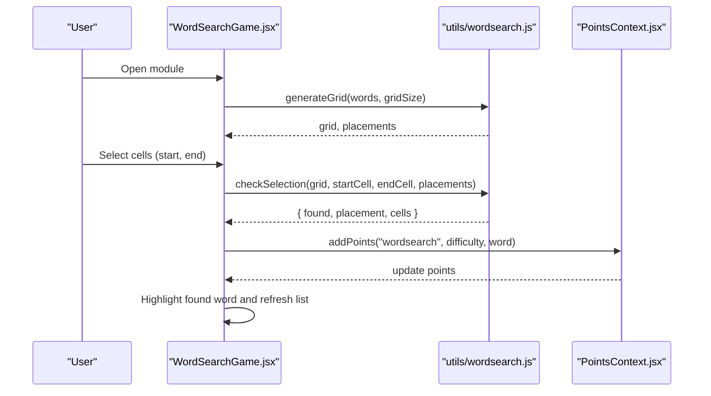
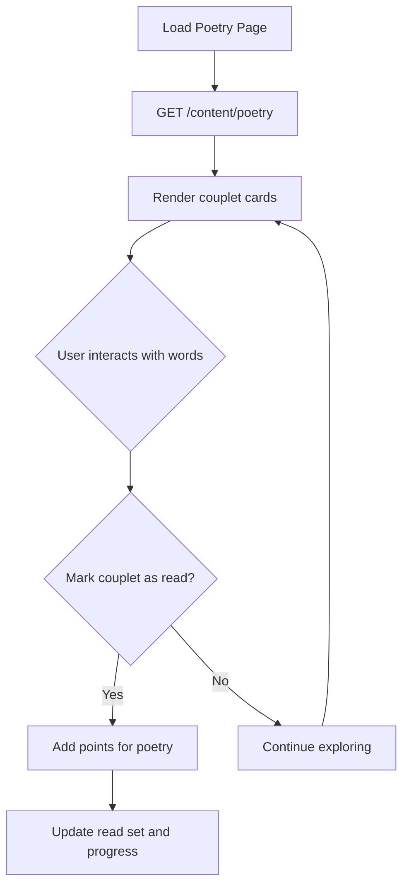
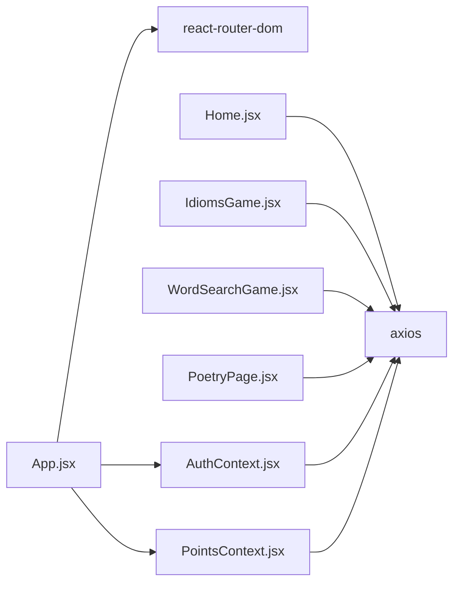

# Project Overview

<cite>
**Referenced Files in This Document**
- [App.jsx](file://zabandaan/client/src/App.jsx)
- [main.jsx](file://zabandaan/client/src/main.jsx)
- [package.json](file://zabandaan/client/package.json)
- [Home.jsx](file://zabandaan/client/src/pages/Home.jsx)
- [AuthContext.jsx](file://zabandaan/client/src/context/AuthContext.jsx)
- [PointsContext.jsx](file://zabandaan/client/src/context/PointsContext.jsx)
- [AlphabetMap.jsx](file://zabandaan/client/src/pages/alphabets/AlphabetMap.jsx)
- [IdiomsGame.jsx](file://zabandaan/client/src/pages/idioms/IdiomsGame.jsx)
- [WordSearchGame.jsx](file://zabandaan/client/src/pages/wordsearch/WordSearchGame.jsx)
- [PoetryPage.jsx](file://zabandaan/client/src/pages/poetry/PoetryPage.jsx)
- [scoring.js](file://zabandaan/client/src/utils/scoring.js)
- [schema.sql](file://zabandaan/database/schema.sql)
</cite>

## Table of Contents
1. [Introduction](#introduction)
2. [Project Structure](#project-structure)
3. [Core Components](#core-components)
4. [Architecture Overview](#architecture-overview)
5. [Detailed Component Analysis](#detailed-component-analysis)
6. [Dependency Analysis](#dependency-analysis)
7. [Performance Considerations](#performance-considerations)
8. [Troubleshooting Guide](#troubleshooting-guide)
9. [Conclusion](#conclusion)

## Introduction
Zabandaan is an interactive Urdu language learning platform that gamifies acquisition through multiple learning modules: alphabet tracing, idiom quizzes, word search puzzles, and poetry appreciation. It combines engaging user experiences with structured progress tracking to help learners build vocabulary, reading comprehension, and cultural literacy in Urdu.

For beginners, the platform offers a friendly onboarding path: start with alphabet tracing to learn letter shapes and sounds, then explore idioms to understand common expressions, practice vocabulary with word search, and deepen cultural understanding through poetry. For experienced developers, Zabandaan is built on a modern React web stack with client-side state management, routing, and clear integration points for backend services.

Key educational value examples:
- Alphabet tracing provides interactive tracing with feedback, unlocking subsequent letters as users complete each level.
- Idiom quizzes present Urdu idioms with audio support and example sentences, reinforcing meaning through context.
- Word search puzzles reinforce vocabulary by having users find words in a grid, with immediate feedback and pronunciation support.
- Poetry exploration encourages reading and comprehension with word-level breakdowns and progress tracking.

## Project Structure
The application is a React-based single-page application using Vite for development and build tooling. The entry point renders the root component, which configures routing, authentication context, and points context. Pages are organized by feature (home, alphabets, idioms, word search, poetry), with shared contexts for authentication and gamification.

**Diagram sources**
- [main.jsx:1-10](file://zabandaan/client/src/main.jsx#L1-L10)
- [App.jsx:1-66](file://zabandaan/client/src/App.jsx#L1-L66)

**Section sources**
- [main.jsx:1-10](file://zabandaan/client/src/main.jsx#L1-L10)
- [App.jsx:1-66](file://zabandaan/client/src/App.jsx#L1-L66)
- [package.json:1-22](file://zabandaan/client/package.json#L1-L22)

## Core Components
- Authentication and Guest Mode: Users can register, log in, or continue as guests. Guest mode persists progress locally until conversion to a registered account.
- Points and Progress Tracking: Points accumulate per completed activity; progress is stored locally for guests and server-side for authenticated users.
- Learning Modules:
  - Alphabets: Interactive tracing with scoring and unlock progression.
  - Idioms: Multiple-choice quizzes with shuffled options and feedback.
  - Word Search: Grid generation and selection validation with difficulty scaling.
  - Poetry: Couplet exploration with read tracking and word-level interactions.

These components integrate via React contexts and API calls, providing consistent UX across modules.

**Section sources**
- [AuthContext.jsx:1-97](file://zabandaan/client/src/context/AuthContext.jsx#L1-L97)
- [PointsContext.jsx:1-114](file://zabandaan/client/src/context/PointsContext.jsx#L1-L114)
- [AlphabetMap.jsx:1-249](file://zabandaan/client/src/pages/alphabets/AlphabetMap.jsx#L1-L249)
- [IdiomsGame.jsx:1-446](file://zabandaan/client/src/pages/idioms/IdiomsGame.jsx#L1-L446)
- [WordSearchGame.jsx:1-395](file://zabandaan/client/src/pages/wordsearch/WordSearchGame.jsx#L1-L395)
- [PoetryPage.jsx:1-188](file://zabandaan/client/src/pages/poetry/PoetryPage.jsx#L1-L188)

## Architecture Overview
Zabandaan’s architecture centers around a React SPA with protected routes, context-driven state, and modular pages. The app initializes with providers for authentication and points, then renders routes guarded by a protected route component. Each module fetches content from backend endpoints and updates local/global state accordingly.

**Diagram sources**
- [App.jsx:14-51](file://zabandaan/client/src/App.jsx#L14-L51)
- [AuthContext.jsx:11-83](file://zabandaan/client/src/context/AuthContext.jsx#L11-L83)
- [Home.jsx:21-53](file://zabandaan/client/src/pages/Home.jsx#L21-L53)
- [IdiomsGame.jsx:31-49](file://zabandaan/client/src/pages/idioms/IdiomsGame.jsx#L31-L49)
- [PointsContext.jsx:12-46](file://zabandaan/client/src/context/PointsContext.jsx#L12-L46)

## Detailed Component Analysis

### Authentication System
- Supports login, registration, guest mode, and guest-to-user conversion.
- Persists tokens and user data in localStorage; resets on logout.
- Provides a hook for components to access current user and mode.

**Diagram sources**
- [AuthContext.jsx:11-29](file://zabandaan/client/src/context/AuthContext.jsx#L11-L29)

**Section sources**
- [AuthContext.jsx:31-83](file://zabandaan/client/src/context/AuthContext.jsx#L31-L83)

### Points and Gamification
- Tracks points per category and difficulty; supports both guest and authenticated flows.
- Animates point changes and prevents duplicate credit for the same level.
- Exposes methods to load points, add points, and retrieve guest progress.

**Diagram sources**
- [PointsContext.jsx:1-114](file://zabandaan/client/src/context/PointsContext.jsx#L1-L114)
- [AuthContext.jsx:1-97](file://zabandaan/client/src/context/AuthContext.jsx#L1-L97)

**Section sources**
- [PointsContext.jsx:12-75](file://zabandaan/client/src/context/PointsContext.jsx#L12-L75)

### Alphabet Tracing Module
- Displays a map of letters with unlock progression based on completion.
- Uses interactive canvas tracing with scoring against reference strokes and dot placement.
- Integrates audio playback and feedback flashes; advances automatically upon completion.

**Diagram sources**
- [AlphabetMap.jsx:43-67](file://zabandaan/client/src/pages/alphabets/AlphabetMap.jsx#L43-L67)
- [scoring.js:106-140](file://zabandaan/client/src/utils/scoring.js#L106-L140)
- [PointsContext.jsx:12-46](file://zabandaan/client/src/context/PointsContext.jsx#L12-L46)

**Section sources**
- [AlphabetMap.jsx:1-249](file://zabandaan/client/src/pages/alphabets/AlphabetMap.jsx#L1-L249)
- [scoring.js:1-151](file://zabandaan/client/src/utils/scoring.js#L1-L151)

### Idioms Quiz Module
- Fetches idioms by difficulty and presents them one at a time.
- Shuffles answer options and provides immediate feedback.
- Awards points for correct answers and tracks completion.

**Diagram sources**
- [IdiomsGame.jsx:31-93](file://zabandaan/client/src/pages/idioms/IdiomsGame.jsx#L31-L93)

**Section sources**
- [IdiomsGame.jsx:1-446](file://zabandaan/client/src/pages/idioms/IdiomsGame.jsx#L1-L446)

### Word Search Module
- Generates a grid with placed words based on difficulty.
- Validates selections against placements and highlights found words.
- Offers regeneration and celebration upon completion.

**Diagram sources**
- [WordSearchGame.jsx:26-77](file://zabandaan/client/src/pages/wordsearch/WordSearchGame.jsx#L26-L77)

**Section sources**
- [WordSearchGame.jsx:1-395](file://zabandaan/client/src/pages/wordsearch/WordSearchGame.jsx#L1-L395)

### Poetry Appreciation Module
- Loads couplets and tracks which have been read.
- Provides word-level interactions and progress indicators.
- Awards points when a couplet is marked as read.

**Diagram sources**
- [PoetryPage.jsx:15-38](file://zabandaan/client/src/pages/poetry/PoetryPage.jsx#L15-L38)

**Section sources**
- [PoetryPage.jsx:1-188](file://zabandaan/client/src/pages/poetry/PoetryPage.jsx#L1-L188)

## Dependency Analysis
The application relies on React, React Router, and Axios for HTTP requests. Contexts manage global state for authentication and points. Pages depend on these contexts and call backend endpoints for content and progress.

**Diagram sources**
- [App.jsx:1-12](file://zabandaan/client/src/App.jsx#L1-L12)
- [package.json:11-19](file://zabandaan/client/package.json#L11-L19)

**Section sources**
- [package.json:1-22](file://zabandaan/client/package.json#L1-L22)
- [App.jsx:1-66](file://zabandaan/client/src/App.jsx#L1-L66)

## Performance Considerations
- Client-side state minimizes unnecessary re-renders by leveraging React contexts and memoization where appropriate.
- Content fetching is performed on module mount with cancellation guards to avoid stale updates.
- Scoring algorithms resample paths to fixed sample counts for consistent performance during tracing evaluation.
- Local storage usage for guest mode reduces server load and improves responsiveness.

[No sources needed since this section provides general guidance]

## Troubleshooting Guide
Common issues and resolutions:
- Authentication failures: Ensure network connectivity and verify credentials; check localStorage for token persistence.
- Content loading errors: Retry fetching content; inspect console logs for endpoint responses.
- Points not updating: Confirm addPoints calls are triggered and backend endpoints respond correctly; verify guest vs authenticated flow.
- Tracing scoring anomalies: Validate canvas size and stroke data; ensure reference strokes are properly normalized.

**Section sources**
- [AuthContext.jsx:31-83](file://zabandaan/client/src/context/AuthContext.jsx#L31-L83)
- [IdiomsGame.jsx:31-49](file://zabandaan/client/src/pages/idioms/IdiomsGame.jsx#L31-L49)
- [WordSearchGame.jsx:26-49](file://zabandaan/client/src/pages/wordsearch/WordSearchGame.jsx#L26-L49)
- [PoetryPage.jsx:15-31](file://zabandaan/client/src/pages/poetry/PoetryPage.jsx#L15-L31)
- [scoring.js:106-140](file://zabandaan/client/src/utils/scoring.js#L106-L140)

## Conclusion
Zabandaan delivers a cohesive, gamified learning experience for Urdu language acquisition. Its modular design enables scalable expansion of learning activities while maintaining consistent user journeys and progress tracking. The combination of interactive tracing, quizzes, puzzles, and poetry exploration supports diverse learning styles and fosters sustained engagement.

[No sources needed since this section summarizes without analyzing specific files]