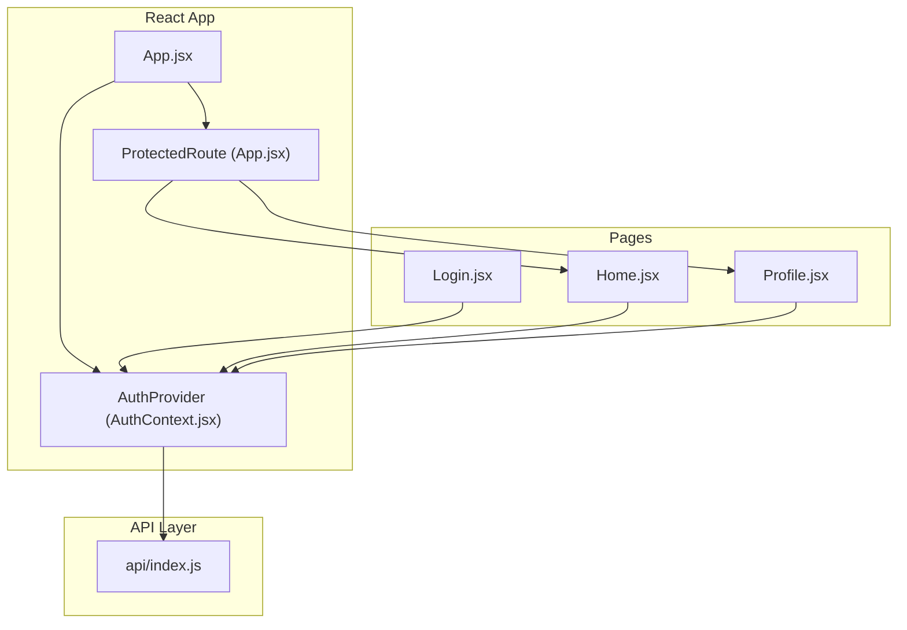
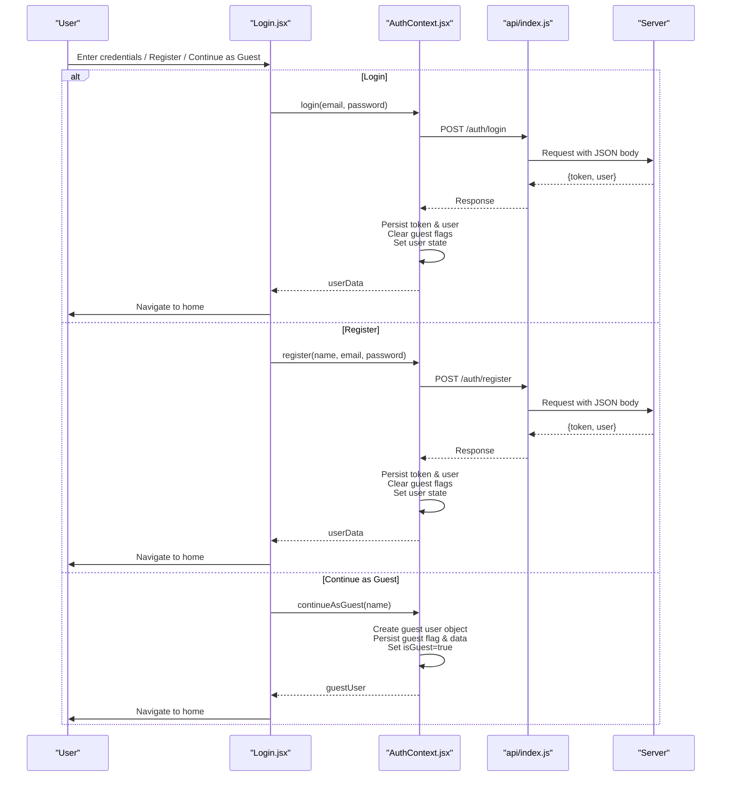
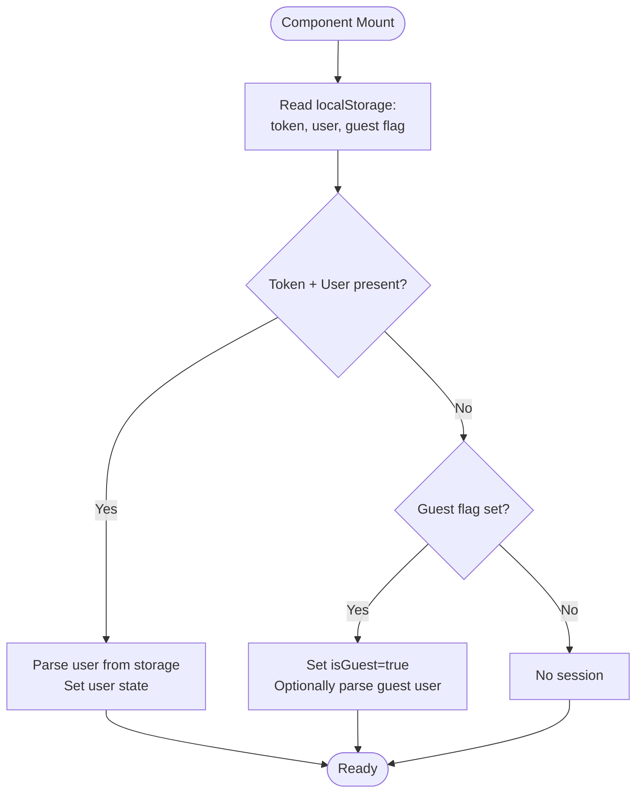
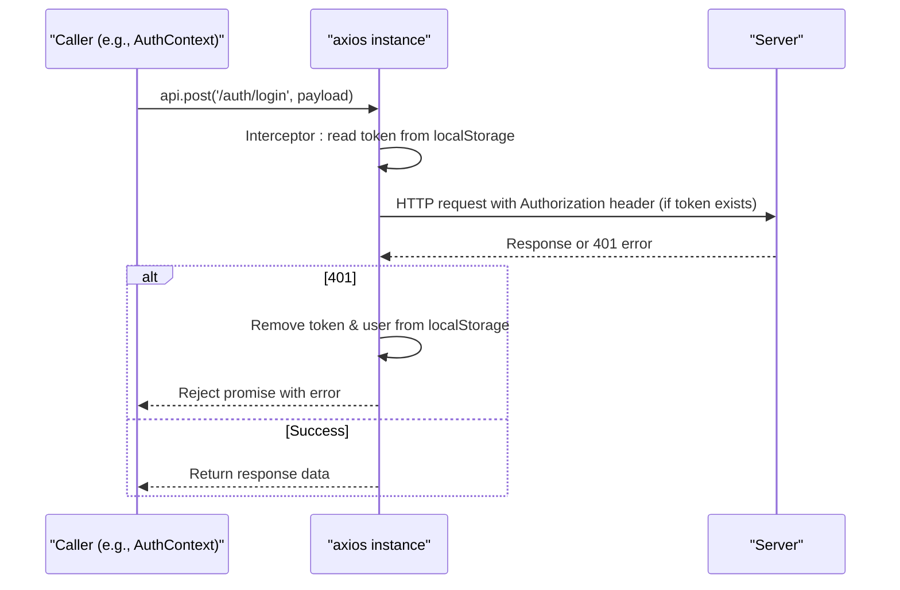
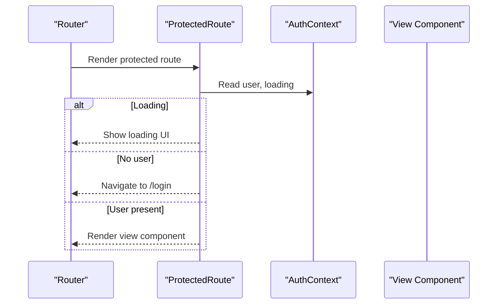
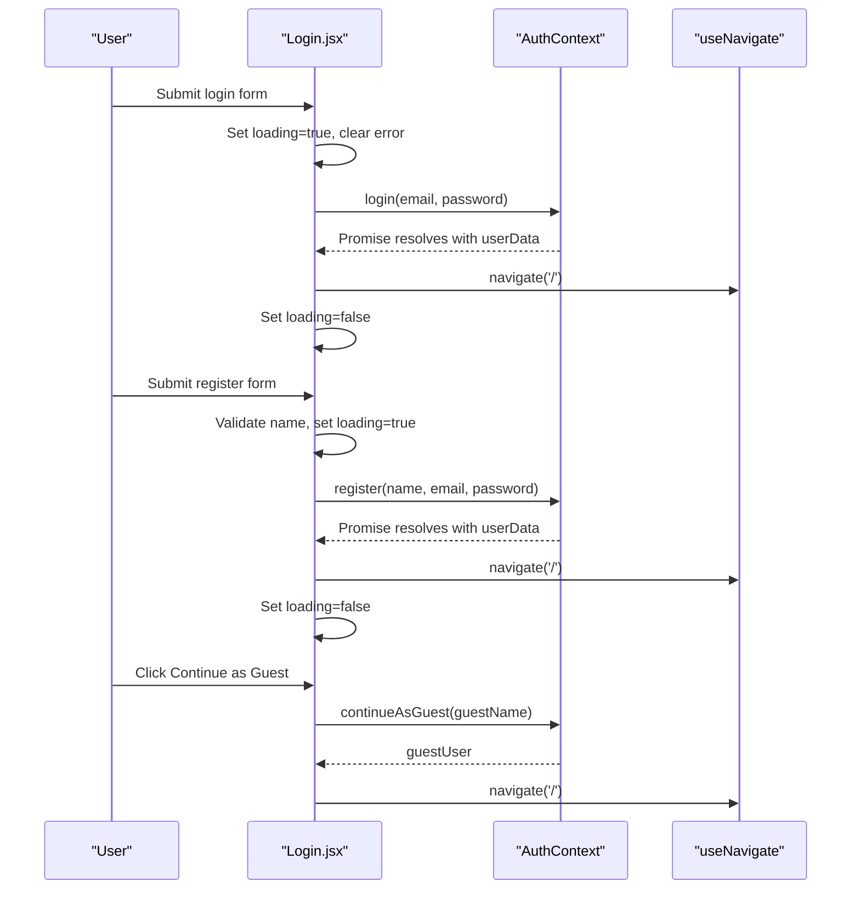
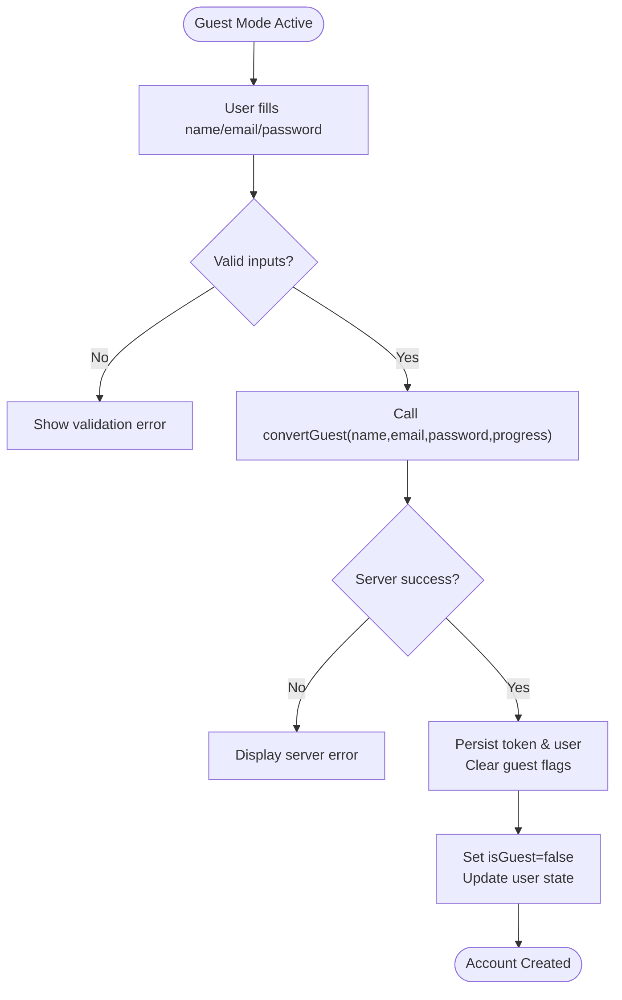
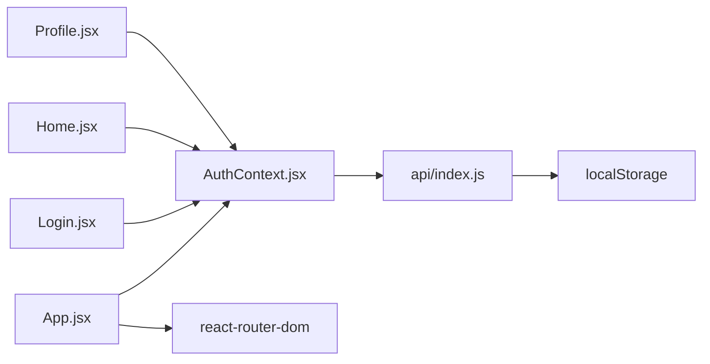

# Authentication Context

<cite>
**Referenced Files in This Document**
- [AuthContext.jsx](file://zabandaan/client/src/context/AuthContext.jsx)
- [api/index.js](file://zabandaan/client/src/api/index.js)
- [App.jsx](file://zabandaan/client/src/App.jsx)
- [Login.jsx](file://zabandaan/client/src/pages/Login.jsx)
- [Home.jsx](file://zabandaan/client/src/pages/Home.jsx)
- [Profile.jsx](file://zabandaan/client/src/pages/Profile.jsx)
</cite>

## Table of Contents
1. [Introduction](#introduction)
2. [Project Structure](#project-structure)
3. [Core Components](#core-components)
4. [Architecture Overview](#architecture-overview)
5. [Detailed Component Analysis](#detailed-component-analysis)
6. [Dependency Analysis](#dependency-analysis)
7. [Performance Considerations](#performance-considerations)
8. [Troubleshooting Guide](#troubleshooting-guide)
9. [Conclusion](#conclusion)

## Introduction
This document explains the Authentication Context implementation for user session management and authentication state. It covers the AuthProvider, local storage synchronization, guest mode support, and the complete authentication flow including login, register, continueAsGuest, convertGuest, and logout. It also shows how components consume authentication state via the useAuth hook, handle loading states, manage errors, and addresses security considerations and performance optimizations.

## Project Structure
The authentication system is centered around a React context that manages user state and provides methods to authenticate users or operate as a guest. An Axios API client automatically attaches tokens to requests and clears sessions on unauthorized responses. The application wraps routes with a provider and uses protected routes to enforce authentication.

**Diagram sources**
- [App.jsx:14-52](file://zabandaan/client/src/App.jsx#L14-L52)
- [AuthContext.jsx:6-90](file://zabandaan/client/src/context/AuthContext.jsx#L6-L90)
- [api/index.js:1-29](file://zabandaan/client/src/api/index.js#L1-L29)

**Section sources**
- [App.jsx:1-66](file://zabandaan/client/src/App.jsx#L1-L66)
- [AuthContext.jsx:1-97](file://zabandaan/client/src/context/AuthContext.jsx#L1-L97)
- [api/index.js:1-30](file://zabandaan/client/src/api/index.js#L1-L30)

## Core Components
- AuthProvider: Manages user state, guest mode, and loading status. Persists and restores session from local storage and exposes authentication methods.
- API Client: Intercepts outgoing requests to attach Authorization headers and handles 401 by clearing stored credentials.
- ProtectedRoute: Guards routes based on authentication state and redirects unauthenticated users.
- Login Page: Implements login, registration, and guest entry flows using the context methods.
- Home and Profile Pages: Consume authentication state to display personalized content and enable guest-to-user conversion.

Key responsibilities:
- Session initialization on app start
- Token and user persistence in local storage
- Guest mode with isolated progress storage
- Centralized error handling for auth failures
- Route protection based on authenticated state

**Section sources**
- [AuthContext.jsx:6-90](file://zabandaan/client/src/context/AuthContext.jsx#L6-L90)
- [api/index.js:8-27](file://zabandaan/client/src/api/index.js#L8-L27)
- [App.jsx:14-52](file://zabandaan/client/src/App.jsx#L14-L52)
- [Login.jsx:17-47](file://zabandaan/client/src/pages/Login.jsx#L17-L47)
- [Home.jsx:9-26](file://zabandaan/client/src/pages/Home.jsx#L9-L26)
- [Profile.jsx:8-28](file://zabandaan/client/src/pages/Profile.jsx#L8-L28)

## Architecture Overview
The authentication architecture combines React Context for state, Axios interceptors for token injection, and route guards for access control. Local storage acts as the persistence layer for tokens, user data, and guest mode flags.

**Diagram sources**
- [Login.jsx:17-47](file://zabandaan/client/src/pages/Login.jsx#L17-L47)
- [AuthContext.jsx:31-74](file://zabandaan/client/src/context/AuthContext.jsx#L31-L74)
- [api/index.js:8-15](file://zabandaan/client/src/api/index.js#L8-L15)

## Detailed Component Analysis

### AuthProvider Implementation
- State:
  - user: current authenticated user or guest user object
  - isGuest: boolean indicating guest mode
  - loading: boolean during initial session restoration
- Initialization:
  - On mount, reads local storage keys for token, user, and guest mode
  - Restores user if both token and user exist
  - If guest mode is active, sets isGuest and optionally loads guest user data
- Methods:
  - login(email, password): authenticates via API, persists token and user, clears guest state, updates context
  - register(name, email, password): registers via API, persists token and user, clears guest state, updates context
  - continueAsGuest(name): creates a guest user object, persists guest flag and data, sets isGuest true
  - convertGuest(name, email, password, progress): converts guest to registered user via API, persists token and user, clears guest state
  - logout(): clears all local storage auth keys and resets context state
- Hook:
  - useAuth(): returns context value; throws if used outside provider

**Diagram sources**
- [AuthContext.jsx:11-29](file://zabandaan/client/src/context/AuthContext.jsx#L11-L29)

**Section sources**
- [AuthContext.jsx:6-90](file://zabandaan/client/src/context/AuthContext.jsx#L6-L90)

### API Client and Token Handling
- Base configuration:
  - baseURL set to /api
  - Content-Type header set to application/json
- Request interceptor:
  - Reads token from local storage and adds Authorization header if present
- Response interceptor:
  - On 401 Unauthorized, removes token and user from local storage to force re-authentication

**Diagram sources**
- [api/index.js:8-27](file://zabandaan/client/src/api/index.js#L8-L27)

**Section sources**
- [api/index.js:1-30](file://zabandaan/client/src/api/index.js#L1-L30)

### Protected Routes and Navigation
- ProtectedRoute:
  - Uses useAuth to check loading and user presence
  - Shows loading indicator while initializing
  - Redirects to /login when no user is present
- AppRoutes:
  - Wraps protected pages with ProtectedRoute
  - Redirects authenticated users away from /login

**Diagram sources**
- [App.jsx:14-52](file://zabandaan/client/src/App.jsx#L14-L52)

**Section sources**
- [App.jsx:14-52](file://zabandaan/client/src/App.jsx#L14-L52)

### Login Flow Usage
- States:
  - mode: landing | login | register
  - Form fields: name, email, password, guestName
  - Error and loading states for form submissions
- Handlers:
  - handleLogin: calls login, navigates on success, displays error messages
  - handleRegister: validates name, calls register, navigates on success, displays error messages
  - handleGuest: calls continueAsGuest with optional name, navigates to home

**Diagram sources**
- [Login.jsx:17-47](file://zabandaan/client/src/pages/Login.jsx#L17-L47)

**Section sources**
- [Login.jsx:1-149](file://zabandaan/client/src/pages/Login.jsx#L1-L149)

### Guest Mode and Conversion
- continueAsGuest:
  - Creates a guest user object with a generated id and isGuest flag
  - Persists guest flag and user data to local storage
  - Sets isGuest true in context
- convertGuest:
  - Sends guest progress and credentials to server
  - On success, persists token and user, clears guest flags, sets isGuest false
- Profile page:
  - Displays guest badge and conversion form
  - Validates inputs and calls convertGuest
  - Refreshes points and progress after conversion

**Diagram sources**
- [AuthContext.jsx:55-74](file://zabandaan/client/src/context/AuthContext.jsx#L55-L74)
- [Profile.jsx:44-61](file://zabandaan/client/src/pages/Profile.jsx#L44-L61)

**Section sources**
- [AuthContext.jsx:55-74](file://zabandaan/client/src/context/AuthContext.jsx#L55-L74)
- [Profile.jsx:44-61](file://zabandaan/client/src/pages/Profile.jsx#L44-L61)

### Data Models and Storage Keys
- Local storage keys:
  - zabandaan_token: JWT or session token
  - zabandaan_user: serialized user object
  - zabandaan_guest: 'true' when guest mode is active
  - zabandaan_guest_data: serialized guest user object
- Guest progress keys:
  - guest_progress_<category>: stores completed levels per category

These keys are read/written by the context and pages to maintain session and progress across reloads.

**Section sources**
- [AuthContext.jsx:11-29](file://zabandaan/client/src/context/AuthContext.jsx#L11-L29)
- [Home.jsx:28-53](file://zabandaan/client/src/pages/Home.jsx#L28-L53)

## Dependency Analysis
- AuthContext depends on:
  - React hooks: createContext, useContext, useState, useEffect
  - API client for network requests
- API client depends on:
  - axios library
  - local storage for token retrieval and cleanup
- App depends on:
  - BrowserRouter and routing utilities
  - AuthProvider and ProtectedRoute for global auth behavior
- Pages depend on:
  - useAuth for reading state and invoking actions
  - Routing utilities for navigation

**Diagram sources**
- [AuthContext.jsx:1-3](file://zabandaan/client/src/context/AuthContext.jsx#L1-L3)
- [api/index.js:1-2](file://zabandaan/client/src/api/index.js#L1-L2)
- [App.jsx:1-3](file://zabandaan/client/src/App.jsx#L1-L3)
- [Login.jsx:1-4](file://zabandaan/client/src/pages/Login.jsx#L1-L4)
- [Home.jsx:1-7](file://zabandaan/client/src/pages/Home.jsx#L1-L7)
- [Profile.jsx:1-6](file://zabandaan/client/src/pages/Profile.jsx#L1-L6)

**Section sources**
- [AuthContext.jsx:1-97](file://zabandaan/client/src/context/AuthContext.jsx#L1-L97)
- [api/index.js:1-30](file://zabandaan/client/src/api/index.js#L1-L30)
- [App.jsx:1-66](file://zabandaan/client/src/App.jsx#L1-L66)
- [Login.jsx:1-149](file://zabandaan/client/src/pages/Login.jsx#L1-L149)
- [Home.jsx:1-219](file://zabandaan/client/src/pages/Home.jsx#L1-L219)
- [Profile.jsx:1-353](file://zabandaan/client/src/pages/Profile.jsx#L1-L353)

## Performance Considerations
- Minimize context re-renders:
  - Keep state minimal: user, isGuest, loading
  - Avoid passing large objects through context unnecessarily
- Memoize derived values:
  - Use useMemo for computed UI data in consuming components
- Debounce or throttle heavy operations:
  - For example, progress calculations or API calls triggered frequently
- Optimize local storage usage:
  - Serialize only necessary fields
  - Avoid excessive writes; batch updates where possible
- Reduce unnecessary effects:
  - Ensure dependencies in useEffect are stable and minimal
- Prefer lazy loading:
  - Load heavy modules or features only when needed

[No sources needed since this section provides general guidance]

## Troubleshooting Guide
Common issues and resolutions:
- Token missing or invalid:
  - Symptom: Redirected to login unexpectedly
  - Cause: 401 response clears token/user from local storage
  - Resolution: Re-authenticate; ensure API base URL and CORS are configured correctly
- Guest mode not persisting:
  - Symptom: Reloading loses guest state
  - Cause: Local storage keys not set or cleared
  - Resolution: Verify continueAsGuest sets guest flag and data; check browser storage permissions
- Registration or login fails:
  - Symptom: Error message displayed
  - Cause: Network error or server validation failure
  - Resolution: Inspect error.response.data.error; validate input fields; confirm backend endpoints
- Protected routes redirect loop:
  - Symptom: Infinite redirect to login
  - Cause: user remains null due to failed session restore
  - Resolution: Check local storage keys; ensure AuthProvider initializes before rendering routes
- Excessive re-renders:
  - Symptom: UI flickers or slow interactions
  - Cause: Context consumers trigger full tree updates
  - Resolution: Memoize components; split context into smaller contexts if needed

**Section sources**
- [api/index.js:17-27](file://zabandaan/client/src/api/index.js#L17-L27)
- [AuthContext.jsx:11-29](file://zabandaan/client/src/context/AuthContext.jsx#L11-L29)
- [Login.jsx:17-47](file://zabandaan/client/src/pages/Login.jsx#L17-L47)
- [App.jsx:14-52](file://zabandaan/client/src/App.jsx#L14-L52)

## Conclusion
The Authentication Context provides a robust foundation for session management, supporting both authenticated users and guests. It leverages React Context for state, Axios interceptors for token handling, and local storage for persistence. Protected routes ensure secure access to application features. By following the outlined patterns and troubleshooting steps, developers can implement reliable authentication flows and optimize performance for a smooth user experience.

[No sources needed since this section summarizes without analyzing specific files]