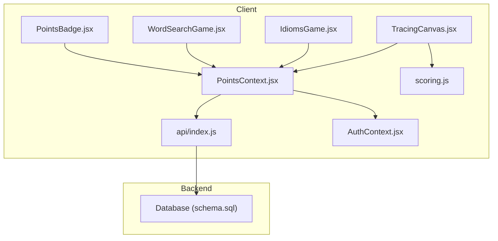
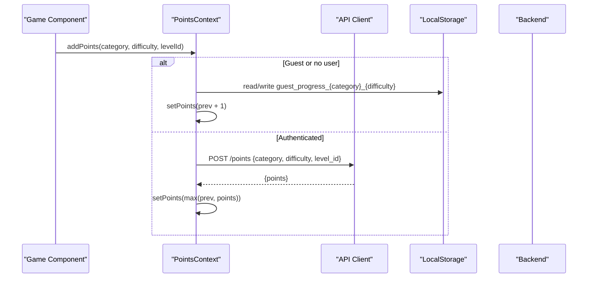
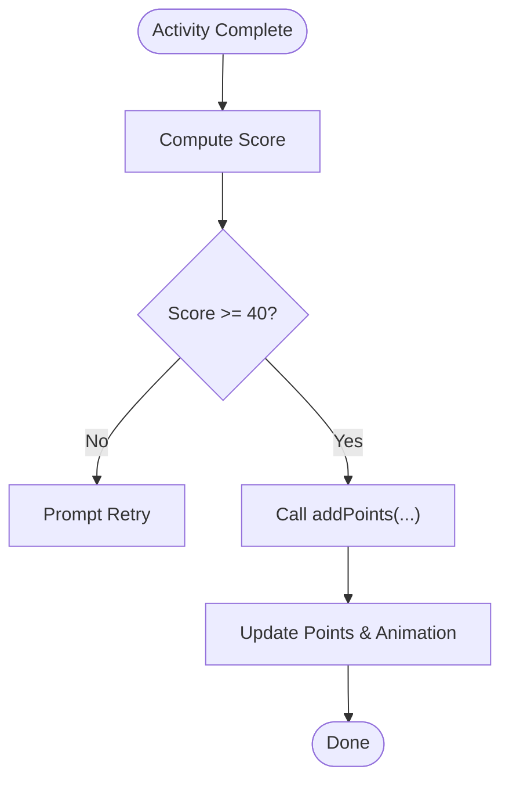
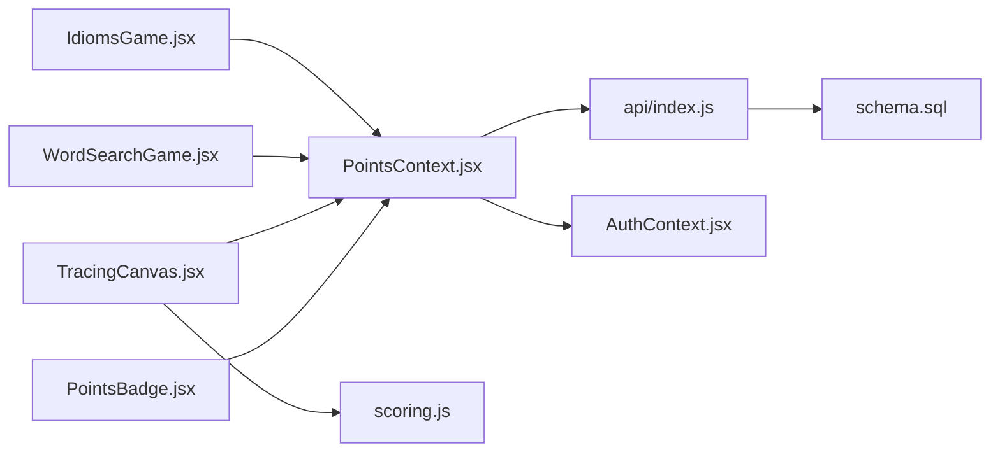

# Points Context

<cite>
**Referenced Files in This Document**
- [PointsContext.jsx](file://zabandaan/client/src/context/PointsContext.jsx)
- [AuthContext.jsx](file://zabandaan/client/src/context/AuthContext.jsx)
- [api/index.js](file://zabandaan/client/src/api/index.js)
- [scoring.js](file://zabandaan/client/src/utils/scoring.js)
- [TracingCanvas.jsx](file://zabandaan/client/src/pages/alphabets/TracingCanvas.jsx)
- [IdiomsGame.jsx](file://zabandaan/client/src/pages/idioms/IdiomsGame.jsx)
- [WordSearchGame.jsx](file://zabandaan/client/src/pages/wordsearch/WordSearchGame.jsx)
- [PointsBadge.jsx](file://zabandaan/client/src/components/PointsBadge.jsx)
- [schema.sql](file://zabandaan/database/schema.sql)
</cite>

## Table of Contents
1. [Introduction](#introduction)
2. [Project Structure](#project-structure)
3. [Core Components](#core-components)
4. [Architecture Overview](#architecture-overview)
5. [Detailed Component Analysis](#detailed-component-analysis)
6. [Dependency Analysis](#dependency-analysis)
7. [Performance Considerations](#performance-considerations)
8. [Troubleshooting Guide](#troubleshooting-guide)
9. [Conclusion](#conclusion)
10. [Appendices](#appendices)

## Introduction
This document explains the gamification state management and progress tracking implemented via the Points Context. It covers how points are accumulated, how achievements and learning progress are tracked across modules (alphabets tracing, idioms quiz, word search), and how data is synchronized between local storage for guest sessions and backend services for authenticated users. It also details scoring algorithms used to determine when a level or activity counts as complete, and provides guidance on debugging, conflict resolution, and performance optimization for frequent updates.

## Project Structure
The Points system spans several layers:
- Context layer: centralizes points state, persistence strategy, and API synchronization.
- Game components: consume points context to award points upon successful completion.
- Scoring utilities: compute accuracy scores that gate point awards.
- API client: handles authentication headers and token-based requests.
- Database schema: defines tables for user progress and content.

**Diagram sources**
- [PointsContext.jsx:7-106](file://zabandaan/client/src/context/PointsContext.jsx#L7-L106)
- [AuthContext.jsx:6-90](file://zabandaan/client/src/context/AuthContext.jsx#L6-L90)
- [api/index.js:3-29](file://zabandaan/client/src/api/index.js#L3-L29)
- [scoring.js:106-150](file://zabandaan/client/src/utils/scoring.js#L106-L150)
- [TracingCanvas.jsx:244-261](file://zabandaan/client/src/pages/alphabets/TracingCanvas.jsx#L244-L261)
- [IdiomsGame.jsx:70-82](file://zabandaan/client/src/pages/idioms/IdiomsGame.jsx#L70-L82)
- [WordSearchGame.jsx:52-77](file://zabandaan/client/src/pages/wordsearch/WordSearchGame.jsx#L52-L77)
- [schema.sql:9-18](file://zabandaan/database/schema.sql#L9-L18)

**Section sources**
- [PointsContext.jsx:7-106](file://zabandaan/client/src/context/PointsContext.jsx#L7-L106)
- [AuthContext.jsx:6-90](file://zabandaan/client/src/context/AuthContext.jsx#L6-L90)
- [api/index.js:3-29](file://zabandaan/client/src/api/index.js#L3-L29)
- [schema.sql:9-18](file://zabandaan/database/schema.sql#L9-L18)

## Core Components
- PointsProvider: manages points state, animating flag, and exposes methods to add points, load points, and query guest progress. It differentiates guest vs authenticated flows and persists guest progress locally while syncing with the backend for logged-in users.
- usePoints hook: provides access to points, animating, and methods from the provider.
- PointsBadge: displays current points with an animation trigger based on the provider’s animating state.
- Scoring utilities: compute trace accuracy and dot placement accuracy to decide whether a tracing activity qualifies for points.
- Game components: Idiomatics and Word Search call addPoints upon correct answers; TracingCanvas triggers completion only when score meets threshold.

Key responsibilities:
- State: points total and transient animating flag.
- Persistence: localStorage for guest mode; REST endpoints for authenticated mode.
- Synchronization: loadPoints initializes points on mount; addPoints updates both UI and backend/local store.
- Progress tracking: per-category/difficulty completed levels stored under guest keys; backend stores aggregated progress.

**Section sources**
- [PointsContext.jsx:7-106](file://zabandaan/client/src/context/PointsContext.jsx#L7-L106)
- [PointsBadge.jsx:3-23](file://zabandaan/client/src/components/PointsBadge.jsx#L3-L23)
- [scoring.js:106-150](file://zabandaan/client/src/utils/scoring.js#L106-L150)
- [IdiomsGame.jsx:70-82](file://zabandaan/client/src/pages/idioms/IdiomsGame.jsx#L70-L82)
- [WordSearchGame.jsx:52-77](file://zabandaan/client/src/pages/wordsearch/WordSearchGame.jsx#L52-L77)
- [TracingCanvas.jsx:244-261](file://zabandaan/client/src/pages/alphabets/TracingCanvas.jsx#L244-L261)

## Architecture Overview
The Points system orchestrates three primary flows:
- Guest flow: all progress is stored locally using keys prefixed by category and difficulty. Total points are computed by summing completed levels across all guest keys.
- Authenticated flow: addPoints posts to /points and sets the server-provided total; loadPoints fetches current total from /points.
- Scoring-gated completion: activities like tracing require a minimum accuracy before calling onComplete and subsequently addPoints.

**Diagram sources**
- [PointsContext.jsx:12-46](file://zabandaan/client/src/context/PointsContext.jsx#L12-L46)
- [api/index.js:3-29](file://zabandaan/client/src/api/index.js#L3-L29)

**Diagram sources**
- [TracingCanvas.jsx:244-261](file://zabandaan/client/src/pages/alphabets/TracingCanvas.jsx#L244-L261)
- [PointsContext.jsx:12-46](file://zabandaan/client/src/context/PointsContext.jsx#L12-L46)

## Detailed Component Analysis

### PointsProvider Implementation
- State:
  - points: integer representing total earned points.
  - animating: boolean toggled briefly when points increase to drive UI animations.
- Methods:
  - addPoints(category, difficulty, levelId):
    - Guest mode:
      - Reads/writes a key guest_progress_{category}_{difficulty} storing an array of completed levelIds.
      - Ensures idempotency by checking if levelId already exists in completed list.
      - Increments local points and triggers animation.
    - Authenticated mode:
      - Posts to /points with category, difficulty, and level_id.
      - Updates points to server-reported value, ensuring monotonic increase.
      - Triggers animation when points increase.
  - setTotalPoints(total): ensures points never decrease.
  - loadPoints():
    - Guest mode: sums completed levels across all guest keys to compute total.
    - Authenticated mode: fetches current points from /points.
  - getGuestProgress(category, difficulty): returns completed levels for a specific key.
  - getAllGuestProgress(): aggregates all guest progress entries into a structured array.

Data consistency strategies:
- Idempotent guest progress: duplicate levelIds are ignored.
- Monotonic points: setTotalPoints and addPoints enforce non-decreasing totals.
- Error handling: network errors during addPoints/loadPoints are caught and logged without crashing UI.

Performance considerations:
- LocalStorage reads/writes are bounded by number of categories/difficulties.
- Animations are throttled via short timeouts to avoid excessive re-renders.

**Section sources**
- [PointsContext.jsx:7-106](file://zabandaan/client/src/context/PointsContext.jsx#L7-L106)

### Scoring Algorithms
- Main stroke scoring:
  - Resamples user and reference strokes to a fixed number of samples.
  - Computes ordered point-to-point distances and normalizes against a tolerance derived from canvas size.
  - Produces a percentage score capped between 0 and 100.
- Dot scoring:
  - Checks if each expected dot has at least one user-placed dot within a radius tolerance.
  - Returns percentage of matched dots.
- Combined score:
  - Weighted average: 70% main stroke + 30% dots.
- Backward compatibility:
  - Simple wrapper for single-stroke traces.

Complexity:
- Resampling and distance calculations scale linearly with number of sampled points.
- Dot matching uses nested loops over expected vs user dots; acceptable given small counts.

Usage:
- TracingCanvas computes score and gates completion on a threshold (e.g., 40%).

**Section sources**
- [scoring.js:7-150](file://zabandaan/client/src/utils/scoring.js#L7-L150)
- [TracingCanvas.jsx:244-261](file://zabandaan/client/src/pages/alphabets/TracingCanvas.jsx#L244-L261)

### Game Components Consuming Points
- IdiomsGame:
  - On correct answer, calls addPoints('idioms', difficulty, idiom.id).
  - Displays feedback and advances to next question.
- WordSearchGame:
  - On finding a new word, calls addPoints('wordsearch', difficulty, word).
  - Highlights found words and supports regeneration.
- TracingCanvas:
  - Computes score; if >= 40%, triggers onComplete which typically leads to addPoints in parent logic.

Display:
- PointsBadge renders current points and applies animation class when animating is true.

**Section sources**
- [IdiomsGame.jsx:70-82](file://zabandaan/client/src/pages/idioms/IdiomsGame.jsx#L70-L82)
- [WordSearchGame.jsx:52-77](file://zabandaan/client/src/pages/wordsearch/WordSearchGame.jsx#L52-L77)
- [PointsBadge.jsx:3-23](file://zabandaan/client/src/components/PointsBadge.jsx#L3-L23)
- [TracingCanvas.jsx:244-261](file://zabandaan/client/src/pages/alphabets/TracingCanvas.jsx#L244-L261)

### Data Models and Backend Integration
- Progress table:
  - Stores per-user, per-category, per-difficulty progress including current_level, completed_levels (as serialized array), and last_played timestamp.
- API client:
  - Adds Authorization header using token from localStorage.
  - Clears auth tokens on 401 responses.

Synchronization:
- For authenticated users, addPoints updates server-side progress; loadPoints refreshes UI points.
- For guests, all progress remains in localStorage until conversion to registered account.

**Section sources**
- [schema.sql:9-18](file://zabandaan/database/schema.sql#L9-L18)
- [api/index.js:3-29](file://zabandaan/client/src/api/index.js#L3-L29)
- [PointsContext.jsx:52-75](file://zabandaan/client/src/context/PointsContext.jsx#L52-L75)

## Dependency Analysis
- PointsContext depends on:
  - AuthContext for user identity and guest mode flags.
  - api client for network operations.
- Game components depend on:
  - PointsContext for adding points and reading state.
  - Scoring utilities for activity evaluation.
- API client depends on:
  - localStorage for token retrieval and cleanup.

Potential coupling:
- Tight coupling between game components and PointsContext via addPoints usage.
- Scoring thresholds are embedded in TracingCanvas; changes may require coordination with any external rules engines.

Circular dependencies:
- None observed; dependencies are layered (components -> context -> api/auth).

External integrations:
- Backend endpoints: GET /points, POST /points.
- Authentication lifecycle managed by AuthContext and persisted in localStorage.

**Diagram sources**
- [IdiomsGame.jsx:70-82](file://zabandaan/client/src/pages/idioms/IdiomsGame.jsx#L70-L82)
- [WordSearchGame.jsx:52-77](file://zabandaan/client/src/pages/wordsearch/WordSearchGame.jsx#L52-L77)
- [TracingCanvas.jsx:244-261](file://zabandaan/client/src/pages/alphabets/TracingCanvas.jsx#L244-L261)
- [PointsContext.jsx:7-106](file://zabandaan/client/src/context/PointsContext.jsx#L7-L106)
- [api/index.js:3-29](file://zabandaan/client/src/api/index.js#L3-L29)
- [schema.sql:9-18](file://zabandaan/database/schema.sql#L9-L18)

**Section sources**
- [PointsContext.jsx:7-106](file://zabandaan/client/src/context/PointsContext.jsx#L7-L106)
- [api/index.js:3-29](file://zabandaan/client/src/api/index.js#L3-L29)
- [AuthContext.jsx:6-90](file://zabandaan/client/src/context/AuthContext.jsx#L6-L90)

## Performance Considerations
- Frequent state updates:
  - Use functional setState to avoid stale closures.
  - Debounce or batch rapid updates if multiple activities complete quickly.
- LocalStorage overhead:
  - Keep guest progress compact; consider limiting history or pruning old entries.
- Network calls:
  - Avoid redundant POST /points for already-completed levels; ensure idempotency via completed lists.
- Rendering:
  - Minimize re-renders by isolating animated states and using memoization where appropriate.
- Scoring:
  - Limit resample count and optimize dot matching if large numbers of dots are introduced.

[No sources needed since this section provides general guidance]

## Troubleshooting Guide
Common issues and diagnostics:
- Points not increasing:
  - Verify addPoints is called with valid category, difficulty, and levelId.
  - Check for duplicate levelIds in guest progress preventing increments.
  - Inspect network requests to /points for errors or unexpected responses.
- Inconsistent totals:
  - Ensure loadPoints runs after login or session restore to sync with backend.
  - Confirm setTotalPoints is not overridden by subsequent async updates.
- Scoring anomalies:
  - Validate canvas size and coordinate scaling in scoring functions.
  - Adjust tolerance thresholds if scores seem too strict or lenient.
- Offline scenarios:
  - Guest mode relies on localStorage; confirm keys exist and are parseable.
  - Upon reconnect, call loadPoints to reconcile with backend totals.
- Migration strategies:
  - If guest progress format changes, implement version checks and migration routines in loadPoints or getAllGuestProgress to normalize legacy structures.

Debugging techniques:
- Log addPoints inputs and outputs, including guest keys and server responses.
- Temporarily disable animations to isolate UI update issues.
- Use browser DevTools to inspect localStorage keys starting with guest_progress_.

**Section sources**
- [PointsContext.jsx:12-100](file://zabandaan/client/src/context/PointsContext.jsx#L12-L100)
- [scoring.js:7-150](file://zabandaan/client/src/utils/scoring.js#L7-L150)
- [api/index.js:3-29](file://zabandaan/client/src/api/index.js#L3-L29)

## Conclusion
The Points Context provides a robust foundation for gamification state management across multiple learning modules. It supports seamless transitions between guest and authenticated modes, enforces consistent point accumulation, and integrates scoring logic to gate rewards. By leveraging local storage for offline resilience and REST APIs for persistent progress, it balances performance and reliability. Proper debugging and migration practices ensure long-term maintainability as features evolve.

[No sources needed since this section summarizes without analyzing specific files]

## Appendices

### Practical Usage Examples
- Displaying points:
  - Use PointsBadge to render current points with animation support.
- Awarding points in games:
  - Idiomatics: call addPoints on correct answer.
  - Word Search: call addPoints when a new word is found.
  - Tracing: compute score and call onComplete when threshold met; parent component should then call addPoints.
- Loading initial points:
  - Call loadPoints on app start or after authentication changes to synchronize UI with backend or local totals.

**Section sources**
- [PointsBadge.jsx:3-23](file://zabandaan/client/src/components/PointsBadge.jsx#L3-L23)
- [IdiomsGame.jsx:70-82](file://zabandaan/client/src/pages/idioms/IdiomsGame.jsx#L70-L82)
- [WordSearchGame.jsx:52-77](file://zabandaan/client/src/pages/wordsearch/WordSearchGame.jsx#L52-L77)
- [TracingCanvas.jsx:244-261](file://zabandaan/client/src/pages/alphabets/TracingCanvas.jsx#L244-L261)
- [PointsContext.jsx:52-75](file://zabandaan/client/src/context/PointsContext.jsx#L52-L75)