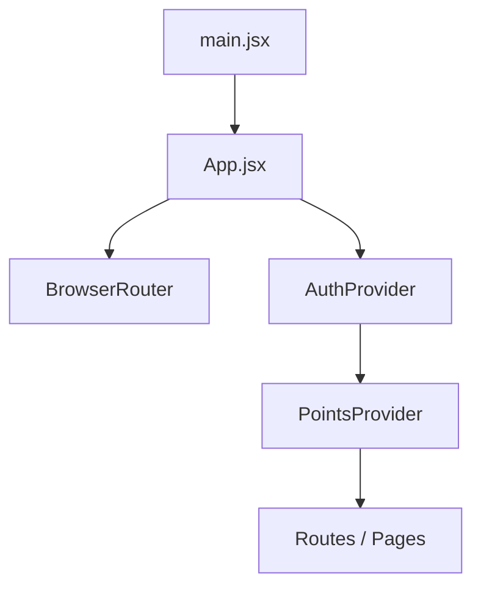
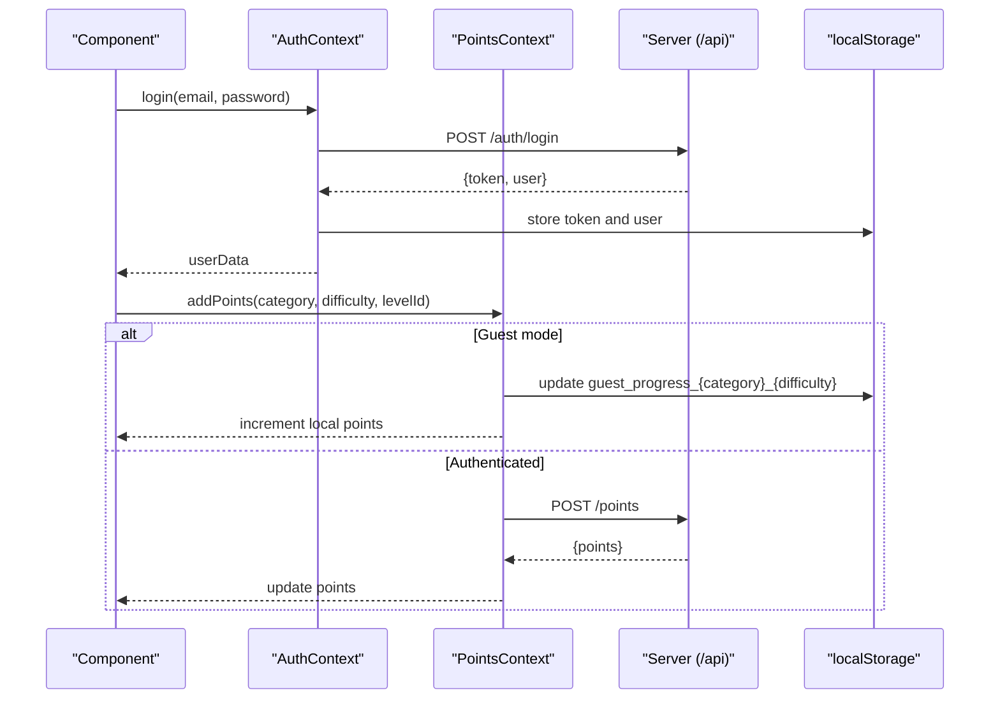
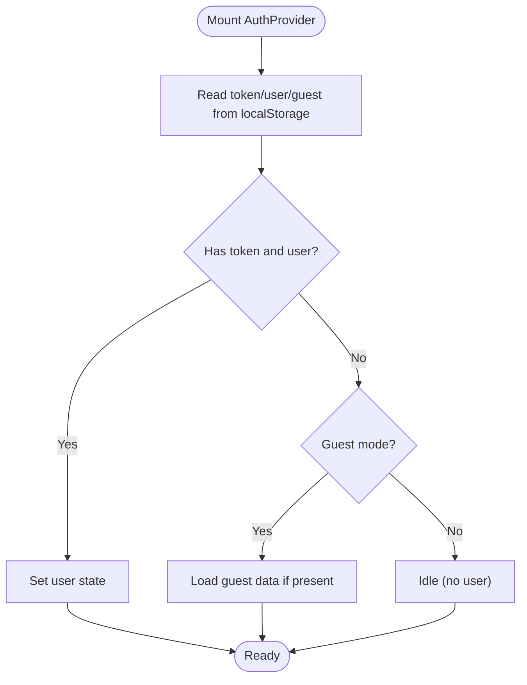
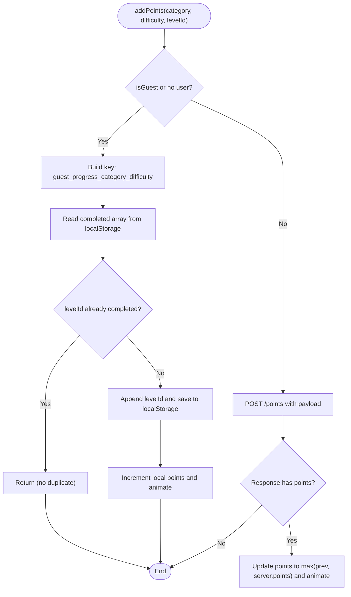
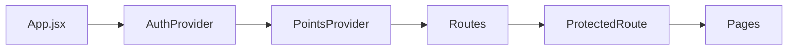
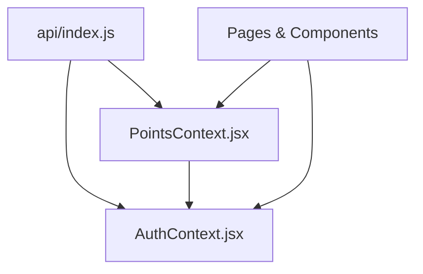

# State Management

<cite>
**Referenced Files in This Document**
- [AuthContext.jsx](file://zabandaan/client/src/context/AuthContext.jsx)
- [PointsContext.jsx](file://zabandaan/client/src/context/PointsContext.jsx)
- [App.jsx](file://zabandaan/client/src/App.jsx)
- [main.jsx](file://zabandaan/client/src/main.jsx)
- [Login.jsx](file://zabandaan/client/src/pages/Login.jsx)
- [Profile.jsx](file://zabandaan/client/src/pages/Profile.jsx)
- [IdiomsGame.jsx](file://zabandaan/client/src/pages/idioms/IdiomsGame.jsx)
- [WordSearchGame.jsx](file://zabandaan/client/src/pages/wordsearch/WordSearchGame.jsx)
- [PointsBadge.jsx](file://zabandaan/client/src/components/PointsBadge.jsx)
- [api/index.js](file://zabandaan/client/src/api/index.js)
</cite>

## Table of Contents
1. Introduction
2. Project Structure
3. Core Components
4. Architecture Overview
5. Detailed Component Analysis
6. Dependency Analysis
7. Performance Considerations
8. Troubleshooting Guide
9. Conclusion

## Introduction
This document explains the state management strategy for the application using React Context API. It focuses on a dual-context architecture:
- AuthContext manages authentication state (user, guest mode, loading) and provides login/register/guest conversion/logout actions.
- PointsContext manages gamification data (points, animations, progress persistence) and exposes methods to add points, load totals, and read guest progress.

The design emphasizes clear provider patterns, safe consumption via custom hooks, local storage synchronization for both auth and gamification data, robust error handling, and performance-conscious updates to minimize unnecessary re-renders.

## Project Structure
At the root of the client app, providers are mounted once so all components can consume context anywhere in the tree. The entry point renders the app inside StrictMode, and App wraps routing with the two providers.

**Diagram sources**
- [main.jsx:5-9](file://zabandaan/client/src/main.jsx#L5-L9)
- [App.jsx:55-65](file://zabandaan/client/src/App.jsx#L55-L65)

**Section sources**
- [main.jsx:1-10](file://zabandaan/client/src/main.jsx#L1-L10)
- [App.jsx:1-66](file://zabandaan/client/src/App.jsx#L1-L66)

## Core Components
- AuthContext: Provides user identity, guest mode flag, loading state, and async actions for login, register, guest session, guest-to-account conversion, and logout. Persists token and user info to localStorage and clears guest artifacts when appropriate.
- PointsContext: Provides current points, animation flags, and methods to add points, set total points, load points from server or local storage, and query guest progress. Uses local storage for guest sessions and server endpoints for authenticated users.

Key implementation highlights:
- Custom hooks useAuth() and usePoints() enforce usage within their respective providers and throw if misused.
- Asynchronous operations are handled with try/catch and console logging for errors; UI states like loading and error messages are managed at the component level.
- Local storage keys are consistently named for tokens, user profiles, guest flags, and per-category difficulty progress.

**Section sources**
- [AuthContext.jsx:1-97](file://zabandaan/client/src/context/AuthContext.jsx#L1-L97)
- [PointsContext.jsx:1-114](file://zabandaan/client/src/context/PointsContext.jsx#L1-L114)

## Architecture Overview
The application uses a layered approach:
- Providers wrap the entire app to expose global state and actions.
- Pages and components consume context via custom hooks.
- API calls go through an Axios instance that attaches Bearer tokens and handles 401 responses by clearing stored credentials.

**Diagram sources**
- [AuthContext.jsx:31-83](file://zabandaan/client/src/context/AuthContext.jsx#L31-L83)
- [PointsContext.jsx:12-75](file://zabandaan/client/src/context/PointsContext.jsx#L12-L75)
- [api/index.js:8-27](file://zabandaan/client/src/api/index.js#L8-L27)

## Detailed Component Analysis

### AuthContext: Authentication Provider
Responsibilities:
- Initialize session from localStorage on mount (token, user, guest mode).
- Provide login, register, continueAsGuest, convertGuest, and logout functions.
- Persist credentials and clear guest artifacts upon successful auth.
- Expose user, isGuest, and loading via context value.

State update mechanisms:
- Synchronous updates for guest mode and logout.
- Asynchronous updates after successful API responses for login/register/convert.

Error handling:
- JSON parsing errors during session restore are caught and ignored to avoid startup crashes.
- API errors bubble up to calling components where they are handled with user-facing messages.

Local storage synchronization:
- Keys used include token, user profile, guest flag, and guest data payload.
- On login/register/convert, guest-related keys are removed to ensure clean state.

Consumption pattern:
- Components call useAuth() to access user, isGuest, loading, and action functions.
- Example flows: Login page triggers login/register; Profile page converts guest to account and refreshes state.

**Diagram sources**
- [AuthContext.jsx:11-29](file://zabandaan/client/src/context/AuthContext.jsx#L11-L29)

**Section sources**
- [AuthContext.jsx:1-97](file://zabandaan/client/src/context/AuthContext.jsx#L1-L97)
- [Login.jsx:17-47](file://zabandaan/client/src/pages/Login.jsx#L17-L47)
- [Profile.jsx:44-61](file://zabandaan/client/src/pages/Profile.jsx#L44-L61)

### PointsContext: Gamification Provider
Responsibilities:
- Maintain current points and animation state.
- Add points either locally (guest) or via server (authenticated), ensuring points only increase.
- Load total points from server or compute from local storage for guests.
- Provide utilities to read guest progress by category/difficulty and aggregate all guest progress.

State update mechanisms:
- For guests, updates are immediate and persisted under keys like guest_progress_category_difficulty.
- For authenticated users, updates come from server responses; UI animates when points increase.

Error handling:
- Network errors are logged; UI remains stable without crashing.
- Parsing errors when reading local storage are caught and ignored.

Local storage synchronization:
- Guest progress is stored per category and difficulty, enabling accurate totals and migration to server-backed accounts.

Consumption pattern:
- Game components call addPoints(category, difficulty, levelId) on correct answers or completed tasks.
- Profile and other screens call loadPoints and getGuestProgress to display stats.

**Diagram sources**
- [PointsContext.jsx:12-46](file://zabandaan/client/src/context/PointsContext.jsx#L12-L46)

**Section sources**
- [PointsContext.jsx:1-114](file://zabandaan/client/src/context/PointsContext.jsx#L1-L114)
- [IdiomsGame.jsx:70-82](file://zabandaan/client/src/pages/idioms/IdiomsGame.jsx#L70-L82)
- [WordSearchGame.jsx:52-77](file://zabandaan/client/src/pages/wordsearch/WordSearchGame.jsx#L52-L77)
- [Profile.jsx:20-42](file://zabandaan/client/src/pages/Profile.jsx#L20-L42)

### Provider Composition and Routing
- App mounts BrowserRouter, then AuthProvider wrapping PointsProvider. This ensures authentication state is available before gamification logic runs.
- ProtectedRoute guards routes based on user presence and loading state.

**Diagram sources**
- [App.jsx:55-65](file://zabandaan/client/src/App.jsx#L55-L65)
- [App.jsx:14-19](file://zabandaan/client/src/App.jsx#L14-L19)

**Section sources**
- [App.jsx:14-65](file://zabandaan/client/src/App.jsx#L14-L65)

### Consumption Examples
- PointsBadge reads points and animating state to render a visual indicator.
- IdiomsGame calls addPoints on correct answers to award points.
- WordSearchGame calls addPoints when words are found.
- Login uses AuthContext to authenticate and navigate.
- Profile loads points and progress, and supports converting guest to registered account while preserving progress.

**Section sources**
- [PointsBadge.jsx:1-24](file://zabandaan/client/src/components/PointsBadge.jsx#L1-L24)
- [IdiomsGame.jsx:70-82](file://zabandaan/client/src/pages/idioms/IdiomsGame.jsx#L70-L82)
- [WordSearchGame.jsx:52-77](file://zabandaan/client/src/pages/wordsearch/WordSearchGame.jsx#L52-L77)
- [Login.jsx:17-47](file://zabandaan/client/src/pages/Login.jsx#L17-L47)
- [Profile.jsx:20-61](file://zabandaan/client/src/pages/Profile.jsx#L20-L61)

## Dependency Analysis
- PointsContext depends on AuthContext to determine guest vs authenticated behavior.
- Both contexts depend on api/index.js for network requests and token injection.
- Components consume contexts via custom hooks, avoiding direct context usage and reducing coupling.

**Diagram sources**
- [api/index.js:1-30](file://zabandaan/client/src/api/index.js#L1-L30)
- [AuthContext.jsx:1-97](file://zabandaan/client/src/context/AuthContext.jsx#L1-L97)
- [PointsContext.jsx:1-114](file://zabandaan/client/src/context/PointsContext.jsx#L1-L114)

**Section sources**
- [api/index.js:1-30](file://zabandaan/client/src/api/index.js#L1-L30)
- [AuthContext.jsx:1-97](file://zabandaan/client/src/context/AuthContext.jsx#L1-L97)
- [PointsContext.jsx:1-114](file://zabandaan/client/src/context/PointsContext.jsx#L1-L114)

## Performance Considerations
- Minimize re-renders:
  - Use functional state updates to avoid stale closures when updating points.
  - Memoize callbacks with useCallback where appropriate to prevent unnecessary re-instantiation.
  - Keep context values small; split concerns into separate contexts (already done: Auth vs Points).
- Avoid context pollution:
  - Each provider exposes only necessary state and actions.
  - Custom hooks validate usage and throw if called outside providers, preventing silent failures.
- Optimize local storage operations:
  - Batch writes where possible; avoid redundant writes for already-completed levels.
  - Parse JSON safely with try/catch to prevent blocking UI on corrupted data.
- Network efficiency:
  - Token attached automatically via interceptor; 401 responses clear invalid credentials.
  - Only request points totals when needed (e.g., on profile load).

[No sources needed since this section provides general guidance]

## Troubleshooting Guide
Common issues and resolutions:
- Circular dependencies:
  - PointsContext imports AuthContext; ensure no reverse import exists. Current structure avoids cycles.
- Context pollution:
  - Keep each context focused on a single domain (authentication vs gamification).
  - Use custom hooks to encapsulate consumption and validation.
- Debugging techniques:
  - Log errors in catch blocks for network and parsing operations.
  - Inspect localStorage keys for token, user, guest flags, and guest progress entries.
  - Verify protected routes redirect correctly when user is not authenticated.
- Error handling approaches:
  - API interceptor clears credentials on 401 to force re-authentication flow.
  - Components handle errors gracefully with user feedback and fallback states.

**Section sources**
- [api/index.js:17-27](file://zabandaan/client/src/api/index.js#L17-L27)
- [AuthContext.jsx:11-29](file://zabandaan/client/src/context/AuthContext.jsx#L11-L29)
- [PointsContext.jsx:43-75](file://zabandaan/client/src/context/PointsContext.jsx#L43-L75)
- [App.jsx:14-19](file://zabandaan/client/src/App.jsx#L14-L19)

## Conclusion
The dual-context architecture cleanly separates authentication and gamification concerns while providing a consistent consumption model via custom hooks. Local storage synchronization enables seamless guest experiences and smooth transitions to authenticated accounts. Robust error handling and careful state updates help maintain performance and reliability. This approach scales well as new features are added, keeping state management predictable and testable.

[No sources needed since this section summarizes without analyzing specific files]