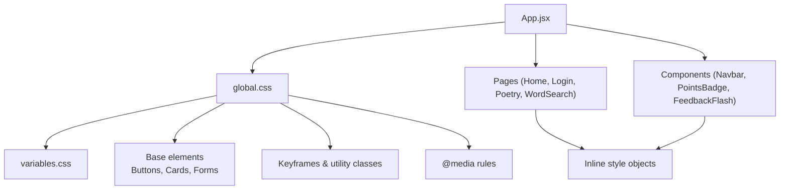
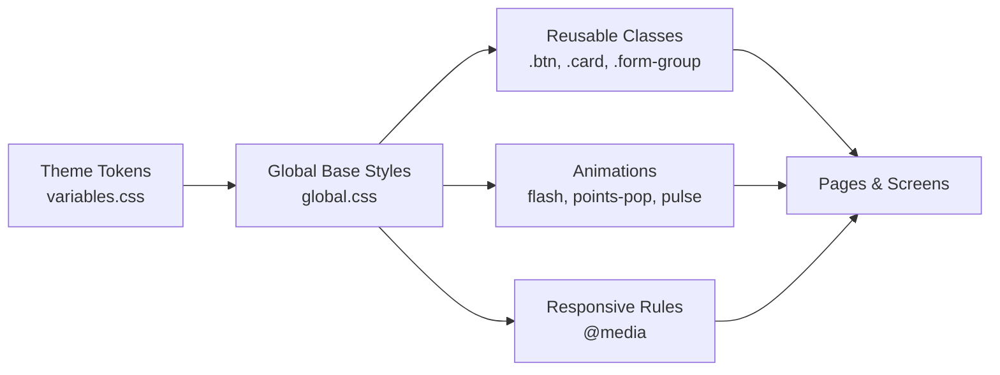
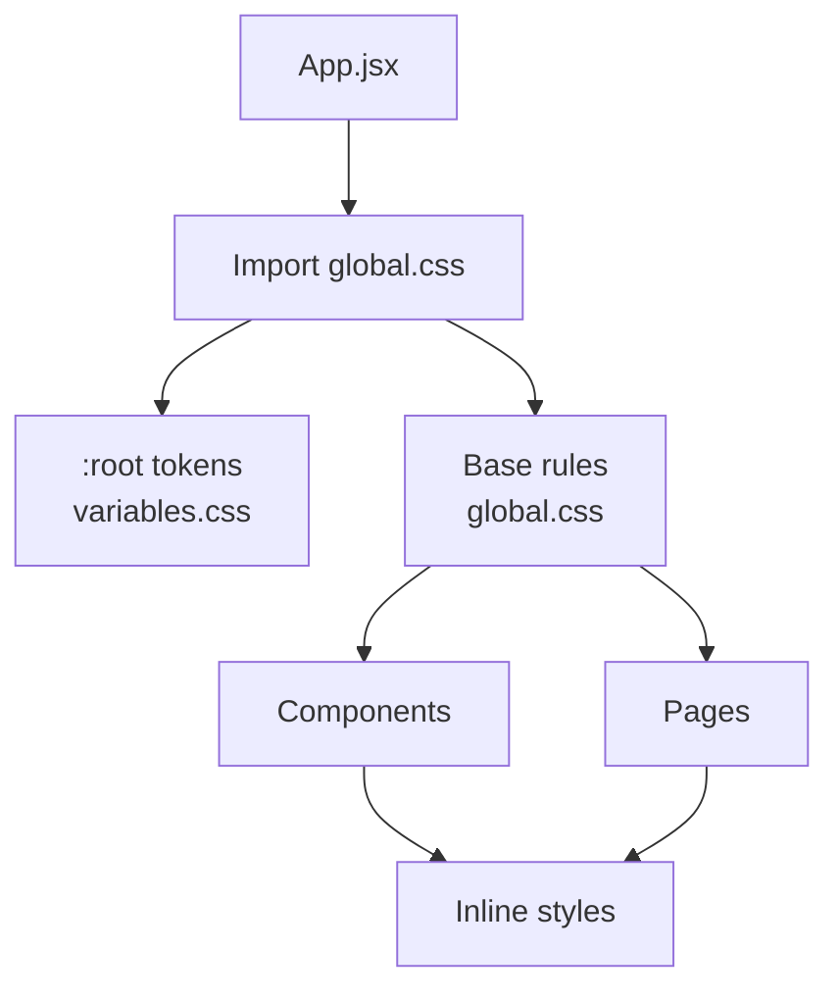

# Styling and Theming

<cite>
**Referenced Files in This Document**
- [variables.css](file://zabandaan/client/src/styles/variables.css)
- [global.css](file://zabandaan/client/src/styles/global.css)
- [App.jsx](file://zabandaan/client/src/App.jsx)
- [Navbar.jsx](file://zabandaan/client/src/components/Navbar.jsx)
- [PointsBadge.jsx](file://zabandaan/client/src/components/PointsBadge.jsx)
- [FeedbackFlash.jsx](file://zabandaan/client/src/components/FeedbackFlash.jsx)
- [Home.jsx](file://zabandaan/client/src/pages/Home.jsx)
- [Login.jsx](file://zabandaan/client/src/pages/Login.jsx)
- [PoetryPage.jsx](file://zabandaan/client/src/pages/poetry/PoetryPage.jsx)
- [WordSearchGame.jsx](file://zabandaan/client/src/pages/wordsearch/WordSearchGame.jsx)
</cite>

## Table of Contents
1. Introduction
2. Project Structure
3. Core Components
4. Architecture Overview
5. Detailed Component Analysis
6. Dependency Analysis
7. Performance Considerations
8. Troubleshooting Guide
9. Conclusion
10. Appendices

## Introduction
This document explains the styling and theming system used across the application. It focuses on how CSS custom properties drive a consistent design, how global styles establish baseline behavior, and how components are styled using both shared CSS classes and inline styles. You will learn the variables for colors, typography, spacing, and responsive breakpoints; see practical patterns for extending themes and building responsive layouts; and understand naming conventions, best practices, cross-browser considerations, performance techniques, and accessibility features embedded in the styling approach.

## Project Structure
The styling system is centered around two core files:
- A variables file that defines theme tokens as CSS custom properties
- A global stylesheet that imports variables and establishes base styles, reusable components, animations, and responsive rules

Application entry points import the global stylesheet once so all pages and components inherit the design system.

**Diagram sources**
- [App.jsx:12](file://zabandaan/client/src/App.jsx#L12-L12)
- [global.css:1](file://zabandaan/client/src/styles/global.css#L1-L1)
- [variables.css:1-22](file://zabandaan/client/src/styles/variables.css#L1-L22)

**Section sources**
- [App.jsx:12](file://zabandaan/client/src/App.jsx#L12-L12)
- [global.css:1-192](file://zabandaan/client/src/styles/global.css#L1-L192)
- [variables.css:1-22](file://zabandaan/client/src/styles/variables.css#L1-L22)

## Core Components
- Theme variables: Centralized tokens for colors, radii, shadows, fonts, and transitions enable consistent theming and easy overrides.
- Global base styles: Reset box-sizing, set root font size, define body defaults, and provide reusable utilities like buttons, cards, forms, messages, and animations.
- Responsive rules: A single breakpoint adjusts layout and spacing for small screens.
- Inline component styles: Many components use inline style objects for dynamic or localized styling while still leveraging global tokens where appropriate.

Practical examples:
- Extend the theme by overriding CSS custom properties on :root or a scoped container to create alternate color schemes.
- Build responsive layouts using the existing grid and media queries, adjusting padding and font sizes at the defined breakpoint.
- Maintain consistency by reusing button variants (.btn-primary, .btn-accent, .btn-outline, .btn-ghost), card styles, and form inputs from global.css.

**Section sources**
- [variables.css:1-22](file://zabandaan/client/src/styles/variables.css#L1-L22)
- [global.css:3-20](file://zabandaan/client/src/styles/global.css#L3-L20)
- [global.css:52-110](file://zabandaan/client/src/styles/global.css#L52-L110)
- [global.css:112-144](file://zabandaan/client/src/styles/global.css#L112-L144)
- [global.css:146-180](file://zabandaan/client/src/styles/global.css#L146-L180)
- [global.css:182-192](file://zabandaan/client/src/styles/global.css#L182-L192)

## Architecture Overview
The styling architecture follows a layered approach:
- Tokens layer: CSS custom properties define the visual language (colors, typography, spacing, motion).
- Base layer: Global resets and element defaults ensure predictable rendering across browsers.
- Component layer: Reusable classes for common UI primitives (buttons, cards, forms, messages).
- Animation layer: Keyframe animations for feedback and micro-interactions.
- Responsive layer: Media queries adapt the experience to smaller viewports.

**Diagram sources**
- [variables.css:1-22](file://zabandaan/client/src/styles/variables.css#L1-L22)
- [global.css:1-192](file://zabandaan/client/src/styles/global.css#L1-L192)

## Detailed Component Analysis

### Theme Variables System
- Colors: Primary, accent, backgrounds, text tones, semantic states (correct/wrong), borders.
- Typography: Font families for Latin and Urdu scripts with appropriate line heights and direction.
- Spacing and shape: Radius tokens for consistent corner rounding.
- Elevation: Shadow tokens for depth and focus states.
- Motion: Transition token for consistent timing.

Usage guidance:
- Override tokens in :root to create new themes (e.g., dark mode or brand variants).
- Use semantic tokens (correct/wrong) for feedback to maintain meaning across themes.
- Keep font stacks accessible and include fallbacks for broad compatibility.

**Section sources**
- [variables.css:1-22](file://zabandaan/client/src/styles/variables.css#L1-L22)

### Global Styles and Utilities
- Box model reset and base typography ensure consistent rendering.
- Utility classes:
  - Buttons: Variants for primary, accent, outline, and ghost with hover states.
  - Cards: Elevated containers with hover elevation changes.
  - Forms: Grouped inputs with labels and focus states.
  - Messages: Error and success message classes with semantic colors.
- Animations:
  - Flash feedback for correct/wrong answers.
  - Points pop animation for scoring events.
  - Pulse animation for speaking indicators.
- Responsive:
  - Single breakpoint reduces padding and font sizes on small screens.

Best practices:
- Prefer utility classes for standard interactions to keep components lightweight.
- Combine utility classes with inline styles only when dynamic values are required.
- Keep animations short and subtle to preserve performance and accessibility.

**Section sources**
- [global.css:3-20](file://zabandaan/client/src/styles/global.css#L3-L20)
- [global.css:52-110](file://zabandaan/client/src/styles/global.css#L52-L110)
- [global.css:112-144](file://zabandaan/client/src/styles/global.css#L112-L144)
- [global.css:146-180](file://zabandaan/client/src/styles/global.css#L146-L180)
- [global.css:182-192](file://zabandaan/client/src/styles/global.css#L182-L192)

### Component Styling Patterns

#### Navbar
- Uses inline styles for layout and state-driven toggling.
- Demonstrates a pattern for injecting minimal responsive styles via a style tag when needed.
- Keeps navigation interactive with clear affordances and adequate touch targets.

Accessibility notes:
- Ensure keyboard navigability for links and buttons.
- Provide sufficient color contrast for logo and link text.

**Section sources**
- [Navbar.jsx:17-49](file://zabandaan/client/src/components/Navbar.jsx#L17-L49)
- [Navbar.jsx:52-129](file://zabandaan/client/src/components/Navbar.jsx#L52-L129)
- [Navbar.jsx:131-141](file://zabandaan/client/src/components/Navbar.jsx#L131-L141)

#### PointsBadge
- Leverages a global animation class for visual feedback when points update.
- Uses inline styles for compact presentation and clear emphasis.

Performance note:
- Animations should be GPU-friendly transforms and opacity changes where possible.

**Section sources**
- [PointsBadge.jsx:6-22](file://zabandaan/client/src/components/PointsBadge.jsx#L6-L22)

#### FeedbackFlash
- Provides full-screen overlay feedback with animated entrance.
- Uses inline styles to compute background tint based on correctness.

Accessibility note:
- Avoid pointer-events on overlays that block interaction unless necessary; here it is intentionally non-interactive during feedback.

**Section sources**
- [FeedbackFlash.jsx:18-46](file://zabandaan/client/src/components/FeedbackFlash.jsx#L18-L46)

#### Home Page
- Uses inline styles for layout grids and progress bars.
- Demonstrates responsive grid behavior through CSS Grid with auto-fill and minmax.

Design consistency:
- Progress bars use gradients aligned with theme colors.
- Card hover effects elevate content subtly.

**Section sources**
- [Home.jsx:108-130](file://zabandaan/client/src/pages/Home.jsx#L108-L130)
- [Home.jsx:164-212](file://zabandaan/client/src/pages/Home.jsx#L164-L212)

#### Login Page
- Inline styles define hero, form card, and button variants.
- Maintains consistent spacing and typography across modes (landing, login, register).

Accessibility note:
- Inputs have visible labels and placeholders; ensure focus outlines remain visible.

**Section sources**
- [Login.jsx:49-84](file://zabandaan/client/src/pages/Login.jsx#L49-L84)
- [Login.jsx:87-148](file://zabandaan/client/src/pages/Login.jsx#L87-L148)
- [Login.jsx:151-301](file://zabandaan/client/src/pages/Login.jsx#L151-L301)

#### Poetry Page
- Inline styles structure header, stats bar, and list layout.
- Progress tracking uses animated fills aligned with theme colors.

Performance note:
- Animated width transitions are efficient and avoid layout thrashing.

**Section sources**
- [PoetryPage.jsx:65-112](file://zabandaan/client/src/pages/poetry/PoetryPage.jsx#L65-L112)
- [PoetryPage.jsx:115-187](file://zabandaan/client/src/pages/poetry/PoetryPage.jsx#L115-L187)

#### Word Search Game
- Inline styles manage complex UI states: loading, error, found words, and completion celebration.
- Uses badges and lists with consistent spacing and typography.

Accessibility note:
- Interactive elements should be reachable via keyboard and announce state changes to assistive technologies.

**Section sources**
- [WordSearchGame.jsx:88-112](file://zabandaan/client/src/pages/wordsearch/WordSearchGame.jsx#L88-L112)
- [WordSearchGame.jsx:117-220](file://zabandaan/client/src/pages/wordsearch/WordSearchGame.jsx#L117-L220)
- [WordSearchGame.jsx:223-394](file://zabandaan/client/src/pages/wordsearch/WordSearchGame.jsx#L223-L394)

## Dependency Analysis
Styling dependencies flow from the application entry point into global styles, which then cascade to all components and pages.

**Diagram sources**
- [App.jsx:12](file://zabandaan/client/src/App.jsx#L12-L12)
- [global.css:1](file://zabandaan/client/src/styles/global.css#L1-L1)
- [variables.css:1-22](file://zabandaan/client/src/styles/variables.css#L1-L22)

**Section sources**
- [App.jsx:12](file://zabandaan/client/src/App.jsx#L12-L12)
- [global.css:1-192](file://zabandaan/client/src/styles/global.css#L1-L192)
- [variables.css:1-22](file://zabandaan/client/src/styles/variables.css#L1-L22)

## Performance Considerations
- Prefer CSS custom properties for theming to minimize reflows and repaints when switching themes.
- Use utility classes for common patterns to reduce duplicated styles and improve cacheability.
- Keep animations short and use transform/opacity for smooth compositing.
- Limit heavy inline style computations; batch updates where possible.
- Use media queries sparingly and consolidate responsive rules to reduce stylesheet size.
- Avoid excessive box-shadow layers; prefer tokenized shadow values for consistency and performance.

[No sources needed since this section provides general guidance]

## Troubleshooting Guide
Common issues and resolutions:
- Theme not applied: Ensure global.css is imported once at the app root and that :root tokens are defined before usage.
- Inconsistent fonts: Verify font-family tokens and fallbacks; check that Urdu text uses the correct class and direction settings.
- Button hover states not visible: Confirm that hover pseudo-classes target the correct variant classes and that no inline styles override them.
- Animations not playing: Check that animation classes are present and that keyframes are defined; ensure no parent styles disable animations.
- Responsive layout breaks: Validate media query conditions and ensure container widths and paddings adjust appropriately at the breakpoint.

**Section sources**
- [App.jsx:12](file://zabandaan/client/src/App.jsx#L12-L12)
- [global.css:182-192](file://zabandaan/client/src/styles/global.css#L182-L192)
- [global.css:146-180](file://zabandaan/client/src/styles/global.css#L146-L180)
- [variables.css:1-22](file://zabandaan/client/src/styles/variables.css#L1-L22)

## Conclusion
The styling system combines a robust token layer with global utilities and targeted inline styles to deliver a consistent, accessible, and performant user interface. By centralizing theme variables, providing reusable component classes, and applying responsive rules, the codebase maintains visual coherence while allowing flexible customization. Following the guidelines in this document will help you extend themes, build responsive layouts, and keep components accessible and efficient.

[No sources needed since this section summarizes without analyzing specific files]

## Appendices

### Practical Examples

- Extending the theme:
  - Add new tokens under :root or a scoped container to introduce brand colors or alternative semantics.
  - Reference tokens in new components to ensure consistency.

- Creating responsive layouts:
  - Use the existing grid patterns and adjust padding/font sizes at the defined breakpoint.
  - Combine CSS Grid with media queries for adaptive layouts.

- Maintaining design consistency:
  - Reuse button variants and card styles from global.css.
  - Apply semantic message classes for errors and successes.

[No sources needed since this section provides general guidance]

### Cross-Browser Compatibility
- Use vendor prefixes where necessary (e.g., text-size-adjust) and rely on modern CSS features with sensible fallbacks.
- Test font stacks across platforms to ensure readability for both Latin and Urdu scripts.
- Validate animations and transforms on older browsers; provide graceful degradation if needed.

[No sources needed since this section provides general guidance]

### Accessibility Features
- Directionality: Urdu text uses right-to-left direction and appropriate line height for readability.
- Focus management: Inputs and buttons have clear focus states; ensure custom controls expose focus styles.
- Semantic messaging: Error and success messages use distinct colors and concise copy.
- Motion preferences: Keep animations subtle and consider reducing motion for users who prefer it.

**Section sources**
- [global.css:22-26](file://zabandaan/client/src/styles/global.css#L22-L26)
- [global.css:112-144](file://zabandaan/client/src/styles/global.css#L112-L144)
- [global.css:146-180](file://zabandaan/client/src/styles/global.css#L146-L180)