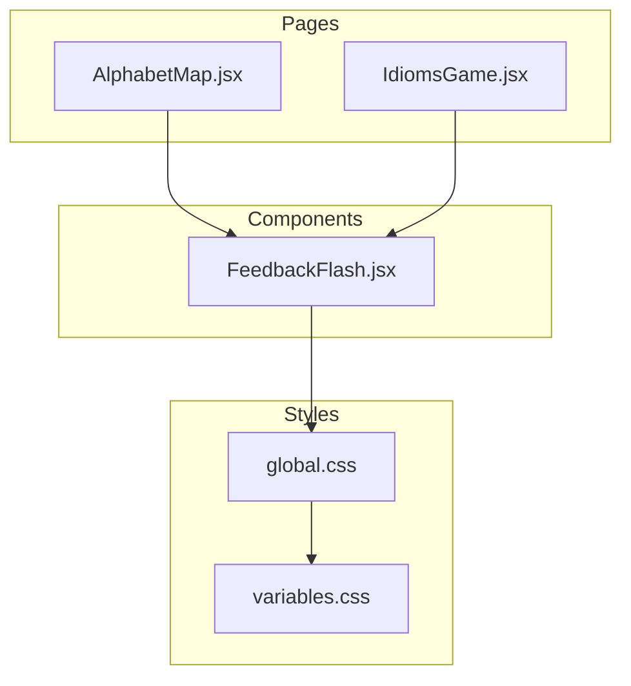
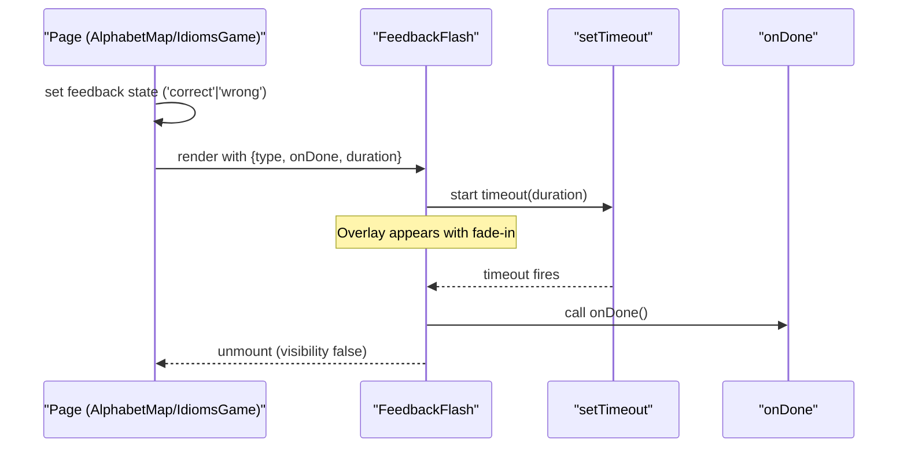
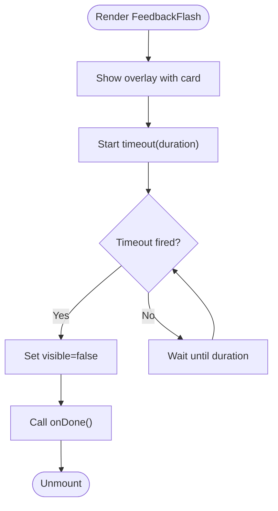
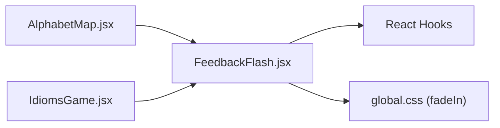

# FeedbackFlash Component

<cite>
**Referenced Files in This Document**
- [FeedbackFlash.jsx](file://zabandaan/client/src/components/FeedbackFlash.jsx)
- [AlphabetMap.jsx](file://zabandaan/client/src/pages/alphabets/AlphabetMap.jsx)
- [IdiomsGame.jsx](file://zabandaan/client/src/pages/idioms/IdiomsGame.jsx)
- [global.css](file://zabandaan/client/src/styles/global.css)
- [variables.css](file://zabandaan/client/src/styles/variables.css)
</cite>

## Table of Contents
1. [Introduction](#introduction)
2. [Project Structure](#project-structure)
3. [Core Components](#core-components)
4. [Architecture Overview](#architecture-overview)
5. [Detailed Component Analysis](#detailed-component-analysis)
6. [Dependency Analysis](#dependency-analysis)
7. [Performance Considerations](#performance-considerations)
8. [Troubleshooting Guide](#troubleshooting-guide)
9. [Conclusion](#conclusion)
10. [Appendices](#appendices)

## Introduction
The FeedbackFlash component is a lightweight, overlay-based notification used to provide immediate visual feedback for user actions such as correct or incorrect responses in interactive learning flows. It displays a centered card with an emoji and a short message, uses color-coded backgrounds to indicate success or error states, and automatically dismisses after a configurable duration. It integrates seamlessly into pages that need quick, non-blocking feedback without requiring additional UI state management beyond a simple boolean or string flag.

## Project Structure
FeedbackFlash lives under the components directory and is consumed by multiple pages:
- AlphabetMap page triggers feedback when a tracing activity completes.
- IdiomsGame page triggers feedback when a quiz option is selected.

**Diagram sources**
- [FeedbackFlash.jsx:1-49](file://zabandaan/client/src/components/FeedbackFlash.jsx#L1-L49)
- [AlphabetMap.jsx:1-249](file://zabandaan/client/src/pages/alphabets/AlphabetMap.jsx#L1-L249)
- [IdiomsGame.jsx:1-446](file://zabandaan/client/src/pages/idioms/IdiomsGame.jsx#L1-L446)
- [global.css:1-192](file://zabandaan/client/src/styles/global.css#L1-L192)
- [variables.css:1-23](file://zabandaan/client/src/styles/variables.css#L1-L23)

**Section sources**
- [FeedbackFlash.jsx:1-49](file://zabandaan/client/src/components/FeedbackFlash.jsx#L1-L49)
- [AlphabetMap.jsx:1-249](file://zabandaan/client/src/pages/alphabets/AlphabetMap.jsx#L1-L249)
- [IdiomsGame.jsx:1-446](file://zabandaan/client/src/pages/idioms/IdiomsGame.jsx#L1-L446)
- [global.css:1-192](file://zabandaan/client/src/styles/global.css#L1-L192)
- [variables.css:1-23](file://zabandaan/client/src/styles/variables.css#L1-L23)

## Core Components
FeedbackFlash is a functional React component that:
- Accepts props for feedback type, completion callback, and display duration.
- Maintains internal visibility state to control rendering.
- Uses a timer to auto-dismiss and invoke a done callback.
- Renders a full-screen overlay with a centered card, using color coding based on correctness.

Key behaviors:
- Visual appearance: fixed-position overlay with a white card, rounded corners, shadow, emoji icon, and a short status message.
- Color coding: green-tinted background for correct; red-tinted background for incorrect.
- Animation: a fade-in effect on mount via CSS animation.
- Auto-dismiss: hides itself after a configurable duration and calls an optional onDone callback.
- Manual close: not implemented; dismissal is automatic only.

Props interface:
- type: string indicating feedback kind (e.g., 'correct' or other values treated as incorrect).
- onDone?: function invoked when the flash is dismissed.
- duration?: number controlling how long the flash remains visible (default provided).

Usage patterns observed:
- Conditional rendering based on local state flags.
- Passing a handler to advance flow after dismissal.

**Section sources**
- [FeedbackFlash.jsx:1-49](file://zabandaan/client/src/components/FeedbackFlash.jsx#L1-L49)
- [AlphabetMap.jsx:48-67](file://zabandaan/client/src/pages/alphabets/AlphabetMap.jsx#L48-L67)
- [IdiomsGame.jsx:70-97](file://zabandaan/client/src/pages/idioms/IdiomsGame.jsx#L70-L97)

## Architecture Overview
FeedbackFlash is a presentational component with minimal logic. Pages manage state and decide when to show it. The component relies on inline styles for layout and color, and a global CSS animation for fade-in.

**Diagram sources**
- [FeedbackFlash.jsx:6-14](file://zabandaan/client/src/components/FeedbackFlash.jsx#L6-L14)
- [AlphabetMap.jsx:48-67](file://zabandaan/client/src/pages/alphabets/AlphabetMap.jsx#L48-L67)
- [IdiomsGame.jsx:70-97](file://zabandaan/client/src/pages/idioms/IdiomsGame.jsx#L70-L97)

## Detailed Component Analysis

### Visual Appearance
- Overlay: fixed position covering the viewport with a semi-transparent colored background.
- Card: white background, rounded corners, padding, and box shadow for emphasis.
- Icon: large emoji indicating correctness.
- Message: concise text indicating outcome.
- Colors:
  - Correct: green-tinted overlay and green heading text.
  - Incorrect: red-tinted overlay and red heading text.
- Animation: fade-in effect applied to the overlay.

Accessibility notes:
- The overlay uses pointer-events: none, so it does not capture interactions.
- No ARIA attributes are currently set on the overlay or card.
- Screen readers will not be explicitly announced unless aria-live regions or roles are added.

**Section sources**
- [FeedbackFlash.jsx:18-46](file://zabandaan/client/src/components/FeedbackFlash.jsx#L18-L46)
- [global.css:146-161](file://zabandaan/client/src/styles/global.css#L146-L161)
- [variables.css:12-13](file://zabandaan/client/src/styles/variables.css#L12-L13)

### Props Interface
- type: string
  - Purpose: determines visual feedback style and message content.
  - Values: 'correct' yields success visuals; any other value yields error visuals.
- onDone?: function
  - Purpose: invoked when the flash is dismissed.
  - Usage: typically advances to next step or resets state.
- duration?: number
  - Purpose: controls auto-dismiss delay in milliseconds.
  - Default: provided default ensures reasonable visibility time.

Example usage patterns:
- Trigger on form submission or interaction result.
- Pass a handler to update parent state after dismissal.

**Section sources**
- [FeedbackFlash.jsx:3-12](file://zabandaan/client/src/components/FeedbackFlash.jsx#L3-L12)
- [AlphabetMap.jsx:56-67](file://zabandaan/client/src/pages/alphabets/AlphabetMap.jsx#L56-L67)
- [IdiomsGame.jsx:70-97](file://zabandaan/client/src/pages/idioms/IdiomsGame.jsx#L70-L97)

### Automatic Dismissal and Manual Close
- Automatic dismissal:
  - Implemented via a timeout that sets visibility to false and invokes onDone.
  - Cleanup ensures timers are cleared on unmount.
- Manual close:
  - Not implemented; users cannot manually dismiss the flash.
  - If needed, add a close button and corresponding handler.

**Diagram sources**
- [FeedbackFlash.jsx:6-14](file://zabandaan/client/src/components/FeedbackFlash.jsx#L6-L14)

**Section sources**
- [FeedbackFlash.jsx:6-14](file://zabandaan/client/src/components/FeedbackFlash.jsx#L6-L14)

### Integration Patterns
- Form validation:
  - After validating inputs, set feedback state to 'correct' or 'wrong' to trigger FeedbackFlash.
  - Use onDone to proceed to next step or reset form fields.
- API responses:
  - On successful API calls, show 'correct' feedback; on errors, show 'wrong'.
  - Use onDone to navigate or update UI state.
- User action feedback:
  - For quizzes or exercises, show feedback immediately after selection.
  - Advance to next question or complete the task in onDone.

Observed integrations:
- AlphabetMap shows feedback upon completing a tracing activity and advances to the next letter.
- IdiomsGame shows feedback after selecting an answer and moves to the next question.

**Section sources**
- [AlphabetMap.jsx:48-67](file://zabandaan/client/src/pages/alphabets/AlphabetMap.jsx#L48-L67)
- [IdiomsGame.jsx:70-97](file://zabandaan/client/src/pages/idioms/IdiomsGame.jsx#L70-L97)

### Accessibility Considerations
Current implementation:
- No ARIA roles or labels are set on the overlay or card.
- No keyboard focus management; the overlay is non-interactive.
- No explicit screen reader announcements.

Recommendations:
- Add role="alert" and aria-live="assertive" to the overlay to announce messages to screen readers.
- Include descriptive aria-label or aria-describedby for context (e.g., "Correct! +1 Point").
- Ensure focus is not trapped; since the overlay is non-interactive, this is acceptable but confirm no accidental focus changes occur.
- Provide a manual close mechanism if appropriate, with a clearly labeled button and keyboard support.

**Section sources**
- [FeedbackFlash.jsx:18-46](file://zabandaan/client/src/components/FeedbackFlash.jsx#L18-L46)

## Dependency Analysis
FeedbackFlash depends on:
- React hooks: useState, useEffect for lifecycle and timing.
- Inline styles for layout and colors.
- Global CSS animation for fade-in effect.

Consumers:
- AlphabetMap: imports and renders FeedbackFlash conditionally.
- IdiomsGame: imports and renders FeedbackFlash conditionally.

**Diagram sources**
- [FeedbackFlash.jsx:1-49](file://zabandaan/client/src/components/FeedbackFlash.jsx#L1-L49)
- [global.css:146-161](file://zabandaan/client/src/styles/global.css#L146-L161)
- [AlphabetMap.jsx:1-249](file://zabandaan/client/src/pages/alphabets/AlphabetMap.jsx#L1-L249)
- [IdiomsGame.jsx:1-446](file://zabandaan/client/src/pages/idioms/IdiomsGame.jsx#L1-L446)

**Section sources**
- [FeedbackFlash.jsx:1-49](file://zabandaan/client/src/components/FeedbackFlash.jsx#L1-L49)
- [AlphabetMap.jsx:1-249](file://zabandaan/client/src/pages/alphabets/AlphabetMap.jsx#L1-L249)
- [IdiomsGame.jsx:1-446](file://zabandaan/client/src/pages/idioms/IdiomsGame.jsx#L1-L446)
- [global.css:146-161](file://zabandaan/client/src/styles/global.css#L146-L161)

## Performance Considerations
- Lightweight overlay: minimal DOM nodes and inline styles reduce reflows.
- Short-lived timers: timeouts are cleaned up on unmount to prevent memory leaks.
- Non-interactive overlay: pointer-events: none avoids unnecessary event handling.
- Animation: CSS fade-in is GPU-accelerated and brief, minimizing impact.

Potential optimizations:
- Extract styles to CSS classes for better maintainability and potential reuse.
- Consider debouncing rapid successive flashes to avoid frequent re-renders.
- Add manual close to improve user control and reduce perceived wait time.

[No sources needed since this section provides general guidance]

## Troubleshooting Guide
Common issues and resolutions:
- Flash not appearing:
  - Ensure parent component sets feedback state to a truthy value and renders FeedbackFlash conditionally.
  - Verify duration is positive and onDone does not immediately hide the overlay unintentionally.
- Flash persists indefinitely:
  - Check that duration prop is set correctly and onDone is not interfering with visibility state.
  - Confirm no other code resets visibility to true after unmount.
- No screen reader announcement:
  - Add ARIA attributes (role="alert", aria-live) to make announcements accessible.
- Keyboard navigation:
  - Since the overlay is non-interactive, ensure focus behavior remains unchanged; consider adding a close button if manual dismissal is required.

**Section sources**
- [FeedbackFlash.jsx:6-14](file://zabandaan/client/src/components/FeedbackFlash.jsx#L6-L14)
- [AlphabetMap.jsx:56-67](file://zabandaan/client/src/pages/alphabets/AlphabetMap.jsx#L56-L67)
- [IdiomsGame.jsx:70-97](file://zabandaan/client/src/pages/idioms/IdiomsGame.jsx#L70-L97)

## Conclusion
FeedbackFlash provides a simple, effective way to deliver immediate visual feedback in interactive flows. It supports color-coded messaging, automatic dismissal, and integration with common application states. To enhance accessibility and user control, consider adding ARIA attributes and a manual close mechanism. Its minimal design keeps performance high while delivering clear feedback for user actions.

[No sources needed since this section summarizes without analyzing specific files]

## Appendices

### Usage Examples
- Triggering from form validation:
  - Set feedback state to 'correct' or 'wrong' based on validation results.
  - Use onDone to proceed or reset the form.
- Handling API responses:
  - Show 'correct' on success and 'wrong' on failure.
  - Use onDone to navigate or update UI state.
- User action feedback:
  - In quizzes or exercises, show feedback immediately after selection.
  - Advance to next question or complete the task in onDone.

Observed examples:
- AlphabetMap: shows feedback after completing a tracing activity and advances to the next letter.
- IdiomsGame: shows feedback after selecting an answer and moves to the next question.

**Section sources**
- [AlphabetMap.jsx:48-67](file://zabandaan/client/src/pages/alphabets/AlphabetMap.jsx#L48-L67)
- [IdiomsGame.jsx:70-97](file://zabandaan/client/src/pages/idioms/IdiomsGame.jsx#L70-L97)