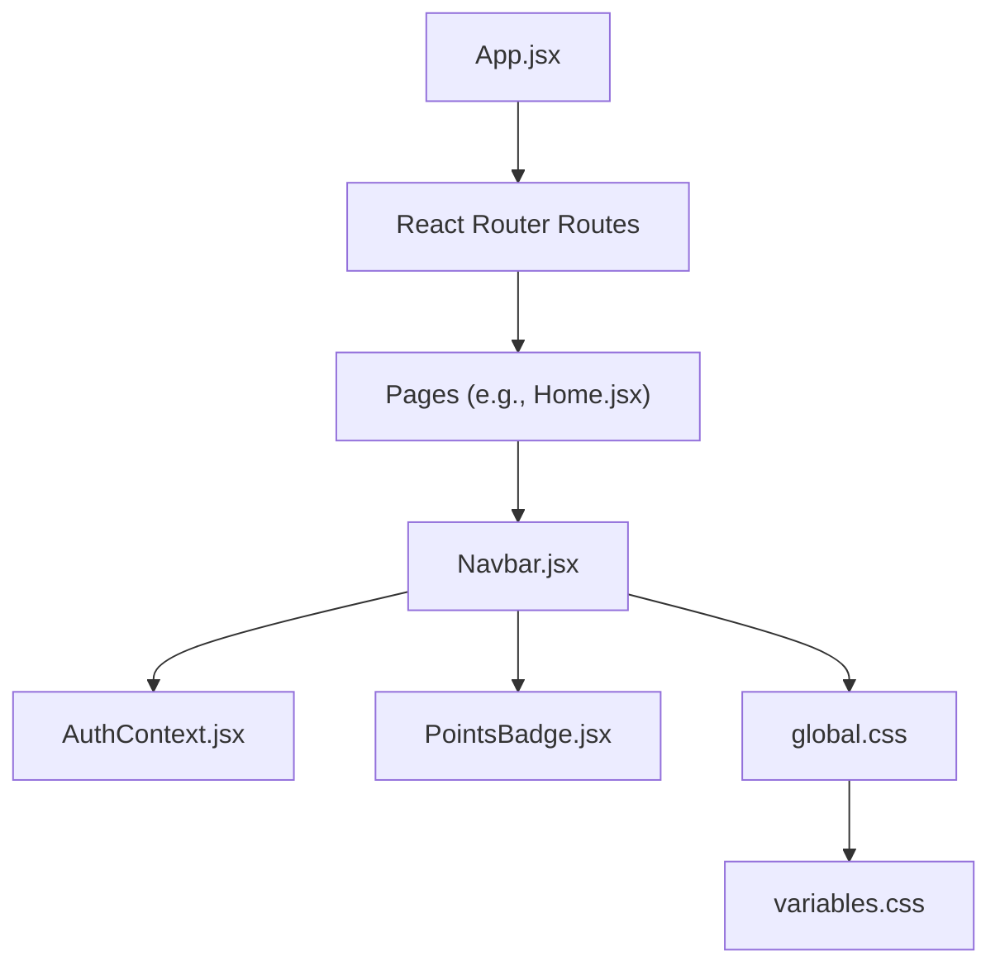
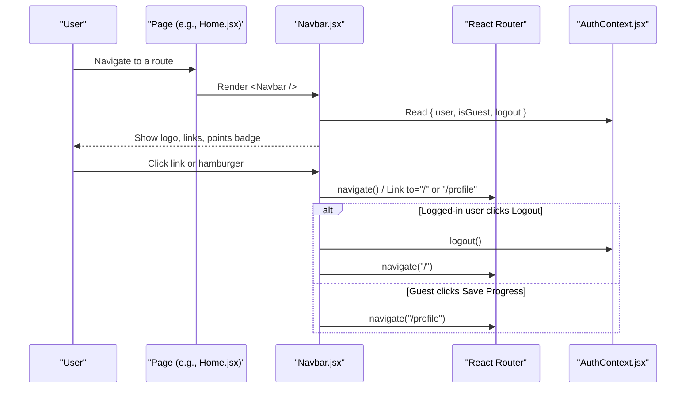
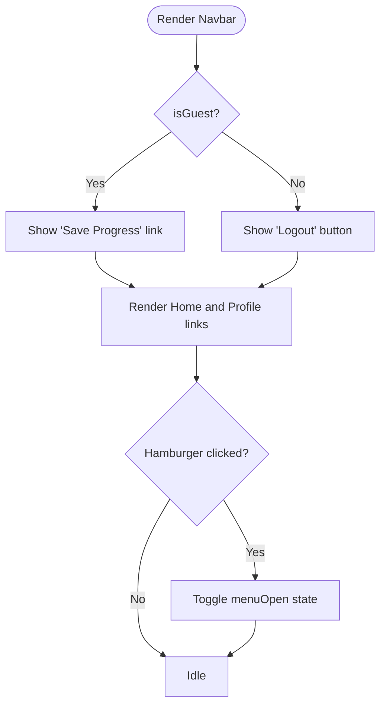
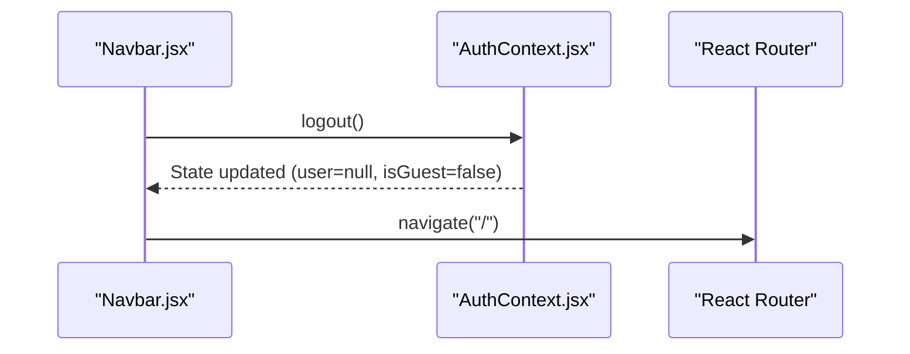
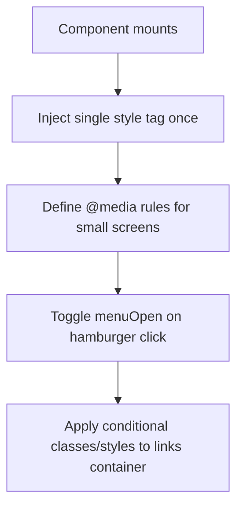
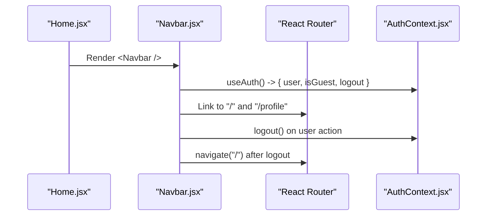
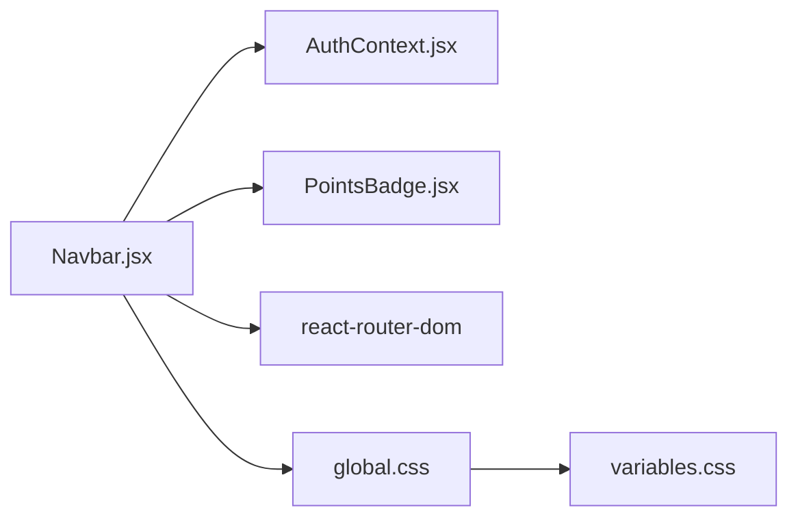

# Navbar Component

<cite>
**Referenced Files in This Document**
- [Navbar.jsx](file://zabandaan/client/src/components/Navbar.jsx)
- [AuthContext.jsx](file://zabandaan/client/src/context/AuthContext.jsx)
- [PointsBadge.jsx](file://zabandaan/client/src/components/PointsBadge.jsx)
- [App.jsx](file://zabandaan/client/src/App.jsx)
- [Home.jsx](file://zabandaan/client/src/pages/Home.jsx)
- [global.css](file://zabandaan/client/src/styles/global.css)
- [variables.css](file://zabandaan/client/src/styles/variables.css)
</cite>

## Table of Contents
1. [Introduction](#introduction)
2. [Project Structure](#project-structure)
3. [Core Components](#core-components)
4. [Architecture Overview](#architecture-overview)
5. [Detailed Component Analysis](#detailed-component-analysis)
6. [Dependency Analysis](#dependency-analysis)
7. [Performance Considerations](#performance-considerations)
8. [Troubleshooting Guide](#troubleshooting-guide)
9. [Conclusion](#conclusion)
10. [Appendices](#appendices)

## Introduction
This document provides detailed documentation for the Navbar component, focusing on navigation functionality and responsive design. It explains how the navbar renders a logo, navigation links, and a mobile hamburger menu; how it behaves interactively with authentication-aware routing (guest vs logged-in users); and how to integrate it with React Router and the application’s authentication context. It also covers accessibility considerations, styling approach using inline styles and injected media queries, and best practices for cross-browser compatibility.

## Project Structure
The Navbar is a top-level UI element used across multiple pages. It integrates with:
- React Router for navigation
- AuthContext for user state and logout
- PointsContext via PointsBadge to display points
- Inline styles and an injected style tag for responsive behavior

**Diagram sources**
- [App.jsx:1-66](file://zabandaan/client/src/App.jsx#L1-L66)
- [Home.jsx:1-219](file://zabandaan/client/src/pages/Home.jsx#L1-L219)
- [Navbar.jsx:1-142](file://zabandaan/client/src/components/Navbar.jsx#L1-L142)
- [AuthContext.jsx:1-97](file://zabandaan/client/src/context/AuthContext.jsx#L1-L97)
- [PointsBadge.jsx:1-24](file://zabandaan/client/src/components/PointsBadge.jsx#L1-L24)
- [global.css:1-192](file://zabandaan/client/src/styles/global.css#L1-L192)
- [variables.css:1-23](file://zabandaan/client/src/styles/variables.css#L1-L23)

**Section sources**
- [App.jsx:1-66](file://zabandaan/client/src/App.jsx#L1-L66)
- [Home.jsx:1-219](file://zabandaan/client/src/pages/Home.jsx#L1-L219)
- [Navbar.jsx:1-142](file://zabandaan/client/src/components/Navbar.jsx#L1-L142)

## Core Components
- Navbar: Renders the sticky header with logo, points badge, hamburger toggle, and navigation links that change based on authentication state.
- AuthContext: Provides user state, guest mode flag, and logout function consumed by Navbar.
- PointsBadge: Displays current points and animation state from PointsContext.
- App and Pages: Integrate Navbar into the app shell and demonstrate usage within React Router routes.

Key responsibilities:
- Navigation: Links to Home and Profile; conditional “Save Progress” or “Logout” based on guest vs logged-in state.
- Mobile UX: Hamburger button toggles a mobile menu overlay.
- Authentication-aware UI: Shows different actions depending on whether the user is authenticated or a guest.
- Styling: Uses inline styles for layout and color; injects a single style tag for responsive rules.

**Section sources**
- [Navbar.jsx:1-142](file://zabandaan/client/src/components/Navbar.jsx#L1-L142)
- [AuthContext.jsx:1-97](file://zabandaan/client/src/context/AuthContext.jsx#L1-L97)
- [PointsBadge.jsx:1-24](file://zabandaan/client/src/components/PointsBadge.jsx#L1-L24)
- [App.jsx:1-66](file://zabandaan/client/src/App.jsx#L1-L66)
- [Home.jsx:1-219](file://zabandaan/client/src/pages/Home.jsx#L1-L219)

## Architecture Overview
The Navbar sits at the top of each page and consumes global state to render appropriate navigation items. It uses React Router for client-side navigation and the AuthContext to determine whether to show guest-specific actions or a logout action.

**Diagram sources**
- [Navbar.jsx:1-142](file://zabandaan/client/src/components/Navbar.jsx#L1-L142)
- [AuthContext.jsx:1-97](file://zabandaan/client/src/context/AuthContext.jsx#L1-L97)
- [Home.jsx:1-219](file://zabandaan/client/src/pages/Home.jsx#L1-L219)

## Detailed Component Analysis

### Navbar Component
- Visual appearance:
  - Sticky header with white background and subtle shadow.
  - Logo area with a circular icon and brand text.
  - Points badge integrated next to the logo.
  - Hamburger button visible on small screens to toggle the menu.
  - Navigation links: Home, Profile, and either “Save Progress” (for guests) or “Logout” (for logged-in users).
- Interactive behavior:
  - Menu toggle: A local state controls open/closed state of the mobile menu.
  - Authentication-aware rendering:
    - If isGuest is true, shows a styled “Save Progress” link.
    - Otherwise, shows a bordered “Logout” button that calls logout and navigates home.
  - Integration with React Router:
    - Uses Link components for Home and Profile.
    - Uses useNavigate for programmatic navigation after logout.
- Accessibility considerations:
  - The hamburger button is a native button element with a click handler.
  - Links are semantic anchor elements provided by React Router.
  - Focus management: When closing the menu via link clicks, focus remains on the clicked link; no explicit focus trap is implemented.
  - Screen reader support: Basic semantics are present; adding aria attributes would improve clarity (see Troubleshooting Guide).
- Styling approach:
  - Inline styles define layout, colors, spacing, and basic interactions.
  - A single style tag is injected once to host responsive rules; currently contains a placeholder media query block.

**Diagram sources**
- [Navbar.jsx:1-142](file://zabandaan/client/src/components/Navbar.jsx#L1-L142)

**Section sources**
- [Navbar.jsx:1-142](file://zabandaan/client/src/components/Navbar.jsx#L1-L142)

### Authentication Flow and Logout Handling
- The Navbar reads user state and guest flag from AuthContext and triggers logout when needed.
- Logout clears persisted session data and resets state in AuthContext, then navigates to the home route.

**Diagram sources**
- [Navbar.jsx:1-142](file://zabandaan/client/src/components/Navbar.jsx#L1-L142)
- [AuthContext.jsx:1-97](file://zabandaan/client/src/context/AuthContext.jsx#L1-L97)

**Section sources**
- [AuthContext.jsx:1-97](file://zabandaan/client/src/context/AuthContext.jsx#L1-L97)
- [Navbar.jsx:1-142](file://zabandaan/client/src/components/Navbar.jsx#L1-L142)

### Responsive Design Implementation
- Desktop-first layout:
  - Flexbox row with logo, points badge, and links aligned horizontally.
  - Hamburger button is hidden by default.
- Mobile-first adjustments:
  - A style tag is injected once to add responsive rules under a breakpoint.
  - Current implementation includes a placeholder media query targeting the hamburger button; additional rules can be added to fully implement a mobile menu layout (e.g., stacking links vertically and showing/hiding them based on menuOpen).
- Breakpoint handling:
  - The injected style tag targets a max-width breakpoint consistent with other responsive rules in the project.

**Diagram sources**
- [Navbar.jsx:1-142](file://zabandaan/client/src/components/Navbar.jsx#L1-L142)
- [global.css:182-192](file://zabandaan/client/src/styles/global.css#L182-L192)

**Section sources**
- [Navbar.jsx:131-142](file://zabandaan/client/src/components/Navbar.jsx#L131-L142)
- [global.css:182-192](file://zabandaan/client/src/styles/global.css#L182-L192)

### Usage Examples
- Integrating with React Router:
  - The Navbar uses Link components for Home and Profile, and useNavigate for programmatic navigation after logout.
  - Example integration appears in pages like Home.jsx where Navbar is rendered at the top of the page content.
- Integrating with authentication context:
  - Navbar consumes AuthContext to read user, isGuest, and logout.
  - Conditional rendering displays “Save Progress” for guests and “Logout” for authenticated users.

**Diagram sources**
- [Home.jsx:1-219](file://zabandaan/client/src/pages/Home.jsx#L1-L219)
- [Navbar.jsx:1-142](file://zabandaan/client/src/components/Navbar.jsx#L1-L142)
- [AuthContext.jsx:1-97](file://zabandaan/client/src/context/AuthContext.jsx#L1-L97)

**Section sources**
- [Home.jsx:1-219](file://zabandaan/client/src/pages/Home.jsx#L1-L219)
- [Navbar.jsx:1-142](file://zabandaan/client/src/components/Navbar.jsx#L1-L142)

### Accessibility Features
- Keyboard navigation:
  - Native buttons and links are keyboard-focusable by default.
  - No custom key handlers are implemented; standard browser behavior applies.
- Screen reader support:
  - Semantic HTML elements (nav, button, a) provide basic structure.
  - Adding aria-labels to the hamburger and descriptive roles could improve clarity.
- Focus management:
  - On menu close via link clicks, focus remains on the clicked link.
  - For enhanced UX, consider moving focus to the first link when opening the menu and trapping focus while the menu is open.

[No sources needed since this section provides general guidance]

### Styling Approach
- Inline styles:
  - Used for layout, colors, spacing, and interactive states.
  - Ensures component self-contained styling without external CSS dependencies.
- CSS media queries:
  - A single style tag is injected once to host responsive rules.
  - The project’s global.css defines responsive breakpoints and base styles; variables.css centralizes design tokens.

**Section sources**
- [Navbar.jsx:52-142](file://zabandaan/client/src/components/Navbar.jsx#L52-L142)
- [global.css:1-192](file://zabandaan/client/src/styles/global.css#L1-L192)
- [variables.css:1-23](file://zabandaan/client/src/styles/variables.css#L1-L23)

## Dependency Analysis
The Navbar depends on several modules and contexts:

**Diagram sources**
- [Navbar.jsx:1-142](file://zabandaan/client/src/components/Navbar.jsx#L1-L142)
- [AuthContext.jsx:1-97](file://zabandaan/client/src/context/AuthContext.jsx#L1-L97)
- [PointsBadge.jsx:1-24](file://zabandaan/client/src/components/PointsBadge.jsx#L1-L24)
- [global.css:1-192](file://zabandaan/client/src/styles/global.css#L1-L192)
- [variables.css:1-23](file://zabandaan/client/src/styles/variables.css#L1-L23)

**Section sources**
- [Navbar.jsx:1-142](file://zabandaan/client/src/components/Navbar.jsx#L1-L142)
- [AuthContext.jsx:1-97](file://zabandaan/client/src/context/AuthContext.jsx#L1-L97)
- [PointsBadge.jsx:1-24](file://zabandaan/client/src/components/PointsBadge.jsx#L1-L24)

## Performance Considerations
- Minimal re-renders:
  - Local state for menu toggle ensures only necessary parts update.
  - Context consumption avoids unnecessary parent re-renders if structured properly.
- Style injection:
  - Injecting a single style tag once prevents repeated DOM mutations.
- Navigation:
  - Using React Router’s Link and useNavigate avoids full page reloads.

[No sources needed since this section provides general guidance]

## Troubleshooting Guide
- Mobile menu not visible:
  - Ensure the injected style tag contains complete media query rules to show/hide the menu and stack links vertically on small screens.
  - Verify that the hamburger button is not overridden by global styles.
- Logout does not redirect:
  - Confirm that logout clears persisted tokens and that useNavigate is called after logout.
  - Check that AuthContext’s logout function is invoked and that the router is available.
- Accessibility improvements:
  - Add aria-label to the hamburger button describing its state (open/close).
  - Consider adding role="navigation" to the nav element and aria-expanded to the hamburger to indicate menu state.
  - Implement focus trapping within the mobile menu when open for better keyboard navigation.

**Section sources**
- [Navbar.jsx:1-142](file://zabandaan/client/src/components/Navbar.jsx#L1-L142)
- [AuthContext.jsx:1-97](file://zabandaan/client/src/context/AuthContext.jsx#L1-L97)

## Conclusion
The Navbar component provides a clean, responsive header with authentication-aware navigation and a simple mobile menu. It integrates seamlessly with React Router and the application’s authentication context. While the current responsive implementation includes a placeholder media query, extending it will deliver a fully functional mobile experience. Enhancing accessibility with ARIA attributes and focus management will further improve usability for all users.

[No sources needed since this section summarizes without analyzing specific files]

## Appendices

### Integration Checklist
- Wrap your app with BrowserRouter and AuthProvider so Navbar can access auth state and routing.
- Import and render Navbar at the top of pages that require navigation.
- Ensure global.css and variables.css are included for consistent styling.

**Section sources**
- [App.jsx:1-66](file://zabandaan/client/src/App.jsx#L1-L66)
- [Home.jsx:1-219](file://zabandaan/client/src/pages/Home.jsx#L1-L219)
- [global.css:1-192](file://zabandaan/client/src/styles/global.css#L1-L192)
- [variables.css:1-23](file://zabandaan/client/src/styles/variables.css#L1-L23)