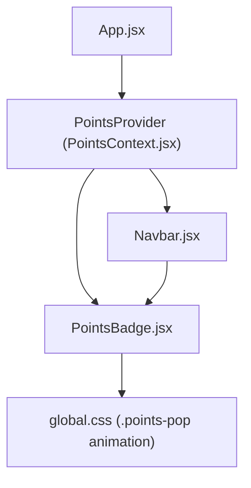
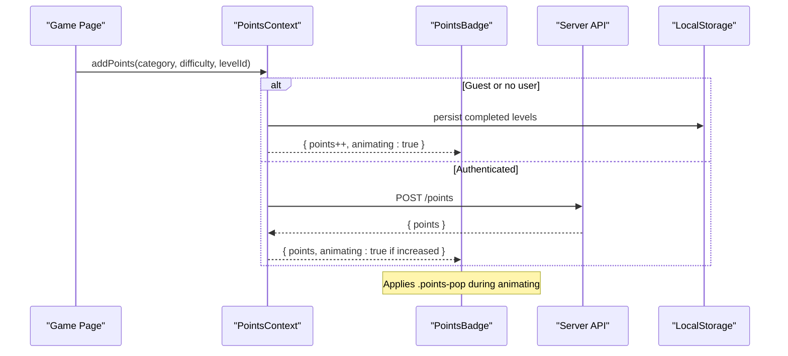
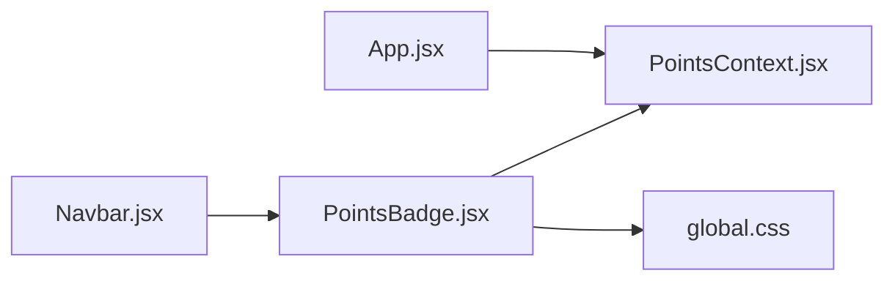

# PointsBadge Component

<cite>
**Referenced Files in This Document**
- [PointsBadge.jsx](file://zabandaan/client/src/components/PointsBadge.jsx)
- [PointsContext.jsx](file://zabandaan/client/src/context/PointsContext.jsx)
- [Navbar.jsx](file://zabandaan/client/src/components/Navbar.jsx)
- [global.css](file://zabandaan/client/src/styles/global.css)
- [App.jsx](file://zabandaan/client/src/App.jsx)
</cite>

## Table of Contents
1. [Introduction](#introduction)
2. [Project Structure](#project-structure)
3. [Core Components](#core-components)
4. [Architecture Overview](#architecture-overview)
5. [Detailed Component Analysis](#detailed-component-analysis)
6. [Dependency Analysis](#dependency-analysis)
7. [Performance Considerations](#performance-considerations)
8. [Troubleshooting Guide](#troubleshooting-guide)
9. [Conclusion](#conclusion)

## Introduction
This document provides comprehensive documentation for the PointsBadge component, which displays a gamified points counter with animated transitions. It explains how the component integrates with global state via PointsContext to reflect real-time score updates across the application, including guest and authenticated user flows. The guide covers visual appearance, props interface (as used by the component), integration patterns, responsive behavior, performance considerations, and troubleshooting tips.

## Project Structure
The PointsBadge component is part of a React application that uses context-based state management for points tracking. The relevant files include:
- A presentational component that renders the badge UI
- A context provider that manages points state and synchronization with local storage or server
- A navigation component that includes the badge
- Global styles defining animations
- Application bootstrap that wraps routes with the context provider

**Diagram sources**
- [App.jsx:55-66](file://zabandaan/client/src/App.jsx#L55-L66)
- [PointsContext.jsx:102-107](file://zabandaan/client/src/context/PointsContext.jsx#L102-L107)
- [PointsBadge.jsx:1-24](file://zabandaan/client/src/components/PointsBadge.jsx#L1-L24)
- [Navbar.jsx:1-50](file://zabandaan/client/src/components/Navbar.jsx#L1-L50)
- [global.css:163-171](file://zabandaan/client/src/styles/global.css#L163-L171)

**Section sources**
- [App.jsx:55-66](file://zabandaan/client/src/App.jsx#L55-L66)
- [PointsContext.jsx:1-114](file://zabandaan/client/src/context/PointsContext.jsx#L1-L114)
- [PointsBadge.jsx:1-24](file://zabandaan/client/src/components/PointsBadge.jsx#L1-L24)
- [Navbar.jsx:1-50](file://zabandaan/client/src/components/Navbar.jsx#L1-L50)
- [global.css:163-171](file://zabandaan/client/src/styles/global.css#L163-L171)

## Core Components
- PointsBadge: A lightweight presentational component that reads current points and an animation flag from context and renders a styled badge with a star icon and the numeric point value. When animating, it applies a CSS class to trigger a pop animation.
- PointsContext: Provides global points state, methods to add points, set total points, load points, and manage guest progress. It handles both local storage (guest mode) and API calls (authenticated users).
- Navbar: Integrates PointsBadge into the top navigation bar.
- Global Styles: Define the .points-pop animation used when points update.

Key responsibilities:
- PointsBadge focuses on display and minimal logic (reading context values and applying classes).
- PointsContext centralizes state and side effects for points updates.
- Navbar positions the badge within the app’s header.
- Global CSS ensures smooth, consistent animations.

**Section sources**
- [PointsBadge.jsx:1-24](file://zabandaan/client/src/components/PointsBadge.jsx#L1-L24)
- [PointsContext.jsx:1-114](file://zabandaan/client/src/context/PointsContext.jsx#L1-L114)
- [Navbar.jsx:1-50](file://zabandaan/client/src/components/Navbar.jsx#L1-L50)
- [global.css:163-171](file://zabandaan/client/src/styles/global.css#L163-L171)

## Architecture Overview
The PointsBadge component consumes global state from PointsContext. When points increase, the context triggers an animation flag that the badge uses to apply a CSS animation. For authenticated users, points are synchronized with the server; for guests, they are persisted locally.

**Diagram sources**
- [PointsContext.jsx:12-46](file://zabandaan/client/src/context/PointsContext.jsx#L12-L46)
- [PointsContext.jsx:52-75](file://zabandaan/client/src/context/PointsContext.jsx#L52-L75)
- [PointsBadge.jsx:1-24](file://zabandaan/client/src/components/PointsBadge.jsx#L1-L24)
- [global.css:163-171](file://zabandaan/client/src/styles/global.css#L163-L171)

## Detailed Component Analysis

### PointsBadge Visual Appearance
- Layout: Flex container with aligned items and spacing.
- Styling: Warm background color, orange border, rounded corners, bold text, and orange text color.
- Content: Star emoji followed by the current points value.
- Animation: When the context reports animating, the points span receives a CSS class that triggers a scale-up-and-back animation.

Implementation highlights:
- Reads points and animating from context.
- Conditionally applies the animation class based on animating state.
- Uses inline styles for layout and colors.

**Section sources**
- [PointsBadge.jsx:1-24](file://zabandaan/client/src/components/PointsBadge.jsx#L1-L24)
- [global.css:163-171](file://zabandaan/client/src/styles/global.css#L163-L171)

### Props Interface
- The component does not accept external props. It derives all data from context.
- Data binding:
  - points: Current total points (number)
  - animating: Boolean indicating whether to show the pop animation
- Display formatting:
  - Renders the raw number directly.
  - No additional formatting options are provided by the component itself.
- Update callbacks:
  - Not exposed by the component; updates originate from context methods like addPoints or setTotalPoints.

If you need custom formatting or callbacks, extend the component to accept props and pass them through while still consuming context for core state.

**Section sources**
- [PointsBadge.jsx:1-24](file://zabandaan/client/src/components/PointsBadge.jsx#L1-L24)
- [PointsContext.jsx:102-107](file://zabandaan/client/src/context/PointsContext.jsx#L102-L107)

### Integration with PointsContext for Real-Time Updates
- The component uses the usePoints hook to access points and animating.
- Context manages:
  - Local guest progress persistence
  - Server synchronization for authenticated users
  - Animation toggling on point increases
- Integration pattern:
  - Wrap your app with PointsProvider so components can consume points state.
  - Use addPoints in game logic to increment scores; the badge will automatically reflect changes and animate.

Usage example overview:
- In any page or component, call addPoints with category, difficulty, and levelId to award points.
- The PointsBadge will update instantly and animate when points increase.

**Section sources**
- [PointsContext.jsx:12-46](file://zabandaan/client/src/context/PointsContext.jsx#L12-L46)
- [PointsContext.jsx:52-75](file://zabandaan/client/src/context/PointsContext.jsx#L52-L75)
- [PointsContext.jsx:102-107](file://zabandaan/client/src/context/PointsContext.jsx#L102-L107)
- [PointsBadge.jsx:1-24](file://zabandaan/client/src/components/PointsBadge.jsx#L1-L24)

### Responsive Design Implementation
- The badge uses inline styles with fixed font sizes and padding.
- The surrounding Navbar positions the badge within a flex container.
- There are no explicit media queries targeting the badge itself; responsiveness relies on the parent layout and general app-wide responsive rules.
- To ensure proper display on small screens:
  - Consider reducing font size and padding via media queries scoped to the badge or its container.
  - Ensure the navbar layout collapses gracefully on mobile so the badge remains visible and readable.

Recommendations:
- Add responsive styles to reduce badge size on narrow viewports.
- Test at common breakpoints (e.g., 320px, 375px, 768px) to verify readability and alignment.

[No sources needed since this section provides general guidance]

### Animated Transitions for Point Updates
- Animation trigger: When points increase, the context sets animating to true briefly.
- CSS animation: The .points-pop class applies a keyframe animation that scales the element up and back.
- Timing: The animation duration is short to provide immediate feedback without disrupting UX.

Behavioral flow:
- Points increase -> animating becomes true -> CSS class applied -> animation plays -> animating resets after timeout.

**Section sources**
- [PointsContext.jsx:21-25](file://zabandaan/client/src/context/PointsContext.jsx#L21-L25)
- [PointsContext.jsx:34-41](file://zabandaan/client/src/context/PointsContext.jsx#L34-L41)
- [global.css:163-171](file://zabandaan/client/src/styles/global.css#L163-L171)

### Usage Examples and Integration Patterns
- Place PointsBadge inside the Navbar where it is already included.
- In game pages, call addPoints upon successful actions to award points.
- Use setTotalPoints to initialize or correct totals when loading state.
- Use loadPoints on app start to sync points from server or compute guest totals.

Integration checklist:
- Ensure PointsProvider wraps the app tree.
- Consume usePoints in components that need to update or read points.
- Keep presentation simple in PointsBadge; handle business logic in context or calling components.

**Section sources**
- [Navbar.jsx:1-50](file://zabandaan/client/src/components/Navbar.jsx#L1-L50)
- [PointsContext.jsx:12-46](file://zabandaan/client/src/context/PointsContext.jsx#L12-L46)
- [PointsContext.jsx:48-75](file://zabandaan/client/src/context/PointsContext.jsx#L48-L75)
- [App.jsx:55-66](file://zabandaan/client/src/App.jsx#L55-L66)

## Dependency Analysis
PointsBadge depends on:
- PointsContext for state and methods
- Global CSS for animation styling
- Navbar for placement within the app shell

**Diagram sources**
- [PointsBadge.jsx:1-24](file://zabandaan/client/src/components/PointsBadge.jsx#L1-L24)
- [PointsContext.jsx:102-107](file://zabandaan/client/src/context/PointsContext.jsx#L102-L107)
- [global.css:163-171](file://zabandaan/client/src/styles/global.css#L163-L171)
- [Navbar.jsx:1-50](file://zabandaan/client/src/components/Navbar.jsx#L1-L50)
- [App.jsx:55-66](file://zabandaan/client/src/App.jsx#L55-L66)

**Section sources**
- [PointsBadge.jsx:1-24](file://zabandaan/client/src/components/PointsBadge.jsx#L1-L24)
- [PointsContext.jsx:102-107](file://zabandaan/client/src/context/PointsContext.jsx#L102-L107)
- [global.css:163-171](file://zabandaan/client/src/styles/global.css#L163-L171)
- [Navbar.jsx:1-50](file://zabandaan/client/src/components/Navbar.jsx#L1-L50)
- [App.jsx:55-66](file://zabandaan/client/src/App.jsx#L55-L66)

## Performance Considerations
- Frequent updates:
  - The context batches updates and only toggles animating briefly to avoid excessive re-renders.
  - Animations are CSS-driven, minimizing JavaScript overhead.
- Optimization opportunities:
  - Memoize derived values in components that render frequently around the badge.
  - Avoid unnecessary re-renders by ensuring parent components do not force re-renders on every tick.
  - If adding more complex badges, consider using React.memo to prevent redundant renders when context values haven’t changed.
- Network considerations:
  - For authenticated users, batch or debounce rapid point updates if necessary to reduce API calls.
  - Handle network errors gracefully to keep UI consistent.

[No sources needed since this section provides general guidance]

## Troubleshooting Guide
Common issues and resolutions:
- Badge not updating:
  - Verify that PointsProvider wraps the app tree.
  - Ensure addPoints or setTotalPoints is called when scoring occurs.
- Animation not playing:
  - Confirm that animating is set to true when points increase.
  - Check that .points-pop class is applied and global CSS is loaded.
- Guest vs. authenticated discrepancies:
  - For guests, points are stored in localStorage; ensure keys are consistent and not cleared unexpectedly.
  - For authenticated users, check API responses and error handling in context.
- Mobile display issues:
  - Review parent layout constraints and consider adding responsive styles for smaller screens.

**Section sources**
- [PointsContext.jsx:12-46](file://zabandaan/client/src/context/PointsContext.jsx#L12-L46)
- [PointsContext.jsx:52-75](file://zabandaan/client/src/context/PointsContext.jsx#L52-L75)
- [global.css:163-171](file://zabandaan/client/src/styles/global.css#L163-L171)
- [App.jsx:55-66](file://zabandaan/client/src/App.jsx#L55-L66)

## Conclusion
The PointsBadge component offers a clean, animated display for gamification points, tightly integrated with a robust PointsContext that supports both guest and authenticated workflows. Its simplicity makes it easy to embed in headers or other UI areas, while the context ensures consistent state and smooth animations. For best results, follow the integration patterns outlined here, consider responsive enhancements for smaller screens, and leverage the performance tips to maintain a fluid user experience during frequent updates.