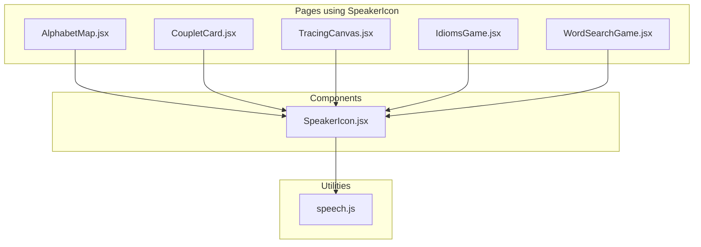
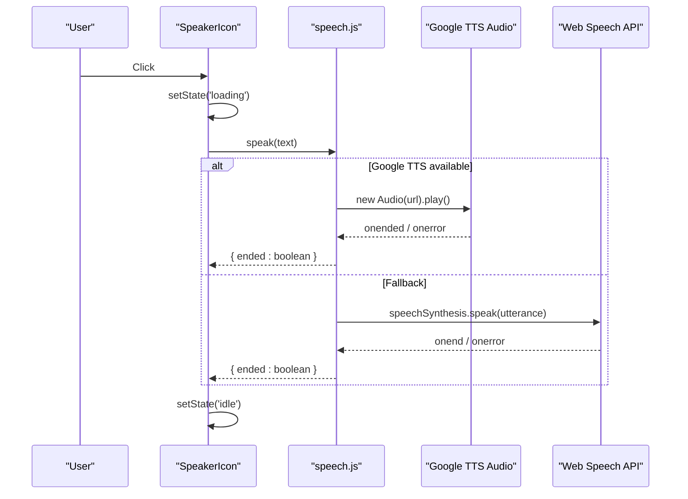
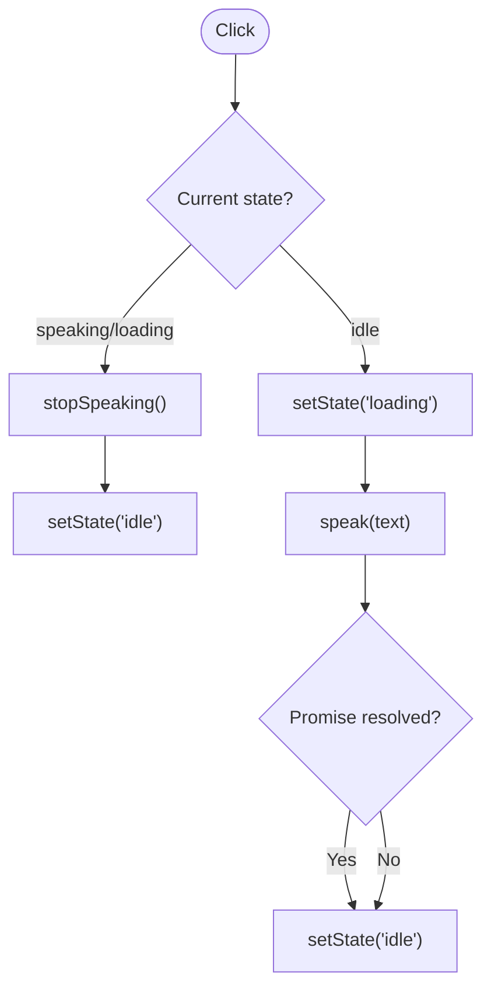
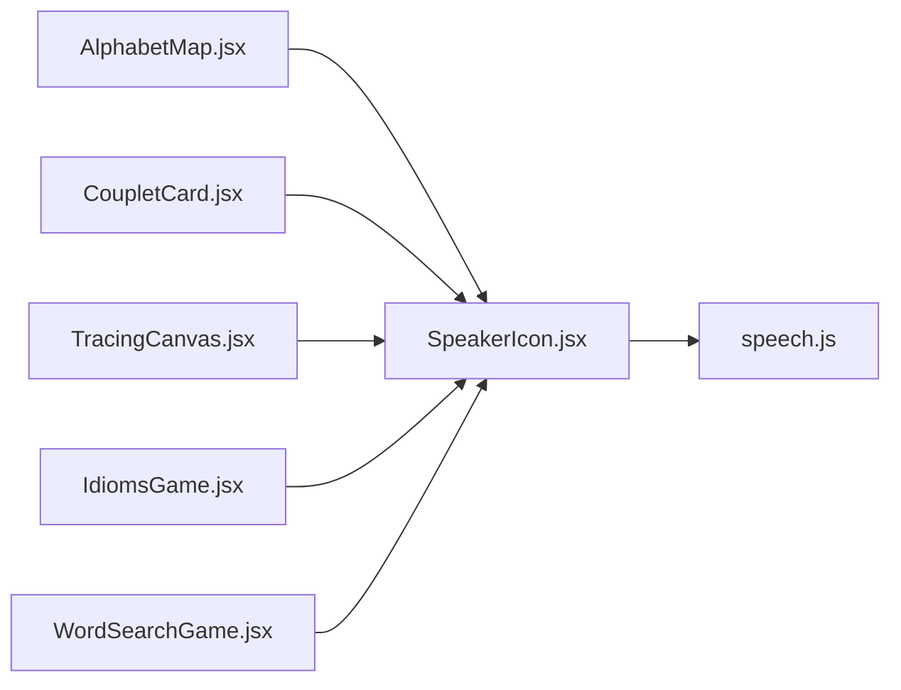
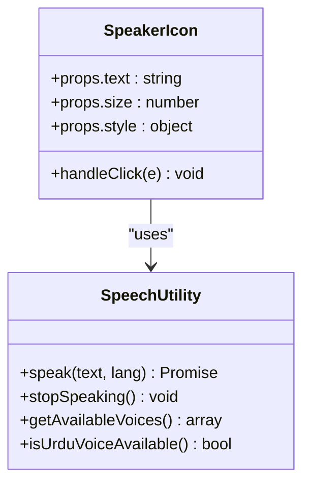

# SpeakerIcon Component

<cite>
**Referenced Files in This Document**
- [SpeakerIcon.jsx](file://zabandaan/client/src/components/SpeakerIcon.jsx)
- [speech.js](file://zabandaan/client/src/utils/speech.js)
- [AlphabetMap.jsx](file://zabandaan/client/src/pages/alphabets/AlphabetMap.jsx)
- [CoupletCard.jsx](file://zabandaan/client/src/pages/poetry/CoupletCard.jsx)
- [TracingCanvas.jsx](file://zabandaan/client/src/pages/alphabets/TracingCanvas.jsx)
- [IdiomsGame.jsx](file://zabandaan/client/src/pages/idioms/IdiomsGame.jsx)
- [WordSearchGame.jsx](file://zabandaan/client/src/pages/wordsearch/WordSearchGame.jsx)
- [variables.css](file://zabandaan/client/src/styles/variables.css)
</cite>

## Table of Contents
1. [Introduction](#introduction)
2. [Project Structure](#project-structure)
3. [Core Components](#core-components)
4. [Architecture Overview](#architecture-overview)
5. [Detailed Component Analysis](#detailed-component-analysis)
6. [Dependency Analysis](#dependency-analysis)
7. [Performance Considerations](#performance-considerations)
8. [Troubleshooting Guide](#troubleshooting-guide)
9. [Conclusion](#conclusion)
10. [Appendices](#appendices)

## Introduction
The SpeakerIcon component is a lightweight, accessible audio control that triggers text-to-speech playback for any provided text. It integrates with a speech utility to play audio via Google Translate TTS as the primary method and falls back to the Web Speech API when needed. The component provides clear visual feedback during playback, supports keyboard interaction, and exposes ARIA attributes for screen readers.

## Project Structure
The SpeakerIcon component lives under client components and consumes a shared speech utility. It is used across multiple learning pages (alphabets, poetry, idioms, word search) to pronounce words or phrases.

**Diagram sources**
- [SpeakerIcon.jsx:1-67](file://zabandaan/client/src/components/SpeakerIcon.jsx#L1-L67)
- [speech.js:1-176](file://zabandaan/client/src/utils/speech.js#L1-L176)
- [AlphabetMap.jsx:120-130](file://zabandaan/client/src/pages/alphabets/AlphabetMap.jsx#L120-L130)
- [CoupletCard.jsx:70-73](file://zabandaan/client/src/pages/poetry/CoupletCard.jsx#L70-L73)
- [TracingCanvas.jsx:270-275](file://zabandaan/client/src/pages/alphabets/TracingCanvas.jsx#L270-L275)
- [IdiomsGame.jsx:195-200](file://zabandaan/client/src/pages/idioms/IdiomsGame.jsx#L195-L200)
- [WordSearchGame.jsx:140-145](file://zabandaan/client/src/pages/wordsearch/WordSearchGame.jsx#L140-L145)

**Section sources**
- [SpeakerIcon.jsx:1-67](file://zabandaan/client/src/components/SpeakerIcon.jsx#L1-L67)
- [speech.js:1-176](file://zabandaan/client/src/utils/speech.js#L1-L176)

## Core Components
- SpeakerIcon: A React component that renders an interactive speaker icon button. It manages local state to reflect idle, loading, and speaking states, and delegates audio playback to the speech utility.
- Speech Utility: Provides cross-browser text-to-speech capabilities by attempting Google Translate TTS first and falling back to the Web Speech API. It also exposes stop controls and voice discovery helpers.

Key responsibilities:
- Visual feedback: Switches between mute and volume icons; scales and changes color during playback.
- State management: Tracks whether playback is active or not to prevent overlapping requests.
- Accessibility: Uses semantic button element, title, and aria-label for assistive technologies.
- Integration: Calls speak() and stopSpeaking() from the speech utility.

**Section sources**
- [SpeakerIcon.jsx:4-66](file://zabandaan/client/src/components/SpeakerIcon.jsx#L4-L66)
- [speech.js:77-154](file://zabandaan/client/src/utils/speech.js#L77-L154)

## Architecture Overview
The component follows a simple request-response pattern: user clicks the icon, the component sets a transient “loading” state, calls the speech utility, and updates UI based on the result. The speech utility orchestrates audio playback and fallbacks.

**Diagram sources**
- [SpeakerIcon.jsx:8-34](file://zabandaan/client/src/components/SpeakerIcon.jsx#L8-L34)
- [speech.js:77-154](file://zabandaan/client/src/utils/speech.js#L77-L154)

## Detailed Component Analysis

### Visual Appearance and States
- Default state: Muted speaker icon in neutral color.
- Active state: Volume-up icon in green with subtle scale animation to indicate playback.
- Hover behavior: Cursor pointer and smooth transitions for color and transform.
- Size and style: Accepts size prop for font-size and style prop for additional CSS overrides.

These behaviors are implemented inline and rely on CSS transitions for smoothness.

**Section sources**
- [SpeakerIcon.jsx:36-64](file://zabandaan/client/src/components/SpeakerIcon.jsx#L36-L64)
- [variables.css:1-23](file://zabandaan/client/src/styles/variables.css#L1-L23)

### Props Interface
- text: string — The text to be spoken aloud.
- size: number — Controls the icon’s font size (default 20).
- style: object — Additional inline styles applied to the button container.

Usage examples across the app demonstrate passing Urdu text and custom sizes.

**Section sources**
- [SpeakerIcon.jsx:4-6](file://zabandaan/client/src/components/SpeakerIcon.jsx#L4-L6)
- [AlphabetMap.jsx:120-130](file://zabandaan/client/src/pages/alphabets/AlphabetMap.jsx#L120-L130)
- [CoupletCard.jsx:70-73](file://zabandaan/client/src/pages/poetry/CoupletCard.jsx#L70-L73)
- [TracingCanvas.jsx:270-275](file://zabandaan/client/src/pages/alphabets/TracingCanvas.jsx#L270-L275)
- [IdiomsGame.jsx:195-200](file://zabandaan/client/src/pages/idioms/IdiomsGame.jsx#L195-L200)
- [WordSearchGame.jsx:140-145](file://zabandaan/client/src/pages/wordsearch/WordSearchGame.jsx#L140-L145)

### Text-to-Speech Integration
- Primary method: Google Translate TTS via an HTMLAudioElement. Works without OS-installed voices.
- Fallback method: Web Speech API (SpeechSynthesisUtterance) if the primary method fails.
- Language handling: Base language code is extracted for TTS URL; Web Speech API uses full locale codes where applicable.
- Voice selection: When using Web Speech API, attempts to select a suitable voice based on language preferences.

**Section sources**
- [speech.js:77-154](file://zabandaan/client/src/utils/speech.js#L77-L154)

### Playback Controls Lifecycle
- Play: On click, the component sets a temporary “loading” state and invokes speak(). Once the promise resolves, it resets to idle.
- Stop: If clicked while speaking/loading, it stops current playback immediately and returns to idle.
- Pause: Not exposed directly; stopping effectively resets playback.
- Volume: Controlled at the browser/system level; no per-component volume control is implemented.

**Diagram sources**
- [SpeakerIcon.jsx:8-34](file://zabandaan/client/src/components/SpeakerIcon.jsx#L8-L34)
- [speech.js:156-167](file://zabandaan/client/src/utils/speech.js#L156-L167)

**Section sources**
- [SpeakerIcon.jsx:8-34](file://zabandaan/client/src/components/SpeakerIcon.jsx#L8-L34)
- [speech.js:156-167](file://zabandaan/client/src/utils/speech.js#L156-L167)

### Browser Compatibility and Fallbacks
- Google Translate TTS: Uses an external audio endpoint; may be blocked by network policies or CORS restrictions.
- Web Speech API: Availability varies by platform; the utility initializes voices asynchronously and waits briefly before use.
- Graceful degradation: If both methods fail, playback does not start and the UI returns to idle.

**Section sources**
- [speech.js:11-41](file://zabandaan/client/src/utils/speech.js#L11-L41)
- [speech.js:108-136](file://zabandaan/client/src/utils/speech.js#L108-L136)

### Accessibility Features
- Semantic button: Ensures keyboard focusability and activation via Enter/Space.
- Title attribute: Provides tooltip context (“Listen: …”).
- ARIA label: Describes action for screen readers (“Play pronunciation of …”).
- Keyboard support: Inherits default button behavior; no custom key handlers are required.

Note: No explicit global keyboard shortcuts are implemented beyond standard button interactions.

**Section sources**
- [SpeakerIcon.jsx:43-64](file://zabandaan/client/src/components/SpeakerIcon.jsx#L43-L64)

### Usage Examples Across Pages
- Alphabet cards: Pronounce letter names in Urdu.
- Poetry couplets: Pronounce full couplets and individual words.
- Idioms and word search: Pronounce found words or phrases.

These examples show consistent usage patterns: pass the relevant text and adjust size/style as needed.

**Section sources**
- [AlphabetMap.jsx:120-130](file://zabandaan/client/src/pages/alphabets/AlphabetMap.jsx#L120-L130)
- [CoupletCard.jsx:70-73](file://zabandaan/client/src/pages/poetry/CoupletCard.jsx#L70-L73)
- [TracingCanvas.jsx:270-275](file://zabandaan/client/src/pages/alphabets/TracingCanvas.jsx#L270-L275)
- [IdiomsGame.jsx:195-200](file://zabandaan/client/src/pages/idioms/IdiomsGame.jsx#L195-L200)
- [WordSearchGame.jsx:140-145](file://zabandaan/client/src/pages/wordsearch/WordSearchGame.jsx#L140-L145)

## Dependency Analysis
SpeakerIcon depends on the speech utility for all audio operations. Pages import and render SpeakerIcon with data-driven text props.

**Diagram sources**
- [SpeakerIcon.jsx:1-3](file://zabandaan/client/src/components/SpeakerIcon.jsx#L1-L3)
- [AlphabetMap.jsx:120-130](file://zabandaan/client/src/pages/alphabets/AlphabetMap.jsx#L120-L130)
- [CoupletCard.jsx:70-73](file://zabandaan/client/src/pages/poetry/CoupletCard.jsx#L70-L73)
- [TracingCanvas.jsx:270-275](file://zabandaan/client/src/pages/alphabets/TracingCanvas.jsx#L270-L275)
- [IdiomsGame.jsx:195-200](file://zabandaan/client/src/pages/idioms/IdiomsGame.jsx#L195-L200)
- [WordSearchGame.jsx:140-145](file://zabandaan/client/src/pages/wordsearch/WordSearchGame.jsx#L140-L145)

**Section sources**
- [SpeakerIcon.jsx:1-3](file://zabandaan/client/src/components/SpeakerIcon.jsx#L1-L3)

## Performance Considerations
- Network latency: Google TTS relies on remote audio; consider caching strategies or offline fallbacks if needed.
- Concurrent playback: The component prevents overlapping requests by checking current state and calling stopSpeaking() when necessary.
- Voice initialization: The speech utility polls for available voices briefly; this avoids blocking but may delay fallback usage.

[No sources needed since this section provides general guidance]

## Troubleshooting Guide
Common issues and resolutions:
- No sound plays:
  - Check network connectivity for Google TTS endpoint.
  - Verify browser permissions for audio autoplay.
  - Confirm Web Speech API availability and that voices are loaded.
- Playback does not stop:
  - Ensure stopSpeaking() is called on subsequent clicks; verify currentAudio and speechSynthesis cancellation paths.
- Incorrect language pronunciation:
  - Adjust language codes passed to the speech utility or ensure appropriate voices are installed for Web Speech API fallback.

**Section sources**
- [speech.js:77-154](file://zabandaan/client/src/utils/speech.js#L77-L154)
- [speech.js:156-167](file://zabandaan/client/src/utils/speech.js#L156-L167)

## Conclusion
The SpeakerIcon component offers a compact, accessible, and robust way to add text-to-speech functionality across the application. By combining a reliable primary TTS method with a capable fallback, it ensures broad compatibility while maintaining a clean user experience through clear visual states and accessibility features.

[No sources needed since this section summarizes without analyzing specific files]

## Appendices

### Component Class Diagram

**Diagram sources**
- [SpeakerIcon.jsx:4-66](file://zabandaan/client/src/components/SpeakerIcon.jsx#L4-L66)
- [speech.js:144-175](file://zabandaan/client/src/utils/speech.js#L144-L175)