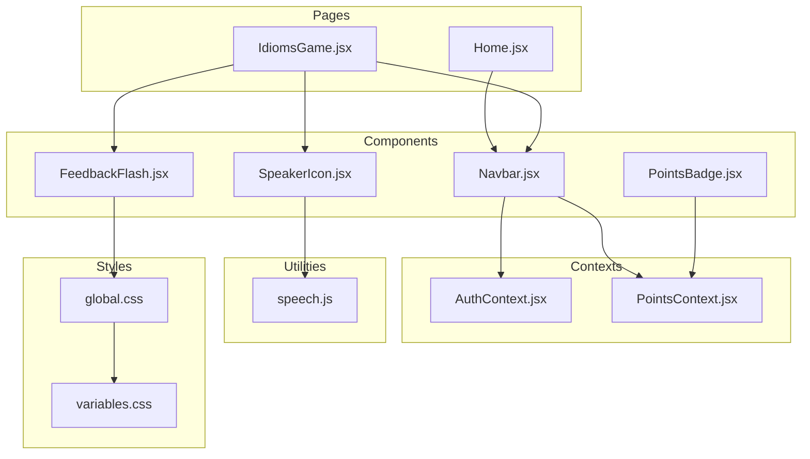
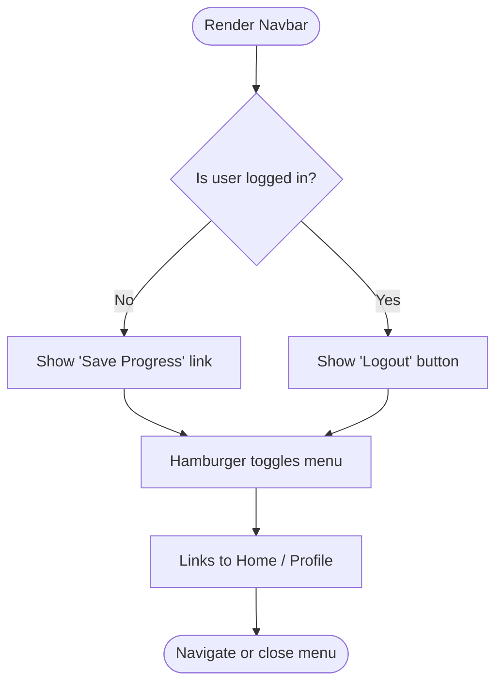
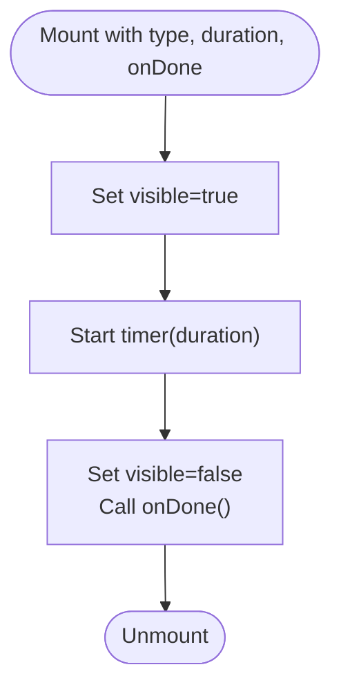
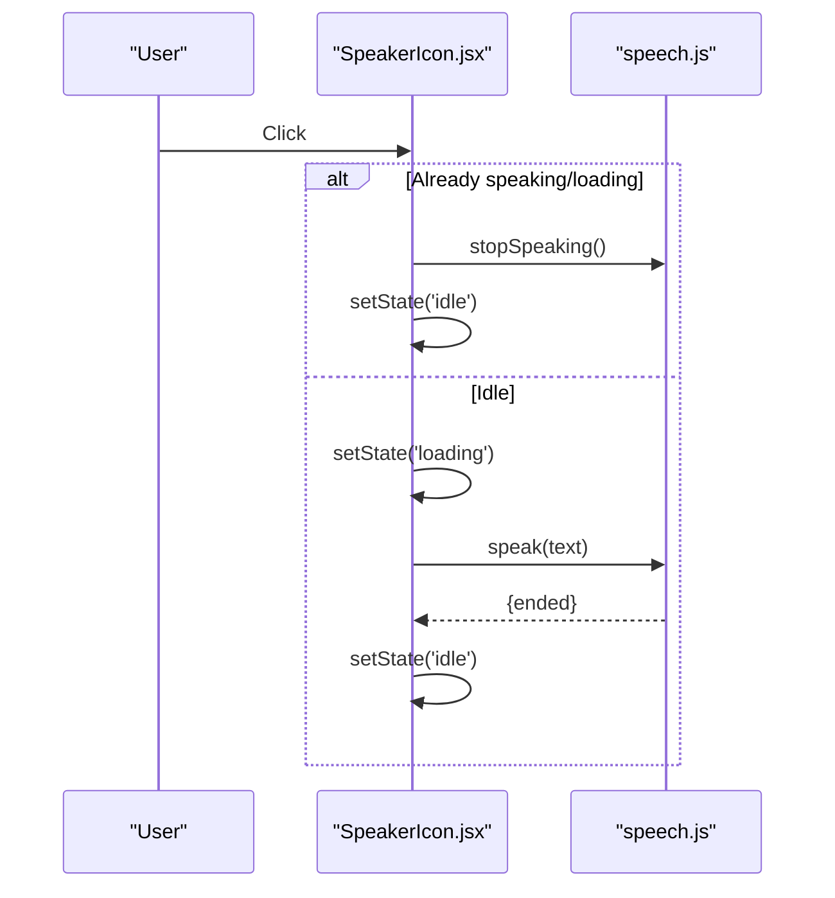
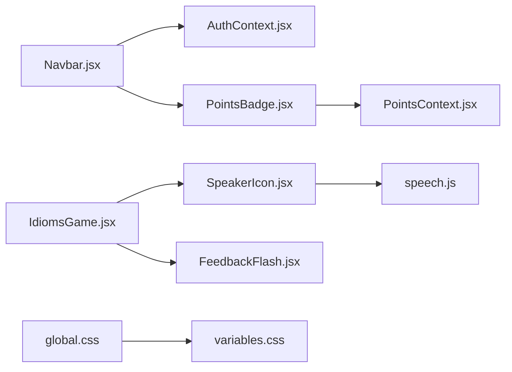

# UI Components

<cite>
**Referenced Files in This Document**
- [Navbar.jsx](file://zabandaan/client/src/components/Navbar.jsx)
- [FeedbackFlash.jsx](file://zabandaan/client/src/components/FeedbackFlash.jsx)
- [SpeakerIcon.jsx](file://zabandaan/client/src/components/SpeakerIcon.jsx)
- [PointsBadge.jsx](file://zabandaan/client/src/components/PointsBadge.jsx)
- [PointsContext.jsx](file://zabandaan/client/src/context/PointsContext.jsx)
- [AuthContext.jsx](file://zabandaan/client/src/context/AuthContext.jsx)
- [speech.js](file://zabandaan/client/src/utils/speech.js)
- [global.css](file://zabandaan/client/src/styles/global.css)
- [variables.css](file://zabandaan/client/src/styles/variables.css)
- [Home.jsx](file://zabandaan/client/src/pages/Home.jsx)
- [IdiomsGame.jsx](file://zabandaan/client/src/pages/idioms/IdiomsGame.jsx)
</cite>

## Table of Contents
1. Introduction
2. Project Structure
3. Core Components
4. Architecture Overview
5. Detailed Component Analysis
6. Dependency Analysis
7. Performance Considerations
8. Troubleshooting Guide
9. Conclusion
10. Appendices

## Introduction
This document provides detailed documentation for the reusable UI components that power shared interface elements across the application. It focuses on:
- Navbar for navigation and user actions
- FeedbackFlash for brief user notifications
- SpeakerIcon for audio pronunciation controls
- PointsBadge for gamification display

For each component, you will find visual appearance, behavior, interaction patterns, props/events/slots (where applicable), customization options, responsive design guidance, accessibility notes, animations/transitions, theming support, and integration patterns with the global styling system. Usage examples reference actual files where these components are composed.

## Project Structure
The components live under a dedicated folder and integrate with context providers and utilities to deliver consistent behavior and styling.

**Diagram sources**
- [Navbar.jsx:1-49](file://zabandaan/client/src/components/Navbar.jsx#L1-L49)
- [FeedbackFlash.jsx:1-49](file://zabandaan/client/src/components/FeedbackFlash.jsx#L1-L49)
- [SpeakerIcon.jsx:1-67](file://zabandaan/client/src/components/SpeakerIcon.jsx#L1-L67)
- [PointsBadge.jsx:1-24](file://zabandaan/client/src/components/PointsBadge.jsx#L1-L24)
- [PointsContext.jsx:1-114](file://zabandaan/client/src/context/PointsContext.jsx#L1-L114)
- [AuthContext.jsx:1-97](file://zabandaan/client/src/context/AuthContext.jsx#L1-L97)
- [speech.js:1-140](file://zabandaan/client/src/utils/speech.js#L1-L140)
- [global.css:1-192](file://zabandaan/client/src/styles/global.css#L1-L192)
- [variables.css:1-23](file://zabandaan/client/src/styles/variables.css#L1-L23)
- [Home.jsx:1-219](file://zabandaan/client/src/pages/Home.jsx#L1-L219)
- [IdiomsGame.jsx:1-446](file://zabandaan/client/src/pages/idioms/IdiomsGame.jsx#L1-L446)

**Section sources**
- [Navbar.jsx:1-49](file://zabandaan/client/src/components/Navbar.jsx#L1-L49)
- [PointsContext.jsx:1-114](file://zabandaan/client/src/context/PointsContext.jsx#L1-L114)
- [AuthContext.jsx:1-97](file://zabandaan/client/src/context/AuthContext.jsx#L1-L97)
- [speech.js:1-140](file://zabandaan/client/src/utils/speech.js#L1-L140)
- [global.css:1-192](file://zabandaan/client/src/styles/global.css#L1-L192)
- [variables.css:1-23](file://zabandaan/client/src/styles/variables.css#L1-L23)
- [Home.jsx:1-219](file://zabandaan/client/src/pages/Home.jsx#L1-L219)
- [IdiomsGame.jsx:1-446](file://zabandaan/client/src/pages/idioms/IdiomsGame.jsx#L1-L446)

## Core Components
- Navbar: Sticky top navigation with logo, links, guest vs logged-in states, logout, and a mobile hamburger toggle. Integrates with authentication and points context.
- FeedbackFlash: Full-screen overlay feedback for correct/wrong answers with auto-dismiss and callback.
- SpeakerIcon: Accessible button to play pronunciation using Web Speech API with state transitions and stop capability.
- PointsBadge: Displays current points with an animation hook into the points context.

Key integration points:
- Contexts: AuthContext for user/session; PointsContext for points and animations.
- Utilities: speech.js for text-to-speech.
- Styles: global.css and variables.css provide theme tokens and shared animations.

**Section sources**
- [Navbar.jsx:1-49](file://zabandaan/client/src/components/Navbar.jsx#L1-L49)
- [FeedbackFlash.jsx:1-49](file://zabandaan/client/src/components/FeedbackFlash.jsx#L1-L49)
- [SpeakerIcon.jsx:1-67](file://zabandaan/client/src/components/SpeakerIcon.jsx#L1-L67)
- [PointsBadge.jsx:1-24](file://zabandaan/client/src/components/PointsBadge.jsx#L1-L24)
- [PointsContext.jsx:1-114](file://zabandaan/client/src/context/PointsContext.jsx#L1-L114)
- [AuthContext.jsx:1-97](file://zabandaan/client/src/context/AuthContext.jsx#L1-L97)
- [speech.js:1-140](file://zabandaan/client/src/utils/speech.js#L1-L140)
- [global.css:1-192](file://zabandaan/client/src/styles/global.css#L1-L192)
- [variables.css:1-23](file://zabandaan/client/src/styles/variables.css#L1-L23)

## Architecture Overview
The components form a cohesive UI layer:
- Navbar orchestrates navigation and integrates with auth and points.
- FeedbackFlash overlays transient feedback during quizzes.
- SpeakerIcon triggers speech synthesis via utils.
- PointsBadge reflects gamification state from context.

```mermaid
sequenceDiagram
participant User as "User"
participant Page as "IdiomsGame.jsx"
participant Nav as "Navbar.jsx"
participant Flash as "FeedbackFlash.jsx"
participant Speak as "SpeakerIcon.jsx"
participant Speech as "speech.js"
participant Points as "PointsContext.jsx"
User->>Page : Interact with quiz
Page->>Nav : Rendered at top of page
Page->>Speak : Click to hear idiom
Speak->>Speech : speak(text)
Speech-->>Speak : {ended}
Page->>Flash : Show feedback(type, duration, onDone)
Flash-->>Page : onDone() after duration
Page->>Points : addPoints(category, difficulty, levelId)
Points-->>Page : Update points + animate
```

**Diagram sources**
- [IdiomsGame.jsx:156-199](file://zabandaan/client/src/pages/idioms/IdiomsGame.jsx#L156-L199)
- [IdiomsGame.jsx:70-97](file://zabandaan/client/src/pages/idioms/IdiomsGame.jsx#L70-L97)
- [SpeakerIcon.jsx:8-34](file://zabandaan/client/src/components/SpeakerIcon.jsx#L8-L34)
- [speech.js:90-125](file://zabandaan/client/src/utils/speech.js#L90-L125)
- [PointsContext.jsx:12-46](file://zabandaan/client/src/context/PointsContext.jsx#L12-L46)
- [FeedbackFlash.jsx:6-14](file://zabandaan/client/src/components/FeedbackFlash.jsx#L6-L14)

## Detailed Component Analysis

### Navbar
Visual appearance and layout:
- Sticky header with white background and subtle shadow.
- Logo area with icon and brand text.
- Points badge integrated next to logo.
- Navigation links and contextual action (Save Progress or Logout).
- Hamburger menu for mobile toggling.

Behavior and interactions:
- Toggles mobile menu open/closed.
- Navigates to Home and Profile.
- Shows Save Progress link when guest; otherwise shows Logout button.
- Logs out and redirects to home.

Props, events, slots:
- No external props; uses internal state for menu visibility.
- Events: onClick handlers for links/buttons; navigates via router.
- Slots: None; content is fixed within the component.

Customization and styling:
- Inline styles define colors, spacing, and layout.
- Responsive behavior includes a media query block injected once for small screens.
- Uses CSS variables indirectly through global styles and theme tokens.

Accessibility:
- Links use semantic <a> tags.
- Buttons have appropriate labels and roles by default.
- Consider adding aria-expanded to the hamburger for screen readers.

Responsive design:
- Hamburger appears on smaller viewports; links collapse into a toggleable list.
- Media query placeholder exists for fine-tuning mobile behavior.

Integration:
- Reads user session and guest status from AuthContext.
- Displays current points via PointsBadge, which reads from PointsContext.

Usage example references:
- Composed at the top of pages such as Home and IdiomsGame.

**Section sources**
- [Navbar.jsx:1-142](file://zabandaan/client/src/components/Navbar.jsx#L1-L142)
- [AuthContext.jsx:1-97](file://zabandaan/client/src/context/AuthContext.jsx#L1-L97)
- [PointsBadge.jsx:1-24](file://zabandaan/client/src/components/PointsBadge.jsx#L1-L24)
- [Home.jsx:89-92](file://zabandaan/client/src/pages/Home.jsx#L89-L92)
- [IdiomsGame.jsx:108-159](file://zabandaan/client/src/pages/idioms/IdiomsGame.jsx#L108-L159)

#### Navbar State and Flow

**Diagram sources**
- [Navbar.jsx:17-48](file://zabandaan/client/src/components/Navbar.jsx#L17-L48)

### FeedbackFlash
Visual appearance:
- Full-screen overlay with semi-transparent background color based on correctness.
- Centered card with large emoji indicator and short message.

Behavior and interactions:
- Auto-dismisses after a configurable duration.
- Calls onDone callback when dismissed.
- Renders nothing when not visible.

Props:
- type: "correct" | "wrong"
- onDone?: () => void
- duration?: number (default 1500ms)

Events:
- onDone invoked after timeout.

Slots:
- None.

Customization and styling:
- Background tint changes based on type.
- Card has rounded corners, padding, and shadow.
- Uses a fade-in animation defined inline.

Accessibility:
- Overlay is non-interactive (pointer-events: none).
- Consider adding role="alert" and aria-live for screen readers.

Responsive design:
- Uses full viewport coverage; works on all sizes.

Integration:
- Used in quiz flows to provide immediate feedback before advancing.

Usage example references:
- Conditionally rendered in IdiomsGame with type, duration, and onDone.

**Section sources**
- [FeedbackFlash.jsx:1-49](file://zabandaan/client/src/components/FeedbackFlash.jsx#L1-L49)
- [IdiomsGame.jsx:156-159](file://zabandaan/client/src/pages/idioms/IdiomsGame.jsx#L156-L159)

#### FeedbackFlash Lifecycle

**Diagram sources**
- [FeedbackFlash.jsx:6-14](file://zabandaan/client/src/components/FeedbackFlash.jsx#L6-L14)

### SpeakerIcon
Visual appearance:
- Button with speaker emoji; size controlled by prop.
- Color changes when active; scale transition on state change.

Behavior and interactions:
- Click toggles speaking or stops playback.
- Manages loading and speaking states.
- Prevents event propagation to avoid bubbling.

Props:
- text: string (required)
- size?: number (default 20)
- style?: object (merged into button styles)

Events:
- onClick handled internally; no external events exposed.

Slots:
- None.

Customization and styling:
- Inline styles allow overriding via style prop.
- Transitions for color and transform.

Accessibility:
- Button element with title and aria-label describing action.
- Clear state indication via icon and color.

Responsive design:
- Size prop enables flexible sizing for different contexts.

Integration:
- Uses speech.js speak/stop functions.
- Handles voice availability and errors gracefully.

Usage example references:
- Placed alongside Urdu text in IdiomsGame to pronounce idioms.

**Section sources**
- [SpeakerIcon.jsx:1-67](file://zabandaan/client/src/components/SpeakerIcon.jsx#L1-L67)
- [speech.js:90-131](file://zabandaan/client/src/utils/speech.js#L90-L131)
- [IdiomsGame.jsx:194-199](file://zabandaan/client/src/pages/idioms/IdiomsGame.jsx#L194-L199)

#### SpeakerIcon Interaction Flow

**Diagram sources**
- [SpeakerIcon.jsx:8-34](file://zabandaan/client/src/components/SpeakerIcon.jsx#L8-L34)
- [speech.js:90-125](file://zabandaan/client/src/utils/speech.js#L90-L125)

### PointsBadge
Visual appearance:
- Rounded pill with star emoji and numeric points.
- Warm accent colors and border matching theme.

Behavior and interactions:
- Displays current points from context.
- Triggers pop animation when points increase.

Props:
- None; reads from PointsContext.

Events:
- None.

Slots:
- None.

Customization and styling:
- Inline styles define colors, radius, padding, and font weight.
- Animation class applied conditionally based on animating flag.

Accessibility:
- Consider adding aria-live region or label for screen readers to announce point updates.

Responsive design:
- Compact pill scales well across viewports.

Integration:
- Consumes points and animating state from PointsContext.

Usage example references:
- Embedded in Navbar to show user’s total points.

**Section sources**
- [PointsBadge.jsx:1-24](file://zabandaan/client/src/components/PointsBadge.jsx#L1-L24)
- [PointsContext.jsx:1-114](file://zabandaan/client/src/context/PointsContext.jsx#L1-L114)
- [Navbar.jsx:25-25](file://zabandaan/client/src/components/Navbar.jsx#L25-L25)

## Dependency Analysis
Component relationships and coupling:
- Navbar depends on AuthContext and renders PointsBadge.
- PointsBadge depends on PointsContext.
- SpeakerIcon depends on speech.js utility.
- FeedbackFlash is self-contained but used by pages like IdiomsGame.
- Global styles and variables provide consistent theming.

**Diagram sources**
- [Navbar.jsx:1-49](file://zabandaan/client/src/components/Navbar.jsx#L1-L49)
- [PointsBadge.jsx:1-24](file://zabandaan/client/src/components/PointsBadge.jsx#L1-L24)
- [PointsContext.jsx:1-114](file://zabandaan/client/src/context/PointsContext.jsx#L1-L114)
- [SpeakerIcon.jsx:1-67](file://zabandaan/client/src/components/SpeakerIcon.jsx#L1-L67)
- [speech.js:1-140](file://zabandaan/client/src/utils/speech.js#L1-L140)
- [IdiomsGame.jsx:1-446](file://zabandaan/client/src/pages/idioms/IdiomsGame.jsx#L1-L446)
- [global.css:1-192](file://zabandaan/client/src/styles/global.css#L1-L192)
- [variables.css:1-23](file://zabandaan/client/src/styles/variables.css#L1-L23)

**Section sources**
- [Navbar.jsx:1-49](file://zabandaan/client/src/components/Navbar.jsx#L1-L49)
- [PointsBadge.jsx:1-24](file://zabandaan/client/src/components/PointsBadge.jsx#L1-L24)
- [SpeakerIcon.jsx:1-67](file://zabandaan/client/src/components/SpeakerIcon.jsx#L1-L67)
- [FeedbackFlash.jsx:1-49](file://zabandaan/client/src/components/FeedbackFlash.jsx#L1-L49)
- [PointsContext.jsx:1-114](file://zabandaan/client/src/context/PointsContext.jsx#L1-L114)
- [AuthContext.jsx:1-97](file://zabandaan/client/src/context/AuthContext.jsx#L1-L97)
- [speech.js:1-140](file://zabandaan/client/src/utils/speech.js#L1-L140)
- [global.css:1-192](file://zabandaan/client/src/styles/global.css#L1-L192)
- [variables.css:1-23](file://zabandaan/client/src/styles/variables.css#L1-L23)

## Performance Considerations
- FeedbackFlash uses a single setTimeout per render cycle; ensure duration is appropriate to avoid frequent re-renders in tight loops.
- SpeakerIcon manages state carefully and cancels ongoing speech to prevent overlapping utterances.
- PointsContext batches updates and avoids unnecessary re-renders by comparing new values before animating.
- Navbar injects a single style tag for responsive rules to minimize DOM overhead.

[No sources needed since this section provides general guidance]

## Troubleshooting Guide
Common issues and resolutions:
- Speech not playing:
  - Ensure browser supports Web Speech API and voices are loaded. The utility initializes voices and waits briefly if needed.
  - If voices fail to load, fallback logic selects any available voice.
- FeedbackFlash not dismissing:
  - Verify duration and onDone are passed correctly; check for unhandled exceptions in parent callbacks.
- Points not updating:
  - Confirm PointsProvider wraps the app tree and that addPoints is called with valid category/difficulty/levelId.
  - For guests, progress is stored in localStorage; verify keys and data format.
- Navbar menu not closing:
  - Ensure onClick handlers set menuOpen state to false when navigating.

**Section sources**
- [speech.js:7-40](file://zabandaan/client/src/utils/speech.js#L7-L40)
- [speech.js:90-125](file://zabandaan/client/src/utils/speech.js#L90-L125)
- [FeedbackFlash.jsx:6-14](file://zabandaan/client/src/components/FeedbackFlash.jsx#L6-L14)
- [PointsContext.jsx:12-46](file://zabandaan/client/src/context/PointsContext.jsx#L12-L46)
- [Navbar.jsx:27-45](file://zabandaan/client/src/components/Navbar.jsx#L27-L45)

## Conclusion
The UI components provide a cohesive, accessible, and themable foundation for navigation, feedback, audio control, and gamification. They integrate cleanly with context providers and utilities, follow responsive patterns, and leverage global styles for consistency. Use the documented props and integration points to compose these components effectively across pages while maintaining performance and accessibility.

[No sources needed since this section summarizes without analyzing specific files]

## Appendices

### Theming and Global Styling
- Theme tokens are centralized in variables.css and consumed by global.css.
- Components use inline styles for localized needs but align with global tokens for colors, fonts, shadows, and transitions.
- Shared animations (flash, points-pop, speaking pulse) are defined in global.css and can be reused.

**Section sources**
- [variables.css:1-23](file://zabandaan/client/src/styles/variables.css#L1-L23)
- [global.css:146-180](file://zabandaan/client/src/styles/global.css#L146-L180)

### Accessibility Checklist
- Use semantic elements (nav, button, a) appropriately.
- Provide descriptive aria-label/title for interactive elements.
- Ensure keyboard operability (focus states, enter/space activation).
- Announce dynamic updates with aria-live regions where appropriate (e.g., points updates).

[No sources needed since this section provides general guidance]

### Cross-Browser Compatibility Notes
- Web Speech API availability varies; the utility handles missing APIs and voice loading delays.
- CSS custom properties and modern features are widely supported; test older browsers if necessary.
- Media queries and transitions should be validated on target devices.

[No sources needed since this section provides general guidance]