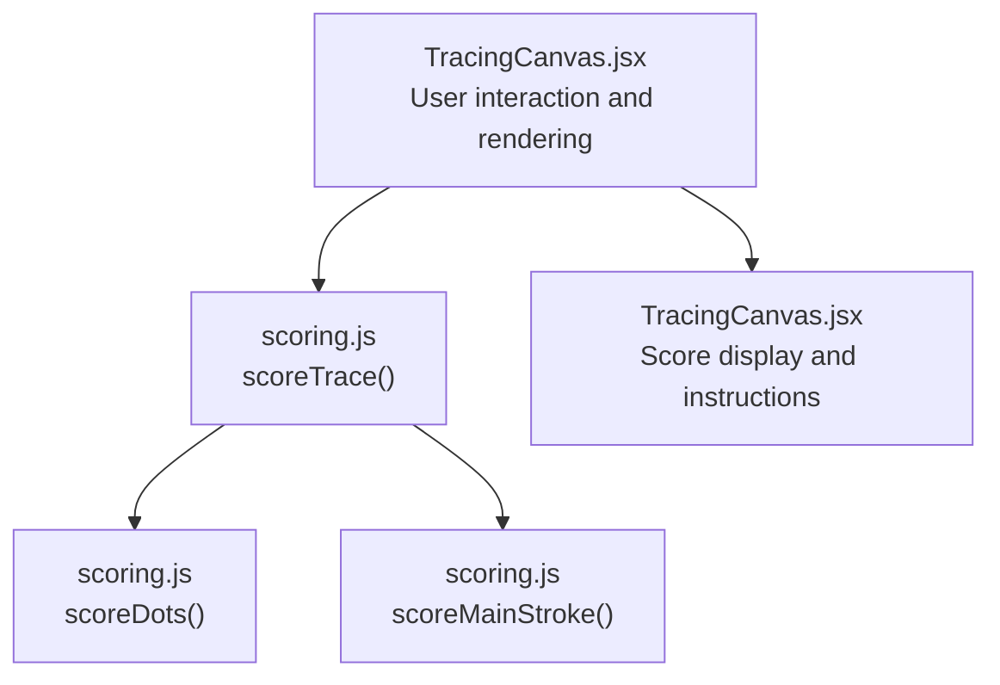
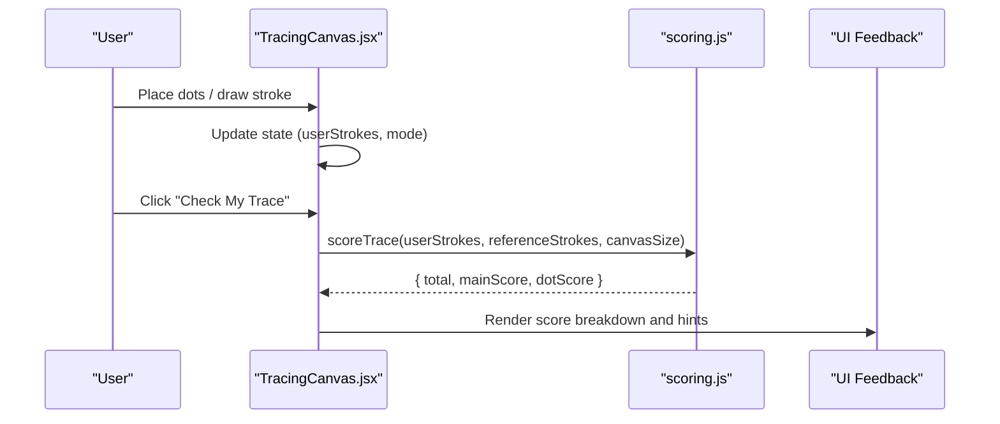
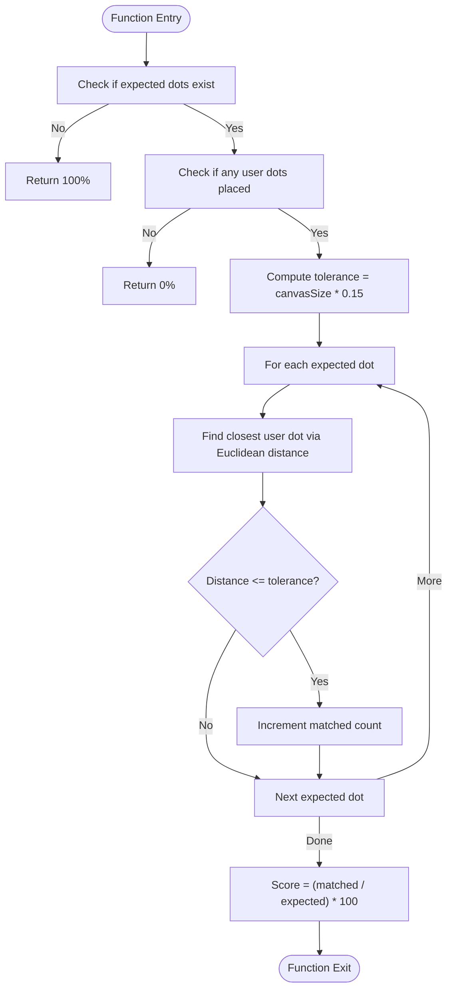
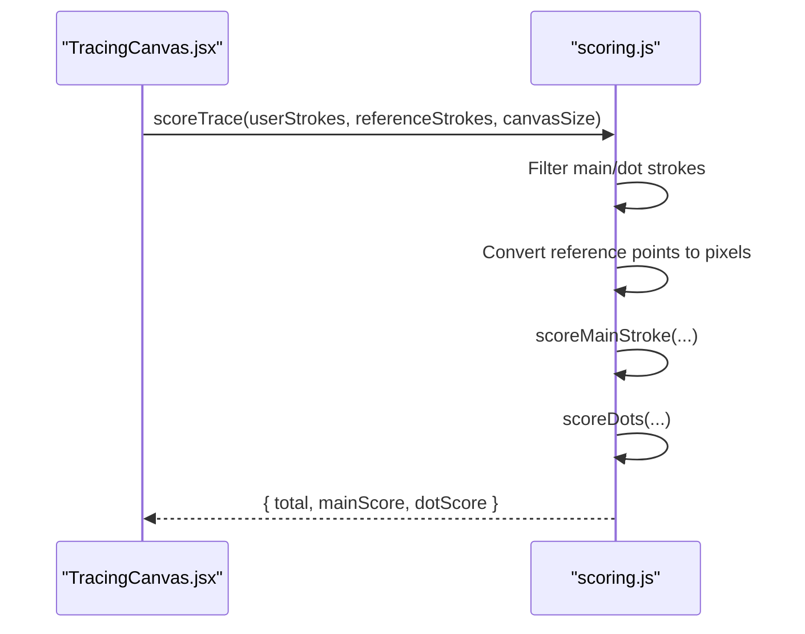
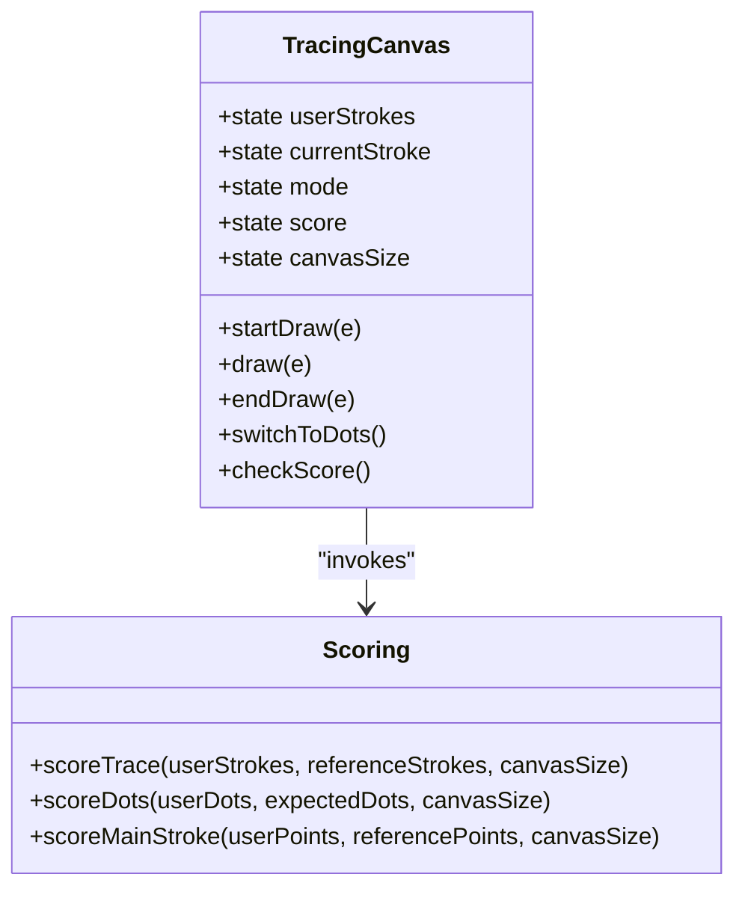
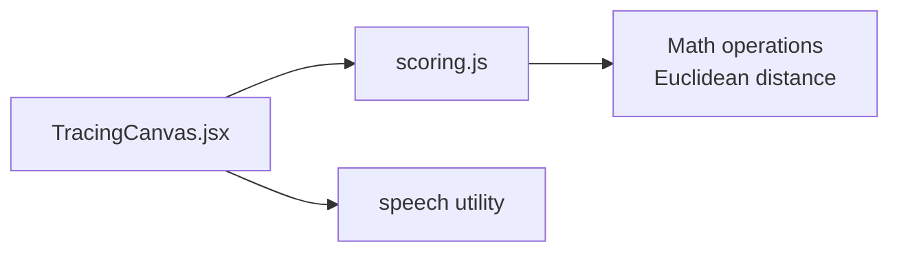

# Dot Placement Validation

<cite>
**Referenced Files in This Document**
- [scoring.js](file://zabandaan/client/src/utils/scoring.js)
- [TracingCanvas.jsx](file://zabandaan/client/src/pages/alphabets/TracingCanvas.jsx)
</cite>

## Table of Contents
1. [Introduction](#introduction)
2. [Project Structure](#project-structure)
3. [Core Components](#core-components)
4. [Architecture Overview](#architecture-overview)
5. [Detailed Component Analysis](#detailed-component-analysis)
6. [Dependency Analysis](#dependency-analysis)
7. [Performance Considerations](#performance-considerations)
8. [Troubleshooting Guide](#troubleshooting-guide)
9. [Conclusion](#conclusion)
10. [Appendices](#appendices)

## Introduction
This document explains the dot placement validation system used to evaluate whether users correctly positioned dots near expected locations during tracing exercises. The core algorithm is implemented in a proximity-based matching function that uses Euclidean distance and a tolerance radius set to 15% of the canvas size. It computes a percentage score based on how many expected dots were matched by at least one user-placed dot within the tolerance. The system also integrates with stroke scoring to provide combined feedback for educational purposes.

## Project Structure
The dot placement validation spans two primary files:
- A utility module that implements scoring logic, including the dot placement matcher and overall trace scoring.
- A React component that renders the interactive canvas, collects user input (main strokes and dot placements), and invokes the scoring utility to compute and display results.

**Diagram sources**
- [TracingCanvas.jsx:244-248](file://zabandaan/client/src/pages/alphabets/TracingCanvas.jsx#L244-L248)
- [scoring.js:106-140](file://zabandaan/client/src/utils/scoring.js#L106-L140)
- [scoring.js:78-97](file://zabandaan/client/src/utils/scoring.js#L78-L97)
- [scoring.js:49-72](file://zabandaan/client/src/utils/scoring.js#L49-L72)

**Section sources**
- [TracingCanvas.jsx:1-521](file://zabandaan/client/src/pages/alphabets/TracingCanvas.jsx#L1-L521)
- [scoring.js:1-151](file://zabandaan/client/src/utils/scoring.js#L1-L151)

## Core Components
- Dot placement matcher: Computes proximity between each expected dot and all user-placed dots using Euclidean distance and a tolerance radius equal to 15% of the canvas size. Returns a percentage of matched expected dots.
- Trace scorer: Combines main stroke accuracy and dot placement accuracy into an overall score, weighting main stroke at 70% and dots at 30%.
- Canvas integration: Collects user interactions, draws expected targets and user placements, and triggers scoring when the user checks their work.

Key responsibilities:
- Normalize coordinates relative to canvas size where needed.
- Provide clear visual targets for expected dot positions.
- Offer immediate feedback through scores and instructional messages.

**Section sources**
- [scoring.js:78-97](file://zabandaan/client/src/utils/scoring.js#L78-L97)
- [scoring.js:106-140](file://zabandaan/client/src/utils/scoring.js#L106-L140)
- [TracingCanvas.jsx:110-124](file://zabandaan/client/src/pages/alphabets/TracingCanvas.jsx#L110-L124)
- [TracingCanvas.jsx:244-248](file://zabandaan/client/src/pages/alphabets/TracingCanvas.jsx#L244-L248)

## Architecture Overview
The flow begins with user interaction on the canvas. When the user places dots or completes a stroke, the component stores these inputs. Upon checking, it calls the scoring utility to compute both main stroke and dot placement scores, then displays the results and guidance.

**Diagram sources**
- [TracingCanvas.jsx:244-248](file://zabandaan/client/src/pages/alphabets/TracingCanvas.jsx#L244-L248)
- [scoring.js:106-140](file://zabandaan/client/src/utils/scoring.js#L106-L140)

## Detailed Component Analysis

### Dot Placement Matching Algorithm (scoreDots)
The dot placement matcher evaluates how well user-placed dots align with expected positions:
- Tolerance radius: 15% of the canvas size, providing generous placement accuracy.
- For each expected dot, find the closest user dot using Euclidean distance.
- If the closest distance is within tolerance, count it as a match.
- Score = (matched expected dots / total expected dots) * 100.

Edge cases handled:
- No expected dots: returns perfect score (no requirement).
- Expected dots present but no user dots: returns zero score.

Algorithm complexity:
- Time: O(E × U), where E is the number of expected dots and U is the number of user dots.
- Space: O(1) additional beyond inputs.

**Diagram sources**
- [scoring.js:78-97](file://zabandaan/client/src/utils/scoring.js#L78-L97)

**Section sources**
- [scoring.js:78-97](file://zabandaan/client/src/utils/scoring.js#L78-L97)

### Trace Scoring Integration (scoreTrace)
The trace scorer combines main stroke accuracy and dot placement accuracy:
- Separates main strokes and dot strokes from both user and reference data.
- Converts normalized reference points to pixel coordinates using canvas size.
- Scores main stroke using ordered point-to-point comparison with resampling.
- Scores dots using the proximity matcher described above.
- Computes total score as a weighted combination: 70% main + 30% dots.

**Diagram sources**
- [scoring.js:106-140](file://zabandaan/client/src/utils/scoring.js#L106-L140)
- [scoring.js:49-72](file://zabandaan/client/src/utils/scoring.js#L49-L72)
- [scoring.js:78-97](file://zabandaan/client/src/utils/scoring.js#L78-L97)

**Section sources**
- [scoring.js:106-140](file://zabandaan/client/src/utils/scoring.js#L106-L140)

### Canvas Interaction and Visual Targets (TracingCanvas)
The canvas component manages user input and provides visual cues:
- Draws faint target circles at expected dot positions to guide placement.
- Renders user-placed dots distinctly.
- Updates mode and state to support drawing main strokes and placing dots.
- Invokes scoring when the user checks their work and displays feedback.

**Diagram sources**
- [TracingCanvas.jsx:182-248](file://zabandaan/client/src/pages/alphabets/TracingCanvas.jsx#L182-L248)
- [scoring.js:106-140](file://zabandaan/client/src/utils/scoring.js#L106-L140)

**Section sources**
- [TracingCanvas.jsx:110-124](file://zabandaan/client/src/pages/alphabets/TracingCanvas.jsx#L110-L124)
- [TracingCanvas.jsx:182-248](file://zabandaan/client/src/pages/alphabets/TracingCanvas.jsx#L182-L248)
- [TracingCanvas.jsx:316-354](file://zabandaan/client/src/pages/alphabets/TracingCanvas.jsx#L316-L354)

## Dependency Analysis
- TracingCanvas depends on the scoring utility to compute accuracy metrics and on speech utilities for audio prompts.
- The scoring utility is self-contained and does not depend on UI code, enabling reuse across contexts.
- Coordinate normalization ensures consistent behavior across different canvas sizes.

**Diagram sources**
- [TracingCanvas.jsx:1-5](file://zabandaan/client/src/pages/alphabets/TracingCanvas.jsx#L1-L5)
- [scoring.js:106-140](file://zabandaan/client/src/utils/scoring.js#L106-L140)

**Section sources**
- [TracingCanvas.jsx:1-5](file://zabandaan/client/src/pages/alphabets/TracingCanvas.jsx#L1-L5)
- [scoring.js:106-140](file://zabandaan/client/src/utils/scoring.js#L106-L140)

## Performance Considerations
- Proximity matching complexity: O(E × U). For large numbers of dots, consider:
  - Spatial partitioning (e.g., grid or quadtree) to reduce nearest-neighbor searches.
  - Early termination when a match is found for an expected dot.
- Resampling for main stroke scoring uses a fixed sample count; this balances accuracy and performance.
- Canvas rendering loops iterate over strokes and dots; keep lists minimal and avoid unnecessary re-renders.
- Debounce or throttle frequent updates during drawing to maintain responsiveness.

[No sources needed since this section provides general guidance]

## Troubleshooting Guide
Common issues and resolutions:
- No dots required: The system returns a perfect score when there are no expected dots. Ensure reference data includes dot definitions if dot accuracy should be evaluated.
- No user dots placed: Returns zero score when expected dots exist but none are placed. Prompt users to place dots before checking.
- Tolerance too strict or lenient: Adjust the tolerance factor (currently 15% of canvas size) to match desired accuracy levels.
- Coordinate mismatches: Verify that reference points are normalized and converted to pixel coordinates consistently before scoring.
- Accessibility: Provide descriptive instructions and ensure color contrast for targets and user dots. Use text labels and screen reader-friendly messages for score feedback.

**Section sources**
- [scoring.js:78-97](file://zabandaan/client/src/utils/scoring.js#L78-L97)
- [TracingCanvas.jsx:316-354](file://zabandaan/client/src/pages/alphabets/TracingCanvas.jsx#L316-L354)

## Conclusion
The dot placement validation system offers a robust, configurable approach to evaluating user accuracy in positioning dots near expected locations. By combining proximity-based matching with a generous tolerance radius and integrating with stroke scoring, it provides meaningful feedback for learners. The design supports scalability and accessibility while maintaining clarity in user guidance and visual targets.

[No sources needed since this section summarizes without analyzing specific files]

## Appendices

### Examples Across Canvas Sizes
- Small canvas (e.g., 200px): Tolerance radius = 30px. Expect tighter absolute distances for matches.
- Large canvas (e.g., 500px): Tolerance radius = 75px. Allows more generous placement due to larger area.
- Behavior remains consistent because tolerance scales with canvas size.

[No sources needed since this section provides conceptual examples]

### Accessibility Considerations
- Visual targets: Use distinct colors and dashed outlines for expected dot positions.
- User feedback: Include textual descriptions of scores and progress, not only color changes.
- Instructions: Provide clear, concise guidance for each mode (drawing main stroke vs. placing dots).
- Keyboard navigation: Ensure buttons like “Place Dots” and “Check My Trace” are accessible via keyboard.

[No sources needed since this section provides general guidance]