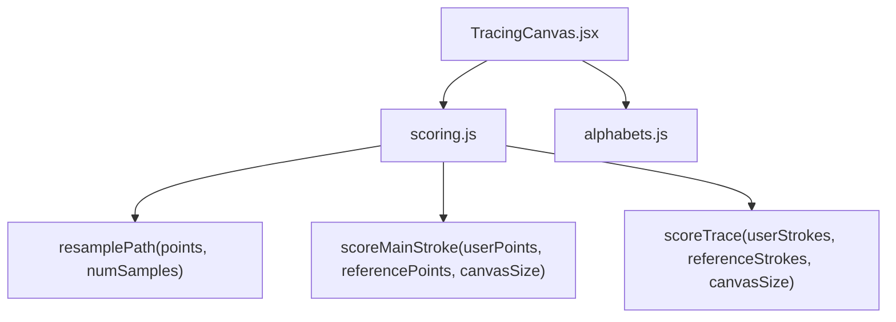
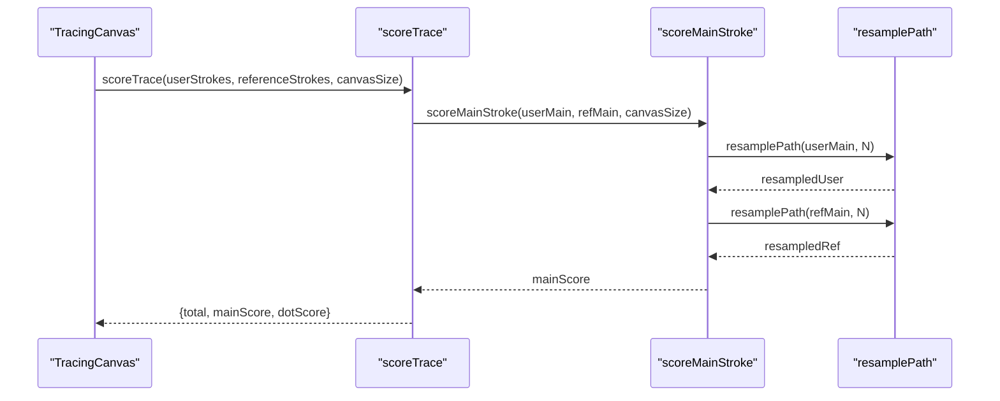
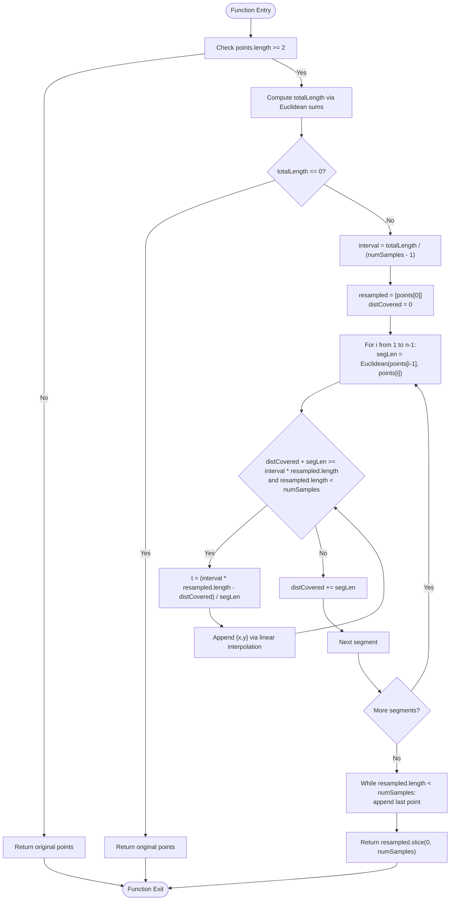
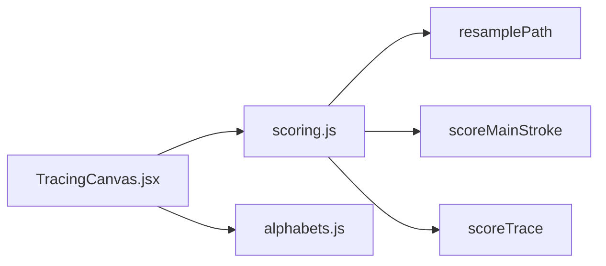

# Path Resampling Algorithm

<cite>
**Referenced Files in This Document**
- [scoring.js](file://zabandaan/client/src/utils/scoring.js)
- [TracingCanvas.jsx](file://zabandaan/client/src/pages/alphabets/TracingCanvas.jsx)
- [alphabets.js](file://zabandaan/client/src/data/alphabets.js)
</cite>

## Table of Contents
1. Introduction
2. Project Structure
3. Core Components
4. Architecture Overview
5. Detailed Component Analysis
6. Dependency Analysis
7. Performance Considerations
8. Troubleshooting Guide
9. Conclusion

## Introduction
This document explains the path resampling algorithm used to normalize user-drawn strokes into a fixed number of evenly spaced sample points. The goal is to make stroke comparison robust against different drawing speeds and minor stroke variations by converting variable-length input paths into consistent, arc-length-parameterized sequences. The core implementation resides in the scoring utility and is invoked during trace evaluation.

## Project Structure
The path resampling logic is implemented as part of the tracing feature:
- TracingCanvas handles user input and renders the canvas. It delegates scoring to the scoring utility.
- The scoring utility contains the resampling function and the scoring pipeline that compares user strokes to reference strokes.
- Alphabet data provides normalized reference paths (0–1 coordinates) for each letter’s main stroke and optional dot targets.

**Diagram sources**
- [TracingCanvas.jsx:244-248](file://zabandaan/client/src/pages/alphabets/TracingCanvas.jsx#L244-L248)
- [scoring.js:106-140](file://zabandaan/client/src/utils/scoring.js#L106-L140)
- [alphabets.js:35-54](file://zabandaan/client/src/data/alphabets.js#L35-L54)

**Section sources**
- [TracingCanvas.jsx:1-521](file://zabandaan/client/src/pages/alphabets/TracingCanvas.jsx#L1-L521)
- [scoring.js:1-151](file://zabandaan/client/src/utils/scoring.js#L1-L151)
- [alphabets.js:1-284](file://zabandaan/client/src/data/alphabets.js#L1-L284)

## Core Components
- resamplePath(points, numSamples): Normalizes a polyline to exactly numSamples points with even spacing along the curve using Euclidean distances between consecutive points.
- scoreMainStroke(userPoints, referencePoints, canvasSize): Resamples both user and reference strokes to a fixed number of samples and computes an ordered distance-based accuracy score.
- scoreTrace(userStrokes, referenceStrokes, canvasSize): Orchestrates scoring for main strokes and dot placements, returning total, mainScore, and dotScore.

Key responsibilities:
- Compute total path length via cumulative Euclidean distances.
- Distribute sampling intervals evenly along the computed arc length.
- Perform linear interpolation to generate intermediate points at required arc lengths.
- Handle edge cases such as empty or zero-length segments.

**Section sources**
- [scoring.js:7-43](file://zabandaan/client/src/utils/scoring.js#L7-L43)
- [scoring.js:49-72](file://zabandaan/client/src/utils/scoring.js#L49-L72)
- [scoring.js:106-140](file://zabandaan/client/src/utils/scoring.js#L106-L140)

## Architecture Overview
The resampling algorithm is embedded within the scoring pipeline. During a trace evaluation:
1. TracingCanvas collects user strokes and calls scoreTrace.
2. scoreTrace separates main and dot strokes, scales reference coordinates to pixel space, and invokes scoreMainStroke.
3. scoreMainStroke resamples both user and reference paths to a fixed number of samples and computes an ordered distance metric.

**Diagram sources**
- [TracingCanvas.jsx:244-248](file://zabandaan/client/src/pages/alphabets/TracingCanvas.jsx#L244-L248)
- [scoring.js:106-140](file://zabandaan/client/src/utils/scoring.js#L106-L140)
- [scoring.js:49-72](file://zabandaan/client/src/utils/scoring.js#L49-L72)
- [scoring.js:7-43](file://zabandaan/client/src/utils/scoring.js#L7-L43)

## Detailed Component Analysis

### resamplePath(points, numSamples)
Purpose:
- Convert a variable-length polyline into a fixed-size sequence of points evenly spaced by arc length.

Algorithm overview:
- Arc length calculation:
  - Iterate over consecutive point pairs and compute segment lengths using Euclidean distance.
  - Accumulate these to obtain totalLength.
- Sampling interval:
  - Compute interval = totalLength / (numSamples - 1).
- Distribution and interpolation:
  - Start with the first point in the output.
  - Walk through segments, maintaining distCovered.
  - For each segment, while the next target interval falls within the current segment, compute parameter t = (targetArcLength - distCovered) / segLen and interpolate:
    - x = points[i-1].x + t * dx
    - y = points[i-1].y + t * dy
  - Append interpolated points until all intervals are covered or numSamples reached.
- Boundary handling:
  - If points.length < 2, return the original points (no resampling).
  - If totalLength == 0, return the original points (zero-length path).
  - After traversal, pad with the last point if fewer than numSamples were generated.
  - Ensure final array length equals numSamples via slicing.

Mathematical foundation:
- Arc length approximation via piecewise linear segments.
- Parameter t ∈ [0,1] represents the fractional position along a segment.
- Linear interpolation yields points on the chord between consecutive vertices.

Complexity:
- Time: O(n + k), where n is the number of input points and k is the number of interpolated points (bounded by numSamples).
- Space: O(k) for the resampled output.

Edge cases:
- Empty or single-point inputs: returned unchanged.
- Zero-length segments: skipped without adding duplicates; padding ensures output size.
- Very short paths: returns original points to avoid degenerate interpolation.

**Diagram sources**
- [scoring.js:7-43](file://zabandaan/client/src/utils/scoring.js#L7-L43)

**Section sources**
- [scoring.js:7-43](file://zabandaan/client/src/utils/scoring.js#L7-L43)

### scoreMainStroke(userPoints, referencePoints, canvasSize)
Purpose:
- Compare a user stroke to a reference stroke by resampling both to a fixed number of samples and computing an ordered distance-based accuracy score.

Process:
- Validate inputs (minimum lengths).
- Resample both user and reference paths to numSamples (fixed at 30).
- Compute per-sample Euclidean distances between corresponding points.
- Average the distances and map to a 0–100 score using a tolerance derived from the canvas diagonal.

Boundary handling:
- Returns 0 if either path is too short or invalid.

Performance:
- Two resampling passes plus a single pass over numSamples points.
- Constant memory overhead beyond resampled arrays.

**Section sources**
- [scoring.js:49-72](file://zabandaan/client/src/utils/scoring.js#L49-L72)

### scoreTrace(userStrokes, referenceStrokes, canvasSize)
Purpose:
- Evaluate a complete trace including main stroke(s) and dot placements.

Process:
- Separate main and dot strokes from user and reference sets.
- Scale reference dot positions from normalized coordinates to pixel space using canvasSize.
- Compute mainScore by calling scoreMainStroke on the first main stroke pair.
- Compute dotScore by checking proximity of user dots to expected positions.
- Combine scores with weights (main 70%, dots 30%).

Integration with UI:
- Invoked when the user checks their trace, providing immediate feedback.

**Section sources**
- [scoring.js:106-140](file://zabandaan/client/src/utils/scoring.js#L106-L140)
- [TracingCanvas.jsx:244-248](file://zabandaan/client/src/pages/alphabets/TracingCanvas.jsx#L244-L248)

## Dependency Analysis
- TracingCanvas depends on scoring.js for evaluation and on alphabets.js for reference paths.
- scoring.js implements the resampling and scoring logic independently of rendering concerns.
- alphabets.js defines normalized reference paths and dot targets used by scoring.

**Diagram sources**
- [TracingCanvas.jsx:244-248](file://zabandaan/client/src/pages/alphabets/TracingCanvas.jsx#L244-L248)
- [scoring.js:106-140](file://zabandaan/client/src/utils/scoring.js#L106-L140)
- [alphabets.js:35-54](file://zabandaan/client/src/data/alphabets.js#L35-L54)

**Section sources**
- [TracingCanvas.jsx:1-521](file://zabandaan/client/src/pages/alphabets/TracingCanvas.jsx#L1-L521)
- [scoring.js:1-151](file://zabandaan/client/src/utils/scoring.js#L1-L151)
- [alphabets.js:1-284](file://zabandaan/client/src/data/alphabets.js#L1-L284)

## Performance Considerations
- Real-time operations:
  - Resampling runs only on demand during scoring, not on every mouse/touch move, minimizing frame drops.
  - Fixed numSamples (30) bounds computation cost consistently.
- Complexity:
  - Each resample is O(n + k); typical n is small for finger/mouse traces, keeping latency low.
- Memory:
  - Temporary arrays for resampled points are small and short-lived.
- Browser compatibility:
  - Uses standard Math functions (sqrt, arithmetic) supported across modern browsers.
  - Canvas API usage is standard and widely supported.

Optimization tips:
- Cache reference resampling results if multiple evaluations use the same reference path.
- Early exit for very short paths to avoid unnecessary work.
- Consider adaptive numSamples based on path length if needed.

[No sources needed since this section provides general guidance]

## Troubleshooting Guide
Common issues and resolutions:
- No resampling occurs:
  - Input has fewer than 2 points; ensure at least two points before resampling.
- All points collapse to start/end:
  - Total path length is zero; check for duplicate or coincident points in the input.
- Output shorter than expected:
  - Verify numSamples and ensure padding logic runs; confirm no early termination conditions.
- Inconsistent scoring across devices:
  - Ensure canvasSize is correctly passed and reference coordinates are scaled to pixels consistently.

Validation checklist:
- Confirm points are in pixel coordinates when scoring.
- Verify numSamples > 1 for meaningful resampling.
- Check that reference paths have non-zero length.

**Section sources**
- [scoring.js:7-43](file://zabandaan/client/src/utils/scoring.js#L7-L43)
- [scoring.js:49-72](file://zabandaan/client/src/utils/scoring.js#L49-L72)
- [scoring.js:106-140](file://zabandaan/client/src/utils/scoring.js#L106-L140)

## Conclusion
The resamplePath function provides a robust normalization step that converts variable-length user strokes into fixed-size, evenly-spaced sequences. By basing sampling on cumulative Euclidean distances and interpolating along segments, it mitigates differences in drawing speed and stroke jitter. Integrated into the scoring pipeline, it enables accurate and responsive trace evaluation suitable for real-time canvas interactions.

[No sources needed since this section summarizes without analyzing specific files]