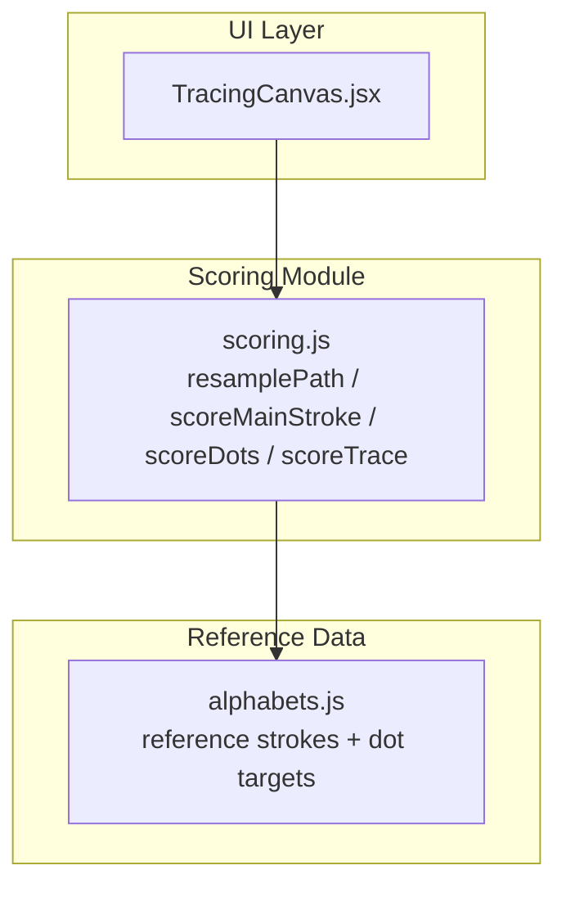
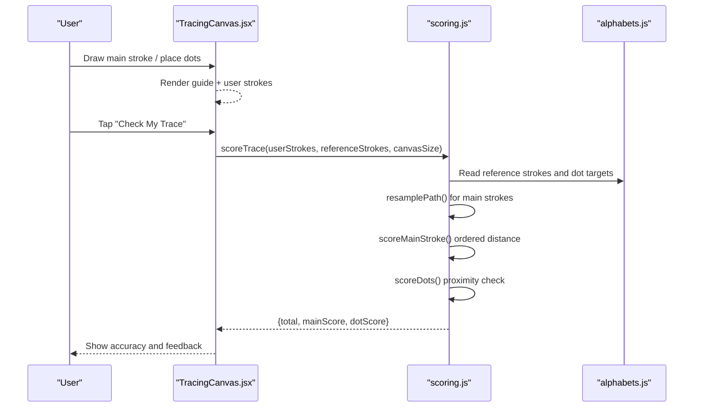
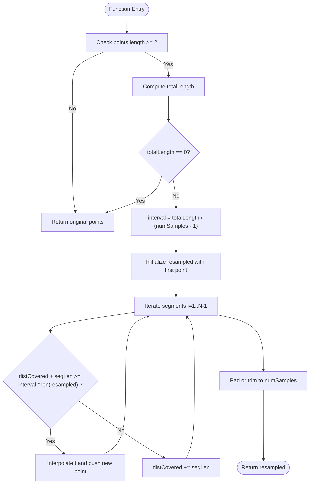
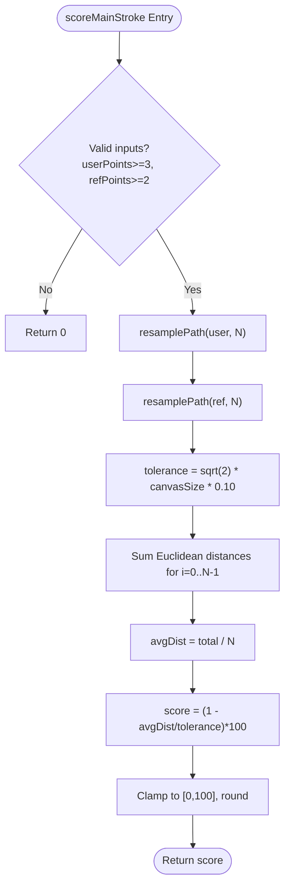
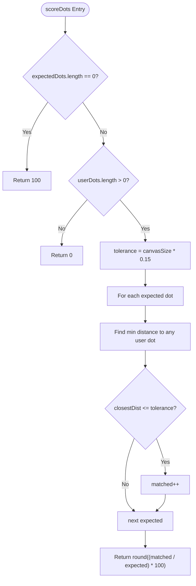
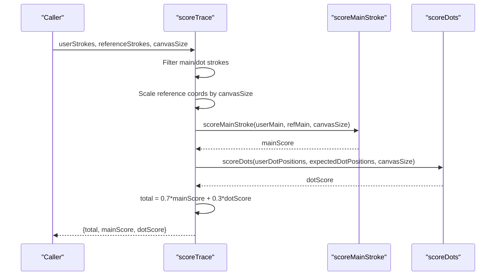
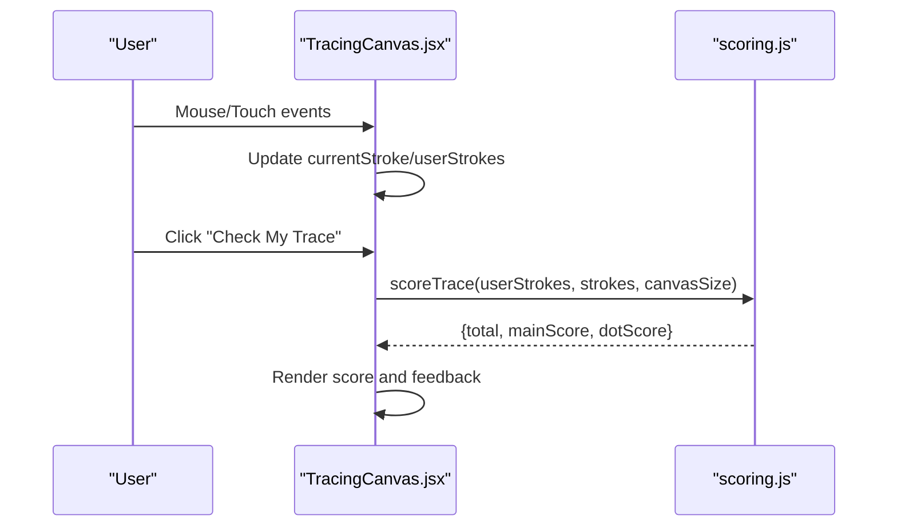
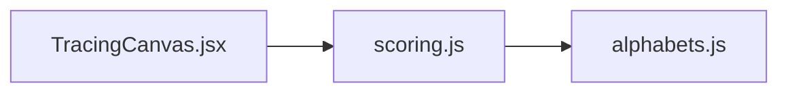

# Scoring Algorithms

<cite>
**Referenced Files in This Document**
- [scoring.js](file://zabandaan/client/src/utils/scoring.js)
- [alphabets.js](file://zabandaan/client/src/data/alphabets.js)
- [TracingCanvas.jsx](file://zabandaan/client/src/pages/alphabets/TracingCanvas.jsx)
</cite>

## Table of Contents
1. [Introduction](#introduction)
2. [Project Structure](#project-structure)
3. [Core Components](#core-components)
4. [Architecture Overview](#architecture-overview)
5. [Detailed Component Analysis](#detailed-component-analysis)
6. [Dependency Analysis](#dependency-analysis)
7. [Performance Considerations](#performance-considerations)
8. [Troubleshooting Guide](#troubleshooting-guide)
9. [Conclusion](#conclusion)
10. [Appendices](#appendices)

## Introduction
This document explains the scoring algorithms module that evaluates alphabet tracing accuracy for an interactive learning application. It focuses on how user-drawn strokes and dot placements are compared to reference patterns using path resampling, ordered point-to-point distance measurement, and tolerance-based scoring. The system supports multi-stroke inputs (main stroke plus optional dots), normalizes coordinates across different canvas sizes, and combines main stroke accuracy with dot placement accuracy into a single weighted score.

## Project Structure
The scoring logic is implemented as a small utility module and integrated into the tracing UI:
- Utility module provides core functions for resampling paths, scoring main strokes, scoring dots, and combining them into a total score.
- Alphabet data defines reference strokes and expected dot positions using normalized coordinates (0–1).
- Tracing canvas component captures user input, renders guides and results, and invokes the scoring module to compute accuracy.

**Diagram sources**
- [TracingCanvas.jsx:1-521](file://zabandaan/client/src/pages/alphabets/TracingCanvas.jsx#L1-L521)
- [scoring.js:1-151](file://zabandaan/client/src/utils/scoring.js#L1-L151)
- [alphabets.js:1-284](file://zabandaan/client/src/data/alphabets.js#L1-L284)

**Section sources**
- [TracingCanvas.jsx:1-521](file://zabandaan/client/src/pages/alphabets/TracingCanvas.jsx#L1-L521)
- [scoring.js:1-151](file://zabandaan/client/src/utils/scoring.js#L1-L151)
- [alphabets.js:1-284](file://zabandaan/client/src/data/alphabets.js#L1-L284)

## Core Components
- Path resampling: Normalizes variable-length user input to a fixed number of evenly spaced points along the path length.
- Main stroke scoring: Compares resampled user and reference points in order, computes average Euclidean distance, and maps it to a 0–100 score using a diagonal-based tolerance.
- Dot scoring: Checks whether each expected dot has at least one user-placed dot within a generous radius.
- Multi-stroke aggregation: Separates main strokes and dot strokes, scales normalized coordinates to pixel space, and combines scores with weights (70% main, 30% dots).

Key responsibilities:
- Normalize input variability due to drawing speed and sampling density.
- Provide robust error handling for empty or malformed inputs.
- Support multiple alphabets with varying numbers of dots and complex curves.

**Section sources**
- [scoring.js:1-151](file://zabandaan/client/src/utils/scoring.js#L1-L151)
- [alphabets.js:1-284](file://zabandaan/client/src/data/alphabets.js#L1-L284)
- [TracingCanvas.jsx:1-521](file://zabandaan/client/src/pages/alphabets/TracingCanvas.jsx#L1-L521)

## Architecture Overview
The tracing workflow integrates user input capture, rendering, and scoring:
- The canvas component collects user strokes and dot placements in real time.
- When the user checks their trace, the component calls the scoring module with user strokes, reference strokes, and current canvas size.
- The scoring module resamples paths, compares against references, and returns a breakdown (total, mainScore, dotScore).
- The UI displays feedback and enables progression based on thresholds.

**Diagram sources**
- [TracingCanvas.jsx:244-248](file://zabandaan/client/src/pages/alphabets/TracingCanvas.jsx#L244-L248)
- [scoring.js:106-140](file://zabandaan/client/src/utils/scoring.js#L106-L140)
- [alphabets.js:35-283](file://zabandaan/client/src/data/alphabets.js#L35-L283)

## Detailed Component Analysis

### Path Resampling: resamplePath
Purpose:
- Convert a variable-length sequence of points into a fixed-size array of evenly spaced points by arc length.
- Ensures consistent comparison regardless of drawing speed or sampling density.

Algorithm overview:
- Compute total path length by summing segment distances.
- Determine interval spacing based on desired sample count.
- Walk segments, interpolating new points where cumulative distance crosses interval boundaries.
- Pad or trim to exactly the requested number of samples.

Complexity:
- Time: O(N) to compute total length; O(S) to generate S samples with linear interpolation over segments.
- Space: O(S) for the resampled output.

Edge cases:
- Fewer than two points: returns original points unchanged.
- Zero-length path: returns original points unchanged.

**Diagram sources**
- [scoring.js:7-43](file://zabandaan/client/src/utils/scoring.js#L7-L43)

**Section sources**
- [scoring.js:7-43](file://zabandaan/client/src/utils/scoring.js#L7-L43)

### Main Stroke Scoring: scoreMainStroke
Purpose:
- Compare a user’s drawn main stroke to the reference pattern using ordered point-to-point distance after resampling.

Mathematical foundation:
- Resample both user and reference paths to the same number of points (fixed N).
- For each index i, compute Euclidean distance between user[i] and reference[i].
- Sum distances and compute average distance.
- Define tolerance as a fraction of the canvas diagonal (sqrt(2) * canvasSize).
- Map average distance to a 0–100 score: higher deviation reduces score linearly within tolerance bounds.

Tolerance behavior:
- Tolerance is tight relative to the full diagonal, penalizing significant deviations while allowing minor variations.
- Scores are clamped to [0, 100] and rounded to integers.

Input validation:
- Requires minimum points in user and reference paths; otherwise returns zero.

**Diagram sources**
- [scoring.js:49-72](file://zabandaan/client/src/utils/scoring.js#L49-L72)

**Section sources**
- [scoring.js:49-72](file://zabandaan/client/src/utils/scoring.js#L49-L72)

### Dot Placement Scoring: scoreDots
Purpose:
- Validate whether the user placed dots near each expected target position.

Algorithm:
- If no dots are required, return perfect score.
- If dots are required but none placed, return zero.
- For each expected dot, find the closest user-placed dot distance.
- If the closest distance is within a generous radius (proportional to canvas size), count it as matched.
- Return percentage of matched dots.

Tolerance rationale:
- A larger radius accommodates imprecise tapping/clicking while still requiring reasonable placement.

**Diagram sources**
- [scoring.js:78-97](file://zabandaan/client/src/utils/scoring.js#L78-L97)

**Section sources**
- [scoring.js:78-97](file://zabandaan/client/src/utils/scoring.js#L78-L97)

### Multi-Stroke Aggregation: scoreTrace
Purpose:
- Combine main stroke and dot scores into a final accuracy metric.

Workflow:
- Separate reference and user strokes by type (main vs dot).
- Scale normalized reference coordinates to pixel space using canvasSize.
- Collect all expected dot positions from reference dot strokes.
- Collect all user dot positions from user dot strokes.
- Score main stroke using the first main stroke pair if available.
- Score dots using proximity matching.
- Combine with weights: 70% main, 30% dots.

Coordinate scaling:
- Reference strokes use normalized coordinates (0–1); they are multiplied by canvasSize to align with user pixel coordinates.

**Diagram sources**
- [scoring.js:106-140](file://zabandaan/client/src/utils/scoring.js#L106-L140)

**Section sources**
- [scoring.js:106-140](file://zabandaan/client/src/utils/scoring.js#L106-L140)

### Integration with TracingCanvas
Responsibilities:
- Capture user strokes and dot placements via mouse/touch events.
- Render reference guides (dotted path, start/end markers) and expected dot targets.
- Invoke scoring when the user checks their trace.
- Display score breakdown and enable progression based on thresholds.

Coordinate system:
- Canvas uses devicePixelRatio scaling for crisp rendering.
- Reference strokes are normalized (0–1) and scaled to pixel coordinates during scoring.

**Diagram sources**
- [TracingCanvas.jsx:182-248](file://zabandaan/client/src/pages/alphabets/TracingCanvas.jsx#L182-L248)
- [scoring.js:106-140](file://zabandaan/client/src/utils/scoring.js#L106-L140)

**Section sources**
- [TracingCanvas.jsx:182-248](file://zabandaan/client/src/pages/alphabets/TracingCanvas.jsx#L182-L248)
- [scoring.js:106-140](file://zabandaan/client/src/utils/scoring.js#L106-L140)

## Dependency Analysis
- TracingCanvas depends on scoring utilities for evaluation and on alphabet data for reference patterns.
- Scoring utilities depend only on standard JavaScript math operations and do not require external libraries.
- Alphabet data provides reference strokes and dot targets using normalized coordinates, enabling responsive scaling.

**Diagram sources**
- [TracingCanvas.jsx:1-521](file://zabandaan/client/src/pages/alphabets/TracingCanvas.jsx#L1-L521)
- [scoring.js:1-151](file://zabandaan/client/src/utils/scoring.js#L1-L151)
- [alphabets.js:1-284](file://zabandaan/client/src/data/alphabets.js#L1-L284)

**Section sources**
- [TracingCanvas.jsx:1-521](file://zabandaan/client/src/pages/alphabets/TracingCanvas.jsx#L1-L521)
- [scoring.js:1-151](file://zabandaan/client/src/utils/scoring.js#L1-L151)
- [alphabets.js:1-284](file://zabandaan/client/src/data/alphabets.js#L1-L284)

## Performance Considerations
- Real-time scoring:
  - Resampling runs once per evaluation call, not continuously during drawing, minimizing overhead.
  - Ordered point-to-point comparison is O(N) with fixed sample count, suitable for frequent checks.
  - Dot scoring is O(E*U) where E is expected dots and U is user-placed dots; typically small.
- Browser compatibility:
  - Uses standard Math operations (sqrt, arithmetic) supported across modern browsers.
  - Canvas API usage is standard; high-DPI scaling ensures crisp visuals without impacting scoring performance.
- Optimization opportunities:
  - Cache resampled reference paths if the same letter is repeatedly evaluated.
  - Early exit in dot scoring if all expected dots are matched.
  - Limit maximum sample count for very long paths to bound computation time.

[No sources needed since this section provides general guidance]

## Troubleshooting Guide
Common issues and resolutions:
- Empty or malformed input:
  - If user strokes are missing or too short, main stroke scoring returns zero; ensure minimum points before evaluation.
  - If reference strokes are invalid, scoring returns zero; validate alphabet data integrity.
- Coordinate mismatches:
  - Ensure canvasSize matches the actual pixel dimensions used during scoring; mismatched sizes cause incorrect tolerances.
- Dot placement sensitivity:
  - Adjust tolerance if users consistently miss targets due to device-specific touch precision.
- High-DPI rendering:
  - Confirm devicePixelRatio scaling is applied consistently so user coordinates align with reference coordinates.

**Section sources**
- [scoring.js:49-72](file://zabandaan/client/src/utils/scoring.js#L49-L72)
- [scoring.js:78-97](file://zabandaan/client/src/utils/scoring.js#L78-L97)
- [TracingCanvas.jsx:24-32](file://zabandaan/client/src/pages/alphabets/TracingCanvas.jsx#L24-L32)

## Conclusion
The scoring algorithms module provides a robust, efficient system for evaluating alphabet tracing accuracy. By resampling paths to fixed sample counts, comparing points in order, and applying tolerance-based scoring, it handles variations in drawing speed and style. Multi-stroke support allows flexible alphabets with main strokes and dots, and a weighted combination yields a meaningful overall accuracy metric. The integration with the tracing canvas ensures responsive user feedback and smooth interaction across devices.

[No sources needed since this section summarizes without analyzing specific files]

## Appendices

### Examples and Behavior
- Drawing speed:
  - Fast vs slow strokes produce different raw point densities; resampling normalizes these differences, ensuring fair comparison.
- Stroke variations:
  - Minor wiggles or slight shifts result in small distances; tolerance absorbs acceptable variation while penalizing large deviations.
- Error tolerances:
  - Main stroke tolerance is proportional to the canvas diagonal; dot tolerance is a generous radius relative to canvas size.
- Weighted scoring:
  - Total score emphasizes main stroke accuracy (70%) while still rewarding correct dot placement (30%).

[No sources needed since this section provides conceptual examples]