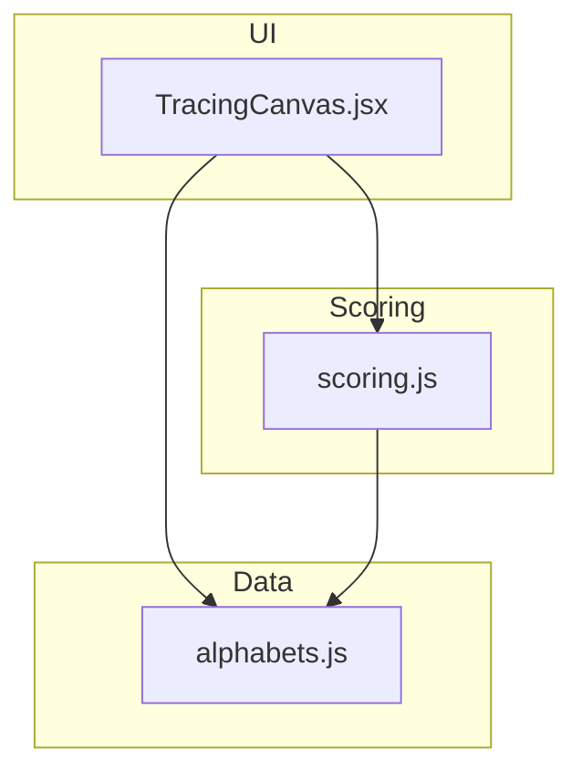
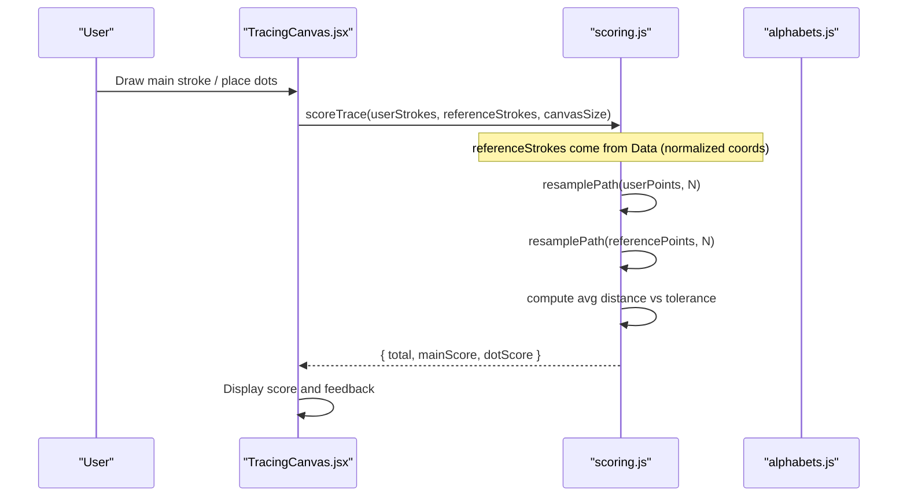
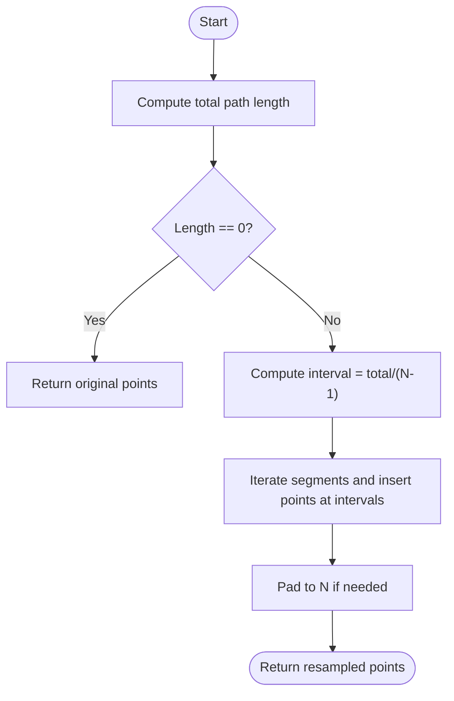
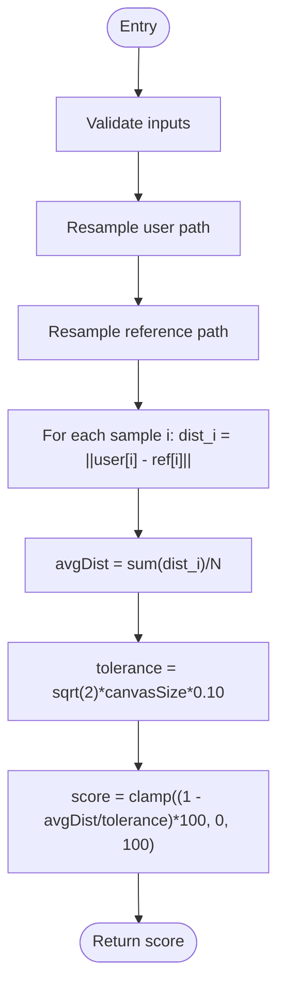
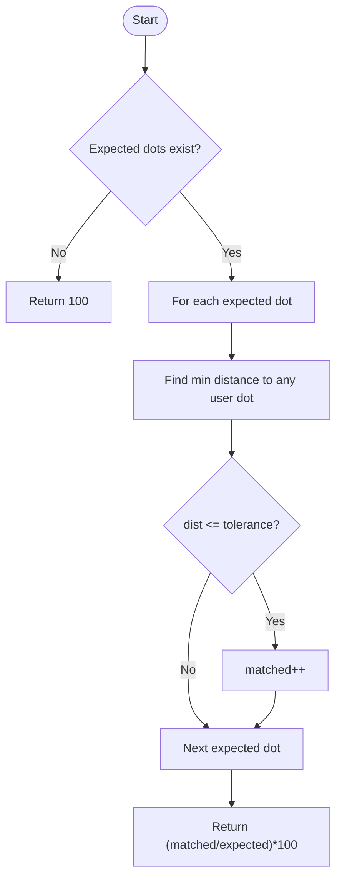
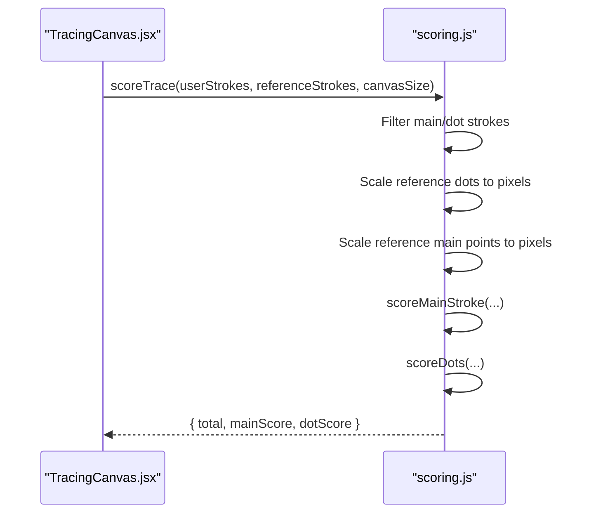
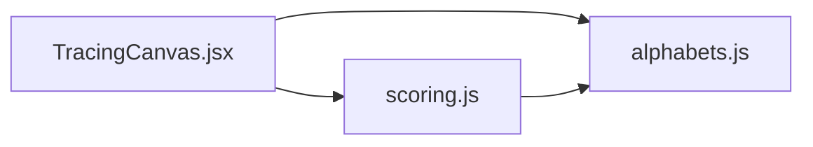

# Stroke Comparison Engine

<cite>
**Referenced Files in This Document**
- [scoring.js](file://zabandaan/client/src/utils/scoring.js)
- [TracingCanvas.jsx](file://zabandaan/client/src/pages/alphabets/TracingCanvas.jsx)
- [alphabets.js](file://zabandaan/client/src/data/alphabets.js)
</cite>

## Table of Contents
1. [Introduction](#introduction)
2. [Project Structure](#project-structure)
3. [Core Components](#core-components)
4. [Architecture Overview](#architecture-overview)
5. [Detailed Component Analysis](#detailed-component-analysis)
6. [Dependency Analysis](#dependency-analysis)
7. [Performance Considerations](#performance-considerations)
8. [Troubleshooting Guide](#troubleshooting-guide)
9. [Conclusion](#conclusion)
10. [Appendices](#appendices)

## Introduction
This document explains the stroke comparison engine that evaluates drawing accuracy against reference patterns for letter tracing. It focuses on:
- The scoreMainStroke algorithm using ordered point-to-point distance matching (not nearest-neighbor).
- Tolerance-based scoring with diagonal distance calculations and the mathematical formula converting distances to percentage scores.
- Handling multi-stroke inputs, coordinate scaling from normalized to pixel values, and error tolerance thresholds set at 10% of canvas diagonal.
- Weighted scoring combining main strokes (70%) with dot placement (30%).
- Practical examples demonstrating scoring for various drawing scenarios.
- Guidance on tuning tolerance parameters for different difficulty levels.

## Project Structure
The stroke comparison engine is implemented as a utility module used by the tracing UI component. Reference data defines strokes and dot positions using normalized coordinates.

**Diagram sources**
- [TracingCanvas.jsx:1-15](file://zabandaan/client/src/pages/alphabets/TracingCanvas.jsx#L1-L15)
- [scoring.js:106-140](file://zabandaan/client/src/utils/scoring.js#L106-L140)
- [alphabets.js:1-5](file://zabandaan/client/src/data/alphabets.js#L1-L5)

**Section sources**
- [TracingCanvas.jsx:1-15](file://zabandaan/client/src/pages/alphabets/TracingCanvas.jsx#L1-L15)
- [scoring.js:106-140](file://zabandaan/client/src/utils/scoring.js#L106-L140)
- [alphabets.js:1-5](file://zabandaan/client/src/data/alphabets.js#L1-L5)

## Core Components
- Resampling: Converts variable-length user/reference paths into fixed-length sequences for stable comparison.
- Main stroke scoring: Ordered point-to-point Euclidean distance sampling with tolerance-based percentage conversion.
- Dot scoring: Checks proximity of placed dots to expected positions within a generous radius.
- Trace scoring: Combines main stroke and dot scores with weighted contributions.

Key responsibilities:
- Normalize and resample paths to ensure consistent sampling density.
- Compute average per-sample distance between user and reference points.
- Convert average distance to a percentage score using a diagonal-based tolerance.
- Scale normalized coordinates to pixel space for accurate comparisons.

**Section sources**
- [scoring.js:7-43](file://zabandaan/client/src/utils/scoring.js#L7-L43)
- [scoring.js:49-72](file://zabandaan/client/src/utils/scoring.js#L49-L72)
- [scoring.js:78-97](file://zabandaan/client/src/utils/scoring.js#L78-L97)
- [scoring.js:106-140](file://zabandaan/client/src/utils/scoring.js#L106-L140)

## Architecture Overview
The tracing UI collects user strokes and delegates scoring to the utility module. Reference strokes are defined in data with normalized coordinates; these are scaled to pixels during scoring.

**Diagram sources**
- [TracingCanvas.jsx:244-248](file://zabandaan/client/src/pages/alphabets/TracingCanvas.jsx#L244-L248)
- [scoring.js:106-140](file://zabandaan/client/src/utils/scoring.js#L106-L140)
- [alphabets.js:35-55](file://zabandaan/client/src/data/alphabets.js#L35-L55)

## Detailed Component Analysis

### Path Resampling
- Purpose: Ensure both user and reference paths have the same number of samples for ordered comparison.
- Method: Computes cumulative path length and inserts evenly-spaced points along segments via interpolation.
- Complexity: O(n) where n is the number of input points.
- Edge cases: Handles zero-length paths and short inputs gracefully.

**Diagram sources**
- [scoring.js:7-43](file://zabandaan/client/src/utils/scoring.js#L7-L43)

**Section sources**
- [scoring.js:7-43](file://zabandaan/client/src/utils/scoring.js#L7-L43)

### Main Stroke Scoring (scoreMainStroke)
- Input: User points (pixel coordinates), reference points (scaled to pixel coordinates), canvas size.
- Process:
  - Resample both paths to a fixed number of samples.
  - Compute ordered Euclidean distances between corresponding points.
  - Average the distances across all samples.
  - Define tolerance as 10% of the canvas diagonal.
  - Convert average distance to a percentage score using the formula: score = max(0, min(100, (1 - avgDist / tolerance) * 100)).
- Output: Integer percentage score (0–100).

Mathematical details:
- Diagonal distance: sqrt(2) * canvasSize.
- Tolerance: 0.10 * diagonal.
- Percentage conversion: linear mapping from average distance to [0, 100], clamped to bounds.

**Diagram sources**
- [scoring.js:49-72](file://zabandaan/client/src/utils/scoring.js#L49-L72)

**Section sources**
- [scoring.js:49-72](file://zabandaan/client/src/utils/scoring.js#L49-L72)

### Dot Scoring (scoreDots)
- Purpose: Evaluate whether the user placed dots near expected positions.
- Method: For each expected dot, find the closest user-placed dot; if within a generous radius (15% of canvas size), count it as matched.
- Output: Percentage of correctly placed dots.

**Diagram sources**
- [scoring.js:78-97](file://zabandaan/client/src/utils/scoring.js#L78-L97)

**Section sources**
- [scoring.js:78-97](file://zabandaan/client/src/utils/scoring.js#L78-L97)

### Trace Scoring (scoreTrace)
- Multi-stroke support: Separates main strokes and dot strokes from both user and reference sets.
- Coordinate scaling: Converts normalized reference coordinates to pixel coordinates using canvasSize before scoring.
- Weighted combination: Final score = 70% main stroke score + 30% dot score.

**Diagram sources**
- [scoring.js:106-140](file://zabandaan/client/src/utils/scoring.js#L106-L140)
- [TracingCanvas.jsx:244-248](file://zabandaan/client/src/pages/alphabets/TracingCanvas.jsx#L244-L248)

**Section sources**
- [scoring.js:106-140](file://zabandaan/client/src/utils/scoring.js#L106-L140)
- [TracingCanvas.jsx:244-248](file://zabandaan/client/src/pages/alphabets/TracingCanvas.jsx#L244-L248)

### Coordinate Scaling and Normalized Coordinates
- Reference strokes in data use normalized coordinates (0–1) relative to the canvas.
- During scoring, these are multiplied by canvasSize to obtain pixel coordinates for accurate distance computation.
- The UI also scales normalized reference points when rendering guides.

Practical implications:
- Ensures consistent scoring regardless of device resolution or canvas size.
- Aligns visual guide rendering with scoring logic.

**Section sources**
- [alphabets.js:1-5](file://zabandaan/client/src/data/alphabets.js#L1-L5)
- [scoring.js:117-129](file://zabandaan/client/src/utils/scoring.js#L117-L129)
- [TracingCanvas.jsx:83-92](file://zabandaan/client/src/pages/alphabets/TracingCanvas.jsx#L83-L92)

## Dependency Analysis
- TracingCanvas depends on scoring utilities and alphabet data.
- Scoring utilities depend only on math operations and do not import external libraries.
- Alphabet data provides normalized stroke definitions and dot placements.

**Diagram sources**
- [TracingCanvas.jsx:1-5](file://zabandaan/client/src/pages/alphabets/TracingCanvas.jsx#L1-L5)
- [scoring.js:106-140](file://zabandaan/client/src/utils/scoring.js#L106-L140)
- [alphabets.js:35-55](file://zabandaan/client/src/data/alphabets.js#L35-L55)

**Section sources**
- [TracingCanvas.jsx:1-5](file://zabandaan/client/src/pages/alphabets/TracingCanvas.jsx#L1-L5)
- [scoring.js:106-140](file://zabandaan/client/src/utils/scoring.js#L106-L140)
- [alphabets.js:35-55](file://zabandaan/client/src/data/alphabets.js#L35-L55)

## Performance Considerations
- Resampling complexity is linear in the number of input points; typical paths are short, so performance is negligible.
- Fixed sample count (e.g., 30) ensures predictable runtime and stable comparisons.
- Distance computations are simple Euclidean metrics; no heavy transformations.
- Canvas DPI scaling is handled in the UI layer; scoring uses pixel coordinates consistently.

[No sources needed since this section provides general guidance]

## Troubleshooting Guide
Common issues and resolutions:
- Low scores due to misaligned start/end points: Ensure the user begins and ends strokes near the reference markers.
- Inconsistent sampling causing jitter: The resampling step mitigates varying stroke speeds; avoid extremely sparse inputs.
- Dot placement too strict or too lenient: Adjust dot tolerance radius (currently 15% of canvas size) based on difficulty.
- Main stroke tolerance too tight: Increase the diagonal-based tolerance multiplier (currently 10% of diagonal) for easier difficulty.

Tuning recommendations:
- Easy mode: Increase main stroke tolerance to ~12–15% of diagonal; increase dot tolerance to ~18–20% of canvas size.
- Hard mode: Decrease main stroke tolerance to ~8% of diagonal; decrease dot tolerance to ~12% of canvas size.
- Validate changes by testing slow/fast strokes, slight deviations, and major errors.

**Section sources**
- [scoring.js:59-71](file://zabandaan/client/src/utils/scoring.js#L59-L71)
- [scoring.js:82-96](file://zabandaan/client/src/utils/scoring.js#L82-L96)

## Conclusion
The stroke comparison engine provides robust, scalable evaluation of drawing accuracy through:
- Ordered point-to-point distance matching with resampling for stability.
- Diagonal-based tolerance thresholds ensuring device-independent scoring.
- Weighted combination of main stroke and dot placement for comprehensive assessment.
- Clear pathways to tune difficulty by adjusting tolerance parameters.

[No sources needed since this section summarizes without analyzing specific files]

## Appendices

### Practical Scoring Examples
- Slow, accurate stroke: Near-zero average distance yields high main stroke score; combined score close to 100%.
- Fast, slightly deviated stroke: Small average distance results in moderate-to-high score depending on tolerance.
- Major deviation: Large average distance reduces score toward 0; combined score reflects poor alignment.
- Dot placement: Missing or misplaced dots reduce dot score; overall score drops proportionally to weight.

These scenarios follow directly from the distance-to-percentage conversion and weighted combination logic.

[No sources needed since this section provides conceptual examples]