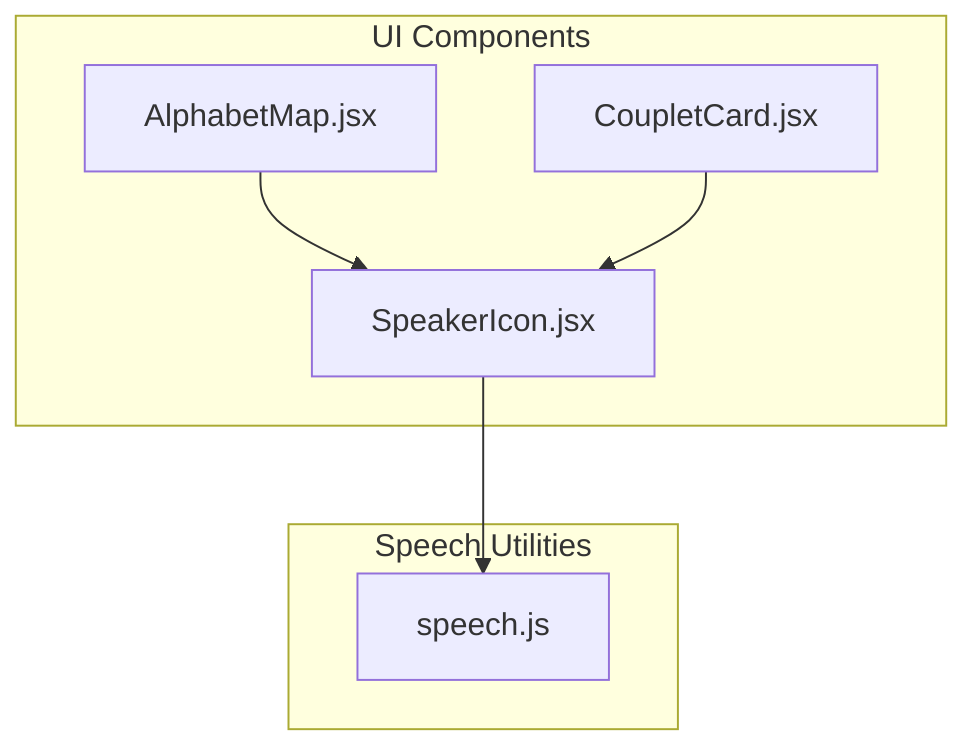
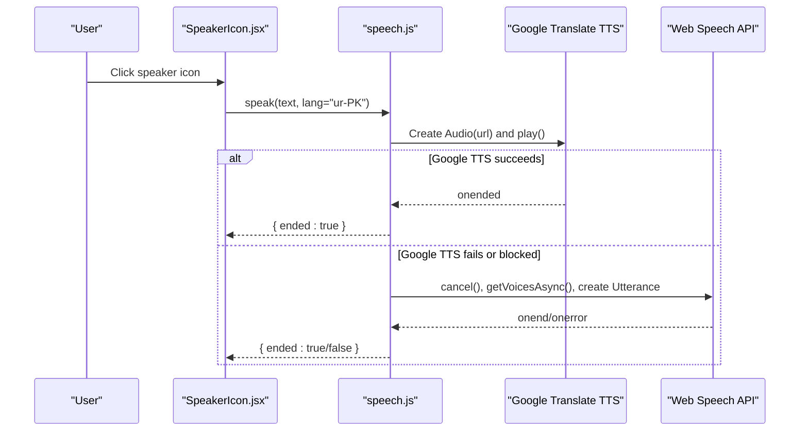
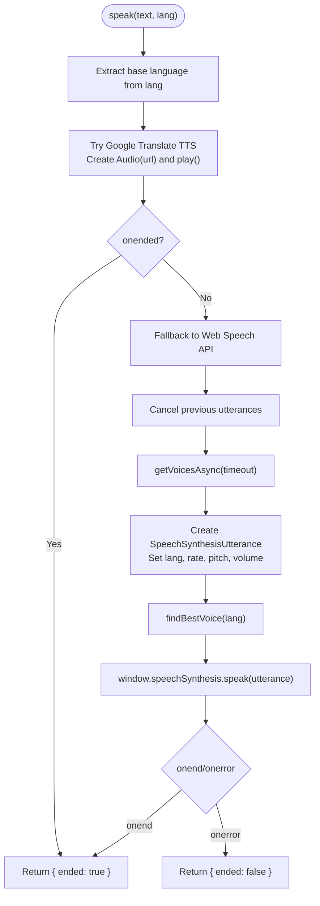
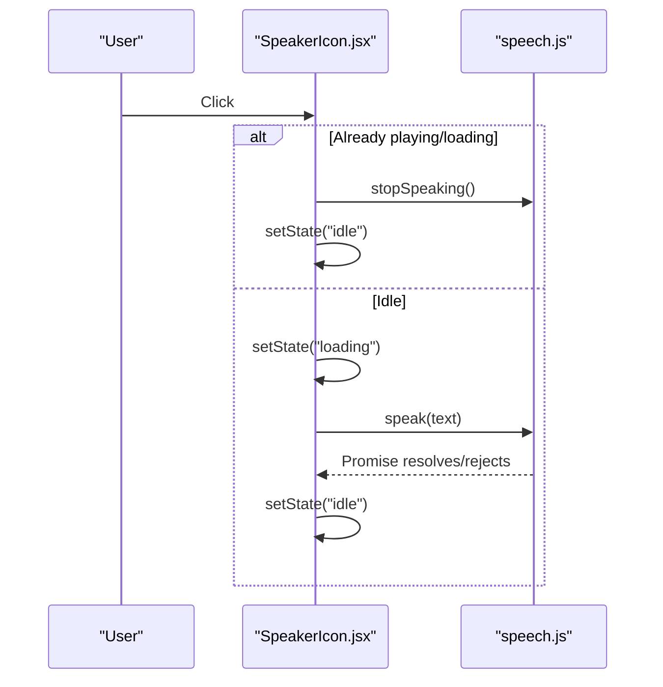
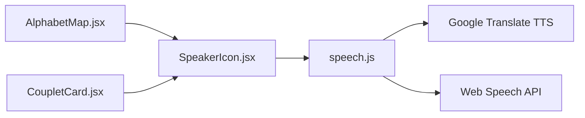

# Speech Integration

<cite>
**Referenced Files in This Document**
- [speech.js](file://zabandaan/client/src/utils/speech.js)
- [SpeakerIcon.jsx](file://zabandaan/client/src/components/SpeakerIcon.jsx)
- [AlphabetMap.jsx](file://zabandaan/client/src/pages/alphabets/AlphabetMap.jsx)
- [PoetryPage.jsx](file://zabandaan/client/src/pages/poetry/PoetryPage.jsx)
- [CoupletCard.jsx](file://zabandaan/client/src/pages/poetry/CoupletCard.jsx)
- [alphabets.js](file://zabandaan/client/src/data/alphabets.js)
</cite>

## Table of Contents
1. [Introduction](#introduction)
2. [Project Structure](#project-structure)
3. [Core Components](#core-components)
4. [Architecture Overview](#architecture-overview)
5. [Detailed Component Analysis](#detailed-component-analysis)
6. [Dependency Analysis](#dependency-analysis)
7. [Performance Considerations](#performance-considerations)
8. [Troubleshooting Guide](#troubleshooting-guide)
9. [Conclusion](#conclusion)

## Introduction
This document explains the speech integration utilities that provide text-to-speech (TTS) for Urdu pronunciation across the application. It covers how TTS is implemented using a primary Google Translate TTS endpoint with a Web Speech API fallback, language configuration for Urdu (ur-PK), voice selection mechanisms, and audio playback controls. It also documents integration points with the alphabet learning and poetry sections where audio feedback is essential, along with browser compatibility checks, error handling, and performance considerations.

## Project Structure
The speech system is centered around a utility module that exposes a unified speak function and related helpers. UI components consume this utility to provide pronunciation playback for letters and couplets.

**Diagram sources**
- [AlphabetMap.jsx:104-141](file://zabandaan/client/src/pages/alphabets/AlphabetMap.jsx#L104-L141)
- [CoupletCard.jsx:17-23](file://zabandaan/client/src/pages/poetry/CoupletCard.jsx#L17-L23)
- [SpeakerIcon.jsx:1-67](file://zabandaan/client/src/components/SpeakerIcon.jsx#L1-L67)
- [speech.js:1-176](file://zabandaan/client/src/utils/speech.js#L1-L176)

**Section sources**
- [speech.js:1-176](file://zabandaan/client/src/utils/speech.js#L1-L176)
- [SpeakerIcon.jsx:1-67](file://zabandaan/client/src/components/SpeakerIcon.jsx#L1-L67)
- [AlphabetMap.jsx:104-141](file://zabandaan/client/src/pages/alphabets/AlphabetMap.jsx#L104-L141)
- [CoupletCard.jsx:17-23](file://zabandaan/client/src/pages/poetry/CoupletCard.jsx#L17-L23)

## Core Components
- Text-to-Speech Utility (speech.js): Provides a unified speak(text, lang) function that first attempts Google Translate TTS via an Audio element and falls back to the Web Speech API if needed. It includes voice initialization, caching, best voice selection for Urdu, and stop controls.
- Speaker Icon Component (SpeakerIcon.jsx): A reusable button that triggers pronunciation playback, manages loading/speaking states, and supports toggling playback on/off.
- Alphabet Learning Integration (AlphabetMap.jsx): Uses SpeakerIcon to pronounce letter names and example words from the alphabets dataset.
- Poetry Section Integration (CoupletCard.jsx, PoetryPage.jsx): Uses SpeakerIcon to pronounce individual words and full couplets, enabling immersive reading practice.

Key responsibilities:
- Browser capability detection and safe fallbacks
- Language configuration for Urdu (ur-PK)
- Voice selection prioritizing Urdu voices when available
- Audio playback lifecycle management (play, stop, queueing)
- Error handling for network issues and permission constraints

**Section sources**
- [speech.js:12-176](file://zabandaan/client/src/utils/speech.js#L12-L176)
- [SpeakerIcon.jsx:1-67](file://zabandaan/client/src/components/SpeakerIcon.jsx#L1-L67)
- [AlphabetMap.jsx:104-141](file://zabandaan/client/src/pages/alphabets/AlphabetMap.jsx#L104-L141)
- [CoupletCard.jsx:17-23](file://zabandaan/client/src/pages/poetry/CoupletCard.jsx#L17-L23)

## Architecture Overview
The architecture uses a layered approach:
- UI layer: Components trigger pronunciation via SpeakerIcon.
- Utility layer: speech.js abstracts TTS implementation details and provides a consistent API.
- Fallback strategy: Primary path uses Google Translate TTS; secondary path uses Web Speech API with voice selection.

**Diagram sources**
- [SpeakerIcon.jsx:8-34](file://zabandaan/client/src/components/SpeakerIcon.jsx#L8-L34)
- [speech.js:77-154](file://zabandaan/client/src/utils/speech.js#L77-L154)

## Detailed Component Analysis

### Speech Utility (speech.js)
Responsibilities:
- Initialize and cache Web Speech API voices asynchronously.
- Provide a robust speak(text, lang) function with a two-path strategy:
  - Primary: Google Translate TTS via Audio element for reliable Urdu pronunciation without OS voice requirements.
  - Fallback: Web Speech API with best-effort Urdu voice selection.
- Manage active audio state to support stopping playback.
- Expose helpers for voice availability and listing.

Implementation highlights:
- Voice initialization and caching:
  - Loads voices immediately and listens for dynamic changes.
  - Polls briefly if voices are not yet available to avoid race conditions.
- Best voice selection:
  - Prioritizes exact ur-PK, then generic ur, then any ur-prefixed locale.
  - Falls back to Hindi or Arabic voices if no Urdu is present, then to the first available voice.
- Google Translate TTS:
  - Constructs a URL with the base language code extracted from the provided lang.
  - Creates an Audio element, tracks it as currentAudio, and handles onended/onerror/play promise rejections.
- Web Speech API fallback:
  - Cancels previous utterances, waits for voices to be ready, sets language and parameters (rate, pitch, volume).
  - Assigns the best available voice if found.
  - Handles onend/onerror and catches exceptions during speak invocation.
- Stop controls:
  - Stops both Google TTS audio and Web Speech API utterances.
- Availability checks:
  - Detects whether any Urdu voice is present in the cached list.

**Diagram sources**
- [speech.js:12-176](file://zabandaan/client/src/utils/speech.js#L12-L176)

**Section sources**
- [speech.js:12-176](file://zabandaan/client/src/utils/speech.js#L12-L176)

### SpeakerIcon Component (SpeakerIcon.jsx)
Responsibilities:
- Provide a clickable speaker icon that triggers pronunciation playback.
- Manage local state transitions between idle, loading, and speaking.
- Prevent overlapping playback by calling stopSpeaking when clicked during playback.
- Use a call ID reference to ensure state updates only apply to the latest request.

Behavior:
- On click:
  - If currently speaking/loading: stop playback and reset state.
  - Otherwise: set loading state, call speak(text), and reset to idle after completion or error.
- Visual feedback:
  - Switches icon and color based on state.
  - Adds accessibility attributes for screen readers.

**Diagram sources**
- [SpeakerIcon.jsx:8-34](file://zabandaan/client/src/components/SpeakerIcon.jsx#L8-L34)
- [speech.js:144-167](file://zabandaan/client/src/utils/speech.js#L144-L167)

**Section sources**
- [SpeakerIcon.jsx:1-67](file://zabandaan/client/src/components/SpeakerIcon.jsx#L1-L67)

### Alphabet Learning Integration (AlphabetMap.jsx)
Integration points:
- Renders a grid of alphabet cards, each containing a SpeakerIcon to pronounce the letter name (nameUrdu).
- Uses alphabets data to populate content and images.

Usage pattern:
- Each card includes a small SpeakerIcon with size 14, passing the Urdu name of the letter for pronunciation.

**Section sources**
- [AlphabetMap.jsx:104-141](file://zabandaan/client/src/pages/alphabets/AlphabetMap.jsx#L104-L141)
- [alphabets.js:35-283](file://zabandaan/client/src/data/alphabets.js#L35-L283)

### Poetry Section Integration (CoupletCard.jsx, PoetryPage.jsx)
Integration points:
- CoupletCard provides:
  - A “Listen to Full Couplet” button that calls speak(couplet.couplet_urdu).
  - Per-word SpeakerIcon instances to pronounce individual words from the word breakdown.
- PoetryPage manages fetching couplets and rendering cards.

Usage pattern:
- Full couplet playback: handleListenFull sets listening state, calls speak, then clears state.
- Word-level playback: each word has its own SpeakerIcon instance with the corresponding Urdu word.

**Section sources**
- [CoupletCard.jsx:17-23](file://zabandaan/client/src/pages/poetry/CoupletCard.jsx#L17-L23)
- [CoupletCard.jsx:89-118](file://zabandaan/client/src/pages/poetry/CoupletCard.jsx#L89-L118)
- [PoetryPage.jsx:15-38](file://zabandaan/client/src/pages/poetry/PoetryPage.jsx#L15-L38)

## Dependency Analysis
- SpeakerIcon depends on speech.js for speak and stopSpeaking.
- AlphabetMap and CoupletCard depend on SpeakerIcon for pronunciation controls.
- speech.js internally depends on:
  - Browser APIs: window.speechSynthesis, Audio element.
  - External service: Google Translate TTS endpoint for primary playback.

**Diagram sources**
- [AlphabetMap.jsx:104-141](file://zabandaan/client/src/pages/alphabets/AlphabetMap.jsx#L104-L141)
- [CoupletCard.jsx:17-23](file://zabandaan/client/src/pages/poetry/CoupletCard.jsx#L17-L23)
- [SpeakerIcon.jsx:1-67](file://zabandaan/client/src/components/SpeakerIcon.jsx#L1-L67)
- [speech.js:77-154](file://zabandaan/client/src/utils/speech.js#L77-L154)

**Section sources**
- [speech.js:77-154](file://zabandaan/client/src/utils/speech.js#L77-L154)
- [SpeakerIcon.jsx:1-67](file://zabandaan/client/src/components/SpeakerIcon.jsx#L1-L67)

## Performance Considerations
- Voice caching: Voices are cached and reused to avoid repeated enumeration overhead.
- Asynchronous voice readiness: getVoicesAsync uses a timeout to prevent indefinite waiting.
- Single active audio: The currentAudio reference ensures only one Google TTS stream plays at a time, preventing overlap.
- Rate tuning: Web Speech API utterance rate is set to a moderate value suitable for learners.
- Repeated requests: SpeakerIcon prevents overlapping playback by stopping existing playback before starting new ones.

[No sources needed since this section provides general guidance]

## Troubleshooting Guide
Common issues and resolutions:
- Missing Urdu language packs:
  - Symptom: Web Speech API may not find an Urdu voice.
  - Behavior: The utility falls back to Google Translate TTS, which does not require OS-installed voices.
  - Check: Use isUrduVoiceAvailable to detect presence of Urdu voices in the cache.
- Microphone permissions for speech recognition:
  - Current implementation focuses on text-to-speech; there is no microphone-based speech recognition in the analyzed files.
  - If adding recognition later, ensure user-permission prompts are handled and errors are surfaced gracefully.
- Network issues affecting Google TTS:
  - Symptom: Google TTS playback fails or times out.
  - Behavior: The utility automatically falls back to Web Speech API.
  - Mitigation: Ensure stable connectivity; consider retry logic at the UI layer if needed.
- Permission denials for autoplay:
  - Symptom: Audio.play() rejected due to autoplay policies.
  - Behavior: The utility catches play promise rejections and proceeds to fallback if applicable.
  - Mitigation: Ensure user interaction precedes playback; SpeakerIcon’s click handler satisfies this requirement.
- Mobile device considerations:
  - Some mobile browsers restrict autoplay or background audio; user-initiated interactions are required.
  - Voice availability varies by platform; rely on fallback behavior and test across devices.

**Section sources**
- [speech.js:12-176](file://zabandaan/client/src/utils/speech.js#L12-L176)
- [SpeakerIcon.jsx:8-34](file://zabandaan/client/src/components/SpeakerIcon.jsx#L8-L34)

## Conclusion
The speech integration provides a robust, user-friendly pronunciation system for Urdu across the application. By combining Google Translate TTS with a Web Speech API fallback, it ensures reliable playback even when OS voices are missing or network conditions vary. The SpeakerIcon component offers intuitive controls with clear state feedback, while integration points in the alphabet and poetry sections deliver contextual audio assistance. With careful attention to browser compatibility, error handling, and performance, the system supports effective learning experiences for Urdu pronunciation.

[No sources needed since this section summarizes without analyzing specific files]