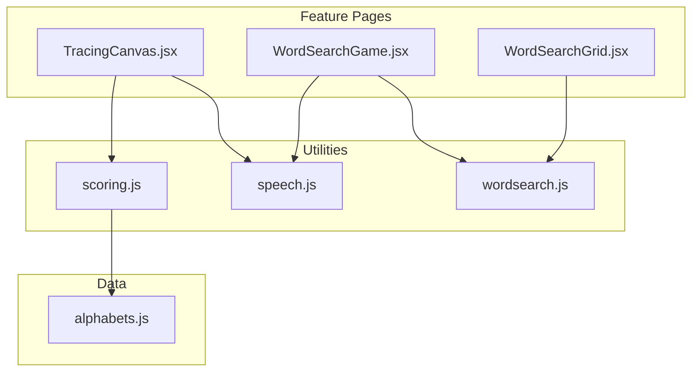
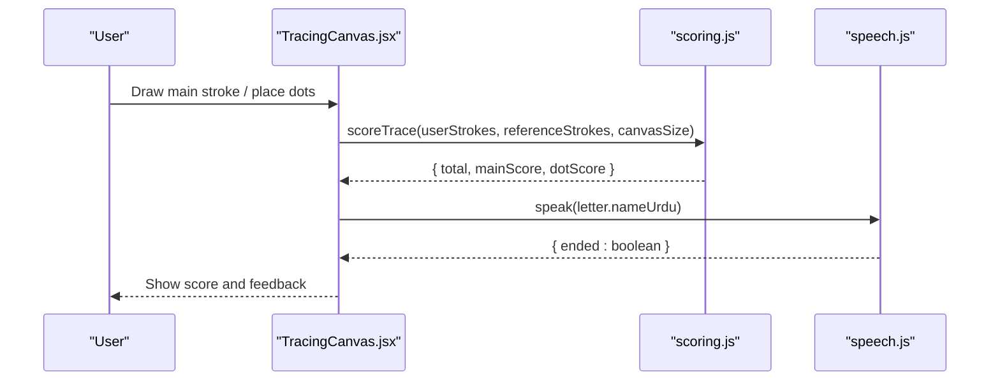
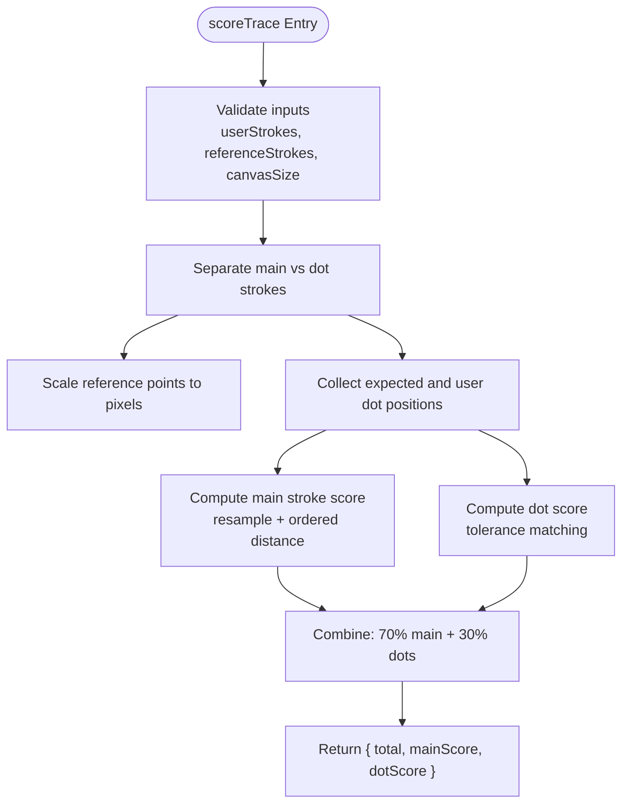
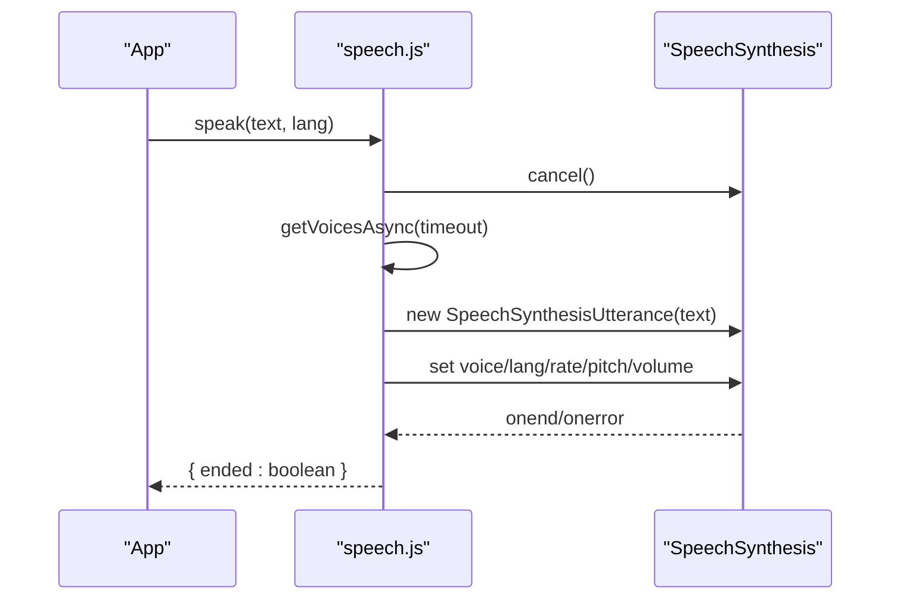
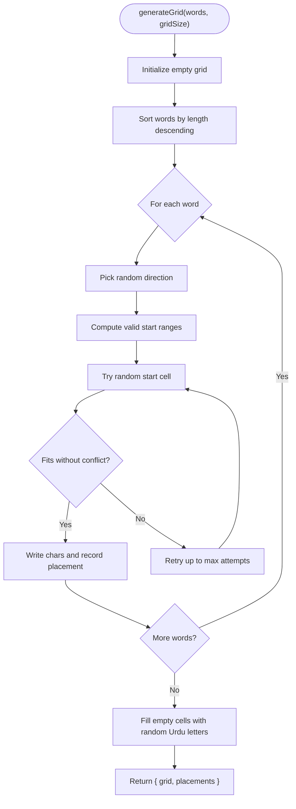
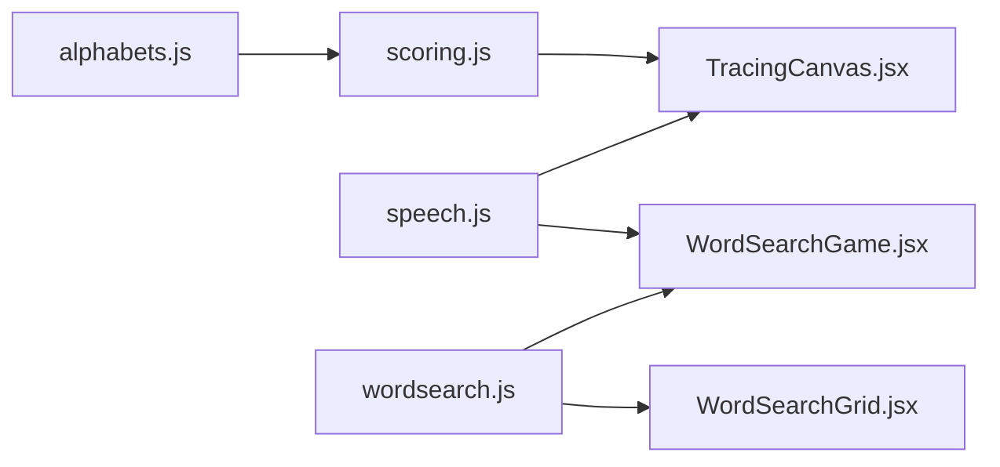

# Utility Functions

<cite>
**Referenced Files in This Document**
- [scoring.js](file://zabandaan/client/src/utils/scoring.js)
- [speech.js](file://zabandaan/client/src/utils/speech.js)
- [wordsearch.js](file://zabandaan/client/src/utils/wordsearch.js)
- [TracingCanvas.jsx](file://zabandaan/client/src/pages/alphabets/TracingCanvas.jsx)
- [WordSearchGame.jsx](file://zabandaan/client/src/pages/wordsearch/WordSearchGame.jsx)
- [WordSearchGrid.jsx](file://zabandaan/client/src/pages/wordsearch/WordSearchGrid.jsx)
- [alphabets.js](file://zabandaan/client/src/data/alphabets.js)
</cite>

## Table of Contents
1. [Introduction](#introduction)
2. [Project Structure](#project-structure)
3. [Core Components](#core-components)
4. [Architecture Overview](#architecture-overview)
5. [Detailed Component Analysis](#detailed-component-analysis)
6. [Dependency Analysis](#dependency-analysis)
7. [Performance Considerations](#performance-considerations)
8. [Troubleshooting Guide](#troubleshooting-guide)
9. [Conclusion](#conclusion)

## Introduction
This document explains the utility functions that power core learning features: alphabet tracing scoring, Urdu pronunciation via Web Speech API, and word search grid generation. It focuses on implementation details, parameter validation, return value handling, mathematical algorithms, integration points with feature modules, performance considerations, and testing strategies for pure functions. The goal is to make these utilities accessible to beginners while providing enough technical depth for experienced developers extending or modifying them.

## Project Structure
The utilities live under a dedicated utils folder and are consumed by feature pages:
- TracingCanvas uses scoring and speech utilities to evaluate user strokes and pronounce letter names.
- WordSearchGame uses the word search utilities to generate grids and validate selections.
- Alphabets data provides reference stroke paths and dot positions used by the scoring module.

**Diagram sources**
- [TracingCanvas.jsx:1-10](file://zabandaan/client/src/pages/alphabets/TracingCanvas.jsx#L1-L10)
- [WordSearchGame.jsx:1-10](file://zabandaan/client/src/pages/wordsearch/WordSearchGame.jsx#L1-L10)
- [WordSearchGrid.jsx:1-10](file://zabandaan/client/src/pages/wordsearch/WordSearchGrid.jsx#L1-L10)
- [scoring.js:1-10](file://zabandaan/client/src/utils/scoring.js#L1-L10)
- [speech.js:1-10](file://zabandaan/client/src/utils/speech.js#L1-L10)
- [wordsearch.js:1-10](file://zabandaan/client/src/utils/wordsearch.js#L1-L10)
- [alphabets.js:1-10](file://zabandaan/client/src/data/alphabets.js#L1-L10)

**Section sources**
- [TracingCanvas.jsx:1-20](file://zabandaan/client/src/pages/alphabets/TracingCanvas.jsx#L1-L20)
- [WordSearchGame.jsx:1-20](file://zabandaan/client/src/pages/wordsearch/WordSearchGame.jsx#L1-L20)
- [WordSearchGrid.jsx:1-20](file://zabandaan/client/src/pages/wordsearch/WordSearchGrid.jsx#L1-L20)
- [scoring.js:1-20](file://zabandaan/client/src/utils/scoring.js#L1-L20)
- [speech.js:1-20](file://zabandaan/client/src/utils/speech.js#L1-L20)
- [wordsearch.js:1-20](file://zabandaan/client/src/utils/wordsearch.js#L1-L20)
- [alphabets.js:1-20](file://zabandaan/client/src/data/alphabets.js#L1-L20)

## Core Components
- Scoring utilities: Resampling, main stroke comparison, dot placement evaluation, and combined scoring.
- Speech utilities: Voice loading, language-aware voice selection, speaking, stopping, and capability checks.
- Word search utilities: Grid generation with directional placement, random fill, and selection validation.

These components are pure (except speech’s global state), well-scoped, and designed for testability and reuse across features.

**Section sources**
- [scoring.js:4-151](file://zabandaan/client/src/utils/scoring.js#L4-L151)
- [speech.js:1-140](file://zabandaan/client/src/utils/speech.js#L1-L140)
- [wordsearch.js:1-141](file://zabandaan/client/src/utils/wordsearch.js#L1-L141)

## Architecture Overview
The utilities integrate tightly with feature pages:
- TracingCanvas collects user strokes and dots, then calls scoring to compute accuracy and displays feedback. It also triggers speech to pronounce letter names.
- WordSearchGame fetches words, generates a grid using the word search utilities, and validates user selections against placements.

**Diagram sources**
- [TracingCanvas.jsx:240-260](file://zabandaan/client/src/pages/alphabets/TracingCanvas.jsx#L240-L260)
- [scoring.js:106-140](file://zabandaan/client/src/utils/scoring.js#L106-L140)
- [speech.js:90-125](file://zabandaan/client/src/utils/speech.js#L90-L125)

## Detailed Component Analysis

### Alphabet Tracing Scoring
Purpose: Evaluate how accurately a user traces an Urdu letter, including optional dot placement.

Key responsibilities:
- Normalize and resample paths to a fixed number of points for consistent comparison.
- Compare user strokes to reference strokes using ordered point-to-point distance.
- Score dot placement within a tolerance radius relative to expected positions.
- Combine scores with weighted contributions from main stroke and dots.

Algorithm highlights:
- Path resampling computes cumulative arc length and interpolates evenly spaced points along the path.
- Main stroke scoring samples both paths at equal intervals and sums Euclidean distances; it normalizes by a diagonal-based tolerance to produce a 0–100 score.
- Dot scoring counts how many expected dots fall within a generous radius around any user-placed dot.
- Combined score weights main stroke more heavily than dots.

Parameter validation and edge cases:
- Empty or insufficient input returns zero or perfect scores depending on context (e.g., no required dots yields perfect dot score).
- Normalized coordinates (0–1) are scaled to pixel space using canvas size before distance calculations.

Return values:
- scoreTrace returns an object with total, mainScore, and dotScore percentages.
- A backward-compatible helper wraps single-stroke comparisons into the same structure.

Integration:
- TracingCanvas passes collected strokes and reference strokes to scoreTrace and renders feedback based on thresholds.

**Diagram sources**
- [scoring.js:106-140](file://zabandaan/client/src/utils/scoring.js#L106-L140)
- [scoring.js:49-97](file://zabandaan/client/src/utils/scoring.js#L49-L97)
- [scoring.js:7-43](file://zabandaan/client/src/utils/scoring.js#L7-L43)

**Section sources**
- [scoring.js:7-151](file://zabandaan/client/src/utils/scoring.js#L7-L151)
- [TracingCanvas.jsx:240-260](file://zabandaan/client/src/pages/alphabets/TracingCanvas.jsx#L240-L260)
- [alphabets.js:35-284](file://zabandaan/client/src/data/alphabets.js#L35-L284)

### Speech Synthesis Integration (Urdu Pronunciation)
Purpose: Provide reliable text-to-speech for Urdu with graceful fallbacks and browser compatibility handling.

Key responsibilities:
- Initialize and cache available voices asynchronously.
- Select the best voice for a given language with a priority chain favoring Urdu, then Hindi, Arabic, or any available voice.
- Speak text with appropriate settings and resolve when speech ends or errors occur.
- Stop ongoing speech and expose capability checks.

Implementation patterns:
- Module-level initialization attempts immediate voice load and listens for asynchronous voice availability events.
- A promise-based waiter ensures callers can await voice readiness without busy loops.
- speak cancels any ongoing speech, waits for cancellation to settle, then creates and plays an utterance with language and voice set.

Browser compatibility:
- Checks for speechSynthesis presence and handles missing APIs gracefully.
- Uses event listeners and polling to accommodate browsers that do not fire voice change events promptly.

Return values:
- speak resolves with an object indicating whether speech completed successfully.
- stopSpeaking cancels ongoing speech if supported.
- Capability helpers report available voices.

Integration:
- TracingCanvas uses speak to pronounce letter names automatically or on user tap.
- WordSearchGame uses speaker icons to pronounce found words.

**Diagram sources**
- [speech.js:7-40](file://zabandaan/client/src/utils/speech.js#L7-L40)
- [speech.js:45-64](file://zabandaan/client/src/utils/speech.js#L45-L64)
- [speech.js:90-125](file://zabandaan/client/src/utils/speech.js#L90-L125)

**Section sources**
- [speech.js:1-140](file://zabandaan/client/src/utils/speech.js#L1-L140)
- [TracingCanvas.jsx:34-42](file://zabandaan/client/src/pages/alphabets/TracingCanvas.jsx#L34-L42)
- [WordSearchGame.jsx:137-145](file://zabandaan/client/src/pages/wordsearch/WordSearchGame.jsx#L137-L145)

### Word Search Grid Generation Utilities
Purpose: Generate a playable word search grid with words placed horizontally or vertically, and validate user selections.

Key responsibilities:
- Sort words by length to improve placement success.
- Place each word in a random direction and position, checking bounds and collisions.
- Fill remaining cells with random Urdu letters.
- Validate selections by building a sequence of cells from start to end and comparing against known placements.

Algorithm highlights:
- Directional placement supports horizontal and vertical orientations.
- Collision detection ensures overlapping characters match or cells are empty.
- Selection validation constructs the selected string and matches forward or reverse against placements.

Return values:
- generateGrid returns an object containing the grid matrix and an array of placements describing where each word was placed.
- checkSelection returns an object indicating whether a selection matched a placement and, if so, which cells were involved.

Integration:
- WordSearchGame calls generateGrid on load and regeneration, and uses checkSelection to detect correct selections and update UI state.

**Diagram sources**
- [wordsearch.js:20-100](file://zabandaan/client/src/utils/wordsearch.js#L20-L100)

**Section sources**
- [wordsearch.js:1-141](file://zabandaan/client/src/utils/wordsearch.js#L1-L141)
- [WordSearchGame.jsx:26-50](file://zabandaan/client/src/pages/wordsearch/WordSearchGame.jsx#L26-L50)
- [WordSearchGame.jsx:52-77](file://zabandaan/client/src/pages/wordsearch/WordSearchGame.jsx#L52-L77)

## Dependency Analysis
- TracingCanvas depends on scoring and speech utilities to evaluate strokes and provide audio feedback.
- WordSearchGame depends on word search utilities for puzzle generation and selection validation.
- Scoring depends on alphabets data for reference strokes and dot positions.
- Speech utilities maintain internal state for voice caching and readiness.

**Diagram sources**
- [TracingCanvas.jsx:1-10](file://zabandaan/client/src/pages/alphabets/TracingCanvas.jsx#L1-L10)
- [WordSearchGame.jsx:1-10](file://zabandaan/client/src/pages/wordsearch/WordSearchGame.jsx#L1-L10)
- [WordSearchGrid.jsx:1-10](file://zabandaan/client/src/pages/wordsearch/WordSearchGrid.jsx#L1-L10)
- [scoring.js:1-10](file://zabandaan/client/src/utils/scoring.js#L1-L10)
- [speech.js:1-10](file://zabandaan/client/src/utils/speech.js#L1-L10)
- [wordsearch.js:1-10](file://zabandaan/client/src/utils/wordsearch.js#L1-L10)
- [alphabets.js:1-10](file://zabandaan/client/src/data/alphabets.js#L1-L10)

**Section sources**
- [TracingCanvas.jsx:1-20](file://zabandaan/client/src/pages/alphabets/TracingCanvas.jsx#L1-L20)
- [WordSearchGame.jsx:1-20](file://zabandaan/client/src/pages/wordsearch/WordSearchGame.jsx#L1-L20)
- [WordSearchGrid.jsx:1-20](file://zabandaan/client/src/pages/wordsearch/WordSearchGrid.jsx#L1-L20)
- [scoring.js:1-20](file://zabandaan/client/src/utils/scoring.js#L1-L20)
- [speech.js:1-20](file://zabandaan/client/src/utils/speech.js#L1-L20)
- [wordsearch.js:1-20](file://zabandaan/client/src/utils/wordsearch.js#L1-L20)
- [alphabets.js:1-20](file://zabandaan/client/src/data/alphabets.js#L1-L20)

## Performance Considerations
- Path resampling: Fixed sample count keeps comparisons predictable; ensure numSamples balances accuracy and CPU usage.
- Distance calculations: Use squared distances where possible to avoid square roots; current implementation uses sqrt for final distance but remains efficient for typical stroke lengths.
- Dot matching: Tolerance radius scales with canvas size to remain robust across devices; consider precomputing radii if needed.
- Speech API: Cancel ongoing speech before starting new utterances to prevent overlap; use microtask scheduling to ensure cancellation completes without losing user gesture context.
- Grid generation: Sorting longest words first improves placement success; limit attempts per word to bound worst-case runtime.
- Selection validation: Build selected cells incrementally and compare strings; reversing only when necessary reduces overhead.

[No sources needed since this section provides general guidance]

## Troubleshooting Guide
Common issues and resolutions:
- Speech synthesis not available:
  - Check for speechSynthesis support before calling speak; handle gracefully by disabling audio prompts.
  - Ensure voices are loaded; use the promise-based waiter to wait for voices before speaking.
- Auto-play blocked by browser:
  - Provide a user-initiated tap prompt to trigger speech after interaction.
- Inaccurate scoring:
  - Verify canvas scaling and normalized coordinate conversion; ensure reference strokes are properly scaled to pixel space.
  - Adjust tolerance thresholds if users consistently score too low or too high.
- Word search placement failures:
  - Increase max attempts or reduce word density; verify grid size accommodates longest words.
  - Confirm directions and bounds logic align with grid dimensions.

Testing strategies for pure functions:
- Unit tests for scoring:
  - Test resampling with known paths and sample counts.
  - Validate main stroke scoring with identical and divergent paths.
  - Assert dot scoring with various placements and tolerances.
- Unit tests for word search:
  - Verify generateGrid produces valid grids with all words placed.
  - Check checkSelection for forward and reverse matches, partial selections, and invalid directions.
- Integration tests for speech:
  - Mock speechSynthesis to assert speak behavior and error handling.
  - Validate voice selection priority and fallback behavior.

**Section sources**
- [scoring.js:49-151](file://zabandaan/client/src/utils/scoring.js#L49-L151)
- [speech.js:7-140](file://zabandaan/client/src/utils/speech.js#L7-L140)
- [wordsearch.js:20-141](file://zabandaan/client/src/utils/wordsearch.js#L20-L141)

## Conclusion
The utility functions provide robust, testable building blocks for alphabet tracing, Urdu pronunciation, and word search gameplay. They emphasize clear interfaces, parameter validation, and performance-conscious algorithms. By understanding their implementation details and integration points, developers can extend features confidently, optimize calculations, and maintain cross-browser compatibility.

[No sources needed since this section summarizes without analyzing specific files]