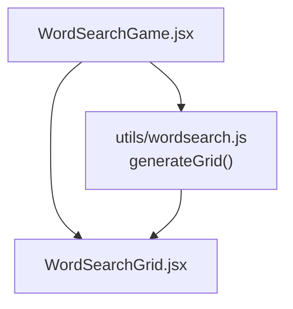
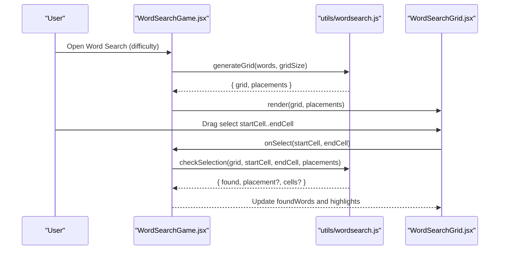
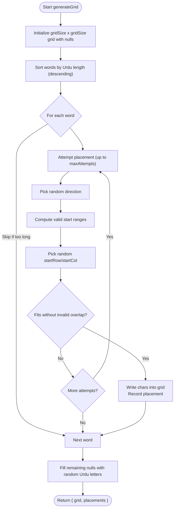
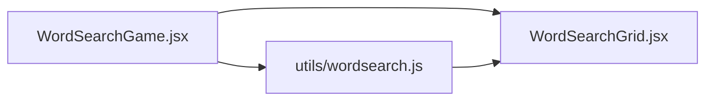

# Grid Generation Algorithm

<cite>
**Referenced Files in This Document**
- [wordsearch.js](file://zabandaan/client/src/utils/wordsearch.js)
- [WordSearchGame.jsx](file://zabandaan/client/src/pages/wordsearch/WordSearchGame.jsx)
- [WordSearchGrid.jsx](file://zabandaan/client/src/pages/wordsearch/WordSearchGrid.jsx)
</cite>

## Table of Contents
1. [Introduction](#introduction)
2. [Project Structure](#project-structure)
3. [Core Components](#core-components)
4. [Architecture Overview](#architecture-overview)
5. [Detailed Component Analysis](#detailed-component-analysis)
6. [Dependency Analysis](#dependency-analysis)
7. [Performance Considerations](#performance-considerations)
8. [Troubleshooting Guide](#troubleshooting-guide)
9. [Conclusion](#conclusion)

## Introduction
This document explains the word search grid generation algorithm centered on the generateGrid function. It covers how the algorithm initializes an empty grid, sorts words by length for optimal placement, and places words horizontally and vertically while handling Urdu characters. It also documents collision detection, boundary checks, randomization strategy, fallback filling with random Urdu letters, and edge case handling for words that are too long or cannot be placed after maximum attempts.

## Project Structure
The grid generation logic is implemented in a utility module and consumed by the game page. The UI renders the generated grid and handles user selection to validate found words.

**Diagram sources**
- [WordSearchGame.jsx:1-10](file://zabandaan/client/src/pages/wordsearch/WordSearchGame.jsx#L1-L10)
- [wordsearch.js:1-20](file://zabandaan/client/src/utils/wordsearch.js#L1-L20)
- [WordSearchGrid.jsx:1-10](file://zabandaan/client/src/pages/wordsearch/WordSearchGrid.jsx#L1-L10)

**Section sources**
- [WordSearchGame.jsx:1-50](file://zabandaan/client/src/pages/wordsearch/WordSearchGame.jsx#L1-L50)
- [wordsearch.js:1-100](file://zabandaan/client/src/utils/wordsearch.js#L1-L100)
- [WordSearchGrid.jsx:1-100](file://zabandaan/client/src/pages/wordsearch/WordSearchGrid.jsx#L1-L100)

## Core Components
- generateGrid(words, gridSize): Creates a square grid, sorts words by length (longest first), attempts to place each word in horizontal or vertical directions with randomized positions, validates boundaries and collisions, records placements, and fills remaining cells with random Urdu letters.
- checkSelection(grid, startCell, endCell, placements): Validates user selections against recorded placements, supporting forward and reverse matches along straight lines.

Key responsibilities:
- Initialization: Build an empty two-dimensional array sized gridSize x gridSize.
- Sorting: Sort input words by their Urdu character length descending to improve placement success.
- Placement: For each word, randomly choose direction and starting coordinates within bounds; verify no overlap unless characters match; record placement metadata.
- Fallback: Fill unfilled cells with random Urdu letters from a predefined set.
- Edge cases: Skip words longer than gridSize; stop trying after a fixed number of attempts per word.

**Section sources**
- [wordsearch.js:20-100](file://zabandaan/client/src/utils/wordsearch.js#L20-L100)
- [wordsearch.js:102-141](file://zabandaan/client/src/utils/wordsearch.js#L102-L141)

## Architecture Overview
The game fetches a list of words and calls generateGrid to produce both the visual grid and placement metadata. The UI renders the grid and uses checkSelection to evaluate user selections.

**Diagram sources**
- [WordSearchGame.jsx:24-86](file://zabandaan/client/src/pages/wordsearch/WordSearchGame.jsx#L24-L86)
- [wordsearch.js:20-100](file://zabandaan/client/src/utils/wordsearch.js#L20-L100)
- [wordsearch.js:102-141](file://zabandaan/client/src/utils/wordsearch.js#L102-L141)
- [WordSearchGrid.jsx:56-82](file://zabandaan/client/src/pages/wordsearch/WordSearchGrid.jsx#L56-L82)

## Detailed Component Analysis

### generateGrid Function
Purpose: Generate a playable word search grid with randomized layout while ensuring all valid words are placed if possible.

Algorithm steps:
- Initialize empty grid: Create a gridSize x gridSize matrix filled with null placeholders.
- Define directions: Horizontal (left-to-right) and Vertical (top-to-bottom).
- Sort words by length: Use Array.from to split Urdu strings into individual characters and sort longest-first to maximize placement chances.
- Place each word:
  - Skip if word length exceeds gridSize.
  - Randomly pick direction and compute valid start ranges based on direction and word length.
  - Attempt placement up to a fixed maximum number of tries.
  - For each attempt:
    - Compute candidate start row and column within bounds.
    - Check fit: ensure indices stay within grid and either cell is empty or contains the same character (to allow overlaps at intersections).
    - If fits, write characters into the grid and record placement details (word, meaning, direction, cells, startRow, startCol).
- Fill remaining cells: Iterate through the grid and replace any nulls with random Urdu letters from a predefined set.
- Return: Both the completed grid and the list of placements for validation and UI feedback.

Complexity considerations:
- Sorting: O(n log n) where n is the number of words.
- Placement loop: For each word, up to maxAttempts iterations; each iteration scans up to wordLen cells for collision checks. Overall roughly O(n * maxAttempts * avgWordLen).
- Filling: O(gridSize^2).

Edge cases handled:
- Words too long for the grid: Skipped automatically.
- Impossible placements: After maxAttempts, the word is not placed; the algorithm continues with other words.
- Overlaps: Allowed only when characters match at intersection points.

Randomization strategy:
- Direction choice is random per attempt.
- Start positions are uniformly sampled within valid ranges for the chosen direction.
- Fallback letters are randomly selected from the Urdu letter set.

Urdu character handling:
- Uses a safe splitting method to handle multi-byte characters correctly.
- Fallback filler uses a curated set of Urdu letters.

**Diagram sources**
- [wordsearch.js:20-100](file://zabandaan/client/src/utils/wordsearch.js#L20-L100)

**Section sources**
- [wordsearch.js:20-100](file://zabandaan/client/src/utils/wordsearch.js#L20-L100)

### checkSelection Function
Purpose: Validate user-drawn selections against recorded placements, supporting both forward and reverse matches along straight lines.

Behavior:
- Determine direction vector from start to end.
- Build the sequence of cells along the line.
- Construct the selected string and compare it to each placement’s string in both forward and reverse order.
- Return match result with placement and cells if found.

Usage in game:
- Called when user releases selection to determine if a word was found.
- Updates found words list and triggers scoring and UI feedback.

**Section sources**
- [wordsearch.js:102-141](file://zabandaan/client/src/utils/wordsearch.js#L102-L141)
- [WordSearchGame.jsx:52-77](file://zabandaan/client/src/pages/wordsearch/WordSearchGame.jsx#L52-L77)

### Integration with Game UI
- Difficulty affects grid size: easy uses 10x10, hard uses 12x12.
- On mount, the game fetches words and generates the grid using generateGrid.
- Users can regenerate puzzles to get new random layouts.
- Selection events are processed via checkSelection to mark found words.

**Section sources**
- [WordSearchGame.jsx:24-86](file://zabandaan/client/src/pages/wordsearch/WordSearchGame.jsx#L24-L86)

## Dependency Analysis
- WordSearchGame depends on generateGrid and checkSelection from utils/wordsearch.js.
- WordSearchGrid consumes the generated grid and placements to render interactive cells and highlight selections.
- No circular dependencies exist between these modules.

**Diagram sources**
- [WordSearchGame.jsx:1-10](file://zabandaan/client/src/pages/wordsearch/WordSearchGame.jsx#L1-L10)
- [wordsearch.js:1-20](file://zabandaan/client/src/utils/wordsearch.js#L1-L20)
- [WordSearchGrid.jsx:1-10](file://zabandaan/client/src/pages/wordsearch/WordSearchGrid.jsx#L1-L10)

**Section sources**
- [WordSearchGame.jsx:1-50](file://zabandaan/client/src/pages/wordsearch/WordSearchGame.jsx#L1-L50)
- [wordsearch.js:1-20](file://zabandaan/client/src/utils/wordsearch.js#L1-L20)
- [WordSearchGrid.jsx:1-20](file://zabandaan/client/src/pages/wordsearch/WordSearchGrid.jsx#L1-L20)

## Performance Considerations
- Sorting words by length reduces failed placements early, improving overall efficiency.
- Limiting attempts per word prevents infinite loops in dense grids or when words are difficult to place.
- Collision checks are linear in word length; keeping word lengths reasonable helps maintain responsiveness.
- Filling the grid is O(gridSize^2); for typical sizes (10–12), this is negligible.
- To further optimize:
  - Precompute valid start ranges once per direction per word.
  - Cache character sets for quick overlap checks if needed.
  - Consider shuffling the word list before sorting to add variety across regenerations.

[No sources needed since this section provides general guidance]

## Troubleshooting Guide
Common issues and resolutions:
- Words not appearing:
  - Verify word length does not exceed gridSize; such words are intentionally skipped.
  - Increase gridSize or reduce word count for denser puzzles.
  - Check that maxAttempts is sufficient; increasing it may help in constrained scenarios.
- Overlap conflicts:
  - Ensure overlapping characters match; otherwise, the placement is rejected.
  - Adjust word list to minimize conflicting intersections.
- Randomness not varying enough:
  - Regenerate the puzzle to obtain a new layout.
  - Shuffle the input word list before calling generateGrid to diversify results.
- Selection validation fails:
  - Confirm selections are straight lines (horizontal or vertical) as expected by checkSelection.
  - Ensure start and end cells are correctly captured by the UI event handlers.

**Section sources**
- [wordsearch.js:20-100](file://zabandaan/client/src/utils/wordsearch.js#L20-L100)
- [wordsearch.js:102-141](file://zabandaan/client/src/utils/wordsearch.js#L102-L141)
- [WordSearchGame.jsx:52-86](file://zabandaan/client/src/pages/wordsearch/WordSearchGame.jsx#L52-L86)

## Conclusion
The generateGrid function implements a robust, randomized word placement algorithm tailored for Urdu text. It initializes an empty grid, prioritizes longer words, and attempts horizontal and vertical placements with careful boundary and collision checks. Unfilled cells are filled with random Urdu letters to create a complete puzzle. The system gracefully handles edge cases like oversized words and placement failures by skipping or limiting attempts. Coupled with checkSelection, the solution provides a responsive and engaging word search experience with unique layouts on each regeneration.

[No sources needed since this section summarizes without analyzing specific files]