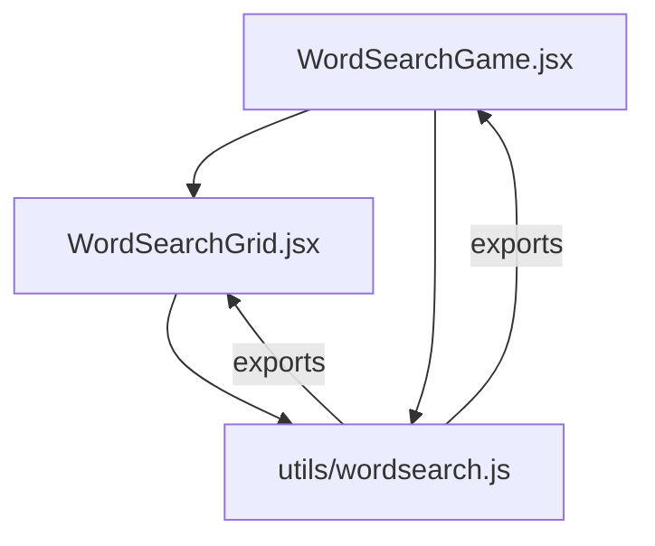
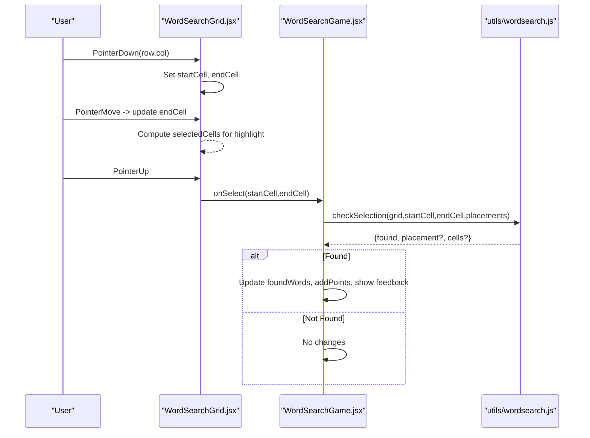
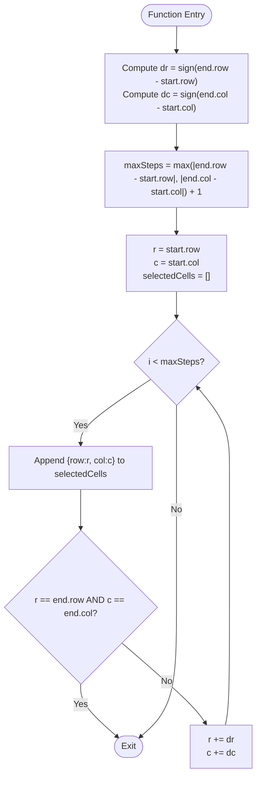
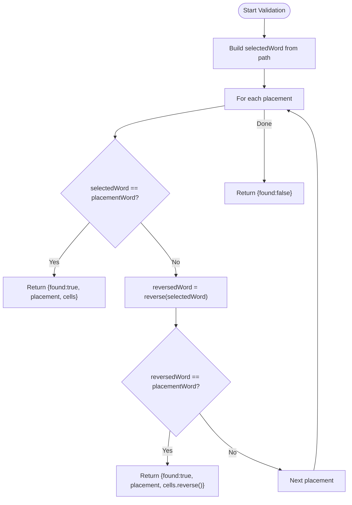
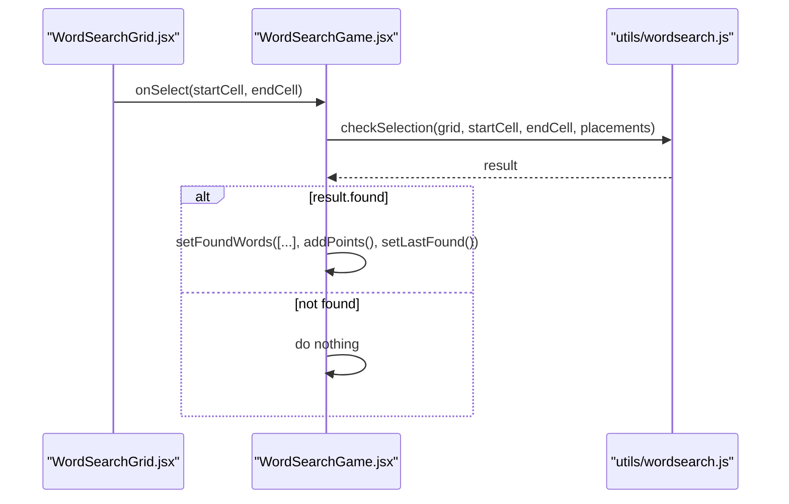
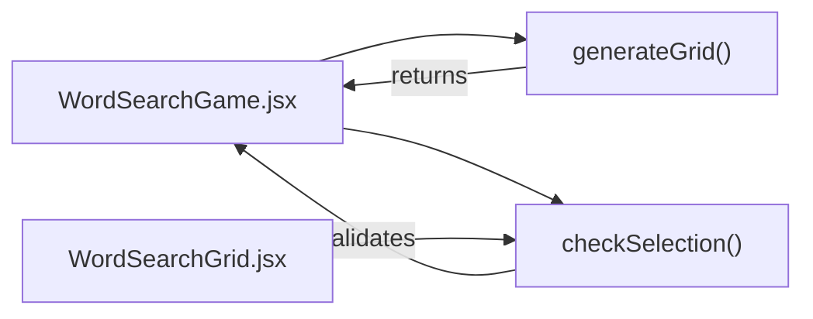

# Selection Detection & Validation

<cite>
**Referenced Files in This Document**
- [wordsearch.js](file://zabandaan/client/src/utils/wordsearch.js)
- [WordSearchGrid.jsx](file://zabandaan/client/src/pages/wordsearch/WordSearchGrid.jsx)
- [WordSearchGame.jsx](file://zabandaan/client/src/pages/wordsearch/WordSearchGame.jsx)
</cite>

## Table of Contents
1. [Introduction](#introduction)
2. [Project Structure](#project-structure)
3. [Core Components](#core-components)
4. [Architecture Overview](#architecture-overview)
5. [Detailed Component Analysis](#detailed-component-analysis)
6. [Dependency Analysis](#dependency-analysis)
7. [Performance Considerations](#performance-considerations)
8. [Troubleshooting Guide](#troubleshooting-guide)
9. [Conclusion](#conclusion)

## Introduction
This document explains the selection detection and validation system used in the Word Search feature, with a focus on the checkSelection function. It details how the algorithm determines direction from start to end cells, calculates the path between two points, builds the selected word sequence, and validates whether the selection matches any placed word. The system supports both forward and reverse matching to enable bidirectional word finding. It also covers examples of cell coordinate calculations, performance considerations for large grids, memory management during selection processing, and error handling for invalid or out-of-bounds selections.

## Project Structure
The selection detection and validation logic spans three primary files:
- Utility functions for grid generation and selection validation
- Grid component that captures user interactions and computes the current selection
- Game component that orchestrates selection events and updates game state

**Diagram sources**
- [WordSearchGame.jsx:1-10](file://zabandaan/client/src/pages/wordsearch/WordSearchGame.jsx#L1-L10)
- [WordSearchGrid.jsx:1-10](file://zabandaan/client/src/pages/wordsearch/WordSearchGrid.jsx#L1-L10)
- [wordsearch.js:1-20](file://zabandaan/client/src/utils/wordsearch.js#L1-L20)

**Section sources**
- [WordSearchGame.jsx:1-10](file://zabandaan/client/src/pages/wordsearch/WordSearchGame.jsx#L1-L10)
- [WordSearchGrid.jsx:1-10](file://zabandaan/client/src/pages/wordsearch/WordSearchGrid.jsx#L1-L10)
- [wordsearch.js:1-20](file://zabandaan/client/src/utils/wordsearch.js#L1-L20)

## Core Components
- Selection capture and highlighting: The grid component tracks pointer down/move/up events to compute start and end cells and highlight the selected segment in real time.
- Path calculation: Both the grid component and the utility compute the linear path from start to end using step deltas derived from sign differences.
- Validation: The utility compares the selected string against each placed word (forward and reverse) to determine if the selection is valid.

Key responsibilities:
- WordSearchGrid.jsx: Captures user input, computes temporary selection set for UI feedback, and delegates validation to the game layer.
- WordSearchGame.jsx: Invokes checkSelection upon selection end, updates found words, and manages scoring and UI feedback.
- utils/wordsearch.js: Implements checkSelection, including direction detection, path building, and bidirectional matching.

**Section sources**
- [WordSearchGrid.jsx:22-41](file://zabandaan/client/src/pages/wordsearch/WordSearchGrid.jsx#L22-L41)
- [WordSearchGame.jsx:52-77](file://zabandaan/client/src/pages/wordsearch/WordSearchGame.jsx#L52-L77)
- [wordsearch.js:102-140](file://zabandaan/client/src/utils/wordsearch.js#L102-L140)

## Architecture Overview
The selection flow begins with user interaction on the grid, proceeds through selection computation, and culminates in validation against placed words.

**Diagram sources**
- [WordSearchGrid.jsx:56-82](file://zabandaan/client/src/pages/wordsearch/WordSearchGrid.jsx#L56-L82)
- [WordSearchGame.jsx:52-77](file://zabandaan/client/src/pages/wordsearch/WordSearchGame.jsx#L52-L77)
- [wordsearch.js:102-140](file://zabandaan/client/src/utils/wordsearch.js#L102-L140)

## Detailed Component Analysis

### Direction Detection and Path Calculation
- Direction detection: The algorithm computes row and column deltas using the sign of the difference between end and start coordinates. This yields -1, 0, or 1 per axis, representing left/right, up/down, or no movement.
- Path building: Starting at the start cell, it iteratively steps by the computed deltas until reaching the end cell. The number of steps is determined by the maximum absolute difference along either axis plus one, ensuring inclusive coverage of endpoints.
- Example scenario:
  - Start at (2,3), end at (2,6): dr = 0, dc = 1; path includes (2,3), (2,4), (2,5), (2,6).
  - Start at (5,5), end at (3,5): dr = -1, dc = 0; path includes (5,5), (4,5), (3,5).
  - Start at (1,1), end at (1,1): dr = 0, dc = 0; path includes only (1,1).

These computations are implemented both in the grid component for UI highlighting and in the utility for validation.

**Section sources**
- [WordSearchGrid.jsx:22-41](file://zabandaan/client/src/pages/wordsearch/WordSearchGrid.jsx#L22-L41)
- [wordsearch.js:102-119](file://zabandaan/client/src/utils/wordsearch.js#L102-L119)

#### Flowchart: Path Building Algorithm

**Diagram sources**
- [wordsearch.js:102-119](file://zabandaan/client/src/utils/wordsearch.js#L102-L119)

### Selected Word Sequence Construction
- After computing the path, the utility maps each cell in the path to its character in the grid and joins them into a single string representing the selected word.
- This string is then compared against each placed word’s characters extracted from the placement’s recorded cells.

**Section sources**
- [wordsearch.js:121-125](file://zabandaan/client/src/utils/wordsearch.js#L121-L125)

### Validation Logic: Forward and Reverse Matching
- For each placement, the utility constructs the placement word from its stored cells and compares it to the selected word.
- If they match exactly, the selection is valid and returned with the placement and selected cells.
- If not, the utility reverses the selected word and compares again to support reverse selection. On reverse match, it returns the reversed list of selected cells so the UI can reflect correct orientation.

**Diagram sources**
- [wordsearch.js:121-140](file://zabandaan/client/src/utils/wordsearch.js#L121-L140)

**Section sources**
- [wordsearch.js:121-140](file://zabandaan/client/src/utils/wordsearch.js#L121-L140)

### Integration Points and Data Flow
- The grid component computes a temporary selection set for visual feedback and calls the game’s onSelect callback with start and end coordinates.
- The game component invokes checkSelection with the current grid, placements, and selection endpoints.
- Upon success, the game updates foundWords, awards points, and shows a brief flash of the last found word.

**Diagram sources**
- [WordSearchGrid.jsx:56-82](file://zabandaan/client/src/pages/wordsearch/WordSearchGrid.jsx#L56-L82)
- [WordSearchGame.jsx:52-77](file://zabandaan/client/src/pages/wordsearch/WordSearchGame.jsx#L52-L77)
- [wordsearch.js:102-140](file://zabandaan/client/src/utils/wordsearch.js#L102-L140)

**Section sources**
- [WordSearchGrid.jsx:56-82](file://zabandaan/client/src/pages/wordsearch/WordSearchGrid.jsx#L56-L82)
- [WordSearchGame.jsx:52-77](file://zabandaan/client/src/pages/wordsearch/WordSearchGame.jsx#L52-L77)
- [wordsearch.js:102-140](file://zabandaan/client/src/utils/wordsearch.js#L102-L140)

## Dependency Analysis
- WordSearchGame depends on utils/wordsearch for generateGrid and checkSelection, and on WordSearchGrid for rendering and event capture.
- WordSearchGrid depends on utils/wordsearch indirectly via props but primarily uses local logic for selection visualization.
- The validation logic is centralized in utils/wordsearch, promoting reuse and consistency across components.

**Diagram sources**
- [WordSearchGame.jsx:1-10](file://zabandaan/client/src/pages/wordsearch/WordSearchGame.jsx#L1-L10)
- [WordSearchGame.jsx:52-77](file://zabandaan/client/src/pages/wordsearch/WordSearchGame.jsx#L52-L77)
- [wordsearch.js:20-100](file://zabandaan/client/src/utils/wordsearch.js#L20-L100)
- [wordsearch.js:102-140](file://zabandaan/client/src/utils/wordsearch.js#L102-L140)

**Section sources**
- [WordSearchGame.jsx:1-10](file://zabandaan/client/src/pages/wordsearch/WordSearchGame.jsx#L1-L10)
- [wordsearch.js:20-100](file://zabandaan/client/src/utils/wordsearch.js#L20-L100)
- [wordsearch.js:102-140](file://zabandaan/client/src/utils/wordsearch.js#L102-L140)

## Performance Considerations
- Time complexity:
  - Path building: O(k), where k is the number of cells in the selection.
  - Validation: O(p × k), where p is the number of placements and k is the length of the selected word. Each placement requires constructing its word string and comparing it once (plus an optional reverse comparison).
- Memory usage:
  - Temporary arrays and strings are created per selection and discarded after validation, keeping peak memory low.
  - The grid component maintains small sets for found and selected cells, which scale with the number of found words and current selection length.
- Large grids:
  - For larger grids (e.g., hard difficulty), selection remains efficient because path building and validation depend on selection length and placement count, not total grid size.
  - Avoid unnecessary recomputation by relying on memoized selection sets in the grid component.
- Optimization opportunities:
  - Precompute placement words once per puzzle generation to avoid repeated mapping during validation.
  - Use early exit when a match is found to minimize comparisons.
  - Consider hashing placement words to reduce string comparisons if placement counts grow significantly.

[No sources needed since this section provides general guidance]

## Troubleshooting Guide
- Invalid or out-of-bounds selections:
  - The grid component extracts row and column from DOM attributes and validates them before setting state. If values are NaN, selection is ignored.
  - The path-building loop ensures it stops when reaching the end cell, preventing infinite loops even if deltas are zero.
- No match found:
  - Ensure the selection forms a straight line aligned with the intended direction. Diagonal selections are not supported by the current algorithm.
  - Verify that the selection direction matches the placement direction or its reverse.
- Duplicate findings:
  - The game component checks if a word has already been found before adding it again, preventing duplicate entries.
- Error handling:
  - Network errors during puzzle load are caught and displayed to the user.
  - Demo panel handles generation errors gracefully and resets state.

**Section sources**
- [WordSearchGrid.jsx:43-54](file://zabandaan/client/src/pages/wordsearch/WordSearchGrid.jsx#L43-L54)
- [WordSearchGame.jsx:27-50](file://zabandaan/client/src/pages/wordsearch/WordSearchGame.jsx#L27-L50)
- [wordsearch.js:102-140](file://zabandaan/client/src/utils/wordsearch.js#L102-L140)

## Conclusion
The selection detection and validation system combines precise path calculation with robust bidirectional matching to accurately identify user selections against placed words. Its design keeps validation logic centralized and reusable, while the UI components efficiently handle interaction and feedback. With careful attention to performance and error handling, the system scales well for typical grid sizes and offers a responsive user experience.

[No sources needed since this section summarizes without analyzing specific files]