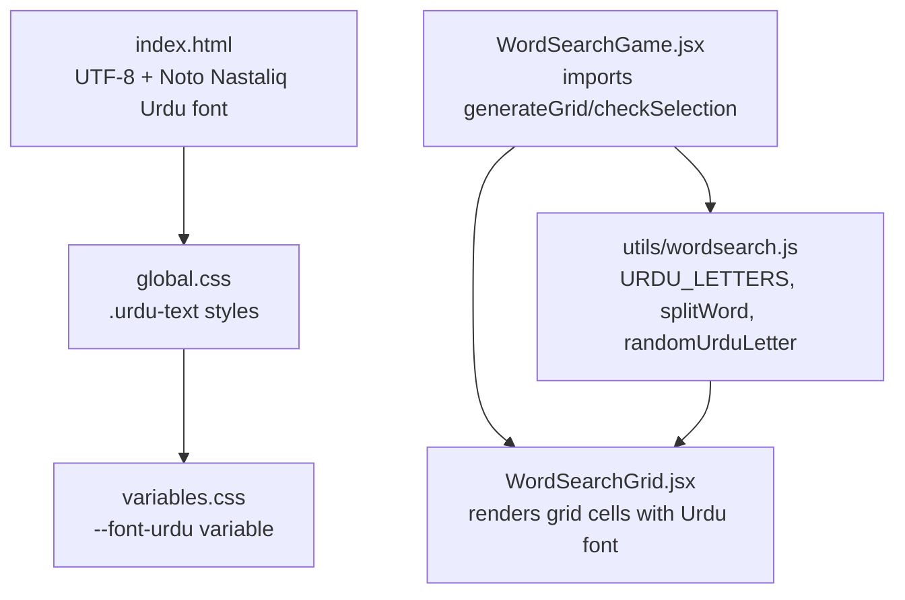
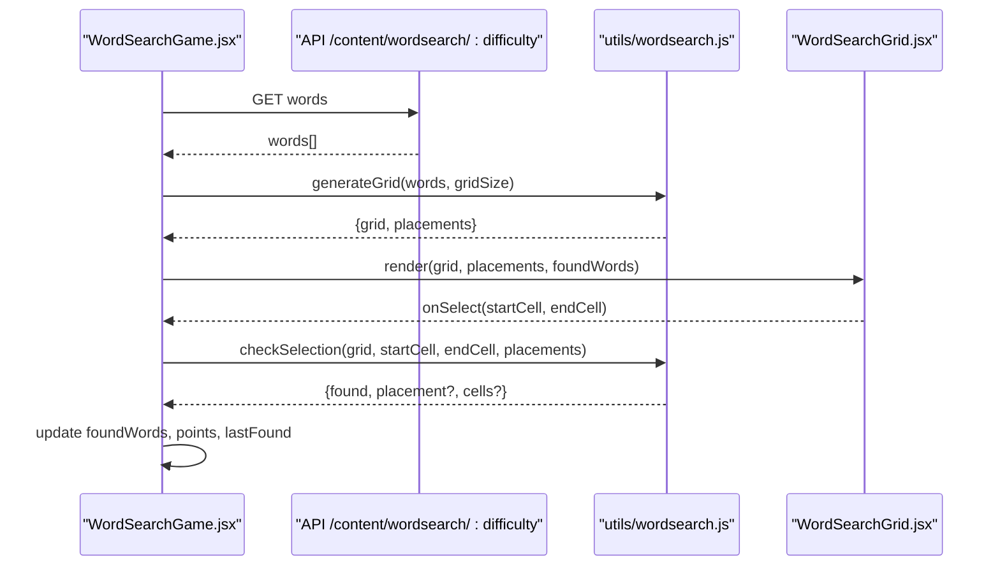
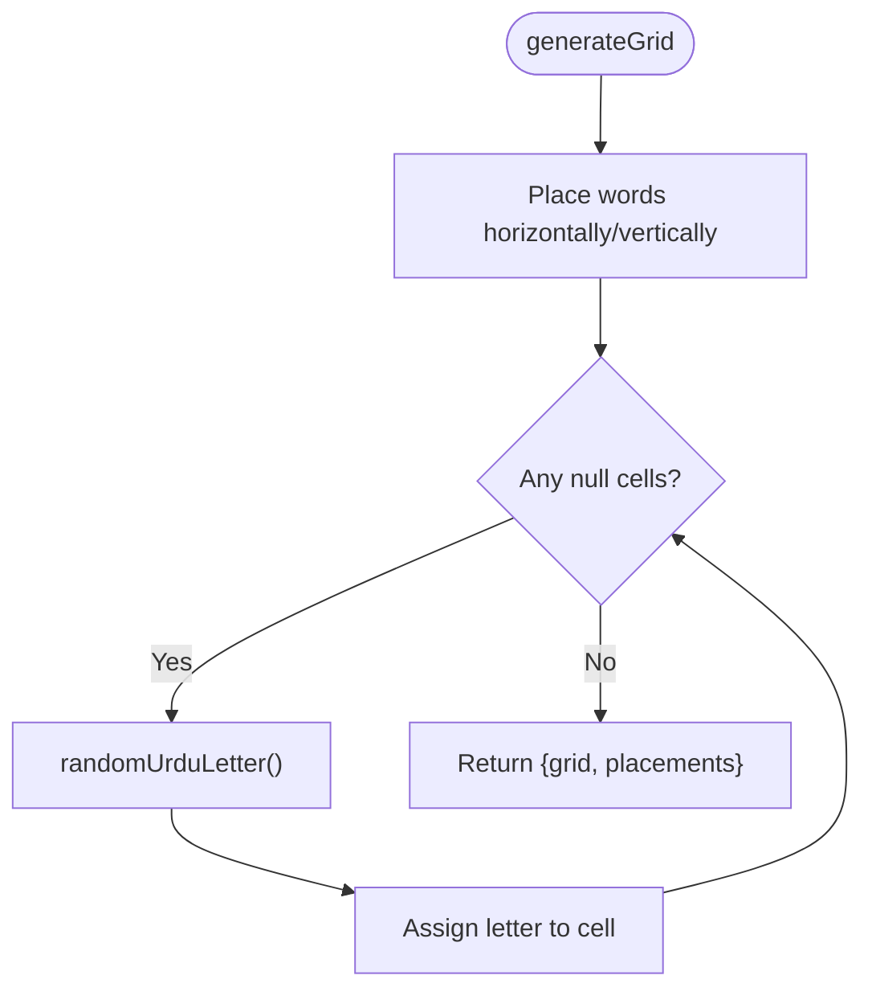
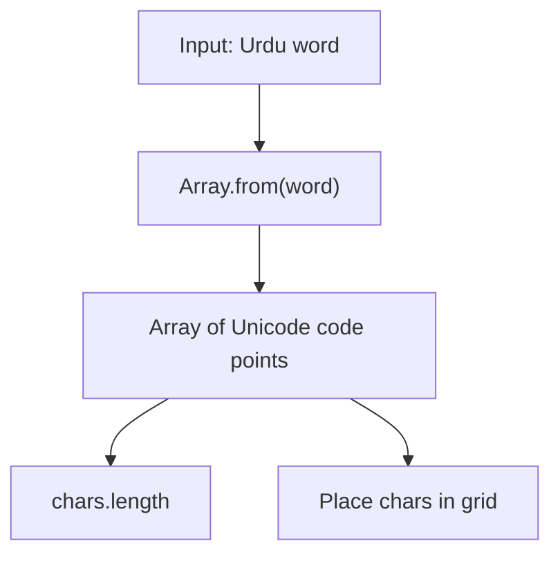
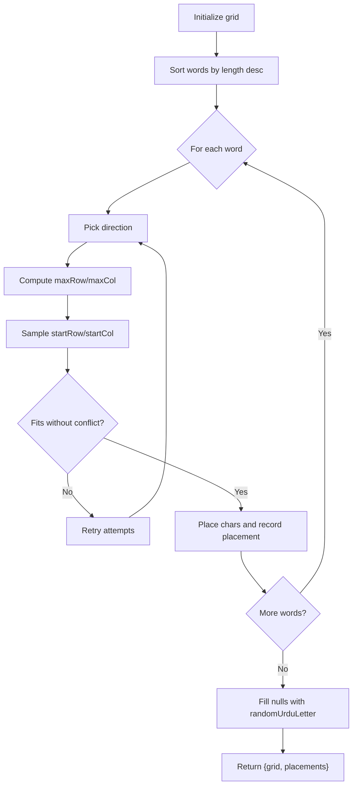
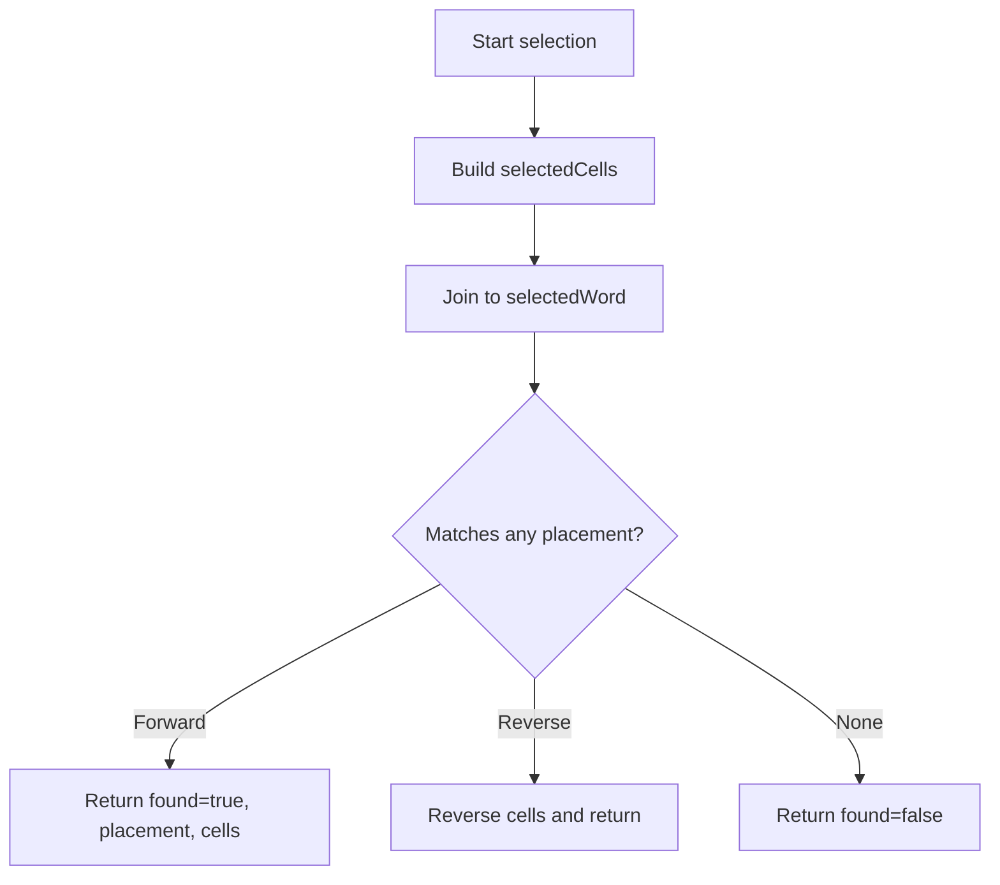
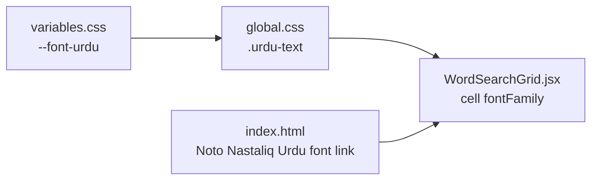
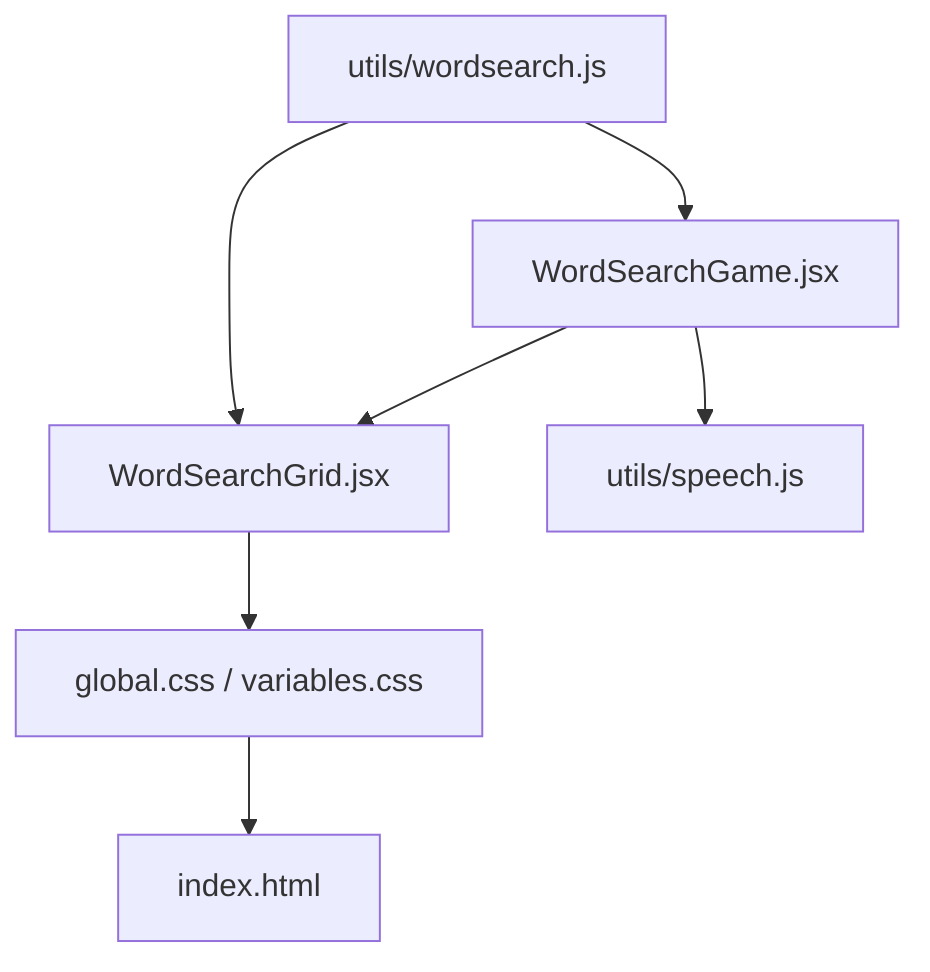

# Urdu Character Utilities

<cite>
**Referenced Files in This Document**
- [wordsearch.js](file://zabandaan/client/src/utils/wordsearch.js)
- [WordSearchGame.jsx](file://zabandaan/client/src/pages/wordsearch/WordSearchGame.jsx)
- [WordSearchGrid.jsx](file://zabandaan/client/src/pages/wordsearch/WordSearchGrid.jsx)
- [index.html](file://zabandaan/client/index.html)
- [global.css](file://zabandaan/client/src/styles/global.css)
- [variables.css](file://zabandaan/client/src/styles/variables.css)
- [speech.js](file://zabandaan/client/src/utils/speech.js)
</cite>

## Table of Contents
1. [Introduction](#introduction)
2. [Project Structure](#project-structure)
3. [Core Components](#core-components)
4. [Architecture Overview](#architecture-overview)
5. [Detailed Component Analysis](#detailed-component-analysis)
6. [Dependency Analysis](#dependency-analysis)
7. [Performance Considerations](#performance-considerations)
8. [Troubleshooting Guide](#troubleshooting-guide)
9. [Conclusion](#conclusion)
10. [Appendices](#appendices)

## Introduction
This document explains the Urdu character handling utilities used by the word search feature, focusing on:
- The URDU_LETTERS array that provides filler characters for grid cells
- The splitWord function that correctly splits multi-byte Urdu characters using Array.from()
- The randomUrduLetter function that generates random Urdu letters to fill empty grid cells
It also covers Unicode and encoding considerations for Urdu text, best practices for internationalization and localization in JavaScript applications, and how these utilities integrate with the broader word search system.

## Project Structure
The Urdu utilities live in a dedicated utility module and are consumed by the word search game components. The HTML and CSS ensure proper encoding and rendering of Urdu script.

**Diagram sources**
- [index.html:1-15](file://zabandaan/client/index.html#L1-L15)
- [global.css:22-26](file://zabandaan/client/src/styles/global.css#L22-L26)
- [variables.css:19-20](file://zabandaan/client/src/styles/variables.css#L19-L20)
- [WordSearchGame.jsx:1-10](file://zabandaan/client/src/pages/wordsearch/WordSearchGame.jsx#L1-L10)
- [wordsearch.js:1-18](file://zabandaan/client/src/utils/wordsearch.js#L1-L18)
- [WordSearchGrid.jsx:1-10](file://zabandaan/client/src/pages/wordsearch/WordSearchGrid.jsx#L1-L10)

**Section sources**
- [index.html:1-15](file://zabandaan/client/index.html#L1-L15)
- [global.css:22-26](file://zabandaan/client/src/styles/global.css#L22-L26)
- [variables.css:19-20](file://zabandaan/client/src/styles/variables.css#L19-L20)
- [WordSearchGame.jsx:1-10](file://zabandaan/client/src/pages/wordsearch/WordSearchGame.jsx#L1-L10)
- [wordsearch.js:1-18](file://zabandaan/client/src/utils/wordsearch.js#L1-L18)
- [WordSearchGrid.jsx:1-10](file://zabandaan/client/src/pages/wordsearch/WordSearchGrid.jsx#L1-L10)

## Core Components
- URDU_LETTERS: A curated set of Urdu characters used to fill non-word cells in the grid. It includes common Urdu graphemes needed for realistic-looking puzzles.
- splitWord(word): Splits an Urdu string into its constituent characters using Array.from(), which respects Unicode code points (including combining marks and ligatures).
- randomUrduLetter(): Returns a random character from URDU_LETTERS to populate empty grid cells.
- generateGrid(words, gridSize): Builds a grid, places words horizontally or vertically, and fills remaining cells with random Urdu letters.
- checkSelection(grid, startCell, endCell, placements): Validates user selections against placed words, supporting forward and reverse matches.

These utilities together enable correct processing and display of Urdu text in the word search puzzle.

**Section sources**
- [wordsearch.js:4-18](file://zabandaan/client/src/utils/wordsearch.js#L4-L18)
- [wordsearch.js:20-100](file://zabandaan/client/src/utils/wordsearch.js#L20-L100)
- [wordsearch.js:102-140](file://zabandaan/client/src/utils/wordsearch.js#L102-L140)

## Architecture Overview
The word search flow integrates UI state management with the core algorithm:

**Diagram sources**
- [WordSearchGame.jsx:26-50](file://zabandaan/client/src/pages/wordsearch/WordSearchGame.jsx#L26-L50)
- [WordSearchGame.jsx:52-77](file://zabandaan/client/src/pages/wordsearch/WordSearchGame.jsx#L52-L77)
- [wordsearch.js:20-100](file://zabandaan/client/src/utils/wordsearch.js#L20-L100)
- [wordsearch.js:102-140](file://zabandaan/client/src/utils/wordsearch.js#L102-L140)

## Detailed Component Analysis

### URDU_LETTERS and randomUrduLetter
- Purpose: Provide a consistent set of Urdu characters for filling empty grid cells so the puzzle looks natural and challenging.
- Behavior: randomUrduLetter selects uniformly at random from URDU_LETTERS.
- Integration: Used during grid generation to fill null cells after placing all words.

**Diagram sources**
- [wordsearch.js:20-100](file://zabandaan/client/src/utils/wordsearch.js#L20-L100)

**Section sources**
- [wordsearch.js:4-13](file://zabandaan/client/src/utils/wordsearch.js#L4-L13)
- [wordsearch.js:90-97](file://zabandaan/client/src/utils/wordsearch.js#L90-L97)

### splitWord and Unicode Handling
- Problem: Strings in JavaScript are sequences of UTF-16 code units; some Urdu characters may be represented by multiple code units or involve combining marks.
- Solution: Array.from(string) iterates over actual Unicode code points, ensuring correct splitting of multi-byte characters.
- Usage: Applied when computing word lengths and extracting characters for placement.

**Diagram sources**
- [wordsearch.js:15-18](file://zabandaan/client/src/utils/wordsearch.js#L15-L18)
- [wordsearch.js:32-41](file://zabandaan/client/src/utils/wordsearch.js#L32-L41)

**Section sources**
- [wordsearch.js:15-18](file://zabandaan/client/src/utils/wordsearch.js#L15-L18)
- [wordsearch.js:32-41](file://zabandaan/client/src/utils/wordsearch.js#L32-L41)

### generateGrid Algorithm
- Steps:
  - Initialize an empty grid.
  - Sort words by length (longest first) to improve placement success.
  - For each word, attempt random horizontal or vertical placements until it fits without conflicts.
  - Record successful placements with metadata (direction, cells, start coordinates).
  - Fill remaining null cells with random Urdu letters.
- Output: An object containing the final grid and a list of placements.

**Diagram sources**
- [wordsearch.js:20-100](file://zabandaan/client/src/utils/wordsearch.js#L20-L100)

**Section sources**
- [wordsearch.js:20-100](file://zabandaan/client/src/utils/wordsearch.js#L20-L100)

### checkSelection Logic
- Determines the line between start and end cells.
- Builds the selected sequence of characters from the grid.
- Compares against placed words in both forward and reverse directions.
- Returns match details if found.

**Diagram sources**
- [wordsearch.js:102-140](file://zabandaan/client/src/utils/wordsearch.js#L102-L140)

**Section sources**
- [wordsearch.js:102-140](file://zabandaan/client/src/utils/wordsearch.js#L102-L140)

### Rendering and Font Configuration
- The grid component renders each cell with a consistent font stack that prioritizes a high-quality Urdu Nastaliq font.
- Global styles define a reusable .urdu-text class with right-to-left direction and appropriate line height.
- Variables centralize font definitions for consistency across components.

**Diagram sources**
- [variables.css:19-20](file://zabandaan/client/src/styles/variables.css#L19-L20)
- [global.css:22-26](file://zabandaan/client/src/styles/global.css#L22-L26)
- [WordSearchGrid.jsx:177-187](file://zabandaan/client/src/pages/wordsearch/WordSearchGrid.jsx#L177-L187)
- [index.html:7-9](file://zabandaan/client/index.html#L7-L9)

**Section sources**
- [WordSearchGrid.jsx:177-187](file://zabandaan/client/src/pages/wordsearch/WordSearchGrid.jsx#L177-L187)
- [global.css:22-26](file://zabandaan/client/src/styles/global.css#L22-L26)
- [variables.css:19-20](file://zabandaan/client/src/styles/variables.css#L19-L20)
- [index.html:7-9](file://zabandaan/client/index.html#L7-L9)

## Dependency Analysis
- WordSearchGame depends on:
  - utils/wordsearch.js for grid generation and validation
  - WordSearchGrid for interactive rendering
  - Speech utilities for audio feedback (optional integration)
- wordsearch.js is self-contained and does not depend on React; it can be reused elsewhere.
- Rendering relies on global CSS and variables for consistent Urdu typography.

**Diagram sources**
- [WordSearchGame.jsx:1-10](file://zabandaan/client/src/pages/wordsearch/WordSearchGame.jsx#L1-L10)
- [wordsearch.js:1-18](file://zabandaan/client/src/utils/wordsearch.js#L1-L18)
- [WordSearchGrid.jsx:1-10](file://zabandaan/client/src/pages/wordsearch/WordSearchGrid.jsx#L1-L10)
- [speech.js:63-75](file://zabandaan/client/src/utils/speech.js#L63-L75)
- [global.css:22-26](file://zabandaan/client/src/styles/global.css#L22-L26)
- [variables.css:19-20](file://zabandaan/client/src/styles/variables.css#L19-L20)
- [index.html:7-9](file://zabandaan/client/index.html#L7-L9)

**Section sources**
- [WordSearchGame.jsx:1-10](file://zabandaan/client/src/pages/wordsearch/WordSearchGame.jsx#L1-L10)
- [wordsearch.js:1-18](file://zabandaan/client/src/utils/wordsearch.js#L1-L18)
- [WordSearchGrid.jsx:1-10](file://zabandaan/client/src/pages/wordsearch/WordSearchGrid.jsx#L1-L10)
- [speech.js:63-75](file://zabandaan/client/src/utils/speech.js#L63-L75)
- [global.css:22-26](file://zabandaan/client/src/styles/global.css#L22-L26)
- [variables.css:19-20](file://zabandaan/client/src/styles/variables.css#L19-L20)
- [index.html:7-9](file://zabandaan/client/index.html#L7-L9)

## Performance Considerations
- Sorting words by length reduces backtracking and improves placement success rate.
- Using Array.from ensures correct character counts without expensive regex or manual iteration.
- Randomized placement with bounded attempts avoids infinite loops while maintaining variety.
- Rendering uses efficient DOM updates via React; selection highlighting computes sets once per interaction.

[No sources needed since this section provides general guidance]

## Troubleshooting Guide
- Words not appearing:
  - Verify that words fit within the grid size; overly long words are skipped.
  - Ensure splitWord returns the expected number of characters; confirm input strings are valid Unicode.
- Incorrect matching:
  - Confirm that checkSelection compares both forward and reverse sequences.
  - Validate that grid values are stored as single Unicode characters.
- Display issues:
  - Ensure index.html declares UTF-8 and loads the Urdu font.
  - Use .urdu-text or the configured font variable for consistent rendering.
- Audio feedback:
  - If speech synthesis fails, fallback mechanisms are in place; verify network access for TTS endpoints.

**Section sources**
- [wordsearch.js:32-41](file://zabandaan/client/src/utils/wordsearch.js#L32-L41)
- [wordsearch.js:102-140](file://zabandaan/client/src/utils/wordsearch.js#L102-L140)
- [index.html:1-9](file://zabandaan/client/index.html#L1-L9)
- [global.css:22-26](file://zabandaan/client/src/styles/global.css#L22-L26)
- [speech.js:77-154](file://zabandaan/client/src/utils/speech.js#L77-L154)

## Conclusion
The Urdu character utilities provide a robust foundation for generating and validating word search puzzles in Urdu. By leveraging Array.from for Unicode-aware splitting, a curated set of filler characters, and careful grid algorithms, the system ensures accurate text processing and pleasant user experiences. Proper encoding and font configuration complete the pipeline, enabling reliable display and interaction with Urdu content across devices.

[No sources needed since this section summarizes without analyzing specific files]

## Appendices

### Best Practices for Internationalization and Localization in JavaScript
- Always use UTF-8 encoding in HTML documents.
- Prefer Array.from for iterating over strings to handle surrogate pairs and combining marks correctly.
- Centralize fonts and RTL settings in CSS variables and classes for consistency.
- When comparing or reversing strings, consider locale-aware methods if needed; for simple scripts like Urdu, direct operations often suffice.
- Provide fallbacks for features like speech synthesis and external resources.

[No sources needed since this section provides general guidance]