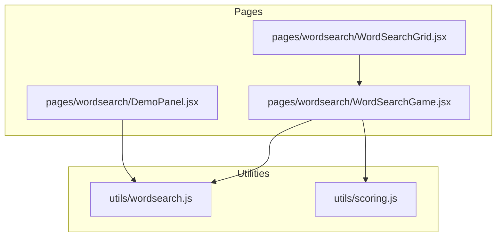
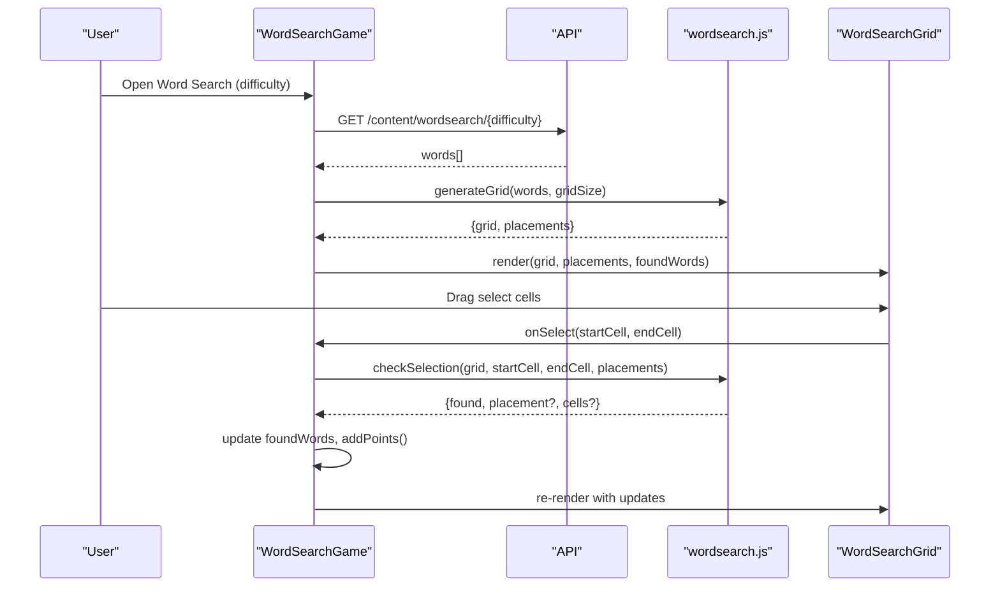
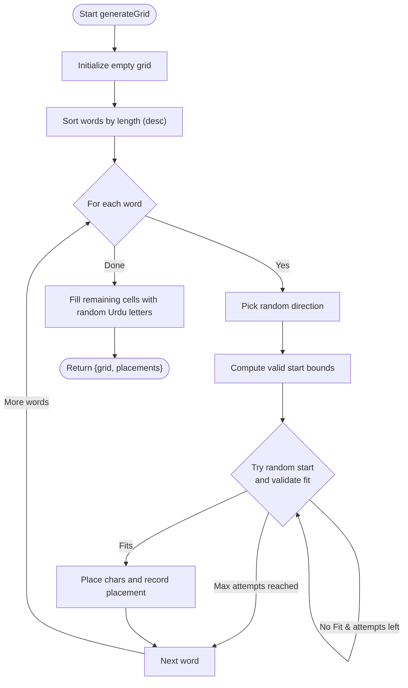
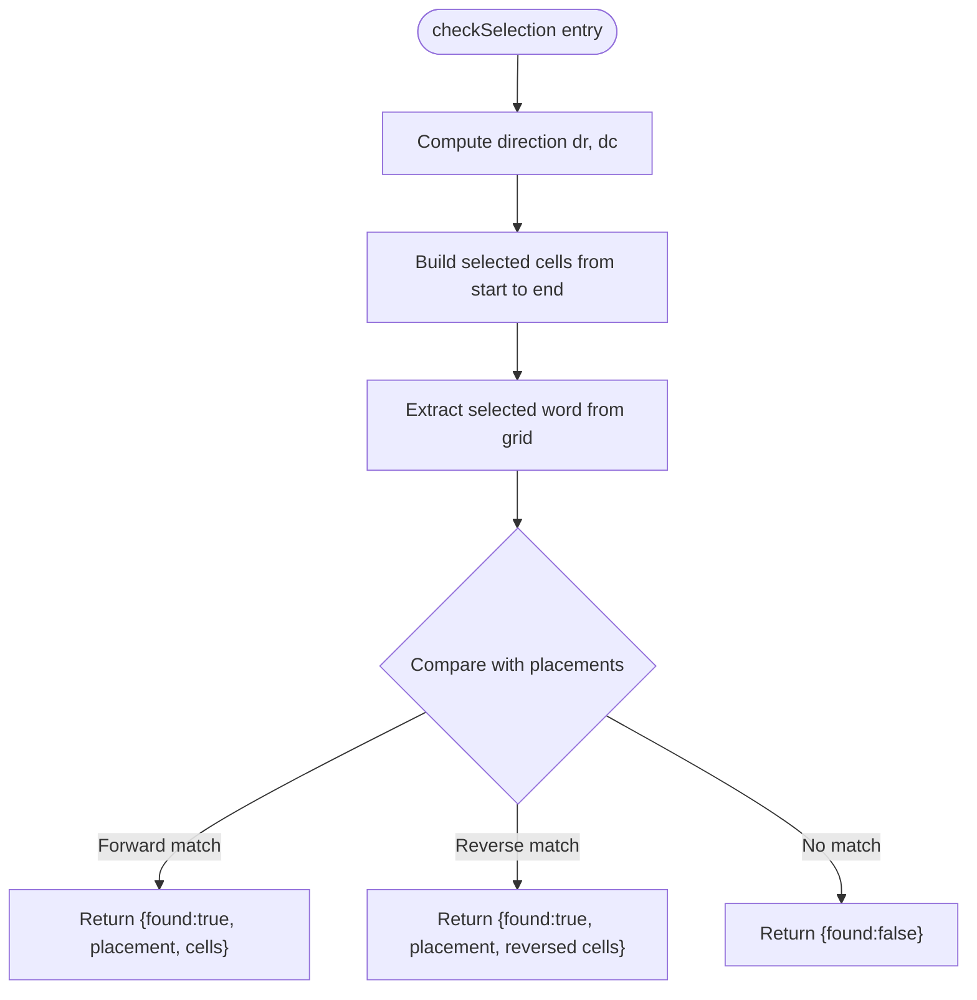
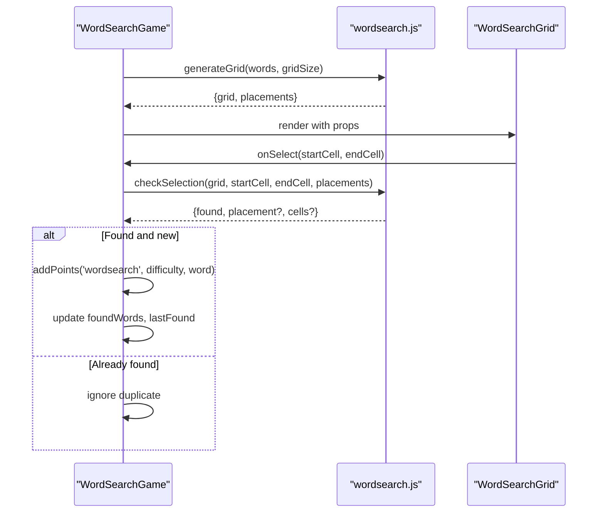
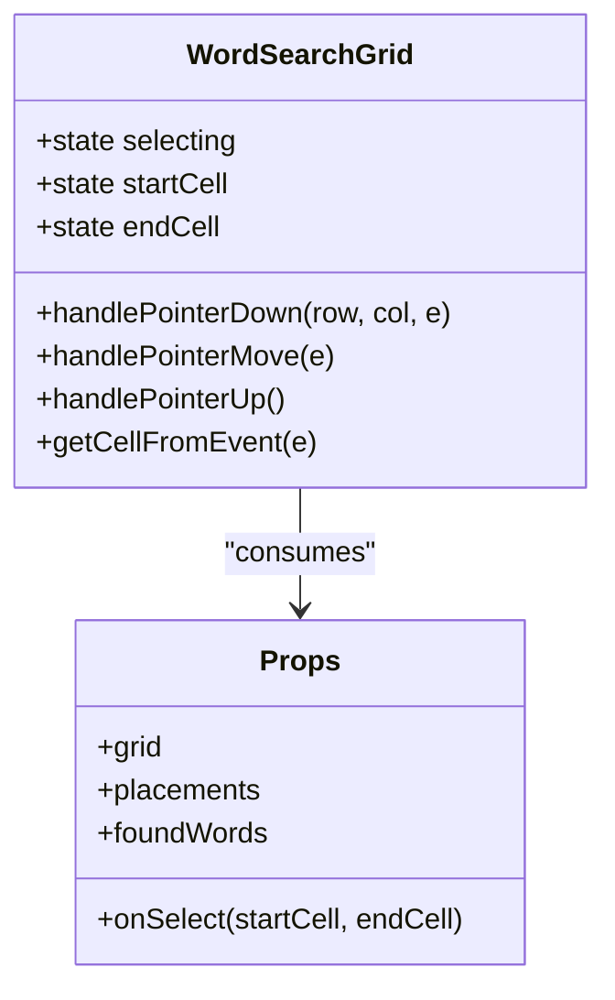
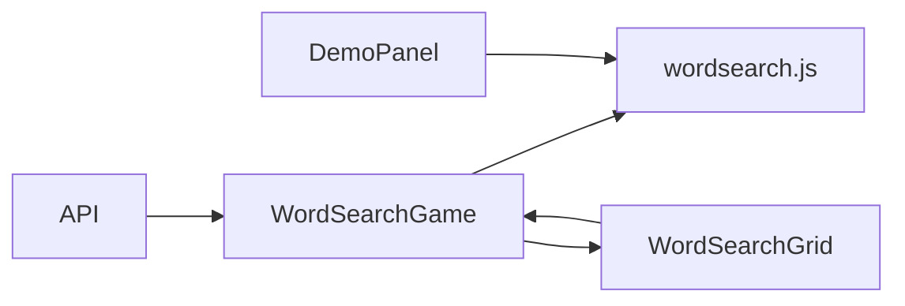

# Word Search Utilities

<cite>
**Referenced Files in This Document**
- [wordsearch.js](file://zabandaan/client/src/utils/wordsearch.js)
- [WordSearchGame.jsx](file://zabandaan/client/src/pages/wordsearch/WordSearchGame.jsx)
- [WordSearchGrid.jsx](file://zabandaan/client/src/pages/wordsearch/WordSearchGrid.jsx)
- [DemoPanel.jsx](file://zabandaan/client/src/pages/wordsearch/DemoPanel.jsx)
- [scoring.js](file://zabandaan/client/src/utils/scoring.js)
</cite>

## Table of Contents
1. [Introduction](#introduction)
2. [Project Structure](#project-structure)
3. [Core Components](#core-components)
4. [Architecture Overview](#architecture-overview)
5. [Detailed Component Analysis](#detailed-component-analysis)
6. [Dependency Analysis](#dependency-analysis)
7. [Performance Considerations](#performance-considerations)
8. [Troubleshooting Guide](#troubleshooting-guide)
9. [Conclusion](#conclusion)
10. [Appendices](#appendices)

## Introduction
This document explains the word search utilities that power dynamic grid generation and puzzle solving for Urdu-language puzzles. It covers:
- Grid creation algorithms that place words horizontally and vertically with randomization to ensure unique layouts
- Word placement constraints that prevent overlaps and maintain readability
- Puzzle validation via selection detection that identifies user-selected word sequences
- Scoring mechanisms integrated into the game flow
- Relationship between the utility functions and the WordSearchGame component
- Handling of different grid sizes, word counts, and language-specific character sets (Urdu)
- Performance considerations for large grids and memory management
- Testing strategies for edge cases such as impossible placements or invalid inputs

## Project Structure
The word search feature is implemented across a small set of focused modules:
- Utility layer:
  - Grid generation and selection checking
- UI layer:
  - Game orchestration and state management
  - Interactive grid rendering and selection handling
  - Demo panel for client-side puzzle generation
- Scoring utility:
  - Trace scoring used elsewhere in the app; not directly invoked by word search but relevant for overall scoring strategy

**Diagram sources**
- [wordsearch.js:20-99](file://zabandaan/client/src/utils/wordsearch.js#L20-L99)
- [WordSearchGame.jsx:27-86](file://zabandaan/client/src/pages/wordsearch/WordSearchGame.jsx#L27-L86)
- [WordSearchGrid.jsx:3-83](file://zabandaan/client/src/pages/wordsearch/WordSearchGrid.jsx#L3-L83)
- [DemoPanel.jsx:12-40](file://zabandaan/client/src/pages/wordsearch/DemoPanel.jsx#L12-L40)
- [scoring.js:106-140](file://zabandaan/client/src/utils/scoring.js#L106-L140)

**Section sources**
- [wordsearch.js:1-141](file://zabandaan/client/src/utils/wordsearch.js#L1-L141)
- [WordSearchGame.jsx:1-395](file://zabandaan/client/src/pages/wordsearch/WordSearchGame.jsx#L1-L395)
- [WordSearchGrid.jsx:1-189](file://zabandaan/client/src/pages/wordsearch/WordSearchGrid.jsx#L1-L189)
- [DemoPanel.jsx:1-260](file://zabandaan/client/src/pages/wordsearch/DemoPanel.jsx#L1-L260)
- [scoring.js:1-151](file://zabandaan/client/src/utils/scoring.js#L1-L151)

## Core Components
- Grid generation algorithm:
  - Initializes an empty grid
  - Sorts words by length (longest first) to improve placement success
  - Places words in horizontal and vertical directions with randomized start positions and attempts up to a fixed limit
  - Fills remaining cells with random Urdu letters
  - Returns both the grid and metadata about placements (cells, direction, start coordinates)
- Selection detection:
  - Computes the straight-line path from start to end cell
  - Extracts the selected sequence and compares it against placed words (forward and reverse)
  - Returns match details including cells and placement metadata
- Game integration:
  - Fetches word lists based on difficulty
  - Generates grid and tracks found words
  - Handles regeneration and user interactions
- Grid rendering:
  - Renders interactive grid cells
  - Supports drag selection and highlights selected/found cells
  - Emits selection events to the parent component
- Demo panel:
  - Allows users to paste Urdu words and generate a grid client-side
  - Displays generated grid and placed words

**Section sources**
- [wordsearch.js:20-141](file://zabandaan/client/src/utils/wordsearch.js#L20-L141)
- [WordSearchGame.jsx:27-86](file://zabandaan/client/src/pages/wordsearch/WordSearchGame.jsx#L27-L86)
- [WordSearchGrid.jsx:3-83](file://zabandaan/client/src/pages/wordsearch/WordSearchGrid.jsx#L3-L83)
- [DemoPanel.jsx:12-40](file://zabandaan/client/src/pages/wordsearch/DemoPanel.jsx#L12-L40)

## Architecture Overview
The system follows a clear separation of concerns:
- The WordSearchGame component orchestrates data fetching, grid generation, and user state
- The wordsearch utility encapsulates deterministic and randomized logic for grid creation and selection validation
- The WordSearchGrid component handles interaction and visual feedback
- The DemoPanel provides a sandbox for generating puzzles locally

**Diagram sources**
- [WordSearchGame.jsx:27-86](file://zabandaan/client/src/pages/wordsearch/WordSearchGame.jsx#L27-L86)
- [wordsearch.js:20-141](file://zabandaan/client/src/utils/wordsearch.js#L20-L141)
- [WordSearchGrid.jsx:56-83](file://zabandaan/client/src/pages/wordsearch/WordSearchGrid.jsx#L56-L83)

## Detailed Component Analysis

### Grid Generation Algorithm
- Input:
  - Array of word objects containing Urdu text and optional meaning
  - Grid size parameter (default 10; hard mode uses 12)
- Process:
  - Initialize empty grid
  - Sort words by length descending to prioritize longer words
  - For each word:
    - Choose a random direction (horizontal or vertical)
    - Compute valid start ranges based on direction and word length
    - Randomly pick start row/column within valid range
    - Validate fit:
      - Ensure no out-of-bounds
      - Ensure no conflict with existing non-matching characters
    - If fits, place characters and record placement metadata
    - Repeat up to a maximum number of attempts per word
  - Fill unplaced cells with random Urdu letters
- Output:
  - Grid matrix
  - Placements array with word, meaning, direction, cells, startRow, startCol

**Diagram sources**
- [wordsearch.js:20-99](file://zabandaan/client/src/utils/wordsearch.js#L20-L99)

**Section sources**
- [wordsearch.js:20-99](file://zabandaan/client/src/utils/wordsearch.js#L20-L99)

### Selection Detection Algorithm
- Input:
  - Grid matrix
  - Start and end cells representing user selection
  - Placements metadata
- Process:
  - Determine direction vector from start to end
  - Build list of selected cells along the straight line
  - Extract selected word string from grid
  - Compare selected string with each placement’s word (forward and reverse)
- Output:
  - Match result including found flag, placement info, and selected cells if matched

**Diagram sources**
- [wordsearch.js:102-141](file://zabandaan/client/src/utils/wordsearch.js#L102-L141)

**Section sources**
- [wordsearch.js:102-141](file://zabandaan/client/src/utils/wordsearch.js#L102-L141)

### WordSearchGame Integration
- Responsibilities:
  - Fetch word lists by difficulty
  - Generate grid using utility functions
  - Manage state for found words and last found feedback
  - Handle selection events and score points
  - Provide regenerate functionality
- Difficulty handling:
  - Easy: 10x10 grid
  - Hard: 12x12 grid
- Interaction flow:
  - On selection, call checkSelection
  - If match found and not already found, update state and add points
  - Clear last-found highlight after a short delay

**Diagram sources**
- [WordSearchGame.jsx:27-86](file://zabandaan/client/src/pages/wordsearch/WordSearchGame.jsx#L27-L86)
- [wordsearch.js:20-141](file://zabandaan/client/src/utils/wordsearch.js#L20-L141)

**Section sources**
- [WordSearchGame.jsx:27-86](file://zabandaan/client/src/pages/wordsearch/WordSearchGame.jsx#L27-L86)

### WordSearchGrid Interaction
- Responsibilities:
  - Render grid cells with appropriate sizing and fonts for readability
  - Track selection state during drag
  - Emit selection events to parent component
  - Highlight selected and found cells visually
- Touch and mouse support:
  - Uses pointer events for consistent behavior across devices
  - Prevents default selection to avoid browser text selection during drag

**Diagram sources**
- [WordSearchGrid.jsx:3-83](file://zabandaan/client/src/pages/wordsearch/WordSearchGrid.jsx#L3-L83)

**Section sources**
- [WordSearchGrid.jsx:3-83](file://zabandaan/client/src/pages/wordsearch/WordSearchGrid.jsx#L3-L83)

### Demo Panel
- Purpose:
  - Client-side demonstration of grid generation
- Workflow:
  - Parse input lines into word objects
  - Compute minimal grid size based on longest word plus padding
  - Generate grid and display results
  - Show error messages when generation fails

**Section sources**
- [DemoPanel.jsx:12-40](file://zabandaan/client/src/pages/wordsearch/DemoPanel.jsx#L12-L40)

### Scoring Mechanisms
- While the word search flow integrates with a points context to award points upon finding words, the dedicated scoring utility focuses on trace accuracy for other features. It provides:
  - Path resampling and ordered point-to-point distance scoring
  - Dot placement scoring
  - Combined scoring with weighted contributions
- Relevance:
  - Demonstrates how scoring can be extended to word search (e.g., time-based or accuracy-based bonuses)
  - Shows best practices for numerical scoring and tolerance thresholds

**Section sources**
- [scoring.js:106-140](file://zabandaan/client/src/utils/scoring.js#L106-L140)

## Dependency Analysis
- WordSearchGame depends on:
  - API for content retrieval
  - wordsearch utility for grid generation and selection checking
  - PointsContext for scoring
  - WordSearchGrid for rendering and interaction
- WordSearchGrid depends on:
  - Parent-provided grid, placements, foundWords, and onSelect callback
- DemoPanel depends on:
  - wordsearch utility for local generation
- wordsearch utility is self-contained except for language constants and helper functions

**Diagram sources**
- [WordSearchGame.jsx:27-86](file://zabandaan/client/src/pages/wordsearch/WordSearchGame.jsx#L27-L86)
- [wordsearch.js:20-141](file://zabandaan/client/src/utils/wordsearch.js#L20-L141)
- [WordSearchGrid.jsx:3-83](file://zabandaan/client/src/pages/wordsearch/WordSearchGrid.jsx#L3-L83)
- [DemoPanel.jsx:12-40](file://zabandaan/client/src/pages/wordsearch/DemoPanel.jsx#L12-L40)

**Section sources**
- [WordSearchGame.jsx:27-86](file://zabandaan/client/src/pages/wordsearch/WordSearchGame.jsx#L27-L86)
- [wordsearch.js:20-141](file://zabandaan/client/src/utils/wordsearch.js#L20-L141)
- [WordSearchGrid.jsx:3-83](file://zabandaan/client/src/pages/wordsearch/WordSearchGrid.jsx#L3-L83)
- [DemoPanel.jsx:12-40](file://zabandaan/client/src/pages/wordsearch/DemoPanel.jsx#L12-L40)

## Performance Considerations
- Grid generation complexity:
  - Sorting words: O(n log n) where n is number of words
  - Placement attempts: bounded by maxAttempts per word; worst-case O(n * maxAttempts * L) where L is average word length
  - Filling remaining cells: O(G^2) where G is grid size
- Memory usage:
  - Grid storage: O(G^2)
  - Placements metadata: proportional to number of placed words times word length
- Optimization opportunities:
  - Increase maxAttempts only when necessary; consider adaptive limits based on word density
  - Precompute valid start ranges per direction to reduce checks
  - Use early exit on conflicts to minimize iterations
- Large grids:
  - Hard mode increases grid size to 12x12; ensure UI scales appropriately
  - Consider virtualization if grid grows significantly beyond current sizes
- Language-specific considerations:
  - Urdu multi-byte characters handled via safe splitting; ensure consistent performance across devices

[No sources needed since this section provides general guidance]

## Troubleshooting Guide
Common issues and resolutions:
- No words placed:
  - Words may be too long for the grid size; reduce word length or increase grid size
  - Too many words relative to grid capacity; reduce word count
  - Check error messages in DemoPanel indicating generation failure
- Duplicate selections:
  - Game prevents re-finding already found words; verify state updates
- Selection not recognized:
  - Ensure selection is a straight line (horizontal, vertical); diagonal not supported in current implementation
  - Verify start and end cells are correctly computed and passed to checkSelection
- Performance lag:
  - Reduce grid size or word count for smoother interaction
  - Avoid excessive regenerations in quick succession

**Section sources**
- [DemoPanel.jsx:12-40](file://zabandaan/client/src/pages/wordsearch/DemoPanel.jsx#L12-L40)
- [WordSearchGame.jsx:52-86](file://zabandaan/client/src/pages/wordsearch/WordSearchGame.jsx#L52-L86)
- [wordsearch.js:20-141](file://zabandaan/client/src/utils/wordsearch.js#L20-L141)

## Conclusion
The word search utilities provide a robust foundation for generating and validating Urdu-language puzzles with controlled randomness and clear constraints. The architecture cleanly separates generation logic from UI concerns, enabling easy extension for additional directions, scoring enhancements, and larger grids. Careful attention to performance and edge cases ensures a smooth user experience across varying difficulties and word sets.

[No sources needed since this section summarizes without analyzing specific files]

## Appendices

### Grid Generation Parameters and Examples
- Parameters:
  - words: array of objects with Urdu text and optional meaning
  - gridSize: integer (default 10; hard mode 12)
- Example workflow:
  - Fetch words from API by difficulty
  - Call generateGrid with words and gridSize
  - Receive grid and placements for rendering and validation
- Difficulty configurations:
  - Easy: 10x10 grid
  - Hard: 12x12 grid

**Section sources**
- [WordSearchGame.jsx:24-38](file://zabandaan/client/src/pages/wordsearch/WordSearchGame.jsx#L24-L38)
- [wordsearch.js:20-99](file://zabandaan/client/src/utils/wordsearch.js#L20-L99)

### Word List Processing
- Input format:
  - Each word object includes Urdu text and optional meaning
- Processing:
  - Split words into individual characters safely for multi-byte support
  - Sort by length to prioritize longer words
  - Attempt placement with randomized direction and position

**Section sources**
- [wordsearch.js:15-37](file://zabandaan/client/src/utils/wordsearch.js#L15-L37)

### Testing Strategies for Edge Cases
- Impossible placements:
  - Test with very long words or excessive word counts relative to grid size
  - Verify fallback behavior and error messaging in DemoPanel
- Invalid inputs:
  - Empty word lists
  - Non-string entries
  - Malformed objects missing required fields
- Selection validation:
  - Diagonal selections should not match
  - Reverse selections should match when applicable
- Performance:
  - Stress test with large grids and many words
  - Measure generation time and memory usage

**Section sources**
- [DemoPanel.jsx:12-40](file://zabandaan/client/src/pages/wordsearch/DemoPanel.jsx#L12-L40)
- [wordsearch.js:20-141](file://zabandaan/client/src/utils/wordsearch.js#L20-L141)