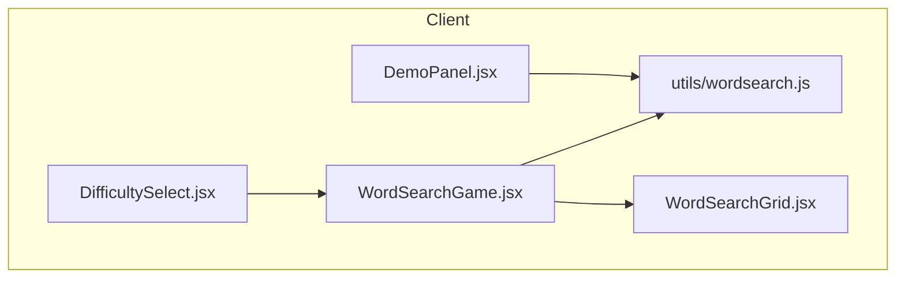
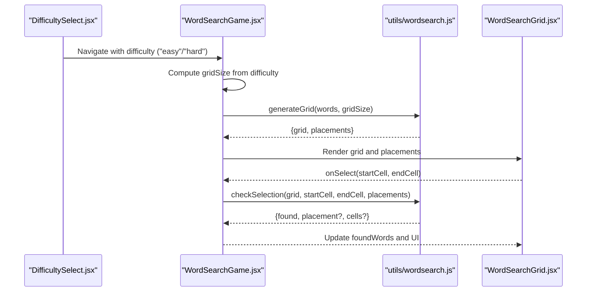
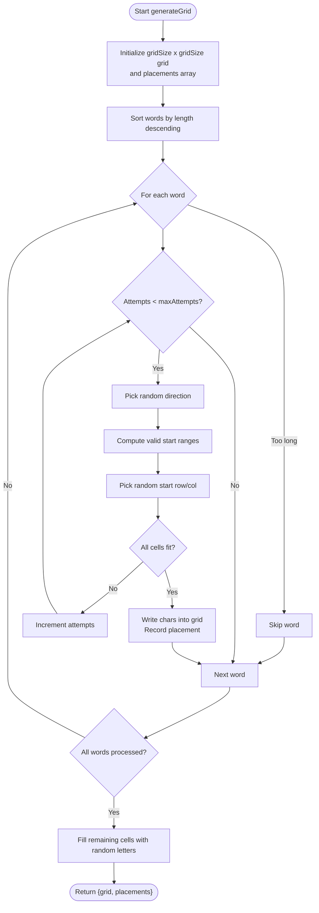
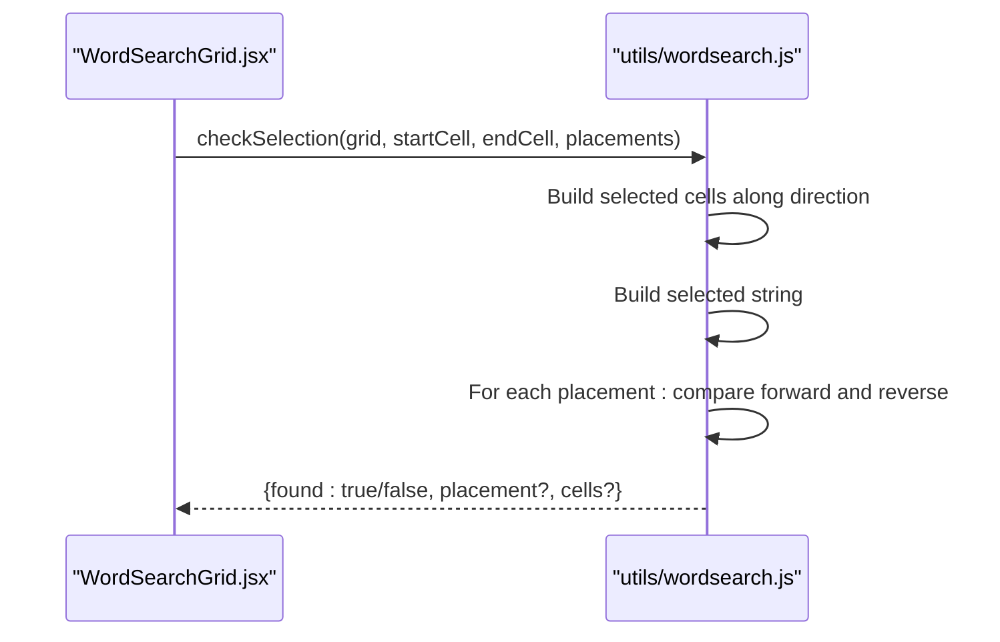
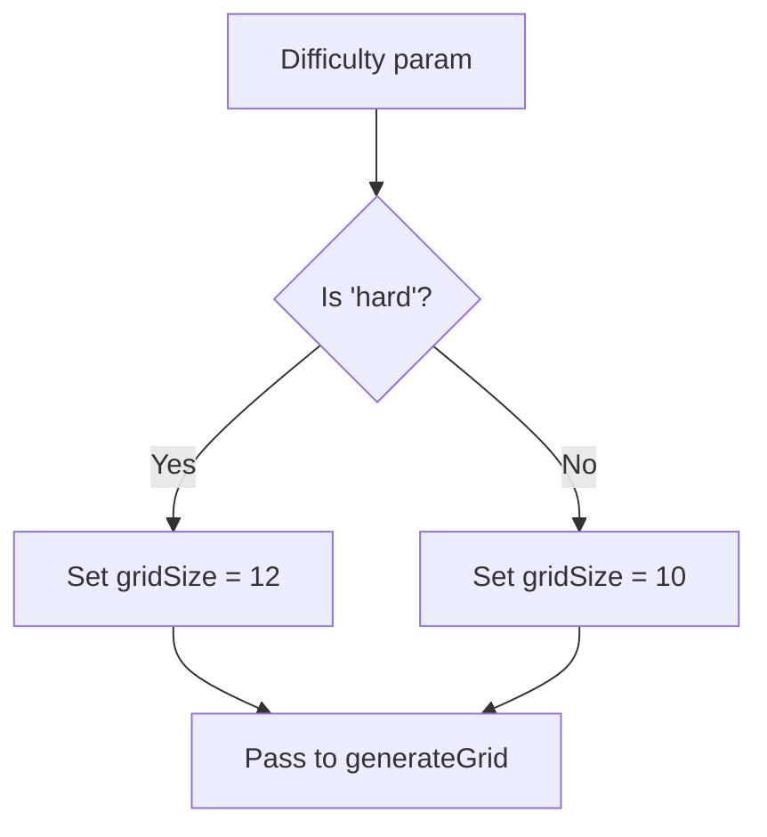
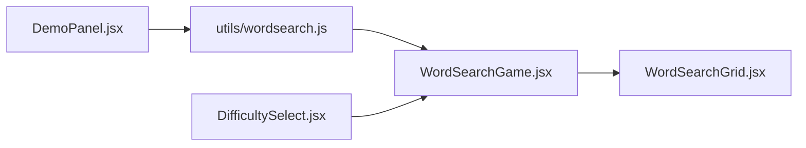

# Grid Generation Algorithm

<cite>
**Referenced Files in This Document**
- [wordsearch.js](file://zabandaan/client/src/utils/wordsearch.js)
- [WordSearchGame.jsx](file://zabandaan/client/src/pages/wordsearch/WordSearchGame.jsx)
- [WordSearchGrid.jsx](file://zabandaan/client/src/pages/wordsearch/WordSearchGrid.jsx)
- [DifficultySelect.jsx](file://zabandaan/client/src/pages/DifficultySelect.jsx)
- [DemoPanel.jsx](file://zabandaan/client/src/pages/wordsearch/DemoPanel.jsx)
</cite>

## Table of Contents
1. Introduction
2. Project Structure
3. Core Components
4. Architecture Overview
5. Detailed Component Analysis
6. Dependency Analysis
7. Performance Considerations
8. Troubleshooting Guide
9. Conclusion
10. Appendices

## Introduction
This document explains the grid generation algorithm for dynamic word search puzzles, focusing on the generateGrid function and the word placement logic. It covers how words are placed horizontally and vertically without overlaps, how difficulty affects grid size, how randomization is used to create varied puzzles, and what happens when a word cannot be placed. It also includes performance considerations for larger grids and debugging techniques for generation issues.

## Project Structure
The word search feature is implemented as a React application with:
- A utility module that contains the core generation and validation algorithms
- Game and UI components that orchestrate puzzle creation, user interaction, and rendering
- A difficulty selection flow that determines grid size

**Diagram sources**
- [WordSearchGame.jsx:1-50](file://zabandaan/client/src/pages/wordsearch/WordSearchGame.jsx#L1-L50)
- [WordSearchGrid.jsx:1-30](file://zabandaan/client/src/pages/wordsearch/WordSearchGrid.jsx#L1-L30)
- [DemoPanel.jsx:1-40](file://zabandaan/client/src/pages/wordsearch/DemoPanel.jsx#L1-L40)
- [DifficultySelect.jsx:1-45](file://zabandaan/client/src/pages/DifficultySelect.jsx#L1-L45)
- [wordsearch.js:1-40](file://zabandaan/client/src/utils/wordsearch.js#L1-L40)

**Section sources**
- [WordSearchGame.jsx:1-50](file://zabandaan/client/src/pages/wordsearch/WordSearchGame.jsx#L1-L50)
- [DifficultySelect.jsx:1-45](file://zabandaan/client/src/pages/DifficultySelect.jsx#L1-L45)

## Core Components
- generateGrid(words, gridSize): Creates an empty grid, sorts words by length (longest first), attempts to place each word in random directions (horizontal, vertical), checks for collisions, records placements, and fills remaining cells with random Urdu letters.
- checkSelection(grid, startCell, endCell, placements): Validates user selections against recorded placements, supporting forward and reverse matches along straight lines.

Key behaviors:
- Direction set: horizontal and vertical only
- Collision detection: ensures no character conflicts at any cell
- Fallback: if a word cannot be placed after many attempts, it is skipped
- Randomization: random direction and random starting positions per attempt
- Density control: implicit via grid size and number of words; longer words are prioritized

**Section sources**
- [wordsearch.js:20-100](file://zabandaan/client/src/utils/wordsearch.js#L20-L100)
- [wordsearch.js:102-141](file://zabandaan/client/src/utils/wordsearch.js#L102-L141)

## Architecture Overview
The game flow starts from the WordSearchGame component, which fetches words based on difficulty, computes grid size, and calls generateGrid. The resulting grid and placements are passed to WordSearchGrid for rendering and interaction. User selections trigger checkSelection to validate found words.

**Diagram sources**
- [DifficultySelect.jsx:23-45](file://zabandaan/client/src/pages/DifficultySelect.jsx#L23-L45)
- [WordSearchGame.jsx:24-50](file://zabandaan/client/src/pages/wordsearch/WordSearchGame.jsx#L24-L50)
- [wordsearch.js:20-100](file://zabandaan/client/src/utils/wordsearch.js#L20-L100)
- [WordSearchGrid.jsx:56-82](file://zabandaan/client/src/pages/wordsearch/WordSearchGrid.jsx#L56-L82)

## Detailed Component Analysis

### generateGrid Algorithm
Purpose: Build a playable word search grid by placing words in allowed directions while avoiding overlaps.

Algorithm steps:
1. Initialize an empty grid of size gridSize x gridSize.
2. Sort input words by their character length (descending) to place longer words first.
3. For each word:
   - Skip if its length exceeds gridSize.
   - Attempt placement up to a maximum number of tries:
     - Choose a random direction from the allowed set (horizontal, vertical).
     - Compute valid start ranges based on direction and word length.
     - Pick a random start row and column within those ranges.
     - Check fit: ensure all cells are within bounds and either empty or already contain the same character.
     - If fit succeeds, write characters into the grid and record placement metadata (word, meaning, direction, cells, start coordinates).
   - If placement fails after max attempts, skip the word.
4. Fill all remaining null cells with random Urdu letters.
5. Return the completed grid and list of placements.

Complexity:
- Sorting words: O(n log n) where n is the number of words.
- Placement loop: For each word, up to maxAttempts iterations; each iteration checks up to L cells (word length). Overall roughly O(n * maxAttempts * L).
- Filling grid: O(gridSize^2).

Collision detection:
- At each candidate position, the algorithm verifies that every target cell is either empty or already holds the required character, preventing conflicts.

Randomization strategies:
- Random direction selection per attempt.
- Random start row/column within valid bounds per attempt.
- Random filler letters for unused cells.

Fallback mechanisms:
- Words too long for the grid are skipped immediately.
- If a word cannot be placed after many attempts, it is skipped to avoid infinite loops.

**Diagram sources**
- [wordsearch.js:20-100](file://zabandaan/client/src/utils/wordsearch.js#L20-L100)

**Section sources**
- [wordsearch.js:20-100](file://zabandaan/client/src/utils/wordsearch.js#L20-L100)

### checkSelection Logic
Purpose: Validate a user’s selected segment against known placements to determine if a word was correctly found.

Behavior:
- Determine direction vector from start to end.
- Generate the sequence of cells along the straight line.
- Build the selected string from the grid.
- Compare with each placement’s string both forward and reversed.
- Return match details if found; otherwise indicate no match.

**Diagram sources**
- [WordSearchGrid.jsx:56-82](file://zabandaan/client/src/pages/wordsearch/WordSearchGrid.jsx#L56-L82)
- [wordsearch.js:102-141](file://zabandaan/client/src/utils/wordsearch.js#L102-L141)

**Section sources**
- [wordsearch.js:102-141](file://zabandaan/client/src/utils/wordsearch.js#L102-L141)

### Difficulty and Grid Size Calculation
- Easy mode uses a smaller grid; Hard mode uses a larger grid to increase challenge.
- The game component selects the grid size based on the route parameter for difficulty.

**Diagram sources**
- [WordSearchGame.jsx:24-36](file://zabandaan/client/src/pages/wordsearch/WordSearchGame.jsx#L24-L36)

**Section sources**
- [WordSearchGame.jsx:24-36](file://zabandaan/client/src/pages/wordsearch/WordSearchGame.jsx#L24-L36)
- [DifficultySelect.jsx:23-45](file://zabandaan/client/src/pages/DifficultySelect.jsx#L23-L45)

### Demo Panel Behavior
- Accepts user-entered Urdu words, one per line.
- Computes a suitable grid size based on the longest word plus padding, capped at a maximum.
- Calls generateGrid to produce a preview grid and placements.

**Section sources**
- [DemoPanel.jsx:12-40](file://zabandaan/client/src/pages/wordsearch/DemoPanel.jsx#L12-L40)

## Dependency Analysis
- WordSearchGame depends on:
  - utils/wordsearch.js for generateGrid and checkSelection
  - WordSearchGrid for rendering and user interaction
  - DifficultySelect for navigation to easy/hard routes
- WordSearchGrid depends on props (grid, placements, foundWords) and emits selection events.
- DemoPanel independently uses generateGrid for quick previews.

**Diagram sources**
- [WordSearchGame.jsx:1-50](file://zabandaan/client/src/pages/wordsearch/WordSearchGame.jsx#L1-L50)
- [WordSearchGrid.jsx:1-30](file://zabandaan/client/src/pages/wordsearch/WordSearchGrid.jsx#L1-L30)
- [DifficultySelect.jsx:1-45](file://zabandaan/client/src/pages/DifficultySelect.jsx#L1-L45)
- [DemoPanel.jsx:1-40](file://zabandaan/client/src/pages/wordsearch/DemoPanel.jsx#L1-L40)
- [wordsearch.js:1-40](file://zabandaan/client/src/utils/wordsearch.js#L1-L40)

**Section sources**
- [WordSearchGame.jsx:1-50](file://zabandaan/client/src/pages/wordsearch/WordSearchGame.jsx#L1-L50)
- [wordsearch.js:1-40](file://zabandaan/client/src/utils/wordsearch.js#L1-L40)

## Performance Considerations
- Time complexity:
  - Sorting words: O(n log n)
  - Placement attempts: O(n * maxAttempts * L)
  - Grid fill: O(gridSize^2)
- Space complexity:
  - Grid storage: O(gridSize^2)
  - Placements list: O(n * L)
- Recommendations:
  - Keep maxAttempts reasonable to avoid long generation times with dense word sets.
  - For very large grids, consider precomputing valid start ranges more efficiently or using spatial structures if needed.
  - Avoid excessive regeneration; cache results when possible.
  - Limit the number of words relative to grid size to maintain high placement success rates.

[No sources needed since this section provides general guidance]

## Troubleshooting Guide
Common issues and remedies:
- Words not placed:
  - Cause: Too many short words crowded the grid, or words too long for the grid size.
  - Fix: Increase gridSize, reduce word count, or remove overly long words.
- No overlap but still failing:
  - Cause: Random placement attempts exhausted without finding a valid spot.
  - Fix: Increase maxAttempts or adjust word order/density.
- Selection not recognized:
  - Cause: Selection not aligned with a placement direction or mismatched characters.
  - Fix: Ensure selection is straight-line and matches a placement exactly (forward or reverse).
- Debugging tips:
  - Log the generated grid and placements to verify expected layout.
  - Inspect the last attempted start positions and directions during placement failures.
  - Use the demo panel to test small inputs and quickly iterate on parameters.

**Section sources**
- [wordsearch.js:20-100](file://zabandaan/client/src/utils/wordsearch.js#L20-L100)
- [wordsearch.js:102-141](file://zabandaan/client/src/utils/wordsearch.js#L102-L141)
- [DemoPanel.jsx:12-40](file://zabandaan/client/src/pages/wordsearch/DemoPanel.jsx#L12-L40)

## Conclusion
The generateGrid function implements a robust, randomized word placement strategy that prioritizes longer words, avoids overlaps through collision checks, and gracefully skips unplaceable words. Difficulty levels influence grid size, affecting density and challenge. The checkSelection function validates user interactions against recorded placements. With careful tuning of grid size, word count, and attempt limits, the algorithm reliably generates engaging puzzles while maintaining good performance.

[No sources needed since this section summarizes without analyzing specific files]

## Appendices

### Step-by-step Example of Word Placement
- Initialization: Create an empty grid and prepare a list of placements.
- Sort words by length to place longer ones first.
- For each word:
  - Try random directions and positions until a valid placement is found or attempts are exhausted.
  - On success, record the placement and update the grid.
- Fill remaining cells with random letters.
- Return the final grid and placements for rendering and validation.

**Section sources**
- [wordsearch.js:20-100](file://zabandaan/client/src/utils/wordsearch.js#L20-L100)