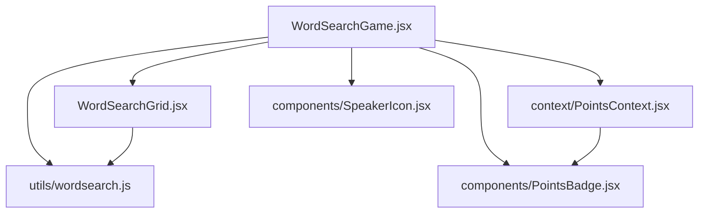
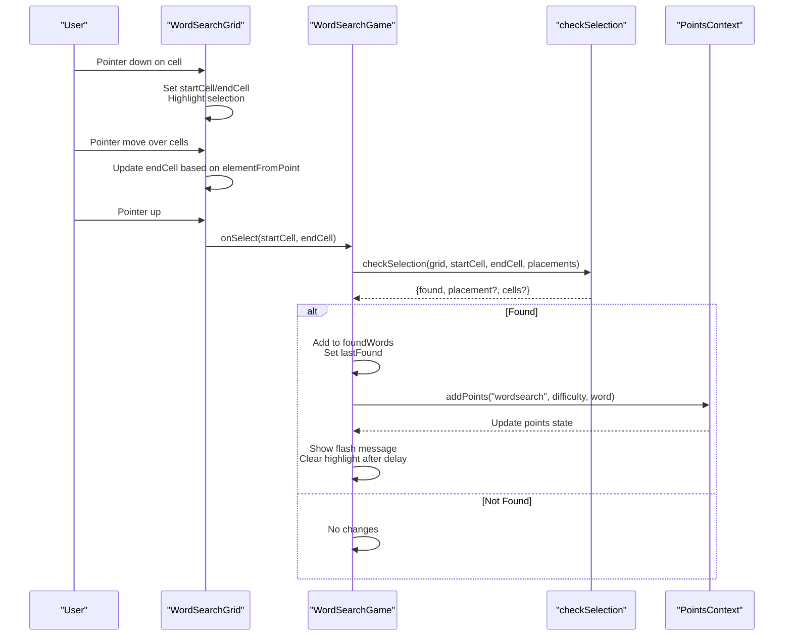
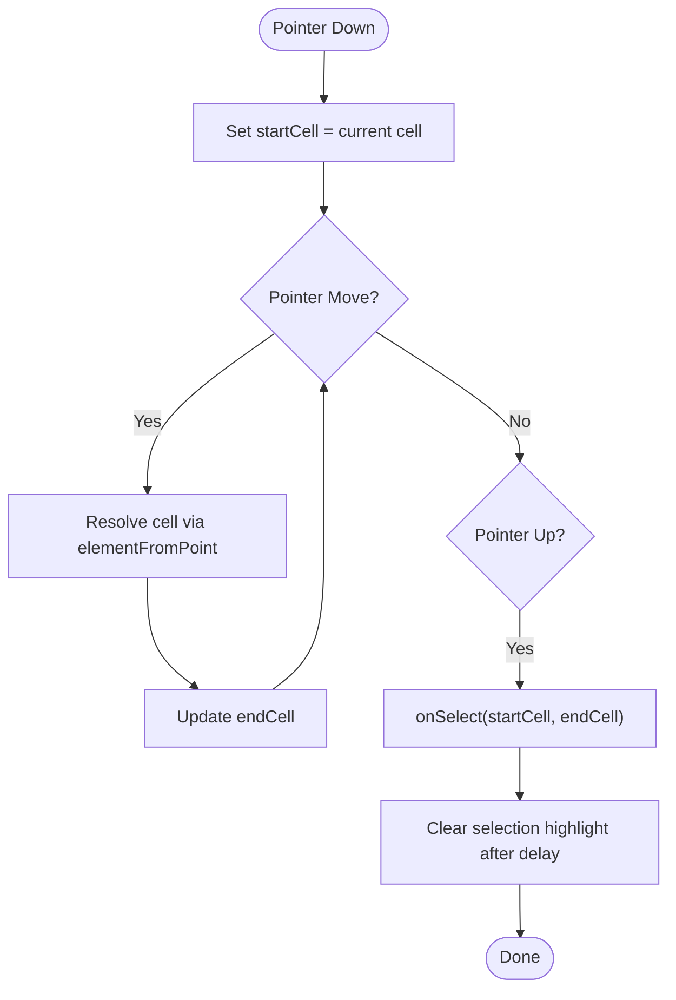
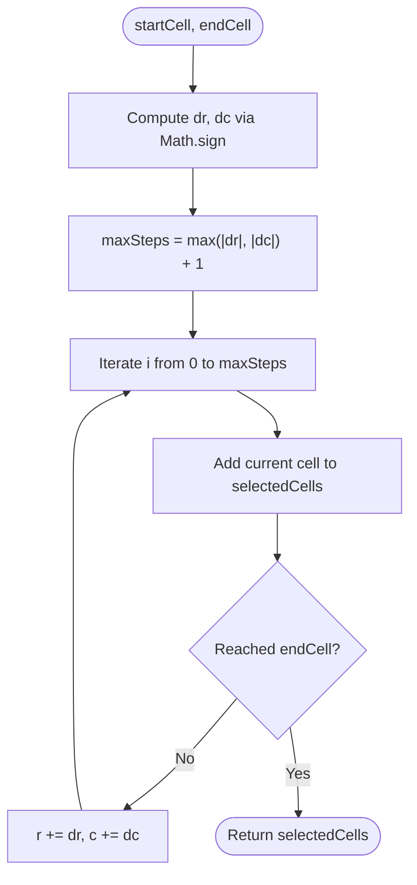
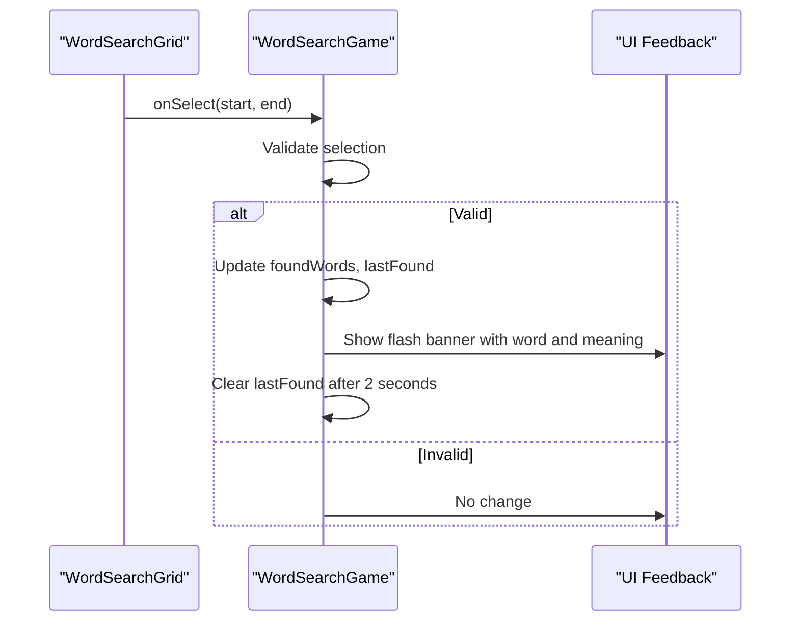
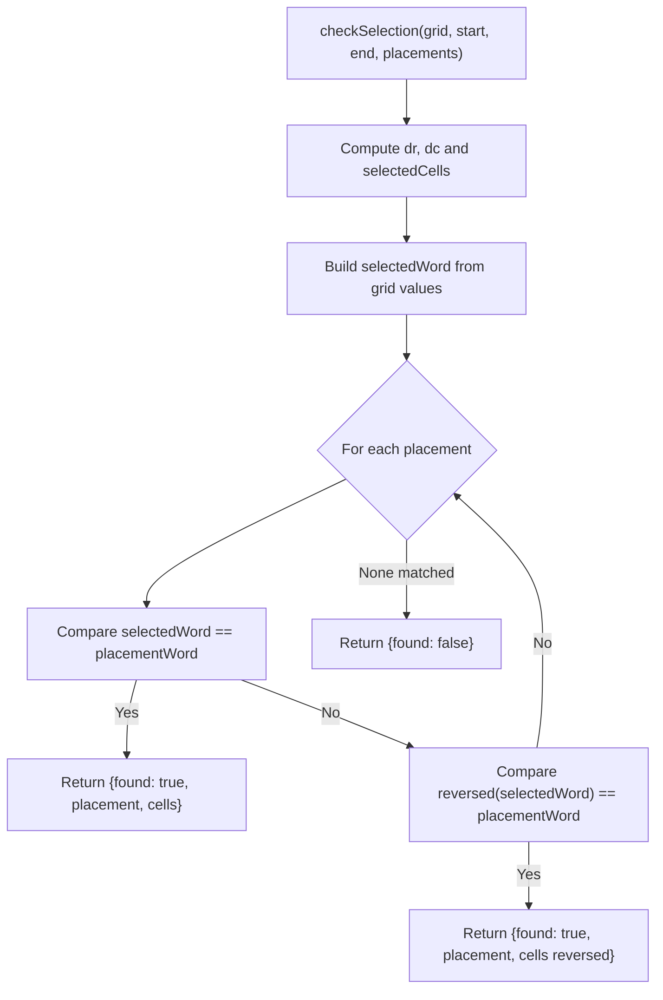
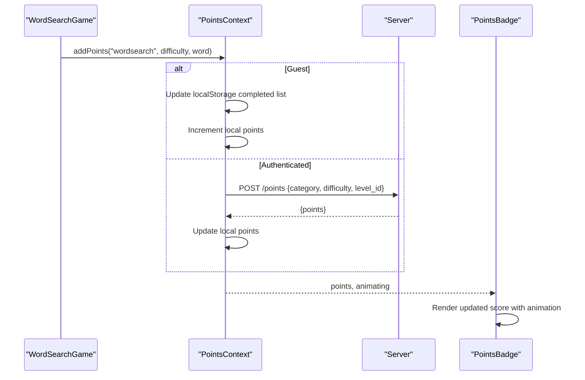
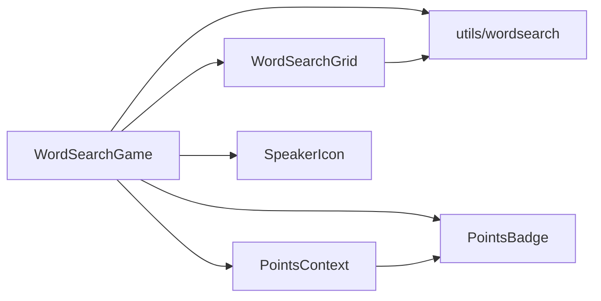

# Interactive Selection Handling

<cite>
**Referenced Files in This Document**
- [WordSearchGame.jsx](file://zabandaan/client/src/pages/wordsearch/WordSearchGame.jsx)
- [WordSearchGrid.jsx](file://zabandaan/client/src/pages/wordsearch/WordSearchGrid.jsx)
- [wordsearch.js](file://zabandaan/client/src/utils/wordsearch.js)
- [PointsContext.jsx](file://zabandaan/client/src/context/PointsContext.jsx)
- [PointsBadge.jsx](file://zabandaan/client/src/components/PointsBadge.jsx)
- [SpeakerIcon.jsx](file://zabandaan/client/src/components/SpeakerIcon.jsx)
</cite>

## Table of Contents
1. Introduction
2. Project Structure
3. Core Components
4. Architecture Overview
5. Detailed Component Analysis
6. Dependency Analysis
7. Performance Considerations
8. Troubleshooting Guide
9. Conclusion

## Introduction
This document explains the interactive selection handling system for the Word Search feature, focusing on how user input is captured and validated to find words in a grid. It covers mouse and touch event handling, selection rectangle calculation, real-time feedback, and integration with the points system for scoring and progress tracking. It also addresses cross-platform compatibility across devices and outlines accessibility considerations for keyboard navigation.

## Project Structure
The Word Search feature is implemented as a React application with clear separation of concerns:
- Game orchestration and state management live in the game page component.
- Grid rendering and pointer interactions are encapsulated in a dedicated grid component.
- Validation logic for selections is isolated in a utility module.
- Points and progress are managed via a context provider.
- Visual feedback includes a badge for points and a speaker icon for pronunciation.

**Diagram sources**
- [WordSearchGame.jsx:1-220](file://zabandaan/client/src/pages/wordsearch/WordSearchGame.jsx#L1-L220)
- [WordSearchGrid.jsx:1-189](file://zabandaan/client/src/pages/wordsearch/WordSearchGrid.jsx#L1-L189)
- [wordsearch.js:1-141](file://zabandaan/client/src/utils/wordsearch.js#L1-L141)
- [PointsContext.jsx:1-114](file://zabandaan/client/src/context/PointsContext.jsx#L1-L114)
- [PointsBadge.jsx:1-24](file://zabandaan/client/src/components/PointsBadge.jsx#L1-L24)
- [SpeakerIcon.jsx:1-67](file://zabandaan/client/src/components/SpeakerIcon.jsx#L1-L67)

**Section sources**
- [WordSearchGame.jsx:1-220](file://zabandaan/client/src/pages/wordsearch/WordSearchGame.jsx#L1-L220)
- [WordSearchGrid.jsx:1-189](file://zabandaan/client/src/pages/wordsearch/WordSearchGrid.jsx#L1-L189)
- [wordsearch.js:1-141](file://zabandaan/client/src/utils/wordsearch.js#L1-L141)
- [PointsContext.jsx:1-114](file://zabandaan/client/src/context/PointsContext.jsx#L1-L114)
- [PointsBadge.jsx:1-24](file://zabandaan/client/src/components/PointsBadge.jsx#L1-L24)
- [SpeakerIcon.jsx:1-67](file://zabandaan/client/src/components/SpeakerIcon.jsx#L1-L67)

## Core Components
- WordSearchGame: Orchestrates puzzle generation, handles selection callbacks, updates found words, triggers scoring, and provides visual feedback (flash messages and completion celebration).
- WordSearchGrid: Renders the grid, manages pointer events for mouse and touch, calculates selected cells during drag, and highlights current selection and previously found words.
- wordsearch utilities: Generates the grid and validates selections against placed words, supporting both forward and reverse matches along straight lines.
- PointsContext: Centralized state for points and guest progress; persists guest progress locally and syncs with server for authenticated users.
- PointsBadge: Displays current points with an animation when points increase.
- SpeakerIcon: Provides pronunciation playback for words with accessible labels and controls.

**Section sources**
- [WordSearchGame.jsx:12-86](file://zabandaan/client/src/pages/wordsearch/WordSearchGame.jsx#L12-L86)
- [WordSearchGrid.jsx:3-82](file://zabandaan/client/src/pages/wordsearch/WordSearchGrid.jsx#L3-L82)
- [wordsearch.js:20-141](file://zabandaan/client/src/utils/wordsearch.js#L20-L141)
- [PointsContext.jsx:7-114](file://zabandaan/client/src/context/PointsContext.jsx#L7-L114)
- [PointsBadge.jsx:1-24](file://zabandaan/client/src/components/PointsBadge.jsx#L1-L24)
- [SpeakerIcon.jsx:1-67](file://zabandaan/client/src/components/SpeakerIcon.jsx#L1-L67)

## Architecture Overview
The selection flow begins in the grid component where pointer events capture start and end cells. The game component receives these coordinates, validates them using the selection checker, and if valid, updates state, awards points, and shows feedback.

**Diagram sources**
- [WordSearchGrid.jsx:43-82](file://zabandaan/client/src/pages/wordsearch/WordSearchGrid.jsx#L43-L82)
- [WordSearchGame.jsx:52-77](file://zabandaan/client/src/pages/wordsearch/WordSearchGame.jsx#L52-L77)
- [wordsearch.js:102-141](file://zabandaan/client/src/utils/wordsearch.js#L102-L141)
- [PointsContext.jsx:12-46](file://zabandaan/client/src/context/PointsContext.jsx#L12-L46)

## Detailed Component Analysis

### Mouse and Touch Event Handling
- Pointer capture: The grid uses pointer down/move/up and corresponding touch events to track selection. It prevents default behavior to avoid scrolling while selecting.
- Cell resolution: During move events, it resolves the current cell under the pointer using elementFromPoint and reads data attributes to determine row and column.
- Selection range: On pointer up, it invokes the parent’s onSelect callback with start and end cells. Temporary highlighting is cleared after a short delay.

**Diagram sources**
- [WordSearchGrid.jsx:43-82](file://zabandaan/client/src/pages/wordsearch/WordSearchGrid.jsx#L43-L82)

**Section sources**
- [WordSearchGrid.jsx:43-82](file://zabandaan/client/src/pages/wordsearch/WordSearchGrid.jsx#L43-L82)

### Selection Rectangle Calculation
- Direction detection: The direction vector is computed from the difference between end and start cells using sign functions.
- Linear traversal: The algorithm steps along the determined direction until reaching the end cell, collecting all intermediate cells into a set for highlighting and validation.
- Supported directions: Only horizontal and vertical selections are considered due to the sign-based movement and max step calculation.

**Diagram sources**
- [wordsearch.js:102-121](file://zabandaan/client/src/utils/wordsearch.js#L102-L121)
- [WordSearchGrid.jsx:23-41](file://zabandaan/client/src/pages/wordsearch/WordSearchGrid.jsx#L23-L41)

**Section sources**
- [wordsearch.js:102-121](file://zabandaan/client/src/utils/wordsearch.js#L102-L121)
- [WordSearchGrid.jsx:23-41](file://zabandaan/client/src/pages/wordsearch/WordSearchGrid.jsx#L23-L41)

### Real-Time Feedback Mechanisms
- In-drag highlight: Selected cells are highlighted blue while dragging to provide immediate visual feedback.
- Found word highlight: Previously found words are marked green with a distinct border and shadow.
- Flash notification: When a word is found, a banner displays the word and meaning, with optional pronunciation via the speaker icon.
- Completion celebration: If all words are found, a celebratory card appears with a “Play Again” action.

**Diagram sources**
- [WordSearchGame.jsx:52-77](file://zabandaan/client/src/pages/wordsearch/WordSearchGame.jsx#L52-L77)
- [WordSearchGame.jsx:137-161](file://zabandaan/client/src/pages/wordsearch/WordSearchGame.jsx#L137-L161)

**Section sources**
- [WordSearchGame.jsx:52-77](file://zabandaan/client/src/pages/wordsearch/WordSearchGame.jsx#L52-L77)
- [WordSearchGame.jsx:137-161](file://zabandaan/client/src/pages/wordsearch/WordSearchGame.jsx#L137-L161)

### Word Validation with checkSelection
- Input: Grid, startCell, endCell, and placements (placed words with their cells).
- Process:
  - Compute direction and collect selected cells.
  - Build the selected word string by joining characters at selected positions.
  - Compare against each placement’s word string for exact match.
  - Also compare reversed selected word to support reverse-direction selections.
- Output: Returns whether a word was found, the matching placement, and the selected cells.

**Diagram sources**
- [wordsearch.js:102-141](file://zabandaan/client/src/utils/wordsearch.js#L102-L141)

**Section sources**
- [wordsearch.js:102-141](file://zabandaan/client/src/utils/wordsearch.js#L102-L141)

### Integration with Points System and Progress Tracking
- Scoring trigger: Upon successful validation, the game calls addPoints with category, difficulty, and level identifier (the word itself).
- Guest vs authenticated:
  - Guest mode: Progress is stored locally under keys like guest_progress_category_difficulty, preventing duplicate credit for the same word.
  - Authenticated mode: Points are posted to the server and the client updates its local state accordingly.
- UI update: PointsBadge reflects the current total points and animates when points increase.

**Diagram sources**
- [WordSearchGame.jsx:52-77](file://zabandaan/client/src/pages/wordsearch/WordSearchGame.jsx#L52-L77)
- [PointsContext.jsx:12-46](file://zabandaan/client/src/context/PointsContext.jsx#L12-L46)
- [PointsBadge.jsx:1-24](file://zabandaan/client/src/components/PointsBadge.jsx#L1-L24)

**Section sources**
- [WordSearchGame.jsx:52-77](file://zabandaan/client/src/pages/wordsearch/WordSearchGame.jsx#L52-L77)
- [PointsContext.jsx:12-46](file://zabandaan/client/src/context/PointsContext.jsx#L12-L46)
- [PointsBadge.jsx:1-24](file://zabandaan/client/src/components/PointsBadge.jsx#L1-L24)

### Cross-Platform Compatibility
- Mouse and touch: The grid listens to both mouse and touch events, ensuring consistent behavior across desktop and mobile devices.
- Element resolution: Uses elementFromPoint to accurately detect the cell under the pointer/touch, which works reliably on both platforms.
- Gesture prevention: Prevents default actions during selection to avoid unintended scrolling or zooming on touch devices.

**Section sources**
- [WordSearchGrid.jsx:43-82](file://zabandaan/client/src/pages/wordsearch/WordSearchGrid.jsx#L43-L82)

### Accessibility Considerations
- Current implementation:
  - Focus and keyboard navigation: Cells do not have focusable attributes or keyboard event handlers, so keyboard-only users cannot navigate or select words.
  - Screen reader support: Cells lack aria-labels or roles that describe their purpose or state.
  - Announcements: There are no live regions or announcements for selection changes or found words.
- Recommended enhancements:
  - Make cells focusable and handle arrow key navigation to move focus across the grid.
  - Implement Enter/Space to confirm selection when focus is on start and end cells.
  - Add aria-live regions to announce found words and scores.
  - Provide visible focus indicators and ensure sufficient color contrast for selection states.
  - Ensure touch targets meet minimum size guidelines and include appropriate aria-labels for interactive elements like the speaker icon.

[No sources needed since this section proposes improvements beyond current implementation]

## Dependency Analysis
- WordSearchGame depends on:
  - WordSearchGrid for interaction and rendering.
  - utils/wordsearch for grid generation and selection validation.
  - PointsContext for scoring and progress persistence.
  - SpeakerIcon for pronunciation feedback.
  - PointsBadge for displaying points.
- WordSearchGrid depends on:
  - utils/wordsearch indirectly through the game’s validation results (highlighting found words).
- PointsContext depends on:
  - Authentication context to differentiate guest vs authenticated flows.
  - API module for server communication.

**Diagram sources**
- [WordSearchGame.jsx:1-220](file://zabandaan/client/src/pages/wordsearch/WordSearchGame.jsx#L1-L220)
- [WordSearchGrid.jsx:1-189](file://zabandaan/client/src/pages/wordsearch/WordSearchGrid.jsx#L1-L189)
- [wordsearch.js:1-141](file://zabandaan/client/src/utils/wordsearch.js#L1-L141)
- [PointsContext.jsx:1-114](file://zabandaan/client/src/context/PointsContext.jsx#L1-L114)
- [PointsBadge.jsx:1-24](file://zabandaan/client/src/components/PointsBadge.jsx#L1-L24)
- [SpeakerIcon.jsx:1-67](file://zabandaan/client/src/components/SpeakerIcon.jsx#L1-L67)

**Section sources**
- [WordSearchGame.jsx:1-220](file://zabandaan/client/src/pages/wordsearch/WordSearchGame.jsx#L1-L220)
- [WordSearchGrid.jsx:1-189](file://zabandaan/client/src/pages/wordsearch/WordSearchGrid.jsx#L1-L189)
- [wordsearch.js:1-141](file://zabandaan/client/src/utils/wordsearch.js#L1-L141)
- [PointsContext.jsx:1-114](file://zabandaan/client/src/context/PointsContext.jsx#L1-L114)
- [PointsBadge.jsx:1-24](file://zabandaan/client/src/components/PointsBadge.jsx#L1-L24)
- [SpeakerIcon.jsx:1-67](file://zabandaan/client/src/components/SpeakerIcon.jsx#L1-L67)

## Performance Considerations
- Efficient selection sets: Using Sets for found and selected cells ensures O(1) lookups during rendering and interaction.
- Minimal re-renders: Memoization of derived sets reduces unnecessary recalculations.
- Grid sizing: Dynamic cell sizing adapts to grid dimensions to maintain readability and performance on various screen sizes.
- Debouncing selection clearing: Short delays prevent flicker while maintaining responsiveness.

[No sources needed since this section provides general guidance]

## Troubleshooting Guide
- Selection not registering:
  - Verify that pointer events are attached and default behavior is prevented during selection.
  - Ensure elementFromPoint returns a valid element within the grid.
- Words not recognized:
  - Confirm that selections are strictly horizontal or vertical and aligned with placement directions.
  - Check that character encoding and splitting functions correctly handle multi-byte characters.
- Points not updating:
  - For guest mode, verify localStorage keys and JSON parsing.
  - For authenticated mode, check network requests and error handling in the points context.
- Accessibility issues:
  - Add keyboard event listeners and focus management to enable keyboard navigation.
  - Introduce aria-live regions to announce selection outcomes and score changes.

**Section sources**
- [WordSearchGrid.jsx:43-82](file://zabandaan/client/src/pages/wordsearch/WordSearchGrid.jsx#L43-L82)
- [wordsearch.js:102-141](file://zabandaan/client/src/utils/wordsearch.js#L102-L141)
- [PointsContext.jsx:12-46](file://zabandaan/client/src/context/PointsContext.jsx#L12-L46)

## Conclusion
The Word Search selection system combines robust pointer event handling, precise selection calculation, and reliable validation to deliver an engaging experience across devices. It integrates seamlessly with a points system that supports both guest and authenticated users, providing immediate visual feedback and progress tracking. While the current implementation excels in mouse and touch interactions, enhancing keyboard navigation and accessibility will improve inclusivity and usability for all users.