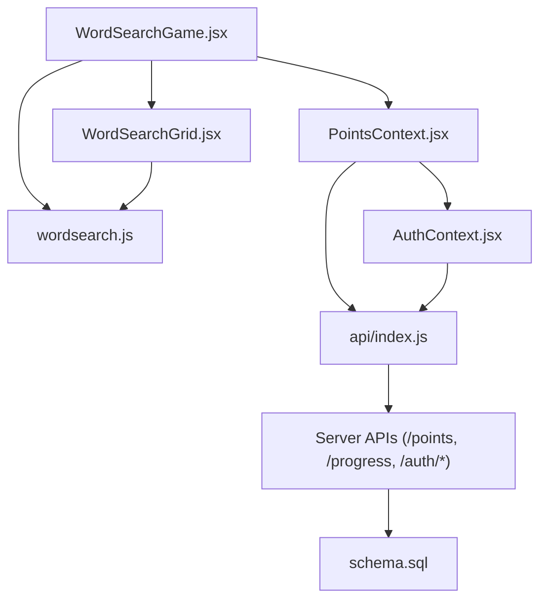
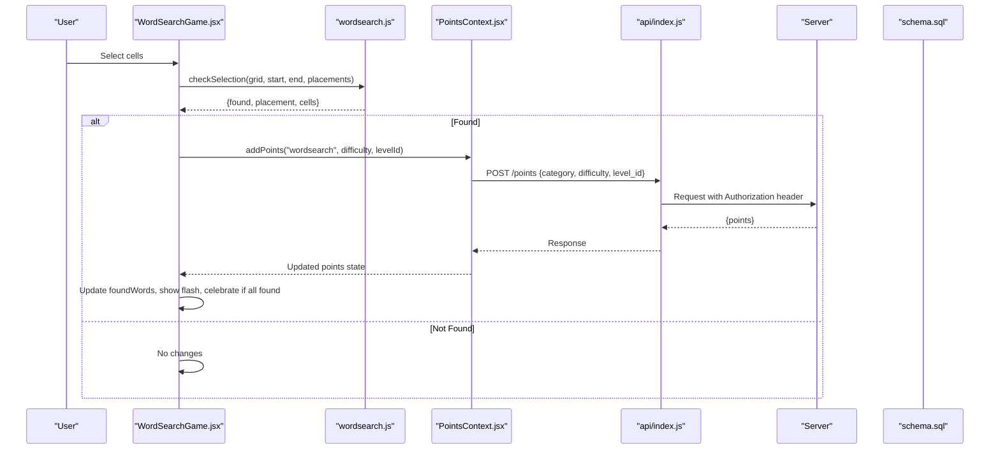
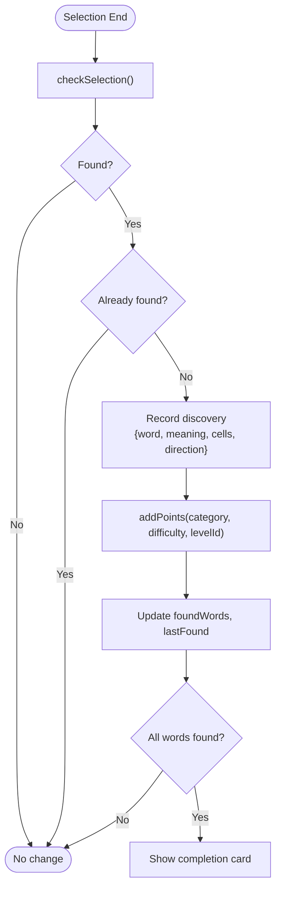
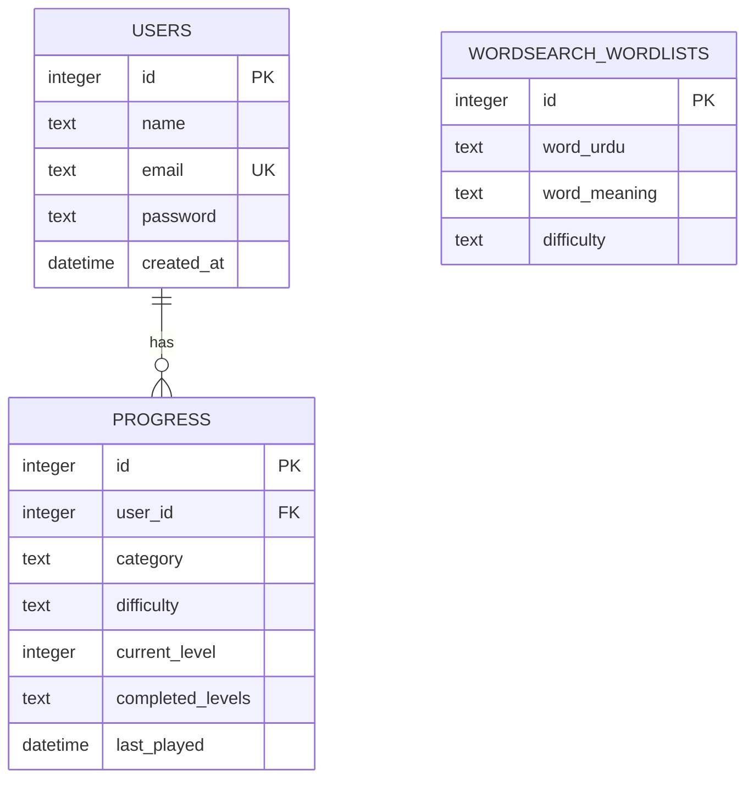
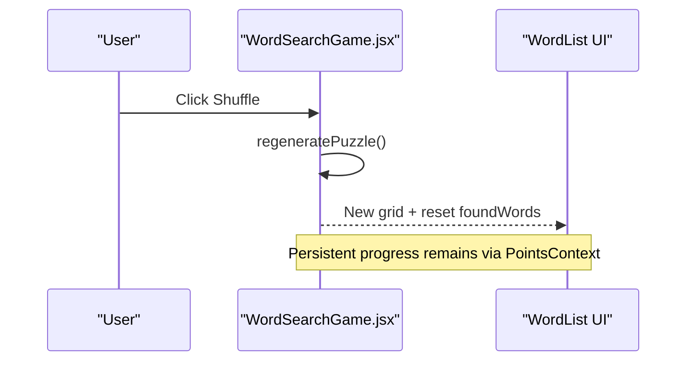
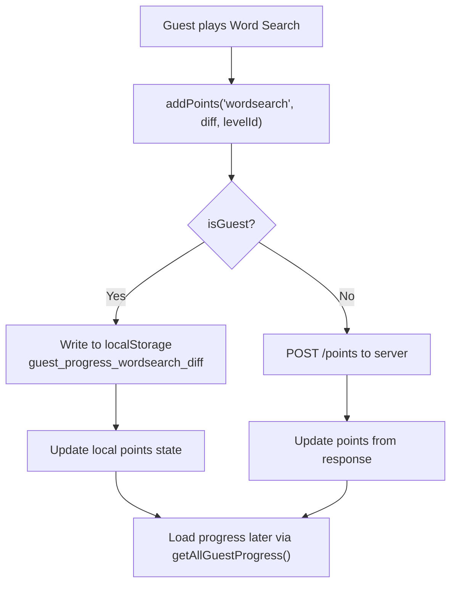
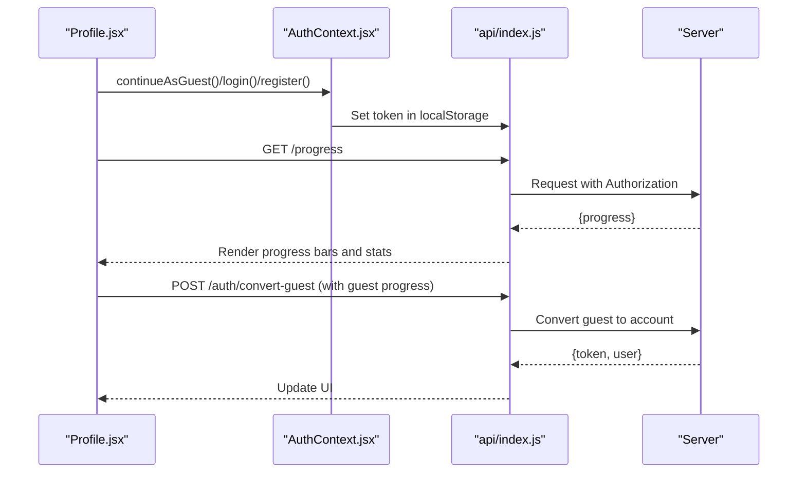
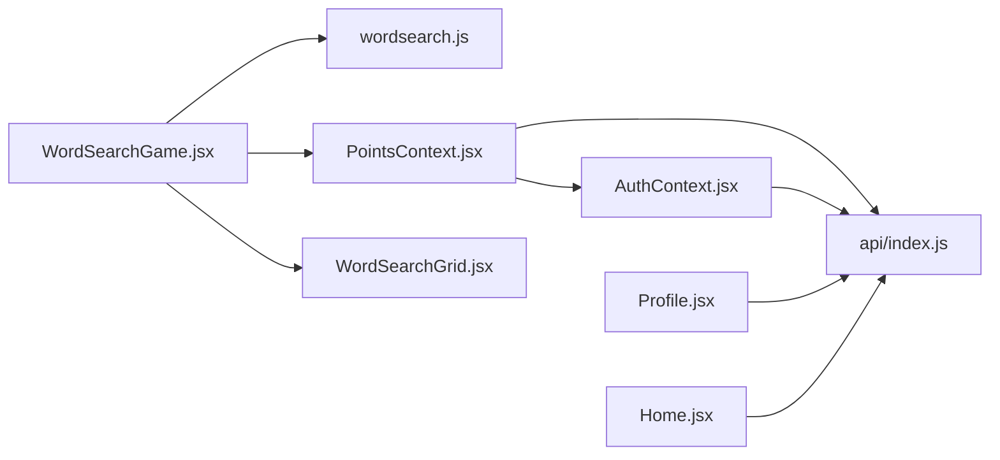

# Vocabulary Progress Tracking

<cite>
**Referenced Files in This Document**
- [WordSearchGame.jsx](file://zabandaan/client/src/pages/wordsearch/WordSearchGame.jsx)
- [WordSearchGrid.jsx](file://zabandaan/client/src/pages/wordsearch/WordSearchGrid.jsx)
- [wordsearch.js](file://zabandaan/client/src/utils/wordsearch.js)
- [PointsContext.jsx](file://zabandaan/client/src/context/PointsContext.jsx)
- [AuthContext.jsx](file://zabandaan/client/src/context/AuthContext.jsx)
- [api/index.js](file://zabandaan/client/src/api/index.js)
- [Profile.jsx](file://zabandaan/client/src/pages/Profile.jsx)
- [Home.jsx](file://zabandaan/client/src/pages/Home.jsx)
- [schema.sql](file://zabandaan/database/schema.sql)
</cite>

## Table of Contents
1. [Introduction](#introduction)
2. [Project Structure](#project-structure)
3. [Core Components](#core-components)
4. [Architecture Overview](#architecture-overview)
5. [Detailed Component Analysis](#detailed-component-analysis)
6. [Dependency Analysis](#dependency-analysis)
7. [Performance Considerations](#performance-considerations)
8. [Troubleshooting Guide](#troubleshooting-guide)
9. [Conclusion](#conclusion)

## Introduction
This document explains the vocabulary progress tracking system with a focus on word discovery logging and learning analytics for the Word Search feature. It covers how found words are tracked, how completion status is maintained, and how progress integrates with the broader points and achievements system. It also documents the data structures used to store discoveries (including meanings, cell positions, and timestamps), user-facing displays (word list interface, completion celebrations, replay), local storage synchronization for offline play, and cloud sync when users register or convert from guest mode.

## Project Structure
The Word Search progress tracking spans UI components, utilities, context providers, API integration, and database schema:
- Game UI and interaction: WordSearchGame.jsx, WordSearchGrid.jsx
- Grid generation and selection logic: wordsearch.js
- Points and progress state: PointsContext.jsx
- Authentication and guest vs. registered modes: AuthContext.jsx
- API client with auth headers: api/index.js
- Progress display and conversion flow: Profile.jsx, Home.jsx
- Server-side persistence schema: schema.sql

**Diagram sources**
- [WordSearchGame.jsx:1-120](file://zabandaan/client/src/pages/wordsearch/WordSearchGame.jsx#L1-L120)
- [WordSearchGrid.jsx:1-120](file://zabandaan/client/src/pages/wordsearch/WordSearchGrid.jsx#L1-L120)
- [wordsearch.js:1-141](file://zabandaan/client/src/utils/wordsearch.js#L1-L141)
- [PointsContext.jsx:1-114](file://zabandaan/client/src/context/PointsContext.jsx#L1-L114)
- [AuthContext.jsx:1-97](file://zabandaan/client/src/context/AuthContext.jsx#L1-L97)
- [api/index.js:1-30](file://zabandaan/client/src/api/index.js#L1-L30)
- [schema.sql:1-54](file://zabandaan/database/schema.sql#L1-L54)

**Section sources**
- [WordSearchGame.jsx:1-120](file://zabandaan/client/src/pages/wordsearch/WordSearchGame.jsx#L1-L120)
- [PointsContext.jsx:1-114](file://zabandaan/client/src/context/PointsContext.jsx#L1-L114)
- [schema.sql:1-54](file://zabandaan/database/schema.sql#L1-L54)

## Core Components
- Word search game loop: loads content, generates grid, handles selections, updates found words, triggers points, and shows completion feedback.
- Points and progress context: manages local guest progress via localStorage and server-synced points/progress for authenticated users.
- API layer: attaches authentication tokens and handles 401 responses; endpoints include /points and /progress.
- Database schema: defines tables for users, progress, and word lists used by the backend.

Key responsibilities:
- Track discovered words with metadata (word, meaning, cells, direction).
- Persist per-difficulty completed levels locally for guests and remotely for registered users.
- Display progress in the word list and profile pages.
- Provide replay/shuffle functionality without resetting progress incorrectly.

**Section sources**
- [WordSearchGame.jsx:12-77](file://zabandaan/client/src/pages/wordsearch/WordSearchGame.jsx#L12-L77)
- [PointsContext.jsx:12-81](file://zabandaan/client/src/context/PointsContext.jsx#L12-L81)
- [api/index.js:8-27](file://zabandaan/client/src/api/index.js#L8-L27)
- [schema.sql:9-18](file://zabandaan/database/schema.sql#L9-L18)

## Architecture Overview
The system follows a layered approach:
- UI Layer: React components render the grid, word list, and progress visuals.
- State Layer: Context providers manage points and progress across sessions.
- Utility Layer: Algorithms generate grids and validate selections.
- Integration Layer: Axios-based API client communicates with backend services.
- Persistence Layer: LocalStorage for offline guest mode; SQL database for registered users.

**Diagram sources**
- [WordSearchGame.jsx:52-77](file://zabandaan/client/src/pages/wordsearch/WordSearchGame.jsx#L52-L77)
- [wordsearch.js:102-141](file://zabandaan/client/src/utils/wordsearch.js#L102-L141)
- [PointsContext.jsx:12-46](file://zabandaan/client/src/context/PointsContext.jsx#L12-L46)
- [api/index.js:8-27](file://zabandaan/client/src/api/index.js#L8-L27)

## Detailed Component Analysis

### Word Discovery Logging and Completion Status
- Discovery event: When a valid selection matches a placement, the system records:
  - word: the discovered Urdu word
  - meaning: associated meaning
  - cells: array of {row, col} indicating exact grid positions
  - direction: horizontal or vertical
- Duplicate prevention: The component checks if the word was already found before adding it again.
- Completion detection: When the number of found words equals the total placements, a celebration banner appears and offers replay.

**Diagram sources**
- [WordSearchGame.jsx:52-77](file://zabandaan/client/src/pages/wordsearch/WordSearchGame.jsx#L52-L77)
- [wordsearch.js:102-141](file://zabandaan/client/src/utils/wordsearch.js#L102-L141)

**Section sources**
- [WordSearchGame.jsx:52-77](file://zabandaan/client/src/pages/wordsearch/WordSearchGame.jsx#L52-L77)
- [WordSearchGame.jsx:114-161](file://zabandaan/client/src/pages/wordsearch/WordSearchGame.jsx#L114-L161)

### Data Structures for Discoveries and Progress
- In-memory discovery record:
  - word: string
  - meaning: string
  - cells: array of {row, col}
  - direction: string ("horizontal" | "vertical")
- Guest local storage key pattern:
  - Key: guest_progress_{category}_{difficulty}
  - Value: JSON object with completed array of level identifiers (e.g., word strings)
- Registered user progress:
  - Stored server-side using schema tables:
    - users: id, name, email, password, created_at
    - progress: user_id, category, difficulty, current_level, completed_levels (JSON array), last_played
    - wordsearch_wordlists: id, word_urdu, word_meaning, difficulty

**Diagram sources**
- [schema.sql:1-18](file://zabandaan/database/schema.sql#L1-L18)
- [schema.sql:33-38](file://zabandaan/database/schema.sql#L33-L38)

**Section sources**
- [WordSearchGame.jsx:63-72](file://zabandaan/client/src/pages/wordsearch/WordSearchGame.jsx#L63-L72)
- [PointsContext.jsx:12-28](file://zabandaan/client/src/context/PointsContext.jsx#L12-L28)
- [schema.sql:9-18](file://zabandaan/database/schema.sql#L9-L18)
- [schema.sql:33-38](file://zabandaan/database/schema.sql#L33-L38)

### User-Facing Progress Displays
- Word list interface:
  - Shows each target word with its meaning once found.
  - Visual cues: opacity, background color, border, and strikethrough for found words.
  - Audio playback support via speaker icon for pronunciation.
- Completion celebration:
  - Banner appears when all words are found, showing count and offering “Play Again”.
- Replay functionality:
  - Shuffle button regenerates the grid and resets in-session found words while preserving persistent progress via points context.

**Diagram sources**
- [WordSearchGame.jsx:79-86](file://zabandaan/client/src/pages/wordsearch/WordSearchGame.jsx#L79-L86)
- [WordSearchGame.jsx:175-214](file://zabandaan/client/src/pages/wordsearch/WordSearchGame.jsx#L175-L214)

**Section sources**
- [WordSearchGame.jsx:137-161](file://zabandaan/client/src/pages/wordsearch/WordSearchGame.jsx#L137-L161)
- [WordSearchGame.jsx:175-214](file://zabandaan/client/src/pages/wordsearch/WordSearchGame.jsx#L175-L214)

### Local Storage Synchronization (Offline Progress)
- Guest mode stores completed levels under keys like guest_progress_wordsearch_easy/hard.
- PointsContext provides:
  - addPoints: writes to localStorage for guests and increments local point totals.
  - getGuestProgress/getAllGuestProgress: reads and aggregates local progress.
- Home and Profile pages load guest progress from localStorage when not authenticated.

**Diagram sources**
- [PointsContext.jsx:12-28](file://zabandaan/client/src/context/PointsContext.jsx#L12-L28)
- [PointsContext.jsx:52-81](file://zabandaan/client/src/context/PointsContext.jsx#L52-L81)
- [Home.jsx:28-53](file://zabandaan/client/src/pages/Home.jsx#L28-L53)

**Section sources**
- [PointsContext.jsx:12-28](file://zabandaan/client/src/context/PointsContext.jsx#L12-L28)
- [PointsContext.jsx:52-81](file://zabandaan/client/src/context/PointsContext.jsx#L52-L81)
- [Home.jsx:28-53](file://zabandaan/client/src/pages/Home.jsx#L28-L53)

### Cloud Sync for Registered Users
- AuthContext manages session token and user identity; API interceptor attaches Authorization header to requests.
- PointsContext calls POST /points to increment points and fetch updated totals for authenticated users.
- Profile page fetches /progress to display category-level completion percentages and counts.
- Guest-to-account conversion: Profile allows converting guest progress to a new account, sending stored progress to the server.

**Diagram sources**
- [AuthContext.jsx:31-74](file://zabandaan/client/src/context/AuthContext.jsx#L31-L74)
- [api/index.js:8-27](file://zabandaan/client/src/api/index.js#L8-L27)
- [Profile.jsx:30-61](file://zabandaan/client/src/pages/Profile.jsx#L30-L61)

**Section sources**
- [AuthContext.jsx:31-74](file://zabandaan/client/src/context/AuthContext.jsx#L31-L74)
- [api/index.js:8-27](file://zabandaan/client/src/api/index.js#L8-L27)
- [Profile.jsx:30-61](file://zabandaan/client/src/pages/Profile.jsx#L30-L61)

## Dependency Analysis
- WordSearchGame depends on:
  - wordsearch.js for grid generation and selection validation
  - PointsContext for scoring and progress persistence
  - WordSearchGrid for interactive rendering
- PointsContext depends on:
  - AuthContext to determine guest vs. registered mode
  - api/index.js to communicate with server endpoints
- API client depends on:
  - localStorage for token management and automatic Authorization header injection
- Profile and Home depend on:
  - PointsContext and api/index.js to load and display progress

**Diagram sources**
- [WordSearchGame.jsx:1-120](file://zabandaan/client/src/pages/wordsearch/WordSearchGame.jsx#L1-L120)
- [wordsearch.js:1-141](file://zabandaan/client/src/utils/wordsearch.js#L1-L141)
- [PointsContext.jsx:1-114](file://zabandaan/client/src/context/PointsContext.jsx#L1-L114)
- [AuthContext.jsx:1-97](file://zabandaan/client/src/context/AuthContext.jsx#L1-L97)
- [api/index.js:1-30](file://zabandaan/client/src/api/index.js#L1-L30)
- [Profile.jsx:1-175](file://zabandaan/client/src/pages/Profile.jsx#L1-L175)
- [Home.jsx:1-79](file://zabandaan/client/src/pages/Home.jsx#L1-L79)

**Section sources**
- [WordSearchGame.jsx:1-120](file://zabandaan/client/src/pages/wordsearch/WordSearchGame.jsx#L1-L120)
- [PointsContext.jsx:1-114](file://zabandaan/client/src/context/PointsContext.jsx#L1-L114)
- [api/index.js:1-30](file://zabandaan/client/src/api/index.js#L1-L30)

## Performance Considerations
- Selection validation uses efficient linear scans over placements; complexity scales with number of placed words.
- LocalStorage operations are lightweight but should be minimized; batch updates where possible.
- Grid rendering uses memoization to avoid unnecessary re-renders during drag interactions.
- For large grids (hard mode), consider debouncing heavy computations if needed.

[No sources needed since this section provides general guidance]

## Troubleshooting Guide
- Words not counting toward progress:
  - Ensure addPoints is called with correct category, difficulty, and levelId.
  - Verify localStorage keys for guest mode match expected patterns.
- Points not updating for registered users:
  - Confirm Authorization header is present; check 401 handling clears stale tokens.
  - Validate server endpoint returns updated points.
- Progress not persisting after refresh:
  - For guests, ensure localStorage entries exist and are readable.
  - For registered users, confirm /progress endpoint returns accurate completed_levels.
- Celebration not appearing:
  - Check that foundWords length equals placements length and that allFound logic evaluates correctly.

**Section sources**
- [PointsContext.jsx:12-46](file://zabandaan/client/src/context/PointsContext.jsx#L12-L46)
- [api/index.js:8-27](file://zabandaan/client/src/api/index.js#L8-L27)
- [WordSearchGame.jsx:114-161](file://zabandaan/client/src/pages/wordsearch/WordSearchGame.jsx#L114-L161)

## Conclusion
The vocabulary progress tracking system effectively logs word discoveries, maintains completion status both locally and on the server, and integrates seamlessly with the points and achievements framework. Users receive immediate visual feedback through the word list and celebration banners, while progress persists across sessions via local storage for guests and cloud sync for registered accounts. The architecture balances simplicity and scalability, enabling smooth gameplay and reliable analytics.