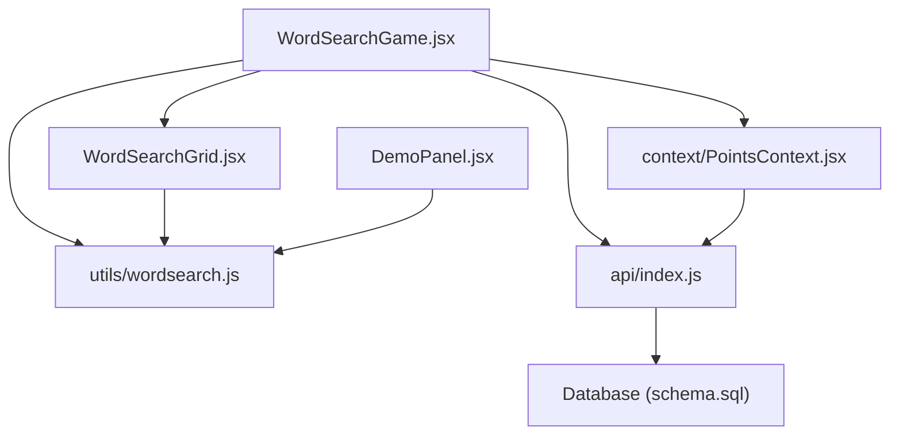
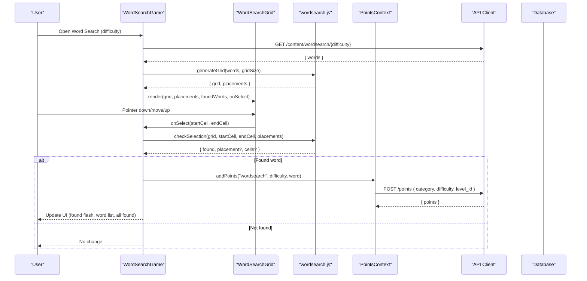
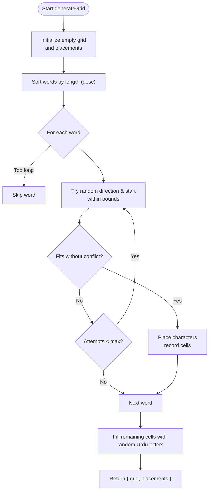
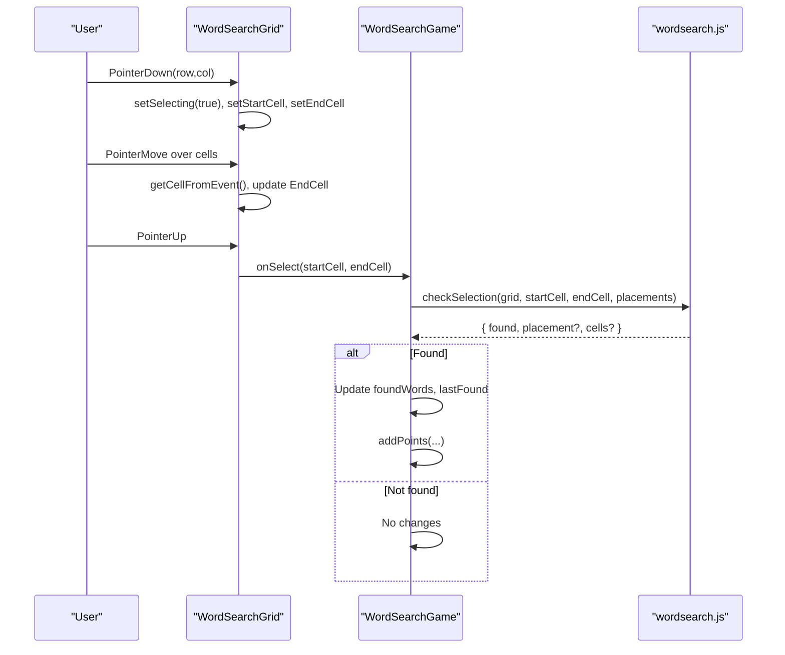
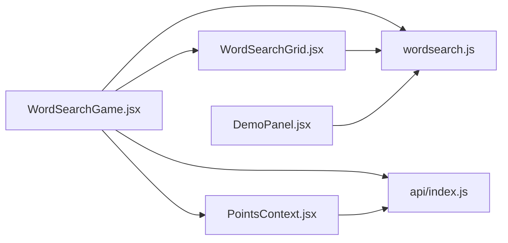
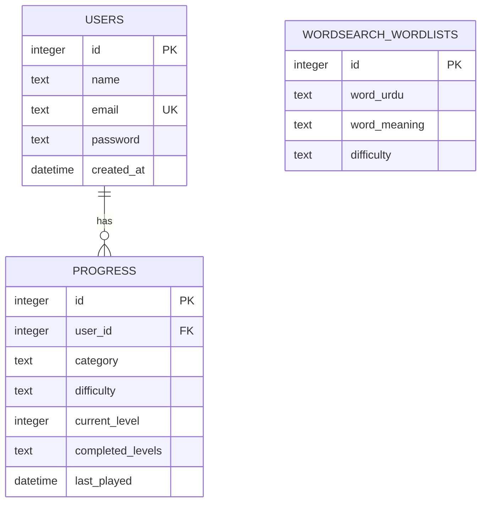

# Word Search Module

<cite>
**Referenced Files in This Document**
- [WordSearchGame.jsx](file://zabandaan/client/src/pages/wordsearch/WordSearchGame.jsx)
- [WordSearchGrid.jsx](file://zabandaan/client/src/pages/wordsearch/WordSearchGrid.jsx)
- [wordsearch.js](file://zabandaan/client/src/utils/wordsearch.js)
- [DemoPanel.jsx](file://zabandaan/client/src/pages/wordsearch/DemoPanel.jsx)
- [PointsContext.jsx](file://zabandaan/client/src/context/PointsContext.jsx)
- [scoring.js](file://zabandaan/client/src/utils/scoring.js)
- [schema.sql](file://zabandaan/database/schema.sql)
- [index.js (API)](file://zabandaan/client/src/api/index.js)
</cite>

## Table of Contents
1. Introduction
2. Project Structure
3. Core Components
4. Architecture Overview
5. Detailed Component Analysis
6. Dependency Analysis
7. Performance Considerations
8. Troubleshooting Guide
9. Conclusion
10. Appendices

## Introduction
This document explains the word search module’s implementation with a focus on dynamic grid generation, word placement algorithms, and interactive selection handling. It covers the WordSearchGrid component, utility functions for generating grids and validating selections, time-based challenge mechanics, vocabulary building system, difficulty scaling, progress tracking integration, points system, and achievement considerations. The goal is to make the module accessible to beginners while providing enough technical depth for experienced developers implementing similar puzzle games.

## Project Structure
The word search feature spans UI components, utilities, and context-driven state management:
- Game orchestration and flow: WordSearchGame.jsx
- Grid rendering and interaction: WordSearchGrid.jsx
- Grid generation and validation: wordsearch.js
- Demo tooling: DemoPanel.jsx
- Points and progress: PointsContext.jsx
- Scoring utilities (for other modules): scoring.js
- API client configuration: index.js (API)
- Data model for word lists and progress: schema.sql

**Diagram sources**
- [WordSearchGame.jsx:1-395](file://zabandaan/client/src/pages/wordsearch/WordSearchGame.jsx#L1-L395)
- [WordSearchGrid.jsx:1-189](file://zabandaan/client/src/pages/wordsearch/WordSearchGrid.jsx#L1-L189)
- [wordsearch.js:1-141](file://zabandaan/client/src/utils/wordsearch.js#L1-L141)
- [DemoPanel.jsx:1-260](file://zabandaan/client/src/pages/wordsearch/DemoPanel.jsx#L1-L260)
- [PointsContext.jsx:1-114](file://zabandaan/client/src/context/PointsContext.jsx#L1-L114)
- [index.js (API):1-30](file://zabandaan/client/src/api/index.js#L1-L30)
- [schema.sql:1-54](file://zabandaan/database/schema.sql#L1-L54)

**Section sources**
- [WordSearchGame.jsx:1-395](file://zabandaan/client/src/pages/wordsearch/WordSearchGame.jsx#L1-L395)
- [WordSearchGrid.jsx:1-189](file://zabandaan/client/src/pages/wordsearch/WordSearchGrid.jsx#L1-L189)
- [wordsearch.js:1-141](file://zabandaan/client/src/utils/wordsearch.js#L1-L141)
- [DemoPanel.jsx:1-260](file://zabandaan/client/src/pages/wordsearch/DemoPanel.jsx#L1-L260)
- [PointsContext.jsx:1-114](file://zabandaan/client/src/context/PointsContext.jsx#L1-L114)
- [index.js (API):1-30](file://zabandaan/client/src/api/index.js#L1-L30)
- [schema.sql:1-54](file://zabandaan/database/schema.sql#L1-L54)

## Core Components
- WordSearchGame: Orchestrates fetching words by difficulty, generating the grid, handling user selections, updating found words, integrating points, and managing UI states like loading, error, and completion.
- WordSearchGrid: Renders the grid, handles pointer/touch interactions for selecting cells, computes selected segments, and highlights found or currently selected cells.
- wordsearch.js: Implements generateGrid (grid creation and word placement) and checkSelection (validating user selections against placements).
- DemoPanel: Client-side demo that generates puzzles from user-provided Urdu words using the same generator.
- PointsContext: Manages points accumulation, guest vs authenticated flows, and persistence via localStorage or server.
- scoring.js: Utility for trace accuracy scoring (used elsewhere; not directly used by word search but relevant to overall scoring strategy).
- API client: Centralized axios instance with auth token injection and 401 handling.
- Database schema: Defines tables for users, progress, idioms, poetry, and word search wordlists.

**Section sources**
- [WordSearchGame.jsx:1-395](file://zabandaan/client/src/pages/wordsearch/WordSearchGame.jsx#L1-L395)
- [WordSearchGrid.jsx:1-189](file://zabandaan/client/src/pages/wordsearch/WordSearchGrid.jsx#L1-L189)
- [wordsearch.js:1-141](file://zabandaan/client/src/utils/wordsearch.js#L1-L141)
- [DemoPanel.jsx:1-260](file://zabandaan/client/src/pages/wordsearch/DemoPanel.jsx#L1-L260)
- [PointsContext.jsx:1-114](file://zabandaan/client/src/context/PointsContext.jsx#L1-L114)
- [scoring.js:1-151](file://zabandaan/client/src/utils/scoring.js#L1-L151)
- [index.js (API):1-30](file://zabandaan/client/src/api/index.js#L1-L30)
- [schema.sql:1-54](file://zabandaan/database/schema.sql#L1-L54)

## Architecture Overview
The word search module follows a clear separation of concerns:
- Game logic and state live in WordSearchGame.
- Rendering and interaction are encapsulated in WordSearchGrid.
- Pure algorithms for generation and validation are isolated in wordsearch.js.
- Points and progress are managed globally via PointsContext.
- Data comes from the backend via the API client and is persisted in the database according to schema.sql.

**Diagram sources**
- [WordSearchGame.jsx:26-86](file://zabandaan/client/src/pages/wordsearch/WordSearchGame.jsx#L26-L86)
- [WordSearchGrid.jsx:56-82](file://zabandaan/client/src/pages/wordsearch/WordSearchGrid.jsx#L56-L82)
- [wordsearch.js:20-99](file://zabandaan/client/src/utils/wordsearch.js#L20-L99)
- [wordsearch.js:102-140](file://zabandaan/client/src/utils/wordsearch.js#L102-L140)
- [PointsContext.jsx:12-46](file://zabandaan/client/src/context/PointsContext.jsx#L12-L46)
- [index.js (API):1-30](file://zabandaan/client/src/api/index.js#L1-L30)
- [schema.sql:9-18](file://zabandaan/database/schema.sql#L9-L18)

## Detailed Component Analysis

### Dynamic Grid Generation and Word Placement Algorithms
- Grid initialization: Creates an empty square grid sized by difficulty (e.g., 10x10 easy, 12x12 hard).
- Word sorting: Sorts words by length descending to place longer words first, improving packing efficiency.
- Direction set: Supports horizontal and vertical directions during placement.
- Placement loop: For each word, randomly selects direction and starting coordinates within bounds, checks fit (no conflicts unless characters match), and places characters if valid. Tracks cell coordinates per placement.
- Fallback fill: After placing words, fills remaining cells with random Urdu letters to create a realistic puzzle surface.
- Output: Returns both the filled grid and a placements array describing each placed word, its meaning, direction, and cell coordinates.

Complexity notes:
- Sorting words: O(W log W) where W is number of words.
- Placement attempts: Up to a fixed maxAttempts per word; worst-case O(W * maxAttempts * L) where L is average word length.
- Fill step: O(N^2) for N x N grid.

Optimization opportunities:
- Increase maxAttempts for harder difficulties or larger grids to improve success rate.
- Precompute allowed start positions per direction to reduce random retries.
- Use a more sophisticated backtracking algorithm if dense word sets cause frequent failures.

**Section sources**
- [wordsearch.js:20-99](file://zabandaan/client/src/utils/wordsearch.js#L20-L99)
- [WordSearchGame.jsx:24-39](file://zabandaan/client/src/pages/wordsearch/WordSearchGame.jsx#L24-L39)
- [DemoPanel.jsx:12-40](file://zabandaan/client/src/pages/wordsearch/DemoPanel.jsx#L12-L40)

#### Algorithm Flowchart

**Diagram sources**
- [wordsearch.js:20-99](file://zabandaan/client/src/utils/wordsearch.js#L20-L99)

### Interactive Selection Handling
- Input capture: WordSearchGrid supports both mouse and touch events. It uses elementFromPoint to resolve the cell under the pointer during move events.
- Selection state: Maintains startCell and endCell while selecting, computing intermediate cells along straight lines (horizontal, vertical, diagonal).
- Highlighting: Uses memoized sets to efficiently compute found cells and selected cells for visual feedback.
- Submission: On pointer up, passes start and end cells to the parent handler for validation.

Performance considerations:
- Memoization avoids recalculating sets on every render.
- Event resolution uses DOM queries only when needed.

Accessibility and consistency:
- Prevents default behaviors to avoid scrolling during selection.
- Disables text selection to prevent accidental text highlighting.

**Section sources**
- [WordSearchGrid.jsx:4-82](file://zabandaan/client/src/pages/wordsearch/WordSearchGrid.jsx#L4-L82)
- [WordSearchGrid.jsx:84-159](file://zabandaan/client/src/pages/wordsearch/WordSearchGrid.jsx#L84-L159)

#### Interaction Sequence Diagram

**Diagram sources**
- [WordSearchGrid.jsx:56-82](file://zabandaan/client/src/pages/wordsearch/WordSearchGrid.jsx#L56-L82)
- [WordSearchGame.jsx:52-77](file://zabandaan/client/src/pages/wordsearch/WordSearchGame.jsx#L52-L77)
- [wordsearch.js:102-140](file://zabandaan/client/src/utils/wordsearch.js#L102-L140)

### Validation of Selections
- Direction inference: Computes delta between start and end to determine movement vector.
- Cell path construction: Builds a sequence of cells along the straight line from start to end.
- Matching: Compares the selected string against each placement’s word string; also checks reverse matching to support backward selections.
- Result: Returns whether a word was found, the associated placement metadata, and the exact cells selected.

Edge cases handled:
- Diagonal selections supported by sign-based deltas.
- Reverse matches allow users to select backwards and still be recognized.

**Section sources**
- [wordsearch.js:102-140](file://zabandaan/client/src/utils/wordsearch.js#L102-L140)

### Time-Based Challenge Mechanics
- Current implementation does not include a timer or countdown.
- Suggested enhancements:
  - Add a visible countdown timer to increase engagement.
  - Introduce time bonuses for faster completions.
  - Persist best times per difficulty in progress tracking.

[No sources needed since this section proposes conceptual enhancements]

### Vocabulary Building System
- Words are fetched from the backend based on difficulty and include Urdu text and meanings.
- The game displays a word list showing found status and meanings after discovery.
- Audio playback is integrated via a speaker icon component for pronunciation support.

Integration points:
- Backend endpoint: /content/wordsearch/{difficulty} returns words.
- Word list table: wordsearch_wordlists stores words with difficulty tags.

**Section sources**
- [WordSearchGame.jsx:26-49](file://zabandaan/client/src/pages/wordsearch/WordSearchGame.jsx#L26-L49)
- [WordSearchGame.jsx:175-213](file://zabandaan/client/src/pages/wordsearch/WordSearchGame.jsx#L175-L213)
- [schema.sql:33-38](file://zabandaan/database/schema.sql#L33-L38)

### Difficulty Scaling
- Grid size scales with difficulty: 10x10 for easy, 12x12 for hard.
- Larger grids provide more space but can affect placement success rates; consider adjusting maxAttempts accordingly.

**Section sources**
- [WordSearchGame.jsx:24-39](file://zabandaan/client/src/pages/wordsearch/WordSearchGame.jsx#L24-L39)

### Progress Tracking Integration
- Points are added upon finding a word via PointsContext.
- Guest mode persists completed levels locally; authenticated users sync points to the server.
- Progress table schema supports categories, difficulties, and completed levels.

**Section sources**
- [PointsContext.jsx:12-46](file://zabandaan/client/src/context/PointsContext.jsx#L12-L46)
- [schema.sql:9-18](file://zabandaan/database/schema.sql#L9-L18)

### Points System and Achievement Tracking
- Points increment on successful word discovery.
- Animations provide visual feedback when points increase.
- Achievements could be extended by adding thresholds or badges tied to completed levels or total points.

**Section sources**
- [WordSearchGame.jsx:70-76](file://zabandaan/client/src/pages/wordsearch/WordSearchGame.jsx#L70-L76)
- [PointsContext.jsx:12-46](file://zabandaan/client/src/context/PointsContext.jsx#L12-L46)
- [PointsBadge.jsx:1-24](file://zabandaan/client/src/components/PointsBadge.jsx#L1-L24)

### Demo Panel
- Allows users to paste Urdu words and generate a puzzle client-side using the same generator.
- Displays generated grid and listed placements with directions.
- Useful for testing and debugging word placement behavior.

**Section sources**
- [DemoPanel.jsx:12-40](file://zabandaan/client/src/pages/wordsearch/DemoPanel.jsx#L12-L40)
- [DemoPanel.jsx:68-125](file://zabandaan/client/src/pages/wordsearch/DemoPanel.jsx#L68-L125)

## Dependency Analysis
- WordSearchGame depends on:
  - API client to fetch words by difficulty.
  - wordsearch.js for grid generation and selection validation.
  - PointsContext for scoring and progress.
  - WordSearchGrid for rendering and interaction.
- WordSearchGrid depends on:
  - wordsearch.js indirectly through WordSearchGame’s validation results.
- DemoPanel depends on:
  - wordsearch.js for client-side generation.
- PointsContext depends on:
  - API client for authenticated point updates.
  - LocalStorage for guest progress.

**Diagram sources**
- [WordSearchGame.jsx:1-395](file://zabandaan/client/src/pages/wordsearch/WordSearchGame.jsx#L1-L395)
- [WordSearchGrid.jsx:1-189](file://zabandaan/client/src/pages/wordsearch/WordSearchGrid.jsx#L1-L189)
- [wordsearch.js:1-141](file://zabandaan/client/src/utils/wordsearch.js#L1-L141)
- [DemoPanel.jsx:1-260](file://zabandaan/client/src/pages/wordsearch/DemoPanel.jsx#L1-L260)
- [PointsContext.jsx:1-114](file://zabandaan/client/src/context/PointsContext.jsx#L1-L114)
- [index.js (API):1-30](file://zabandaan/client/src/api/index.js#L1-L30)

**Section sources**
- [WordSearchGame.jsx:1-395](file://zabandaan/client/src/pages/wordsearch/WordSearchGame.jsx#L1-L395)
- [WordSearchGrid.jsx:1-189](file://zabandaan/client/src/pages/wordsearch/WordSearchGrid.jsx#L1-L189)
- [wordsearch.js:1-141](file://zabandaan/client/src/utils/wordsearch.js#L1-L141)
- [DemoPanel.jsx:1-260](file://zabandaan/client/src/pages/wordsearch/DemoPanel.jsx#L1-L260)
- [PointsContext.jsx:1-114](file://zabandaan/client/src/context/PointsContext.jsx#L1-L114)
- [index.js (API):1-30](file://zabandaan/client/src/api/index.js#L1-L30)

## Performance Considerations
- Grid generation performance:
  - Ensure maxAttempts is sufficient for large grids or many words.
  - Consider caching generated grids per difficulty and word set to avoid regeneration.
- Selection validation:
  - checkSelection iterates placements; keep placements count reasonable.
  - Early exit on match reduces unnecessary comparisons.
- Rendering performance:
  - useMemo for found and selected cell sets prevents redundant computations.
  - Avoid excessive re-renders by minimizing state updates inside event handlers.
- Touch/mouse consistency:
  - Unified pointer handling ensures consistent behavior across devices.
  - Prevent default actions to avoid scroll interference during selection.

[No sources needed since this section provides general guidance]

## Troubleshooting Guide
Common issues and resolutions:
- Grid generation fails to place words:
  - Increase maxAttempts or adjust grid size relative to word lengths.
  - Reduce number of words or ensure they fit within grid constraints.
- Word overlap prevention:
  - The generator enforces no conflicts unless characters match; verify placement logic if overlaps occur unexpectedly.
- Touch/mouse interaction inconsistencies:
  - Confirm pointer events are attached correctly and default behaviors prevented.
  - Validate elementFromPoint usage and data attributes on cells.
- Points not updating:
  - Check API connectivity and authentication token presence.
  - Verify PointsContext addPoints calls and responses.

**Section sources**
- [wordsearch.js:20-99](file://zabandaan/client/src/utils/wordsearch.js#L20-L99)
- [WordSearchGrid.jsx:43-82](file://zabandaan/client/src/pages/wordsearch/WordSearchGrid.jsx#L43-L82)
- [PointsContext.jsx:12-46](file://zabandaan/client/src/context/PointsContext.jsx#L12-L46)
- [index.js (API):1-30](file://zabandaan/client/src/api/index.js#L1-L30)

## Conclusion
The word search module provides a robust foundation for dynamic grid generation, interactive selection, and scoring integration. Its modular design separates concerns effectively, enabling maintainability and extensibility. Future enhancements such as timers, advanced placement strategies, and richer achievements can further improve user engagement and learning outcomes.

[No sources needed since this section summarizes without analyzing specific files]

## Appendices

### Data Model for Word Search and Progress

**Diagram sources**
- [schema.sql:1-18](file://zabandaan/database/schema.sql#L1-L18)
- [schema.sql:33-38](file://zabandaan/database/schema.sql#L33-L38)